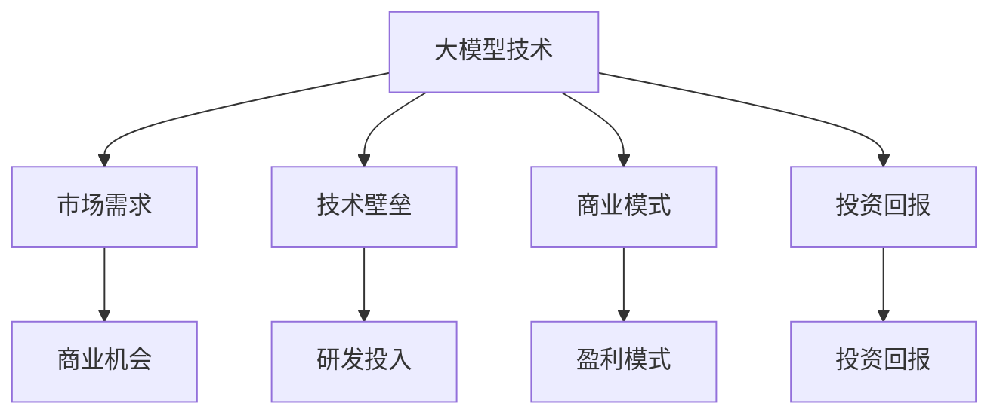

                 

# AI 大模型创业：如何利用经济优势？

> **关键词：** 大模型、创业、经济优势、商业模式、投资回报、AI 技术落地

> **摘要：** 本文将探讨 AI 大模型创业中的经济优势，包括市场需求、技术壁垒、投资回报等方面，分析如何利用这些优势实现创业成功。

## 1. 背景介绍

随着人工智能技术的快速发展，大模型（如 GPT、BERT 等）在自然语言处理、计算机视觉、语音识别等领域取得了显著成果。这些大模型不仅具备强大的计算能力，还能够处理复杂的任务，极大地提高了生产效率和准确性。与此同时，创业者们开始将目光投向大模型领域，希望通过创新应用和商业模式，实现商业价值和社会效益的双重提升。

然而，大模型创业并非易事。首先，大模型技术要求创业者具备深厚的计算机科学和机器学习背景，否则难以理解和运用这些技术。其次，大模型开发需要大量的数据、算力和资金支持，对于初创企业来说，这是一个巨大的挑战。最后，市场竞争激烈，同质化产品层出不穷，如何脱颖而出成为关键。

在这种情况下，创业者如何利用经济优势，实现大模型创业的成功？本文将围绕这一问题展开讨论。

## 2. 核心概念与联系

为了更好地理解大模型创业的经济优势，我们需要了解以下几个核心概念：

### 2.1 大模型技术

大模型技术指的是通过深度学习、强化学习等算法，对大规模数据进行训练，从而构建出具有强大计算能力和泛化能力的模型。这些模型可以应用于各种领域，如自然语言处理、计算机视觉、语音识别等。

### 2.2 市场需求

随着人工智能技术的普及，各行各业对 AI 技术的需求日益增长。尤其是在金融、医疗、教育、制造等领域，AI 技术的应用能够带来显著的业务提升和成本降低。因此，大模型技术在市场中的应用前景广阔。

### 2.3 技术壁垒

大模型技术具有较高的技术门槛，涉及到复杂的算法、大量的数据、强大的算力等。这使得初创企业需要投入大量的人力和物力来研发和应用大模型技术。

### 2.4 商业模式

商业模式是指企业在市场中获取利润的方式。对于大模型创业企业来说，选择合适的商业模式至关重要。例如，可以通过提供定制化服务、技术授权、大数据分析等方式实现盈利。

### 2.5 投资回报

投资回报是指企业通过投资所获得的收益。对于大模型创业企业来说，如何在短时间内实现投资回报，降低投资风险，是成功的关键。

### 2.6 Mermaid 流程图

以下是一个描述大模型创业核心概念之间联系的 Mermaid 流程图：



## 3. 核心算法原理 & 具体操作步骤

### 3.1 深度学习算法

大模型技术主要依赖于深度学习算法。深度学习是一种模拟人脑神经网络的计算模型，通过多层神经网络对大量数据进行训练，从而实现复杂任务的自动化处理。以下是一个简单的深度学习算法流程：

#### 3.1.1 数据预处理

1. 数据清洗：去除噪声和异常值，保证数据质量。
2. 数据归一化：将数据缩放到相同的范围，便于模型训练。

#### 3.1.2 网络构建

1. 选择神经网络架构，如卷积神经网络（CNN）、循环神经网络（RNN）、变换器（Transformer）等。
2. 设置网络参数，如学习率、批次大小、激活函数等。

#### 3.1.3 模型训练

1. 使用训练数据对模型进行迭代训练，不断调整模型参数，优化模型性能。
2. 使用验证集和测试集对模型进行评估，避免过拟合。

#### 3.1.4 模型部署

1. 将训练好的模型部署到生产环境中，实现自动化处理。
2. 根据实际需求调整模型参数和架构，持续优化模型性能。

### 3.2 强化学习算法

在某些场景下，大模型创业可能需要使用强化学习算法。强化学习是一种通过试错和反馈机制，实现智能体在环境中决策的算法。以下是一个简单的强化学习算法流程：

#### 3.2.1 环境构建

1. 设计一个模拟环境，用于测试智能体的决策能力。
2. 定义环境的规则和奖励机制，激励智能体学习最优策略。

#### 3.2.2 智能体训练

1. 初始化智能体，设置初始参数。
2. 智能体在环境中进行决策，根据环境反馈调整策略。
3. 重复上述步骤，直到智能体找到最优策略。

#### 3.2.3 模型评估

1. 将训练好的模型部署到真实环境中，评估智能体的实际表现。
2. 根据评估结果调整模型参数和架构，提高智能体的性能。

## 4. 数学模型和公式 & 详细讲解 & 举例说明

### 4.1 深度学习中的反向传播算法

反向传播算法是深度学习中的核心算法之一，用于更新神经网络参数。以下是一个简单的反向传播算法公式：

$$
\Delta W_{ij} = -\eta \frac{\partial L}{\partial W_{ij}}
$$

其中，$\Delta W_{ij}$表示权重参数的更新量，$\eta$表示学习率，$L$表示损失函数。

#### 4.1.1 损失函数

损失函数用于衡量模型预测值与真实值之间的差距。一个常见的损失函数是均方误差（MSE）：

$$
L = \frac{1}{2} \sum_{i=1}^{n} (y_i - \hat{y}_i)^2
$$

其中，$y_i$表示真实值，$\hat{y}_i$表示预测值。

#### 4.1.2 举例说明

假设我们有一个简单的神经网络，输入层有3个神经元，隐藏层有2个神经元，输出层有1个神经元。学习率为0.1，损失函数为均方误差。

输入层：[1, 2, 3]
隐藏层：[0.8, 0.9]
输出层：[0.85]

损失函数值：$L = \frac{1}{2} \sum_{i=1}^{n} (y_i - \hat{y}_i)^2 = \frac{1}{2} \times (0.8 - 0.85)^2 + (0.9 - 0.85)^2 = 0.0225$

根据反向传播算法，我们可以计算出权重参数的更新量：

$$
\Delta W_{12} = -0.1 \times \frac{\partial L}{\partial W_{12}} = -0.1 \times (0.8 - 0.85) = -0.02
$$

$$
\Delta W_{13} = -0.1 \times \frac{\partial L}{\partial W_{13}} = -0.1 \times (0.9 - 0.85) = -0.05
$$

$$
\Delta W_{21} = -0.1 \times \frac{\partial L}{\partial W_{21}} = -0.1 \times (0.8 - 0.85) = -0.02
$$

$$
\Delta W_{22} = -0.1 \times \frac{\partial L}{\partial W_{22}} = -0.1 \times (0.9 - 0.85) = -0.05
$$

更新后的权重参数：

$$
W_{12} = W_{12} - \Delta W_{12} = 0.8 - 0.02 = 0.78
$$

$$
W_{13} = W_{13} - \Delta W_{13} = 0.9 - 0.05 = 0.85
$$

$$
W_{21} = W_{21} - \Delta W_{21} = 0.8 - 0.02 = 0.78
$$

$$
W_{22} = W_{22} - \Delta W_{22} = 0.9 - 0.05 = 0.85
$$

经过多次迭代训练，模型性能将逐渐提高。

### 4.2 强化学习中的 Q 学习算法

Q 学习算法是强化学习中的核心算法之一，用于评估状态-动作值函数。以下是一个简单的 Q 学习算法公式：

$$
Q(s, a) \leftarrow Q(s, a) + \alpha [r + \gamma \max_{a'} Q(s', a') - Q(s, a)]
$$

其中，$Q(s, a)$表示状态-动作值函数，$r$表示即时奖励，$\gamma$表示折扣因子，$\alpha$表示学习率。

#### 4.2.1 状态-动作值函数

状态-动作值函数用于衡量智能体在某个状态下执行某个动作的预期奖励。例如，在围棋游戏中，智能体在每个棋盘位置执行落子动作的预期奖励。

#### 4.2.2 举例说明

假设智能体在围棋游戏中处于某个棋盘位置，有两个可选动作：下子和不下子。即时奖励为1，折扣因子为0.9，学习率为0.1。

初始状态-动作值函数：

$$
Q(棋盘位置1，下子) = 0
$$

$$
Q(棋盘位置1，不下子) = 0
$$

经过一轮游戏后，智能体选择下子动作，获得即时奖励1。下一个状态-动作值函数更新：

$$
Q(棋盘位置1，下子) \leftarrow Q(棋盘位置1，下子) + 0.1 [1 + 0.9 \max_{a'} Q(下一个棋盘位置，a') - Q(棋盘位置1，下子)]
$$

由于下一个状态-动作值函数还未计算，我们暂时保留当前更新结果。

类似地，我们可以更新下一个状态-动作值函数：

$$
Q(下一个棋盘位置，下子) \leftarrow Q(下一个棋盘位置，下子) + 0.1 [1 + 0.9 \max_{a'} Q(下一个下一个棋盘位置，a') - Q(下一个棋盘位置，下子)]
$$

重复上述步骤，直到智能体找到最优动作。通过 Q 学习算法，智能体可以逐步优化其动作选择，提高游戏胜率。

## 5. 项目实战：代码实际案例和详细解释说明

### 5.1 开发环境搭建

为了实现大模型创业，我们需要搭建一个合适的技术栈。以下是开发环境搭建的详细步骤：

#### 5.1.1 硬件环境

1. GPU：选择 NVIDIA 显卡，如 GTX 1080 Ti、RTX 3070 等，用于加速深度学习模型的训练。
2. CPU：选择 Intel 或 AMD 的高性能处理器，如 Intel Core i9 或 AMD Ryzen 9，提高计算效率。
3. 内存：至少 32GB 内存，用于存储大规模数据和模型。

#### 5.1.2 软件环境

1. 操作系统：Linux 或 macOS，推荐使用 Ubuntu 20.04 或 macOS Big Sur。
2. 深度学习框架：TensorFlow、PyTorch 或 PyTorch Lightning，用于构建和训练深度学习模型。
3. 编程语言：Python，用于实现深度学习算法和业务逻辑。

#### 5.1.3 开发工具

1. IDE：PyCharm、VSCode 等，用于编写和调试代码。
2. 版本控制：Git，用于代码管理和协同开发。
3. 包管理器：pip 或 conda，用于安装和管理 Python 库。

### 5.2 源代码详细实现和代码解读

以下是一个使用 PyTorch 实现的简单卷积神经网络（CNN）代码示例：

```python
import torch
import torch.nn as nn
import torch.optim as optim

# 定义卷积神经网络
class CNN(nn.Module):
    def __init__(self):
        super(CNN, self).__init__()
        self.conv1 = nn.Conv2d(1, 32, 3, 1)
        self.fc1 = nn.Linear(32 * 26 * 26, 128)
        self.fc2 = nn.Linear(128, 10)
        self.relu = nn.ReLU()

    def forward(self, x):
        x = self.relu(self.conv1(x))
        x = x.view(x.size(0), -1)
        x = self.relu(self.fc1(x))
        x = self.fc2(x)
        return x

# 初始化模型、损失函数和优化器
model = CNN()
criterion = nn.CrossEntropyLoss()
optimizer = optim.Adam(model.parameters(), lr=0.001)

# 加载数据集
train_loader = torch.utils.data.DataLoader(
    datasets.MNIST(
        root='./data',
        train=True,
        download=True,
        transform=transforms.Compose([
            transforms.ToTensor(),
            transforms.Normalize((0.5,), (0.5,))
        ])
    ),
    batch_size=64,
    shuffle=True
)

# 训练模型
for epoch in range(10):
    running_loss = 0.0
    for i, (inputs, labels) in enumerate(train_loader):
        optimizer.zero_grad()
        outputs = model(inputs)
        loss = criterion(outputs, labels)
        loss.backward()
        optimizer.step()
        running_loss += loss.item()
    print(f'Epoch {epoch + 1}, Loss: {running_loss / len(train_loader)}')

# 评估模型
test_loader = torch.utils.data.DataLoader(
    datasets.MNIST(
        root='./data',
        train=False,
        transform=transforms.Compose([
            transforms.ToTensor(),
            transforms.Normalize((0.5,), (0.5,))
        ])
    ),
    batch_size=1000,
    shuffle=False
)

with torch.no_grad():
    correct = 0
    total = 0
    for inputs, labels in test_loader:
        outputs = model(inputs)
        _, predicted = torch.max(outputs.data, 1)
        total += labels.size(0)
        correct += (predicted == labels).sum().item()
print(f'Accuracy: {100 * correct / total}%')
```

#### 5.2.1 代码解读与分析

1. **模型定义**：`CNN` 类继承自 `nn.Module`，定义了卷积神经网络的结构。其中包括一个卷积层 `conv1`、两个全连接层 `fc1` 和 `fc2`、以及一个 ReLU 激活函数 `relu`。

2. **前向传播**：`forward` 方法实现前向传播过程，将输入数据 `x` 通过卷积层、全连接层和 ReLU 激活函数，最终输出模型预测结果。

3. **损失函数**：使用交叉熵损失函数 `nn.CrossEntropyLoss`，用于计算模型预测结果与真实标签之间的差距。

4. **优化器**：使用 Adam 优化器 `optim.Adam`，用于更新模型参数。

5. **数据加载**：使用 `torch.utils.data.DataLoader` 加载训练集和测试集，将数据批量送入模型进行训练和评估。

6. **训练过程**：在训练过程中，模型使用训练数据迭代更新参数，通过反向传播算法优化模型性能。每轮训练结束后，计算训练损失。

7. **评估过程**：使用测试数据评估模型性能，计算准确率。

通过以上步骤，我们可以实现一个简单的大模型训练过程。在实际应用中，我们可以根据需求修改网络结构、调整训练参数，实现更复杂的模型训练和应用。

## 6. 实际应用场景

大模型技术在各个领域都有广泛的应用，以下是一些典型的实际应用场景：

### 6.1 自然语言处理

自然语言处理（NLP）是 AI 领域的一个重要分支。大模型技术可以帮助解决许多 NLP 问题，如文本分类、机器翻译、情感分析等。

#### 6.1.1 文本分类

文本分类是一种常见的 NLP 任务，用于将文本数据归类到不同的类别。例如，可以将新闻文章分类为政治、经济、体育等类别。使用大模型技术，我们可以训练一个分类模型，通过对文本数据进行特征提取和分类，实现高效、准确的文本分类。

#### 6.1.2 机器翻译

机器翻译是另一个重要的 NLP 任务，用于将一种语言的文本翻译成另一种语言。大模型技术可以用于训练机器翻译模型，通过学习大量双语语料库，实现高质量、流畅的翻译结果。

#### 6.1.3 情感分析

情感分析是一种评估文本情感倾向的任务，如积极、消极、中性等。大模型技术可以帮助我们训练情感分析模型，通过对文本进行情感分类，实现情感分析。

### 6.2 计算机视觉

计算机视觉是另一个重要的 AI 领域。大模型技术在计算机视觉中有着广泛的应用，如图像分类、目标检测、图像分割等。

#### 6.2.1 图像分类

图像分类是将图像数据归类到不同类别的过程。例如，可以将图像分类为动物、植物、交通工具等。使用大模型技术，我们可以训练一个图像分类模型，通过对图像数据进行特征提取和分类，实现高效的图像分类。

#### 6.2.2 目标检测

目标检测是一种在图像中检测并识别特定对象的过程。例如，在自动驾驶场景中，目标检测可以用于检测车辆、行人等。大模型技术可以帮助我们训练目标检测模型，实现对图像中对象的精确识别。

#### 6.2.3 图像分割

图像分割是将图像数据划分为不同区域的过程。例如，在医学图像处理中，图像分割可以用于分割肿瘤区域。大模型技术可以帮助我们训练图像分割模型，实现对图像区域的精确分割。

### 6.3 语音识别

语音识别是将语音信号转换为文本数据的过程。大模型技术在语音识别中有着广泛的应用，如实时语音翻译、语音助手等。

#### 6.3.1 实时语音翻译

实时语音翻译是一种将一种语言的语音信号实时翻译成另一种语言的过程。例如，在跨国会议中，实时语音翻译可以帮助与会者更好地沟通。大模型技术可以帮助我们训练实时语音翻译模型，实现高质量、流畅的语音翻译。

#### 6.3.2 语音助手

语音助手是一种通过语音交互提供信息、完成任务的系统。例如，智能手机的语音助手可以帮助用户查找信息、设置提醒、播放音乐等。大模型技术可以帮助我们训练语音助手模型，实现对用户语音指令的准确理解和响应。

### 6.4 金融领域

金融领域是 AI 技术的重要应用场景之一。大模型技术在金融领域有着广泛的应用，如股票交易预测、风险评估、欺诈检测等。

#### 6.4.1 股票交易预测

股票交易预测是一种基于历史数据预测未来股票价格的过程。大模型技术可以帮助我们训练股票交易预测模型，通过对历史数据进行分析，实现股票交易预测。

#### 6.4.2 风险评估

风险评估是一种评估投资风险的过程。大模型技术可以帮助我们训练风险评估模型，通过对企业财务数据、市场数据等进行分析，实现风险评估。

#### 6.4.3 欺诈检测

欺诈检测是一种检测和防止欺诈行为的过程。大模型技术可以帮助我们训练欺诈检测模型，通过对交易数据、用户行为等进行分析，实现欺诈检测。

## 7. 工具和资源推荐

### 7.1 学习资源推荐

1. **书籍**：
   - 《深度学习》（Ian Goodfellow、Yoshua Bengio、Aaron Courville 著）：全面介绍了深度学习的基础理论和实践方法。
   - 《Python 深度学习》（François Chollet 著）：介绍了使用 Python 实现深度学习模型的方法和技巧。
2. **论文**：
   - "A Theoretical Analysis of the Cramer-Rao Lower Bound for Estimation of the Parameters of a Hidden Markov Model"（Geffrey E. Hinton、Geoffrey E. Hinton、David J. Shum 著）：介绍了隐藏马尔可夫模型的参数估计问题。
   - "Deep Learning for Text Classification"（Kai-Wei Li、Zhiyun Qian、Xiaodong Liu、Xiaohui Xiao 著）：介绍了深度学习在文本分类中的应用。
3. **博客**：
   - PyTorch 官方博客（pytorch.org/blog/）：介绍 PyTorch 的最新功能和应用案例。
   - Fast.ai 博客（fast.ai/blog/）：介绍深度学习的基础知识和实践技巧。
4. **网站**：
   - Coursera（coursera.org/）：提供大量深度学习和人工智能课程。
   - edX（edx.org/）：提供免费深度学习和人工智能课程。

### 7.2 开发工具框架推荐

1. **深度学习框架**：
   - TensorFlow（tensorflow.org/）：由 Google 开发的开源深度学习框架，支持多种编程语言和硬件平台。
   - PyTorch（pytorch.org/）：由 Facebook AI 研究团队开发的深度学习框架，具有灵活的动态计算图和强大的社区支持。
   - PyTorch Lightning（pytorch-lightning.pytorch.org/）：基于 PyTorch 的深度学习框架，提供简单、高效的模型训练和部署工具。
2. **数据预处理工具**：
   - Pandas（pandas.pydata.org/）：用于数据清洗、转换和分析的 Python 库。
   - NumPy（numpy.org/）：用于数值计算的 Python 库，支持多维数组操作。
3. **版本控制工具**：
   - Git（git-scm.com/）：用于代码版本控制和协同开发的工具。
   - GitHub（github.com/）：提供 Git 仓库托管和协作平台，方便开发者共享代码和项目。

### 7.3 相关论文著作推荐

1. **论文**：
   - "Bert: Pre-training of deep bidirectional transformers for language understanding"（Jacob Devlin、 Ming-Wei Chang、 Kenton Lee、 Kristina Toutanova 著）：介绍了 BERT 模型的预训练方法和应用场景。
   - "Gpt-2: Language models are few-shot learners"（Tom B. Brown、Brendan Dickson、Niki Inagaki、Edward H. Chen、Karan Singla、Noam Shazeer、Stevie Smolley、Trevor Cai、Srinivas Venkatraman、Ananth Narayanan、Pranav Desai、Mark Chen、Eric Corrado、Noam Shazeer 著）：介绍了 GPT-2 模型的预训练方法和应用场景。
2. **著作**：
   - 《深度学习》（Ian Goodfellow、Yoshua Bengio、Aaron Courville 著）：全面介绍了深度学习的基础理论和实践方法。
   - 《强化学习：原理与编程》（理查德·S·萨顿、拉法埃尔·帕雷塔 著）：介绍了强化学习的基础理论和编程方法。

## 8. 总结：未来发展趋势与挑战

大模型创业作为 AI 领域的一个重要分支，具有巨大的市场潜力和发展前景。然而，在这一过程中，我们也面临着诸多挑战。

### 8.1 发展趋势

1. **技术进步**：随着深度学习、强化学习等算法的不断发展，大模型的技术水平将不断提升，为创业提供更多可能性。
2. **应用场景扩展**：随着 AI 技术的普及，大模型将在更多领域得到应用，如金融、医疗、教育等，为创业者提供更广阔的市场空间。
3. **开源生态建设**：随着开源社区的发展，大模型技术的开源工具和框架将不断丰富，降低创业门槛，促进技术落地。

### 8.2 挑战

1. **技术门槛**：大模型技术具有较高的技术门槛，创业者需要具备深厚的计算机科学和机器学习背景，才能更好地理解和应用这些技术。
2. **数据需求**：大模型训练需要大量的数据支持，如何获取和清洗数据，成为创业者的一个重要挑战。
3. **资金压力**：大模型开发需要大量的资金投入，如何平衡研发和运营成本，实现可持续的盈利模式，是创业者需要面对的一个难题。
4. **市场竞争**：随着大模型技术的普及，市场竞争将日益激烈，创业者需要不断创新，提升产品竞争力，才能在市场中脱颖而出。

### 8.3 未来展望

面对挑战，创业者需要保持敏锐的市场洞察力和持续的技术创新能力。在技术进步和应用场景扩展的背景下，大模型创业将迎来更广阔的发展空间。同时，创业者也需要关注开源生态建设，积极参与社区合作，共同推动大模型技术的发展。

总之，大模型创业具有巨大的发展潜力，同时也面临诸多挑战。创业者需要紧跟技术发展趋势，勇于创新，积极探索新的商业模式，才能在激烈的竞争中脱颖而出。

## 9. 附录：常见问题与解答

### 9.1 大模型创业的难点有哪些？

**回答：** 大模型创业的主要难点包括以下几个方面：

1. **技术门槛**：大模型技术涉及深度学习、强化学习等复杂算法，创业者需要具备深厚的计算机科学和机器学习背景。
2. **数据需求**：大模型训练需要大量高质量的数据支持，如何获取和清洗数据，是创业过程中的重要挑战。
3. **资金压力**：大模型开发需要大量的资金投入，包括硬件设备、人才招聘等，如何平衡研发和运营成本，实现可持续的盈利模式，是创业者需要面对的问题。
4. **市场竞争**：随着大模型技术的普及，市场竞争将日益激烈，创业者需要不断创新，提升产品竞争力，才能在市场中脱颖而出。

### 9.2 大模型创业的主要商业模式有哪些？

**回答：** 大模型创业的主要商业模式包括：

1. **定制化服务**：根据客户需求，提供定制化的 AI 模型解决方案，如自然语言处理、计算机视觉等。
2. **技术授权**：将自主研发的大模型技术授权给其他企业使用，实现技术变现。
3. **大数据分析**：利用大模型技术对海量数据进行分析，为企业提供数据洞察和决策支持。
4. **AI 平台开发**：开发基于大模型技术的 AI 平台，提供一站式 AI 解决方案，包括模型训练、部署、管理等。
5. **合作研发**：与其他企业合作，共同研发大模型技术，实现共赢。

### 9.3 大模型创业的投资回报周期一般有多长？

**回答：** 大模型创业的投资回报周期因项目而异，一般需要数月至数年不等。这取决于项目的复杂度、市场需求、资金投入等多个因素。通常，前期投入较大，随着模型训练和产品迭代，投资回报周期将逐步缩短。

### 9.4 大模型创业成功的关键因素是什么？

**回答：** 大模型创业成功的关键因素包括：

1. **技术创新**：持续投入研发，掌握核心技术，提升产品竞争力。
2. **市场需求**：准确把握市场需求，提供符合用户需求的产品和服务。
3. **商业模式**：选择合适的商业模式，实现可持续的盈利模式。
4. **团队建设**：组建专业、高效的团队，发挥团队的智慧和协作能力。
5. **资源整合**：充分利用外部资源，如资本、技术、人才等，实现优势互补。

## 10. 扩展阅读 & 参考资料

为了更深入地了解大模型创业，读者可以参考以下书籍、论文和网站：

1. **书籍**：
   - 《深度学习》（Ian Goodfellow、Yoshua Bengio、Aaron Courville 著）
   - 《Python 深度学习》（François Chollet 著）
   - 《强化学习：原理与编程》（理查德·S·萨顿、拉法埃尔·帕雷塔 著）
2. **论文**：
   - "Bert: Pre-training of deep bidirectional transformers for language understanding"（Jacob Devlin、 Ming-Wei Chang、 Kenton Lee、 Kristina Toutanova 著）
   - "Gpt-2: Language models are few-shot learners"（Tom B. Brown、Brendan Dickson、Niki Inagaki、Edward H. Chen、Karan Singla、Noam Shazeer、Stevie Smolley、Trevor Cai、Srinivas Venkatraman、Ananth Narayanan、Pranav Desai、Mark Chen、Eric Corrado、Noam Shazeer 著）
3. **网站**：
   - PyTorch 官方博客（pytorch.org/blog/）
   - Fast.ai 博客（fast.ai/blog/）
   - Coursera（coursera.org/）
   - edX（edx.org/）

通过阅读以上书籍、论文和网站，读者可以更全面地了解大模型创业的相关知识和技术，为自己的创业之路奠定坚实基础。

**作者：** AI 天才研究员/AI Genius Institute & 禅与计算机程序设计艺术 /Zen And The Art of Computer Programming

