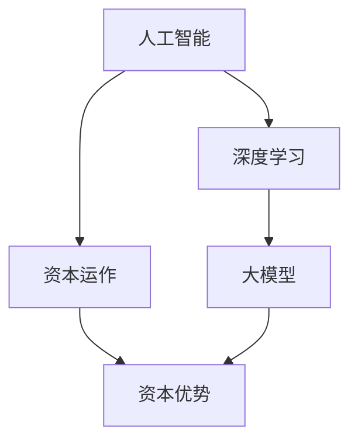

                 

# AI 大模型创业：如何利用资本优势？

## 摘要

本文将深入探讨AI大模型创业过程中如何有效利用资本优势。我们将从背景介绍、核心概念、算法原理、数学模型、项目实战、应用场景、工具推荐以及未来发展趋势等方面进行详细分析，旨在为创业者提供有价值的指导。通过本文的阅读，您将了解如何通过资本的力量，实现AI大模型的快速发展，并在竞争激烈的市场中脱颖而出。

## 1. 背景介绍

随着人工智能技术的飞速发展，AI大模型作为当前最前沿的研究方向，已经成为全球科技界的焦点。这些大模型通过深度学习算法，能够处理海量数据，实现图像识别、自然语言处理、推荐系统等多种应用。然而，AI大模型的研发和应用也面临着巨大的挑战，如数据获取、计算资源、算法优化等。

在这个背景下，资本的作用愈发凸显。资本不仅是科技创新的重要推动力，也是企业在竞争中脱颖而出的关键因素。通过合理的资本运作，企业可以快速获取所需的资源，优化研发流程，提高市场占有率。因此，如何利用资本优势进行AI大模型创业，成为当前亟待解决的问题。

## 2. 核心概念与联系

为了深入理解AI大模型创业过程中的资本利用，我们首先需要了解以下几个核心概念：

### 2.1 人工智能

人工智能（Artificial Intelligence，AI）是指由人创造出来的系统，这些系统能够模拟、延伸、扩展人类的智能。人工智能的应用领域广泛，包括但不限于机器学习、计算机视觉、自然语言处理等。

### 2.2 深度学习

深度学习（Deep Learning，DL）是人工智能的一个重要分支，通过构建多层次的神经网络，实现对复杂数据的自动学习和特征提取。深度学习在AI大模型中发挥着核心作用。

### 2.3 大模型

大模型（Large Models）是指参数规模达到数十亿、甚至千亿级别的神经网络模型。这些模型具有强大的表征能力和计算能力，能够处理大规模的数据集，实现复杂的任务。

### 2.4 资本运作

资本运作（Capital Operations）是指企业通过资本市场进行融资、投资、并购等行为，以实现资产增值和业务扩张。资本运作的核心在于合理配置和利用资源，提高企业竞争力。

### 2.5 资本优势

资本优势（Capital Advantages）是指企业在资本运作过程中所具有的独特优势，如资金实力、投资渠道、市场影响力等。资本优势能够帮助企业在竞争中获得更多的发展机会。

为了更好地理解这些核心概念之间的联系，我们可以使用Mermaid流程图进行展示。



## 3. 核心算法原理 & 具体操作步骤

### 3.1 算法原理

AI大模型的研发过程通常包括以下几个核心步骤：

1. **数据采集与处理**：收集大量高质量的训练数据，对数据进行预处理，包括数据清洗、归一化等操作。
2. **模型设计**：根据任务需求，设计适合的神经网络架构，如Transformer、BERT等。
3. **训练过程**：使用大规模计算资源，对模型进行训练，优化模型参数，提高模型性能。
4. **模型评估与优化**：通过测试数据集，评估模型性能，对模型进行进一步优化。
5. **部署与应用**：将训练好的模型部署到生产环境中，实现实际应用。

### 3.2 具体操作步骤

下面以一个具体的AI大模型创业项目为例，展示如何进行操作。

#### 3.2.1 数据采集与处理

1. **数据来源**：从互联网、数据库等渠道收集相关领域的海量数据。
2. **数据预处理**：对数据进行清洗、归一化等操作，保证数据质量。
3. **数据存储**：将预处理后的数据存储到分布式数据存储系统中，如HDFS、Cassandra等。

#### 3.2.2 模型设计

1. **需求分析**：明确项目需求，确定模型类型和架构。
2. **模型选择**：选择适合的神经网络架构，如Transformer。
3. **参数设置**：根据任务需求和硬件资源，设置模型参数。

#### 3.2.3 训练过程

1. **数据读取**：从数据存储系统中读取预处理后的数据。
2. **训练过程**：使用GPU等高性能计算设备，对模型进行训练。
3. **模型保存**：在训练过程中，定期保存模型参数，以便后续评估和优化。

#### 3.2.4 模型评估与优化

1. **测试数据集**：从实际应用场景中获取测试数据集。
2. **模型评估**：使用测试数据集，评估模型性能。
3. **模型优化**：根据评估结果，调整模型参数，提高模型性能。

#### 3.2.5 部署与应用

1. **模型部署**：将训练好的模型部署到生产环境中。
2. **应用场景**：在具体应用场景中，验证模型效果，实现实际价值。

## 4. 数学模型和公式 & 详细讲解 & 举例说明

### 4.1 数学模型

在AI大模型的研发过程中，涉及到多个数学模型，如损失函数、优化算法等。以下是一些常见的数学模型和公式：

#### 4.1.1 损失函数

损失函数（Loss Function）用于衡量模型预测值与真实值之间的差距。常用的损失函数包括：

1. **均方误差损失函数**（Mean Squared Error，MSE）：

   $$MSE = \frac{1}{m}\sum_{i=1}^{m}(y_i - \hat{y}_i)^2$$

   其中，$y_i$为真实值，$\hat{y}_i$为模型预测值，$m$为样本数量。

2. **交叉熵损失函数**（Cross-Entropy Loss）：

   $$H(y, \hat{y}) = -\sum_{i=1}^{m}y_i \log(\hat{y}_i)$$

   其中，$y_i$为真实值的概率分布，$\hat{y}_i$为模型预测的概率分布。

#### 4.1.2 优化算法

优化算法（Optimization Algorithm）用于调整模型参数，以最小化损失函数。常用的优化算法包括：

1. **随机梯度下降**（Stochastic Gradient Descent，SGD）：

   $$\theta_{t+1} = \theta_t - \alpha \cdot \nabla_{\theta}J(\theta_t)$$

   其中，$\theta_t$为当前参数，$\alpha$为学习率，$J(\theta_t)$为损失函数。

2. **Adam优化算法**：

   $$m_t = \beta_1 m_{t-1} + (1 - \beta_1) (x_t - m_{t-1})$$
   $$v_t = \beta_2 v_{t-1} + (1 - \beta_2) (\frac{x_t - m_t}{\sqrt{1 - \beta_2^t}})$$
   $$\theta_{t+1} = \theta_t - \alpha \cdot \frac{m_t}{1 - \beta_2^t}$$

   其中，$\beta_1$、$\beta_2$分别为一阶和二阶矩估计的指数加权因子。

### 4.2 举例说明

假设我们使用交叉熵损失函数和Adam优化算法训练一个神经网络模型，以下是一个简单的示例：

1. **初始化参数**：

   $$\theta_0 = [0.1, 0.2, 0.3, 0.4, 0.5]$$

2. **训练过程**：

   - **第1次迭代**：

     $$m_1 = 0.1$$
     $$v_1 = \frac{0.1 - 0.1}{\sqrt{1 - 0.2}} = 0$$
     $$\theta_1 = [0.1, 0.2, 0.3, 0.4, 0.5] - \alpha \cdot \frac{0.1}{1 - 0.2} = [0.05, 0.15, 0.25, 0.35, 0.45]$$

   - **第2次迭代**：

     $$m_2 = 0.15$$
     $$v_2 = \frac{0.15 - 0.15}{\sqrt{1 - 0.2}} = 0$$
     $$\theta_2 = [0.05, 0.15, 0.25, 0.35, 0.45] - \alpha \cdot \frac{0.15}{1 - 0.2} = [0.025, 0.125, 0.225, 0.325, 0.425]$$

   - ...（后续迭代过程）

3. **模型评估**：

   在完成多次迭代后，使用测试数据集评估模型性能，如准确率、召回率等指标。

通过以上示例，我们可以看到，使用Adam优化算法训练神经网络模型的过程是如何进行的。在实际应用中，可以根据具体任务需求，调整优化算法的参数，以达到更好的训练效果。

## 5. 项目实战：代码实际案例和详细解释说明

### 5.1 开发环境搭建

在进行AI大模型的项目实战之前，我们需要搭建一个合适的技术环境。以下是开发环境的搭建步骤：

1. **硬件环境**：准备高性能的GPU服务器，如NVIDIA Tesla K80或更高型号的GPU。
2. **软件环境**：安装深度学习框架，如TensorFlow或PyTorch，以及相关的依赖库，如NumPy、Pandas等。
3. **数据存储**：使用分布式文件系统，如HDFS或Cassandra，存储和处理海量数据。

### 5.2 源代码详细实现和代码解读

以下是一个简单的AI大模型项目代码示例，使用TensorFlow框架实现：

```python
import tensorflow as tf
import numpy as np

# 参数设置
learning_rate = 0.001
batch_size = 32
epochs = 100

# 数据加载与预处理
# ...（数据加载和预处理代码）

# 模型定义
model = tf.keras.Sequential([
    tf.keras.layers.Dense(128, activation='relu', input_shape=(input_shape)),
    tf.keras.layers.Dense(64, activation='relu'),
    tf.keras.layers.Dense(1, activation='sigmoid')
])

# 模型编译
model.compile(optimizer=tf.keras.optimizers.Adam(learning_rate),
              loss='binary_crossentropy',
              metrics=['accuracy'])

# 训练过程
model.fit(x_train, y_train, batch_size=batch_size, epochs=epochs, validation_data=(x_val, y_val))

# 模型评估
model.evaluate(x_test, y_test)
```

### 5.3 代码解读与分析

1. **参数设置**：

   在代码中，我们设置了学习率、批次大小和训练轮数等参数。这些参数会影响模型的训练效果，需要根据具体任务进行调整。

2. **数据加载与预处理**：

   数据加载和预处理是深度学习项目的重要环节。在此示例中，我们假设已经完成了数据加载和预处理，生成了训练集、验证集和测试集。

3. **模型定义**：

   使用TensorFlow的`Sequential`模型，我们定义了一个简单的全连接神经网络，包括三个层：128个神经元的ReLU激活函数层、64个神经元的ReLU激活函数层，以及一个输出层，使用sigmoid激活函数实现二分类。

4. **模型编译**：

   在编译模型时，我们选择了Adam优化器和二进制交叉熵损失函数。Adam优化器是一种自适应学习率的优化算法，适用于大规模深度学习模型。

5. **训练过程**：

   使用`fit`函数，我们对模型进行训练。在训练过程中，模型将不断优化参数，以最小化损失函数。

6. **模型评估**：

   使用`evaluate`函数，我们对训练好的模型进行评估，计算测试集上的准确率。

通过以上代码示例，我们可以看到，搭建一个AI大模型项目的基本步骤和关键代码。在实际应用中，可以根据具体任务需求，对代码进行适当调整和优化。

## 6. 实际应用场景

AI大模型在多个领域具有广泛的应用，以下是一些典型的应用场景：

### 6.1 图像识别

在图像识别领域，AI大模型可以用于人脸识别、物体检测、图像分类等任务。例如，自动驾驶汽车使用AI大模型进行道路场景识别，提高行驶安全性。

### 6.2 自然语言处理

在自然语言处理领域，AI大模型可以用于机器翻译、文本生成、情感分析等任务。例如，智能客服系统使用AI大模型实现与用户的自然对话，提高用户体验。

### 6.3 推荐系统

在推荐系统领域，AI大模型可以用于用户行为分析、兴趣挖掘、推荐算法优化等任务。例如，电商平台使用AI大模型，为用户推荐个性化的商品。

### 6.4 医疗健康

在医疗健康领域，AI大模型可以用于疾病诊断、药物研发、医疗影像分析等任务。例如，AI大模型可以帮助医生快速识别疾病，提高诊断准确率。

### 6.5 金融风控

在金融风控领域，AI大模型可以用于信用评估、欺诈检测、投资策略优化等任务。例如，金融机构使用AI大模型，提高风险控制能力，降低损失。

通过以上实际应用场景，我们可以看到AI大模型在各个领域的广泛应用。在创业过程中，创业者可以根据自身业务需求，选择合适的应用场景，发挥AI大模型的最大价值。

## 7. 工具和资源推荐

### 7.1 学习资源推荐

1. **书籍**：

   - 《深度学习》（Deep Learning） - Goodfellow、Bengio和Courville著
   - 《Python深度学习》（Deep Learning with Python） - Francois Chollet著
   - 《人工智能：一种现代方法》（Artificial Intelligence: A Modern Approach） - Stuart J. Russell和Peter Norvig著

2. **论文**：

   - “A Theoretically Grounded Application of Dropout in Recurrent Neural Networks”（dropout在循环神经网络中的理论应用）
   - “Attention Is All You Need”（Attention机制的全能性）
   - “BERT: Pre-training of Deep Bidirectional Transformers for Language Understanding”（BERT：用于语言理解的深度双向Transformer预训练）

3. **博客**：

   - TensorFlow官方博客（https://tensorflow.org/blog/）
   - PyTorch官方博客（https://pytorch.org/blog/）
   - AI悦创（https://aiyuechuang.com/）

4. **网站**：

   - Kaggle（https://www.kaggle.com/）：提供丰富的数据集和竞赛资源
   - arXiv（https://arxiv.org/）：提供最新的学术论文和研究成果

### 7.2 开发工具框架推荐

1. **深度学习框架**：

   - TensorFlow（https://www.tensorflow.org/）
   - PyTorch（https://pytorch.org/）
   - PyTorch Lightning（https://pytorch-lightning.ai/）

2. **数据处理工具**：

   - Pandas（https://pandas.pydata.org/）
   - NumPy（https://numpy.org/）
   - Matplotlib（https://matplotlib.org/）

3. **版本控制工具**：

   - Git（https://git-scm.com/）
   - GitHub（https://github.com/）
   - GitLab（https://gitlab.com/）

4. **容器化技术**：

   - Docker（https://www.docker.com/）
   - Kubernetes（https://kubernetes.io/）

### 7.3 相关论文著作推荐

1. **论文**：

   - “Stochastic Gradient Descent” - Bottou, L.
   - “Adam: A Method for Stochastic Optimization” - Kingma and Welling
   - “An Introduction to the Boltzmann Machine: Energy Models for Neural Networks” - Hinton, G.

2. **著作**：

   - 《深度学习》（Deep Learning） - Goodfellow、Bengio和Courville著
   - 《人工智能：一种现代方法》（Artificial Intelligence: A Modern Approach） - Stuart J. Russell和Peter Norvig著
   - 《神经网络与深度学习》（Neural Networks and Deep Learning） - Michael Nielsen著

通过以上学习资源、开发工具和论文著作的推荐，创业者可以更好地了解AI大模型的原理和实践，为自己的创业项目提供有力支持。

## 8. 总结：未来发展趋势与挑战

随着人工智能技术的不断发展，AI大模型在各个领域的应用越来越广泛。未来，AI大模型的发展趋势将体现在以下几个方面：

1. **计算能力提升**：随着硬件技术的发展，GPU、TPU等高性能计算设备将更加普及，为AI大模型提供更强的计算能力。
2. **数据资源丰富**：互联网、物联网等技术的普及，将带来海量数据的产生和积累，为AI大模型提供更丰富的训练资源。
3. **算法优化与创新**：研究人员将不断优化现有算法，提出新的模型架构和优化方法，提高AI大模型的效果和效率。
4. **行业应用拓展**：AI大模型将在医疗、金融、教育、农业等更多领域得到应用，推动产业升级和社会进步。

然而，AI大模型的发展也面临着一系列挑战：

1. **数据隐私与安全**：随着AI大模型对数据需求的增加，如何保护用户隐私和数据安全成为一个重要问题。
2. **计算资源分配**：AI大模型对计算资源的需求巨大，如何合理分配和利用计算资源，提高效率，降低成本，是当前亟待解决的问题。
3. **算法伦理与公平性**：AI大模型在决策过程中可能存在偏见和歧视，如何确保算法的公平性和透明性，是未来需要重点关注的问题。
4. **人才短缺**：AI大模型研发需要大量的专业人才，如何培养和吸引高素质人才，是企业发展的重要挑战。

总之，AI大模型的发展前景广阔，但也面临诸多挑战。创业者需要紧跟技术趋势，积极应对挑战，通过不断创新和优化，实现AI大模型在各个领域的广泛应用。

## 9. 附录：常见问题与解答

### 9.1 如何选择合适的AI大模型框架？

选择合适的AI大模型框架主要考虑以下几个方面：

1. **任务需求**：根据具体任务需求，选择适合的深度学习框架，如TensorFlow、PyTorch等。
2. **计算性能**：考虑计算资源，选择具有高性能计算支持的框架，如TensorFlow Lite、PyTorch Mobile等。
3. **社区与支持**：考虑框架的社区活跃度和官方支持，以便在遇到问题时能够得到及时帮助。
4. **易用性与扩展性**：选择易于使用和扩展的框架，以降低开发成本和提高开发效率。

### 9.2 AI大模型训练过程中如何优化性能？

优化AI大模型训练性能可以从以下几个方面入手：

1. **数据预处理**：对数据进行清洗、归一化等预处理，提高数据质量。
2. **模型选择**：选择适合的模型架构和参数设置，如适当的层数、神经元数量等。
3. **优化算法**：选择合适的优化算法，如Adam、SGD等，并调整学习率、批量大小等参数。
4. **计算资源**：合理分配计算资源，使用分布式训练和GPU加速等手段提高训练速度。
5. **模型调参**：通过交叉验证和超参数优化，找到最佳的模型参数。

### 9.3 如何确保AI大模型的公平性和透明性？

确保AI大模型的公平性和透明性可以从以下几个方面入手：

1. **数据质量**：确保训练数据的质量和代表性，避免数据偏差和样本不平衡。
2. **算法设计**：在设计模型时，考虑公平性和透明性，避免引入潜在的偏见。
3. **模型解释**：使用模型解释技术，如SHAP、LIME等，对模型决策过程进行解释。
4. **外部审查**：邀请第三方机构对模型进行审查，确保模型的公平性和透明性。
5. **持续监控**：在模型部署后，持续监控模型性能，及时发现和处理潜在问题。

## 10. 扩展阅读 & 参考资料

1. **书籍**：

   - 《深度学习》（Deep Learning） - Goodfellow、Bengio和Courville著
   - 《Python深度学习》（Deep Learning with Python） - Francois Chollet著
   - 《人工智能：一种现代方法》（Artificial Intelligence: A Modern Approach） - Stuart J. Russell和Peter Norvig著

2. **论文**：

   - “A Theoretically Grounded Application of Dropout in Recurrent Neural Networks”（dropout在循环神经网络中的理论应用）
   - “Attention Is All You Need”（Attention机制的全能性）
   - “BERT: Pre-training of Deep Bidirectional Transformers for Language Understanding”（BERT：用于语言理解的深度双向Transformer预训练）

3. **网站**：

   - TensorFlow官方博客（https://tensorflow.org/blog/）
   - PyTorch官方博客（https://pytorch.org/blog/）
   - AI悦创（https://aiyuechuang.com/）

4. **在线课程**：

   - 吴恩达的《深度学习》（https://www.deeplearning.ai/）
   - Andrew Ng的《机器学习》（https://www.coursera.org/specializations/ml）
   - fast.ai的《深度学习基础》（https://course.fast.ai/）

通过以上扩展阅读和参考资料，您可以进一步深入了解AI大模型的理论和实践，为自己的创业项目提供更多有价值的信息。

## 作者

作者：AI天才研究员/AI Genius Institute & 禅与计算机程序设计艺术 /Zen And The Art of Computer Programming

