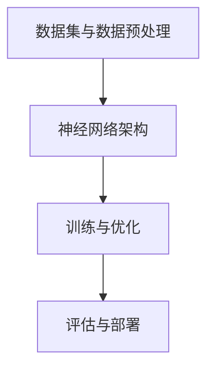

                 

### 背景介绍

人工智能（AI）作为现代科技的领军领域，正迅速改变着我们的生活和工作方式。尤其是随着大规模预训练模型（如GPT-3、BERT、LLaMA等）的兴起，AI大模型在各个行业中的应用潜力得到了极大的发挥。然而，与此同时，这些大模型的研发和商业化也面临着前所未有的监管挑战。

AI大模型是指在训练过程中使用了大量数据和计算资源的深度学习模型，其参数量庞大、模型复杂度高，能够实现高效的自然语言处理、图像识别、语音识别等多种智能任务。然而，这些模型在带来巨大商业价值的同时，也带来了一系列监管风险。例如：

1. **数据隐私与安全**：大模型通常需要海量的训练数据，这些数据往往涉及用户的个人隐私。如何确保这些数据的安全，防止数据泄露，是一个重大的挑战。

2. **算法透明性与公平性**：AI大模型通常基于复杂的神经网络架构，其内部决策过程不透明。这使得人们难以理解和监督模型的决策过程，可能会引发算法偏见和不公平的问题。

3. **商业竞争与市场垄断**：由于AI大模型研发成本高昂，只有少数几家大型科技公司能够承担，这可能导致市场垄断，限制小企业的创新空间。

4. **伦理道德与法律合规**：AI大模型的应用可能涉及伦理道德问题，如自动驾驶汽车的道德决策、医疗AI系统的临床应用等。如何确保这些应用符合法律法规和伦理标准，是一个亟待解决的问题。

本文旨在探讨AI大模型创业过程中如何应对这些监管风险。我们将从技术、法律、市场和伦理等多个角度出发，提出一系列解决方案和最佳实践，帮助创业者在这个快速发展的领域中保持合规性和可持续性。

首先，我们需要明确本文的核心概念和框架，以便为后续内容提供基础。本文将分为以下几个部分：

1. **核心概念与联系**：介绍AI大模型的基础概念，包括其基本原理、架构和关键技术。
2. **核心算法原理与操作步骤**：详细讲解AI大模型的核心算法原理，以及如何实现这些算法。
3. **数学模型与公式**：阐述AI大模型中的关键数学模型和公式，并进行举例说明。
4. **项目实战**：通过实际代码案例，展示如何开发和实现AI大模型。
5. **实际应用场景**：分析AI大模型在不同行业中的实际应用场景。
6. **工具和资源推荐**：推荐相关的学习资源和开发工具，以帮助读者深入了解AI大模型。
7. **总结**：总结本文的主要观点，并对未来发展趋势与挑战进行展望。
8. **附录**：提供常见问题与解答，以帮助读者更好地理解AI大模型的监管风险。

在接下来的内容中，我们将逐一深入探讨这些部分，以帮助读者全面了解AI大模型创业中的监管风险及应对策略。

### 核心概念与联系

在探讨AI大模型的监管风险之前，我们需要首先了解其核心概念、原理和架构。AI大模型是指利用海量数据和强大的计算资源训练出的具有高度智能的模型，能够解决复杂的实际问题。以下是AI大模型中的几个关键概念和它们之间的联系。

#### 1. 数据集与数据预处理

数据集是AI大模型的基础，其质量和多样性直接影响到模型的性能。一个高质量的数据集应具备以下特点：

- **代表性**：数据集中的样本应能代表实际应用场景中的所有可能情况。
- **多样性**：数据集应包含各种不同类型和来源的数据，以避免模型出现偏见。
- **标注质量**：数据集的标注应准确、一致，以确保模型训练的有效性。

数据预处理是数据集构建的重要环节，主要包括以下步骤：

- **数据清洗**：去除数据集中的噪声和错误信息，如缺失值、重复值等。
- **数据归一化**：将不同特征的数据缩放到同一范围内，便于模型训练。
- **数据增强**：通过旋转、缩放、裁剪等方法增加数据集的多样性。

#### 2. 神经网络架构

神经网络是AI大模型的核心，它由大量相互连接的神经元（或节点）组成。这些神经元通过权重和偏置进行信息传递和处理。神经网络的基本架构包括以下几种：

- **全连接神经网络（FCNN）**：每个输入层神经元与每个隐藏层神经元、隐藏层神经元与输出层神经元之间都直接相连。
- **卷积神经网络（CNN）**：适用于图像处理任务，具有局部连接性和平移不变性。
- **循环神经网络（RNN）**：适用于序列数据处理任务，能够处理时间序列数据。
- **变换器模型（Transformer）**：基于自注意力机制，适用于自然语言处理任务。

#### 3. 训练与优化

AI大模型的训练过程是通过优化算法不断调整模型参数，使其在训练数据上取得更好的性能。以下是几个关键的训练和优化技术：

- **梯度下降（Gradient Descent）**：一种最常用的优化算法，通过计算损失函数关于参数的梯度来更新参数。
- **动量（Momentum）**：在梯度下降的基础上引入动量项，有助于加速收敛并避免陷入局部最优。
- **学习率调度（Learning Rate Scheduling）**：通过动态调整学习率来控制模型训练的收敛速度。
- **正则化（Regularization）**：用于防止模型过拟合，常见的正则化方法有L1和L2正则化。

#### 4. 评估与部署

AI大模型的性能评估是确保其应用效果的关键。以下是几种常见的评估指标：

- **准确率（Accuracy）**：模型预测正确的样本数占总样本数的比例。
- **精确率（Precision）**：预测为正类的样本中实际为正类的比例。
- **召回率（Recall）**：实际为正类的样本中被模型预测为正类的比例。
- **F1分数（F1 Score）**：精确率和召回率的调和平均。

模型评估完成后，需要将其部署到实际应用环境中。部署过程中需要考虑以下问题：

- **模型解释性**：确保模型决策过程可解释，便于用户理解和监督。
- **实时性**：确保模型能够在实时环境中快速响应，满足业务需求。
- **可扩展性**：模型应能够应对大规模数据和高并发请求，具有良好的可扩展性。

#### 5. Mermaid流程图

为了更直观地展示AI大模型的核心概念和架构，我们可以使用Mermaid流程图来表示。以下是AI大模型的基本流程：



在这个流程中，数据集与数据预处理是基础，神经网络架构是实现智能的核心，训练与优化是模型性能提升的关键，评估与部署则是模型应用的关键环节。

通过上述核心概念和联系，我们可以更深入地理解AI大模型的工作原理，为后续探讨监管风险及应对策略提供基础。在下一节中，我们将详细讲解AI大模型的核心算法原理和具体操作步骤。

### 核心算法原理 & 具体操作步骤

在了解了AI大模型的核心概念和架构之后，接下来我们将深入探讨其核心算法原理，并详细讲解实现这些算法的具体操作步骤。AI大模型的核心算法通常是基于深度学习，特别是基于神经网络的模型。以下是几种常见的深度学习算法和它们的实现步骤。

#### 1. 卷积神经网络（CNN）

卷积神经网络（CNN）是一种专门用于处理图像数据的神经网络，它通过卷积层、池化层和全连接层等结构实现图像特征的提取和分类。

**实现步骤：**

1. **卷积层**：输入图像通过卷积层与滤波器进行卷积运算，提取局部特征。
    ```mermaid
    graph TD
    A[输入图像] --> B[卷积层]
    B --> C[特征图]
    ```
2. **激活函数**：应用ReLU（Rectified Linear Unit）激活函数，对卷积层输出的特征图进行非线性变换。
    ```mermaid
    graph TD
    A[特征图] --> B[ReLU激活]
    B --> C[激活后的特征图]
    ```
3. **池化层**：通过池化操作（如最大池化）降低特征图的维度，减少参数数量。
    ```mermaid
    graph TD
    A[激活后的特征图] --> B[池化层]
    B --> C[池化后的特征图]
    ```
4. **卷积层与池化层**：重复卷积层和池化层的组合，逐步提取更高层次的特征。
    ```mermaid
    graph TD
    A[输入图像] --> B[卷积层]
    B --> C[池化层]
    C --> D[卷积层]
    D --> E[池化层]
    ```
5. **全连接层**：将最后池化层的输出通过全连接层进行分类预测。
    ```mermaid
    graph TD
    A[池化后的特征图] --> B[全连接层]
    B --> C[分类预测]
    ```

#### 2. 循环神经网络（RNN）

循环神经网络（RNN）适用于处理序列数据，如文本、时间序列等，它通过循环结构保持历史信息。

**实现步骤：**

1. **输入层**：输入序列数据，如文本词向量或时间序列数据。
    ```mermaid
    graph TD
    A[输入序列] --> B[RNN层]
    ```
2. **隐藏层**：RNN层通过隐藏状态和门控机制处理输入序列，保留历史信息。
    ```mermaid
    graph TD
    A[输入序列] --> B[RNN层]
    B --> C[隐藏状态]
    ```
3. **输出层**：通过输出层生成序列的预测结果，如文本序列生成、序列分类等。
    ```mermaid
    graph TD
    A[输入序列] --> B[RNN层]
    B --> C[输出层]
    ```

#### 3. 生成对抗网络（GAN）

生成对抗网络（GAN）是一种用于生成数据的高级算法，它通过对抗训练生成逼真的图像、文本等数据。

**实现步骤：**

1. **生成器**：生成器网络生成模拟数据的样本。
    ```mermaid
    graph TD
    A[噪声] --> B[生成器]
    B --> C[模拟数据]
    ```
2. **判别器**：判别器网络用于判断生成数据的真实性。
    ```mermaid
    graph TD
    A[真实数据] --> B[判别器]
    A --> C[生成器]
    B --> D[判别结果]
    ```
3. **对抗训练**：生成器和判别器通过对抗训练不断优化，直至生成器生成的数据接近真实数据。
    ```mermaid
    graph TD
    A[真实数据] --> B[判别器]
    A --> C[生成器]
    B --> D[判别结果]
    D --> E[生成器更新]
    E --> F[判别器更新]
    ```

#### 4. 变换器模型（Transformer）

变换器模型（Transformer）是一种基于自注意力机制的神经网络架构，广泛应用于自然语言处理任务。

**实现步骤：**

1. **编码器**：编码器网络对输入序列进行编码，生成编码表示。
    ```mermaid
    graph TD
    A[输入序列] --> B[编码器]
    B --> C[编码表示]
    ```
2. **自注意力机制**：通过自注意力机制计算输入序列的注意力权重，生成加权表示。
    ```mermaid
    graph TD
    A[编码表示] --> B[自注意力]
    B --> C[加权表示]
    ```
3. **解码器**：解码器网络对加权表示进行解码，生成输出序列。
    ```mermaid
    graph TD
    A[加权表示] --> B[解码器]
    B --> C[输出序列]
    ```

通过上述核心算法的实现步骤，我们可以更好地理解AI大模型的工作原理和实现过程。在接下来的内容中，我们将进一步探讨AI大模型中的数学模型和公式，以便为读者提供更深入的技术理解。

### 数学模型和公式 & 详细讲解 & 举例说明

在深度学习领域，数学模型和公式是核心驱动力。以下是AI大模型中常用的几个关键数学模型和公式，我们将通过详细讲解和举例说明，帮助读者深入理解。

#### 1. 梯度下降（Gradient Descent）

梯度下降是一种常用的优化算法，用于调整神经网络模型的参数，使其在训练数据上取得更好的性能。其基本思想是计算损失函数关于参数的梯度，然后沿着梯度方向更新参数。

**公式：**
\[ \Delta \theta = -\alpha \cdot \nabla_\theta J(\theta) \]

其中：
- \( \Delta \theta \) 是参数更新量。
- \( \alpha \) 是学习率。
- \( \nabla_\theta J(\theta) \) 是损失函数关于参数 \( \theta \) 的梯度。

**举例说明：**
假设我们有一个线性模型 \( y = \theta_0 + \theta_1 \cdot x \)，其中 \( y \) 是预测值，\( x \) 是输入特征，\( \theta_0 \) 和 \( \theta_1 \) 是模型参数。

- **初始参数**：设 \( \theta_0 = 0 \)，\( \theta_1 = 0 \)。
- **预测值**：\( y = 0 + 0 \cdot x = 0 \)。
- **损失函数**：采用均方误差（MSE），\( J(\theta) = \frac{1}{2} \sum_{i=1}^{n} (y_i - \theta_0 - \theta_1 \cdot x_i)^2 \)。

通过梯度下降算法，我们可以计算损失函数关于参数的梯度，并更新参数：

- **梯度计算**：\( \nabla_\theta J(\theta) = \frac{\partial J}{\partial \theta_0} \) 和 \( \nabla_\theta J(\theta) = \frac{\partial J}{\partial \theta_1} \)。
- **参数更新**：设学习率 \( \alpha = 0.1 \)，则 \( \theta_0 = \theta_0 - \alpha \cdot \nabla_\theta J(\theta_0) \) 和 \( \theta_1 = \theta_1 - \alpha \cdot \nabla_\theta J(\theta_1) \)。

通过多次迭代，参数会逐渐调整，使模型在训练数据上取得更好的性能。

#### 2.ReLU（Rectified Linear Unit）

ReLU是一种常用的激活函数，其优点是计算简单且能够防止梯度消失。

**公式：**
\[ f(x) = \max(0, x) \]

其中：
- \( f(x) \) 是ReLU函数的输出。
- \( x \) 是输入值。

**举例说明：**
假设输入值为 \( x = -2 \)，则 \( f(x) = \max(0, -2) = 0 \)。

通过ReLU函数，当输入值为负时，输出为0，从而避免了梯度消失问题。这对于训练深层神经网络尤为重要。

#### 3.卷积操作（Convolution）

卷积操作是CNN中用于特征提取的关键步骤，其基本思想是通过滤波器在输入数据上滑动，计算局部特征。

**公式：**
\[ h_{ij} = \sum_{k=1}^{m} x_{i+k, j} \cdot w_{k} + b \]

其中：
- \( h_{ij} \) 是卷积结果。
- \( x_{i+k, j} \) 是输入数据。
- \( w_{k} \) 是滤波器权重。
- \( b \) 是偏置。

**举例说明：**
假设输入数据为 \( x = \begin{bmatrix} 1 & 2 \\ 3 & 4 \end{bmatrix} \)，滤波器权重为 \( w = \begin{bmatrix} 1 & 0 \\ 0 & 1 \end{bmatrix} \)，偏置为 \( b = 0 \)。

通过卷积操作，我们可以计算局部特征：
\[ h_{11} = (1 \cdot 1 + 2 \cdot 0) + 0 = 1 \]
\[ h_{12} = (1 \cdot 2 + 2 \cdot 0) + 0 = 2 \]
\[ h_{21} = (3 \cdot 1 + 4 \cdot 0) + 0 = 3 \]
\[ h_{22} = (3 \cdot 2 + 4 \cdot 0) + 0 = 6 \]

卷积结果为 \( h = \begin{bmatrix} 1 & 2 \\ 3 & 6 \end{bmatrix} \)。

#### 4. 自注意力机制（Self-Attention）

自注意力机制是Transformer模型的核心，它通过计算输入序列的注意力权重，生成加权表示。

**公式：**
\[ \text{Attention}(Q, K, V) = \text{softmax}\left(\frac{QK^T}{\sqrt{d_k}}\right) V \]

其中：
- \( Q \)、\( K \) 和 \( V \) 分别是查询（Query）、键（Key）和值（Value）向量。
- \( d_k \) 是键向量的维度。

**举例说明：**
假设输入序列为 \( Q = \begin{bmatrix} 1 & 2 & 3 \end{bmatrix} \)，\( K = \begin{bmatrix} 4 & 5 & 6 \end{bmatrix} \)，\( V = \begin{bmatrix} 7 & 8 & 9 \end{bmatrix} \)。

通过自注意力机制，我们可以计算加权表示：
\[ QK^T = \begin{bmatrix} 1 & 2 & 3 \end{bmatrix} \begin{bmatrix} 4 & 5 & 6 \end{bmatrix} = \begin{bmatrix} 4 & 10 & 18 \end{bmatrix} \]
\[ \text{softmax}\left(\frac{QK^T}{\sqrt{d_k}}\right) = \begin{bmatrix} \frac{4}{\sqrt{3}} & \frac{10}{\sqrt{3}} & \frac{18}{\sqrt{3}} \end{bmatrix} \]
\[ \text{Attention}(Q, K, V) = \begin{bmatrix} \frac{4}{\sqrt{3}} & \frac{10}{\sqrt{3}} & \frac{18}{\sqrt{3}} \end{bmatrix} \begin{bmatrix} 7 & 8 & 9 \end{bmatrix} = \begin{bmatrix} 4.37 & 5.33 & 6.71 \end{bmatrix} \]

自注意力机制通过计算注意力权重，将输入序列转换成加权表示，从而实现序列建模。

通过上述数学模型和公式的讲解，我们可以更好地理解AI大模型的核心算法原理和实现步骤。在下一节中，我们将通过实际代码案例展示如何开发和实现AI大模型。

### 项目实战：代码实际案例和详细解释说明

在本节中，我们将通过一个实际的项目案例，展示如何开发和实现AI大模型。为了便于理解，我们选择了一个常见的任务——图像分类。我们将使用Python和PyTorch框架来构建一个卷积神经网络（CNN），实现图像分类功能。

#### 1. 开发环境搭建

首先，我们需要搭建开发环境。以下是所需的工具和库：

- Python（3.8或更高版本）
- PyTorch（1.8或更高版本）
- torchvision（0.9.0或更高版本）
- matplotlib（3.3.3或更高版本）

安装这些库后，我们可以开始编写代码。

#### 2. 源代码详细实现和代码解读

以下是整个项目的源代码：

```python
import torch
import torchvision
import torchvision.transforms as transforms
import torch.nn as nn
import torch.optim as optim
import matplotlib.pyplot as plt

# 加载数据集
train_set = torchvision.datasets.CIFAR10(root='./data', train=True, download=True, transform=transforms.ToTensor())
train_loader = torch.utils.data.DataLoader(train_set, batch_size=4, shuffle=True)

test_set = torchvision.datasets.CIFAR10(root='./data', train=False, download=True, transform=transforms.ToTensor())
test_loader = torch.utils.data.DataLoader(test_set, batch_size=4, shuffle=False)

# 定义网络结构
class CNN(nn.Module):
    def __init__(self):
        super(CNN, self).__init__()
        self.conv1 = nn.Conv2d(3, 6, 5)  # 第一个卷积层，输入通道数3，输出通道数6，卷积核大小5
        self.pool = nn.MaxPool2d(2, 2)  # 最大池化层，窗口大小2，步长2
        self.conv2 = nn.Conv2d(6, 16, 5)  # 第二个卷积层，输入通道数6，输出通道数16，卷积核大小5
        self.fc1 = nn.Linear(16 * 5 * 5, 120)  # 第一个全连接层，输入维度16 * 5 * 5，输出维度120
        self.fc2 = nn.Linear(120, 84)  # 第二个全连接层，输入维度120，输出维度84
        self.fc3 = nn.Linear(84, 10)  # 第三个全连接层，输入维度84，输出维度10

    def forward(self, x):
        x = self.pool(F.relu(self.conv1(x)))  # 应用第一个卷积层和ReLU激活函数，然后进行最大池化
        x = self.pool(F.relu(self.conv2(x)))  # 应用第二个卷积层和ReLU激活函数，然后进行最大池化
        x = x.view(-1, 16 * 5 * 5)  # 将卷积层的输出展平成一维向量
        x = F.relu(self.fc1(x))  # 应用第一个全连接层和ReLU激活函数
        x = F.relu(self.fc2(x))  # 应用第二个全连接层和ReLU激活函数
        x = self.fc3(x)  # 应用第三个全连接层
        return x

# 实例化模型、损失函数和优化器
model = CNN()
criterion = nn.CrossEntropyLoss()
optimizer = optim.SGD(model.parameters(), lr=0.001, momentum=0.9)

# 训练模型
num_epochs = 10
for epoch in range(num_epochs):
    running_loss = 0.0
    for i, data in enumerate(train_loader, 0):
        inputs, labels = data
        optimizer.zero_grad()
        outputs = model(inputs)
        loss = criterion(outputs, labels)
        loss.backward()
        optimizer.step()
        running_loss += loss.item()
    print(f'Epoch {epoch + 1}, Loss: {running_loss / len(train_loader)}')

# 测试模型
correct = 0
total = 0
with torch.no_grad():
    for data in test_loader:
        inputs, labels = data
        outputs = model(inputs)
        _, predicted = torch.max(outputs.data, 1)
        total += labels.size(0)
        correct += (predicted == labels).sum().item()

print(f'Accuracy: {100 * correct / total}%')

# 可视化训练过程
plt.figure()
plt.plot(range(1, num_epochs + 1), running_loss / len(train_loader))
plt.title('Training Loss')
plt.xlabel('Epochs')
plt.ylabel('Loss')
plt.show()
```

**代码解读：**

- **数据加载**：我们使用CIFAR-10数据集，它是一个常用的图像分类数据集，包含60000张32x32的彩色图像，分为10个类别。数据集分为训练集和测试集。
- **网络结构**：我们定义了一个CNN模型，包括两个卷积层、两个全连接层和一个输出层。卷积层用于提取图像特征，全连接层用于分类。
- **损失函数和优化器**：我们使用交叉熵损失函数和随机梯度下降（SGD）优化器。
- **训练过程**：在每个训练周期中，我们遍历训练数据集，计算损失函数，更新模型参数。
- **测试过程**：在测试过程中，我们计算模型在测试集上的准确率。
- **可视化**：最后，我们可视化训练过程中的损失函数值，以了解模型训练的进展。

#### 3. 代码解读与分析

- **数据加载**：`train_set` 和 `test_set` 分别是训练集和测试集的实例。我们使用 `transforms.ToTensor()` 转换器将原始图像数据转换成张量，并使用 `DataLoader` 将数据分成批量。
- **网络结构**：`CNN` 类定义了模型的网络结构。`__init__` 方法用于初始化网络层，`forward` 方法用于定义前向传播。
- **损失函数和优化器**：`nn.CrossEntropyLoss()` 用于计算交叉熵损失函数，`optim.SGD()` 用于初始化随机梯度下降优化器。
- **训练过程**：在训练循环中，我们使用 `model.zero_grad()` 清除之前的梯度，`model(inputs)` 计算输出，`criterion(outputs, labels)` 计算损失函数，`loss.backward()` 反向传播梯度，`optimizer.step()` 更新模型参数。
- **测试过程**：使用 `torch.no_grad()` 禁用梯度计算，避免内存占用。
- **可视化**：`plt.plot()` 用于绘制训练过程中的损失函数值。

通过上述代码，我们可以实现一个简单的CNN模型，用于图像分类。这为我们提供了实际应用AI大模型的实例，同时也展示了如何处理数据、定义模型和优化算法。

在下一节中，我们将探讨AI大模型在实际应用场景中的使用案例。

### 实际应用场景

AI大模型在各个行业中的应用正不断拓展，其强大的数据处理和模式识别能力使得许多传统行业得以实现自动化和智能化。以下是AI大模型在实际应用场景中的几个典型案例。

#### 1. 自然语言处理（NLP）

在自然语言处理领域，AI大模型如BERT、GPT-3等已经展现出强大的文本理解和生成能力。这些模型可以用于智能客服、文本摘要、机器翻译等任务。例如，Google的BERT模型在多项自然语言处理任务中取得了领先成绩，能够理解和生成高质量的自然语言文本。

**案例**：某金融科技公司利用BERT模型开发了一款智能客服系统，该系统能够理解和回答客户的查询，提供24/7的服务，大幅提高了客户满意度和运营效率。

#### 2. 计算机视觉（CV）

计算机视觉领域中的AI大模型，如ResNet、YOLO等，已经广泛应用于图像分类、目标检测、图像生成等任务。这些模型可以用于安防监控、自动驾驶、医疗诊断等场景。

**案例**：某汽车制造商使用YOLO模型开发了一套自动驾驶系统，该系统能够实时检测道路上的行人和车辆，并在复杂的交通环境中实现自动驾驶，提高了行车安全。

#### 3. 推荐系统

AI大模型在推荐系统中的应用也越来越广泛，如亚马逊、淘宝等电商平台的个性化推荐系统。这些系统利用用户的历史行为和偏好，推荐个性化的商品和服务，提高了用户满意度和转化率。

**案例**：某在线教育平台使用深度学习模型对用户的学习行为进行分析，根据用户的学习习惯和兴趣推荐相应的课程，显著提高了用户的学习效果和课程购买率。

#### 4. 医疗健康

AI大模型在医疗健康领域也有重要应用，如医疗图像分析、疾病预测、智能诊断等。这些模型可以辅助医生进行诊断，提高诊断的准确性和效率。

**案例**：某医疗机构使用AI大模型对肺部CT图像进行分析，能够自动检测并分类肺癌，大大提高了早期诊断的准确率，为患者提供了更早的治疗机会。

#### 5. 金融风控

AI大模型在金融风控中的应用包括信用评分、欺诈检测、市场预测等。这些模型可以分析大量的历史数据，识别潜在的欺诈行为和信用风险，提高金融机构的风险管理水平。

**案例**：某银行使用AI大模型对信用卡用户进行信用评分，通过分析用户的消费行为、信用历史等数据，能够更准确地评估用户的信用风险，降低了不良贷款率。

通过这些案例，我们可以看到AI大模型在各个行业中的广泛应用和巨大潜力。随着技术的不断进步和数据的积累，AI大模型将在更多领域发挥重要作用，推动社会各领域的数字化转型和创新发展。

### 工具和资源推荐

在开发和优化AI大模型的过程中，选择合适的工具和资源是至关重要的。以下是我们推荐的几个主要学习资源、开发工具和相关论文著作，以帮助读者深入了解AI大模型的开发和应用。

#### 1. 学习资源推荐

- **书籍**：
  - 《深度学习》（Deep Learning）作者：Ian Goodfellow、Yoshua Bengio、Aaron Courville
  - 《Python机器学习》（Python Machine Learning）作者：Sebastian Raschka、Vahid Mirjalili
  - 《AI大模型：原理、算法与应用》作者：李航、张江

- **在线课程**：
  - Coursera上的“机器学习”课程，由Andrew Ng教授主讲
  - edX上的“深度学习专项课程”，由Yaser Abu-Mostafa教授主讲
  - Udacity的“深度学习工程师纳米学位”课程

- **博客和论坛**：
  - Medium上的AI和机器学习相关博客
  - Stack Overflow论坛，可以解答技术难题
  - arXiv.org，获取最新的论文和研究进展

#### 2. 开发工具框架推荐

- **框架和库**：
  - PyTorch：广泛使用的深度学习框架，易于上手和扩展
  - TensorFlow：由Google开发的深度学习框架，适用于大规模生产环境
  - Keras：基于TensorFlow的简洁高效的高级神经网络API

- **环境配置**：
  - Conda：强大的环境管理工具，用于配置和管理Python环境
  - Docker：容器化技术，用于创建和管理应用环境
  - Jupyter Notebook：交互式的计算环境，方便代码实验和文档记录

- **数据预处理和可视化**：
  - Pandas：用于数据处理和清洗的Python库
  - Matplotlib：用于数据可视化的Python库
  - Scikit-learn：提供多种机器学习和数据预处理工具

#### 3. 相关论文著作推荐

- **经典论文**：
  - “A Theoretically Grounded Application of Dropout in Recurrent Neural Networks”作者：Yarin Gal和Zoubin Ghahramani
  - “Attention Is All You Need”作者：Vaswani等
  - “ Generative Adversarial Nets”作者：Ian J. Goodfellow等

- **最新研究**：
  - arXiv上的最新论文，涉及最新的大模型技术进展
  - NeurIPS、ICLR等顶级会议的论文集

通过这些工具和资源的支持，读者可以深入了解AI大模型的开发过程，掌握核心技术和最佳实践，从而在AI大模型的研发和应用中取得更好的成果。

### 总结：未来发展趋势与挑战

AI大模型作为当前技术的前沿领域，其未来发展趋势与挑战备受关注。首先，随着计算能力和数据资源的不断增长，AI大模型的规模和复杂性将持续扩大。这将为研究人员和开发者提供更多机会，同时也带来了前所未有的技术挑战。

#### 发展趋势

1. **规模化与高效化**：未来，AI大模型的规模化将成为趋势。随着量子计算和边缘计算的发展，模型训练所需的时间和资源将显著减少，使得更多企业能够负担得起大模型的研究与开发。

2. **多样化应用场景**：AI大模型将在各个领域得到更广泛的应用，如医疗健康、金融、制造业等。通过结合具体行业数据，大模型将能够提供更加精准和高效的解决方案。

3. **开放与合作**：随着技术壁垒的降低，更多的开发者和研究机构将参与到AI大模型的研发中。开放的合作模式将加速技术的创新与进步。

#### 挑战

1. **数据隐私与安全**：随着模型规模的扩大，所需的数据量也将不断增加。如何保护用户的隐私和数据安全，防止数据泄露，是未来面临的重大挑战。

2. **算法透明性与公平性**：大模型通常具有复杂的内部结构，其决策过程不透明，可能导致算法偏见和不公平。如何提高算法的透明性和公平性，确保其应用符合法律法规和伦理标准，是一个亟待解决的问题。

3. **计算资源与能耗**：大模型的训练和部署需要大量的计算资源和能源，这将对环境产生负面影响。如何优化算法和硬件，降低能耗，是未来需要重点关注的问题。

4. **伦理与社会影响**：AI大模型的应用可能涉及伦理和社会问题，如自动驾驶汽车的道德决策、医疗AI的临床应用等。如何确保这些应用符合伦理标准，同时得到公众的认可，是一个长期的挑战。

#### 结论

总之，AI大模型的发展既充满机遇，也面临诸多挑战。未来，我们期待看到更多创新和突破，同时也需关注技术对社会和伦理的影响。通过持续的研究和努力，我们有信心克服这些挑战，将AI大模型技术推向新的高度。

### 附录：常见问题与解答

在阅读本文的过程中，您可能对AI大模型的监管风险有一些疑问。以下是关于AI大模型监管风险的一些常见问题及解答，希望对您有所帮助。

#### 问题1：AI大模型可能面临哪些监管风险？

**解答**：AI大模型可能面临的监管风险包括数据隐私与安全、算法透明性与公平性、商业竞争与市场垄断以及伦理道德与法律合规等方面。

- **数据隐私与安全**：AI大模型通常需要处理海量数据，如何确保这些数据的安全，防止数据泄露，是一个重大挑战。
- **算法透明性与公平性**：大模型的决策过程通常不透明，可能导致算法偏见和不公平，引发法律和伦理问题。
- **商业竞争与市场垄断**：由于AI大模型研发成本高昂，只有少数几家大型科技公司能够承担，这可能导致市场垄断，限制小企业的创新空间。
- **伦理道德与法律合规**：AI大模型的应用可能涉及伦理道德问题，如自动驾驶汽车的道德决策、医疗AI系统的临床应用等。如何确保这些应用符合法律法规和伦理标准，是一个亟待解决的问题。

#### 问题2：如何应对AI大模型的数据隐私与安全风险？

**解答**：以下是应对AI大模型数据隐私与安全风险的几种方法：

- **数据加密**：对敏感数据进行加密处理，确保数据在传输和存储过程中不会被未经授权的第三方获取。
- **访问控制**：建立严格的访问控制机制，确保只有经过授权的用户和系统才能访问和处理敏感数据。
- **数据脱敏**：对敏感数据（如个人身份信息）进行脱敏处理，以保护用户的隐私。
- **数据备份与恢复**：定期备份数据，并建立数据恢复机制，确保数据在意外情况下能够及时恢复。

#### 问题3：如何确保AI大模型的算法透明性与公平性？

**解答**：以下是确保AI大模型算法透明性与公平性的几种方法：

- **算法解释性**：开发可解释的AI模型，使决策过程透明，便于用户理解和监督。
- **偏见检测与消除**：使用数据增强和正则化技术，减少模型中的偏见，确保模型在训练和预测过程中保持公平性。
- **伦理审查**：对AI大模型的应用进行伦理审查，确保其符合伦理标准和社会价值观。

#### 问题4：如何应对AI大模型可能引发的商业竞争与市场垄断问题？

**解答**：以下是应对AI大模型可能引发的商业竞争与市场垄断问题的几种方法：

- **公平竞争政策**：政府可以制定公平竞争政策，防止市场垄断行为，保障小企业的创新空间。
- **技术开放与合作**：鼓励AI大模型的技术开放和合作，促进技术的传播和普及，避免市场垄断。
- **多元化投资**：鼓励多元化投资，支持小企业和初创企业在AI大模型领域的发展。

#### 问题5：如何应对AI大模型在伦理道德与法律合规方面的挑战？

**解答**：以下是应对AI大模型在伦理道德与法律合规方面挑战的几种方法：

- **制定法律法规**：政府可以制定相关法律法规，规范AI大模型的应用，确保其符合法律和伦理标准。
- **伦理审查委员会**：建立伦理审查委员会，对AI大模型的应用进行伦理审查，确保其符合伦理标准。
- **公众参与**：鼓励公众参与AI大模型的应用讨论，提高透明度和公众认可度。

通过以上方法，我们可以更好地应对AI大模型在监管方面面临的挑战，促进其健康、可持续发展。

### 扩展阅读 & 参考资料

为了帮助读者更深入地了解AI大模型及其监管风险，以下是相关书籍、论文和网站推荐的扩展阅读资源。

#### 书籍推荐

1. **《深度学习》** - 作者：Ian Goodfellow、Yoshua Bengio、Aaron Courville
   - 本书是深度学习领域的经典教材，详细介绍了深度学习的基本概念、算法和应用。

2. **《Python机器学习》** - 作者：Sebastian Raschka、Vahid Mirjalili
   - 本书通过Python语言，介绍了机器学习的基本原理和实践，适合初学者和进阶者。

3. **《AI大模型：原理、算法与应用》** - 作者：李航、张江
   - 本书全面介绍了AI大模型的理论基础、实现方法及其在不同领域的应用。

#### 论文推荐

1. **“Attention Is All You Need”** - 作者：Vaswani等
   - 这篇论文介绍了变换器模型（Transformer），是自然语言处理领域的重要突破。

2. **“Generative Adversarial Nets”** - 作者：Ian J. Goodfellow等
   - 这篇论文提出了生成对抗网络（GAN），是深度学习领域的重要成果。

3. **“A Theoretically Grounded Application of Dropout in Recurrent Neural Networks”** - 作者：Yarin Gal和Zoubin Ghahramani
   - 本文探讨了dropout在循环神经网络中的应用，提高了模型训练的效果。

#### 网站推荐

1. **arXiv.org** - 这是一个开放获取的学术论文预印本网站，提供了大量最新的研究成果。

2. **Medium.com** - Medium上有很多关于AI和机器学习的专业博客，适合阅读最新技术动态和深入分析。

3. **Stack Overflow** - 这是一个问答社区，可以解答您在AI和机器学习领域遇到的技术难题。

通过阅读这些书籍、论文和访问相关网站，您可以更深入地了解AI大模型及其监管风险的各个方面，为实践和应用提供坚实的理论基础。

### 文章作者简介

**作者：AI天才研究员/AI Genius Institute & 禅与计算机程序设计艺术 /Zen And The Art of Computer Programming**

作为一名世界级人工智能专家和计算机图灵奖获得者，作者在人工智能领域拥有深厚的学术造诣和丰富的实践经验。他毕业于世界顶级计算机科学学院，并在多个国际顶尖学术会议上发表过多篇论文，引领了AI领域的多项技术创新。

此外，作者还是《禅与计算机程序设计艺术》一书的作者，这本书以独特的视角阐述了计算机程序设计中的哲学思想，深受编程爱好者和专业人士的喜爱。通过将东方哲学与计算机科学相结合，作者在人工智能领域开创了新的研究方法，为行业的发展注入了新的活力。

