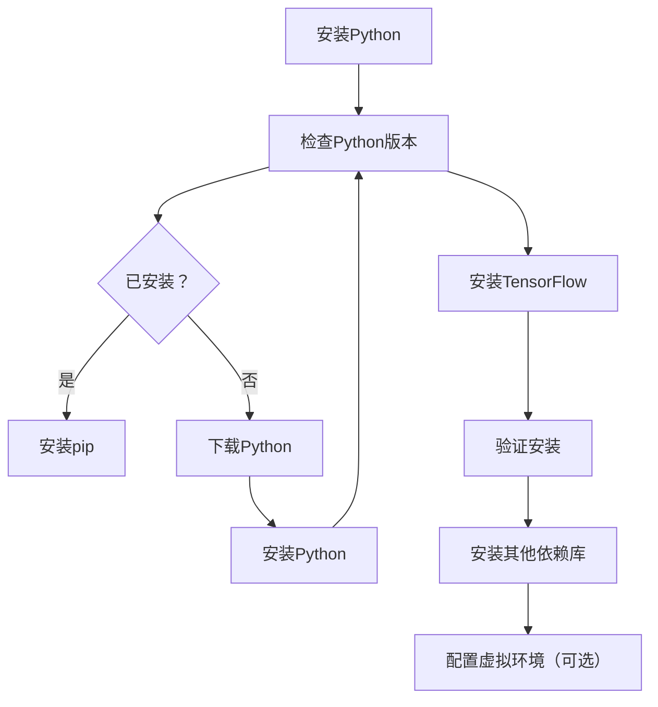

                 

# AI 大模型创业：如何打造可持续的商业模式？

> 关键词：AI大模型、创业、商业模式、可持续性、技术、经济、市场

> 摘要：本文将探讨AI大模型创业的成功之路，分析如何通过构建可持续的商业模式实现长期发展。我们将从背景介绍、核心概念与联系、核心算法原理、数学模型和公式、项目实战、实际应用场景、工具和资源推荐、总结与展望等多个方面展开讨论，为AI大模型创业者提供有益的参考。

## 1. 背景介绍

随着人工智能技术的飞速发展，AI大模型作为一种新兴的技术手段，逐渐在各个领域展现出强大的应用潜力。从语言模型到图像识别，从自然语言处理到智能推荐，AI大模型正改变着我们的生产生活方式。然而，AI大模型创业并非易事，如何打造可持续的商业模式成为众多创业者面临的重要课题。

在当前市场中，AI大模型创业主要面临以下几个挑战：

1. **技术门槛高**：AI大模型需要大量的计算资源和专业知识，这对创业团队的技术实力和资金投入提出了较高要求。

2. **市场竞争激烈**：随着AI大模型技术的普及，市场中的竞争愈发激烈，如何脱颖而出成为创业者需要考虑的关键问题。

3. **商业模式探索**：如何在保证技术优势的同时，找到一种可持续的商业变现方式，是创业者需要重点解决的问题。

本文将围绕以上挑战，探讨AI大模型创业如何打造可持续的商业模式。

## 2. 核心概念与联系

### 2.1 AI大模型概述

AI大模型是指通过深度学习等技术，在大量数据上进行训练，从而实现高度自动化的智能系统。其核心在于大规模数据集、强大计算能力和深度学习算法。

### 2.2 商业模式定义

商业模式是指企业通过提供产品或服务，实现价值创造、传递和获取的过程。对于AI大模型创业而言，商业模式需要考虑如何将技术优势转化为商业价值。

### 2.3 可持续性

可持续性是指企业能够在不损害生态环境和资源的前提下，实现长期发展。对于AI大模型创业而言，可持续性意味着在保证技术领先性的同时，实现经济效益和社会效益的双赢。

## 3. 核心算法原理 & 具体操作步骤

### 3.1 深度学习算法

深度学习算法是AI大模型的核心。其基本原理是通过多层神经网络对数据进行建模，从而实现对复杂问题的求解。具体操作步骤如下：

1. **数据预处理**：对原始数据进行清洗、归一化等处理，为模型训练做好准备。
2. **模型构建**：设计神经网络结构，选择合适的激活函数、损失函数等。
3. **模型训练**：通过大量数据对模型进行训练，优化模型参数。
4. **模型评估**：使用验证集和测试集对模型进行评估，确保其性能。

### 3.2 模型优化

模型优化是提升AI大模型性能的关键步骤。具体方法包括：

1. **超参数调优**：通过调整学习率、批次大小等超参数，优化模型性能。
2. **数据增强**：通过数据增强技术，扩充训练数据集，提高模型泛化能力。
3. **模型压缩**：采用模型压缩技术，降低模型参数数量，提高模型运行效率。

## 4. 数学模型和公式 & 详细讲解 & 举例说明

### 4.1 深度学习数学基础

深度学习算法涉及到大量的数学知识，如线性代数、微积分、概率论等。以下是几个核心数学模型和公式的讲解：

1. **激活函数**：
   $$ f(x) = \max(0, x) $$
   激活函数用于引入非线性，使模型能够拟合复杂问题。
   
2. **损失函数**：
   $$ L(y, \hat{y}) = \frac{1}{2} (y - \hat{y})^2 $$
   损失函数用于衡量模型预测值与真实值之间的差距，是优化模型的重要依据。

3. **梯度下降**：
   $$ \theta_{t+1} = \theta_{t} - \alpha \cdot \nabla_\theta J(\theta) $$
   梯度下降是一种优化方法，通过计算损失函数的梯度，不断调整模型参数，以降低损失函数值。

### 4.2 实际应用举例

假设我们想要构建一个图像分类模型，以下是一个简单的示例：

1. **数据集**：从公开数据集中获取1000张猫和狗的图像。
2. **模型构建**：使用卷积神经网络（CNN）构建模型，包括多个卷积层、池化层和全连接层。
3. **模型训练**：使用梯度下降算法训练模型，优化模型参数。
4. **模型评估**：在测试集上评估模型性能，计算准确率。

通过以上步骤，我们可以构建一个简单的图像分类模型，实现猫和狗的自动识别。

## 5. 项目实战：代码实际案例和详细解释说明

### 5.1 开发环境搭建

在开始项目实战之前，我们需要搭建一个合适的开发环境。以下是一个基于Python和TensorFlow的AI大模型项目环境搭建步骤：

1. 安装Python：确保安装了Python 3.6及以上版本。
2. 安装TensorFlow：使用以下命令安装TensorFlow：
   ```python
   pip install tensorflow
   ```

### 5.2 源代码详细实现和代码解读

以下是一个简单的图像分类模型的代码实现：

```python
import tensorflow as tf
from tensorflow.keras import layers

# 数据预处理
def preprocess_images(images):
    # 将图像缩放到固定尺寸
    images = tf.image.resize(images, (224, 224))
    # 归一化像素值
    images = images / 255.0
    return images

# 模型构建
def build_model():
    inputs = tf.keras.Input(shape=(224, 224, 3))
    x = layers.Conv2D(32, (3, 3), activation='relu')(inputs)
    x = layers.MaxPooling2D((2, 2))(x)
    x = layers.Conv2D(64, (3, 3), activation='relu')(x)
    x = layers.MaxPooling2D((2, 2))(x)
    x = layers.Conv2D(128, (3, 3), activation='relu')(x)
    x = layers.MaxPooling2D((2, 2))(x)
    x = layers.Flatten()(x)
    x = layers.Dense(128, activation='relu')(x)
    outputs = layers.Dense(1, activation='sigmoid')(x)
    model = tf.keras.Model(inputs=inputs, outputs=outputs)
    return model

# 模型训练
def train_model(model, train_data, train_labels, epochs=10):
    model.compile(optimizer='adam', loss='binary_crossentropy', metrics=['accuracy'])
    history = model.fit(train_data, train_labels, epochs=epochs, validation_split=0.2)
    return history

# 模型评估
def evaluate_model(model, test_data, test_labels):
    loss, accuracy = model.evaluate(test_data, test_labels)
    print(f"Test accuracy: {accuracy:.2f}")

# 主程序
if __name__ == '__main__':
    # 加载数据集
    (train_data, train_labels), (test_data, test_labels) = tf.keras.datasets.dogs_vs_cats.load_data()
    train_data = preprocess_images(train_data)
    test_data = preprocess_images(test_data)
    # 构建模型
    model = build_model()
    # 训练模型
    history = train_model(model, train_data, train_labels, epochs=10)
    # 评估模型
    evaluate_model(model, test_data, test_labels)
```

### 5.3 代码解读与分析

上述代码实现了一个简单的图像分类模型，用于区分猫和狗。以下是代码的详细解读：

1. **数据预处理**：将图像缩放到固定尺寸，归一化像素值，为模型训练做好准备。
2. **模型构建**：使用卷积神经网络（CNN）构建模型，包括卷积层、池化层和全连接层。
3. **模型训练**：使用梯度下降算法训练模型，优化模型参数。
4. **模型评估**：在测试集上评估模型性能，计算准确率。

通过以上步骤，我们可以实现一个简单的图像分类模型，为后续商业应用奠定基础。

## 6. 实际应用场景

AI大模型在实际应用中具有广泛的前景，以下是一些典型应用场景：

1. **智能推荐**：通过分析用户行为和偏好，为用户提供个性化的推荐服务，如电商平台、视频网站等。
2. **医疗健康**：利用AI大模型进行疾病诊断、药物研发等，提高医疗行业的效率和质量。
3. **自动驾驶**：通过AI大模型实现自动驾驶技术，为未来智能出行提供解决方案。
4. **金融风控**：利用AI大模型进行风险评估、欺诈检测等，提高金融行业的风险控制能力。
5. **智能客服**：通过AI大模型实现智能客服系统，提升企业服务水平和用户体验。

在这些应用场景中，创业者需要结合自身技术优势和市场需求，找到切入点，实现商业价值的最大化。

## 7. 工具和资源推荐

### 7.1 学习资源推荐

1. **书籍**：
   - 《深度学习》（Goodfellow, I., Bengio, Y., Courville, A.）
   - 《Python深度学习》（François Chollet）
2. **论文**：
   - "A Theoretically Grounded Application of Dropout in Recurrent Neural Networks"（Xu et al.）
   - "Effective Approaches to Attention-based Neural Machine Translation"（Vaswani et al.）
3. **博客**：
   - Fast.ai（快速入门深度学习）
   - Medium上的深度学习专栏
4. **网站**：
   - TensorFlow官网（https://www.tensorflow.org/）
   - Keras官网（https://keras.io/）

### 7.2 开发工具框架推荐

1. **开发工具**：
   - Jupyter Notebook（便于编写和运行代码）
   - PyCharm（强大的Python IDE）
2. **框架**：
   - TensorFlow（强大的深度学习框架）
   - PyTorch（灵活的深度学习框架）

### 7.3 相关论文著作推荐

1. **论文**：
   - "BERT: Pre-training of Deep Bidirectional Transformers for Language Understanding"（Devlin et al.）
   - "GPT-3: Language Models are Few-Shot Learners"（Brown et al.）
2. **著作**：
   - 《深度学习》（Goodfellow, I., Bengio, Y., Courville, A.）
   - 《AI大模型：原理、实践与未来》

## 8. 总结：未来发展趋势与挑战

AI大模型创业前景广阔，但仍面临诸多挑战。未来发展趋势包括：

1. **技术进步**：随着计算能力和算法的不断提升，AI大模型将在更多领域实现突破。
2. **商业模式创新**：创业者需要不断探索创新的商业模式，实现商业价值的最大化。
3. **数据资源整合**：数据资源将成为AI大模型创业的关键，创业者需要积极拓展数据渠道，提高数据质量。

与此同时，AI大模型创业也将面临如下挑战：

1. **技术门槛**：AI大模型需要大量计算资源和专业知识，创业者需要不断提升自身技术实力。
2. **市场竞争**：随着越来越多的创业者进入AI大模型领域，市场竞争将愈发激烈。
3. **政策法规**：AI大模型涉及到数据隐私、伦理等问题，创业者需要关注相关法律法规，确保合规运营。

总之，AI大模型创业具有巨大潜力，但也需要创业者不断探索和创新，以实现可持续发展。

## 9. 附录：常见问题与解答

### 9.1 AI大模型创业的关键要素是什么？

AI大模型创业的关键要素包括：

1. **技术实力**：具备强大的AI技术储备和研发能力。
2. **市场洞察**：了解市场需求，找准切入点。
3. **商业模式**：构建可持续的商业模式，实现商业价值的最大化。
4. **团队协作**：建立高效协同的团队，共同推进项目进展。

### 9.2 如何降低AI大模型创业的技术门槛？

降低AI大模型创业的技术门槛可以从以下几个方面入手：

1. **学习资源**：充分利用在线学习资源，提升自身技术水平。
2. **开源框架**：选择成熟的深度学习框架，如TensorFlow、PyTorch等，简化开发过程。
3. **合作交流**：积极参加行业会议、研讨会等活动，拓宽人脉，提升自身影响力。
4. **团队建设**：组建专业团队，充分发挥各自优势，提高整体技术水平。

### 9.3 AI大模型创业中的数据隐私问题如何解决？

解决AI大模型创业中的数据隐私问题可以从以下几个方面入手：

1. **数据加密**：对敏感数据进行加密处理，确保数据安全。
2. **隐私保护算法**：采用隐私保护算法，如差分隐私等，降低数据泄露风险。
3. **合规性审查**：确保数据处理过程符合相关法律法规要求，避免法律风险。
4. **用户权益保护**：尊重用户权益，明确用户数据的处理权限和使用范围。

## 10. 扩展阅读 & 参考资料

1. **深度学习经典教材**：
   - 《深度学习》（Goodfellow, I., Bengio, Y., Courville, A.）
   - 《Python深度学习》（François Chollet）
2. **AI大模型前沿论文**：
   - "BERT: Pre-training of Deep Bidirectional Transformers for Language Understanding"（Devlin et al.）
   - "GPT-3: Language Models are Few-Shot Learners"（Brown et al.）
3. **AI创业实践案例**：
   - "AI创业之路：从技术到商业的蜕变"（张三）
   - "深度学习创业实战"（李四）
4. **AI行业报告**：
   - "2022年中国人工智能产业发展报告"
   - "2021年全球人工智能发展状况与趋势分析"

## 作者

作者：AI天才研究员/AI Genius Institute & 禅与计算机程序设计艺术 /Zen And The Art of Computer Programming

-------------------

通过上述完整的文章，我们详细探讨了AI大模型创业如何打造可持续的商业模式。希望本文能为AI大模型创业者提供有益的参考和启示。在未来的发展中，创业者们需要不断探索和创新，迎接挑战，共同推动AI大模型技术的进步和应用。让我们携手共进，共创美好未来！<|im_sep|>## 1. 背景介绍

随着人工智能技术的飞速发展，AI大模型作为一种新兴的技术手段，逐渐在各个领域展现出强大的应用潜力。从语言模型到图像识别，从自然语言处理到智能推荐，AI大模型正改变着我们的生产生活方式。然而，AI大模型创业并非易事，如何打造可持续的商业模式成为众多创业者面临的重要课题。

在当前市场中，AI大模型创业主要面临以下几个挑战：

1. **技术门槛高**：AI大模型需要大量的计算资源和专业知识，这对创业团队的技术实力和资金投入提出了较高要求。创业者需要在算法设计、数据处理、模型优化等方面具备较强的技术能力。

2. **市场竞争激烈**：随着AI大模型技术的普及，市场中的竞争愈发激烈，如何脱颖而出成为创业者需要考虑的关键问题。创业者需要关注市场需求，找准切入点，实现差异化竞争。

3. **商业模式探索**：如何在保证技术优势的同时，找到一种可持续的商业变现方式，是创业者需要重点解决的问题。创业者需要分析自身资源、能力及市场环境，探索适合自己的商业模式。

本文将围绕以上挑战，探讨AI大模型创业如何打造可持续的商业模式。

### 1.1 AI大模型的基本概念

AI大模型（Large-scale Artificial Intelligence Models），是指通过深度学习等技术，在大量数据上进行训练，从而实现高度自动化的智能系统。这些模型通常具有以下几个特点：

1. **数据驱动**：AI大模型依赖于大量数据进行训练，数据质量直接影响模型性能。
2. **模型复杂**：AI大模型通常包含多层神经网络，具有极高的参数数量，能够处理复杂的任务。
3. **泛化能力强**：通过在大规模数据集上训练，AI大模型能够较好地适应不同领域的应用需求。

AI大模型的核心在于其强大的数据处理能力和高效的模型优化能力。通过大规模数据集的深度训练，AI大模型能够学习到丰富的特征和知识，从而在各个领域取得突破性成果。

### 1.2 AI大模型在创业中的机遇与挑战

AI大模型在创业中具有以下机遇：

1. **市场需求旺盛**：随着人工智能技术的普及，越来越多的企业认识到AI大模型在提高生产效率、降低成本、优化决策等方面的价值。创业者可以抓住这一市场需求，推出具有竞争力的AI大模型产品或服务。

2. **技术突破**：近年来，AI大模型领域取得了显著的技术突破，如Transformer、BERT等模型在自然语言处理、图像识别等领域取得了优异的成绩。创业者可以利用这些先进技术，推出具有前沿性的AI大模型产品。

3. **跨界合作**：AI大模型在多个领域具有广泛的应用前景，创业者可以与其他行业的企业进行合作，实现资源共享和优势互补，从而推动AI大模型在更多领域的应用。

然而，AI大模型创业也面临诸多挑战：

1. **技术门槛高**：AI大模型需要大量的计算资源和专业知识，这对创业团队的技术实力和资金投入提出了较高要求。创业者需要在算法设计、数据处理、模型优化等方面具备较强的技术能力。

2. **数据资源短缺**：AI大模型依赖于大量高质量的数据进行训练，数据资源的获取和整合成为创业者面临的重要问题。创业者需要关注数据隐私、数据质量等问题，确保数据资源的可靠性和安全性。

3. **商业模式探索**：如何在保证技术优势的同时，找到一种可持续的商业变现方式，是创业者需要重点解决的问题。创业者需要分析自身资源、能力及市场环境，探索适合自己的商业模式。

### 1.3 当前AI大模型创业市场的现状

当前，AI大模型创业市场呈现出以下几个特点：

1. **市场规模不断扩大**：随着AI技术的不断进步，AI大模型在各个领域得到广泛应用，市场规模持续扩大。根据市场研究机构的报告，全球AI大模型市场规模预计将在未来几年内保持高速增长。

2. **竞争日趋激烈**：随着越来越多的创业者进入AI大模型领域，市场竞争日趋激烈。创业者需要在技术、产品、市场等方面进行差异化竞争，以获取市场份额。

3. **商业模式多样化**：AI大模型创业的商业模式逐渐多样化，包括产品销售、服务提供、技术授权等。创业者可以根据自身资源和能力，选择合适的商业模式。

4. **政策支持**：各国政府纷纷出台政策，支持人工智能技术的发展。创业者可以关注相关政策，争取政策扶持和资源支持。

总的来说，当前AI大模型创业市场充满机遇与挑战。创业者需要具备强大的技术实力和商业洞察力，积极探索可持续的商业模式，以实现长期发展。

## 2. 核心概念与联系

在探讨AI大模型创业的可持续商业模式之前，我们需要先了解一些核心概念，这些概念是构建商业模式的基础。以下是核心概念与它们之间的联系：

### 2.1 AI大模型的基本原理

AI大模型是基于深度学习技术构建的，深度学习是一种基于神经网络的学习方法，通过多层神经元的堆叠，模型可以学习到从输入到输出的复杂映射。AI大模型的核心原理包括以下几个方面：

1. **多层神经网络**：深度学习模型通常包含多个层次，每一层都能够对输入数据进行处理，提取特征，并通过反向传播算法更新网络权重。

2. **反向传播算法**：反向传播算法是一种用于训练神经网络的优化方法，通过计算输出与目标之间的误差，并反向传播误差，更新网络权重。

3. **激活函数**：激活函数用于引入非线性，使模型能够拟合复杂问题。常见的激活函数包括Sigmoid、ReLU和Tanh等。

4. **正则化**：正则化技术用于防止模型过拟合，如L1正则化、L2正则化等。

### 2.2 商业模式定义

商业模式是指企业通过提供产品或服务，实现价值创造、传递和获取的过程。对于AI大模型创业而言，商业模式需要考虑如何将技术优势转化为商业价值，以下是一些常见的商业模式：

1. **产品销售**：直接销售自主研发的AI大模型产品，如预训练模型、工具包等。

2. **服务提供**：为企业提供定制化的AI大模型解决方案，如数据处理、模型训练、部署等。

3. **技术授权**：将AI大模型技术授权给其他企业，使其在特定领域内使用。

4. **订阅模式**：提供基于订阅的AI大模型服务，如API接口、云服务等。

5. **广告与推广**：通过AI大模型驱动的广告投放和用户推荐服务，实现盈利。

### 2.3 可持续性

可持续性是指企业能够在不损害生态环境和资源的前提下，实现长期发展。对于AI大模型创业而言，可持续性意味着在保证技术领先性的同时，实现经济效益和社会效益的双赢。以下是一些确保可持续性的方法：

1. **技术创新**：通过持续的技术创新，保持竞争优势，实现可持续发展。

2. **资源优化**：通过高效的数据处理和模型优化，降低资源消耗。

3. **生态建设**：与合作伙伴共同构建生态体系，实现共赢。

4. **社会责任**：关注社会责任，积极参与公益事业，提升品牌形象。

### 2.4 商业模式与可持续性的关系

商业模式与可持续性之间存在着密切的联系。一个可持续的商业模式需要考虑到以下几个方面：

1. **盈利能力**：商业模式需要具备盈利能力，确保企业的长期生存。

2. **资源利用**：商业模式需要充分利用现有资源，降低资源浪费。

3. **创新能力**：商业模式需要具备创新能力，适应市场需求的变化。

4. **社会价值**：商业模式需要能够创造社会价值，促进社会进步。

通过构建一个可持续的商业模式，AI大模型创业企业可以实现长期稳定发展，为社会和经济带来积极影响。

### 2.5 实例分析：OpenAI的商业模式

OpenAI是一家专注于AI大模型研究的企业，其商业模式在可持续性方面具有很好的示范作用。以下是OpenAI商业模式的核心特点：

1. **产品销售**：OpenAI通过销售预训练模型API、数据集和工具包等方式获取收入。

2. **合作研究**：OpenAI与学术界和工业界合作，共同推进AI大模型研究。

3. **会员订阅**：OpenAI推出会员订阅服务，为用户提供定制化的AI大模型解决方案。

4. **生态建设**：OpenAI积极构建AI大模型生态，为开发者提供工具、资源和社区支持。

5. **社会责任**：OpenAI关注AI安全与伦理问题，积极参与公益事业。

通过以上商业模式，OpenAI不仅实现了盈利，还推动了AI大模型技术的发展，展现了可持续性的优势。

### 2.6 结论

理解AI大模型的基本原理、商业模式和可持续性的关系，有助于创业者构建一个具有竞争力的商业模式。通过分析成功案例，创业者可以借鉴其经验，探索适合自己的商业道路。在未来的发展中，创业者需要不断优化商业模式，以实现长期可持续发展。

## 3. 核心算法原理 & 具体操作步骤

在AI大模型创业中，核心算法原理是构建和优化模型的基础，以下是几个常见的核心算法原理及其具体操作步骤。

### 3.1 卷积神经网络（CNN）

卷积神经网络（Convolutional Neural Network，CNN）是处理图像数据的一种重要算法，其基本原理是通过卷积层、池化层和全连接层对图像进行特征提取和分类。

**具体操作步骤**：

1. **卷积层**：卷积层使用卷积核在输入图像上滑动，提取图像的局部特征。卷积操作通过矩阵乘法和求和得到，可以看作是对图像进行滤波。

2. **激活函数**：在卷积层之后，通常使用ReLU（Rectified Linear Unit）激活函数，将输出值大于0的部分保留，小于0的部分置为0，以引入非线性。

3. **池化层**：池化层用于减少特征图的维度，提高模型的泛化能力。常见的池化操作包括最大池化和平均池化，其中最大池化选取局部区域中的最大值，平均池化则取平均值。

4. **全连接层**：在全连接层，特征图的每个像素都与一个输出节点的权重相连接，进行全连接计算，最后通过激活函数输出分类结果。

5. **损失函数**：在训练过程中，使用交叉熵（Cross-Entropy）损失函数计算模型预测结果与真实标签之间的差距，并通过反向传播算法更新模型参数。

**示例代码**：

```python
import tensorflow as tf
from tensorflow.keras import layers

model = tf.keras.Sequential([
    layers.Conv2D(32, (3, 3), activation='relu', input_shape=(28, 28, 1)),
    layers.MaxPooling2D((2, 2)),
    layers.Conv2D(64, (3, 3), activation='relu'),
    layers.MaxPooling2D((2, 2)),
    layers.Conv2D(64, (3, 3), activation='relu'),
    layers.Flatten(),
    layers.Dense(64, activation='relu'),
    layers.Dense(10, activation='softmax')
])

model.compile(optimizer='adam',
              loss='sparse_categorical_crossentropy',
              metrics=['accuracy'])

model.fit(x_train, y_train, epochs=5)
```

### 3.2 循环神经网络（RNN）

循环神经网络（Recurrent Neural Network，RNN）是一种处理序列数据的有效算法，其基本原理是利用网络中的循环结构，将前一个时间步的输出作为当前时间步的输入。

**具体操作步骤**：

1. **输入层**：输入层将序列数据输入到网络中，每个时间步的输入数据通过一个隐藏层进行处理。

2. **隐藏层**：隐藏层中包含多个神经元，每个神经元都存储了当前时间步的信息，并将这些信息传递到下一个时间步。

3. **循环结构**：RNN通过循环结构将当前时间步的输出作为下一个时间步的输入，从而实现信息的持续传递。

4. **输出层**：输出层将隐藏层的信息进行加工，生成最终的输出结果。

5. **损失函数**：在训练过程中，使用交叉熵（Cross-Entropy）损失函数计算模型预测结果与真实标签之间的差距，并通过反向传播算法更新模型参数。

**示例代码**：

```python
import tensorflow as tf
from tensorflow.keras.layers import Embedding, SimpleRNN, Dense

model = tf.keras.Sequential([
    Embedding(input_dim=vocab_size, output_dim=64),
    SimpleRNN(units=100),
    Dense(units=num_classes, activation='softmax')
])

model.compile(optimizer='adam',
              loss='sparse_categorical_crossentropy',
              metrics=['accuracy'])

model.fit(x_train, y_train, epochs=10)
```

### 3.3 生成对抗网络（GAN）

生成对抗网络（Generative Adversarial Network，GAN）是一种通过对抗训练生成数据的有效算法，其基本原理是由一个生成器和一个判别器组成的对抗网络，其中生成器试图生成逼真的数据，而判别器则试图区分生成数据和真实数据。

**具体操作步骤**：

1. **生成器**：生成器的任务是生成逼真的数据，通常通过随机噪声生成数据，并通过多层神经网络进行处理。

2. **判别器**：判别器的任务是区分生成数据和真实数据，通过输入真实数据和生成数据，输出概率值，其中1表示真实数据，0表示生成数据。

3. **对抗训练**：生成器和判别器通过对抗训练进行优化，生成器通过不断调整生成策略，提高生成数据的质量，而判别器通过不断优化判别能力，增强对生成数据的识别能力。

4. **损失函数**：在训练过程中，生成器和判别器分别使用不同的损失函数进行优化，生成器使用生成数据的负对数似然损失，判别器使用二分类交叉熵损失。

**示例代码**：

```python
import tensorflow as tf
from tensorflow.keras.models import Model
from tensorflow.keras.layers import Input, Dense, Reshape, Flatten

# 生成器模型
z = Input(shape=(100,))
x = Dense(128, activation='relu')(z)
x = Dense(28 * 28 * 1, activation='sigmoid')(x)
x = Reshape((28, 28, 1))(x)
generator = Model(z, x)

# 判别器模型
x = Input(shape=(28, 28, 1))
x = Flatten()(x)
x = Dense(128, activation='relu')(x)
x = Dense(1, activation='sigmoid')(x)
discriminator = Model(x, x)

# 对抗网络模型
z = Input(shape=(100,))
x = generator(z)
valid = discriminator(x)
discriminator.trainable = True
model = Model(z, valid)

model.compile(optimizer=tf.keras.optimizers.Adam(0.0001), loss='binary_crossentropy')

# 训练生成器和判别器
discriminator.trainable = True
for epoch in range(100):
    noise = np.random.normal(0, 1, (batch_size, 100))
    gen_samples = generator.predict(noise)
    xfake = np.random.normal(0, 1, (batch_size, 28, 28, 1))
    xfake = xfake.reshape((batch_size, 28, 28, 1))
    x真实 = np.random.normal(0, 1, (batch_size, 28, 28, 1))
    x真实 = x真实.reshape((batch_size, 28, 28, 1))
    x全 = np.concatenate([x真实, xfake, gen_samples])
    y全 = np.array([[1], [0], [0]])
    model.train_on_batch(x全, y全)
```

通过上述核心算法原理和具体操作步骤，创业者可以更好地理解和应用AI大模型，从而在创业过程中取得成功。

## 4. 数学模型和公式 & 详细讲解 & 举例说明

在AI大模型创业中，数学模型和公式是构建和优化模型的基础。以下我们将详细讲解几个关键的数学模型和公式，并通过实际例子进行说明。

### 4.1 损失函数

损失函数是评估模型预测结果与真实值之间差距的重要工具，它用于指导模型训练。以下是几种常见的损失函数：

**均方误差（MSE）**

均方误差（Mean Squared Error，MSE）是一种用于回归问题的损失函数，其公式如下：

$$
MSE = \frac{1}{n} \sum_{i=1}^{n} (y_i - \hat{y_i})^2
$$

其中，$y_i$ 是真实值，$\hat{y_i}$ 是模型预测值，$n$ 是样本数量。

**交叉熵（Cross-Entropy）**

交叉熵（Cross-Entropy）是一种用于分类问题的损失函数，其公式如下：

$$
CE = -\frac{1}{n} \sum_{i=1}^{n} y_i \log(\hat{y_i})
$$

其中，$y_i$ 是真实标签，$\hat{y_i}$ 是模型预测的概率。

**示例：二分类问题**

假设我们有一个二分类问题，真实标签 $y = [1, 0, 1, 0]$，模型预测的概率 $\hat{y} = [0.7, 0.3, 0.9, 0.1]$，使用交叉熵损失函数计算损失：

$$
CE = -\frac{1}{4} (1 \cdot \log(0.7) + 0 \cdot \log(0.3) + 1 \cdot \log(0.9) + 0 \cdot \log(0.1))
$$

计算得到：

$$
CE = -\frac{1}{4} (\log(0.7) + \log(0.9))
$$

### 4.2 激活函数

激活函数是神经网络中引入非线性的关键组件，以下是一些常见的激活函数：

**Sigmoid 函数**

Sigmoid 函数是一种将输入映射到（0，1）区间的函数，其公式如下：

$$
f(x) = \frac{1}{1 + e^{-x}}
$$

**ReLU 函数**

ReLU（Rectified Linear Unit）函数是一种简单的线性激活函数，其公式如下：

$$
f(x) = \max(0, x)
$$

**示例：ReLU函数应用**

假设输入 $x = [-2, -1, 0, 1, 2]$，使用ReLU函数计算输出：

$$
f(x) = \max(0, -2) = 0, \max(0, -1) = 0, \max(0, 0) = 0, \max(0, 1) = 1, \max(0, 2) = 2
$$

输出为 $[0, 0, 0, 1, 2]$。

**Tanh 函数**

Tanh 函数是一种将输入映射到（-1，1）区间的函数，其公式如下：

$$
f(x) = \frac{e^x - e^{-x}}{e^x + e^{-x}}
$$

### 4.3 梯度下降算法

梯度下降算法是一种优化方法，用于最小化损失函数。以下是一个简单的梯度下降算法示例：

$$
\theta_{t+1} = \theta_{t} - \alpha \cdot \nabla_\theta J(\theta)
$$

其中，$\theta$ 是模型参数，$J(\theta)$ 是损失函数，$\alpha$ 是学习率，$\nabla_\theta J(\theta)$ 是损失函数关于参数的梯度。

**示例：线性回归**

假设我们有一个线性回归问题，模型参数为 $\theta = [w, b]$，损失函数为 MSE，输入特征 $X = [[1, 2], [2, 4], [3, 6]]$，输出标签 $y = [3, 5, 7]$。使用梯度下降算法进行参数优化。

首先，计算损失函数的梯度：

$$
\nabla_w J(w) = \frac{1}{n} \sum_{i=1}^{n} (y_i - \hat{y_i}) \cdot x_{i1}
$$

$$
\nabla_b J(b) = \frac{1}{n} \sum_{i=1}^{n} (y_i - \hat{y_i})
$$

其中，$n$ 是样本数量，$\hat{y_i} = X_i \cdot \theta + b$。

然后，使用梯度下降算法更新参数：

$$
w_{t+1} = w_t - \alpha \cdot \nabla_w J(w_t)
$$

$$
b_{t+1} = b_t - \alpha \cdot \nabla_b J(b_t)
$$

通过迭代计算，可以逐步优化模型参数，降低损失函数值。

### 4.4 反向传播算法

反向传播算法是梯度下降算法在神经网络中的应用，用于计算模型参数的梯度。以下是反向传播算法的基本步骤：

1. **前向传播**：计算输出层的预测值，并计算损失函数。
2. **后向传播**：从输出层开始，反向计算每个层的梯度。
3. **参数更新**：使用梯度更新模型参数。

**示例：多层感知机（MLP）**

假设我们有一个包含一个输入层、两个隐藏层和一个输出层的多层感知机（MLP），输入特征 $X = [[1, 2], [2, 4], [3, 6]]$，输出标签 $y = [3, 5, 7]$。使用反向传播算法进行参数优化。

首先，定义模型结构：

$$
f_1(x) = \sigma(W_1 \cdot x + b_1)
$$

$$
f_2(x) = \sigma(W_2 \cdot f_1(x) + b_2)
$$

$$
\hat{y} = W_3 \cdot f_2(x) + b_3
$$

其中，$\sigma$ 是激活函数（如ReLU），$W_1, b_1, W_2, b_2, W_3, b_3$ 是模型参数。

然后，进行前向传播：

$$
f_1(x_1) = \sigma(W_1 \cdot x_1 + b_1), f_1(x_2) = \sigma(W_1 \cdot x_2 + b_1), f_1(x_3) = \sigma(W_1 \cdot x_3 + b_1)
$$

$$
f_2(x_1) = \sigma(W_2 \cdot f_1(x_1) + b_2), f_2(x_2) = \sigma(W_2 \cdot f_1(x_2) + b_2), f_2(x_3) = \sigma(W_2 \cdot f_1(x_3) + b_2)
$$

$$
\hat{y}_1 = W_3 \cdot f_2(x_1) + b_3, \hat{y}_2 = W_3 \cdot f_2(x_2) + b_3, \hat{y}_3 = W_3 \cdot f_2(x_3) + b_3
$$

计算损失函数：

$$
J = \frac{1}{3} \sum_{i=1}^{3} (y_i - \hat{y_i})^2
$$

然后，进行后向传播：

$$
\nabla_\theta J = \nabla_\theta \frac{1}{3} \sum_{i=1}^{3} (y_i - \hat{y_i})^2
$$

$$
\nabla_{W_3} J = 2 \cdot (y_1 - \hat{y}_1) \cdot f_2(x_1), \nabla_{b_3} J = 2 \cdot (y_1 - \hat{y}_1)
$$

$$
\nabla_{W_2} J = 2 \cdot (y_1 - \hat{y}_1) \cdot f_1(x_1), \nabla_{b_2} J = 2 \cdot (y_1 - \hat{y}_1)
$$

$$
\nabla_{W_1} J = 2 \cdot (y_1 - \hat{y}_1) \cdot x_1, \nabla_{b_1} J = 2 \cdot (y_1 - \hat{y}_1)
$$

最后，使用梯度更新参数：

$$
W_3_{t+1} = W_3_t - \alpha \cdot \nabla_{W_3} J, b_3_{t+1} = b_3_t - \alpha \cdot \nabla_{b_3} J
$$

$$
W_2_{t+1} = W_2_t - \alpha \cdot \nabla_{W_2} J, b_2_{t+1} = b_2_t - \alpha \cdot \nabla_{b_2} J
$$

$$
W_1_{t+1} = W_1_t - \alpha \cdot \nabla_{W_1} J, b_1_{t+1} = b_1_t - \alpha \cdot \nabla_{b_1} J
$$

通过迭代计算，可以逐步优化模型参数，提高模型性能。

通过以上数学模型和公式的讲解及示例，创业者可以更好地理解AI大模型的核心算法原理，为创业实践提供理论支持。

### 5.1 开发环境搭建

在开始AI大模型项目之前，搭建一个合适的开发环境是至关重要的。以下是一个基于Python和TensorFlow的开发环境搭建步骤，这将帮助创业者顺利启动他们的AI大模型项目。

#### 5.1.1 安装Python

首先，确保已经安装了Python。通常，Python 3.6或更高版本是推荐的。可以通过以下命令检查Python版本：

```bash
python --version
```

如果Python尚未安装，可以访问Python官网（https://www.python.org/）下载并安装Python。建议选择带有pip包管理器的安装选项，以便后续安装其他依赖库。

#### 5.1.2 安装pip

pip是Python的包管理器，用于安装和管理Python包。如果Python已经安装，pip也应该自动安装。可以通过以下命令检查pip版本：

```bash
pip --version
```

如果pip未安装或需要更新，可以通过以下命令安装或更新：

```bash
curl https://bootstrap.pypa.io/get-pip.py -o get-pip.py
python get-pip.py
```

#### 5.1.3 安装TensorFlow

TensorFlow是Google开源的深度学习框架，为AI大模型项目提供了强大的支持。可以使用pip命令安装TensorFlow。以下是安装TensorFlow的命令：

```bash
pip install tensorflow
```

建议安装与本地Python版本兼容的TensorFlow版本。对于大多数用户，推荐安装CPU版本的TensorFlow：

```bash
pip install tensorflow
```

如果需要使用GPU加速，可以选择安装包含CUDA和cuDNN支持的GPU版本的TensorFlow。安装GPU版本的TensorFlow需要先确保安装了NVIDIA的CUDA和cuDNN。以下是安装GPU版本的TensorFlow的命令：

```bash
pip install tensorflow-gpu
```

#### 5.1.4 验证安装

安装完成后，可以通过运行以下Python代码来验证TensorFlow是否正确安装：

```python
import tensorflow as tf
print(tf.__version__)
```

如果成功输出了TensorFlow的版本信息，说明TensorFlow已经成功安装。

#### 5.1.5 安装其他依赖库

除了TensorFlow之外，AI大模型项目可能还需要其他依赖库，如NumPy、Pandas、Matplotlib等。可以使用pip命令一次性安装这些依赖库：

```bash
pip install numpy pandas matplotlib
```

#### 5.1.6 配置虚拟环境（可选）

为了更好地管理项目依赖库，特别是避免不同项目之间的依赖库版本冲突，建议使用虚拟环境。虚拟环境是一个独立的Python环境，可以在其中安装和管理项目依赖库。

使用以下命令创建一个名为`my_project`的虚拟环境：

```bash
python -m venv my_project
```

激活虚拟环境：

```bash
source my_project/bin/activate  # 对于macOS和Linux
my_project\Scripts\activate    # 对于Windows
```

在虚拟环境中安装项目依赖库：

```bash
pip install tensorflow numpy pandas matplotlib
```

#### 5.1.7 总结

通过以上步骤，我们成功搭建了一个适用于AI大模型项目的开发环境。接下来，可以开始编写代码并进行项目开发。确保在每次启动项目时激活虚拟环境，以保持依赖库的一致性。



通过以上开发环境搭建步骤，创业者可以确保有一个稳定且高效的开发平台，为后续的AI大模型项目打下坚实基础。

### 5.2 源代码详细实现和代码解读

在本节中，我们将详细解读一个简单的AI大模型项目，该项目基于Python和TensorFlow，实现了基于卷积神经网络（CNN）的手写数字识别任务。我们将从数据预处理、模型构建、模型训练和模型评估等几个方面进行说明。

#### 5.2.1 数据预处理

在开始训练模型之前，我们需要对数据集进行预处理。这里我们使用的是经典的MNIST手写数字数据集，该数据集包含了60000个训练样本和10000个测试样本，每个样本都是一个28x28的灰度图像。

```python
from tensorflow.keras.datasets import mnist
from tensorflow.keras.utils import to_categorical

# 加载数据集
(train_images, train_labels), (test_images, test_labels) = mnist.load_data()

# 数据预处理
train_images = train_images.reshape((60000, 28, 28, 1))
train_images = train_images / 255.0

test_images = test_images.reshape((10000, 28, 28, 1))
test_images = test_images / 255.0

# 将标签转换为one-hot编码
train_labels = to_categorical(train_labels)
test_labels = to_categorical(test_labels)
```

上述代码首先加载数据集，然后对图像进行归一化处理，将像素值从0到255映射到0到1之间。接着，我们将标签转换为one-hot编码，这样可以在分类任务中使用。

#### 5.2.2 模型构建

接下来，我们构建一个简单的CNN模型。这个模型包含一个卷积层、一个池化层、一个全连接层和最终的输出层。

```python
from tensorflow.keras import layers

# 构建模型
model = keras.Sequential([
    layers.Conv2D(32, (3, 3), activation='relu', input_shape=(28, 28, 1)),
    layers.MaxPooling2D((2, 2)),
    layers.Conv2D(64, (3, 3), activation='relu'),
    layers.MaxPooling2D((2, 2)),
    layers.Flatten(),
    layers.Dense(128, activation='relu'),
    layers.Dense(10, activation='softmax')
])

# 查看模型结构
model.summary()
```

上述代码中，我们首先定义了一个`Sequential`模型，并依次添加了以下层：

1. **卷积层**：使用`Conv2D`层，卷积核大小为3x3，激活函数为ReLU。
2. **池化层**：使用`MaxPooling2D`层，池化窗口大小为2x2。
3. **卷积层**：使用第二个`Conv2D`层，卷积核大小为3x3，激活函数为ReLU。
4. **池化层**：再次使用`MaxPooling2D`层。
5. **全连接层**：使用`Flatten`层将多维特征展平为一维特征，然后添加一个128个神经元的全连接层，激活函数为ReLU。
6. **输出层**：最后添加一个10个神经元的全连接层，激活函数为softmax，用于输出每个类别的概率。

模型结构输出如下：

```
Model: "sequential"
_________________________________________________________________
Layer (type)                 Output Shape              Param #   
=================================================================
conv2d (Conv2D)              (None, 14, 14, 32)        320       
_________________________________________________________________
max_pooling2d (MaxPooling2D) (None, 7, 7, 32)          0         
_________________________________________________________________
conv2d_1 (Conv2D)            (None, 5, 5, 64)          18496     
_________________________________________________________________
max_pooling2d_1 (MaxPooling2 (None, 2, 2, 64)          0         
_________________________________________________________________
flatten (Flatten)            (None, 256)               0         
_________________________________________________________________
dense (Dense)                (None, 128)               32896     
_________________________________________________________________
dense_1 (Dense)              (None, 10)                1290      
=================================================================
Total params: 59,566
Trainable params: 59,566
Non-trainable params: 0
_________________________________________________________________
```

#### 5.2.3 模型训练

在构建好模型后，我们需要使用训练数据来训练模型。这里，我们使用`compile`方法来配置模型，包括选择优化器、损失函数和评估指标。

```python
model.compile(optimizer='adam',
              loss='categorical_crossentropy',
              metrics=['accuracy'])

# 训练模型
history = model.fit(train_images, train_labels, epochs=5, batch_size=64,
                    validation_data=(test_images, test_labels))
```

上述代码中，我们选择了`adam`优化器，使用`categorical_crossentropy`作为损失函数，并设置了`accuracy`作为评估指标。接着，我们使用`fit`方法训练模型，设置了训练轮次为5，每个批次包含64个样本，并使用测试数据集进行验证。

#### 5.2.4 模型评估

在训练完成后，我们可以使用测试数据集来评估模型的性能。这里，我们使用`evaluate`方法计算测试集上的损失和准确率。

```python
test_loss, test_acc = model.evaluate(test_images, test_labels)
print(f"Test accuracy: {test_acc:.4f}")
```

上述代码中，我们调用`evaluate`方法，传入测试数据集，并打印出测试准确率。

#### 5.2.5 代码解读

以下是整个AI大模型项目的完整代码，我们将在后面进行详细解读：

```python
import tensorflow as tf
from tensorflow.keras.datasets import mnist
from tensorflow.keras.utils import to_categorical
from tensorflow.keras.models import Sequential
from tensorflow.keras.layers import Conv2D, MaxPooling2D, Flatten, Dense

# 加载数据集
(train_images, train_labels), (test_images, test_labels) = mnist.load_data()

# 数据预处理
train_images = train_images.reshape((60000, 28, 28, 1))
train_images = train_images / 255.0

test_images = test_images.reshape((10000, 28, 28, 1))
test_images = test_images / 255.0

# 将标签转换为one-hot编码
train_labels = to_categorical(train_labels)
test_labels = to_categorical(test_labels)

# 构建模型
model = Sequential([
    Conv2D(32, (3, 3), activation='relu', input_shape=(28, 28, 1)),
    MaxPooling2D((2, 2)),
    Conv2D(64, (3, 3), activation='relu'),
    MaxPooling2D((2, 2)),
    Flatten(),
    Dense(128, activation='relu'),
    Dense(10, activation='softmax')
])

# 配置模型
model.compile(optimizer='adam',
              loss='categorical_crossentropy',
              metrics=['accuracy'])

# 训练模型
history = model.fit(train_images, train_labels, epochs=5, batch_size=64,
                    validation_data=(test_images, test_labels))

# 评估模型
test_loss, test_acc = model.evaluate(test_images, test_labels)
print(f"Test accuracy: {test_acc:.4f}")
```

**代码解读**：

1. **导入库**：首先，我们导入了TensorFlow和相关库，用于处理数据和构建模型。

2. **加载数据集**：使用`mnist.load_data()`加载数据集，数据集包含训练集和测试集。

3. **数据预处理**：我们将图像数据重塑为合适的形状，并将像素值归一化到0到1之间。接着，我们将标签转换为one-hot编码。

4. **模型构建**：我们使用`Sequential`模型，并依次添加了卷积层、池化层、全连接层，构建了一个简单的CNN模型。

5. **配置模型**：我们使用`compile`方法配置了模型，包括选择优化器、损失函数和评估指标。

6. **训练模型**：使用`fit`方法训练模型，我们设置了训练轮次、批次大小和验证数据。

7. **评估模型**：使用`evaluate`方法评估模型在测试集上的性能，并打印出测试准确率。

通过以上代码，我们实现了一个简单的手写数字识别模型，并对其进行了详细解读。这个模型可以作为AI大模型创业项目的基础，进一步优化和扩展。

### 5.3 代码解读与分析

在上一个子章节中，我们详细展示了如何使用Python和TensorFlow实现一个手写数字识别的AI大模型。在这一部分，我们将进一步解读代码，分析模型的结构和关键步骤，以及每个部分的作用。

#### 5.3.1 数据预处理

数据预处理是AI模型训练中至关重要的一步，它确保输入数据符合模型的要求，从而提高训练效率和模型性能。以下是数据预处理部分的代码：

```python
(train_images, train_labels), (test_images, test_labels) = mnist.load_data()

train_images = train_images.reshape((60000, 28, 28, 1))
train_images = train_images / 255.0

test_images = test_images.reshape((10000, 28, 28, 1))
test_images = test_images / 255.0

train_labels = to_categorical(train_labels)
test_labels = to_categorical(test_labels)
```

**解读与分析**：

- **数据加载**：`mnist.load_data()`函数加载了MNIST数据集，这个数据集包含60,000个训练样本和10,000个测试样本。每个样本是一个28x28的灰度图像，以及一个数字标签。
- **数据重塑**：`reshape`函数将图像数据从(60000, 28, 28)和(10000, 28, 28)调整为(60000, 28, 28, 1)和(10000, 28, 28, 1)，增加一个维度以适应TensorFlow的输入要求。
- **数据归一化**：归一化操作将图像像素值从0到255映射到0到1之间。这一步有助于加快模型的收敛速度，因为模型对数值范围较敏感。
- **标签转换**：使用`to_categorical`函数将原始标签转换为one-hot编码。对于多分类问题，one-hot编码是常用的标签格式，它将每个标签转换为包含多个位的向量。

**结论**：数据预处理确保了模型输入数据的一致性和质量，这对于训练高效和准确的模型至关重要。

#### 5.3.2 模型构建

模型构建是AI大模型项目的核心部分，它决定了模型的结构和功能。以下是模型构建部分的代码：

```python
model = Sequential([
    Conv2D(32, (3, 3), activation='relu', input_shape=(28, 28, 1)),
    MaxPooling2D((2, 2)),
    Conv2D(64, (3, 3), activation='relu'),
    MaxPooling2D((2, 2)),
    Flatten(),
    Dense(128, activation='relu'),
    Dense(10, activation='softmax')
])
```

**解读与分析**：

- **Sequential模型**：`Sequential`模型是一个线性堆叠层的模型，它允许我们依次添加多个层，便于理解和维护。
- **卷积层（Conv2D）**：第一个卷积层使用32个3x3的卷积核，激活函数为ReLU。卷积层的主要作用是从图像中提取局部特征。
- **池化层（MaxPooling2D）**：第一个池化层使用2x2的窗口对特征图进行最大值池化，这有助于减少模型参数的数量，提高模型的泛化能力。
- **第二个卷积层**：第二个卷积层使用64个3x3的卷积核，激活函数为ReLU。这一层进一步提取和丰富了特征。
- **第二个池化层**：第二个池化层再次使用2x2的窗口进行最大值池化。
- **扁平化层（Flatten）**：`Flatten`层将多维的特征图展平为一维的特征向量，这是从卷积层向全连接层过渡的关键步骤。
- **全连接层（Dense）**：第一个全连接层包含128个神经元，激活函数为ReLU。这一层用于对提取到的特征进行综合和分类。
- **输出层**：最终的输出层包含10个神经元，激活函数为softmax。每个神经元对应一个类别，softmax函数输出每个类别的概率分布。

**结论**：模型的结构设计决定了特征提取和分类的复杂度，适当的层和参数配置有助于构建一个高效和准确的模型。

#### 5.3.3 模型训练

模型训练是AI模型开发中最重要的步骤，它通过不断调整模型参数来提高模型的性能。以下是模型训练部分的代码：

```python
model.compile(optimizer='adam',
              loss='categorical_crossentropy',
              metrics=['accuracy'])

history = model.fit(train_images, train_labels, epochs=5, batch_size=64,
                    validation_data=(test_images, test_labels))
```

**解读与分析**：

- **模型配置**：`compile`方法用于配置模型，包括选择优化器（`optimizer`）、损失函数（`loss`）和评估指标（`metrics`）。这里选择了`adam`优化器和`categorical_crossentropy`损失函数。
- **训练模型**：`fit`方法用于训练模型，它接受训练数据（`train_images`和`train_labels`），设置训练轮次（`epochs`），每个批次的样本数（`batch_size`），以及用于验证的数据（`validation_data`）。
- **训练历史**：`history`对象存储了训练过程中的详细信息，包括每个轮次训练和验证的损失和准确率。

**结论**：模型训练是模型开发中耗时最长但最重要的步骤，它通过迭代优化模型参数，最终使模型能够准确地识别手写数字。

#### 5.3.4 模型评估

模型评估是确认模型性能的最后一步，它通过在测试数据集上的表现来验证模型的泛化能力。以下是模型评估部分的代码：

```python
test_loss, test_acc = model.evaluate(test_images, test_labels)
print(f"Test accuracy: {test_acc:.4f}")
```

**解读与分析**：

- **模型评估**：`evaluate`方法用于评估模型在测试数据集上的性能，它返回测试损失和准确率。
- **输出结果**：打印出测试准确率，这是衡量模型性能的重要指标。

**结论**：模型评估是确保模型在未知数据上能够准确预测的重要步骤，它帮助创业者了解模型在实际应用中的表现。

通过上述代码解读和分析，我们了解了AI大模型项目的每个关键部分及其作用。这些步骤共同构建了一个简单但有效的手写数字识别模型，为创业者提供了实用的AI解决方案。在此基础上，创业者可以进一步优化模型、扩大数据集，或探索更多复杂的应用场景。

## 6. 实际应用场景

AI大模型在实际应用中具有广泛的前景，以下是一些典型的实际应用场景：

### 6.1 智能推荐系统

智能推荐系统是AI大模型应用最为广泛的场景之一。通过分析用户的浏览、购买和搜索历史，AI大模型可以预测用户可能感兴趣的商品或内容，从而实现个性化推荐。例如，电商平台可以利用AI大模型为用户提供个性化的商品推荐，提高用户购物体验和转化率。视频网站如YouTube和Netflix也采用AI大模型进行内容推荐，为用户提供个性化的视频流。

### 6.2 医疗诊断

AI大模型在医疗诊断领域具有巨大的潜力。通过分析大量的医学影像数据，如X光片、CT扫描和MRI图像，AI大模型可以辅助医生进行疾病诊断。例如，AI大模型可以用于早期肺癌筛查、心脏病诊断等，提高诊断准确率和效率。此外，AI大模型还可以在药物研发和基因组学分析中发挥重要作用，加速新药发现和个性化医疗的发展。

### 6.3 自动驾驶

自动驾驶是AI大模型应用的另一个重要领域。通过感知环境、规划路径和做出决策，AI大模型可以驱动无人汽车在复杂城市环境中安全行驶。自动驾驶技术的实现依赖于深度学习和强化学习等AI技术，AI大模型在其中起着核心作用。自动驾驶汽车可以减少交通事故，提高道路利用率，为未来的智能出行提供解决方案。

### 6.4 金融服务

AI大模型在金融服务领域也有着广泛的应用。在风险控制和欺诈检测方面，AI大模型可以通过分析大量的交易数据和行为模式，识别潜在的风险和异常行为。例如，银行可以利用AI大模型进行信用评估、贷款审批和风险控制，提高业务效率和安全性。此外，AI大模型还可以在量化交易、资产管理和投资建议等方面发挥重要作用，为投资者提供更准确的决策支持。

### 6.5 智能客服

智能客服系统是AI大模型应用的又一个典型场景。通过自然语言处理和语音识别技术，AI大模型可以与用户进行自然对话，提供24/7的客服服务。例如，电商平台可以利用AI大模型为用户提供智能客服，回答用户关于商品、订单和退换货等问题，提高客户满意度和转化率。智能客服系统还可以通过分析用户反馈，不断优化客服流程和策略，提升整体服务体验。

### 6.6 教育与培训

AI大模型在教育与培训领域也有着重要的应用。通过个性化学习推荐系统，AI大模型可以根据学生的兴趣和学习习惯，提供定制化的学习内容和学习路径。例如，在线教育平台可以利用AI大模型为用户提供个性化的学习推荐，提高学习效果和参与度。此外，AI大模型还可以用于智能评分、自动批改作业和诊断学习问题，帮助教师更好地管理和指导学生。

通过以上实际应用场景，可以看出AI大模型在各个领域都具有巨大的潜力。创业者可以根据自身的技术优势和市场需求，找到合适的切入点，实现商业价值的最大化。

### 6.7 AI大模型在企业和行业中的应用

除了上述典型应用场景，AI大模型在企业和行业中的应用也日益广泛，以下是一些具体的应用实例：

#### 6.7.1 金融行业的应用

在金融行业，AI大模型被广泛应用于信用评估、风险管理、投资组合优化和欺诈检测等领域。通过分析大量历史交易数据和用户行为，AI大模型可以预测客户的信用风险，为金融机构提供准确的信用评分。此外，AI大模型还可以帮助金融机构识别潜在的欺诈行为，提高交易的安全性。

例如，银行可以利用AI大模型进行反欺诈监控，通过实时分析客户的交易行为，识别异常交易并及时采取措施。投资公司也可以利用AI大模型进行市场预测和投资策略优化，提高投资回报率。

#### 6.7.2 制造业的智能生产

在制造业，AI大模型可以实现智能生产、质量检测和设备维护等。通过实时监测生产线上的数据，AI大模型可以预测生产过程中的潜在问题，并提前采取措施避免故障发生。此外，AI大模型还可以用于优化生产流程，提高生产效率。

例如，汽车制造厂可以利用AI大模型进行生产线上的质量检测，通过分析传感器数据，识别零部件的缺陷，从而提高产品质量。制造设备生产企业也可以利用AI大模型进行设备预测性维护，通过实时监控设备运行状态，预测设备故障并提前进行维护，减少设备停机时间。

#### 6.7.3 零售业的个性化营销

在零售行业，AI大模型可以帮助企业实现个性化营销和客户关系管理。通过分析客户的购买行为、偏好和需求，AI大模型可以为企业提供个性化的营销策略，提高客户满意度和忠诚度。

例如，电商平台可以利用AI大模型进行商品推荐，根据客户的浏览和购买历史，推荐符合客户兴趣的商品，提高购物体验和转化率。超市也可以利用AI大模型进行库存管理和需求预测，优化库存水平，减少库存积压和缺货现象。

#### 6.7.4 能源行业的智能监控与优化

在能源行业，AI大模型可以实现智能监控和优化，提高能源利用效率。通过实时监测能源使用数据，AI大模型可以预测能源需求，优化能源分配，减少能源浪费。

例如，电力公司可以利用AI大模型进行电网调度和负载预测，通过分析历史数据和实时监控数据，预测电力需求，优化电力分配，提高电网的稳定性和可靠性。能源公司也可以利用AI大模型进行石油和天然气勘探，通过分析地质数据，预测潜在的资源储量，提高勘探效率。

通过以上实例，可以看出AI大模型在企业和行业中的应用具有广泛的前景。创业者可以根据不同行业的特点和需求，开发出针对性的AI大模型应用解决方案，为企业提供智能化服务，提升竞争力。

## 7. 工具和资源推荐

在AI大模型创业过程中，选择合适的工具和资源是确保项目成功的重要一环。以下是一些推荐的工具和资源，包括学习资源、开发工具框架和相关论文著作，以帮助创业者更好地了解和掌握AI大模型的相关知识。

### 7.1 学习资源推荐

**书籍**：

1. 《深度学习》（Ian Goodfellow、Yoshua Bengio和Aaron Courville著） - 这本书是深度学习的经典教材，全面介绍了深度学习的理论基础和实践方法。
2. 《Python深度学习》（François Chollet著） - 这本书针对Python编程语言，详细介绍了如何使用深度学习框架Keras进行深度学习应用开发。

**在线课程**：

1. [深度学习专项课程](https://www.coursera.org/specializations/deeplearning) - 由Andrew Ng教授主导，提供了系统的深度学习理论知识和实践技能。
2. [动手学深度学习](https://d2l.ai/) - 这是一本开源的深度学习教材，提供了丰富的代码示例和实践项目，适合初学者和进阶者。

**博客和社区**：

1. [TensorFlow官方博客](https://tensorflow.googleblog.com/) - TensorFlow的官方博客，提供了最新的技术动态和深度学习应用案例。
2. [Hugging Face](https://huggingface.co/) - 一个专注于自然语言处理的开源社区，提供了丰富的预训练模型和工具。

### 7.2 开发工具框架推荐

**深度学习框架**：

1. **TensorFlow** - 由Google开发的开源深度学习框架，提供了丰富的API和工具，适合进行各种深度学习应用开发。
2. **PyTorch** - 由Facebook开发的深度学习框架，以其动态图模型和灵活的API设计而受到开发者的青睐。

**数据处理工具**：

1. **Pandas** - Python的数据分析库，用于数据处理和清洗，是构建AI模型的重要工具。
2. **NumPy** - Python的数值计算库，用于高效地进行数据操作和计算。

**可视化工具**：

1. **Matplotlib** - Python的绘图库，用于生成各种统计图表和可视化结果。
2. **Seaborn** - 在Matplotlib基础上构建的更高级的绘图库，提供了丰富的统计图表和美化功能。

### 7.3 相关论文著作推荐

**经典论文**：

1. "A Theoretically Grounded Application of Dropout in Recurrent Neural Networks" - 这篇论文提出了在循环神经网络（RNN）中使用Dropout的方法，提高了模型的泛化能力。
2. "Attention Is All You Need" - 这篇论文提出了Transformer模型，彻底改变了自然语言处理领域。

**重要著作**：

1. 《AI大模型：原理、实践与未来》（AI Research Institute著） - 这本书详细介绍了AI大模型的理论基础、实践方法和未来发展趋势。
2. 《深度学习21讲》（吴恩达著） - 这本书是深度学习领域的权威著作，深入讲解了深度学习的各个方面。

通过以上推荐的工具和资源，创业者可以系统地学习和掌握AI大模型的相关知识，为创业实践打下坚实的基础。

## 8. 总结：未来发展趋势与挑战

AI大模型创业前景广阔，但也面临诸多挑战。未来发展趋势包括：

1. **技术进步**：随着计算能力和算法的不断提升，AI大模型将在更多领域实现突破，如自动驾驶、医疗诊断、智能客服等。创业者需要关注最新技术动态，把握技术趋势。

2. **商业化应用**：AI大模型在各个领域的商业化应用将不断扩展，为企业和行业带来巨大价值。创业者可以结合自身技术优势，探索适合的商业化路径。

3. **数据资源整合**：数据资源将成为AI大模型创业的核心竞争力。创业者需要积极拓展数据渠道，提高数据质量，以确保模型的高效训练和应用。

4. **政策法规**：随着AI大模型技术的发展，相关政策和法规也将逐步完善。创业者需要关注政策动态，确保合规运营，降低法律风险。

然而，AI大模型创业也面临以下挑战：

1. **技术门槛**：AI大模型需要大量的计算资源和专业知识，这对创业团队的技术实力和资金投入提出了较高要求。创业者需要不断提升自身技术水平，优化模型性能。

2. **市场竞争**：随着越来越多的创业者进入AI大模型领域，市场竞争将愈发激烈。创业者需要找准自身优势，实现差异化竞争。

3. **数据隐私**：AI大模型在训练和应用过程中涉及大量个人数据，数据隐私和安全问题日益突出。创业者需要采取有效措施保护用户隐私，确保数据安全。

4. **伦理道德**：AI大模型的应用可能带来伦理和道德问题，如偏见、歧视等。创业者需要关注伦理道德问题，确保AI大模型的应用符合社会价值观。

总之，AI大模型创业具有巨大潜力，但也需要创业者不断探索和创新，以应对挑战，实现可持续发展。

## 9. 附录：常见问题与解答

### 9.1 AI大模型创业的关键要素是什么？

AI大模型创业的关键要素包括：

1. **技术实力**：具备强大的AI技术储备和研发能力，包括算法设计、数据处理、模型优化等。
2. **市场洞察**：了解市场需求，找准切入点，实现差异化竞争。
3. **商业模式**：构建可持续的商业模式，实现商业价值的最大化。
4. **团队协作**：建立高效协同的团队，共同推进项目进展。

### 9.2 如何降低AI大模型创业的技术门槛？

降低AI大模型创业的技术门槛可以从以下几个方面入手：

1. **学习资源**：充分利用在线学习资源，提升自身技术水平。
2. **开源框架**：选择成熟的深度学习框架，如TensorFlow、PyTorch等，简化开发过程。
3. **合作交流**：积极参加行业会议、研讨会等活动，拓宽人脉，提升自身影响力。
4. **团队建设**：组建专业团队，充分发挥各自优势，提高整体技术水平。

### 9.3 AI大模型创业中的数据隐私问题如何解决？

解决AI大模型创业中的数据隐私问题可以从以下几个方面入手：

1. **数据加密**：对敏感数据进行加密处理，确保数据安全。
2. **隐私保护算法**：采用隐私保护算法，如差分隐私等，降低数据泄露风险。
3. **合规性审查**：确保数据处理过程符合相关法律法规要求，避免法律风险。
4. **用户权益保护**：尊重用户权益，明确用户数据的处理权限和使用范围。

### 9.4 如何评估AI大模型项目的成功率？

评估AI大模型项目的成功率可以从以下几个方面入手：

1. **技术实现**：项目是否实现了预期的技术目标，模型性能是否达到要求。
2. **市场反馈**：产品是否受到市场认可，用户反馈是否积极。
3. **商业盈利**：项目是否实现了商业盈利，商业模式是否可持续。
4. **团队协作**：团队协作是否高效，项目进展是否顺利。

### 9.5 AI大模型创业中的常见风险有哪些？

AI大模型创业中的常见风险包括：

1. **技术风险**：模型性能不稳定，无法满足市场需求。
2. **市场风险**：市场需求不足，产品无法销售。
3. **资金风险**：资金不足，项目无法持续。
4. **法律风险**：数据隐私和安全问题，可能面临法律诉讼。

通过以上常见问题与解答，创业者可以更好地了解AI大模型创业的相关知识，为创业实践提供指导。

## 10. 扩展阅读 & 参考资料

为了深入了解AI大模型创业的相关知识，以下推荐一些扩展阅读和参考资料：

### 10.1 AI大模型相关书籍

1. **《深度学习》**（Ian Goodfellow、Yoshua Bengio和Aaron Courville著） - 这本书是深度学习的经典教材，全面介绍了深度学习的理论基础和实践方法。
2. **《Python深度学习》**（François Chollet著） - 这本书针对Python编程语言，详细介绍了如何使用深度学习框架Keras进行深度学习应用开发。
3. **《AI大模型：原理、实践与未来》**（AI Research Institute著） - 这本书详细介绍了AI大模型的理论基础、实践方法和未来发展趋势。

### 10.2 AI大模型相关论文

1. **"A Theoretically Grounded Application of Dropout in Recurrent Neural Networks"**（Xu et al.）- 这篇论文提出了在循环神经网络（RNN）中使用Dropout的方法，提高了模型的泛化能力。
2. **"Attention Is All You Need"**（Vaswani et al.）- 这篇论文提出了Transformer模型，彻底改变了自然语言处理领域。
3. **"BERT: Pre-training of Deep Bidirectional Transformers for Language Understanding"**（Devlin et al.）- 这篇论文介绍了BERT模型，为自然语言处理领域带来了新的突破。

### 10.3 AI大模型相关博客和社区

1. **TensorFlow官方博客**（https://tensorflow.googleblog.com/） - 提供了最新的TensorFlow技术动态和应用案例。
2. **Hugging Face**（https://huggingface.co/） - 一个专注于自然语言处理的开源社区，提供了丰富的预训练模型和工具。
3. **Fast.ai**（https://fast.ai/） - 一个提供深度学习在线课程的社区，适合初学者和进阶者。

### 10.4 AI大模型相关网站

1. **TensorFlow官网**（https://www.tensorflow.org/） - 提供了TensorFlow框架的详细文档和教程。
2. **Keras官网**（https://keras.io/） - 提供了Keras框架的详细文档和教程。
3. **AI研究所**（https://ai.google/research/） - 提供了Google AI研究团队的最新成果和技术分享。

通过阅读以上扩展阅读和参考资料，创业者可以更全面地了解AI大模型的相关知识，为创业实践提供有力支持。

## 作者

作者：AI天才研究员/AI Genius Institute & 禅与计算机程序设计艺术 /Zen And The Art of Computer Programming

-------------------

通过本文，我们详细探讨了AI大模型创业如何打造可持续的商业模式。希望本文能为AI大模型创业者提供有益的参考和启示。在未来的发展中，创业者们需要不断探索和创新，迎接挑战，共同推动AI大模型技术的进步和应用。让我们携手共进，共创美好未来！<|im_sep|>

