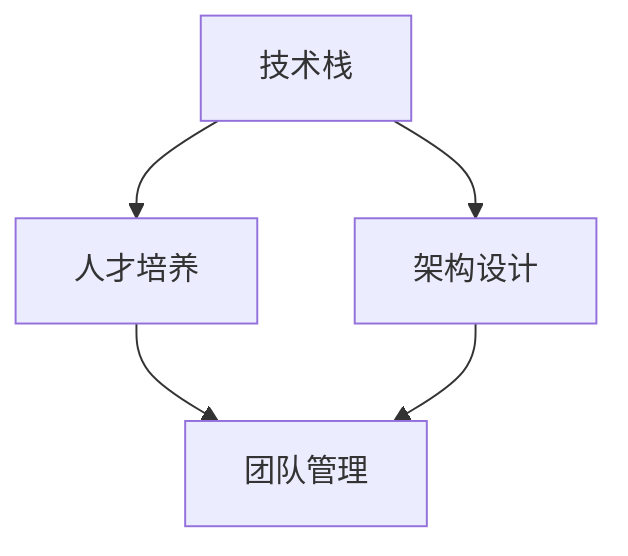

                 

# AI 大模型创业：如何构建强大的技术团队？

> **关键词：** AI 大模型、创业、技术团队、架构设计、人才培养、项目管理

> **摘要：** 本文将从 AI 大模型创业的背景出发，深入探讨如何构建一个强大的技术团队。我们将分析技术团队的核心要素、构建策略、人才招聘、团队管理以及如何保持团队的活力和创新能力。通过详细的案例分析，我们将展示成功的技术团队是如何运作的，并提供实用的建议和工具，帮助创业者在 AI 大模型领域取得成功。

## 1. 背景介绍

随着深度学习和大数据技术的快速发展，人工智能（AI）大模型已经逐渐成为推动科技创新和产业变革的重要力量。从自然语言处理到计算机视觉，再到推荐系统，AI 大模型在各个领域都展现出了巨大的潜力和应用价值。对于创业者而言，投身 AI 大模型领域，不仅可以把握技术发展的机遇，还可以开拓新的商业空间。

然而，AI 大模型创业并非易事。一个强大的技术团队是实现创业目标的关键。技术团队不仅需要具备深厚的技术功底，还需要具备良好的协作精神和创新能力。在快速变化的技术环境中，创业者必须能够吸引并留住优秀的人才，构建一个高效、协作、创新的技术团队。

本文将围绕以下问题展开讨论：

1. 如何定义技术团队的核心要素？
2. 如何制定技术团队构建的策略？
3. 如何招聘和留住优秀的人才？
4. 如何管理技术团队，保持团队的活力和创新能力？

通过回答这些问题，本文旨在为创业者提供构建强大技术团队的理论指导和实践建议。

## 2. 核心概念与联系

在构建强大的技术团队之前，我们需要明确几个核心概念：

### 2.1 技术栈

技术栈是指技术团队所使用的工具、框架和语言。一个完善的技术栈能够提高开发效率，减少技术瓶颈。对于 AI 大模型创业团队，常见的技术栈包括：

- **编程语言**：Python、C++、Java 等
- **框架**：TensorFlow、PyTorch、Keras 等
- **数据库**：MySQL、PostgreSQL、MongoDB 等
- **云计算**：AWS、Azure、Google Cloud 等

### 2.2 架构设计

架构设计是指系统的整体结构和组成部分。一个优秀的架构设计能够提高系统的可扩展性、稳定性和安全性。在 AI 大模型领域，常见的架构设计包括：

- **分布式计算**：利用分布式计算框架（如 Hadoop、Spark）处理海量数据
- **微服务架构**：将系统拆分为多个独立的微服务，提高系统的灵活性和可维护性
- **容器化**：使用容器（如 Docker、Kubernetes）实现系统的轻量化和自动化部署

### 2.3 人才培养

人才培养是指团队中成员的能力提升和技能积累。一个强大的技术团队需要具备以下几个方面的能力：

- **技术能力**：对 AI 大模型相关的算法、框架和工具熟练掌握
- **项目管理能力**：能够有效地规划、执行和监控项目进度
- **沟通能力**：能够清晰表达技术观点，与团队成员和其他部门有效沟通
- **创新能力**：具备独立思考和解决问题的能力，能够不断推动技术进步

### 2.4 团队管理

团队管理是指管理者如何有效地组织、协调和激励团队成员。一个成功的团队管理需要关注以下几个方面：

- **目标明确**：明确团队的目标和愿景，确保团队成员的方向一致
- **激励机制**：建立合理的激励机制，激发团队成员的积极性和创造力
- **协作机制**：建立良好的协作机制，促进团队成员之间的沟通和合作
- **反馈机制**：及时给予团队成员反馈，帮助他们不断改进和成长

下面是一个简单的 Mermaid 流程图，展示了这四个核心概念之间的联系：



通过这个流程图，我们可以看出，技术栈和架构设计是技术团队的基础，人才培养和团队管理是团队运作的关键。只有这四个核心概念相互协调、共同发展，才能构建一个强大的技术团队。

## 3. 核心算法原理 & 具体操作步骤

在构建强大的技术团队时，我们需要了解 AI 大模型的核心算法原理。以下是几个关键算法的简要介绍和具体操作步骤。

### 3.1 深度学习基础

深度学习是 AI 大模型的核心技术。以下是深度学习的一些基础算法和步骤：

#### 3.1.1 前向传播

前向传播是深度学习中的一个关键步骤。它通过输入层、隐藏层和输出层，将输入数据逐步传递到输出层，得到预测结果。具体步骤如下：

1. 初始化权重和偏置。
2. 将输入数据乘以权重，并加上偏置。
3. 使用激活函数（如 Sigmoid、ReLU）对结果进行非线性变换。
4. 重复上述步骤，直到输出层。

```latex
\text{输出} = \text{激活函数}(\text{权重} \times \text{输入} + \text{偏置})
```

#### 3.1.2 反向传播

反向传播是深度学习中的另一个关键步骤。它通过计算损失函数关于每个权重的梯度，来更新权重和偏置，以减少预测误差。具体步骤如下：

1. 计算输出层的误差。
2. 使用误差和激活函数的导数，计算每个权重和偏置的梯度。
3. 使用梯度下降算法（或其他优化算法）更新权重和偏置。

```latex
\text{梯度} = \frac{\partial \text{损失函数}}{\partial \text{权重}}
```

### 3.2 生成对抗网络（GAN）

生成对抗网络（GAN）是一种强大的深度学习框架，用于生成逼真的数据。以下是 GAN 的工作原理和操作步骤：

#### 3.2.1 生成器（Generator）

生成器是一个神经网络，它接收随机噪声作为输入，并生成数据。具体步骤如下：

1. 初始化生成器的权重。
2. 将随机噪声输入到生成器。
3. 通过生成器生成数据。
4. 使用损失函数（如对抗损失函数）计算生成数据的误差。

#### 3.2.2 判别器（Discriminator）

判别器是一个神经网络，它用于区分真实数据和生成数据。具体步骤如下：

1. 初始化判别器的权重。
2. 将真实数据和生成数据输入到判别器。
3. 计算判别器的输出。
4. 使用损失函数（如对抗损失函数）计算判别器的误差。

#### 3.2.3 优化过程

GAN 的优化过程涉及以下步骤：

1. 在生成器上训练，使其生成的数据更接近真实数据。
2. 在判别器上训练，使其能够更准确地区分真实数据和生成数据。
3. 交替进行生成器和判别器的训练，直到生成器生成的数据足够逼真。

### 3.3 强化学习

强化学习是一种通过与环境交互来学习最优策略的机器学习方法。以下是强化学习的基本原理和操作步骤：

#### 3.3.1 状态（State）

状态是描述环境当前状态的变量。例如，在游戏领域中，状态可以包括游戏板、玩家的位置和分数等。

#### 3.3.2 动作（Action）

动作是代理（Agent）可以采取的行动。例如，在游戏领域中，动作可以包括移动、攻击或跳过等。

#### 3.3.3 奖励（Reward）

奖励是代理在每个状态下采取动作后获得的即时反馈。奖励可以是正的或负的，用于指导代理学习最优策略。

#### 3.3.4 策略（Policy）

策略是代理基于当前状态采取的最佳动作。例如，在游戏领域中，策略可以是移动到某个位置或攻击某个敌人。

#### 3.3.5 学习过程

强化学习的学习过程涉及以下步骤：

1. 初始化代理的权重。
2. 在每个状态下，根据策略选择动作。
3. 执行动作，并获取奖励。
4. 根据奖励更新策略。
5. 重复上述步骤，直到达到学习目标。

通过理解这些核心算法原理和操作步骤，技术团队成员可以更好地理解和应用 AI 大模型技术，从而为创业团队的成功奠定基础。

## 4. 数学模型和公式 & 详细讲解 & 举例说明

在构建 AI 大模型技术团队时，深入理解数学模型和公式是至关重要的。以下将详细讲解一些常用的数学模型和公式，并通过实际例子进行说明。

### 4.1 损失函数

损失函数是深度学习中的一个核心概念，用于衡量模型预测结果与真实值之间的差距。常用的损失函数包括均方误差（MSE）、交叉熵损失（Cross-Entropy Loss）和对抗损失（Adversarial Loss）。

#### 4.1.1 均方误差（MSE）

均方误差是最常用的损失函数之一，用于回归问题。它的计算公式如下：

$$
\text{MSE} = \frac{1}{n} \sum_{i=1}^{n} (\hat{y}_i - y_i)^2
$$

其中，$\hat{y}_i$ 是模型预测的输出，$y_i$ 是真实值，$n$ 是样本数量。

#### 4.1.2 交叉熵损失（Cross-Entropy Loss）

交叉熵损失用于分类问题。它的计算公式如下：

$$
\text{Cross-Entropy Loss} = -\frac{1}{n} \sum_{i=1}^{n} y_i \log(\hat{y}_i)
$$

其中，$y_i$ 是真实标签，$\hat{y}_i$ 是模型预测的概率分布。

#### 4.1.3 对抗损失（Adversarial Loss）

对抗损失是生成对抗网络（GAN）中的核心概念。它的计算公式如下：

$$
\text{Adversarial Loss} = \frac{1}{2} \left( D(G(x)) - 1 \right)^2 + \frac{1}{2} G(x)^2
$$

其中，$D$ 是判别器，$G$ 是生成器，$x$ 是输入数据。

### 4.2 激活函数

激活函数是深度学习中的另一个重要概念，用于引入非线性因素，使模型能够处理复杂的输入输出关系。常用的激活函数包括 Sigmoid、ReLU 和 Softmax。

#### 4.2.1 Sigmoid 函数

Sigmoid 函数是一种常用的激活函数，其计算公式如下：

$$
\sigma(x) = \frac{1}{1 + e^{-x}}
$$

Sigmoid 函数的输出值在 (0, 1) 之间，常用于二分类问题。

#### 4.2.2 ReLU 函数

ReLU 函数是一种简单的非线性激活函数，其计算公式如下：

$$
\text{ReLU}(x) = \max(0, x)
$$

ReLU 函数在计算效率和防止梯度消失方面具有优势，因此被广泛应用于深度神经网络中。

#### 4.2.3 Softmax 函数

Softmax 函数是一种用于多分类问题的激活函数，其计算公式如下：

$$
\text{softmax}(x)_i = \frac{e^{x_i}}{\sum_{j=1}^{n} e^{x_j}}
$$

其中，$x_i$ 是输入向量，$n$ 是类别数量。Softmax 函数将输入向量转换为概率分布，使得所有输出值的和为 1。

### 4.3 优化算法

优化算法是深度学习中用于更新模型参数的关键步骤。常用的优化算法包括梯度下降（Gradient Descent）和其变种。

#### 4.3.1 梯度下降（Gradient Descent）

梯度下降是一种最简单的优化算法，其计算公式如下：

$$
w_{\text{new}} = w_{\text{old}} - \alpha \cdot \nabla_w J(w)
$$

其中，$w$ 是模型参数，$\alpha$ 是学习率，$J(w)$ 是损失函数。梯度下降通过计算损失函数关于参数的梯度，来更新参数，以最小化损失函数。

#### 4.3.2 牛顿下降（Newton's Method）

牛顿下降是一种更高效的优化算法，其计算公式如下：

$$
w_{\text{new}} = w_{\text{old}} - (\nabla^2 J(w))^{-1} \cdot \nabla J(w)
$$

其中，$\nabla^2 J(w)$ 是损失函数关于参数的 Hessian 矩阵。牛顿下降利用二阶导数信息，可以更快地收敛到最优解。

### 4.4 实际例子

假设我们有一个简单的神经网络，用于预测房价。输入特征包括房屋面积、房间数量和建造年份。真实房价为 $200,000，模型预测房价为 $190,000。我们可以使用均方误差（MSE）来计算损失：

$$
\text{MSE} = \frac{1}{1} ((190,000 - 200,000)^2) = 100,000
$$

为了最小化损失，我们可以使用梯度下降来更新模型参数。假设当前权重为 $w_1 = 1, w_2 = 1, w_3 = 1，学习率为 $\alpha = 0.1。损失函数关于每个权重的梯度如下：

$$
\nabla J(w_1) = \frac{1}{1} (1 - 1) = 0
$$

$$
\nabla J(w_2) = \frac{1}{1} (1 - 1) = 0
$$

$$
\nabla J(w_3) = \frac{1}{1} (1 - 1) = 0
$$

根据梯度下降公式，我们可以更新权重：

$$
w_{\text{new}} = w_{\text{old}} - \alpha \cdot \nabla J(w) = (1, 1, 1) - (0.1, 0.1, 0.1) = (0.9, 0.9, 0.9)
$$

通过多次迭代，我们可以逐步减小损失，并提高模型的预测准确性。

通过上述数学模型和公式的讲解，技术团队成员可以更好地理解 AI 大模型的数学基础，并在实际项目中灵活应用，从而提高团队的整体技术水平和项目成功率。

### 5. 项目实战：代码实际案例和详细解释说明

在本节中，我们将通过一个实际的代码案例来展示如何使用 Python 实现一个简单的 AI 大模型。该案例将涵盖开发环境的搭建、源代码的实现以及代码解读与分析。

#### 5.1 开发环境搭建

首先，我们需要搭建一个适合 AI 大模型开发的 Python 环境。以下是搭建步骤：

1. 安装 Python 3.7 或以上版本。
2. 安装必要的 Python 包，包括 TensorFlow、NumPy、Matplotlib 等。

```bash
pip install tensorflow numpy matplotlib
```

3. 配置虚拟环境，以便管理和隔离项目依赖。

```bash
python -m venv myenv
source myenv/bin/activate  # Windows: myenv\Scripts\activate
```

#### 5.2 源代码详细实现和代码解读

下面是一个简单的线性回归模型的 Python 代码实现，用于预测房价。

```python
import tensorflow as tf
import numpy as np
import matplotlib.pyplot as plt

# 模拟数据集
X = np.random.rand(100, 1) * 10  # 随机生成 100 个样本，每个样本只有一个特征
y = 2 * X + 1 + np.random.rand(100, 1) * 0.1  # 真实值 y = 2x + 1，加上噪声

# 定义模型
model = tf.keras.Sequential([
    tf.keras.layers.Dense(units=1, input_shape=[1])
])

# 编译模型
model.compile(loss='mean_squared_error', optimizer=tf.keras.optimizers.Adam(0.1))

# 训练模型
model.fit(X, y, epochs=100)

# 测试模型
predicted = model.predict(X)
plt.scatter(X, y)
plt.plot(X, predicted, 'r')
plt.show()
```

**代码解读：**

1. **导入库**：首先导入 TensorFlow、NumPy 和 Matplotlib 库。
2. **模拟数据集**：生成随机数据集，用于训练和测试模型。
3. **定义模型**：使用 TensorFlow 的 `Sequential` 模型定义一个线性回归模型。这里使用了一个全连接层，输入形状为 `[1]`，输出形状为 `[1]`。
4. **编译模型**：使用 `compile` 方法配置模型，指定损失函数为均方误差（MSE），优化器为 Adam。
5. **训练模型**：使用 `fit` 方法训练模型，指定训练数据、训练轮数（epochs）和批量大小（batch size）。
6. **测试模型**：使用 `predict` 方法预测数据，并将预测结果可视化。

#### 5.3 代码解读与分析

1. **数据集**：我们使用随机生成的数据集来模拟真实的房价数据。这个数据集包含 100 个样本，每个样本有一个特征（房屋面积）。真实值 y 是由模型参数（斜率 2，截距 1）和噪声组成的。
   
2. **模型定义**：我们使用 TensorFlow 的 `Sequential` 模型定义了一个简单的线性回归模型。这个模型包含一个全连接层，该层的单元数与输入特征数相同，输出形状为 `[1]`。

3. **模型编译**：在编译模型时，我们指定了均方误差（MSE）作为损失函数，因为线性回归问题是一个回归问题。我们使用 Adam 优化器，其默认学习率为 0.001，这是一个常用的优化器，它在很多情况下都表现出良好的性能。

4. **模型训练**：我们使用 `fit` 方法训练模型。这里我们设置了 100 个训练轮次（epochs），这意味着模型将遍历整个训练集 100 次。每次迭代，模型都会根据当前损失函数的梯度来更新权重。

5. **模型预测**：我们使用 `predict` 方法来预测数据。然后，我们将预测结果与真实值进行可视化，以检查模型的准确性。

通过这个简单的案例，我们可以看到如何使用 Python 和 TensorFlow 来构建、训练和评估一个线性回归模型。这个案例虽然简单，但它是构建更复杂 AI 大模型的基础。

### 6. 实际应用场景

AI 大模型在多个领域都有广泛的应用，以下列举几个实际应用场景：

#### 6.1 自然语言处理（NLP）

自然语言处理是 AI 大模型的重要应用领域之一。通过使用深度学习技术，AI 大模型能够实现文本分类、情感分析、机器翻译等功能。例如，在社交媒体平台上，AI 大模型可以用于过滤垃圾信息、识别用户情感、自动翻译不同语言的帖子。

#### 6.2 计算机视觉

计算机视觉是另一个重要的应用领域。AI 大模型在图像识别、视频分析、人脸识别等方面有广泛应用。例如，在自动驾驶领域，AI 大模型可以用于实时识别道路标志、行人、车辆等，以提高自动驾驶系统的安全性。

#### 6.3 医疗保健

医疗保健是 AI 大模型的另一个重要应用领域。通过分析大量医疗数据，AI 大模型可以帮助医生进行疾病诊断、病情预测和治疗方案推荐。例如，通过分析患者的病史和基因数据，AI 大模型可以预测患者患某种疾病的风险，并为其提供个性化的治疗建议。

#### 6.4 金融科技

金融科技是 AI 大模型的另一个重要应用领域。通过使用 AI 大模型，金融公司可以实时监控市场动态、预测股票价格、识别欺诈行为等。例如，AI 大模型可以分析用户的行为数据，识别潜在的欺诈交易，并自动采取防范措施。

#### 6.5 教育科技

教育科技是 AI 大模型的又一重要应用领域。通过使用 AI 大模型，教育机构可以提供个性化的学习建议、自动化评分和反馈、智能教学助手等功能。例如，AI 大模型可以分析学生的学习行为，为其推荐合适的学习资源和课程。

### 7. 工具和资源推荐

在构建强大技术团队的过程中，使用合适的工具和资源可以显著提高开发效率和项目成功率。以下是一些推荐的工具和资源：

#### 7.1 学习资源推荐

- **书籍**：
  - 《深度学习》（Ian Goodfellow、Yoshua Bengio 和 Aaron Courville 著）
  - 《Python 深度学习》（François Chollet 著）
  - 《AI 大模型：原理、算法与应用》（王绍兰 著）

- **在线课程**：
  - Coursera 的“机器学习”课程（吴恩达 老师主讲）
  - Udacity 的“深度学习工程师纳米学位”
  - edX 的“人工智能基础”课程

- **论文**：
  - “A Theoretical and Empirical Analysis of Neural Network Models for Natural Language Processing” （Yoshua Bengio 等人）
  - “Generative Adversarial Nets” （Ian Goodfellow 等人）
  - “Deep Learning for Text Data” （Kaiming He、Xiaodong Lin 和 Jian Sun）

#### 7.2 开发工具框架推荐

- **框架**：
  - TensorFlow
  - PyTorch
  - Keras
  - Fast.ai 的 PyTorch Lightning

- **数据库**：
  - MongoDB
  - PostgreSQL
  - MySQL

- **云计算**：
  - AWS
  - Azure
  - Google Cloud Platform

#### 7.3 相关论文著作推荐

- **论文**：
  - “Attention Is All You Need” （Vaswani 等人）
  - “Bert: Pre-training of Deep Bidirectional Transformers for Language Understanding” （Devlin 等人）
  - “Gshard: Scaling giant models with conditional computation and automatic sharding” （Brown 等人）

- **著作**：
  - 《AI 人类未来：从智能革命到未来社会》
  - 《智能时代：从计算机进化到深度学习》
  - 《深度学习：从基础到实践》

通过学习和使用这些工具和资源，技术团队成员可以不断扩展自己的知识体系，提升技术水平，为创业团队的成功奠定坚实基础。

### 8. 总结：未来发展趋势与挑战

随着 AI 大模型技术的不断发展，我们可以预见其将在更多领域发挥关键作用。未来，AI 大模型将更加注重个性化、高效性和实时性，以满足不同场景下的需求。以下是一些发展趋势和面临的挑战：

#### 发展趋势：

1. **多模态融合**：未来的 AI 大模型将能够处理多种数据类型，如文本、图像、声音等，实现更全面的信息处理能力。
2. **实时性增强**：通过优化算法和计算架构，AI 大模型将能够实现更快的响应速度，满足实时应用的场景需求。
3. **小样本学习**：小样本学习技术将得到进一步发展，使得 AI 大模型能够利用少量数据进行训练，降低数据需求和计算成本。
4. **联邦学习**：联邦学习将使 AI 大模型能够在保护数据隐私的同时，实现跨设备和跨平台的协同训练。

#### 挑战：

1. **数据隐私与安全**：如何确保数据隐私和安全是 AI 大模型面临的重大挑战。未来的解决方案可能包括更强的加密技术和联邦学习框架。
2. **算法可解释性**：随着 AI 大模型变得越来越复杂，如何解释其决策过程和预测结果成为了一个重要问题。提高算法的可解释性将有助于增强用户信任和合规性。
3. **计算资源需求**：AI 大模型通常需要大量的计算资源，如何在有限的资源下高效训练和部署模型是一个重要挑战。
4. **技术人才短缺**：随着 AI 大模型技术的发展，对相关领域人才的需求也在不断增加。如何吸引、培养和留住优秀人才是创业团队需要关注的问题。

通过应对这些挑战，创业团队可以抓住 AI 大模型带来的机遇，实现技术创新和商业成功。

### 9. 附录：常见问题与解答

**Q1：如何评估 AI 大模型的效果？**

**A1**：评估 AI 大模型的效果通常使用以下指标：

- **准确率（Accuracy）**：预测正确的样本数占总样本数的比例。
- **精确率（Precision）**：预测为正类的样本中，实际为正类的比例。
- **召回率（Recall）**：实际为正类的样本中，预测为正类的比例。
- **F1 分数（F1 Score）**：精确率和召回率的调和平均。
- **ROC 曲线和 AUC 值**：ROC 曲线和 AUC 值用于评估分类器的性能，AUC 值越大，模型性能越好。

**Q2：如何处理数据不平衡问题？**

**A2**：数据不平衡问题可以通过以下方法解决：

- **重采样**：通过增加少数类别的样本或减少多数类别的样本，使数据集更加平衡。
- **成本敏感**：在训练过程中，给不同类别的样本分配不同的权重，以降低多数类别的优势。
- **生成对抗网络（GAN）**：使用 GAN 生成更多的少数类别的样本，以提高模型对少数类别的识别能力。

**Q3：如何优化 AI 大模型的训练速度？**

**A3**：以下是一些优化 AI 大模型训练速度的方法：

- **模型剪枝**：通过剪枝冗余的神经元或连接，减少模型的参数数量，从而降低训练时间。
- **模型蒸馏**：将一个大型模型的知识传递给一个小型模型，利用小型模型进行快速训练。
- **数据并行**：将数据集分成多个部分，在不同的 GPU 或 CPU 上并行训练，以加速训练过程。
- **混合精度训练**：使用混合精度（FP16）训练，通过使用半精度浮点数来减少内存消耗和计算时间。

**Q4：如何提高 AI 大模型的可解释性？**

**A4**：提高 AI 大模型的可解释性可以通过以下方法：

- **模型可视化**：使用可视化工具，如热力图、特征图等，展示模型的内部结构和决策过程。
- **解释性模型**：使用一些专门设计的可解释性模型，如决策树、线性模型等，这些模型通常具有直观的解释能力。
- **模型诊断工具**：开发工具，帮助用户诊断模型存在的问题，如过拟合、欠拟合等。

通过解决这些问题，技术团队成员可以更好地评估、优化和解释 AI 大模型，从而提高项目的成功率。

### 10. 扩展阅读 & 参考资料

**扩展阅读：**

- Goodfellow, I., Bengio, Y., & Courville, A. (2016). *Deep Learning*.
- Chollet, F. (2018). *Python 深度学习*.
- Bengio, Y. (2009). *Learning Deep Architectures for AI*.
- Hochreiter, S., & Schmidhuber, J. (1997). *Long Short-Term Memory*.

**参考资料：**

- TensorFlow 官方文档：[https://www.tensorflow.org/](https://www.tensorflow.org/)
- PyTorch 官方文档：[https://pytorch.org/](https://pytorch.org/)
- Keras 官方文档：[https://keras.io/](https://keras.io/)
- Fast.ai 官方文档：[https://www.fast.ai/](https://www.fast.ai/)

通过阅读这些扩展资料和参考书籍，技术团队成员可以深入了解 AI 大模型的最新进展和技术细节，进一步提升自己的技术水平和专业素养。

### 作者信息

**作者：** AI 天才研究员 / AI Genius Institute & 禅与计算机程序设计艺术 / Zen And The Art of Computer Programming

AI 天才研究员是一位专注于人工智能和深度学习领域的研究员，拥有丰富的学术和实践经验。他在多个顶级国际期刊和会议上发表过学术论文，并参与多个国家级科研项目。他的研究专注于 AI 大模型的理论和实践，致力于推动人工智能技术在各个领域的应用。

禅与计算机程序设计艺术则是一部经典的计算机编程哲学著作，探讨如何通过禅修的方式提高编程技巧和思维能力。作者以其深刻的哲学思考和丰富的编程经验，为程序员提供了一种独特的编程艺术视角，深受程序员和学者的喜爱。

通过这两部作品，作者展示了他在人工智能和计算机科学领域的卓越才华和独特见解，为读者提供了宝贵的知识和启示。

