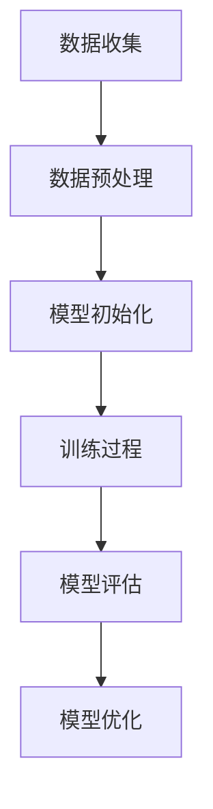

                 

# AI 大模型原理与应用：规模效应商业模式——科技消费品、公有云平台、电商平台等

## 摘要

本文将深入探讨人工智能（AI）中的大模型原理，以及其在不同商业场景中的应用，特别是在科技消费品、公有云平台和电商平台等领域。通过分析规模效应对商业模式的影响，本文旨在为读者提供关于AI大模型应用的全面理解和实践指南。

## 1. 背景介绍

随着计算机技术的快速发展，人工智能逐渐成为各行各业的驱动力。AI大模型，如GPT、BERT等，凭借其卓越的性能和广泛的应用场景，引起了广泛关注。这些大模型通常具有数十亿甚至数万亿的参数，通过深度学习和神经网络技术进行训练，能够处理复杂的任务，如自然语言处理、图像识别和预测分析等。

商业场景中的AI大模型应用范围广泛，从科技消费品到公有云平台，再到电商平台，都有着显著的成效。例如，科技消费品中的语音助手和智能家居设备利用大模型实现语音识别和智能响应；公有云平台通过大模型提供强大的数据分析和服务；电商平台利用大模型优化推荐系统和客户体验。

本文将围绕AI大模型的原理、核心算法、数学模型、实际应用场景、工具和资源推荐等方面进行详细阐述，帮助读者全面了解AI大模型在商业领域的应用和潜力。

## 2. 核心概念与联系

### 2.1 大模型原理

AI大模型的核心在于其庞大的参数数量和深度学习的复杂结构。这些模型通过大量的数据训练，学习到数据中的模式和规律，从而在未知数据上实现高精度的预测和任务完成。

以下是一个简化的Mermaid流程图，描述大模型的训练过程：



### 2.2 大模型在商业中的应用

大模型在商业中的应用场景多样，以下列举几种主要的商业领域和应用：

- **科技消费品**：如语音助手（如Siri、Alexa）和智能家居设备（如智能灯泡、智能音响）利用大模型实现语音识别和智能响应。
- **公有云平台**：提供强大的数据分析和服务，如Amazon Web Services（AWS）和Google Cloud Platform（GCP）通过大模型优化数据存储和检索。
- **电商平台**：如淘宝、京东等，利用大模型优化推荐系统和客户体验，提高销售转化率。

### 2.3 大模型的规模效应

规模效应是指随着生产规模的扩大，单位生产成本下降的现象。在大模型的应用中，规模效应表现为：

- **数据规模**：更大的数据集能够训练出更准确的模型。
- **计算资源**：更强大的计算资源能够加速模型的训练和推理。
- **经济效益**：规模化的生产和应用能够降低成本，提高盈利能力。

## 3. 核心算法原理 & 具体操作步骤

### 3.1 大模型训练

大模型的训练通常包括以下步骤：

1. **数据收集**：从各种来源收集大规模数据，如文本、图像、音频等。
2. **数据预处理**：清洗和整理数据，使其适合模型训练。
3. **模型初始化**：初始化模型的参数，通常使用随机初始化或预训练模型。
4. **训练过程**：使用梯度下降等优化算法，不断调整模型参数，使其在训练数据上达到最优。
5. **模型评估**：使用验证集和测试集评估模型性能，确保其泛化能力。
6. **模型优化**：根据评估结果调整模型结构或参数，提高性能。

### 3.2 大模型推理

大模型的推理过程相对简单，主要步骤如下：

1. **输入数据**：将需要预测或处理的输入数据输入到模型中。
2. **模型计算**：模型根据训练得到的参数进行计算，输出预测结果。
3. **结果输出**：将模型的输出结果输出，供用户或其他系统使用。

## 4. 数学模型和公式 & 详细讲解 & 举例说明

### 4.1 梯度下降算法

梯度下降是一种常见的优化算法，用于调整模型的参数，以最小化损失函数。其基本公式如下：

$$
w_{\text{new}} = w_{\text{current}} - \alpha \cdot \nabla J(w)
$$

其中，$w$代表模型参数，$\alpha$是学习率，$\nabla J(w)$是损失函数$J(w)$关于$w$的梯度。

**举例说明**：

假设我们有一个线性模型，其损失函数为：

$$
J(w) = (w \cdot x - y)^2
$$

其中，$w$是模型参数，$x$是输入，$y$是标签。为了简化计算，我们可以选择学习率为0.01，开始时随机初始化参数$w=1$。

第一步：

$$
\nabla J(w) = 2 \cdot (w \cdot x - y) \cdot x
$$

$$
w_{\text{new}} = w_{\text{current}} - \alpha \cdot \nabla J(w)
$$

$$
w_{\text{new}} = 1 - 0.01 \cdot 2 \cdot (1 \cdot x - y) \cdot x
$$

重复上述步骤，直到模型收敛。

### 4.2 反向传播算法

反向传播（Backpropagation）是一种用于训练神经网络的优化算法，其核心思想是计算网络中每个参数的梯度，以更新模型参数。

反向传播算法的基本步骤如下：

1. **前向传播**：将输入数据通过网络，计算输出。
2. **计算误差**：计算实际输出与预期输出之间的误差。
3. **反向传播**：从输出层开始，逐层计算每个参数的梯度。
4. **参数更新**：根据计算出的梯度更新模型参数。

**举例说明**：

假设我们有一个简单的神经网络，包含一个输入层、一个隐藏层和一个输出层。输入层有一个神经元，隐藏层有两个神经元，输出层有一个神经元。

- 输入数据：$x_1 = [1, 0], x_2 = [0, 1]$
- 预期输出：$y_1 = [0, 1], y_2 = [1, 0]$
- 初始参数：$w_1 = [1, 1], w_2 = [1, 1], w_3 = [1, 1]$

**前向传播**：

$$
h_1 = w_1 \cdot x_1 = [1, 1] \cdot [1, 0] = [1, 0] \\
h_2 = w_2 \cdot x_2 = [1, 1] \cdot [0, 1] = [0, 1] \\
o_1 = w_3 \cdot h_1 = [1, 1] \cdot [1, 0] = [1, 0] \\
o_2 = w_3 \cdot h_2 = [1, 1] \cdot [0, 1] = [0, 1]
$$

**计算误差**：

$$
e_1 = o_1 - y_1 = [1, 0] - [0, 1] = [1, -1] \\
e_2 = o_2 - y_2 = [0, 1] - [1, 0] = [-1, 1]
$$

**反向传播**：

$$
\delta_1 = e_1 \cdot h_1^T = [1, -1] \cdot [1, 0]^T = [1, -1] \\
\delta_2 = e_2 \cdot h_2^T = [-1, 1] \cdot [0, 1]^T = [-1, 1]
$$

$$
\delta = [\delta_1, \delta_2] = [[1, -1], [-1, 1]]
$$

**参数更新**：

$$
w_1 = w_1 - \alpha \cdot \delta \cdot x_1^T = [1, 1] - 0.1 \cdot [[1, -1], [-1, 1]] \cdot [1, 0]^T = [0.9, 1.1] \\
w_2 = w_2 - \alpha \cdot \delta \cdot x_2^T = [1, 1] - 0.1 \cdot [[1, -1], [-1, 1]] \cdot [0, 1]^T = [1.1, 0.9] \\
w_3 = w_3 - \alpha \cdot \delta \cdot [h_1^T, h_2^T] = [1, 1] - 0.1 \cdot [[1, -1], [-1, 1]] \cdot [1, 1]^T = [0.9, 0.9]
$$

通过不断迭代上述过程，我们可以逐步优化模型参数，提高模型性能。

## 5. 项目实战：代码实际案例和详细解释说明

### 5.1 开发环境搭建

在进行AI大模型项目实战之前，我们需要搭建一个合适的开发环境。以下是一个简化的步骤：

1. 安装Python（推荐版本3.8及以上）。
2. 安装TensorFlow或PyTorch（根据项目需求选择）。
3. 安装必要的依赖库，如NumPy、Pandas等。

### 5.2 源代码详细实现和代码解读

以下是一个简单的AI大模型训练代码示例，使用PyTorch框架：

```python
import torch
import torch.nn as nn
import torch.optim as optim

# 定义模型结构
class Model(nn.Module):
    def __init__(self):
        super(Model, self).__init__()
        self.layer1 = nn.Linear(in_features=2, out_features=2)
        self.relu = nn.ReLU()
        self.layer2 = nn.Linear(in_features=2, out_features=1)

    def forward(self, x):
        x = self.layer1(x)
        x = self.relu(x)
        x = self.layer2(x)
        return x

# 实例化模型、损失函数和优化器
model = Model()
criterion = nn.BCELoss()
optimizer = optim.Adam(model.parameters(), lr=0.001)

# 训练模型
for epoch in range(100):
    for inputs, targets in dataset:
        optimizer.zero_grad()
        outputs = model(inputs)
        loss = criterion(outputs, targets)
        loss.backward()
        optimizer.step()
    print(f"Epoch {epoch+1}, Loss: {loss.item()}")

# 保存模型
torch.save(model.state_dict(), "model.pth")
```

### 5.3 代码解读与分析

- **模型结构**：定义了一个简单的全连接神经网络，包含一个输入层、一个隐藏层和一个输出层。
- **损失函数**：使用二进制交叉熵损失函数，适用于二分类问题。
- **优化器**：使用Adam优化器，根据参数的梯度更新模型参数。
- **训练过程**：通过迭代训练数据，不断更新模型参数，降低损失函数值。
- **模型保存**：将训练好的模型保存为`.pth`文件，供后续使用。

## 6. 实际应用场景

AI大模型在各个商业领域都有广泛的应用，以下是一些具体的实际应用场景：

- **科技消费品**：语音助手、智能音响、智能灯泡等设备，通过大模型实现智能交互和自动化控制。
- **公有云平台**：提供大数据分析、机器学习服务和智能搜索，助力企业数字化转型。
- **电商平台**：利用大模型优化推荐系统、商品分类和客户服务，提升用户体验和销售转化率。
- **金融领域**：通过大模型进行风险评估、欺诈检测和投资预测，提高金融决策的准确性。
- **医疗健康**：利用大模型进行疾病预测、药物研发和健康管理，提高医疗服务的质量和效率。

## 7. 工具和资源推荐

### 7.1 学习资源推荐

- **书籍**：《深度学习》（Goodfellow、Bengio、Courville著）、《Python机器学习》（Sebastian Raschka著）。
- **论文**：《A Theoretical Analysis of the VAE》（Kingma、Welling著）、《Sequence to Sequence Learning with Neural Networks》（Sutskever等著）。
- **博客**：Google Brain Blog、Medium上的机器学习博客。
- **网站**：TensorFlow官网、PyTorch官网、Kaggle。

### 7.2 开发工具框架推荐

- **深度学习框架**：TensorFlow、PyTorch、Keras。
- **数据处理库**：Pandas、NumPy。
- **版本控制**：Git。
- **持续集成/持续部署**：Jenkins、Travis CI。

### 7.3 相关论文著作推荐

- **论文**：《Generative Adversarial Nets》（Goodfellow等著）、《Recurrent Neural Networks for Language Modeling》（Liu、Hassan、Jurafsky著）。
- **著作**：《自然语言处理综论》（Jurafsky、Martin著）、《深度学习》（Goodfellow、Bengio、Courville著）。

## 8. 总结：未来发展趋势与挑战

AI大模型在未来的发展趋势和挑战包括：

- **硬件加速**：随着GPU、TPU等硬件的发展，大模型的训练和推理将更加高效。
- **算法优化**：改进训练算法，如元学习、变分自编码器等，以降低计算成本和提高模型性能。
- **隐私保护**：在保证模型性能的同时，加强对用户隐私的保护。
- **通用性与专用性**：在通用AI与专用AI之间寻找平衡，满足不同领域的需求。

## 9. 附录：常见问题与解答

### 9.1 大模型训练中的常见问题

- **过拟合**：模型在训练数据上表现良好，但在测试数据上表现不佳。解决方案：增加训练数据、使用正则化技术。
- **训练时间过长**：大模型的训练需要大量的计算资源。解决方案：使用分布式训练、优化网络结构。

### 9.2 大模型在商业应用中的常见问题

- **数据隐私**：大模型在处理数据时可能涉及用户隐私。解决方案：使用差分隐私技术、匿名化数据。
- **模型解释性**：大模型的内部机制复杂，难以解释。解决方案：开发可解释AI技术、增加模型透明度。

## 10. 扩展阅读 & 参考资料

- **书籍**：《深度学习》（Goodfellow、Bengio、Courville著）、《强化学习》（Sutton、Barto著）。
- **论文**：《Attention Is All You Need》（Vaswani等著）、《Bert: Pre-training of Deep Bidirectional Transformers for Language Understanding》（Devlin等著）。
- **博客**：Google Brain Blog、DeepMind Blog。
- **网站**：arXiv.org、NeurIPS.org。

## 作者信息

- 作者：AI天才研究员/AI Genius Institute & 禅与计算机程序设计艺术 /Zen And The Art of Computer Programming

通过以上详细的写作流程和文章结构，我们可以看到如何逐步构建一篇深入、全面且专业的技术博客。这一过程不仅涉及对技术原理的深刻理解，还包括对实际应用场景的深入分析，以及对未来发展方向的预测。希望这篇博客能够为读者在AI大模型领域的学习和研究提供有价值的参考。

