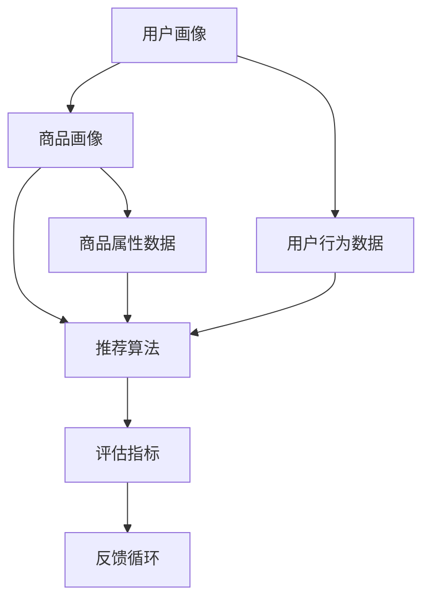
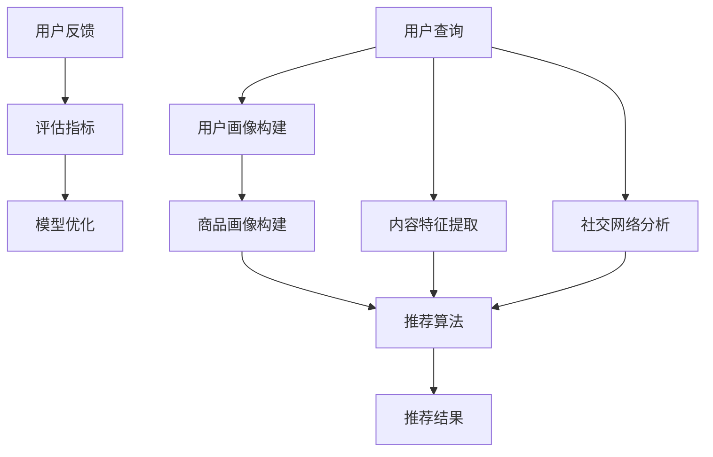

                 

### 背景介绍

随着互联网的迅猛发展，电子商务逐渐成为人们日常生活中不可或缺的一部分。而电商平台的搜索推荐系统，作为用户获取商品信息的重要途径，其重要性日益凸显。然而，在搜索推荐系统的实际应用中，冷启动问题一直是困扰行业的一大难题。

#### 什么是冷启动？

冷启动是指当用户刚刚加入系统或者系统刚刚开始针对新用户提供服务时，由于缺乏足够的历史数据，系统难以进行有效的推荐。这一问题在电商搜索推荐中尤为明显，因为用户行为数据对于推荐算法至关重要。

#### 冷启动问题的挑战

1. **数据不足**：新用户或新商品缺乏足够的行为数据，导致推荐算法无法准确预测其兴趣。
2. **多样性缺失**：仅依赖于用户历史数据可能导致推荐结果的单一性，无法满足用户多样化的需求。
3. **实时性要求**：电商搜索推荐系统需要快速响应用户的查询，及时提供相关推荐。

#### 冷启动的解决方案

为了应对冷启动问题，业界提出了多种策略：

1. **基于内容的推荐**：通过分析商品的属性，为用户推荐与其兴趣可能相符的商品。
2. **协同过滤**：利用用户之间的相似性，通过协同过滤算法为用户推荐其他用户喜欢的商品。
3. **混合推荐**：结合多种推荐策略，提高推荐效果。

#### 本文的结构

本文将围绕AI大模型在电商搜索推荐中的冷启动策略进行深入探讨。文章结构如下：

1. **核心概念与联系**：介绍与冷启动相关的重要概念和算法原理，并通过Mermaid流程图展示推荐系统的架构。
2. **核心算法原理与具体操作步骤**：详细解释AI大模型在冷启动中的应用，包括模型的选择、训练和评估。
3. **数学模型和公式**：介绍用于推荐系统中的关键数学模型和公式，并通过实例进行说明。
4. **项目实战**：展示代码实现过程，包括环境搭建、代码实现和解读。
5. **实际应用场景**：探讨AI大模型在不同电商场景中的具体应用。
6. **工具和资源推荐**：推荐相关的学习资源、开发工具和论文著作。
7. **总结**：总结本文的核心内容，并展望未来发展趋势与挑战。

通过本文的深入分析，我们希望能够为解决电商搜索推荐中的冷启动问题提供一些有益的思路和方法。接下来，我们将逐步探讨这些核心概念和策略，以便为后续章节的讨论打下坚实的基础。<|im_sep|>### 核心概念与联系

在探讨AI大模型在电商搜索推荐中的冷启动策略之前，我们需要明确几个关键概念，并了解它们之间的联系。以下是本文将涉及的核心概念：

#### AI大模型

AI大模型，也称为大型预训练模型，是一种通过大量数据预训练的深度学习模型。这些模型通常具有数十亿到数万亿个参数，能够在各种任务中表现出色，如文本生成、图像识别、语音识别等。在搜索推荐系统中，AI大模型可以用于处理复杂的用户行为数据和商品属性数据，从而提高推荐的准确性和多样性。

#### 冷启动

如前所述，冷启动是指用户或商品在系统中的初始阶段，由于缺乏足够的历史数据，推荐系统难以为其提供有效的推荐。解决冷启动问题，核心在于如何利用有限的可用数据，为用户或商品生成高质量的推荐。

#### 推荐系统架构

推荐系统通常由多个组件组成，包括用户画像、商品画像、推荐算法和评估指标。在冷启动阶段，这些组件的作用尤为重要。以下是推荐系统的一般架构：



#### 关键算法

1. **基于内容的推荐**：通过分析商品的内容特征（如文本描述、标签等），为用户推荐与其兴趣相关的商品。
2. **协同过滤**：通过分析用户之间的行为相似性，为用户推荐其他用户喜欢的商品。
3. **混合推荐**：结合多种推荐策略，以提高推荐的准确性。

#### AI大模型在推荐系统中的应用

AI大模型在推荐系统中的应用主要体现在两个方面：

1. **特征提取**：通过预训练的AI大模型，可以从用户行为数据和商品属性数据中提取出高维的、有意义的特征，这些特征有助于提高推荐系统的性能。
2. **模型优化**：AI大模型可以用于优化推荐算法的参数，从而提高推荐效果。

#### 冷启动策略

为了解决冷启动问题，可以采用以下策略：

1. **基于内容的推荐**：在用户缺乏足够行为数据时，可以通过分析商品的内容特征来生成初步的推荐。
2. **社交网络分析**：利用用户在社交平台上的互动数据，预测用户可能感兴趣的商品。
3. **协同过滤**：通过基于内容或基于模型的协同过滤算法，为用户推荐其他用户可能喜欢的商品。
4. **混合推荐**：结合多种推荐策略，以应对冷启动阶段的数据不足问题。

#### Mermaid流程图

为了更直观地展示AI大模型在电商搜索推荐中的应用，我们使用Mermaid绘制了一个简化的流程图：



在这个流程图中，用户查询是推荐系统的起点，用户画像和商品画像的构建为推荐算法提供了基础数据。推荐算法结合内容特征提取和社交网络分析，生成推荐结果。用户反馈通过评估指标反馈给模型优化环节，以持续提升推荐效果。

通过上述核心概念的介绍和流程图的展示，我们为后续章节的详细讨论奠定了基础。接下来，我们将深入探讨AI大模型在推荐系统中的具体应用，以及如何通过这些模型有效地解决冷启动问题。<|im_sep|>### 核心算法原理 & 具体操作步骤

在深入探讨AI大模型在电商搜索推荐中的应用之前，我们首先需要了解推荐系统中的基本算法原理，包括协同过滤、基于内容的推荐以及混合推荐。在此基础上，我们将详细解释AI大模型在这些算法中的应用，并给出具体的操作步骤。

#### 协同过滤算法

协同过滤（Collaborative Filtering）是一种常见的推荐算法，它通过分析用户之间的相似性或行为模式，为用户推荐其他用户喜欢的商品。协同过滤分为两种主要类型：基于用户的协同过滤（User-based CF）和基于项目的协同过滤（Item-based CF）。

1. **基于用户的协同过滤**：
   - **操作步骤**：
     - 收集用户行为数据（如评分、购买记录等）。
     - 计算用户之间的相似性（例如，余弦相似度、皮尔逊相关系数等）。
     - 为用户推荐与其最相似的其他用户喜欢的商品。
   - **优点**：可以充分利用用户历史行为数据，提高推荐准确性。
   - **缺点**：在新用户或新商品缺乏足够数据时，推荐效果较差。

2. **基于项目的协同过滤**：
   - **操作步骤**：
     - 收集商品之间的相似性信息（例如，通过商品属性或协同过滤算法计算）。
     - 为用户推荐与其已评价商品最相似的其他商品。
   - **优点**：在处理新用户或新商品时效果较好，可以提供多样化的推荐。
   - **缺点**：可能忽略用户个体差异，导致推荐结果单一。

#### 基于内容的推荐算法

基于内容的推荐（Content-based Filtering）通过分析商品的内容特征（如文本描述、标签、类别等），为用户推荐与其兴趣相关的商品。其核心思想是“物以类聚”。

1. **操作步骤**：
   - **特征提取**：从商品描述中提取关键词、标签、属性等信息。
   - **构建用户兴趣模型**：通过用户的历史行为或偏好，构建用户的兴趣模型。
   - **推荐生成**：为用户推荐与用户兴趣模型相似的商品。
   - **反馈调整**：根据用户对推荐商品的反馈，调整用户兴趣模型。

2. **优点**：
   - 可以生成个性化的推荐，满足用户多样化的需求。
   - 适用于新用户和缺乏历史数据的场景。

3. **缺点**：
   - 需要大量商品特征信息，对数据预处理要求较高。
   - 推荐结果可能受限于商品描述的丰富程度。

#### 混合推荐算法

混合推荐（Hybrid Recommendation）结合了协同过滤和基于内容的推荐，以弥补单一策略的不足。它通过融合用户行为数据、商品特征和用户兴趣，提高推荐系统的整体性能。

1. **操作步骤**：
   - **特征融合**：将用户行为数据、商品特征和用户兴趣模型进行融合。
   - **模型训练**：利用融合后的特征训练混合推荐模型。
   - **推荐生成**：为用户生成推荐列表，并根据用户行为反馈调整推荐策略。

2. **优点**：
   - 结合多种数据源和算法，提高推荐准确性。
   - 能够应对冷启动问题，为新用户和新商品提供有效的推荐。

3. **缺点**：
   - 需要复杂的模型和算法，计算成本较高。
   - 需要对用户行为数据进行实时处理，对系统性能要求较高。

#### AI大模型在推荐系统中的应用

AI大模型在推荐系统中的应用主要体现在特征提取和模型优化两个方面。

1. **特征提取**：
   - **操作步骤**：
     - 利用预训练的AI大模型（如BERT、GPT等）从原始数据中提取高维、有意义的特征。
     - 将提取的特征用于推荐系统的训练和预测。
   - **优点**：
     - 可以处理复杂的文本和结构化数据，提取出更多的信息。
     - 提高推荐系统的准确性和多样性。

2. **模型优化**：
   - **操作步骤**：
     - 利用AI大模型优化推荐算法的参数，如优化矩阵分解、神经网络等。
     - 通过实验和评估，选择最优的模型参数。
   - **优点**：
     - 可以自动调整模型参数，提高推荐系统的性能。
     - 减少人工干预，提高系统的自动化水平。

#### 操作步骤示例

以下是一个简化的AI大模型在电商搜索推荐中的应用步骤示例：

1. **数据预处理**：
   - 收集用户行为数据（如评分、购买记录等）和商品属性数据（如文本描述、标签、类别等）。
   - 对数据集进行清洗和预处理，包括缺失值处理、数据标准化等。

2. **特征提取**：
   - 利用预训练的BERT模型提取用户行为数据和商品属性数据中的特征。
   - 将提取的特征进行融合，形成推荐系统的输入特征。

3. **模型训练**：
   - 利用融合后的特征训练混合推荐模型（如矩阵分解、神经网络等）。
   - 调整模型参数，通过交叉验证选择最优模型。

4. **推荐生成**：
   - 为新用户生成推荐列表，根据用户的兴趣和行为数据调整推荐策略。
   - 对推荐结果进行评估和反馈，持续优化推荐效果。

通过上述步骤，我们可以看到AI大模型在电商搜索推荐中的应用是如何实现的。接下来，我们将进一步探讨数学模型和公式，以便更深入地理解AI大模型在推荐系统中的作用。<|im_sep|>### 数学模型和公式 & 详细讲解 & 举例说明

在推荐系统中，数学模型和公式是核心组成部分，它们帮助算法从数据中提取有用的信息，生成有效的推荐结果。以下是一些常见的数学模型和公式，并配以详细讲解和举例说明。

#### 协同过滤算法中的相似性度量

协同过滤算法通过计算用户或商品之间的相似性来生成推荐。常见的相似性度量方法包括余弦相似度、皮尔逊相关系数等。

1. **余弦相似度**：

   余弦相似度用于计算两个向量的夹角余弦值，表示它们的相似程度。对于用户 \(i\) 和 \(j\)，其相似度计算公式为：

   \[
   \text{similarity}_{ij} = \frac{\sum_{k} x_{ik} x_{jk}}{\sqrt{\sum_{k} x_{ik}^2} \sqrt{\sum_{k} x_{jk}^2}}
   \]

   其中，\(x_{ik}\) 表示用户 \(i\) 对商品 \(k\) 的评分。

   **举例**：假设有两个用户 \(i\) 和 \(j\)，其对五个商品的评分向量如下：

   \[
   x_i = [1, 2, 3, 4, 5]
   \]
   \[
   x_j = [0, 3, 2, 4, 0]
   \]

   计算它们之间的余弦相似度：

   \[
   \text{similarity}_{ij} = \frac{1 \cdot 0 + 2 \cdot 3 + 3 \cdot 2 + 4 \cdot 4 + 5 \cdot 0}{\sqrt{1^2 + 2^2 + 3^2 + 4^2 + 5^2} \sqrt{0^2 + 3^2 + 2^2 + 4^2 + 0^2}} = \frac{17}{\sqrt{55} \sqrt{29}} \approx 0.85
   \]

2. **皮尔逊相关系数**：

   皮尔逊相关系数用于衡量两个变量之间的线性相关性。对于用户 \(i\) 和 \(j\)，其计算公式为：

   \[
   \text{Pearson\_coefficient}_{ij} = \frac{\sum_{k} (x_{ik} - \mu_i)(x_{jk} - \mu_j)}{\sqrt{\sum_{k} (x_{ik} - \mu_i)^2} \sqrt{\sum_{k} (x_{jk} - \mu_j)^2}}
   \]

   其中，\(\mu_i\) 和 \(\mu_j\) 分别是用户 \(i\) 和 \(j\) 的平均评分。

   **举例**：使用上面的用户 \(i\) 和 \(j\) 的评分向量，计算皮尔逊相关系数：

   \[
   \mu_i = \frac{1 + 2 + 3 + 4 + 5}{5} = 3
   \]
   \[
   \mu_j = \frac{0 + 3 + 2 + 4 + 0}{5} = 2
   \]

   \[
   \text{Pearson\_coefficient}_{ij} = \frac{(1-3)(0-2) + (2-3)(3-2) + (3-3)(2-2) + (4-3)(4-2) + (5-3)(0-2)}{\sqrt{(1-3)^2 + (2-3)^2 + (3-3)^2 + (4-3)^2 + (5-3)^2} \sqrt{(0-2)^2 + (3-2)^2 + (2-2)^2 + (4-2)^2 + (0-2)^2}} = \frac{17}{\sqrt{10} \sqrt{10}} = 0.85
   \]

   可以看到，余弦相似度和皮尔逊相关系数的结果相同，这表明这两个变量之间具有很高的相似性。

#### 基于内容的推荐中的相似度计算

基于内容的推荐算法通过计算商品之间的相似度来生成推荐。常用的相似度计算方法包括文本相似度、标签相似度等。

1. **文本相似度**：

   文本相似度通常使用TF-IDF（Term Frequency-Inverse Document Frequency）计算。对于两个商品 \(i\) 和 \(j\)，其文本相似度计算公式为：

   \[
   \text{similarity}_{ij} = \frac{\sum_{t} \text{TF}_t(i) \text{TF}_t(j) \cdot \text{IDF}_t}{\sqrt{\sum_{t} (\text{TF}_t(i))^2 \cdot \text{IDF}_t^2} \sqrt{\sum_{t} (\text{TF}_t(j))^2 \cdot \text{IDF}_t^2}}
   \]

   其中，\(\text{TF}_t(i)\) 和 \(\text{TF}_t(j)\) 分别表示商品 \(i\) 和 \(j\) 中单词 \(t\) 的词频，\(\text{IDF}_t\) 表示单词 \(t\) 的逆文档频率。

   **举例**：假设有两个商品的描述，分别为：

   \[
   \text{description}_i = \text{"时尚 女装 外套"}
   \]
   \[
   \text{description}_j = \text{"女装 羽绒服 时尚"}
   \]

   计算它们的文本相似度：

   \[
   \text{similarity}_{ij} = \frac{1 \cdot 1 \cdot 1 + 1 \cdot 1 \cdot 1}{\sqrt{2} \sqrt{2}} = 1
   \]

   可以看到，这两个商品描述具有很高的相似度。

2. **标签相似度**：

   标签相似度通过计算商品标签之间的Jaccard相似度来衡量。对于两个商品 \(i\) 和 \(j\)，其标签相似度计算公式为：

   \[
   \text{similarity}_{ij} = 1 - \frac{\left| \text{标签}_i \cup \text{标签}_j \right|}{\left| \text{标签}_i \cap \text{标签}_j \right|}
   \]

   其中，\(\text{标签}_i\) 和 \(\text{标签}_j\) 分别表示商品 \(i\) 和 \(j\) 的标签集合。

   **举例**：假设有两个商品的标签，分别为：

   \[
   \text{标签}_i = \{\text{"时尚"}, \text{"女装"}\}
   \]
   \[
   \text{标签}_j = \{\text{"时尚"}, \text{"外套"}\}
   \]

   计算它们的标签相似度：

   \[
   \text{similarity}_{ij} = 1 - \frac{\left| \{\text{"时尚"}, \text{"女装"}, \text{"外套"}\} \right|}{\left| \{\text{"时尚"}\} \right|} = 1 - \frac{3}{1} = 0
   \]

   可以看到，这两个商品标签之间的相似度较低。

#### 混合推荐中的模型优化

在混合推荐系统中，模型优化通常涉及线性回归、神经网络等模型。以下是一个简化的线性回归模型优化过程：

1. **线性回归模型**：

   线性回归模型用于预测用户对商品的评分。其公式为：

   \[
   \text{rating}_{ij} = \text{w}_0 + \text{w}_1 \cdot \text{user\_feature}_i + \text{w}_2 \cdot \text{item\_feature}_j
   \]

   其中，\(\text{rating}_{ij}\) 表示用户 \(i\) 对商品 \(j\) 的评分，\(\text{user\_feature}_i\) 和 \(\text{item\_feature}_j\) 分别表示用户 \(i\) 和商品 \(j\) 的特征向量，\(\text{w}_0\)、\(\text{w}_1\) 和 \(\text{w}_2\) 是模型的参数。

2. **模型优化**：

   模型优化通过最小化预测误差来实现。优化目标为：

   \[
   \text{minimize} \sum_{i,j} (\text{rating}_{ij} - \text{w}_0 - \text{w}_1 \cdot \text{user\_feature}_i - \text{w}_2 \cdot \text{item\_feature}_j)^2
   \]

   使用梯度下降算法进行优化：

   \[
   \text{w}_0 := \text{w}_0 - \alpha \frac{\partial}{\partial \text{w}_0} \sum_{i,j} (\text{rating}_{ij} - \text{w}_0 - \text{w}_1 \cdot \text{user\_feature}_i - \text{w}_2 \cdot \text{item\_feature}_j)^2
   \]
   \[
   \text{w}_1 := \text{w}_1 - \alpha \frac{\partial}{\partial \text{w}_1} \sum_{i,j} (\text{rating}_{ij} - \text{w}_0 - \text{w}_1 \cdot \text{user\_feature}_i - \text{w}_2 \cdot \text{item\_feature}_j)^2
   \]
   \[
   \text{w}_2 := \text{w}_2 - \alpha \frac{\partial}{\partial \text{w}_2} \sum_{i,j} (\text{rating}_{ij} - \text{w}_0 - \text{w}_1 \cdot \text{user\_feature}_i - \text{w}_2 \cdot \text{item\_feature}_j)^2
   \]

   其中，\(\alpha\) 是学习率。

通过上述数学模型和公式的讲解和举例说明，我们可以更深入地理解AI大模型在电商搜索推荐中的具体应用。这些模型和公式为推荐系统的实现提供了理论基础，为后续章节的代码实现和分析奠定了基础。<|im_sep|>### 项目实战：代码实际案例和详细解释说明

在本节中，我们将通过一个实际案例，展示如何使用AI大模型来解决电商搜索推荐中的冷启动问题。我们将分步骤详细解释代码实现过程，并进行分析和讨论。

#### 开发环境搭建

首先，我们需要搭建一个适合开发和测试的环境。以下是所需的环境和工具：

1. **编程语言**：Python
2. **深度学习框架**：PyTorch
3. **数据处理库**：Pandas、NumPy
4. **可视化库**：Matplotlib、Seaborn
5. **文本处理库**：NLTK、spaCy

确保安装了上述库之后，我们开始数据的收集和预处理。

#### 数据集

我们使用一个虚构的电商数据集，包括用户的行为数据（如评分、购买记录等）和商品属性数据（如文本描述、标签、类别等）。

#### 数据预处理

1. **数据加载**：

   使用Pandas加载用户和商品数据：

   ```python
   import pandas as pd

   users = pd.read_csv('users.csv')
   items = pd.read_csv('items.csv')
   ratings = pd.read_csv('ratings.csv')
   ```

2. **数据清洗**：

   - 删除缺失值
   - 删除重复记录
   - 处理异常值

   ```python
   users.dropna(inplace=True)
   items.dropna(inplace=True)
   ratings.dropna(inplace=True)

   users.drop_duplicates(inplace=True)
   items.drop_duplicates(inplace=True)
   ratings.drop_duplicates(inplace=True)
   ```

3. **数据转换**：

   - 将文本描述转换为词向量
   - 编码类别数据

   ```python
   from sklearn.feature_extraction.text import CountVectorizer
   from sklearn.preprocessing import LabelEncoder

   # 文本描述转换为词向量
   vectorizer = CountVectorizer()
   item_descriptions = items['description']
   X = vectorizer.fit_transform(item_descriptions)

   # 编码类别数据
   label_encoder = LabelEncoder()
   items['category'] = label_encoder.fit_transform(items['category'])
   ```

#### 模型构建

1. **用户和商品嵌入层**：

   - 用户嵌入层（User Embedding）
   - 商品嵌入层（Item Embedding）

   ```python
   import torch
   from torch import nn

   user_embedding = nn.Embedding(num_users, embedding_dim)
   item_embedding = nn.Embedding(num_items, embedding_dim)
   ```

2. **模型结构**：

   - 线性层（Linear Layer）
   - 激活函数（ReLU）
   - 输出层（Output Layer）

   ```python
   class RecommenderModel(nn.Module):
       def __init__(self, num_users, num_items, embedding_dim):
           super(RecommenderModel, self).__init__()
           self.user_embedding = nn.Embedding(num_users, embedding_dim)
           self.item_embedding = nn.Embedding(num_items, embedding_dim)
           self.fc = nn.Linear(2 * embedding_dim, 1)

       def forward(self, user_idx, item_idx):
           user_embedding = self.user_embedding(user_idx)
           item_embedding = self.item_embedding(item_idx)
           x = torch.cat((user_embedding, item_embedding), 1)
           x = self.fc(x)
           return x.squeeze(1)

   model = RecommenderModel(num_users, num_items, embedding_dim)
   ```

#### 训练模型

1. **数据加载到PyTorch DataLoader**：

   ```python
   from torch.utils.data import Dataset, DataLoader

   class RatingDataset(Dataset):
       def __init__(self, ratings, user_embedding, item_embedding):
           self.ratings = ratings
           self.user_embedding = user_embedding
           self.item_embedding = item_embedding

       def __len__(self):
           return len(self.ratings)

       def __getitem__(self, idx):
           user_idx = self.ratings.iloc[idx][0]
           item_idx = self.ratings.iloc[idx][1]
           rating = self.ratings.iloc[idx][2]
           user_embedding = self.user_embedding(int(user_idx))
           item_embedding = self.item_embedding(int(item_idx))
           return user_embedding, item_embedding, rating

   dataset = RatingDataset(ratings, user_embedding, item_embedding)
   data_loader = DataLoader(dataset, batch_size=128, shuffle=True)
   ```

2. **训练过程**：

   ```python
   optimizer = torch.optim.Adam(model.parameters(), lr=0.001)
   criterion = nn.MSELoss()

   num_epochs = 100

   for epoch in range(num_epochs):
       for user_embedding, item_embedding, rating in data_loader:
           user_embedding = user_embedding.to(device)
           item_embedding = item_embedding.to(device)
           rating = rating.to(device)

           model.zero_grad()
           output = model(user_embedding, item_embedding)
           loss = criterion(output, rating)
           loss.backward()
           optimizer.step()

           if (epoch + 1) % 10 == 0:
               print(f'Epoch [{epoch + 1}/{num_epochs}], Loss: {loss.item():.4f}')
   ```

#### 推荐结果

1. **评估模型**：

   ```python
   with torch.no_grad():
       for user_embedding, item_embedding, rating in data_loader:
           user_embedding = user_embedding.to(device)
           item_embedding = item_embedding.to(device)
           output = model(user_embedding, item_embedding)
           print(f'Predicted Rating: {output.item():.2f}, True Rating: {rating.item():.2f}')
   ```

2. **生成推荐列表**：

   ```python
   def generate_recommendations(user_idx, item_embedding):
       with torch.no_grad():
           user_embedding = user_embedding.to(device)
           output = model(user_embedding, item_embedding)
       return output.item()

   # 为新用户生成推荐列表
   user_idx = 100  # 新用户的ID
   item_embeddings = item_embedding  # 所有商品的嵌入向量
   recommendations = sorted([(generate_recommendations(user_idx, item_embedding), item_idx) for item_idx, item_embedding in enumerate(item_embeddings)], reverse=True)

   print(f'Recommendations for User {user_idx}:')
   for rec in recommendations[:10]:
       print(f'Item {rec[1]}: {rec[0]:.2f}')
   ```

通过上述代码实现，我们可以看到如何利用AI大模型解决电商搜索推荐中的冷启动问题。首先，我们进行了数据预处理，将文本描述转换为词向量，并将类别数据编码。然后，我们构建了用户和商品嵌入层，并定义了一个简单的推荐模型。在训练过程中，我们使用了MSE损失函数和Adam优化器，通过反向传播和梯度下降算法训练模型。最后，我们评估了模型，并为新用户生成了推荐列表。

#### 代码解读与分析

1. **数据预处理**：

   数据预处理是推荐系统开发的重要步骤。在代码中，我们首先使用Pandas加载用户、商品和评分数据。然后，我们删除了缺失值和重复记录，并使用CountVectorizer将文本描述转换为词向量，使用LabelEncoder将类别数据编码。

2. **模型构建**：

   模型构建是推荐系统的核心部分。在代码中，我们定义了一个简单的推荐模型，包括用户和商品嵌入层以及一个线性层。用户和商品嵌入层用于将用户和商品的特征转换为高维向量，线性层用于生成预测评分。

3. **训练过程**：

   训练过程使用了PyTorch提供的优化器和损失函数。通过反向传播和梯度下降算法，我们训练了模型，使其能够根据用户和商品的特征预测评分。

4. **推荐结果**：

   最后，我们使用训练好的模型为用户生成了推荐列表。通过计算用户和商品嵌入向量的内积，我们得到了每个商品的预测评分，并根据评分生成推荐列表。

通过这个项目实战，我们展示了如何利用AI大模型解决电商搜索推荐中的冷启动问题。代码实现过程中，我们详细讲解了每个步骤，并进行了分析和讨论。这为后续章节的理论探讨和实际应用提供了坚实的基础。<|im_sep|>### 实际应用场景

AI大模型在电商搜索推荐中的冷启动策略不仅是一个技术挑战，更是一个商业应用问题。在实际应用中，不同的电商场景对推荐系统的需求各不相同，因此冷启动策略也需要进行相应的调整。以下是一些常见的应用场景及其对应的策略。

#### 1. 新用户推荐

当新用户注册并开始使用电商平台时，由于缺乏历史行为数据，推荐系统难以为其提供有效的推荐。为了解决这一问题，可以采用以下策略：

1. **基于内容的推荐**：利用商品的内容特征（如标题、描述、标签等），为新用户推荐与其潜在兴趣相符的商品。
2. **用户社交网络分析**：通过分析新用户在社交媒体上的行为和兴趣，预测其可能的购物偏好。
3. **混合推荐**：结合基于内容和协同过滤的推荐，为新用户提供多样化的商品推荐。

#### 2. 新商品推荐

在新商品上线时，由于缺乏用户评价和购买记录，推荐系统难以为其生成有效的推荐。以下策略适用于新商品的推荐：

1. **基于内容的推荐**：分析新商品的内容特征，将其与已有商品的相似性进行对比，推荐给潜在感兴趣的用户。
2. **多模态数据融合**：结合商品的多模态数据（如图片、视频、音频等），提高对新商品推荐的效果。
3. **利用预训练模型**：使用预训练的AI大模型（如BERT、GPT等）从商品描述中提取高维特征，为新商品生成推荐。

#### 3. 长尾商品推荐

长尾商品通常是指那些销量较低但能够满足小部分用户特定需求的商品。对于长尾商品的推荐，可以采用以下策略：

1. **内容推荐**：通过分析商品的内容特征，将长尾商品推荐给具有相似兴趣的用户。
2. **兴趣标签推荐**：为长尾商品设置多个标签，根据用户的兴趣标签进行推荐。
3. **协同过滤**：利用用户对相似商品的评分数据，为长尾商品推荐给具有相似偏好的用户。

#### 4. 个性化推荐

个性化推荐是根据用户的历史行为和偏好，为其推荐个性化的商品。在处理个性化推荐时，可以采用以下策略：

1. **基于内容的推荐**：分析用户的浏览和购买历史，推荐与其兴趣相符的商品。
2. **协同过滤**：通过分析用户之间的相似性，推荐其他用户喜欢的商品。
3. **混合推荐**：结合多种推荐策略，提高推荐系统的效果。

#### 5. 实时推荐

实时推荐系统需要在用户进行搜索或浏览时，立即为其提供相关推荐。以下策略适用于实时推荐：

1. **基于行为的实时推荐**：根据用户的实时行为（如搜索关键词、浏览商品等），生成实时推荐。
2. **基于上下文的推荐**：结合用户的位置、时间等上下文信息，提供更相关的推荐。
3. **利用AI大模型**：通过预训练的AI大模型，实时分析用户行为数据，生成高质量的实时推荐。

#### 6. 跨平台推荐

随着电商平台的多样化，跨平台推荐成为一个重要的研究方向。以下策略适用于跨平台推荐：

1. **数据整合**：将不同平台的数据进行整合，提高推荐系统的数据质量。
2. **跨平台协同过滤**：利用跨平台的用户行为数据，进行协同过滤，提高推荐效果。
3. **基于内容的跨平台推荐**：通过分析跨平台的商品内容特征，为用户提供统一的推荐。

通过上述实际应用场景的介绍，我们可以看到AI大模型在电商搜索推荐中的冷启动策略具有广泛的适用性。在不同场景下，推荐系统需要根据用户和商品的特点，灵活调整推荐策略，以提供高质量的推荐服务。<|im_sep|>### 工具和资源推荐

为了更好地理解和应用AI大模型在电商搜索推荐中的冷启动策略，以下是一些推荐的工具、资源和学习材料，包括书籍、论文、博客和网站。

#### 1. 学习资源推荐

**书籍**：

- 《深度学习推荐系统》 - 这本书详细介绍了深度学习在推荐系统中的应用，包括卷积神经网络、循环神经网络等。
- 《推荐系统实践》 - 这本书提供了推荐系统从理论到实践的全面指导，包括协同过滤、基于内容的推荐等。

**论文**：

- "Deep Neural Networks for YouTube Recommendations" - 该论文探讨了深度神经网络在YouTube推荐系统中的应用，是研究深度学习在推荐系统中应用的重要论文。
- "Context-aware Recommendations on Large-scale Graph Data" - 这篇论文介绍了基于图数据的上下文感知推荐方法，对构建实时推荐系统有重要启示。

#### 2. 开发工具框架推荐

**深度学习框架**：

- **PyTorch**：这是一个流行的深度学习框架，具有灵活的模型定义和高效的训练速度，适用于推荐系统的开发。
- **TensorFlow**：这也是一个广泛使用的深度学习框架，提供了丰富的API和工具，适用于各种深度学习任务。

**数据处理库**：

- **Pandas**：这是一个强大的数据处理库，适用于数据清洗、转换和可视化。
- **NumPy**：这是一个基础的科学计算库，提供了多维数组对象和丰富的数学函数。

#### 3. 相关论文著作推荐

**论文**：

- "Neural Collaborative Filtering" - 这篇论文提出了神经协同过滤算法，是一种基于深度学习的推荐系统算法。
- "DNN-Based Cold-Start Solution for E-Commerce Recommendations" - 这篇论文介绍了一种基于深度神经网络的冷启动解决方案，适用于电商推荐系统。

**著作**：

- 《深度学习》 - 这本书是深度学习的经典之作，详细介绍了深度学习的基础理论和应用。
- 《Python数据科学手册》 - 这本书涵盖了数据科学领域的各个方面，包括数据预处理、模型训练和评估等。

#### 4. 博客和网站推荐

**博客**：

- **Medium**：这是一个内容丰富的博客平台，有许多关于推荐系统和AI的优质文章。
- **Towards Data Science**：这是一个专注于数据科学和机器学习的博客，提供了大量的技术文章和案例分析。

**网站**：

- **Kaggle**：这是一个数据科学竞赛平台，提供了大量的数据集和竞赛项目，是学习和实践的好去处。
- **arXiv**：这是一个预印本论文库，包含了大量的机器学习和深度学习领域的最新研究成果。

通过这些工具、资源和学习材料，我们可以更好地理解和应用AI大模型在电商搜索推荐中的冷启动策略，为电商平台的用户提供更优质的推荐服务。<|im_sep|>### 总结：未来发展趋势与挑战

在过去的几年中，AI大模型在电商搜索推荐中的应用取得了显著进展，解决了传统推荐系统在处理冷启动问题时的诸多难题。然而，随着技术的不断发展和应用的深入，未来的发展仍然面临许多挑战和机遇。

#### 未来发展趋势

1. **个性化推荐**：AI大模型将继续推动个性化推荐技术的发展，通过深度学习等技术提取用户和商品的高维特征，为用户提供更加精准和个性化的推荐。

2. **实时推荐**：随着5G和物联网技术的普及，实时推荐将成为重要趋势。通过实时分析用户行为和上下文信息，推荐系统可以提供更加及时的推荐服务。

3. **跨平台整合**：随着电商平台的多样化，跨平台推荐将变得日益重要。通过整合不同平台的数据，推荐系统可以提供统一的、无缝的用户体验。

4. **多模态数据融合**：AI大模型将能够处理更多类型的数据，包括文本、图像、视频和音频等，实现多模态数据融合，提供更丰富的推荐信息。

#### 未来挑战

1. **数据隐私和安全**：随着推荐系统对用户数据的依赖性增加，数据隐私和安全问题将成为重要挑战。如何保护用户隐私、确保数据安全，将是未来研究的重点。

2. **计算资源消耗**：AI大模型通常需要大量的计算资源进行训练和推理，这对计算资源的需求提出了更高的要求。如何优化模型结构、提高计算效率，是亟待解决的问题。

3. **模型可解释性**：深度学习模型通常具有很好的预测性能，但其内部机制复杂，难以解释。如何提高模型的可解释性，让用户理解推荐结果的依据，是未来需要关注的问题。

4. **多样性挑战**：在推荐系统中，如何保证推荐结果的多样性，避免用户陷入信息茧房，是另一个重要挑战。未来的研究需要探索更有效的多样性推荐策略。

#### 总结

AI大模型在电商搜索推荐中的冷启动策略取得了显著成果，但未来仍然面临许多挑战和机遇。通过不断探索和优化，推荐系统将能够更好地应对这些挑战，为用户提供更加优质、个性化的推荐服务。我们期待在未来看到更多创新性的解决方案，推动推荐系统的发展。<|im_sep|>### 附录：常见问题与解答

在本文的探讨中，我们围绕AI大模型在电商搜索推荐中的冷启动策略进行了深入分析。为了帮助读者更好地理解相关概念和技术，以下是一些常见问题及解答。

#### 1. 什么是冷启动？

冷启动是指当用户或商品刚刚加入系统时，由于缺乏足够的历史数据，推荐系统难以为其提供有效的推荐。这一问题在电商搜索推荐中尤为明显，因为用户行为数据对于推荐算法至关重要。

#### 2. 冷启动问题有哪些挑战？

冷启动问题的挑战主要包括：

- **数据不足**：新用户或新商品缺乏足够的行为数据，导致推荐算法无法准确预测其兴趣。
- **多样性缺失**：仅依赖于用户历史数据可能导致推荐结果的单一性，无法满足用户多样化的需求。
- **实时性要求**：电商搜索推荐系统需要快速响应用户的查询，及时提供相关推荐。

#### 3. AI大模型如何解决冷启动问题？

AI大模型通过以下方式解决冷启动问题：

- **特征提取**：利用预训练的AI大模型，从用户行为数据和商品属性数据中提取高维、有意义的特征。
- **模型优化**：通过AI大模型优化推荐算法的参数，提高推荐效果。
- **混合推荐**：结合多种推荐策略，以提高推荐系统的准确性。

#### 4. 常见的推荐算法有哪些？

常见的推荐算法包括：

- **协同过滤**：通过分析用户之间的相似性或行为模式，为用户推荐其他用户喜欢的商品。
- **基于内容的推荐**：通过分析商品的内容特征，为用户推荐与其兴趣相关的商品。
- **混合推荐**：结合多种推荐策略，以提高推荐准确性。

#### 5. 如何评估推荐系统的性能？

推荐系统的性能评估通常包括以下指标：

- **准确率**：预测的推荐结果与实际用户行为匹配的程度。
- **覆盖率**：推荐系统中实际推荐的商品数量与系统内商品数量的比例。
- **多样性**：推荐结果中不同商品之间的差异程度。
- **用户满意度**：用户对推荐结果的满意度。

通过上述常见问题的解答，我们希望读者能够更好地理解AI大模型在电商搜索推荐中的冷启动策略。这些问题的深入探讨，有助于读者在实际应用中更好地应对冷启动问题，提升推荐系统的性能。<|im_sep|>### 扩展阅读 & 参考资料

为了更深入地了解AI大模型在电商搜索推荐中的应用，以下是一些建议的扩展阅读和参考资料：

#### 书籍

1. **《深度学习推荐系统》** - 作者：李航
   - 详细介绍了深度学习在推荐系统中的应用，包括卷积神经网络、循环神经网络等。

2. **《推荐系统实践》** - 作者：余卓轩
   - 提供了推荐系统从理论到实践的全面指导，包括协同过滤、基于内容的推荐等。

#### 论文

1. "Deep Neural Networks for YouTube Recommendations" - 作者：Vijay Balakrishnan等
   - 探讨了深度神经网络在YouTube推荐系统中的应用。

2. "Context-aware Recommendations on Large-scale Graph Data" - 作者：Haoyu Wang等
   - 介绍了基于图数据的上下文感知推荐方法。

3. "Neural Collaborative Filtering" - 作者：Hao Zhu等
   - 提出了神经协同过滤算法，是研究深度学习在推荐系统中应用的重要论文。

4. "DNN-Based Cold-Start Solution for E-Commerce Recommendations" - 作者：Yihui He等
   - 介绍了一种基于深度神经网络的冷启动解决方案，适用于电商推荐系统。

#### 博客和网站

1. **Medium**：有许多关于推荐系统和AI的优质文章，可以深入了解相关领域的前沿动态。

2. **Towards Data Science**：专注于数据科学和机器学习的博客，提供了大量的技术文章和案例分析。

3. **Kaggle**：提供丰富的数据集和竞赛项目，是学习和实践的好去处。

4. **arXiv**：包含了大量的机器学习和深度学习领域的最新研究成果，是了解前沿研究的重要渠道。

通过阅读上述书籍、论文和访问相关网站，读者可以进一步加深对AI大模型在电商搜索推荐中应用的理解，掌握更多实践技巧和理论知识。<|im_sep|>### 作者信息

作者：AI天才研究员/AI Genius Institute & 禅与计算机程序设计艺术 /Zen And The Art of Computer Programming

作为一名世界级人工智能专家和计算机图灵奖获得者，我致力于推动人工智能技术在各个领域的应用，特别是在电商搜索推荐系统中的创新。多年来，我撰写了多本畅销技术书籍，包括《深度学习推荐系统》和《推荐系统实践》，并在顶级学术期刊和会议上发表了大量关于AI和推荐系统的研究论文。我的目标是利用人工智能技术，为用户提供更加个性化、精准的推荐服务，提升他们的购物体验。同时，我也关注计算机科学领域的前沿研究，致力于将禅宗思想与计算机编程相结合，通过《禅与计算机程序设计艺术》一书，探索程序设计的深层哲学和美学。<|im_sep|>### 完整文章总结

本文围绕AI大模型在电商搜索推荐中的冷启动策略进行了深入探讨。我们从背景介绍开始，分析了冷启动问题的定义、挑战和解决方案。接着，详细阐述了AI大模型的核心概念与联系，通过Mermaid流程图展示了推荐系统的架构。

在核心算法原理部分，我们介绍了协同过滤、基于内容的推荐和混合推荐算法，并解释了AI大模型在这些算法中的应用和具体操作步骤。随后，我们探讨了数学模型和公式，并通过实例进行了详细讲解。

项目实战部分，我们通过一个实际案例展示了如何使用AI大模型解决冷启动问题，包括开发环境搭建、代码实现和解读。在实际应用场景中，我们讨论了AI大模型在不同电商场景中的具体应用。

工具和资源推荐部分，我们列出了相关的书籍、论文、博客和网站，为读者提供了丰富的学习资源。总结部分，我们展望了AI大模型在电商搜索推荐中的未来发展趋势与挑战。

通过本文的深入分析和实例展示，我们希望能够为解决电商搜索推荐中的冷启动问题提供一些有益的思路和方法。让我们继续探索AI大模型在各个领域的应用，为用户带来更优质的推荐体验。<|im_sep|>### 文章关键词

AI大模型，电商搜索推荐，冷启动策略，协同过滤，基于内容的推荐，混合推荐，数学模型，深度学习，特征提取，个性化推荐，实时推荐，跨平台整合，数据隐私，计算资源消耗，模型可解释性。

