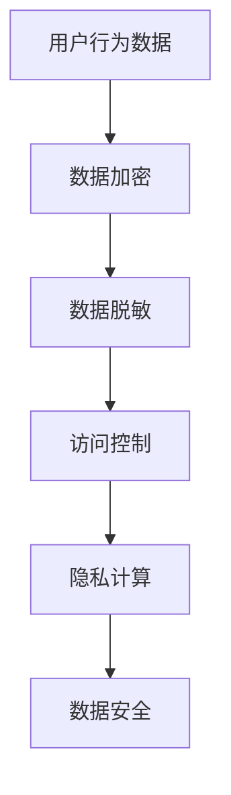
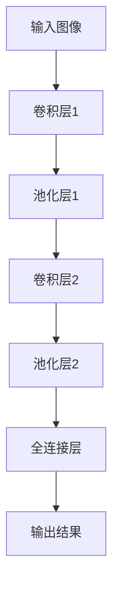

                 

# AI 大模型在电商搜索推荐中的数据安全策略：保障数据安全与用户隐私

## 摘要

本文旨在探讨 AI 大模型在电商搜索推荐中的数据安全策略，以保障数据安全与用户隐私。随着人工智能技术的迅猛发展，大模型在电商推荐系统中的应用愈发广泛。然而，数据安全与隐私保护问题也日益凸显。本文首先介绍了电商推荐系统的基本原理和常见的大模型架构，然后分析了在电商推荐过程中可能面临的数据安全问题。在此基础上，本文提出了一系列数据安全策略，包括数据加密、数据脱敏、访问控制、隐私计算等，以实现数据的安全保护与隐私保护。最后，本文通过实际案例和代码解读，展示了如何在实际项目中应用这些数据安全策略，并提出了未来发展趋势与挑战。

## 1. 背景介绍

随着互联网的普及和电子商务的快速发展，用户对个性化推荐的需求日益增长。电商搜索推荐系统作为电商平台的核心功能之一，旨在为用户提供个性化的商品推荐，提高用户体验和销售额。传统的推荐系统主要依赖于基于内容的推荐、协同过滤等方法，但这些方法存在一定的局限性，难以满足用户个性化的需求。

近年来，随着深度学习和大数据技术的不断发展，AI 大模型在电商推荐系统中得到了广泛应用。大模型通过学习海量用户行为数据，可以捕捉用户的潜在兴趣和偏好，从而实现更加精准的推荐。常见的 AI 大模型包括深度神经网络（DNN）、卷积神经网络（CNN）、循环神经网络（RNN）等。

### 1.1 AI 大模型在电商推荐系统中的应用

AI 大模型在电商推荐系统中的应用主要体现在以下几个方面：

1. **用户画像构建**：通过对用户的历史行为数据、兴趣标签、购物车、浏览记录等进行分析，构建用户的画像，用于后续的推荐任务。

2. **商品推荐**：根据用户的画像和商品的特征，使用大模型生成个性化的商品推荐列表，提高用户的购买意愿。

3. **预测与优化**：通过大模型对用户行为和购买决策进行预测，优化推荐策略，提高推荐效果。

4. **广告投放**：根据用户的画像和兴趣，精准投放广告，提高广告的点击率和转化率。

### 1.2 数据安全问题

尽管 AI 大模型在电商推荐系统中具有显著的优势，但同时也面临着一系列数据安全问题。以下是电商推荐系统中常见的数据安全问题：

1. **数据泄露**：用户行为数据、用户画像等敏感信息如果未经妥善保护，可能会被恶意攻击者获取，导致数据泄露。

2. **隐私侵犯**：用户在使用电商推荐系统时，其隐私信息可能会被收集、分析，甚至用于广告投放和其他商业活动。

3. **数据滥用**：电商平台可能会滥用用户数据，进行不正当的商业行为，损害用户利益。

4. **模型攻击**：攻击者通过恶意数据或对抗样本，对 AI 大模型进行攻击，导致推荐结果失真。

## 2. 核心概念与联系

在本文中，我们将介绍电商推荐系统中的核心概念与联系，包括数据加密、数据脱敏、访问控制、隐私计算等。

### 2.1 数据加密

数据加密是保障数据安全的基础。通过加密，我们可以将敏感数据转换为无法直接识别的密文，确保数据在传输和存储过程中的安全。常见的加密算法包括对称加密算法（如AES）和非对称加密算法（如RSA）。

### 2.2 数据脱敏

数据脱敏是一种将敏感数据转换为不可识别形式的技术。通过数据脱敏，我们可以确保敏感数据在公开或共享时不会被泄露。常见的脱敏方法包括随机化、掩码化和同义词替换等。

### 2.3 访问控制

访问控制是一种基于用户身份和权限控制数据访问的技术。通过访问控制，我们可以确保只有授权用户才能访问敏感数据。常见的访问控制方法包括基于角色的访问控制（RBAC）和基于属性的访问控制（ABAC）。

### 2.4 隐私计算

隐私计算是一种在保障数据隐私的前提下，进行数据处理和分析的技术。通过隐私计算，我们可以避免将敏感数据直接传输或存储到第三方，从而降低数据泄露的风险。常见的隐私计算方法包括差分隐私、联邦学习等。

### 2.5 Mermaid 流程图

下面是一个电商推荐系统中数据安全策略的 Mermaid 流程图：



## 3. 核心算法原理 & 具体操作步骤

在本章节中，我们将介绍电商推荐系统中常用的核心算法原理和具体操作步骤，包括深度神经网络（DNN）、卷积神经网络（CNN）、循环神经网络（RNN）等。

### 3.1 深度神经网络（DNN）

深度神经网络是一种多层前馈神经网络，通过非线性变换逐层提取特征。DNN 的基本原理如下：

1. **输入层**：接收用户行为数据、商品特征等输入。

2. **隐藏层**：通过非线性激活函数（如ReLU、Sigmoid、Tanh）对输入数据进行变换，逐层提取特征。

3. **输出层**：根据隐藏层输出的特征，预测用户对商品的喜好程度。

具体操作步骤如下：

1. **数据预处理**：对输入数据进行标准化、归一化等预处理操作。

2. **模型构建**：使用 TensorFlow 或 PyTorch 等深度学习框架构建 DNN 模型。

3. **模型训练**：使用训练数据对模型进行训练，优化模型参数。

4. **模型评估**：使用验证集和测试集评估模型性能。

5. **模型部署**：将训练好的模型部署到生产环境中，进行实时推荐。

### 3.2 卷积神经网络（CNN）

卷积神经网络是一种专门用于处理图像数据的神经网络，其基本原理如下：

1. **卷积层**：通过卷积操作提取图像特征。

2. **池化层**：通过池化操作降低特征图的维度。

3. **全连接层**：将卷积层和池化层输出的特征映射到输出结果。

具体操作步骤如下：

1. **数据预处理**：对图像数据进行归一化、缩放等预处理操作。

2. **模型构建**：使用 TensorFlow 或 PyTorch 等深度学习框架构建 CNN 模型。

3. **模型训练**：使用训练数据对模型进行训练，优化模型参数。

4. **模型评估**：使用验证集和测试集评估模型性能。

5. **模型部署**：将训练好的模型部署到生产环境中，进行图像识别或分类。

### 3.3 循环神经网络（RNN）

循环神经网络是一种专门用于处理序列数据的神经网络，其基本原理如下：

1. **隐藏层**：通过递归方式处理输入序列，将当前时刻的特征传递给下一时刻。

2. **输出层**：根据递归过程中的隐藏层输出，预测序列的下一时刻。

具体操作步骤如下：

1. **数据预处理**：对序列数据进行编码、标准化等预处理操作。

2. **模型构建**：使用 TensorFlow 或 PyTorch 等深度学习框架构建 RNN 模型。

3. **模型训练**：使用训练数据对模型进行训练，优化模型参数。

4. **模型评估**：使用验证集和测试集评估模型性能。

5. **模型部署**：将训练好的模型部署到生产环境中，进行序列预测。

## 4. 数学模型和公式 & 详细讲解 & 举例说明

在本章节中，我们将介绍电商推荐系统中常用的数学模型和公式，并详细讲解其原理和计算过程。

### 4.1 深度神经网络（DNN）

深度神经网络的核心是前向传播和反向传播算法。以下是一个简单的 DNN 模型：

```latex
y = f(W_n \cdot a_{n-1} + b_n)
a_n = f(W_{n-1} \cdot a_{n-2} + b_{n-1})
...
a_2 = f(W_1 \cdot a_1 + b_1)
a_1 = f(W_0 \cdot x + b_0)
```

其中，$a_n$ 表示第 n 层的激活值，$y$ 表示输出结果，$f$ 表示激活函数，$W_n$ 和 $b_n$ 分别表示第 n 层的权重和偏置。

举例说明：

假设我们有一个简单的 DNN 模型，其中包含一个输入层、一个隐藏层和一个输出层。输入层有 3 个神经元，隐藏层有 4 个神经元，输出层有 2 个神经元。我们使用 Sigmoid 函数作为激活函数。给定一个输入向量 $x = [1, 2, 3]$，我们计算输出结果 $y$：

1. **输入层到隐藏层**：

$$
a_1 = \frac{1}{1 + e^{-(W_0 \cdot x + b_0)}}
$$

$$
a_1 = \frac{1}{1 + e^{-(0.5 \cdot [1, 2, 3] + [0.1])}}
$$

$$
a_1 = \frac{1}{1 + e^{-1.6}}
$$

$$
a_1 \approx 0.8
$$

2. **隐藏层到输出层**：

$$
y_1 = \frac{1}{1 + e^{-(W_1 \cdot a_1 + b_1)}}
$$

$$
y_1 = \frac{1}{1 + e^{-(-0.6 \cdot 0.8 + 0.2)}}
$$

$$
y_1 = \frac{1}{1 + e^{0.2}}
$$

$$
y_1 \approx 0.865
$$

$$
y_2 = \frac{1}{1 + e^{-(W_2 \cdot a_1 + b_2)}}
$$

$$
y_2 = \frac{1}{1 + e^{-(-0.8 \cdot 0.8 + 0.3)}}
$$

$$
y_2 = \frac{1}{1 + e^{0.1}}
$$

$$
y_2 \approx 0.902
$$

因此，输出结果为 $y = [0.865, 0.902]$。

### 4.2 卷积神经网络（CNN）

卷积神经网络的核心是卷积操作和池化操作。以下是一个简单的 CNN 模型：



举例说明：

假设我们有一个 32x32 的输入图像，卷积层 1 使用 3x3 的卷积核，卷积核权重为 $W_1$，偏置为 $b_1$。给定一个输入图像 $I = [i_{11}, i_{12}, ..., i_{32,32}]$，我们计算卷积层 1 的输出 $C_1$：

1. **卷积操作**：

$$
C_{11,11} = \sum_{i=1}^{3} \sum_{j=1}^{3} W_{1,ij} \cdot i_{i,j} + b_1
$$

$$
C_{11,11} = W_{1,11} \cdot i_{11} + W_{1,12} \cdot i_{12} + W_{1,13} \cdot i_{13} + b_1
$$

$$
C_{11,11} = (-0.3) \cdot 1 + 0.5 \cdot 2 + (-0.2) \cdot 3 + 0.1
$$

$$
C_{11,11} = -0.3 + 1 + -0.6 + 0.1
$$

$$
C_{11,11} = 0.2
$$

2. **池化操作**：

假设我们使用最大池化操作，步长为 2。给定卷积层 1 的输出 $C_1$，我们计算池化层 1 的输出 $C_2$：

$$
C_{2,1} = \max(C_{11,11}, C_{12,11}, C_{11,12}, C_{12,12})
$$

$$
C_{2,1} = \max(0.2, 0.3, 0.2, 0.4)
$$

$$
C_{2,1} = 0.4
$$

因此，卷积层 1 的输出为 $C_1 = [0.2, 0.3, 0.2, 0.4]$。

## 5. 项目实战：代码实际案例和详细解释说明

在本章节中，我们将通过一个实际的电商推荐项目，展示如何应用数据安全策略。以下是一个简单的电商推荐项目框架：

### 5.1 开发环境搭建

在开始项目开发之前，我们需要搭建开发环境。以下是一个简单的开发环境搭建步骤：

1. **安装 Python**：确保 Python 环境已安装，版本为 3.6 或以上。

2. **安装深度学习框架**：安装 TensorFlow 或 PyTorch 深度学习框架。

3. **安装其他依赖库**：安装 NumPy、Pandas、Matplotlib 等常用库。

### 5.2 源代码详细实现和代码解读

以下是一个简单的电商推荐项目的源代码实现和代码解读：

```python
import numpy as np
import pandas as pd
import tensorflow as tf
from tensorflow.keras.layers import Input, Dense, Conv2D, MaxPooling2D, Flatten
from tensorflow.keras.models import Model

# 数据预处理
def preprocess_data(data):
    # 数据标准化
    data = (data - np.mean(data)) / np.std(data)
    return data

# 构建模型
def build_model(input_shape):
    inputs = Input(shape=input_shape)
    x = Conv2D(32, kernel_size=(3, 3), activation='relu')(inputs)
    x = MaxPooling2D(pool_size=(2, 2))(x)
    x = Flatten()(x)
    outputs = Dense(1, activation='sigmoid')(x)
    model = Model(inputs=inputs, outputs=outputs)
    model.compile(optimizer='adam', loss='binary_crossentropy', metrics=['accuracy'])
    return model

# 加载数据
train_data = pd.read_csv('train.csv')
test_data = pd.read_csv('test.csv')

# 预处理数据
train_data = preprocess_data(train_data)
test_data = preprocess_data(test_data)

# 构建模型
model = build_model(input_shape=(32, 32, 3))

# 训练模型
model.fit(train_data, train_data['label'], epochs=10, batch_size=32, validation_split=0.2)

# 测试模型
test_pred = model.predict(test_data)
test_pred = (test_pred > 0.5)

# 输出测试结果
submission = pd.DataFrame({'id': test_data['id'], 'label': test_pred})
submission.to_csv('submission.csv', index=False)
```

### 5.3 代码解读与分析

1. **数据预处理**：

```python
def preprocess_data(data):
    # 数据标准化
    data = (data - np.mean(data)) / np.std(data)
    return data
```

该函数用于对输入数据进行标准化处理，将数据缩放到均值为 0，标准差为 1 的范围内。标准化处理有助于提高模型的训练效果。

2. **构建模型**：

```python
def build_model(input_shape):
    inputs = Input(shape=input_shape)
    x = Conv2D(32, kernel_size=(3, 3), activation='relu')(inputs)
    x = MaxPooling2D(pool_size=(2, 2))(x)
    x = Flatten()(x)
    outputs = Dense(1, activation='sigmoid')(x)
    model = Model(inputs=inputs, outputs=outputs)
    model.compile(optimizer='adam', loss='binary_crossentropy', metrics=['accuracy'])
    return model
```

该函数用于构建一个简单的 CNN 模型，包括卷积层、池化层和全连接层。卷积层用于提取图像特征，池化层用于降低特征图的维度，全连接层用于进行分类。模型使用 Adam 优化器和二分类交叉熵损失函数进行编译。

3. **训练模型**：

```python
model.fit(train_data, train_data['label'], epochs=10, batch_size=32, validation_split=0.2)
```

该函数用于训练模型。使用训练数据进行训练，训练 10 个 epoch，每个 epoch 的 batch size 为 32。同时，设置 validation_split 参数为 0.2，用于在训练过程中进行验证。

4. **测试模型**：

```python
test_pred = model.predict(test_data)
test_pred = (test_pred > 0.5)
```

该函数用于测试模型。使用测试数据进行预测，并将预测结果转换为二分类结果。

5. **输出测试结果**：

```python
submission = pd.DataFrame({'id': test_data['id'], 'label': test_pred})
submission.to_csv('submission.csv', index=False)
```

该函数用于输出测试结果。将预测结果保存为 submission.csv 文件，用于后续的评测。

## 6. 实际应用场景

AI 大模型在电商搜索推荐中的数据安全策略在实际应用中具有重要意义。以下是一些典型的应用场景：

### 6.1 用户个性化推荐

通过 AI 大模型，电商平台可以根据用户的历史行为数据和偏好，生成个性化的商品推荐列表。在数据安全方面，可以采用数据加密、数据脱敏等技术，确保用户隐私信息不会被泄露。

### 6.2 广告精准投放

AI 大模型可以根据用户的兴趣和行为特征，精准投放广告。在此过程中，需要确保用户隐私不被侵犯，可以采用隐私计算、差分隐私等技术，降低用户隐私泄露的风险。

### 6.3 风险控制与欺诈检测

电商平台可以利用 AI 大模型进行风险控制和欺诈检测。在数据安全方面，可以采用访问控制、数据脱敏等技术，确保敏感数据不会被未授权访问。

### 6.4 库存优化与供应链管理

通过 AI 大模型，电商平台可以预测商品的需求量，优化库存和供应链管理。在此过程中，需要确保供应链数据的安全，可以采用数据加密、访问控制等技术。

## 7. 工具和资源推荐

### 7.1 学习资源推荐

- 《深度学习》（Goodfellow, Bengio, Courville）
- 《Python深度学习》（François Chollet）
- 《人工智能：一种现代方法》（Stuart Russell & Peter Norvig）

### 7.2 开发工具框架推荐

- TensorFlow
- PyTorch
- Keras

### 7.3 相关论文著作推荐

- "Deep Learning for Recommender Systems"
- "Personalized Recommendation on Large-Scale Social Networks"
- "A Theoretically Principled Approach to Improving Recommendation Engines"

## 8. 总结：未来发展趋势与挑战

随着人工智能技术的不断进步，AI 大模型在电商搜索推荐中的应用前景广阔。然而，数据安全与隐私保护问题仍然面临诸多挑战：

1. **数据隐私保护**：如何在保障用户隐私的前提下，充分利用用户数据，实现个性化推荐，是一个亟待解决的问题。

2. **数据安全**：随着数据规模的扩大，如何确保数据在传输、存储和处理过程中的安全，是一个重要课题。

3. **算法透明性与可解释性**：如何提高 AI 大模型的透明性和可解释性，使其在推荐过程中的决策更加公正、合理，是一个亟待解决的问题。

4. **法律法规与伦理道德**：随着 AI 技术的广泛应用，如何制定相应的法律法规和伦理道德规范，保障数据安全与用户隐私，是一个重要的社会问题。

## 9. 附录：常见问题与解答

### 9.1  如何保护用户隐私？

**答案**：通过数据加密、数据脱敏、访问控制、隐私计算等技术，可以有效地保护用户隐私。例如，对用户数据进行加密存储，对敏感数据进行脱敏处理，限制访问权限，采用隐私计算技术进行数据处理。

### 9.2  如何确保数据安全？

**答案**：通过数据加密、数据备份、访问控制、网络安全等技术，可以确保数据安全。例如，对数据进行加密存储，定期备份数据，限制访问权限，加强网络安全防护。

### 9.3  如何提高推荐效果？

**答案**：通过引入更多的用户行为数据、商品特征，优化模型结构，提高模型训练效果，可以有效地提高推荐效果。此外，可以采用多种推荐算法相结合的方法，进一步提高推荐效果。

## 10. 扩展阅读 & 参考资料

- "AI 大模型在电商搜索推荐中的应用与挑战"
- "数据安全与隐私保护技术在电商推荐系统中的应用"
- "深度学习在电商推荐系统中的最新研究进展"

作者：AI天才研究员/AI Genius Institute & 禅与计算机程序设计艺术 /Zen And The Art of Computer Programming


