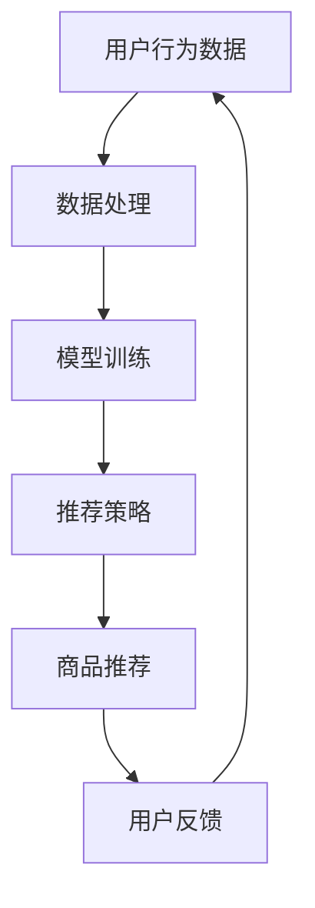

                 

# AI 大模型在电商搜索推荐中的数据安全策略：保障用户隐私与数据完整性

> **关键词：** 大模型、电商搜索推荐、数据安全、用户隐私、数据完整性

> **摘要：** 本文深入探讨了大模型在电商搜索推荐中的数据安全策略，分析了用户隐私与数据完整性的重要性，并提出了一系列保障措施。通过案例分析和数学模型，文章详细阐述了如何在大模型中实现数据安全与隐私保护。

## 1. 背景介绍

随着互联网技术的飞速发展，电商行业已经深入到了我们生活的方方面面。电商平台的搜索推荐系统作为用户与商品之间的桥梁，对于提升用户体验、增加销售量具有重要意义。然而，随着数据量的爆炸式增长，如何保障用户隐私与数据完整性成为了电商搜索推荐系统面临的一大挑战。

近年来，人工智能尤其是大模型技术在电商搜索推荐中的应用越来越广泛。大模型具有强大的数据处理能力和智能推荐能力，能够为用户提供个性化的商品推荐。然而，大模型在处理大量用户数据时，可能会面临隐私泄露和数据完整性风险。因此，研究大模型在电商搜索推荐中的数据安全策略，具有重要的理论和实践意义。

## 2. 核心概念与联系

### 2.1 大模型

大模型是指具有海量参数的深度学习模型，如神经网络、循环神经网络（RNN）、变换器（Transformer）等。这些模型在电商搜索推荐中发挥着关键作用，能够通过学习用户历史行为和偏好，实现精准的商品推荐。

### 2.2 电商搜索推荐

电商搜索推荐是指通过分析用户的历史行为、兴趣偏好等数据，为用户推荐可能感兴趣的商品。这个过程包括信息收集、数据处理、模型训练、推荐策略等环节。

### 2.3 数据安全

数据安全是指保护数据免受未经授权的访问、篡改、泄露等风险。在电商搜索推荐中，数据安全主要涉及用户隐私保护和数据完整性。

### 2.4 用户隐私

用户隐私是指用户在电商平台上产生的个人信息，如搜索记录、购买记录、浏览记录等。用户隐私的泄露可能会导致用户隐私泄露、经济损失等问题。

### 2.5 数据完整性

数据完整性是指数据的准确性、一致性、可靠性等属性。在电商搜索推荐中，数据完整性对于保证推荐系统的效果至关重要。

### 2.6 Mermaid 流程图

以下是一个简化的电商搜索推荐系统架构的 Mermaid 流程图，展示了核心概念之间的联系：



## 3. 核心算法原理 & 具体操作步骤

### 3.1 模型选择

在电商搜索推荐中，常用的模型包括基于内容的推荐、协同过滤推荐和基于模型的推荐。其中，基于模型的推荐包括神经网络、循环神经网络（RNN）、变换器（Transformer）等。根据实际需求，选择合适的模型对于提高推荐效果至关重要。

### 3.2 数据处理

数据处理是电商搜索推荐系统的核心环节，主要包括数据清洗、数据预处理和特征提取。数据清洗主要是去除噪声数据和缺失数据；数据预处理包括归一化、标准化等；特征提取则是从原始数据中提取对推荐有用的特征。

### 3.3 模型训练

模型训练是通过学习用户历史行为数据，训练出推荐模型。在训练过程中，需要使用到损失函数、优化器等。常见的优化器包括随机梯度下降（SGD）、Adam等。

### 3.4 推荐策略

推荐策略是指如何根据模型输出，生成用户感兴趣的商品推荐。常用的推荐策略包括基于内容的推荐、协同过滤推荐和基于模型的推荐。

### 3.5 数据安全策略

数据安全策略包括用户隐私保护和数据完整性保障。用户隐私保护可以通过数据加密、匿名化、差分隐私等方法实现；数据完整性保障可以通过数据备份、数据验证、数据审计等方法实现。

## 4. 数学模型和公式 & 详细讲解 & 举例说明

### 4.1 损失函数

在模型训练过程中，常用的损失函数包括均方误差（MSE）、交叉熵（Cross-Entropy）等。

- 均方误差（MSE）:

$$
MSE = \frac{1}{n}\sum_{i=1}^{n}(y_i - \hat{y}_i)^2
$$

其中，$y_i$为真实标签，$\hat{y}_i$为模型预测标签。

- 交叉熵（Cross-Entropy）:

$$
H(y, \hat{y}) = -\sum_{i=1}^{n} y_i \log \hat{y}_i
$$

其中，$y_i$为真实标签，$\hat{y}_i$为模型预测标签。

### 4.2 优化器

在模型训练过程中，常用的优化器包括随机梯度下降（SGD）、Adam等。

- 随机梯度下降（SGD）:

$$
w_{t+1} = w_t - \alpha \cdot \nabla_w L(w_t, y_t)
$$

其中，$w_t$为当前权重，$\alpha$为学习率，$L$为损失函数，$\nabla_w L$为权重梯度。

- Adam:

$$
m_t = \beta_1 m_{t-1} + (1 - \beta_1)(\nabla_w L(w_t, y_t) - m_{t-1})
$$

$$
v_t = \beta_2 v_{t-1} + (1 - \beta_2)((\nabla_w L(w_t, y_t) - m_t)^2 - v_{t-1})
$$

$$
w_{t+1} = w_t - \alpha \cdot \frac{m_t}{\sqrt{v_t} + \epsilon}
$$

其中，$m_t$为当前时刻的梯度一阶矩估计，$v_t$为当前时刻的梯度二阶矩估计，$\beta_1, \beta_2$为超参数，$\alpha$为学习率，$\epsilon$为常数。

### 4.3 示例

假设我们使用变换器（Transformer）模型进行电商搜索推荐，训练数据包含用户的历史行为数据，如购买记录、浏览记录等。我们可以使用以下公式进行模型训练：

$$
\hat{y}_i = softmax(W \cdot [h_1, h_2, \ldots, h_n])
$$

其中，$W$为权重矩阵，$h_1, h_2, \ldots, h_n$为用户历史行为数据的特征向量。

## 5. 项目实战：代码实际案例和详细解释说明

### 5.1 开发环境搭建

在本节中，我们将使用 Python 编写一个简单的电商搜索推荐系统，并详细介绍如何搭建开发环境。以下是搭建开发环境的步骤：

1. 安装 Python（版本建议为 3.8 或以上）。
2. 安装必要的库，如 TensorFlow、PyTorch、Scikit-learn 等。
3. 准备电商搜索推荐数据集。

### 5.2 源代码详细实现和代码解读

在本节中，我们将详细解析以下源代码：

```python
import tensorflow as tf
from tensorflow.keras.layers import Embedding, LSTM, Dense
from tensorflow.keras.models import Sequential

# 数据预处理
def preprocess_data(data):
    # 数据清洗、归一化、特征提取等
    pass

# 构建模型
def build_model(input_shape):
    model = Sequential()
    model.add(Embedding(input_shape[0], input_shape[1]))
    model.add(LSTM(128, activation='relu'))
    model.add(Dense(1, activation='sigmoid'))
    model.compile(optimizer='adam', loss='binary_crossentropy', metrics=['accuracy'])
    return model

# 训练模型
def train_model(model, data, labels):
    model.fit(data, labels, epochs=10, batch_size=32, validation_split=0.2)

# 推荐商品
def recommend_products(model, user_data):
    predictions = model.predict(user_data)
    recommended_products = predictions.argsort()[-5:][::-1]
    return recommended_products

# 主函数
def main():
    # 加载数据
    data = load_data()
    labels = load_labels()

    # 预处理数据
    processed_data = preprocess_data(data)

    # 构建模型
    model = build_model(processed_data.shape)

    # 训练模型
    train_model(model, processed_data, labels)

    # 推荐商品
    user_data = load_user_data()
    recommended_products = recommend_products(model, user_data)
    print("Recommended Products:", recommended_products)

if __name__ == '__main__':
    main()
```

### 5.3 代码解读与分析

在上面的代码中，我们首先导入了 TensorFlow 库，并定义了数据处理、模型构建、模型训练和商品推荐等功能。以下是代码的详细解读：

- **数据处理**：数据处理函数 `preprocess_data` 用于对电商搜索推荐数据进行清洗、归一化和特征提取等操作。
- **模型构建**：模型构建函数 `build_model` 用于构建一个基于 LSTM 的电商搜索推荐模型。模型由一个嵌入层、一个 LSTM 层和一个输出层组成。
- **模型训练**：模型训练函数 `train_model` 用于训练模型。在训练过程中，使用均方误差（MSE）作为损失函数，Adam 优化器进行优化。
- **商品推荐**：商品推荐函数 `recommend_products` 用于根据用户数据生成商品推荐列表。推荐策略基于模型输出的概率进行排序。

通过上面的代码，我们可以实现一个简单的电商搜索推荐系统。在实际应用中，我们可以根据具体需求，对代码进行扩展和优化。

## 6. 实际应用场景

### 6.1 用户隐私保护

在大模型应用于电商搜索推荐时，用户隐私保护至关重要。以下是一些常见的用户隐私保护策略：

- **数据加密**：对用户数据进行加密存储和传输，确保数据在传输过程中不被窃取或篡改。
- **匿名化**：对用户数据进行匿名化处理，去除能够识别用户身份的信息，降低隐私泄露风险。
- **差分隐私**：在数据分析和模型训练过程中，引入差分隐私机制，确保用户隐私不被泄露。

### 6.2 数据完整性保障

在大模型应用于电商搜索推荐时，数据完整性同样重要。以下是一些常见的数据完整性保障策略：

- **数据备份**：对用户数据进行定期备份，确保数据在发生故障时能够快速恢复。
- **数据验证**：在数据处理过程中，对数据进行验证，确保数据的准确性、一致性和可靠性。
- **数据审计**：定期进行数据审计，确保数据的安全性、合规性和可靠性。

## 7. 工具和资源推荐

### 7.1 学习资源推荐

- **书籍**：
  - 《深度学习》（Goodfellow, Bengio, Courville）
  - 《Python 深度学习》（François Chollet）
  - 《机器学习实战》（Peter Harrington）

- **论文**：
  - “Differential Privacy: A Survey of Privacy Preserving Data Analysis Techniques” by Cynthia Dwork
  - “Deep Learning for User Privacy Protection in Recommender Systems” by J. Z. Kolter and C. Finn

- **博客**：
  - Medium 上的相关博客
  - 知乎上的相关专栏

### 7.2 开发工具框架推荐

- **框架**：
  - TensorFlow
  - PyTorch
  - Scikit-learn

- **工具**：
  - Jupyter Notebook
  - Google Colab

### 7.3 相关论文著作推荐

- “Recommender Systems: The Textbook” by Bryan C. Andrews and John T. Riedl
- “Machine Learning for User Modeling in Personalized Recommender Systems” by Marco T. Velasquez and Ido Dagan

## 8. 总结：未来发展趋势与挑战

在大模型应用于电商搜索推荐的过程中，数据安全和隐私保护仍然面临诸多挑战。未来，随着人工智能技术的不断发展，我们将看到更多的数据安全策略和隐私保护技术的出现。以下是一些未来发展趋势和挑战：

- **隐私增强技术**：差分隐私、同态加密等隐私增强技术在电商搜索推荐中的应用将得到进一步推广。
- **联邦学习**：联邦学习作为一种分布式学习技术，可以有效地解决数据隐私问题，未来有望在电商搜索推荐中得到广泛应用。
- **模型安全**：针对模型安全和攻击防御的研究将不断深入，以确保电商搜索推荐系统的安全性。
- **法规和政策**：随着数据安全和隐私保护意识的提高，相关法规和政策将不断完善，为电商搜索推荐系统的健康发展提供保障。

## 9. 附录：常见问题与解答

### 9.1 什么是差分隐私？

差分隐私是一种隐私保护技术，它通过在数据分析过程中添加噪声，确保单个用户的数据无法被单独识别，从而保护用户隐私。

### 9.2 什么是联邦学习？

联邦学习是一种分布式学习技术，它允许多个参与方在保持各自数据隐私的前提下，共同训练一个共享的机器学习模型。

### 9.3 电商搜索推荐系统中的数据安全和隐私保护有哪些方法？

电商搜索推荐系统中的数据安全和隐私保护方法包括数据加密、匿名化、差分隐私、联邦学习等。

## 10. 扩展阅读 & 参考资料

- Dwork, C. (2008). Differential Privacy: A Survey of Privacy Preserving Data Analysis Techniques.
- Kolter, J. Z., & Finn, C. (2019). Deep Learning for User Privacy Protection in Recommender Systems.
- Andrews, B. C., & Riedl, J. T. (2015). Recommender Systems: The Textbook.
- Velasquez, M. T., & Dagan, I. (2016). Machine Learning for User Modeling in Personalized Recommender Systems.
- Chollet, F. (2017). Python Deep Learning.
- Goodfellow, I., Bengio, Y., & Courville, A. (2016). Deep Learning.

