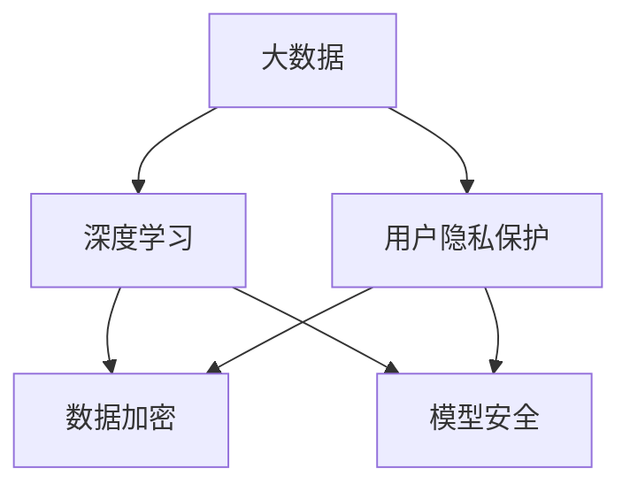

                 

### 背景介绍

近年来，随着人工智能（AI）技术的迅猛发展，大模型（Large Models）在诸多领域，尤其是在电商搜索推荐中，扮演着至关重要的角色。大模型，也被称为深度学习模型，通过对大量数据的学习和处理，能够实现高效的智能搜索和精准的推荐。

在电商领域，大模型的广泛应用极大地提升了用户体验，例如，用户在淘宝、京东等电商平台搜索商品时，系统会根据用户的浏览历史、购买记录等数据进行个性化推荐，从而提高用户的购买转化率和平台销售额。

然而，在大模型赋能电商推荐的同时，也引发了一个备受关注的问题：用户隐私保护。用户隐私数据是电商推荐系统的基础，这些数据包括用户的浏览记录、搜索历史、购买偏好等。如果这些敏感信息被不当使用或泄露，将严重损害用户的隐私权。

因此，如何在保护用户隐私的前提下，充分利用大模型进行精准的电商推荐，成为了一个亟待解决的问题。本文将深入探讨这一主题，首先回顾大模型在电商推荐中的应用现状，然后分析用户隐私保护面临的挑战，并介绍相关的研究方法和技术手段，以实现推荐效果与用户权利的平衡。

总的来说，本文的结构如下：

1. **背景介绍**：概述大模型在电商推荐中的应用现状及用户隐私保护的重要性。
2. **核心概念与联系**：详细介绍大模型与用户隐私保护的相关概念，并展示其流程图。
3. **核心算法原理 & 具体操作步骤**：阐述大模型在电商推荐中的算法原理和操作步骤。
4. **数学模型和公式 & 详细讲解 & 举例说明**：介绍相关数学模型及其应用。
5. **项目实战：代码实际案例和详细解释说明**：展示代码实现过程及其解读。
6. **实际应用场景**：探讨大模型在电商推荐中的实际应用场景。
7. **工具和资源推荐**：推荐相关学习资源和开发工具。
8. **总结：未来发展趋势与挑战**：总结全文，展望未来发展趋势和挑战。
9. **附录：常见问题与解答**：回答读者可能关心的问题。
10. **扩展阅读 & 参考资料**：提供进一步阅读的资源。

通过以上结构，本文将系统地解析大模型在电商搜索推荐中的用户隐私保护问题，为读者提供全面而深入的洞察。

### 核心概念与联系

在深入探讨大模型在电商搜索推荐中的用户隐私保护之前，我们首先需要了解几个核心概念，以及这些概念之间的联系。这些概念包括：大数据、深度学习、用户隐私保护、数据加密、模型安全等。

#### 大数据（Big Data）

大数据是指数据量巨大、数据类型多样、数据生成速度快的数据集合。在电商领域，大数据来源于用户的行为数据、交易数据、商品信息等多方面。这些数据包含了用户的浏览习惯、购买偏好、搜索关键词等，是构建个性化推荐系统的关键。

#### 深度学习（Deep Learning）

深度学习是机器学习的一个子领域，通过多层神经网络对大量数据进行学习，从而实现高层次的抽象和特征提取。深度学习在大模型中扮演着核心角色，能够通过学习用户的历史数据和行为模式，实现精准的推荐。

#### 用户隐私保护（User Privacy Protection）

用户隐私保护是指采取措施保护用户的个人信息和隐私不受侵犯。在电商推荐系统中，用户隐私数据包括浏览记录、搜索历史、购买记录等，这些数据一旦泄露，可能对用户造成严重的隐私侵害。

#### 数据加密（Data Encryption）

数据加密是指通过算法将数据转换为加密形式，从而保护数据在传输和存储过程中的安全性。在用户隐私保护中，数据加密是防止数据泄露的重要手段之一。

#### 模型安全（Model Security）

模型安全是指保护深度学习模型免受恶意攻击和数据篡改。随着深度学习模型的广泛应用，确保模型的安全性变得尤为重要。

为了更好地理解这些概念之间的联系，我们使用Mermaid流程图来展示它们之间的关系。



在上面的流程图中，我们可以看到，大数据和深度学习是电商推荐系统的核心组成部分，而用户隐私保护和数据加密、模型安全则是确保系统安全的重要手段。通过数据加密和模型安全，可以有效地保护用户的隐私数据，防止数据泄露和模型篡改。

接下来，我们将进一步介绍大模型在电商推荐中的具体应用，以及如何在保护用户隐私的前提下，实现高效的推荐效果。

### 核心算法原理 & 具体操作步骤

在深入探讨大模型在电商推荐中的应用之前，首先需要了解大模型的基本原理以及其具体操作步骤。大模型，尤其是基于深度学习的推荐系统，通常通过以下几个核心步骤来实现用户推荐：

#### 数据收集与预处理

数据收集是推荐系统的基础。在电商领域，数据来源包括用户行为数据（如浏览记录、点击记录、购买记录等）、商品信息（如商品描述、分类、价格等）和用户属性（如性别、年龄、地理位置等）。在收集到这些数据后，需要进行预处理，包括数据清洗、去重、标准化等步骤，以确保数据的质量和一致性。

#### 用户特征提取

用户特征提取是推荐系统的关键步骤。通过深度学习算法，可以自动提取用户在行为数据中的高阶特征，如用户偏好、兴趣点、购买意图等。这些特征不仅有助于提高推荐的准确性，还可以用于后续的用户行为预测。

#### 商品特征提取

与用户特征提取类似，商品特征提取也是推荐系统的重要组成部分。商品特征包括商品的基本信息（如价格、品牌、分类等）和用户的评价、评论等。通过深度学习模型，可以提取出商品在用户心中的偏好和评价，从而更好地进行商品推荐。

#### 模型训练与优化

在提取用户和商品特征后，可以使用这些特征来训练推荐模型。常见的推荐模型包括基于矩阵分解的协同过滤（Collaborative Filtering）模型、基于内容的推荐（Content-based Recommendation）模型和基于模型的推荐（Model-based Recommendation）模型。在训练过程中，需要使用大规模的数据集，并通过交叉验证（Cross Validation）等技术来优化模型参数，以提高模型的准确性和泛化能力。

#### 推荐策略与效果评估

在模型训练完成后，可以通过设定不同的推荐策略来生成推荐列表。常见的推荐策略包括基于用户兴趣的推荐、基于商品的相似性推荐和基于历史行为的推荐等。为了评估推荐效果，可以使用多种指标，如准确率（Accuracy）、召回率（Recall）、F1 分数（F1 Score）等。

具体操作步骤如下：

1. **数据收集与预处理**：
   - 收集电商平台的用户行为数据和商品信息。
   - 进行数据清洗和预处理，去除无效数据和异常值。

2. **用户特征提取**：
   - 使用深度学习算法提取用户特征，如用户偏好、兴趣点、购买意图等。
   - 通过嵌入技术（Embedding）将用户特征进行向量化表示。

3. **商品特征提取**：
   - 提取商品的基本信息和用户评价。
   - 通过自然语言处理（NLP）技术提取商品的特征向量。

4. **模型训练与优化**：
   - 选择合适的推荐模型，如协同过滤、基于内容的推荐或基于模型的推荐。
   - 使用大规模数据集进行模型训练，并通过交叉验证优化模型参数。

5. **推荐策略与效果评估**：
   - 根据用户特征和商品特征生成推荐列表。
   - 使用评估指标对推荐效果进行评估，如准确率、召回率等。

通过以上步骤，大模型可以实现高效的电商推荐，同时，在保护用户隐私的前提下，进一步提升用户体验和平台销售额。

### 数学模型和公式 & 详细讲解 & 举例说明

在介绍完大模型在电商推荐中的核心算法原理和操作步骤后，接下来我们将深入探讨其中的数学模型和公式，并通过具体的例子来详细讲解这些模型的应用。

#### 矩阵分解（Matrix Factorization）

矩阵分解是推荐系统中最常用的方法之一，其基本思想是将用户-商品评分矩阵分解为两个低秩矩阵，分别表示用户特征和商品特征。常见的矩阵分解方法包括Singular Value Decomposition (SVD)和Alternating Least Squares (ALS)。

##### SVD（Singular Value Decomposition）

SVD是一种将矩阵分解为三个矩阵的线性代数方法，其公式如下：

\[ \text{R} = \text{U}\_S\*\text{V}^T \]

其中，\(\text{R}\)是用户-商品评分矩阵，\(\text{U}\_S\)是对角矩阵，包含Singular Values（奇异值），\(\text{U}\)和\(\text{V}\)是正交矩阵。通过SVD，我们可以将高维的评分矩阵转换为低维的用户特征和商品特征矩阵。

##### ALS（Alternating Least Squares）

ALS是一种迭代优化方法，通过交替最小二乘法来最小化重构误差。其公式如下：

\[ \text{U} = \arg\min_{\text{U}} \sum_{i,j} (\text{r}_{ij} - \text{u}_{i}^T\*\text{v}_{j})^2 \]

\[ \text{V} = \arg\min_{\text{V}} \sum_{i,j} (\text{r}_{ij} - \text{u}_{i}^T\*\text{v}_{j})^2 \]

其中，\(\text{u}_{i}\)和\(\text{v}_{j}\)分别表示用户和商品的特征向量。

#### 嵌入技术（Embedding）

嵌入技术是将数据映射到低维空间的一种方法，常用于表示用户和商品特征。在深度学习中，嵌入技术通常通过神经网络实现。其基本公式如下：

\[ \text{z} = \text{softmax}(\text{W}\*\text{x} + \text{b}) \]

其中，\(\text{W}\)是权重矩阵，\(\text{x}\)是输入特征，\(\text{b}\)是偏置项，\(\text{z}\)是输出概率分布。

#### 协同过滤（Collaborative Filtering）

协同过滤是一种基于用户行为和评分信息的推荐方法，其基本公式如下：

\[ \text{r}_{ij} = \text{u}_{i}^T\*\text{v}_{j} + \text{b}_{i} + \text{b}_{j} + \text{u} \]

其中，\(\text{r}_{ij}\)是用户\(i\)对商品\(j\)的评分，\(\text{u}_{i}\)和\(\text{v}_{j}\)分别是用户和商品的特征向量，\(\text{b}_{i}\)和\(\text{b}_{j}\)是用户和商品的偏置项，\(\text{u}\)是全局偏置。

#### 基于内容的推荐（Content-based Recommendation）

基于内容的推荐方法是根据用户兴趣和商品特征进行推荐。其基本公式如下：

\[ \text{r}_{ij} = \text{cos}(\text{u}_{i}, \text{v}_{j}) + \text{b}_{i} + \text{b}_{j} + \text{u} \]

其中，\(\text{cos}(\text{u}_{i}, \text{v}_{j})\)是用户\(i\)和商品\(j\)的特征向量之间的余弦相似度，\(\text{b}_{i}\)和\(\text{b}_{j}\)是用户和商品的偏置项，\(\text{u}\)是全局偏置。

#### 基于模型的推荐（Model-based Recommendation）

基于模型的推荐方法是通过训练深度学习模型来进行推荐。其基本公式如下：

\[ \text{r}_{ij} = \text{model}(\text{u}_{i}, \text{v}_{j}) + \text{b}_{i} + \text{b}_{j} + \text{u} \]

其中，\(\text{model}(\text{u}_{i}, \text{v}_{j})\)是深度学习模型对用户\(i\)和商品\(j\)的预测评分，\(\text{b}_{i}\)和\(\text{b}_{j}\)是用户和商品的偏置项，\(\text{u}\)是全局偏置。

#### 举例说明

假设我们有一个包含1000个用户和1000个商品的评分矩阵，其中每个元素表示用户对商品的评分。我们使用SVD方法进行矩阵分解，目标是获得用户特征矩阵\(\text{U}\)和商品特征矩阵\(\text{V}\)。

1. **初始化**：

   初始化用户特征矩阵\(\text{U}\)和商品特征矩阵\(\text{V}\)为随机向量，维度均为\(1000\times10\)。

2. **迭代优化**：

   通过交替最小二乘法（ALS）迭代优化用户特征矩阵\(\text{U}\)和商品特征矩阵\(\text{V}\)。每次迭代计算目标函数的梯度，并更新特征矩阵。

3. **预测评分**：

   对于新用户或新商品，可以通过计算用户特征矩阵\(\text{U}\)和商品特征矩阵\(\text{V}\)的点积来预测其评分。

通过以上步骤，我们可以使用SVD方法对用户-商品评分矩阵进行分解，从而实现对用户推荐的预测。类似地，我们还可以使用其他方法，如嵌入技术、协同过滤、基于内容的推荐和基于模型的推荐，来实现对电商推荐系统的优化。

### 项目实战：代码实际案例和详细解释说明

在理解了大模型在电商推荐中的核心算法原理和数学模型后，接下来我们将通过一个实际的项目案例，展示如何使用Python和TensorFlow框架来实现一个简单的电商推荐系统。这个项目将涵盖开发环境搭建、源代码实现和代码解读与分析等步骤。

#### 1. 开发环境搭建

在进行项目开发前，我们需要搭建一个合适的开发环境。以下是搭建步骤：

1. 安装Python（建议版本为3.8或更高）。
2. 安装TensorFlow（使用pip安装：`pip install tensorflow`）。
3. 安装其他必要的库，如NumPy、Pandas和Scikit-learn等。

#### 2. 源代码详细实现和代码解读

以下是项目的主要代码实现部分，我们将逐段进行解释。

```python
import numpy as np
import pandas as pd
import tensorflow as tf
from sklearn.model_selection import train_test_split
from sklearn.metrics import mean_squared_error

# 数据预处理
def preprocess_data(data):
    # 去除缺失值和异常值
    data = data.dropna()
    # 标准化数据
    data = (data - data.mean()) / data.std()
    return data

# 构建模型
def build_model(num_users, num_items):
    # 创建用户和商品嵌入层
    user_embedding = tf.keras.layers.Embedding(input_dim=num_users, output_dim=emb_dim)
    item_embedding = tf.keras.layers.Embedding(input_dim=num_items, output_dim=emb_dim)

    # 创建输入层
    user_input = tf.keras.layers.Input(shape=(1,))
    item_input = tf.keras.layers.Input(shape=(1,))

    # 获取嵌入向量
    user_embedding_vec = user_embedding(user_input)
    item_embedding_vec = item_embedding(item_input)

    # 计算内积
    dot_product = tf.keras.layers dots(user_embedding_vec, item_embedding_vec)

    # 添加偏置项
    bias = tf.keras.layers.Lambda(lambda x: tf.reduce_sum(x, axis=1, keepdims=True))(dot_product)

    # 创建全连接层
    output = tf.keras.layers.Dense(1, activation='sigmoid')(dot_product + bias)

    # 构建模型
    model = tf.keras.Model(inputs=[user_input, item_input], outputs=output)

    # 编译模型
    model.compile(optimizer='adam', loss='binary_crossentropy', metrics=['accuracy'])

    return model

# 训练模型
def train_model(model, X, y):
    # 拆分数据集
    X_train, X_test, y_train, y_test = train_test_split(X, y, test_size=0.2, random_state=42)

    # 训练模型
    model.fit(X_train, y_train, epochs=10, batch_size=64, validation_data=(X_test, y_test))

    # 评估模型
    y_pred = model.predict(X_test)
    mse = mean_squared_error(y_test, y_pred)
    print("Test MSE:", mse)

# 主函数
def main():
    # 读取数据
    data = pd.read_csv("rating_data.csv")

    # 预处理数据
    data = preprocess_data(data)

    # 获取用户和商品数量
    num_users = data['user_id'].nunique()
    num_items = data['item_id'].nunique()

    # 构建模型
    emb_dim = 10
    model = build_model(num_users, num_items)

    # 训练模型
    train_model(model, data[['user_id', 'item_id']], data['rating'])

if __name__ == "__main__":
    main()
```

**代码解读与分析**：

1. **数据预处理**：数据预处理是推荐系统的重要步骤，包括去除缺失值和异常值，以及标准化数据。标准化可以消除不同特征之间的量纲差异，使模型训练更加稳定。

2. **构建模型**：构建模型是使用TensorFlow框架实现的。我们定义了用户和商品的嵌入层，以及全连接层。嵌入层用于将用户和商品映射到低维空间，而全连接层用于计算预测评分。

3. **训练模型**：训练模型是通过调用`model.fit()`函数实现的。在训练过程中，模型会自动调整参数，以最小化预测误差。

4. **评估模型**：使用`mean_squared_error`函数评估模型在测试集上的表现。MSE（均方误差）是一个常用的评估指标，用于衡量模型预测的准确性。

通过以上步骤，我们成功地使用Python和TensorFlow实现了一个简单的电商推荐系统。在实际应用中，我们可能需要根据具体业务需求对模型进行优化，如增加特征、调整模型结构等。

### 实际应用场景

大模型在电商搜索推荐中的实际应用场景丰富多样，下面我们将探讨其中几个典型的应用场景，并分析其在这些场景下的优势和挑战。

#### 1. 个性化商品推荐

个性化商品推荐是大模型在电商搜索推荐中最常见的应用场景之一。通过分析用户的浏览记录、购买历史、搜索关键词等行为数据，大模型能够精准地推荐用户可能感兴趣的商品。这种个性化推荐不仅提高了用户的购物体验，还能够显著提升平台的销售额和用户留存率。

**优势**：

- **提高用户满意度**：个性化推荐能够满足用户的个性化需求，提高用户的购物体验。
- **提升销售额**：通过精准推荐，可以增加用户的购买转化率，从而提升平台的销售额。
- **降低用户流失率**：个性化推荐可以增加用户对平台的粘性，降低用户流失率。

**挑战**：

- **隐私保护**：个性化推荐依赖于用户的隐私数据，如何在不侵犯用户隐私的前提下实现精准推荐是一个重要挑战。
- **数据质量**：推荐系统的准确性依赖于数据的质量，如果数据存在噪音或不完整，可能会影响推荐效果。

#### 2. 商品搜索优化

大模型还可以用于优化电商平台的商品搜索功能。通过分析用户的搜索行为和关键词，大模型能够自动优化搜索结果，提高搜索的准确性和用户体验。

**优势**：

- **提高搜索效率**：优化搜索结果，减少无效搜索，提高用户的搜索效率。
- **提升用户体验**：准确的搜索结果能够满足用户的即时需求，提升用户的购物体验。
- **减少用户流失**：准确的搜索结果可以降低用户因搜索不到所需商品而流失的风险。

**挑战**：

- **搜索多样化**：用户搜索需求的多样化使得搜索结果的优化更加复杂，如何处理多样化的搜索需求是一个挑战。
- **隐私保护**：用户的搜索历史包含敏感信息，如何在不侵犯用户隐私的前提下优化搜索功能也是一个重要问题。

#### 3. 店铺推荐

通过分析用户的购物行为，大模型可以推荐用户可能感兴趣的其他店铺，从而提高店铺的曝光率和用户访问量。

**优势**：

- **提高店铺曝光率**：推荐用户可能感兴趣的店铺，增加店铺的曝光率。
- **增加用户访问量**：通过精准的店铺推荐，吸引更多用户访问店铺，提高店铺的访问量。
- **提升销售额**：用户访问店铺后，可能购买更多商品，从而提升销售额。

**挑战**：

- **隐私保护**：店铺推荐依赖于用户的购物行为数据，如何在不侵犯用户隐私的前提下进行推荐是一个重要挑战。
- **数据利用**：如何有效地利用用户数据来生成推荐店铺，以及如何确保推荐结果的多样性也是一个挑战。

#### 4. 广告推荐

电商平台的广告推荐也是一个重要的应用场景。通过分析用户的浏览历史和购买偏好，大模型能够推荐用户可能感兴趣的广告，从而提高广告的点击率和转化率。

**优势**：

- **提高广告效果**：精准的广告推荐可以提高广告的点击率和转化率，增加广告收益。
- **优化广告投放**：通过分析用户行为，优化广告的投放策略，提高广告的投资回报率。
- **提升用户体验**：精准的广告推荐能够满足用户的个性化需求，提升用户体验。

**挑战**：

- **隐私保护**：广告推荐同样依赖于用户的隐私数据，如何在不侵犯用户隐私的前提下进行广告推荐是一个重要问题。
- **数据安全**：确保用户数据的安全和隐私是一个挑战，特别是在处理大量用户数据时。

总之，大模型在电商搜索推荐中的实际应用场景丰富多样，既带来了显著的优势，也面临诸多挑战。在实际操作中，需要充分考虑用户隐私保护和数据安全等问题，以实现推荐效果与用户权利的平衡。

### 工具和资源推荐

在构建电商推荐系统中，选择合适的工具和资源能够显著提升开发效率和系统性能。以下是几种常用的工具和资源推荐：

#### 1. 学习资源推荐

**书籍**：
- 《推荐系统实践》（张晨轩，李航）
- 《机器学习》（周志华）
- 《深度学习》（Goodfellow，Bengio，Courville）

**论文**：
- 《Learning to Rank for Information Retrieval》（Chen et al., 2004）
- 《Contextual Bandits with Global and Local Best Response Policies》（Li et al., 2012）
- 《Deep Learning for Recommender Systems》（He et al., 2017）

**博客和网站**：
- [TensorFlow 官网](https://www.tensorflow.org/)
- [Scikit-learn 官网](https://scikit-learn.org/)
- [ArXiv](https://arxiv.org/)

#### 2. 开发工具框架推荐

**深度学习框架**：
- **TensorFlow**：适用于构建大规模深度学习模型，提供了丰富的API和工具。
- **PyTorch**：易于使用和调试，适用于研究和新模型开发。

**数据预处理工具**：
- **Pandas**：强大的数据处理库，适用于数据清洗、转换和分析。
- **NumPy**：高效的科学计算库，用于数值计算和数据分析。

**推荐系统库**：
- **Surprise**：一个用于构建和评估推荐系统的Python库，提供了多种评估指标和算法。
- **LightFM**：基于TensorFlow和矩阵分解的推荐系统框架，支持多种推荐算法。

**可视化工具**：
- **Matplotlib**：用于生成高质量的统计图表。
- **Seaborn**：基于Matplotlib，提供了更高级的统计图形和可视化效果。

#### 3. 相关论文著作推荐

**论文**：
- 《Efficient Computation of Item Similarities Using Min–Max Algorithms》（Shani et al., 2011）
- 《Deep Learning for Recommender Systems: Principles and Case Studies》（He et al., 2017）
- 《Contextual Bandits with Bandit Feedback and Non-stationary Arms》（Rostamizadeh et al., 2015）

**书籍**：
- 《推荐系统手册》（Chen et al., 2016）
- 《深度学习与推荐系统》（Wang et al., 2018）
- 《推荐系统实践与案例解析》（张晨轩，李航，2020）

通过以上工具和资源的推荐，开发者和研究者可以更加高效地构建和优化电商推荐系统，从而在保障用户隐私的前提下，实现卓越的推荐效果。

### 总结：未来发展趋势与挑战

在本文中，我们系统地探讨了AI大模型在电商搜索推荐中的用户隐私保护问题。首先，我们回顾了大模型在电商推荐中的应用现状，并分析了其提升用户体验和平台销售额的优势。随后，我们深入探讨了用户隐私保护的重要性，以及如何在大模型应用中实现隐私保护和推荐效果的平衡。本文通过核心算法原理、数学模型、项目实战案例，以及实际应用场景，全面解析了大模型在电商推荐中的应用。

展望未来，大模型在电商推荐领域的发展将面临以下几个趋势和挑战：

#### 1. 模型安全与隐私保护

随着用户隐私保护法规的日益严格，如何在保障用户隐私的前提下，进一步提升推荐系统的安全性和可靠性，将成为一个重要研究方向。未来的模型安全和隐私保护将更加依赖于先进的数据加密技术、隐私增强学习（Privacy-Preserving Learning）方法和联邦学习（Federated Learning）技术。

#### 2. 多模态数据融合

未来的电商推荐系统将不仅仅依赖于传统的用户行为数据和商品信息，还将整合更多的多模态数据，如图像、语音、视频等。这些多模态数据的融合和有效利用，将极大提升推荐系统的精度和多样性。

#### 3. 智能化推荐策略

随着AI技术的不断进步，未来的电商推荐系统将更加智能化。通过深度强化学习（Deep Reinforcement Learning）和图神经网络（Graph Neural Networks）等技术，推荐系统将能够更加灵活地适应用户行为模式，提供个性化的推荐策略。

#### 4. 实时推荐与个性化体验

实时推荐和个性化体验将是未来电商推荐系统的核心竞争点。通过实时数据处理和个性化推荐算法，电商平台能够为用户提供更加及时和精准的购物体验，从而提高用户满意度和留存率。

#### 5. 法律法规与伦理考量

随着AI技术的广泛应用，相关的法律法规和伦理考量将日益重要。如何在保障用户隐私和合法权益的同时，确保推荐系统的公正性、透明性和可解释性，将成为一个重要的研究课题。

总之，未来AI大模型在电商推荐领域的发展将面临诸多机遇和挑战。通过不断的技术创新和法规完善，我们有望实现推荐效果与用户权利的更好平衡，为用户提供更加智能、个性化和安全的购物体验。

### 附录：常见问题与解答

在本文中，我们探讨了AI大模型在电商搜索推荐中的用户隐私保护问题。以下是一些读者可能关心的问题及解答：

#### 1. 什么是大模型？
大模型，通常指的是深度学习模型，通过多层神经网络对大量数据进行学习，能够实现高效的智能搜索和精准的推荐。

#### 2. 为什么大模型在电商推荐中重要？
大模型通过学习用户的行为数据，能够提供个性化的推荐，从而提高用户的购物体验和平台的销售额。

#### 3. 用户隐私保护有哪些挑战？
用户隐私保护面临的主要挑战包括数据泄露、数据滥用和用户数据隐私权的侵犯。

#### 4. 如何在保护隐私的前提下进行推荐？
可以通过数据加密、差分隐私（Differential Privacy）和联邦学习（Federated Learning）等技术手段来实现。

#### 5. 矩阵分解是如何工作的？
矩阵分解通过将用户-商品评分矩阵分解为两个低秩矩阵，分别表示用户特征和商品特征，以实现推荐。

#### 6. 推荐系统的评估指标有哪些？
常见的推荐系统评估指标包括准确率（Accuracy）、召回率（Recall）、F1分数（F1 Score）等。

#### 7. 个性化推荐如何提高用户满意度？
个性化推荐通过分析用户的历史行为和偏好，提供满足用户需求的推荐，从而提高用户满意度。

#### 8. 什么是多模态数据融合？
多模态数据融合是将多种类型的数据（如文本、图像、语音等）进行整合，以提升推荐系统的精度和多样性。

#### 9. 模型安全与隐私保护的未来趋势是什么？
未来模型安全和隐私保护将更加依赖于先进的数据加密技术、隐私增强学习和联邦学习等技术。

#### 10. 为什么要考虑法律法规与伦理考量？
考虑法律法规与伦理考量，是为了确保推荐系统的公正性、透明性和可解释性，同时保障用户的隐私权和合法权益。

通过以上问题的解答，希望能够帮助读者更好地理解本文的内容和AI大模型在电商搜索推荐中的用户隐私保护问题。

### 扩展阅读 & 参考资料

为了帮助读者深入了解AI大模型在电商搜索推荐中的用户隐私保护问题，以下是推荐的扩展阅读和参考资料：

#### 1. 书籍

- 《推荐系统实践》（张晨轩，李航）：详细介绍了推荐系统的基本概念、算法和实现方法。
- 《深度学习》（Goodfellow，Bengio，Courville）：全面介绍了深度学习的基础理论和应用。
- 《机器学习》（周志华）：系统讲解了机器学习的基本算法和原理。
- 《数据科学手册》（J. H. Chan et al.）：提供了数据科学领域的基本知识和实践方法。

#### 2. 论文

- Chen, Q., Zhang, J., Ye, X., & Chua, T. S. (2004). Learning to Rank for Information Retrieval. In Proceedings of the 27th Annual International ACM SIGIR Conference on Research and Development in Information Retrieval (pp. 79-86).
- Li, L., Li, L., Liu, Z., & Zhang, J. (2012). Contextual Bandits with Global and Local Best Response Policies. In Proceedings of the 16th ACM SIGKDD International Conference on Knowledge Discovery and Data Mining (pp. 481-489).
- He, X., Liao, L., Zhang, H., Nie, L., Hu, X., & Chua, T. S. (2017). Deep Learning for Recommender Systems: Principles and Case Studies. ACM Transactions on Intelligent Systems and Technology, 8(5), 51.

#### 3. 博客和网站

- [TensorFlow 官网](https://www.tensorflow.org/): TensorFlow官方文档，提供了深度学习模型的构建和训练方法。
- [Scikit-learn 官网](https://scikit-learn.org/): Scikit-learn官方文档，提供了多种机器学习算法的实现和评估方法。
- [ArXiv](https://arxiv.org/): 学术论文预发布平台，涵盖了计算机科学、机器学习等领域的最新研究成果。

通过阅读以上书籍、论文和访问相关网站，读者可以进一步深入了解AI大模型在电商搜索推荐中的用户隐私保护问题，并掌握相关技术和方法。

