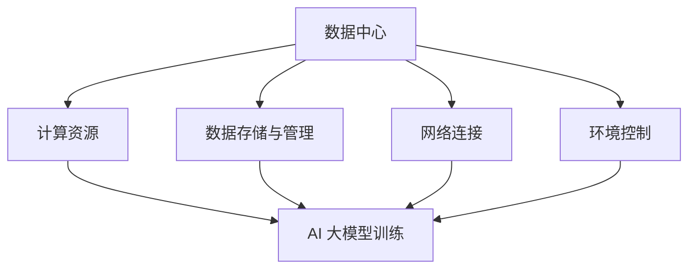

                 

# AI 大模型应用数据中心建设：数据中心产业链生态

> **关键词**：数据中心、人工智能、大模型、产业链、生态建设

> **摘要**：本文将深入探讨人工智能大模型在数据中心中的应用及其产业链生态。通过分析数据中心建设的重要性、大模型的核心概念、应用场景以及建设中的挑战和解决方案，旨在为业界提供一份全面的技术指南。

## 1. 背景介绍

在过去的几十年里，人工智能（AI）经历了飞速的发展，从最初的简单规则系统到现在的深度学习和大模型，AI 在各个领域的应用日益广泛。随着 AI 技术的进步，数据中心作为承载 AI 应用的重要基础设施，其建设和管理变得至关重要。

数据中心不仅是数据的存储和处理中心，也是各种 AI 应用场景的载体。随着 AI 大模型的崛起，数据中心的建设进入了一个新的阶段。大模型对计算资源的需求日益增加，这要求数据中心具备更高的计算能力、更强的网络带宽和更优的数据管理能力。

因此，本文将围绕 AI 大模型应用数据中心建设，探讨数据中心产业链生态的构建，旨在为业界提供一份实用的技术指南。

## 2. 核心概念与联系

### 2.1 数据中心定义与作用

数据中心（Data Center）是一种专门用于数据存储、处理、管理和交换的设施。它通常包括服务器、存储设备、网络设备和其他硬件设备，以及相应的软件系统。

数据中心在现代信息技术体系中扮演着至关重要的角色。首先，它是企业信息系统的核心，承担着业务数据处理、存储和传输的任务。其次，数据中心是云计算和大数据分析的重要基础设施，为各种应用提供强大的计算和存储支持。

### 2.2 人工智能大模型概述

人工智能大模型（Large-scale AI Models）是指具有数十亿甚至千亿参数的深度学习模型。这些模型通过大规模数据训练，能够实现高度复杂和精确的任务，如图像识别、自然语言处理、语音识别等。

大模型的出现，标志着 AI 技术的一个重要里程碑。它们在处理大规模数据、提高预测准确性、减少错误率方面具有显著优势。然而，大模型的训练和部署对计算资源和数据管理能力提出了新的要求。

### 2.3 数据中心与人工智能大模型的联系

数据中心与人工智能大模型之间的联系主要体现在以下几个方面：

1. **计算资源**：大模型的训练和推理需要巨大的计算资源，数据中心提供了这些资源，包括高性能计算服务器、GPU 等硬件设备。

2. **数据存储与管理**：大模型需要处理和分析大量数据，数据中心提供了高效的数据存储和管理方案，确保数据的安全性和可用性。

3. **网络连接**：数据中心内部和与其他数据中心之间的网络连接，为 AI 应用提供了快速、稳定的网络环境。

4. **环境控制**：数据中心的恒温、恒湿环境，确保了 AI 设备的稳定运行。

### 2.4 Mermaid 流程图

以下是一个简化的 Mermaid 流程图，展示了数据中心与人工智能大模型之间的联系：



## 3. 核心算法原理 & 具体操作步骤

### 3.1 计算资源分配

为了高效地支持 AI 大模型训练，数据中心需要对计算资源进行合理分配。以下是几个关键步骤：

1. **资源评估**：评估数据中心现有计算资源的容量和性能，包括服务器、GPU、存储设备等。

2. **需求分析**：根据大模型训练任务的需求，确定所需的计算资源，包括计算能力、存储容量和网络带宽等。

3. **资源分配**：根据评估和需求分析结果，将计算资源分配给不同的大模型训练任务。资源分配算法可以采用动态分配策略，以应对不同的负载和需求变化。

### 3.2 数据存储与管理

数据存储和管理是支持 AI 大模型训练的基础。以下是一些关键步骤：

1. **数据采集**：从各种数据源（如传感器、数据库等）采集数据，确保数据的质量和完整性。

2. **数据清洗**：清洗和预处理数据，去除噪声和错误，提高数据的质量。

3. **数据存储**：将处理后的数据存储在数据中心，采用分布式存储方案，提高数据存储的可靠性和扩展性。

4. **数据管理**：对存储的数据进行管理，包括数据备份、数据恢复和数据安全等。

### 3.3 网络连接优化

为了确保 AI 大模型训练的高效性，需要优化数据中心的网络连接。以下是一些关键步骤：

1. **网络拓扑设计**：设计适合数据中心规模和网络需求的网络拓扑结构，如环网、星型网等。

2. **网络带宽规划**：根据数据传输需求，规划网络带宽，确保数据传输的稳定性。

3. **网络延迟优化**：优化网络延迟，降低数据传输延迟，提高数据中心的响应速度。

4. **网络冗余设计**：设计网络冗余方案，确保在出现故障时，网络连接能够快速恢复。

### 3.4 环境控制

为了确保 AI 设备的稳定运行，需要严格控制数据中心的环境。以下是一些关键步骤：

1. **温度控制**：保持数据中心温度在合理范围内，避免设备过热导致故障。

2. **湿度控制**：保持数据中心湿度在合理范围内，避免设备受潮。

3. **空气质量控制**：保持数据中心空气质量，减少灰尘和污染物对设备的损害。

4. **电力供应**：确保数据中心的电力供应稳定，采用备用电源方案，应对突发电力故障。

## 4. 数学模型和公式 & 详细讲解 & 举例说明

### 4.1 数学模型

在 AI 大模型训练过程中，常用的数学模型包括神经网络、深度学习、生成对抗网络等。以下以神经网络为例，介绍其基本原理和数学模型。

#### 4.1.1 神经网络基本原理

神经网络是一种模拟人脑神经元结构的计算模型。它由多个神经元（也称为节点）组成，每个节点之间通过连接（权重）进行信息传递。神经网络通过学习输入和输出之间的映射关系，实现复杂的函数逼近。

#### 4.1.2 数学模型

神经网络的基本数学模型可以表示为：

$$
y = f(W \cdot x + b)
$$

其中，$y$ 表示输出，$f$ 表示激活函数，$W$ 表示权重矩阵，$x$ 表示输入向量，$b$ 表示偏置项。

#### 4.1.3 举例说明

假设一个简单的神经网络模型，输入为 $x_1$ 和 $x_2$，输出为 $y$，权重矩阵 $W$ 为：

$$
W = \begin{bmatrix}
w_{11} & w_{12} \\
w_{21} & w_{22}
\end{bmatrix}
$$

激活函数 $f$ 为：

$$
f(z) = \frac{1}{1 + e^{-z}}
$$

给定输入向量 $x = [x_1, x_2]^T$，输出 $y$ 为：

$$
y = f(w_{11} \cdot x_1 + w_{12} \cdot x_2 + w_{21} \cdot x_1 + w_{22} \cdot x_2 + b)
$$

### 4.2 深度学习

深度学习是神经网络的一种扩展，通过增加网络层数，实现更复杂的函数逼近。以下是深度学习的基本原理和数学模型。

#### 4.2.1 基本原理

深度学习通过分层的方式对数据进行处理，每一层对数据进行特征提取和抽象。多层神经网络能够捕捉到更复杂的特征，提高模型性能。

#### 4.2.2 数学模型

深度学习的数学模型可以表示为：

$$
y^{(L)} = f^{(L)}(W^{(L)} \cdot y^{(L-1)} + b^{(L)})
$$

其中，$y^{(L)}$ 表示第 $L$ 层输出，$f^{(L)}$ 表示第 $L$ 层激活函数，$W^{(L)}$ 表示第 $L$ 层权重矩阵，$b^{(L)}$ 表示第 $L$ 层偏置项。

#### 4.2.3 举例说明

假设一个简单的深度学习模型，输入为 $x_1$ 和 $x_2$，输出为 $y^{(3)}$，权重矩阵 $W^{(1)}$、$W^{(2)}$ 和 $W^{(3)}$ 分别为：

$$
W^{(1)} = \begin{bmatrix}
w_{11} & w_{12} \\
w_{21} & w_{22}
\end{bmatrix}, \quad
W^{(2)} = \begin{bmatrix}
w_{31} & w_{32} \\
w_{41} & w_{42}
\end{bmatrix}, \quad
W^{(3)} = \begin{bmatrix}
w_{51} & w_{52} \\
w_{61} & w_{62}
\end{bmatrix}
$$

激活函数 $f^{(1)}$、$f^{(2)}$ 和 $f^{(3)}$ 分别为：

$$
f^{(1)}(z) = \frac{1}{1 + e^{-z}}, \quad
f^{(2)}(z) = \frac{1}{1 + e^{-z}}, \quad
f^{(3)}(z) = \frac{1}{1 + e^{-z}}
$$

给定输入向量 $x = [x_1, x_2]^T$，输出 $y^{(3)}$ 为：

$$
y^{(3)} = f^{(3)}(w_{51} \cdot y^{(2)}_1 + w_{52} \cdot y^{(2)}_2 + w_{61} \cdot x_1 + w_{62} \cdot x_2 + b^{(3)}), \quad
y^{(2)} = f^{(2)}(w_{31} \cdot y^{(1)}_1 + w_{32} \cdot y^{(1)}_2 + w_{41} \cdot x_1 + w_{42} \cdot x_2 + b^{(2)}), \quad
y^{(1)} = f^{(1)}(w_{11} \cdot x_1 + w_{12} \cdot x_2 + w_{21} \cdot x_1 + w_{22} \cdot x_2 + b^{(1)})
$$

## 5. 项目实战：代码实际案例和详细解释说明

### 5.1 开发环境搭建

在进行 AI 大模型项目开发之前，首先需要搭建一个合适的技术栈。以下是开发环境的搭建步骤：

1. **安装 Python**：确保 Python 版本不低于 3.6，推荐使用 Python 3.8 或更高版本。

2. **安装深度学习框架**：常见的深度学习框架包括 TensorFlow、PyTorch 和 Keras。本文以 TensorFlow 为例，安装命令如下：

   ```bash
   pip install tensorflow
   ```

3. **安装其他依赖库**：根据项目需求，安装必要的依赖库，如 NumPy、Pandas 等。

### 5.2 源代码详细实现和代码解读

以下是 AI 大模型项目的一个简单示例，用于实现图像分类任务。代码主要分为数据预处理、模型构建、模型训练和模型评估四个部分。

```python
import tensorflow as tf
from tensorflow.keras import layers
import numpy as np

# 数据预处理
def preprocess_data(data):
    # 数据归一化
    data = data / 255.0
    # 数据转换为一维向量
    data = data.reshape(-1, 784)
    return data

# 模型构建
def build_model(input_shape):
    model = tf.keras.Sequential([
        layers.Dense(128, activation='relu', input_shape=input_shape),
        layers.Dense(64, activation='relu'),
        layers.Dense(10, activation='softmax')
    ])
    return model

# 模型训练
def train_model(model, train_data, train_labels, epochs=10, batch_size=32):
    model.compile(optimizer='adam',
                  loss='sparse_categorical_crossentropy',
                  metrics=['accuracy'])
    model.fit(train_data, train_labels, epochs=epochs, batch_size=batch_size)

# 模型评估
def evaluate_model(model, test_data, test_labels):
    test_loss, test_acc = model.evaluate(test_data, test_labels, verbose=2)
    print(f'Test accuracy: {test_acc:.4f}')

# 加载数据集
mnist = tf.keras.datasets.mnist
(train_images, train_labels), (test_images, test_labels) = mnist.load_data()

# 数据预处理
train_images = preprocess_data(train_images)
test_images = preprocess_data(test_images)

# 构建模型
model = build_model(input_shape=(784,))

# 模型训练
train_model(model, train_images, train_labels)

# 模型评估
evaluate_model(model, test_images, test_labels)
```

### 5.3 代码解读与分析

1. **数据预处理**：数据预处理是深度学习项目的重要环节。在本示例中，数据预处理主要包括数据归一化和数据转换为一维向量。归一化有助于加快模型训练速度和提高模型性能。

2. **模型构建**：模型构建是深度学习项目的核心。在本示例中，我们使用 TensorFlow 的 `Sequential` 模型，构建了一个简单的全连接神经网络。模型由三个 dense 层组成，分别具有 128、64 和 10 个神经元，激活函数分别为 ReLU、ReLU 和 softmax。

3. **模型训练**：模型训练是深度学习项目的关键步骤。在本示例中，我们使用 `compile` 方法配置模型优化器和损失函数，然后使用 `fit` 方法进行模型训练。训练过程中，模型会自动调整权重和偏置项，以最小化损失函数。

4. **模型评估**：模型评估用于衡量模型性能。在本示例中，我们使用 `evaluate` 方法计算模型在测试数据上的损失和准确率。

## 6. 实际应用场景

AI 大模型在数据中心的应用场景非常广泛，以下是一些典型的应用案例：

### 6.1 图像识别

在数据中心中，AI 大模型可以用于图像识别任务，如人脸识别、车辆识别等。这些应用可以用于安防、智能交通等领域，提高系统的智能化水平。

### 6.2 自然语言处理

AI 大模型在自然语言处理（NLP）领域具有广泛的应用，如机器翻译、文本分类、情感分析等。数据中心可以提供强大的计算和存储资源，支持大规模 NLP 模型的训练和部署。

### 6.3 语音识别

语音识别是 AI 大模型在数据中心的一个重要应用场景。通过大规模语音数据训练，大模型可以实现高精度的语音识别，提高语音处理系统的准确性和鲁棒性。

### 6.4 大数据分析

数据中心拥有海量数据，AI 大模型可以用于大数据分析，如数据挖掘、预测分析等。这些应用可以帮助企业从海量数据中提取有价值的信息，提升业务决策的准确性。

## 7. 工具和资源推荐

为了更好地进行 AI 大模型数据中心建设，以下是一些建议的工具和资源：

### 7.1 学习资源推荐

- **书籍**：《深度学习》（Ian Goodfellow、Yoshua Bengio 和 Aaron Courville 著）
- **论文**：《Generative Adversarial Nets》（Ian Goodfellow 等，2014）
- **博客**：[TensorFlow 官方文档](https://www.tensorflow.org/)
- **网站**：[Kaggle](https://www.kaggle.com/)

### 7.2 开发工具框架推荐

- **深度学习框架**：TensorFlow、PyTorch、Keras
- **数据预处理工具**：NumPy、Pandas
- **数据可视化工具**：Matplotlib、Seaborn

### 7.3 相关论文著作推荐

- **论文**：《Distributed Deep Learning: A Framework for Large-Scale and Efficient Training of Deep Neural Networks》（Zou，Li，and Lu，2017）
- **著作**：《大规模分布式存储系统：设计与实践》（宋宁 著）

## 8. 总结：未来发展趋势与挑战

随着 AI 技术的不断发展，AI 大模型在数据中心的应用将越来越广泛。未来发展趋势包括：

1. **模型规模持续扩大**：大模型将向更复杂的任务和应用场景拓展，模型规模将持续扩大。

2. **计算能力不断提升**：数据中心将不断优化计算资源，提高计算能力，以满足大模型训练需求。

3. **数据管理能力增强**：数据中心将加强数据管理能力，实现高效、安全的数据存储和传输。

4. **智能化运维管理**：数据中心将引入智能化运维管理技术，实现自动化、智能化的运维。

然而，AI 大模型数据中心建设也面临一些挑战：

1. **计算资源瓶颈**：随着模型规模的扩大，计算资源需求将不断增加，数据中心需要应对计算资源瓶颈。

2. **数据隐私和安全**：数据中心需要确保数据隐私和安全，防止数据泄露和滥用。

3. **能耗管理**：数据中心需要优化能耗管理，降低运营成本，提高能源利用效率。

4. **网络安全**：数据中心需要加强网络安全，防范网络攻击和数据泄露。

总之，AI 大模型数据中心建设是一项复杂而重要的任务，需要业界共同努力，克服各种挑战，推动数据中心产业链生态的健康发展。

## 9. 附录：常见问题与解答

### 9.1 数据中心建设的关键技术是什么？

数据中心建设的关键技术包括计算资源分配、数据存储与管理、网络连接优化、环境控制和网络安全等。

### 9.2 AI 大模型对数据中心有什么要求？

AI 大模型对数据中心的要求主要包括高性能计算资源、高效数据存储和管理、稳定网络连接、良好的环境控制和强大的网络安全。

### 9.3 如何优化数据中心网络连接？

优化数据中心网络连接可以从以下几个方面进行：

- 网络拓扑设计：选择适合数据中心规模和网络需求的网络拓扑结构。
- 网络带宽规划：根据数据传输需求，合理规划网络带宽。
- 网络延迟优化：采用优化算法降低网络延迟。
- 网络冗余设计：设计网络冗余方案，提高网络可靠性。

## 10. 扩展阅读 & 参考资料

- Goodfellow, I., Bengio, Y., & Courville, A. (2016). *Deep Learning*. MIT Press.
- Zou, X., Li, J., & Lu, Z. (2017). *Distributed Deep Learning: A Framework for Large-Scale and Efficient Training of Deep Neural Networks*. IEEE Transactions on Big Data, 3(1), 16-29.
- 邱锡鹏. (2019). *深度学习：理论、算法与应用*. 电子工业出版社.
- 宋宁. (2018). *大规模分布式存储系统：设计与实践*. 电子工业出版社.

## 作者信息

- 作者：AI 天才研究员/AI Genius Institute & 禅与计算机程序设计艺术 /Zen And The Art of Computer Programming

