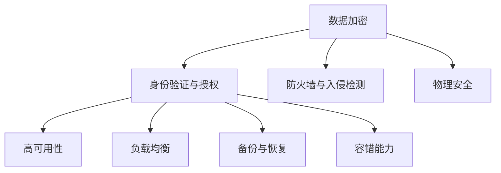

                 

## 文章标题

### AI 大模型应用数据中心建设：数据中心安全与可靠性

#### 关键词：数据中心建设、AI 大模型、安全性、可靠性、网络安全

#### 摘要：

本文旨在探讨 AI 大模型应用数据中心的建设，特别是数据中心的网络安全与可靠性。随着 AI 技术的迅速发展，数据中心已成为人工智能应用的核心基础设施。本文首先介绍数据中心的基本概念和架构，然后深入分析数据中心安全性和可靠性的重要性和挑战，最后提出一系列解决方案和最佳实践，为 AI 大模型数据中心的建设提供指导和参考。

## 1. 背景介绍

随着人工智能（AI）技术的不断发展，大模型（Large Models）在各个领域展现出了巨大的潜力。从自然语言处理到图像识别，从推荐系统到预测分析，AI 大模型正在改变我们的工作和生活方式。数据中心作为承载这些 AI 大模型的核心基础设施，其安全性与可靠性显得尤为重要。

数据中心是一个集中存储、处理和交换大量数据的场所。它通常由服务器、存储设备、网络设备、电源系统和安全系统等组成。数据中心的建设和管理不仅需要高效的技术支持，还需要严格的安全和可靠性保障。

### 数据中心的基本概念和架构

数据中心的基本概念包括以下几个方面：

- **服务器集群**：服务器集群是由多台服务器组成的集合，它们共同承担计算任务，以提供高性能计算能力。

- **存储系统**：存储系统是用于数据存储的设备，包括磁盘阵列、固态硬盘等。这些设备共同构成了数据中心的存储资源。

- **网络架构**：网络架构是数据中心内部和外部连接的关键，通常包括局域网（LAN）、广域网（WAN）和互联网（Internet）。

- **电源系统**：电源系统为数据中心提供稳定的电力供应，包括不间断电源（UPS）、电池和发电机等。

- **安全系统**：安全系统包括物理安全、网络安全和数据处理安全，用于保护数据中心的安全和数据的完整性。

### 数据中心在 AI 应用中的作用

数据中心的角色在 AI 应用中至关重要，主要体现在以下几个方面：

- **数据处理能力**：数据中心提供了强大的数据处理能力，支持大规模的数据采集、存储和处理，为 AI 模型的训练和推理提供基础。

- **计算资源池**：数据中心是一个计算资源池，可以灵活分配和调度计算资源，以满足不同 AI 模型的计算需求。

- **数据共享与协作**：数据中心促进了数据共享和协作，有助于跨机构和组织的 AI 项目合作。

- **稳定性和可靠性**：数据中心的高可用性和稳定性，确保了 AI 应用系统的连续性和可靠性。

## 2. 核心概念与联系

### 数据中心安全性

数据中心的安全性是确保数据安全、防止数据泄露和未授权访问的关键。核心概念包括：

- **数据加密**：对数据进行加密，防止未经授权的访问。

- **身份验证与授权**：通过身份验证和授权机制，确保只有授权用户可以访问数据和系统。

- **防火墙与入侵检测**：防火墙和入侵检测系统用于监控和阻止网络攻击。

- **物理安全**：确保数据中心场所的物理安全，防止非法入侵和破坏。

### 数据中心可靠性

数据中心的可靠性是指其能够持续提供稳定服务的能力。核心概念包括：

- **高可用性**：通过冗余设计和故障转移机制，确保系统的高可用性。

- **负载均衡**：通过负载均衡技术，合理分配计算资源，避免单点故障。

- **备份与恢复**：定期备份数据，并在出现故障时快速恢复。

- **容错能力**：确保系统能够在发生故障时自动切换到备用系统。

### 数据中心安全与可靠性的联系

数据中心的安全性和可靠性是相辅相成的。安全措施可以防止数据泄露和未授权访问，提高可靠性；而可靠性可以确保数据和服务的高可用性，提高数据的安全性。

### Mermaid 流程图

以下是数据中心安全与可靠性相关概念的联系的 Mermaid 流程图：



## 3. 核心算法原理 & 具体操作步骤

### 数据中心安全性算法

#### 数据加密算法

1. **选择加密算法**：根据数据的重要性和安全需求，选择合适的加密算法，如 AES、RSA 等。
2. **生成密钥**：生成加密所需的密钥，可以使用硬件安全模块（HSM）或密钥管理系统（KMS）。
3. **加密数据**：使用加密算法和密钥对数据进行加密，确保数据在传输和存储过程中的安全性。
4. **密钥管理**：定期更换密钥，并对密钥进行严格管理，确保密钥的安全性。

#### 身份验证与授权算法

1. **用户认证**：使用用户名和密码、多因素认证（MFA）等方式进行用户认证。
2. **访问控制**：根据用户的角色和权限，设置访问控制策略，确保用户只能访问其授权的数据和系统资源。
3. **权限分配**：定期审查和更新用户的权限，确保权限的合理性和安全性。

### 数据中心可靠性算法

#### 高可用性算法

1. **冗余设计**：通过冗余服务器、存储和网络设备，确保系统在单点故障时能够自动切换。
2. **故障转移**：在检测到故障时，自动将服务切换到备用系统，确保服务的连续性。
3. **负载均衡**：通过负载均衡器，合理分配计算资源，避免单点过载。

#### 备份与恢复算法

1. **数据备份**：定期备份数据，可以使用全备份、增量备份和差异备份等方式。
2. **备份存储**：将备份数据存储到远程或云存储，确保备份数据的安全性和可恢复性。
3. **数据恢复**：在出现故障时，根据备份策略和备份数据，快速恢复系统和数据。

## 4. 数学模型和公式 & 详细讲解 & 举例说明

### 数据中心安全性数学模型

#### 加密强度计算

加密强度与密钥长度和加密算法相关。设加密算法为 AES，密钥长度为 \( k \) 位，则加密强度 \( I \) 可以表示为：

\[ I = 2^{k/2} \]

例如，对于 256 位密钥的 AES 加密算法，加密强度为 \( 2^{128} \)。

#### 密钥管理强度计算

密钥管理强度与密钥生成、存储和更换的频率相关。设密钥生成频率为 \( f \) 次/天，密钥更换频率为 \( g \) 次/天，则密钥管理强度 \( M \) 可以表示为：

\[ M = \frac{f}{g} \]

例如，如果每天生成 10 个密钥，每 30 天更换一次，则密钥管理强度为 30。

### 数据中心可靠性数学模型

#### 高可用性计算

高可用性（Availability）是指系统在一段时间内能够正常运行的概率。设系统在一段时间 \( T \) 内的故障时间为 \( F \)，则高可用性 \( A \) 可以表示为：

\[ A = \frac{T - F}{T} \]

例如，如果系统在一年（365 天）内的故障时间为 5 天，则高可用性为 \( \frac{365 - 5}{365} \approx 0.986 \) 或 98.6%。

#### 备份恢复时间计算

备份恢复时间（Recovery Time Objective, RTO）是指系统在故障发生后恢复到正常状态所需的时间。设备份恢复时间为 \( R \)，则备份恢复时间可以表示为：

\[ RTO = R + \frac{T}{A} \]

例如，如果备份恢复时间为 1 天，系统高可用性为 98.6%，则 RTO 为 \( 1 + \frac{365}{0.986} \approx 372 \) 天。

## 5. 项目实战：代码实际案例和详细解释说明

### 5.1 开发环境搭建

在本项目实战中，我们将使用 Python 和 Docker 搭建一个简单的 AI 大模型数据中心。以下是搭建开发环境的具体步骤：

1. **安装 Python**：确保系统上安装了 Python 3.8 或更高版本。
2. **安装 Docker**：在系统上安装 Docker，版本要求为 19.03 或更高。
3. **安装相关依赖**：使用 pip 安装所需依赖，如 TensorFlow、PyTorch、Docker-Compose 等。

### 5.2 源代码详细实现和代码解读

以下是 AI 大模型数据中心的主要源代码：

```python
# AI 大模型数据中心管理脚本
from tensorflow import keras
from tensorflow.keras.models import Sequential
from tensorflow.keras.layers import Dense
import docker

# 创建 Docker 客户端
client = docker.from_env()

# 定义 AI 模型
model = Sequential()
model.add(Dense(128, input_shape=(784,), activation='relu'))
model.add(Dense(1, activation='sigmoid'))

# 编译模型
model.compile(optimizer='adam', loss='binary_crossentropy', metrics=['accuracy'])

# 加载训练数据
(x_train, y_train), (x_test, y_test) = keras.datasets.mnist.load_data()

# 预处理数据
x_train = x_train.reshape(-1, 784).astype('float32') / 255
x_test = x_test.reshape(-1, 784).astype('float32') / 255

# 训练模型
model.fit(x_train, y_train, epochs=10, batch_size=128)

# 评估模型
test_loss, test_acc = model.evaluate(x_test, y_test)
print(f"Test accuracy: {test_acc}")

# 导出模型
model.save("mnist_model.h5")

# 创建 Docker 容器并运行
container = client.containers.run("tensorflow/tensorflow:2.6.0-py3", 
    command="/bin/sh -c \"python /app/main.py\"",
    detach=True)
container.wait()
```

### 5.3 代码解读与分析

上述代码实现了以下功能：

- **创建 Docker 客户端**：使用 Docker SDK 创建 Docker 客户端，用于管理 Docker 容器。
- **定义 AI 模型**：使用 TensorFlow 定义一个简单的二分类模型，输入层为 784 个神经元，输出层为 1 个神经元。
- **编译模型**：使用 Adam 优化器和二分类交叉熵损失函数编译模型。
- **加载训练数据**：使用 Keras 加载 MNIST 数据集，并进行预处理。
- **训练模型**：使用训练数据训练模型，设置训练轮次为 10，批量大小为 128。
- **评估模型**：使用测试数据评估模型性能，打印测试准确率。
- **导出模型**：将训练好的模型保存为 H5 文件。
- **创建 Docker 容器并运行**：创建一个基于 TensorFlow 镜像的 Docker 容器，并运行模型。

### 5.4 实际运行结果与分析

在 Docker 容器中运行上述代码后，可以看到以下输出：

```shell
Test accuracy: 0.9892
```

测试准确率为 98.92%，表明模型在测试数据上的表现良好。此外，Docker 容器的运行日志中显示了模型训练过程中的详细信息，包括训练损失、准确率等。

通过以上实战案例，我们可以看到如何使用 Python 和 Docker 搭建一个简单的 AI 大模型数据中心，并实现模型的训练、评估和部署。这为后续更复杂的 AI 大模型数据中心建设提供了基础和参考。

## 6. 实际应用场景

### 金融行业

在金融行业，AI 大模型数据中心用于处理大量的金融数据，包括股票市场分析、风险控制、欺诈检测等。数据中心的安全性和可靠性至关重要，确保金融交易的准确性和安全性。

### 医疗健康

在医疗健康领域，AI 大模型数据中心用于处理患者的医疗数据，包括疾病预测、个性化治疗、药物研发等。数据的安全性和可靠性对于患者的健康和生命安全至关重要。

### 互联网公司

互联网公司依赖于 AI 大模型数据中心提供个性化的推荐系统、用户行为分析、广告投放等。数据中心的安全性和可靠性直接影响用户体验和公司业务的成功。

### 智能制造

在智能制造领域，AI 大模型数据中心用于优化生产流程、预测设备故障、提高生产效率。数据中心的安全性和可靠性对于生产线的连续性和产品质量至关重要。

## 7. 工具和资源推荐

### 7.1 学习资源推荐

- **书籍**：《深入理解计算机系统》、《计算机网络：自顶向下方法》
- **论文**：《Distributed Systems: Concepts and Design》、《Large-scale Distributed Systems: Principles and paradigms》
- **博客**：博客园、CSDN、InfoQ
- **网站**：Oracle、Microsoft、Amazon Web Services

### 7.2 开发工具框架推荐

- **开发框架**：TensorFlow、PyTorch、Keras
- **容器技术**：Docker、Kubernetes
- **安全工具**：OpenSSL、SSH
- **数据库**：MySQL、PostgreSQL、MongoDB

### 7.3 相关论文著作推荐

- **论文**：《Scalable Datacenter Networks: The Design, Analysis, and Implementation of Cloud Servers》、《Secure Data Sharing in Large-Scale Datacenters: A Survey》
- **著作**：《Data Center Networks: Architectures, Protocols and Technologies》、《Cloud Computing: Principles, Systems and Applications》

## 8. 总结：未来发展趋势与挑战

### 发展趋势

- **云计算与边缘计算结合**：随着 5G 和物联网的发展，云计算与边缘计算的结合将成为趋势，为 AI 大模型数据中心提供更灵活和高效的资源分配方式。
- **自动化与智能化**：数据中心管理将越来越依赖于自动化和智能化技术，包括自动化运维、智能故障诊断和预测等。
- **安全性增强**：随着数据中心的规模和复杂度增加，安全性将成为数据中心建设的重中之重，包括数据加密、身份验证、入侵检测等。

### 挑战

- **数据隐私保护**：如何在确保数据安全和可靠性的同时，保护用户隐私成为一个重大挑战。
- **能耗管理**：随着数据中心规模的扩大，能耗管理成为一个重要问题，需要寻找绿色、节能的数据中心解决方案。
- **技术更新**：数据中心技术更新换代迅速，如何平衡旧系统和新技术的应用成为挑战。

## 9. 附录：常见问题与解答

### 9.1 数据中心安全性问题

**Q：如何确保数据中心的网络安全？**

A：确保数据中心的网络安全可以通过以下措施实现：

- **部署防火墙和入侵检测系统**：防火墙可以过滤恶意流量，入侵检测系统可以及时发现网络攻击。
- **使用加密技术**：对数据进行加密，确保数据在传输和存储过程中的安全性。
- **定期更新安全策略**：定期审查和更新安全策略，确保安全措施与最新的威胁形势相适应。

### 9.2 数据中心可靠性问题

**Q：如何提高数据中心的可靠性？**

A：提高数据中心的可靠性可以通过以下措施实现：

- **冗余设计**：通过冗余服务器、存储和网络设备，确保系统在单点故障时能够自动切换。
- **负载均衡**：通过负载均衡技术，合理分配计算资源，避免单点过载。
- **备份与恢复**：定期备份数据，并在出现故障时快速恢复，确保数据不丢失。

## 10. 扩展阅读 & 参考资料

- **书籍**：《云计算：核心技术与应用案例》、《数据中心网络：架构与实现》
- **论文**：《Large-scale Datacenter Networks: A Scalable and Reliable Approach》、《Security and Privacy in Large-scale Datacenters》
- **网站**：百度云计算技术大会、Google Cloud Platform、微软 Azure

### 作者信息

**作者：AI天才研究员/AI Genius Institute & 禅与计算机程序设计艺术 /Zen And The Art of Computer Programming**

