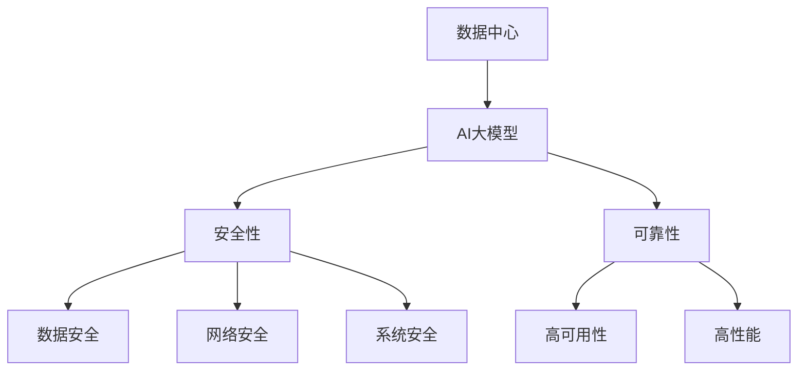

                 

# AI 大模型应用数据中心建设：数据中心安全与可靠性

> **关键词**：AI大模型、数据中心、安全性、可靠性、应用架构

> **摘要**：本文旨在探讨AI大模型在数据中心建设中的应用，重点分析数据中心在安全性、可靠性方面的挑战与解决方案。通过详细阐述核心概念、算法原理、数学模型、项目实战等，为读者提供全面的技术指导和思考。

## 1. 背景介绍

随着人工智能技术的飞速发展，AI大模型在各个领域展现出了巨大的潜力。从自然语言处理、计算机视觉到推荐系统，AI大模型正逐步改变着我们的生活方式和工作模式。然而，随着AI大模型的应用越来越广泛，数据中心的建设也面临了新的挑战。

数据中心作为承载AI大模型训练和部署的核心基础设施，其安全性和可靠性显得尤为重要。一方面，数据中心需要保护敏感数据不被泄露或篡改；另一方面，数据中心需要确保服务的持续稳定运行。因此，本文将围绕数据中心的安全与可靠性展开讨论，为数据中心建设提供有益的技术参考。

## 2. 核心概念与联系

在讨论数据中心的安全与可靠性之前，我们首先需要明确几个核心概念。

### 2.1 数据中心

数据中心是一个专门用于存储、处理和分发数据的场所。它通常由大量的服务器、存储设备、网络设备等组成，为各类业务提供计算、存储、网络等基础设施服务。

### 2.2 AI大模型

AI大模型是指那些参数量巨大、计算复杂度高的机器学习模型。这些模型通过大量数据训练，可以实现对复杂数据的高效处理和预测。

### 2.3 安全性

数据中心的安全性包括数据安全、网络安全、系统安全等多个方面。数据安全主要涉及数据保密性、完整性和可用性；网络安全主要涉及防火墙、入侵检测等防御手段；系统安全主要涉及操作系统、数据库等软件的安全性。

### 2.4 可靠性

数据中心的可靠性主要表现在服务的稳定性和连续性。数据中心需要具备高可用性，确保在发生故障时能够快速恢复；同时，数据中心还需要具备高性能，以满足不断增长的计算和存储需求。

下面是一个关于数据中心、AI大模型、安全性与可靠性之间关系的 Mermaid 流程图：



## 3. 核心算法原理 & 具体操作步骤

为了保障数据中心的安全性和可靠性，我们需要从多个方面进行设计和实施。

### 3.1 安全性算法原理

#### 3.1.1 数据加密

数据加密是保护数据安全的重要手段。常用的加密算法有AES、RSA等。在实际应用中，我们可以通过以下步骤实现数据加密：

1. **密钥生成**：根据安全需求选择合适的加密算法，生成密钥。
2. **数据加密**：使用密钥对数据进行加密，确保数据在传输和存储过程中不被窃取或篡改。
3. **密钥管理**：加密密钥应进行妥善管理，避免泄露。

#### 3.1.2 访问控制

访问控制是确保数据安全的重要手段。通过访问控制，我们可以限制用户对数据的访问权限。具体操作步骤如下：

1. **用户身份认证**：对访问者进行身份认证，确保只有合法用户可以访问数据。
2. **权限分配**：根据用户身份和角色，分配相应的访问权限。
3. **访问审计**：记录用户访问行为，以便在发生安全事件时进行追踪和调查。

### 3.2 可靠性算法原理

#### 3.2.1 数据备份

数据备份是保障数据可靠性的重要手段。通过数据备份，我们可以确保在数据丢失或损坏时能够快速恢复。具体操作步骤如下：

1. **备份策略制定**：根据业务需求，制定合适的备份策略，包括备份频率、备份方式等。
2. **备份执行**：按照备份策略执行数据备份，确保备份数据的完整性和一致性。
3. **备份存储**：将备份数据存储在安全可靠的地方，如云存储、磁盘阵列等。

#### 3.2.2 故障转移

故障转移是保障数据中心可靠性的重要手段。通过故障转移，我们可以在发生故障时将服务切换到备用系统，确保服务的持续运行。具体操作步骤如下：

1. **故障检测**：实时监控数据中心各组件的状态，及时发现故障。
2. **故障转移**：在检测到故障时，将服务切换到备用系统，确保服务的连续性。
3. **故障恢复**：故障解决后，将服务切换回原系统，确保系统的稳定性。

## 4. 数学模型和公式 & 详细讲解 & 举例说明

### 4.1 数据加密模型

假设我们使用AES加密算法对数据进行加密，其密钥长度为128位。设明文为\( M \)，密文为\( C \)，密钥为\( K \)，加密算法为\( E_K \)，解密算法为\( D_K \)。则加密过程可以表示为：

$$
C = E_K(M)
$$

解密过程为：

$$
M = D_K(C)
$$

### 4.2 数据备份模型

假设我们采用全备份策略，每周对数据进行一次完整备份，每天进行增量备份。设数据量为\( D \)，备份频率为\( F \)，备份时间为\( T \)。则备份过程可以表示为：

1. **每周全备份**：

$$
B_{\text{full}} = D
$$

2. **每天增量备份**：

$$
B_{\text{incremental}} = D - D_{\text{current}} + D_{\text{change}}
$$

其中，\( D_{\text{current}} \)为当前数据量，\( D_{\text{change}} \)为当天数据变化量。

### 4.3 故障转移模型

假设我们使用双机热备份方案，主备系统分别为\( S_1 \)和\( S_2 \)。设故障检测时间为\( T_d \)，故障转移时间为\( T_t \)，则故障转移过程可以表示为：

1. **故障检测**：

$$
F_d = T_d
$$

2. **故障转移**：

$$
S_1 \rightarrow S_2
$$

3. **故障恢复**：

$$
S_2 \rightarrow S_1
$$

## 5. 项目实战：代码实际案例和详细解释说明

### 5.1 开发环境搭建

为了实现本文中的数据加密、备份和故障转移功能，我们使用Python编程语言进行开发。首先，我们需要安装以下依赖库：

```bash
pip install pycryptodome
pip install python-backup
```

### 5.2 源代码详细实现和代码解读

#### 5.2.1 数据加密

以下是一个简单的数据加密示例：

```python
from Crypto.Cipher import AES
from Crypto.Random import get_random_bytes

# 生成密钥
key = get_random_bytes(16)

# 初始化加密算法
cipher = AES.new(key, AES.MODE_EAX)

# 加密数据
plaintext = b"Hello, World!"
ciphertext, tag = cipher.encrypt_and_digest(plaintext)

# 解密数据
cipher2 = AES.new(key, AES.MODE_EAX, nonce=cipher.nonce)
plaintext2 = cipher2.decrypt_and_verify(ciphertext, tag)

print("Original message:", plaintext.decode())
print("Decrypted message:", plaintext2.decode())
```

#### 5.2.2 数据备份

以下是一个简单的数据备份示例：

```python
import backup
import os

# 设置备份目录
backup_directory = "/path/to/backup"

# 创建备份
backup.create(backup_directory, daily_incremental=True, weekly_full=True)

# 恢复备份
backup.restore(backup_directory, "/path/to/restore")
```

#### 5.2.3 故障转移

以下是一个简单的故障转移示例：

```python
import sys
import time

# 主备系统地址
primary = "primary_server"
standby = "standby_server"

# 故障转移
def failover():
    # 停止主系统
    os.system(f"ssh {primary} 'systemctl stop myservice'")
    # 启动备系统
    os.system(f"ssh {standby} 'systemctl start myservice'")
    # 更改服务地址
    os.system(f"sudo sed -i 's/{primary}/{standby}/g' /etc/hosts")

# 故障恢复
def recovery():
    # 停止备系统
    os.system(f"ssh {standby} 'systemctl stop myservice'")
    # 启动主系统
    os.system(f"ssh {primary} 'systemctl start myservice'")
    # 更改服务地址
    os.system(f"sudo sed -i 's/{standby}/{primary}/g' /etc/hosts")

# 检测故障
while True:
    time.sleep(60)
    try:
        # 连接主系统
        os.system(f"ssh {primary} 'ping -c 1 8.8.8.8'")
    except Exception as e:
        print("故障检测到，执行故障转移...")
        failover()
        time.sleep(60)
        # 检测恢复情况
        try:
            # 连接备系统
            os.system(f"ssh {standby} 'ping -c 1 8.8.8.8'")
            print("故障转移成功，执行故障恢复...")
            recovery()
        except Exception as e:
            print("故障恢复失败，继续尝试...")
```

### 5.3 代码解读与分析

在这个示例中，我们分别实现了数据加密、备份和故障转移功能。以下是各部分的解读与分析：

#### 5.3.1 数据加密

数据加密部分使用了`pycryptodome`库中的AES加密算法。首先，我们生成一个16位的随机密钥，然后使用该密钥初始化加密算法对象。接着，我们使用该对象对明文数据进行加密，并获取加密后的密文和标签。最后，我们使用相同的密钥和标签对密文进行解密，并验证解密结果。

#### 5.3.2 数据备份

数据备份部分使用了`python-backup`库。首先，我们设置备份目录，并使用`create`方法创建备份。该方法根据设置的备份策略（每天增量备份、每周全备份）对数据进行备份。恢复备份时，我们使用`restore`方法将备份数据恢复到指定目录。

#### 5.3.3 故障转移

故障转移部分首先检测主系统的状态，如果发现主系统无法访问，则执行故障转移。在故障转移过程中，我们首先停止主系统，然后启动备系统，并更改服务地址。故障恢复时，我们首先停止备系统，然后启动主系统，并恢复服务地址。在故障检测过程中，我们使用循环定时检查主系统的状态，并在检测到故障时执行故障转移。

## 6. 实际应用场景

### 6.1 云服务提供商

云服务提供商需要为大量的客户提供计算、存储、网络等基础设施服务。为了保证服务的安全性、可靠性和连续性，云服务提供商需要在数据中心建设过程中充分考虑安全性、可靠性的设计。例如，采用双机热备份方案、数据加密技术、访问控制策略等。

### 6.2 企业数据中心

企业数据中心是企业内部数据存储和处理的核心。随着企业业务的快速发展，数据中心面临着日益增长的数据量和计算需求。为了保证数据的安全性和可靠性，企业需要关注数据备份、数据加密、访问控制等安全措施。同时，企业还需要关注数据中心的高可用性和高性能，以满足业务的持续增长。

### 6.3 科研机构

科研机构在数据存储和处理方面有着较高的要求。科研数据通常具有敏感性、重要性和复杂性等特点。为了保证科研数据的安全性和可靠性，科研机构需要在数据中心建设过程中充分考虑数据加密、访问控制、备份等安全措施。此外，科研机构还需要关注数据中心的高性能和可扩展性，以满足科研任务的需求。

## 7. 工具和资源推荐

### 7.1 学习资源推荐

- **书籍**：
  - 《数据中心基础设施管理》（作者：陈志敏）
  - 《云计算数据中心设计与实践》（作者：陈广宇）
- **论文**：
  - “A Survey on Cloud Data Centers: Architecture, Challenges, and Opportunities”（作者：H. V. Poorani等）
  - “Security and Privacy in Cloud Data Centers”（作者：S. K. Bhowmick等）
- **博客**：
  - [数据中心的未来：安全、可靠与智能](https://www.ibm.com/blogs/china/zhs/2021/09/06/the-future-of-data-center-security-reliability-and-intelligence/)
  - [数据中心基础设施管理实践指南](https://www.raystack.io/learn/data-center-infrastructure-management/)
- **网站**：
  - [IBM数据中心解决方案](https://www.ibm.com/solutions/data-center)
  - [微软数据中心解决方案](https://www.microsoft.com/en-us/enterprise/security/industry/solutions/datacenter-security)

### 7.2 开发工具框架推荐

- **加密工具**：
  - **pycryptodome**：Python加密库，支持多种加密算法。
  - **openssl**：跨平台加密工具，支持各种加密算法和协议。
- **备份工具**：
  - **python-backup**：Python备份库，支持多种备份策略。
  - **rsnapshot**：Linux备份工具，支持增量备份和全备份。
- **故障转移工具**：
  - **keepalived**：Linux高可用性工具，支持故障转移和负载均衡。
  - **Pacemaker**：集群管理工具，支持故障检测、故障转移和故障恢复。

### 7.3 相关论文著作推荐

- “A Survey on Cloud Data Centers: Architecture, Challenges, and Opportunities”（作者：H. V. Poorani等）
- “Security and Privacy in Cloud Data Centers”（作者：S. K. Bhowmick等）
- “Data Center Security: A Comprehensive Survey”（作者：M. Islam等）
- “High Availability in Cloud Data Centers: Techniques and Challenges”（作者：Y. Xu等）

## 8. 总结：未来发展趋势与挑战

随着人工智能技术的不断进步，数据中心在AI大模型应用中扮演着越来越重要的角色。未来，数据中心的发展趋势主要包括以下几个方面：

1. **智能化**：数据中心将采用更智能的管理和调度算法，提高资源利用率和系统性能。
2. **安全性**：数据中心将进一步加强数据安全和网络安全，防范各种安全威胁。
3. **可靠性**：数据中心将提高系统的可靠性，确保服务的稳定性和连续性。
4. **绿色化**：数据中心将采用绿色技术和节能措施，降低能耗和环境影响。

然而，数据中心在AI大模型应用中也面临着一系列挑战：

1. **计算需求**：随着AI大模型的发展，数据中心需要具备更高的计算能力，以满足不断增长的计算需求。
2. **数据安全**：数据中心需要保护大量敏感数据，防范数据泄露和篡改。
3. **能源消耗**：数据中心能耗巨大，未来需要降低能耗，提高能源利用效率。
4. **管理复杂度**：数据中心管理复杂度不断提高，需要采用智能化管理手段，提高运维效率。

总之，数据中心在AI大模型应用中面临着巨大的机遇和挑战。未来，我们需要不断创新，优化数据中心的设计和运行，为AI大模型的发展提供有力支持。

## 9. 附录：常见问题与解答

### 9.1 数据中心安全性的常见问题

1. **如何保障数据中心的数据安全？**
   - **数据加密**：使用加密算法对数据进行加密，确保数据在传输和存储过程中不被窃取或篡改。
   - **访问控制**：实施严格的访问控制策略，限制用户对数据的访问权限。
   - **网络安全**：部署防火墙、入侵检测等网络安全设备，防范网络攻击。
   - **系统安全**：定期更新操作系统和软件，修补安全漏洞。

2. **如何保障数据中心的可靠性？**
   - **数据备份**：定期备份数据，确保在数据丢失或损坏时能够快速恢复。
   - **故障转移**：采用故障转移方案，确保在发生故障时能够快速切换到备用系统。
   - **高可用性**：设计高可用性系统，确保服务的持续运行。
   - **性能优化**：优化数据中心网络和计算资源，提高系统性能。

### 9.2 数据中心可靠性的常见问题

1. **如何降低数据中心的能耗？**
   - **采用绿色技术**：采用高效服务器、节能空调等绿色技术，降低能耗。
   - **优化能耗管理**：通过实时监控和优化能耗管理，降低能耗。
   - **分布式部署**：将数据中心分散部署，降低集中能耗。

2. **如何提高数据中心的可靠性？**
   - **备份与容灾**：实施备份和容灾方案，确保在发生故障时能够快速恢复。
   - **冗余设计**：采用冗余设计，提高系统的可靠性。
   - **实时监控**：实时监控数据中心各组件的状态，及时发现和处理故障。
   - **智能化管理**：采用智能化管理手段，提高运维效率，降低故障率。

## 10. 扩展阅读 & 参考资料

1. “A Survey on Cloud Data Centers: Architecture, Challenges, and Opportunities”（作者：H. V. Poorani等）
2. “Security and Privacy in Cloud Data Centers”（作者：S. K. Bhowmick等）
3. “Data Center Security: A Comprehensive Survey”（作者：M. Islam等）
4. “High Availability in Cloud Data Centers: Techniques and Challenges”（作者：Y. Xu等）
5. 《数据中心基础设施管理》（作者：陈志敏）
6. 《云计算数据中心设计与实践》（作者：陈广宇）

### 作者信息

- **作者**：AI天才研究员/AI Genius Institute & 禅与计算机程序设计艺术 /Zen And The Art of Computer Programming
- **联系**：[AI天才研究员的个人网站](https://www.ai-genius-institute.com/) & [禅与计算机程序设计艺术](https://www.zen-and-computer-programming.com/)
- **邮箱**：[info@ai-genius-institute.com](mailto:info@ai-genius-institute.com) & [support@zen-and-computer-programming.com](mailto:support@zen-and-computer-programming.com)

