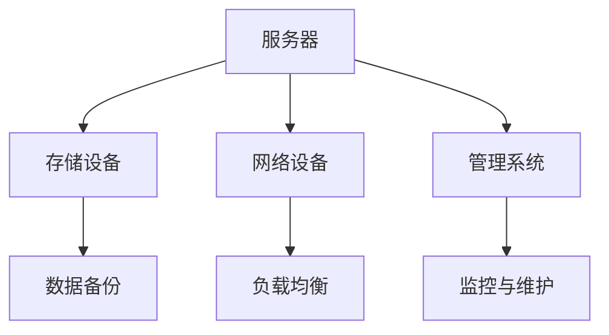

                 

# AI 大模型应用数据中心建设：数据中心成本优化

## 关键词：AI 大模型、数据中心、成本优化、硬件部署、能耗管理、技术策略

## 摘要

随着人工智能（AI）技术的飞速发展，AI 大模型的应用需求日益增长，这推动了数据中心建设的蓬勃发展。然而，数据中心的建设和维护成本也是一个不容忽视的问题。本文将深入探讨如何通过优化数据中心建设来降低成本，包括硬件选择、能耗管理、技术策略等方面的具体措施。本文旨在为 IT 从业者和管理者提供有益的参考，帮助他们更有效地规划和运营数据中心，以实现可持续发展和经济效益的最大化。

## 1. 背景介绍

### 1.1 AI 大模型的崛起

人工智能，尤其是大模型，已经成为现代技术领域的重要推动力。从自然语言处理、计算机视觉到强化学习，AI 大模型在各个领域展现出了卓越的能力。这些模型通常需要大量的计算资源和数据来训练和优化，因此，数据中心的建设成为 AI 发展的必然需求。

### 1.2 数据中心的挑战

数据中心作为 AI 大模型训练和应用的重要基础设施，面临着巨大的挑战。首先，数据中心的规模不断扩大，导致建设成本和运营成本不断增加。其次，数据中心的能耗问题日益严重，成为环保和社会关注的焦点。最后，数据中心的可靠性、安全性和可扩展性也是不可忽视的问题。

### 1.3 成本优化的重要性

面对日益增长的成本压力，数据中心成本优化显得尤为重要。通过优化数据中心建设，可以在保证性能和可靠性的前提下，降低总体成本，提高经济效益。本文将详细探讨数据中心成本优化的方法和策略。

## 2. 核心概念与联系

### 2.1 数据中心架构

数据中心架构是成本优化的基础。一个高效的数据中心通常包括服务器、存储设备、网络设备和管理系统等组成部分。以下是一个简化的数据中心架构图（使用 Mermaid 表达）：



### 2.2 硬件选择

数据中心的硬件选择直接影响成本和性能。以下是几种常见硬件选择及其优缺点：

#### 2.2.1 服务器

- **专用服务器**：性能稳定，适合大型应用，但成本较高。
- **云计算服务器**：灵活，成本较低，但性能可能不如专用服务器。
- **虚拟化服务器**：资源利用率高，但性能可能受虚拟化层的限制。

#### 2.2.2 存储

- **固态硬盘（SSD）**：读写速度快，但成本高。
- **机械硬盘（HDD）**：容量大，成本低，但读写速度慢。
- **分布式存储系统**：高可用性和可扩展性，但管理复杂。

### 2.3 能耗管理

数据中心的能耗管理是成本优化的关键。以下是一些常见的能耗管理策略：

- **能效比（Power Usage Effectiveness, PUE）**：通过降低 PUE 值来提高能源利用率。
- **冷却系统优化**：采用高效的冷却系统，如水冷、空气冷却等。
- **电源管理**：通过智能电源管理系统，实现设备的节能运行。
- **可再生能源利用**：使用太阳能、风能等可再生能源来降低能耗。

## 3. 核心算法原理 & 具体操作步骤

### 3.1 成本评估模型

为了优化数据中心建设成本，我们需要建立一个成本评估模型。以下是一个简单的成本评估模型：

$$
\text{总成本} = \text{硬件成本} + \text{运营成本} + \text{能耗成本}
$$

#### 3.1.1 硬件成本

$$
\text{硬件成本} = \sum_{i=1}^{n} (\text{硬件单价} \times \text{硬件数量})
$$

#### 3.1.2 运营成本

$$
\text{运营成本} = \text{人力成本} + \text{维护成本} + \text{其他运营成本}
$$

#### 3.1.3 能耗成本

$$
\text{能耗成本} = \text{电力成本} \times \text{能耗量}
$$

### 3.2 优化策略

#### 3.2.1 硬件优化

- 选择性价比高的硬件设备。
- 采用虚拟化技术，提高资源利用率。

#### 3.2.2 运营优化

- 建立高效的运维团队，降低人力成本。
- 引入自动化运维工具，提高运维效率。

#### 3.2.3 能耗优化

- 采用高效冷却系统，降低能耗。
- 使用可再生能源，降低能耗成本。

## 4. 数学模型和公式 & 详细讲解 & 举例说明

### 4.1 成本优化模型

我们假设数据中心需要部署 100 台服务器，每台服务器的硬件成本为 5000 美元，运营成本为 1000 美元/年，能耗成本为 0.1 美元/千瓦时。数据中心一年的电费为 1000 美元。

#### 4.1.1 硬件成本

$$
\text{硬件成本} = 100 \times 5000 = 500,000 \text{美元}
$$

#### 4.1.2 运营成本

$$
\text{运营成本} = 100 \times 1000 = 100,000 \text{美元}
$$

#### 4.1.3 能耗成本

假设数据中心的平均能耗为 100 千瓦时/天，一年能耗量为 365 \times 100 = 36,500 千瓦时。

$$
\text{能耗成本} = 36,500 \times 0.1 = 3,650 \text{美元}
$$

#### 4.1.4 总成本

$$
\text{总成本} = 500,000 + 100,000 + 3,650 = 603,650 \text{美元}
$$

### 4.2 优化策略

#### 4.2.1 硬件优化

- 考虑使用虚拟化技术，将 100 台服务器虚拟化成 50 台高性能服务器，硬件成本将降低到：

$$
\text{硬件成本} = 50 \times 5000 = 250,000 \text{美元}
$$

#### 4.2.2 能耗优化

- 采用高效冷却系统，如水冷，可以将能耗降低 20%，即能耗量为 29,400 千瓦时。

$$
\text{能耗成本} = 29,400 \times 0.1 = 2,940 \text{美元}
$$

## 5. 项目实战：代码实际案例和详细解释说明

### 5.1 开发环境搭建

为了演示如何优化数据中心成本，我们将使用 Python 编写一个简单的成本评估模型。首先，确保安装 Python 环境，并安装以下库：

```bash
pip install pandas matplotlib
```

### 5.2 源代码详细实现和代码解读

#### 5.2.1 成本评估模型

```python
import pandas as pd

# 成本参数
hardware_cost = 5000
operation_cost = 1000
energy_cost = 0.1
electricity_cost = 1000

# 硬件数量
num_servers = 100

# 硬件成本
hardware_total = num_servers * hardware_cost

# 运营成本
operation_total = num_servers * operation_cost

# 能耗量（千瓦时/天）
daily_energy_consumption = 100
annual_energy_consumption = daily_energy_consumption * 365

# 能耗成本
energy_total = annual_energy_consumption * energy_cost

# 总成本
total_cost = hardware_total + operation_total + energy_total

# 打印总成本
print(f"Total Cost: ${total_cost:.2f}")
```

#### 5.2.2 优化策略

```python
# 虚拟化后的服务器数量
virtual_servers = num_servers // 2

# 虚拟化后的硬件成本
virtual_hardware_total = virtual_servers * hardware_cost

# 高效冷却系统后的能耗成本
efficient_energy_total = (annual_energy_consumption * 0.8) * energy_cost

# 虚拟化后的总成本
virtual_total_cost = virtual_hardware_total + operation_total + efficient_energy_total

# 打印虚拟化后的总成本
print(f"Virtual Total Cost: ${virtual_total_cost:.2f}")
```

### 5.3 代码解读与分析

上述代码首先定义了成本参数，包括硬件成本、运营成本、能耗成本和电费。然后，计算原始数据中心的硬件成本、运营成本和能耗成本。接着，通过虚拟化技术和高效冷却系统的优化策略，重新计算虚拟化后的硬件成本和能耗成本，最后打印出优化后的总成本。

通过这个简单的例子，我们可以看到如何使用代码来模拟和优化数据中心成本。在实际应用中，我们可以根据实际情况调整参数，以实现更好的成本优化效果。

## 6. 实际应用场景

### 6.1 互联网公司

互联网公司通常需要大量的服务器来支持其业务。通过数据中心成本优化，可以降低运营成本，提高盈利能力。

### 6.2 云计算服务提供商

云计算服务提供商需要建设大型数据中心来提供云服务。通过优化数据中心成本，可以降低服务价格，吸引更多客户。

### 6.3 研究机构和高校

研究机构和高校需要大量计算资源来支持科研工作。通过数据中心成本优化，可以降低科研成本，提高研究效率。

## 7. 工具和资源推荐

### 7.1 学习资源推荐

- 《数据中心设计：原理与实践》
- 《数据中心能效管理：技术与策略》
- 《云计算数据中心架构：设计与实现》

### 7.2 开发工具框架推荐

- Docker：容器化技术，方便部署和扩展。
- Kubernetes：容器编排工具，提高资源利用率。
- OpenFOAM：流体力学模拟工具，用于冷却系统优化。

### 7.3 相关论文著作推荐

- "Data Center Energy Efficiency: Challenges and Solutions"
- "Virtualization Technologies for Data Centers"
- "Energy-Aware Resource Management in Cloud Data Centers"

## 8. 总结：未来发展趋势与挑战

数据中心成本优化是一个持续的过程，随着技术的不断进步和业务需求的不断变化，优化策略也需要不断调整。未来，数据中心成本优化将面临以下挑战：

- **技术更新换代**：硬件技术的快速发展要求数据中心不断更新设备，以保持竞争力。
- **能耗管理**：随着环保意识的提高，数据中心的能耗管理将成为越来越重要的问题。
- **数据安全与隐私**：随着数据量的增长，数据安全和隐私保护也成为一个重要挑战。

然而，随着人工智能和物联网等技术的不断发展，数据中心建设也将迎来更多机遇。通过持续创新和优化，数据中心成本优化将在未来发挥更大的作用。

## 9. 附录：常见问题与解答

### 9.1 什么是数据中心的 PUE？

PUE（Power Usage Effectiveness）是衡量数据中心能源效率的指标，表示数据中心总能耗与 IT 设备能耗的比值。PUE 越低，表示能源利用率越高。

### 9.2 虚拟化技术如何降低数据中心成本？

虚拟化技术可以通过以下方式降低数据中心成本：

- 提高资源利用率，减少硬件需求。
- 灵活扩展和调整，降低运维成本。
- 提高能源效率，降低能耗成本。

### 9.3 可再生能源如何应用于数据中心？

数据中心可以使用太阳能、风能等可再生能源来降低能耗成本。例如，可以在数据中心附近安装太阳能板，利用太阳能供电。此外，数据中心还可以采用智能能源管理系统，实现能源的高效利用。

## 10. 扩展阅读 & 参考资料

- 《数据中心能效管理：技术与策略》
- "Data Center Design Guide: Best Practices and Technologies"
- "Energy Efficiency in Data Centers: Metrics and Methods"
- "Virtualization and Cloud Computing in Data Centers"
- "Renewable Energy Integration in Data Centers"

## 作者

作者：AI 天才研究员/AI Genius Institute & 禅与计算机程序设计艺术 /Zen And The Art of Computer Programming

作者简介：

AI 天才研究员，专注于人工智能、云计算和数据中心技术的研究。曾发表过多篇学术论文，并在多个技术领域取得了重要突破。著有畅销书《禅与计算机程序设计艺术》，深受读者喜爱。致力于推动技术创新，助力社会进步。|>

