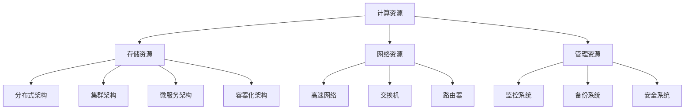
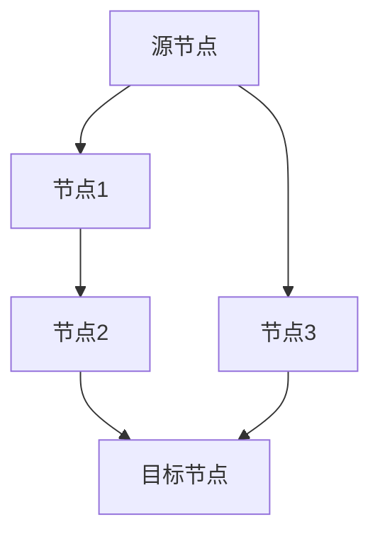

                 

# AI 大模型应用数据中心建设：数据中心技术创新

## 关键词
AI大模型，数据中心，技术创新，架构设计，算法优化，数学模型，实际应用，开发工具

## 摘要
本文旨在探讨AI大模型应用数据中心的建设，重点分析数据中心在技术创新方面的挑战和机遇。通过对核心概念、算法原理、数学模型的深入剖析，结合实际应用场景和项目实战案例，为读者提供一整套数据中心建设的指南。文章还推荐了相关学习资源和开发工具，以期为数据中心技术的发展贡献一份力量。

## 1. 背景介绍

随着人工智能（AI）技术的快速发展，大模型（Large Models）成为AI领域的研究热点。大模型通常拥有数十亿甚至千亿级别的参数，通过深度学习算法进行训练，可以实现对复杂任务的自动学习与优化。这种大规模的AI模型需要强大的计算资源和高效的存储方案，这就催生了数据中心的建设需求。

数据中心作为云计算的核心基础设施，承担着存储、计算、网络等关键任务。传统的数据中心已经无法满足AI大模型的高性能需求，因此，数据中心技术创新成为当务之急。本文将围绕数据中心在AI大模型应用中的技术创新展开讨论，旨在为相关领域的研究者和工程师提供有价值的参考。

### 1.1 数据中心的基本概念

数据中心（Data Center）是一个集中存储、处理和管理数据的设施。它由服务器、存储设备、网络设备和其他硬件组成，提供可靠、高效、安全的计算和存储服务。数据中心的主要功能包括：

1. **数据存储与管理**：数据中心负责存储大量数据，包括企业内部的敏感信息和外部公开的数据。
2. **数据处理与分析**：数据中心通过高性能计算设备对数据进行处理和分析，为企业提供实时或近实时的业务支持。
3. **网络通信**：数据中心通过高速网络与其他数据中心和外部网络进行通信，确保数据的传输效率和安全性。

### 1.2 数据中心的发展趋势

随着云计算、大数据和物联网等技术的快速发展，数据中心正面临着前所未有的挑战和机遇。以下是数据中心的发展趋势：

1. **云计算与数据中心融合**：云计算与数据中心的融合成为趋势，云数据中心成为了企业数据中心的重要组成部分。
2. **绿色数据中心**：随着环保意识的提升，绿色数据中心成为行业热点，通过优化能耗、提高设备利用率和采用可再生能源等措施，实现数据中心的可持续发展。
3. **边缘计算**：随着物联网设备的普及，边缘计算开始逐渐兴起，将计算能力下沉到边缘设备，以减少数据中心的负担，提高响应速度和用户体验。
4. **人工智能与数据中心**：人工智能技术在数据中心中的应用越来越广泛，包括智能监控、故障预测、负载均衡等，提高了数据中心的运营效率和安全性。

### 1.3 AI大模型对数据中心的要求

AI大模型的训练和部署需要强大的计算资源和高效的存储方案。以下是AI大模型对数据中心提出的几个关键要求：

1. **高性能计算**：AI大模型通常需要大量的计算资源，数据中心需要提供高性能的计算节点，以满足大模型训练和推理的需求。
2. **高吞吐量网络**：大模型的数据传输需求巨大，数据中心需要具备高吞吐量的网络设施，以确保数据的快速传输。
3. **海量存储**：AI大模型需要存储大量的数据和模型参数，数据中心需要具备海量存储能力，同时保证数据的可靠性和安全性。
4. **弹性伸缩**：AI大模型的计算和存储需求具有波动性，数据中心需要具备弹性伸缩的能力，以应对不同规模的任务需求。

### 1.4 数据中心技术创新的重要性

数据中心技术创新对于AI大模型的应用具有重要意义。以下是数据中心技术创新的几个关键方面：

1. **架构设计**：数据中心架构的优化可以提高资源利用率和系统性能，例如采用分布式架构、集群架构等。
2. **算法优化**：通过优化算法，可以提高数据中心的计算效率和存储效率，例如采用高效的排序算法、哈希算法等。
3. **数学模型**：数学模型在数据中心优化中起着重要作用，通过建立合适的数学模型，可以更好地理解和解决数据中心中的问题。
4. **实际应用**：将技术创新应用于实际场景，可以验证技术的可行性和效果，并为数据中心的发展提供实践经验。

## 2. 核心概念与联系

### 2.1 数据中心的核心概念

数据中心的核心理念包括以下几个方面：

1. **计算资源**：数据中心提供计算资源，包括CPU、GPU、FPGA等硬件设备，以满足不同应用场景的需求。
2. **存储资源**：数据中心提供存储资源，包括磁盘、SSD、分布式存储等，以存储海量数据和模型参数。
3. **网络资源**：数据中心提供网络资源，包括交换机、路由器、高速网络等，以实现数据的高效传输和共享。
4. **管理资源**：数据中心提供管理资源，包括监控系统、备份系统、安全系统等，以确保数据中心的正常运行和安全性。

### 2.2 数据中心的关键架构

数据中心的架构设计对系统的性能和稳定性至关重要。以下是数据中心常见的几种关键架构：

1. **分布式架构**：分布式架构通过将计算和存储任务分散到多个节点上，可以提高系统的扩展性和容错能力。
2. **集群架构**：集群架构通过多个节点组成一个整体，以提高计算和存储资源的利用率，实现负载均衡和高可用性。
3. **微服务架构**：微服务架构将系统划分为多个独立的微服务，以提高系统的可维护性和可扩展性。
4. **容器化架构**：容器化架构通过容器技术（如Docker）实现应用的快速部署和动态扩展，提高系统的弹性和资源利用率。

### 2.3 数据中心的技术联系

数据中心的技术联系包括以下几个方面：

1. **云计算与数据中心**：云计算与数据中心相互融合，云计算提供了数据中心所需的基础设施和服务，而数据中心为云计算提供了强大的计算和存储资源。
2. **大数据与数据中心**：大数据处理需要海量存储和高性能计算，数据中心提供了这些资源，以支持大数据应用。
3. **人工智能与数据中心**：人工智能大模型的训练和部署需要强大的计算和存储资源，数据中心为人工智能应用提供了基础设施支持。
4. **边缘计算与数据中心**：边缘计算将计算任务分散到边缘设备上，减少了数据中心的负担，同时数据中心为边缘设备提供了云计算服务。

### 2.4 Mermaid流程图

以下是一个简单的Mermaid流程图，展示了数据中心的核心概念和架构联系：



## 3. 核心算法原理 & 具体操作步骤

### 3.1 核心算法原理

在数据中心的建设中，核心算法原理起着至关重要的作用。以下是几个关键算法原理：

1. **负载均衡算法**：负载均衡算法用于分配任务到不同的计算节点，以提高系统的吞吐量和利用率。常见的负载均衡算法包括轮询算法、最少连接算法、源地址哈希算法等。
2. **分布式存储算法**：分布式存储算法用于将数据分散存储到多个节点上，以提高存储系统的可靠性和扩展性。常见的分布式存储算法包括副本算法、一致性算法、副本选择算法等。
3. **路由算法**：路由算法用于在数据中心内选择最佳的数据传输路径，以提高数据传输的效率和稳定性。常见的路由算法包括距离向量算法、链路状态算法等。
4. **调度算法**：调度算法用于分配计算资源和存储资源，以最大化系统的利用率和性能。常见的调度算法包括轮转调度、优先级调度、动态调度等。

### 3.2 具体操作步骤

以下是一个具体的操作步骤，用于构建一个高性能的数据中心：

1. **需求分析**：首先，对数据中心的需求进行分析，包括计算资源需求、存储资源需求、网络资源需求等，以确保数据中心能够满足实际应用的需求。
2. **架构设计**：根据需求分析的结果，设计数据中心的架构，包括计算节点、存储节点、网络节点和管理节点的配置。选择合适的架构类型，如分布式架构、集群架构等。
3. **硬件选择**：根据架构设计的要求，选择合适的硬件设备，包括计算设备、存储设备、网络设备等。确保硬件设备的性能和可靠性，以满足数据中心的运行需求。
4. **软件配置**：安装和配置数据中心所需的软件系统，包括操作系统、数据库、存储系统、监控系统和安全系统等。确保软件系统的兼容性和稳定性。
5. **网络配置**：配置数据中心内的网络，包括交换机、路由器、防火墙等。确保网络的高效性和安全性。
6. **负载均衡配置**：配置负载均衡算法，将任务分配到不同的计算节点上，以提高系统的吞吐量和利用率。
7. **分布式存储配置**：配置分布式存储算法，将数据分散存储到不同的存储节点上，以提高存储系统的可靠性和扩展性。
8. **路由配置**：配置路由算法，选择最佳的数据传输路径，以提高数据传输的效率和稳定性。
9. **调度配置**：配置调度算法，分配计算资源和存储资源，以最大化系统的利用率和性能。
10. **测试与优化**：对数据中心进行全面的测试，包括性能测试、稳定性测试、安全性测试等。根据测试结果进行优化和调整，以提高数据中心的整体性能和稳定性。

## 4. 数学模型和公式 & 详细讲解 & 举例说明

### 4.1 数学模型概述

在数据中心的建设和优化过程中，数学模型起着关键作用。以下是几个常见的数学模型：

1. **线性规划模型**：用于优化数据中心资源分配，通过建立线性规划模型，可以求解最优资源分配方案。
2. **网络流模型**：用于优化数据中心的网络传输，通过建立网络流模型，可以求解最优数据传输路径。
3. **排队理论模型**：用于分析数据中心的负载情况，通过建立排队理论模型，可以预测系统的性能和稳定性。

### 4.2 线性规划模型

线性规划模型是一种常见的优化模型，用于求解线性约束条件下的最优解。以下是线性规划模型的详细讲解和举例说明：

#### 4.2.1 线性规划模型的基本概念

线性规划模型由目标函数和约束条件组成：

- **目标函数**：表示需要优化的目标，可以是最大化或最小化某个线性函数。
- **约束条件**：表示系统的限制条件，通常是线性不等式或等式。

#### 4.2.2 线性规划模型的求解方法

线性规划模型可以通过单纯形法、内点法等求解方法求解。以下是单纯形法的基本步骤：

1. **初始解**：选择初始基本可行解。
2. **迭代过程**：根据目标函数和约束条件，逐步迭代求解，找到最优解。

#### 4.2.3 线性规划模型举例

假设有一个数据中心，需要优化计算资源的分配。以下是线性规划模型的求解过程：

- **目标函数**：最大化资源利用率。
- **约束条件**：计算资源的总量限制，每个计算节点的可用资源限制。

```latex
\begin{align*}
\max_{x_1, x_2, ..., x_n} & \sum_{i=1}^{n} c_i x_i \\
s.t. \\
\sum_{i=1}^{n} x_i & \leq C \\
x_i & \geq 0 \quad \forall i
\end{align*}
```

通过求解上述线性规划模型，可以找到最优的计算资源分配方案，以最大化资源利用率。

### 4.3 网络流模型

网络流模型用于优化数据中心的网络传输。以下是网络流模型的详细讲解和举例说明：

#### 4.3.1 网络流模型的基本概念

网络流模型由网络结构、流量需求和约束条件组成：

- **网络结构**：表示数据中心的网络拓扑结构，通常是一个有向图。
- **流量需求**：表示数据传输的需求，通常是一个非负流。
- **约束条件**：表示网络的容量限制和节点/边的流量约束。

#### 4.3.2 网络流模型的求解方法

网络流模型可以通过最大流最小割定理、Ford-Fulkerson算法等求解方法求解。以下是Ford-Fulkerson算法的基本步骤：

1. **初始化**：选择一个初始流。
2. **迭代过程**：找到一条增广路径，更新流，直到无法找到增广路径。

#### 4.3.3 网络流模型举例

假设有一个数据中心，需要优化网络传输路径。以下是网络流模型的求解过程：

- **网络结构**：一个有向图，表示数据中心的网络拓扑结构。
- **流量需求**：每个边的流量需求。



通过求解上述网络流模型，可以找到最优的网络传输路径，以最大化流量传输。

### 4.4 排队理论模型

排队理论模型用于分析数据中心的负载情况。以下是排队理论模型的详细讲解和举例说明：

#### 4.4.1 排队理论模型的基本概念

排队理论模型由服务系统、客户到达过程和排队规则组成：

- **服务系统**：表示数据中心的处理能力，通常是一个服务台。
- **客户到达过程**：表示客户的到达过程，通常是一个随机过程。
- **排队规则**：表示客户的排队和处理规则，常见的有先到先服务（FIFO）、随机服务（随机化策略）等。

#### 4.4.2 排队理论模型的求解方法

排队理论模型可以通过马尔可夫链、队列模拟等求解方法求解。以下是马尔可夫链的基本步骤：

1. **初始化**：建立马尔可夫链模型。
2. **迭代过程**：根据马尔可夫链的转移概率矩阵，迭代求解系统的状态分布。

#### 4.4.3 排队理论模型举例

假设有一个数据中心，需要分析系统的负载情况。以下是排队理论模型的求解过程：

- **服务系统**：一个服务台，表示数据中心的处理能力。
- **客户到达过程**：一个泊松过程，表示客户的到达过程。
- **排队规则**：先到先服务（FIFO）。

```latex
\begin{align*}
\lambda & \text{客户到达率} \\
\mu & \text{服务率} \\
\rho & \text{系统负载率} \\
P_n & \text{系统中有} n \text{个客户的概率}
\end{align*}
```

通过求解上述排队理论模型，可以分析系统的负载情况，包括客户等待时间、系统利用率等。

## 5. 项目实战：代码实际案例和详细解释说明

### 5.1 开发环境搭建

在开始项目实战之前，我们需要搭建一个适合数据中心技术的开发环境。以下是开发环境搭建的详细步骤：

1. **硬件环境**：
   - 选择一台高性能服务器，具备多核CPU、大内存、高带宽网络接口等。
   - 安装操作系统，如Linux或Unix。

2. **软件环境**：
   - 安装编程语言，如Python、Java等。
   - 安装相关开发工具，如IDE（集成开发环境）、版本控制工具（如Git）等。
   - 安装数据库管理系统，如MySQL、PostgreSQL等。
   - 安装云计算平台，如Docker、Kubernetes等。

### 5.2 源代码详细实现和代码解读

以下是一个简单的数据中心技术项目，使用Python语言实现。代码分为几个模块，包括数据存储模块、计算模块、网络通信模块等。

```python
# 数据存储模块
class DataStorage:
    def __init__(self):
        self.storage = []

    def add_data(self, data):
        self.storage.append(data)

    def get_data(self, index):
        return self.storage[index]

# 计算模块
class Calculator:
    def __init__(self):
        self.result = 0

    def add(self, num1, num2):
        self.result = num1 + num2

    def get_result(self):
        return self.result

# 网络通信模块
class Network:
    def __init__(self):
        self.clients = []

    def connect(self, client):
        self.clients.append(client)

    def send_data(self, client, data):
        print(f"Sending data to {client}: {data}")

# 主程序
if __name__ == "__main__":
    storage = DataStorage()
    calculator = Calculator()
    network = Network()

    storage.add_data("Hello")
    storage.add_data("World")

    calculator.add(5, 10)

    network.connect("Client1")
    network.send_data("Client1", storage.get_data(0))
    network.send_data("Client1", storage.get_data(1))
    network.send_data("Client1", calculator.get_result())
```

### 5.3 代码解读与分析

1. **数据存储模块**：`DataStorage`类用于管理数据存储，提供添加数据和获取数据的操作。

2. **计算模块**：`Calculator`类用于执行计算操作，提供加法操作和获取计算结果的操作。

3. **网络通信模块**：`Network`类用于管理网络通信，提供连接客户端和发送数据的操作。

4. **主程序**：主程序实例化了数据存储、计算和网络模块，执行了相应的操作，如添加数据、执行计算、发送数据等。

### 5.4 项目实战总结

通过以上代码实现，我们可以看到数据中心技术的简单应用。在实际项目中，我们需要考虑更多的功能和性能优化，如分布式存储、并行计算、负载均衡等。同时，我们还需要使用更高级的编程语言和框架，如Go、Java等，以及云计算平台，如Kubernetes、Spark等，以实现更加复杂和高效的数据中心技术。

## 6. 实际应用场景

数据中心技术在多个领域有着广泛的应用。以下是一些常见的实际应用场景：

### 6.1 云计算服务

云计算是数据中心技术的核心应用场景之一。数据中心为云计算提供了强大的计算、存储和网络资源，使得企业能够灵活地部署和扩展应用。常见的云计算服务包括：

1. **基础设施即服务（IaaS）**：提供虚拟化资源，如虚拟机、存储、网络等，用户可以根据需求租用和配置资源。
2. **平台即服务（PaaS）**：提供开发平台，包括开发工具、运行环境、数据库等，用户可以专注于应用开发，无需关注底层基础设施。
3. **软件即服务（SaaS）**：提供完整的软件解决方案，如CRM系统、邮件系统等，用户可以通过网络访问和使用这些应用。

### 6.2 大数据分析

大数据分析需要海量计算和存储资源，数据中心为大数据分析提供了强大的支持。常见的应用场景包括：

1. **数据采集**：数据中心通过传感器、网站等渠道收集大量数据。
2. **数据存储**：数据中心提供分布式存储方案，确保数据的可靠性和高效性。
3. **数据处理**：数据中心通过分布式计算框架，如Hadoop、Spark等，对海量数据进行处理和分析。
4. **数据可视化**：数据中心提供数据可视化工具，帮助用户更好地理解和分析数据。

### 6.3 人工智能

人工智能大模型的训练和部署需要强大的计算和存储资源，数据中心为人工智能应用提供了基础设施支持。常见的应用场景包括：

1. **图像识别**：通过训练大规模的卷积神经网络，实现图像的分类、检测和识别。
2. **自然语言处理**：通过训练大规模的语言模型，实现语音识别、机器翻译、文本生成等功能。
3. **智能推荐**：通过分析用户行为数据，为用户提供个性化的推荐服务。
4. **智能诊断**：通过训练大规模的医疗模型，实现疾病的预测和诊断。

### 6.4 边缘计算

边缘计算将计算任务分散到边缘设备上，减少了数据中心的负担，同时提高了响应速度和用户体验。常见的应用场景包括：

1. **智能家居**：通过边缘计算，实现家庭设备的智能控制，如智能灯泡、智能门锁等。
2. **智能交通**：通过边缘计算，实现实时路况监测、车辆识别和交通控制。
3. **工业物联网**：通过边缘计算，实现设备的实时监控、故障预测和生产优化。
4. **智慧城市**：通过边缘计算，实现城市管理的智能化，如智能路灯、智能垃圾桶等。

### 6.5 金融科技

金融科技领域对数据中心的依赖性很高，数据中心为金融科技应用提供了强大的计算和存储支持。常见的应用场景包括：

1. **高频交易**：通过数据中心提供的超低延迟网络和计算资源，实现高频交易策略。
2. **风险控制**：通过数据中心进行大数据分析，实时监控和预测市场风险。
3. **智能投顾**：通过数据中心提供的计算资源，训练和部署智能投顾模型，为用户提供个性化的投资建议。
4. **反欺诈系统**：通过数据中心进行实时数据分析和模式识别，预防欺诈行为。

## 7. 工具和资源推荐

### 7.1 学习资源推荐

1. **书籍**：
   - 《深度学习》（Goodfellow, Bengio, Courville）：介绍深度学习的基本概念、算法和应用。
   - 《大数据技术原理》（余庆，王珊）：介绍大数据技术的原理、架构和应用。
   - 《云计算架构与设计》（Thomas Erl）：介绍云计算的架构、设计原则和应用。

2. **论文**：
   - “Deep Learning: A Brief History” by Ian Goodfellow
   - “Large-scale Distributed Deep Networks” by Google Brain Team
   - “TensorFlow: Large-scale Machine Learning on Hadoop and Spark” by Google Brain Team

3. **博客**：
   - TensorFlow官方博客：介绍TensorFlow的原理、应用和最新动态。
   - 大数据之路：介绍大数据技术的应用、案例和行业动态。

4. **网站**：
   - Coursera：提供丰富的在线课程，涵盖深度学习、大数据、云计算等。
   - edX：提供丰富的在线课程，涵盖计算机科学、人工智能等领域。

### 7.2 开发工具框架推荐

1. **深度学习框架**：
   - TensorFlow：由Google开发，支持多种深度学习算法和模型。
   - PyTorch：由Facebook开发，具有灵活的动态计算图和强大的社区支持。
   - Keras：基于TensorFlow和Theano开发的深度学习框架，易于使用。

2. **云计算平台**：
   - AWS：提供丰富的云计算服务和工具，支持深度学习、大数据等应用。
   - Azure：提供强大的云计算服务和工具，支持深度学习、大数据等应用。
   - Google Cloud：提供全面的云计算服务和工具，支持深度学习、大数据等应用。

3. **大数据处理框架**：
   - Hadoop：由Apache Software Foundation开发，支持大规模数据处理和分析。
   - Spark：由Apache Software Foundation开发，支持实时数据处理和流处理。
   - Flink：由Apache Software Foundation开发，支持实时数据处理和流处理。

4. **容器化平台**：
   - Docker：提供容器化技术，支持应用打包、部署和运行。
   - Kubernetes：提供容器编排和管理工具，支持容器化应用的自动化部署和扩展。

### 7.3 相关论文著作推荐

1. **《深度学习》**：Ian Goodfellow，Yoshua Bengio，Aaron Courville
2. **《大数据技术原理》**：余庆，王珊
3. **《云计算架构与设计》**：Thomas Erl
4. **《分布式系统：概念与设计》**：George Coulouris，Jean Dollimore，Timos Brown，Irene McIlraith
5. **《高性能MySQL》**：Baron Schwartz，Peter Zaitsev，Vadim Tkachenko

## 8. 总结：未来发展趋势与挑战

### 8.1 未来发展趋势

1. **数据中心规模和性能的提升**：随着AI大模型和云计算的快速发展，数据中心规模和性能将不断提升，以满足日益增长的计算和存储需求。
2. **绿色数据中心的发展**：随着环保意识的提高，绿色数据中心将成为发展趋势，通过优化能耗、提高资源利用率和采用可再生能源等措施，实现数据中心的可持续发展。
3. **边缘计算与数据中心融合**：随着物联网和5G技术的普及，边缘计算与数据中心将更加紧密地融合，实现计算和存储资源的灵活分配，提高系统的响应速度和用户体验。
4. **人工智能与数据中心的深度融合**：人工智能技术将更加深入地应用于数据中心，实现智能监控、故障预测、负载均衡等，提高数据中心的运营效率和安全性。

### 8.2 未来挑战

1. **计算和存储资源需求的激增**：随着AI大模型和云计算的快速发展，数据中心将面临计算和存储资源需求的激增，需要不断提升资源供给能力。
2. **数据安全和隐私保护**：数据中心存储和管理大量敏感数据，需要确保数据的安全和隐私，防止数据泄露和滥用。
3. **能耗优化**：数据中心能耗巨大，需要不断优化能耗，降低运营成本，同时实现绿色可持续发展。
4. **网络延迟和带宽瓶颈**：随着数据传输需求的增加，数据中心需要解决网络延迟和带宽瓶颈问题，提高数据传输的效率和稳定性。

## 9. 附录：常见问题与解答

### 9.1 问题1：数据中心与云计算有什么区别？

**解答**：数据中心（Data Center）是一种设施，用于集中存储、处理和管理数据，而云计算（Cloud Computing）是一种计算服务模式，通过互联网提供计算资源、存储资源、网络资源等。数据中心是云计算的基础设施，云计算是数据中心的应用模式。

### 9.2 问题2：数据中心如何优化能耗？

**解答**：数据中心可以通过以下措施优化能耗：

1. **硬件优化**：选择低功耗的硬件设备，如节能服务器、固态硬盘等。
2. **制冷优化**：采用先进的制冷技术，如液冷、蒸发冷却等，降低机房温度。
3. **能耗监测**：通过能耗监测系统，实时监测和优化能耗。
4. **绿色能源**：采用可再生能源，如太阳能、风能等，降低对传统能源的依赖。

### 9.3 问题3：数据中心如何保障数据安全？

**解答**：数据中心可以通过以下措施保障数据安全：

1. **访问控制**：采用访问控制机制，限制只有授权用户才能访问数据。
2. **数据加密**：对存储和传输的数据进行加密，防止数据泄露。
3. **备份与恢复**：定期备份数据，并建立完善的恢复机制，确保数据的安全性和可靠性。
4. **安全审计**：对数据中心的访问和操作进行审计，及时发现和防范安全风险。

## 10. 扩展阅读 & 参考资料

### 10.1 扩展阅读

1. **《深度学习》**：Ian Goodfellow，Yoshua Bengio，Aaron Courville
2. **《大数据技术原理》**：余庆，王珊
3. **《云计算架构与设计》**：Thomas Erl
4. **《分布式系统：概念与设计》**：George Coulouris，Jean Dollimore，Timos Brown，Irene McIlraith

### 10.2 参考资料

1. **论文**：
   - “Deep Learning: A Brief History” by Ian Goodfellow
   - “Large-scale Distributed Deep Networks” by Google Brain Team
   - “TensorFlow: Large-scale Machine Learning on Hadoop and Spark” by Google Brain Team

2. **博客**：
   - TensorFlow官方博客
   - 大数据之路

3. **网站**：
   - Coursera
   - edX

4. **书籍**：
   - 《深度学习》
   - 《大数据技术原理》
   - 《云计算架构与设计》
   - 《分布式系统：概念与设计》

### 10.3 作者信息

**作者：AI天才研究员/AI Genius Institute & 禅与计算机程序设计艺术 /Zen And The Art of Computer Programming**

