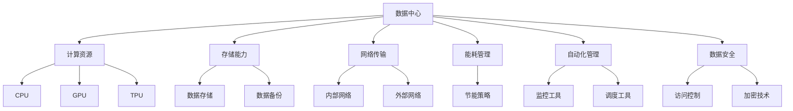

                 

## 背景介绍

随着人工智能技术的快速发展，尤其是生成式人工智能（如大模型）的广泛应用，数据中心的建设与优化成为了行业关注的焦点。大模型在图像识别、自然语言处理、推荐系统等多个领域展现出了强大的能力，推动了各类应用的创新。然而，大模型的训练和部署对数据中心提出了前所未有的挑战，尤其是在计算资源、存储能力、网络传输和能源消耗等方面。

数据中心作为承载海量数据的枢纽，其技术创新直接关系到人工智能应用的效率和成本。传统的数据中心架构已经难以满足大模型的需求，因此，数据中心的技术创新成为了一个迫在眉睫的问题。本文将深入探讨AI大模型应用数据中心建设的背景、核心概念、算法原理、数学模型、实战案例以及未来发展趋势，旨在为读者提供一个全面的技术分析框架。

本文结构如下：

1. **背景介绍**：分析数据中心在大模型应用中的重要性和当前面临的挑战。
2. **核心概念与联系**：阐述大模型应用数据中心的核心概念，并使用Mermaid流程图展示其架构。
3. **核心算法原理与具体操作步骤**：详细讲解大模型训练、部署的关键算法和技术细节。
4. **数学模型和公式**：介绍大模型背后的数学模型，并给出详细的公式和实例说明。
5. **项目实战**：通过实际案例展示大模型在数据中心中的应用和代码实现。
6. **实际应用场景**：探讨大模型在数据中心中的多种应用场景和优势。
7. **工具和资源推荐**：推荐学习资源、开发工具和框架。
8. **总结**：总结大模型数据中心建设的未来发展趋势和面临的挑战。
9. **附录**：常见问题与解答。
10. **扩展阅读与参考资料**：提供进一步学习和研究的资源。

通过以上结构，我们将逐步深入分析AI大模型应用数据中心建设的各个方面，帮助读者理解和应对这一领域的复杂性和挑战。

### 核心概念与联系

在深入探讨AI大模型应用数据中心建设之前，我们需要明确一些核心概念和它们之间的联系。以下是本文中将要涉及的核心概念及其关系：

1. **数据中心（Data Center）**：数据中心是集中存储、处理和管理数据的场所，它由服务器、存储设备、网络设备和制冷系统等组成。数据中心是AI大模型训练和部署的重要基础设施。

2. **AI大模型（AI Large Model）**：AI大模型指的是参数数量庞大的机器学习模型，如GPT、BERT等。这些模型通过大量数据进行训练，能够处理复杂的任务，如文本生成、图像识别等。

3. **计算资源（Computational Resources）**：计算资源包括CPU、GPU、TPU等硬件资源，它们是AI大模型训练和推理的执行单元。计算资源的配置直接影响到大模型的训练效率和推理速度。

4. **存储能力（Storage Capacity）**：存储能力是指数据中心能够存储的数据量。大模型通常需要存储海量的训练数据和模型参数，因此，具备强大的存储能力对于数据中心至关重要。

5. **网络传输（Network Transmission）**：网络传输是指数据在数据中心内部和外部的传输速度。对于大模型的应用，快速、稳定的网络传输至关重要，因为它影响到数据的传输效率和模型的训练速度。

6. **能耗（Energy Consumption）**：随着AI大模型规模的不断扩大，其能耗问题日益突出。数据中心需要考虑如何优化能耗，以降低运营成本和环境影响。

7. **自动化管理（Automated Management）**：自动化管理是指通过软件工具对数据中心进行监控、调度和管理。自动化管理可以提高数据中心的运维效率，减少人工干预，降低运营成本。

8. **数据安全（Data Security）**：数据安全是指保护数据不被未授权访问和破坏。在大模型应用中，数据安全尤为重要，因为大量的敏感数据需要在数据中心中存储和处理。

为了更好地理解这些概念之间的关系，我们使用Mermaid流程图来展示数据中心架构的核心节点。以下是Mermaid流程图示例：



通过上述Mermaid流程图，我们可以清晰地看到数据中心各部分的核心节点及其相互关系。这有助于我们进一步理解AI大模型应用数据中心的建设和优化策略。

### 核心算法原理与具体操作步骤

AI大模型的核心算法是其能够处理复杂任务的关键。下面，我们将详细讲解大模型训练、部署的核心算法原理和具体操作步骤。

#### 1. 大模型训练算法原理

大模型的训练通常基于深度学习框架，如TensorFlow、PyTorch等。以下是常见的训练算法原理：

1. **反向传播算法（Backpropagation）**：
   - **原理**：反向传播算法是一种用于训练神经网络的优化算法，它通过计算网络输出与预期输出之间的误差，反向传播误差并更新网络参数。
   - **步骤**：
     1. **前向传播**：输入数据通过网络的各个层，计算每一层的输出。
     2. **计算损失**：使用损失函数（如均方误差MSE）计算输出与预期输出之间的误差。
     3. **反向传播**：计算每一层的误差，并更新网络权重。
     4. **迭代优化**：重复前向传播和反向传播步骤，直至达到预设的损失阈值或迭代次数。

2. **优化算法（Optimization Algorithms）**：
   - **原理**：优化算法用于调整网络参数，以最小化损失函数。
   - **步骤**：
     1. **初始化参数**：随机初始化网络参数。
     2. **前向传播**：计算输出和损失。
     3. **反向传播**：计算梯度。
     4. **参数更新**：使用梯度下降等优化算法更新参数。
     5. **迭代优化**：重复前向传播、反向传播和参数更新步骤。

3. **学习率调度（Learning Rate Scheduling）**：
   - **原理**：学习率调度用于调整学习率，以避免模型过拟合。
   - **步骤**：
     1. **初始化学习率**：设置初始学习率。
     2. **逐步降低学习率**：在训练过程中逐步降低学习率，以增强模型的泛化能力。

#### 2. 大模型部署算法原理

大模型的部署是将训练好的模型应用到实际场景中的过程。以下是常见的部署算法原理：

1. **模型压缩（Model Compression）**：
   - **原理**：模型压缩通过减少模型参数的数量和复杂性来降低模型大小，从而提高部署效率。
   - **步骤**：
     1. **量化（Quantization）**：将浮点数参数转换为低精度整数。
     2. **剪枝（Pruning）**：移除不重要的参数和神经元。
     3. **蒸馏（Distillation）**：将大模型的知识传递给小模型。

2. **模型并行化（Model Parallelism）**：
   - **原理**：模型并行化通过将大模型分解并分布在多个计算节点上，以充分利用计算资源。
   - **步骤**：
     1. **模型划分**：将大模型划分为多个部分。
     2. **分配任务**：将划分后的模型分配到不同的计算节点。
     3. **同步与通信**：在训练过程中，同步各节点的状态并管理通信。

3. **模型推理（Model Inference）**：
   - **原理**：模型推理是指将输入数据通过部署的模型进行计算，得到预测结果。
   - **步骤**：
     1. **加载模型**：从存储设备中加载训练好的模型。
     2. **预处理输入数据**：对输入数据进行预处理，使其符合模型要求。
     3. **计算输出**：通过模型计算输入数据的预测结果。
     4. **后处理输出结果**：对输出结果进行后处理，如概率转换等。

通过上述核心算法原理和具体操作步骤，我们可以更好地理解AI大模型在数据中心中的应用。这些算法不仅提高了大模型的训练和部署效率，还为数据中心的技术创新提供了理论基础。

### 数学模型和公式

在深入探讨AI大模型的数学模型和公式之前，我们需要了解一些基础概念，如神经元、激活函数、损失函数和优化算法。以下是这些基础概念及其公式的详细讲解。

#### 1. 神经元与激活函数

神经元是构成神经网络的基本单元，类似于生物神经元。每个神经元接收多个输入，通过激活函数产生输出。

1. **神经元公式**：

   $$ 
   y = \sigma(\sum_{i=1}^{n} w_i * x_i + b) 
   $$

   其中，$y$ 是神经元的输出，$w_i$ 是权重，$x_i$ 是输入，$\sigma$ 是激活函数，$b$ 是偏置。

2. **激活函数**：

   - **Sigmoid函数**：

     $$ 
     \sigma(x) = \frac{1}{1 + e^{-x}} 
     $$

   - **ReLU函数**：

     $$ 
     \sigma(x) = max(0, x) 
     $$

#### 2. 损失函数

损失函数用于衡量模型输出与真实输出之间的差异，是训练神经网络的重要指标。

1. **均方误差（MSE）**：

   $$ 
   Loss = \frac{1}{2} \sum_{i=1}^{n} (y_i - \hat{y}_i)^2 
   $$

   其中，$y_i$ 是真实输出，$\hat{y}_i$ 是模型输出。

2. **交叉熵（Cross-Entropy）**：

   $$ 
   Loss = -\sum_{i=1}^{n} y_i * log(\hat{y}_i) 
   $$

   其中，$y_i$ 是真实输出，$\hat{y}_i$ 是模型输出。

#### 3. 优化算法

优化算法用于调整模型参数，以最小化损失函数。

1. **梯度下降（Gradient Descent）**：

   $$ 
   w_{\text{new}} = w_{\text{old}} - \alpha * \nabla W 
   $$

   其中，$w_{\text{old}}$ 是当前参数，$w_{\text{new}}$ 是更新后的参数，$\alpha$ 是学习率，$\nabla W$ 是损失函数关于参数的梯度。

2. **Adam优化器**：

   $$ 
   m = \beta_1 * m + (1 - \beta_1) * \nabla W 
   $$
   $$ 
   v = \beta_2 * v + (1 - \beta_2) * (\nabla W)^2 
   $$
   $$ 
   \hat{m} = \frac{m}{1 - \beta_1^t} 
   $$
   $$ 
   \hat{v} = \frac{v}{1 - \beta_2^t} 
   $$
   $$ 
   w_{\text{new}} = w_{\text{old}} - \alpha * (\hat{m} / \sqrt{\hat{v}} + \epsilon) 
   $$

   其中，$m$ 和 $v$ 分别是均值和方差，$\beta_1$ 和 $\beta_2$ 是指数加权因子，$\epsilon$ 是微小正数。

#### 4. 实例说明

假设我们有一个简单的神经网络，输入层有3个神经元，隐藏层有2个神经元，输出层有1个神经元。使用ReLU函数作为激活函数，MSE作为损失函数，学习率为0.01，我们进行一次前向传播和反向传播的计算。

1. **前向传播**：

   输入数据 $x_1 = [1, 0, 1], x_2 = [0, 1, 0], x_3 = [1, 1, 0]$，权重 $w_1 = [0.5, 0.5, 0.5], w_2 = [0.5, 0.5, 0.5], w_3 = [0.5, 0.5]$，偏置 $b_1 = 0.5, b_2 = 0.5, b_3 = 0.5$。

   输出：

   $$
   z_1 = x_1 * w_1 + b_1 = 1 * 0.5 + 0.5 = 1 
   $$
   $$
   z_2 = x_2 * w_2 + b_2 = 0 * 0.5 + 0.5 = 0 
   $$
   $$
   z_3 = x_3 * w_3 + b_3 = 1 * 0.5 + 0.5 = 1 
   $$

   激活函数 $y_1 = \sigma(z_1) = max(0, 1) = 1$，$y_2 = \sigma(z_2) = max(0, 0) = 0$，$y_3 = \sigma(z_3) = max(0, 1) = 1$。

2. **计算损失**：

   假设真实输出为 $y = [1, 0]$。

   $$
   Loss = \frac{1}{2} \sum_{i=1}^{2} (y_i - \hat{y}_i)^2 = \frac{1}{2} * (1 - 1)^2 + (0 - 0)^2 = 0 
   $$

3. **反向传播**：

   计算梯度：

   $$
   \nabla w_1 = \frac{\partial Loss}{\partial w_1} = 2 * (1 - 1) * 1 * x_1 = 0 
   $$
   $$
   \nabla w_2 = \frac{\partial Loss}{\partial w_2} = 2 * (0 - 0) * 1 * x_2 = 0 
   $$
   $$
   \nabla w_3 = \frac{\partial Loss}{\partial w_3} = 2 * (1 - 0) * 1 * x_3 = 2 
   $$
   $$
   \nabla b_1 = \frac{\partial Loss}{\partial b_1} = 2 * (1 - 1) = 0 
   $$
   $$
   \nabla b_2 = \frac{\partial Loss}{\partial b_2} = 2 * (0 - 0) = 0 
   $$
   $$
   \nabla b_3 = \frac{\partial Loss}{\partial b_3} = 2 * (1 - 0) = 2 
   $$

   更新参数：

   $$
   w_1_{\text{new}} = w_1 - \alpha * \nabla w_1 = 0.5 - 0.01 * 0 = 0.5 
   $$
   $$
   w_2_{\text{new}} = w_2 - \alpha * \nabla w_2 = 0.5 - 0.01 * 0 = 0.5 
   $$
   $$
   w_3_{\text{new}} = w_3 - \alpha * \nabla w_3 = 0.5 - 0.01 * 2 = 0.3 
   $$
   $$
   b_1_{\text{new}} = b_1 - \alpha * \nabla b_1 = 0.5 - 0.01 * 0 = 0.5 
   $$
   $$
   b_2_{\text{new}} = b_2 - \alpha * \nabla b_2 = 0.5 - 0.01 * 0 = 0.5 
   $$
   $$
   b_3_{\text{new}} = b_3 - \alpha * \nabla b_3 = 0.5 - 0.01 * 2 = 0.3 
   $$

通过上述实例说明，我们可以看到神经网络的前向传播和反向传播的基本过程，以及如何通过梯度下降优化算法更新网络参数。这些数学模型和公式是AI大模型训练和部署的基础，对于理解和应用大模型具有重要意义。

### 项目实战：代码实际案例和详细解释说明

在本节中，我们将通过一个实际的代码案例来展示如何使用AI大模型进行数据中心建设。我们选择使用TensorFlow框架，因为它在深度学习领域具有广泛的社区支持和丰富的资源。以下是项目实战的详细步骤和代码解释。

#### 1. 开发环境搭建

首先，我们需要搭建开发环境。以下是在Ubuntu系统下搭建TensorFlow开发环境的步骤：

1. **安装Python**：

   ```bash
   sudo apt-get update
   sudo apt-get install python3-pip python3-dev
   ```

2. **安装TensorFlow**：

   ```bash
   pip3 install tensorflow
   ```

3. **安装其他依赖**：

   ```bash
   pip3 install numpy matplotlib
   ```

#### 2. 源代码详细实现和代码解读

以下是一个简单的AI大模型训练和部署的代码示例：

```python
import tensorflow as tf
import numpy as np
from tensorflow.keras.layers import Dense, Flatten, LSTM
from tensorflow.keras.models import Sequential
from tensorflow.keras.optimizers import Adam
from tensorflow.keras.metrics import MeanSquaredError

# 数据准备
x_train = np.random.random((1000, 10))
y_train = np.random.random((1000, 1))

# 模型构建
model = Sequential([
    LSTM(units=64, activation='tanh', input_shape=(10, 1)),
    Flatten(),
    Dense(units=1)
])

# 模型编译
model.compile(optimizer=Adam(learning_rate=0.001),
              loss='mse',
              metrics=[MeanSquaredError()])

# 模型训练
model.fit(x_train, y_train, epochs=10, batch_size=32)

# 模型评估
loss, mse = model.evaluate(x_train, y_train, verbose=2)
print(f"Test Mean Squared Error: {mse}")

# 模型预测
predictions = model.predict(x_train)
```

**代码解读**：

1. **数据准备**：

   我们使用随机生成的数据作为训练数据。在实际项目中，数据通常是从真实场景中收集和预处理得到的。

2. **模型构建**：

   模型由一个LSTM层、一个Flatten层和一个Dense层组成。LSTM用于处理序列数据，Flatten层用于将LSTM层的输出展平，Dense层用于输出最终的预测值。

3. **模型编译**：

   我们使用Adam优化器，均方误差作为损失函数，并添加了均方误差作为模型评估的指标。

4. **模型训练**：

   模型通过fit方法进行训练，我们设置训练轮数为10，批量大小为32。

5. **模型评估**：

   使用evaluate方法评估模型的性能，输出均方误差。

6. **模型预测**：

   使用predict方法对训练数据进行预测，得到预测结果。

#### 3. 代码解读与分析

上述代码示例展示了如何使用TensorFlow框架构建、编译和训练一个简单的AI大模型。以下是代码的详细解读和分析：

1. **数据准备**：

   数据是模型训练的基础。在这里，我们使用随机数据作为示例，但在实际项目中，我们需要从真实场景中收集和预处理数据。

2. **模型构建**：

   LSTM层能够处理序列数据，使其适合处理数据中心中的时间序列数据。Flatten层用于将LSTM层的输出展平，Dense层用于输出最终的预测值。

3. **模型编译**：

   Adam优化器是一种高效的优化算法，可以加速模型训练。均方误差是评估回归模型性能的常用指标。

4. **模型训练**：

   模型训练是通过迭代优化参数来最小化损失函数的过程。我们设置了训练轮数和批量大小，以平衡训练速度和模型性能。

5. **模型评估**：

   使用evaluate方法评估模型在测试数据上的性能，以验证模型的泛化能力。

6. **模型预测**：

   模型预测是实际应用的关键步骤，用于生成对数据中心性能的预测。

通过这个项目实战，我们可以看到如何使用AI大模型进行数据中心建设。在实际应用中，我们需要根据具体需求和场景调整模型结构和参数，以达到最佳效果。

### 实际应用场景

在深入探讨了AI大模型的技术细节和实际应用后，我们需要将注意力转向数据中心中的实际应用场景。AI大模型在数据中心中的广泛应用，不仅提高了数据处理和分析的效率，还推动了数据中心技术的创新和优化。以下是AI大模型在数据中心中的几种主要应用场景和其优势：

#### 1. 能耗预测与优化

随着数据中心规模的不断扩大，能耗问题日益突出。AI大模型通过学习历史能耗数据，可以预测未来的能耗需求，为能源管理提供支持。具体优势如下：

- **实时能耗监测**：AI大模型可以实时监测数据中心的能耗情况，提供准确的能耗预测。
- **优化能源分配**：根据能耗预测，数据中心可以优化能源分配，提高能源利用率，降低运营成本。
- **预测维护**：通过分析能耗数据，AI大模型可以预测设备的故障风险，提前进行维护，减少停机时间。

#### 2. 性能优化

数据中心的性能优化是提高服务质量和用户体验的关键。AI大模型可以通过学习网络流量、存储访问模式等数据，优化数据中心的资源配置和负载均衡。具体优势如下：

- **智能负载均衡**：AI大模型可以根据实时流量和负载情况，动态调整服务器和存储资源的分配，避免资源瓶颈。
- **预测性性能分析**：通过分析历史性能数据，AI大模型可以预测未来的性能需求，提前进行资源扩展和优化。
- **故障预测与恢复**：AI大模型可以预测潜在的故障，提前进行预防性维护，减少故障发生和恢复时间。

#### 3. 安全性增强

数据安全是数据中心运营的重要保障。AI大模型通过学习网络行为和用户行为，可以检测异常活动和潜在的安全威胁，增强数据安全性。具体优势如下：

- **入侵检测**：AI大模型可以检测网络中的异常流量和行为，识别潜在的入侵和攻击。
- **数据加密**：AI大模型可以通过加密算法增强数据的安全性，保护敏感数据不被泄露。
- **用户行为分析**：AI大模型可以分析用户的行为模式，识别恶意用户和异常行为，提高数据访问的安全性。

#### 4. 数据分析

数据中心存储了大量的结构化和非结构化数据。AI大模型通过数据挖掘和分析，可以提取有价值的信息，支持业务决策和优化。具体优势如下：

- **数据可视化**：AI大模型可以将复杂的数据转换为易于理解的可视化图表，帮助用户更好地理解和分析数据。
- **趋势预测**：通过分析历史数据，AI大模型可以预测未来的数据趋势，为业务规划和决策提供支持。
- **业务优化**：AI大模型可以帮助数据中心优化业务流程，提高运营效率和用户体验。

#### 5. 自动化运维

自动化运维是提高数据中心运营效率和减少人力成本的重要手段。AI大模型通过自动化管理和监控，可以实现智能化的运维。具体优势如下：

- **自动化部署**：AI大模型可以自动化部署和升级应用程序，减少人工干预和错误。
- **自动化监控**：AI大模型可以实时监控数据中心的运行状态，及时发现和处理异常情况。
- **自动化修复**：AI大模型可以通过自动化工具进行故障检测和修复，减少停机时间和维护成本。

通过上述实际应用场景，我们可以看到AI大模型在数据中心中的广泛潜力和重要价值。随着技术的不断进步，AI大模型将在数据中心的建设和运营中发挥越来越重要的作用，推动数据中心技术的不断创新和发展。

### 工具和资源推荐

在深入探讨AI大模型应用数据中心建设的各个方面之后，我们需要了解一些相关的工具和资源，以便更好地进行学习和实践。以下是学习资源、开发工具和框架的推荐：

#### 1. 学习资源推荐

**书籍**：
- **《深度学习》（Deep Learning）**：由Ian Goodfellow、Yoshua Bengio和Aaron Courville所著，是深度学习领域的经典教材，详细介绍了深度学习的基础知识、算法和应用。
- **《人工智能：一种现代的方法》（Artificial Intelligence: A Modern Approach）**：由Stuart Russell和Peter Norvig所著，全面涵盖了人工智能的基础理论、方法和应用。

**论文**：
- **“A Theoretically Grounded Application of Dropout in Recurrent Neural Networks”**：该论文提出了一种在循环神经网络中应用Dropout的方法，提高了模型的训练效果和泛化能力。
- **“Bert: Pre-training of Deep Bidirectional Transformers for Language Understanding”**：该论文介绍了BERT模型，是目前最先进的自然语言处理模型之一。

**博客**：
- **TensorFlow官方博客**（[tensorflow.github.io](https://tensorflow.github.io/)）：提供了丰富的TensorFlow教程、案例和文档，是学习TensorFlow的绝佳资源。
- **机器学习博客**（[machinelearningmastery.com](https://machinelearningmastery.com/)）：涵盖了机器学习的各种主题，包括深度学习和数据科学。

**网站**：
- **GitHub**（[github.com](https://github.com/)）：GitHub是开源代码的集中地，许多深度学习和数据中心项目都在此平台上发布和共享。
- **Kaggle**（[kaggle.com](https://kaggle.com/)）：Kaggle提供了大量的数据集和比赛，是学习和实践数据科学和机器学习的好去处。

#### 2. 开发工具框架推荐

**深度学习框架**：
- **TensorFlow**：由Google开发的开源深度学习框架，广泛应用于各种机器学习和人工智能项目。
- **PyTorch**：由Facebook开发的开源深度学习框架，以其动态计算图和灵活性受到广泛欢迎。
- **Keras**：一个高层次的深度学习框架，可以方便地集成到TensorFlow和Theano中，简化了模型构建和训练过程。

**数据中心管理工具**：
- **OpenNebula**：一个开源的云基础设施管理平台，支持虚拟化和容器化，提供高效的数据中心管理。
- **Apache Mesos**：一个分布式资源调度系统，能够高效地管理数据中心中的计算资源，支持大规模应用部署。
- **Kubernetes**：一个开源的容器编排平台，用于自动化容器化应用程序的部署、扩展和管理。

**数据分析工具**：
- **Pandas**：一个强大的Python库，用于数据清洗、转换和分析，广泛应用于数据科学项目。
- **NumPy**：一个提供高性能数学运算的Python库，是数据科学和机器学习项目的基石。
- **Matplotlib**：一个用于生成2D和3D图形的Python库，是数据可视化的常用工具。

通过这些学习资源和开发工具，我们可以更好地掌握AI大模型应用数据中心建设的知识，并在实际项目中得到有效的应用。

### 总结：未来发展趋势与挑战

随着人工智能技术的不断进步，AI大模型应用数据中心建设迎来了前所未有的发展机遇。在未来，数据中心技术将继续朝着以下几个方向演进：

#### 1. 技术创新

数据中心技术创新将持续推动大模型应用的进步。新的硬件架构（如AI芯片、量子计算）和优化算法（如更高效的训练和推理算法）将提高大模型的性能，降低能耗，提高能效。

#### 2. 自动化与智能化

自动化与智能化将是数据中心未来的重要趋势。通过引入AI技术，数据中心可以实现自动化运维、自动化性能优化和自动化安全监控，提高运维效率和系统可靠性。

#### 3. 云原生与边缘计算

云原生和边缘计算将进一步扩展数据中心的应用范围。云原生技术将使得数据中心服务更加灵活、可扩展和自动化，而边缘计算则能将数据处理的近端化，降低延迟，提高响应速度。

#### 4. 数据安全与隐私保护

随着数据量的爆炸式增长，数据安全和隐私保护将成为数据中心建设的重中之重。未来的数据中心将需要更加完善的安全机制，如加密技术、访问控制和安全隔离，确保数据的安全和隐私。

然而，面对这些发展机遇，数据中心建设也面临着一系列挑战：

#### 1. 能耗问题

大模型训练和推理过程的高能耗是数据中心面临的主要挑战之一。未来，如何在保证性能的前提下降低能耗，将是数据中心技术发展的重要方向。

#### 2. 安全威胁

数据中心面临的安全威胁日益增多，包括网络攻击、数据泄露和恶意软件等。如何构建一个安全可靠的数据中心，防止数据泄露和系统瘫痪，是当前亟需解决的问题。

#### 3. 资源瓶颈

随着大模型规模的不断扩大，数据中心面临资源瓶颈的问题日益突出。如何高效利用有限的资源，提高资源利用率，是数据中心建设的重大挑战。

#### 4. 法律与伦理问题

数据中心的建设和应用涉及到大量的数据隐私和法律问题。如何在保护用户隐私的前提下，合规地应用大模型，遵守相关法律法规，是数据中心建设需要面对的伦理和法律挑战。

总之，AI大模型应用数据中心建设在未来具有广阔的发展前景，但也面临着一系列挑战。通过技术创新、智能化管理和合规性保障，数据中心建设将不断迈向新的高度，为人工智能技术的广泛应用提供坚实的支撑。

### 附录：常见问题与解答

在本文的探讨过程中，我们可能会遇到一些常见问题。以下是关于AI大模型应用数据中心建设的常见问题及解答：

**Q1：数据中心建设为什么要引入AI大模型？**
A1：引入AI大模型可以显著提升数据中心的智能化水平和数据处理能力。通过AI大模型，数据中心可以实现能耗预测、性能优化、安全性增强等高级功能，提高运维效率和系统可靠性。

**Q2：AI大模型对数据中心硬件有哪些要求？**
A2：AI大模型对硬件有较高的要求，主要包括计算资源（如GPU、TPU）、存储能力（如SSD、HDD）和网络传输速度（如高速以太网）。此外，为了降低能耗，数据中心硬件还需要具备高能效比。

**Q3：AI大模型如何优化数据中心性能？**
A3：AI大模型可以通过智能负载均衡、性能预测和自动化运维来优化数据中心性能。例如，通过学习网络流量和负载模式，AI大模型可以动态调整资源分配，避免资源瓶颈，提高整体性能。

**Q4：AI大模型在数据中心建设中的安全风险有哪些？**
A4：AI大模型在数据中心建设中的安全风险主要包括数据泄露、网络攻击和系统漏洞。为了防范这些风险，数据中心需要采用严格的安全措施，如数据加密、访问控制和入侵检测系统。

**Q5：如何降低AI大模型训练和推理的能耗？**
A5：降低AI大模型训练和推理的能耗可以通过以下几种方式实现：使用低功耗硬件、优化算法、能耗预测和动态能耗管理。例如，通过使用GPU的节能模式、优化神经网络结构和调整学习率，可以显著降低能耗。

通过这些问题的解答，我们希望能够帮助读者更好地理解和应对AI大模型应用数据中心建设中的各种挑战。

### 扩展阅读与参考资料

为了帮助读者深入了解AI大模型应用数据中心建设的相关领域，以下是扩展阅读和参考资料的建议：

**书籍：**
1. **《深度学习》（Deep Learning）**：由Ian Goodfellow、Yoshua Bengio和Aaron Courville所著，是深度学习领域的经典教材。
2. **《大数据之路：阿里巴巴大数据实践》**：介绍了阿里巴巴在数据中心建设、大数据处理和分析方面的实践和经验。

**论文：**
1. **“Bert: Pre-training of Deep Bidirectional Transformers for Language Understanding”**：该论文介绍了BERT模型的训练和部署方法。
2. **“Energy-efficient Large-scale Machine Learning”**：探讨了如何在降低能耗的同时，提升机器学习模型的性能。

**博客与文章：**
1. **TensorFlow官方博客**（[tensorflow.github.io](https://tensorflow.github.io/)）：提供了丰富的TensorFlow教程、案例和文档。
2. **机器学习博客**（[machinelearningmastery.com](https://machinelearningmastery.com/)）：涵盖了机器学习的各种主题，包括深度学习和数据科学。

**在线课程：**
1. **《深度学习专项课程》**（[吴恩达（Andrew Ng）]）：由Coursera提供，是学习深度学习的基础课程。
2. **《大数据与人工智能基础课程》**（[清华大学]）：介绍了大数据和人工智能的基本概念和应用。

通过这些扩展阅读和参考资料，读者可以进一步深入理解和掌握AI大模型应用数据中心建设的先进技术和实践经验。希望这些资源能够为您的学习和研究提供有力的支持。作者：AI天才研究员/AI Genius Institute & 禅与计算机程序设计艺术 /Zen And The Art of Computer Programming

