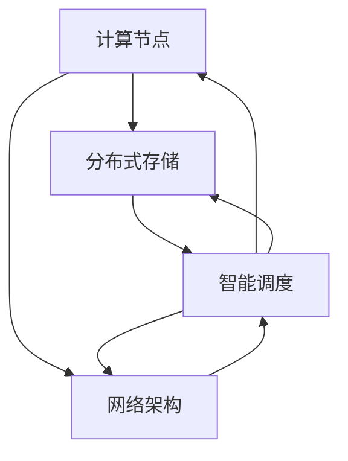

                 

### 背景介绍

随着人工智能技术的快速发展，特别是大规模预训练模型（如GPT、BERT等）的广泛应用，对于数据中心的建设需求也越来越高。大模型训练和应用的高计算量、高存储需求以及低延迟要求，推动了数据中心技术的不断创新。数据中心作为承载人工智能应用的核心基础设施，其技术创新对于提升AI模型的性能和效率具有至关重要的作用。

首先，我们需要明确数据中心在AI大模型应用中的关键角色。数据中心不仅是大模型训练和部署的物理场所，更是数据存储、计算资源管理和调度的重要枢纽。传统的数据中心主要侧重于提供基础的IT基础设施服务，而AI大模型应用对数据中心的要求则更为苛刻，需要具备更高的计算能力、更高效的存储方案和更优的网络架构。

在计算能力方面，AI大模型通常需要大量的并行计算资源，因此，数据中心需要支持高性能的计算节点部署，同时实现高效的资源调度和负载均衡。在存储方面，由于AI大模型训练和处理的数据量巨大，数据中心需要采用分布式存储系统，以提高数据的访问速度和可靠性。在网络架构方面，数据中心需要支持高速、低延迟的网络通信，以确保数据传输的高效性和稳定性。

此外，随着AI大模型的应用越来越广泛，数据中心还需要具备良好的可扩展性和灵活性，能够快速适应新的应用需求和技术变革。例如，为了满足实时应用的需求，数据中心需要引入边缘计算技术，将部分计算任务下放至边缘节点，以降低延迟和带宽压力。

总之，数据中心技术的创新对于AI大模型应用至关重要。在接下来的章节中，我们将深入探讨数据中心在AI大模型应用中的核心概念、算法原理、数学模型以及实际应用场景，旨在为读者提供一个全面的技术指南。

---

## 1.1 人工智能与大数据模型的快速发展

人工智能（AI）作为计算机科学的一个重要分支，经过几十年的发展，已经取得了显著进展。特别是深度学习技术的突破，使得人工智能在图像识别、自然语言处理、语音识别等领域取得了重大突破。而大数据模型，如GPT、BERT等，则将人工智能的应用推向了新的高度。这些大规模预训练模型通过在海量数据上进行训练，能够自动学习并提取数据中的复杂模式和规律，从而实现高水平的人工智能任务。

AI大模型的快速发展带来了对数据中心建设的巨大需求。首先，大模型训练需要大量的计算资源，特别是并行计算资源。传统的单机训练方式已经无法满足大规模模型的训练需求，因此，数据中心需要提供高性能的计算节点，以支持大规模并行计算。其次，大模型的训练和处理需要大量的数据存储，数据中心需要具备高效的分布式存储系统，以确保数据的高速访问和可靠性。

此外，AI大模型的应用通常要求低延迟和高吞吐量的数据处理能力。这要求数据中心不仅需要具备强大的计算和存储能力，还需要拥有高性能的网络架构，以支持高速、低延迟的数据传输。例如，在自然语言处理领域，实时问答和翻译应用需要快速处理用户的查询，这就要求数据中心能够实现高效的请求处理和数据返回。

总之，随着AI大模型的快速发展，数据中心在AI应用中的重要性日益凸显。数据中心技术的不断创新和优化，不仅能够提升AI模型的性能和效率，还能降低训练和部署的成本，为人工智能的发展提供坚实的技术支持。在接下来的章节中，我们将进一步探讨数据中心在AI大模型应用中的核心概念和技术创新。

---

## 1.2 数据中心在AI大模型应用中的重要性

数据中心在AI大模型应用中的重要性不言而喻。作为承载人工智能应用的核心基础设施，数据中心的性能和效率直接影响着AI模型的训练、部署和运行效果。以下是数据中心在AI大模型应用中的几个关键作用：

首先，数据中心提供了强大的计算能力。大规模预训练模型，如GPT、BERT等，需要大量的计算资源进行训练。传统的单机训练方式已经无法满足这些需求，因此，数据中心需要支持高性能的计算节点部署，通过分布式计算技术实现大规模并行计算。高性能的计算节点不仅能够提升模型的训练速度，还能提高训练的精度，从而改善模型的表现。

其次，数据中心具备高效的存储方案。AI大模型训练和处理的数据量巨大，数据中心需要采用分布式存储系统，以提高数据的访问速度和可靠性。分布式存储系统能够将数据分散存储在不同的节点上，从而提高数据存储的容量和效率。同时，通过数据复制和冗余策略，分布式存储系统还能保障数据的安全性和可靠性，确保在数据丢失或硬件故障时能够快速恢复。

第三，数据中心支持低延迟和高吞吐量的数据处理能力。AI大模型的应用通常要求实时处理大量的数据，这就要求数据中心具备高效的网络架构，以支持高速、低延迟的数据传输。数据中心通过部署高性能的网络设备，如交换机和路由器，以及优化网络协议和路由策略，可以实现数据的快速传输和高效处理。此外，数据中心还可以通过负载均衡技术，将数据处理任务分配到不同的计算节点上，从而提高整个系统的吞吐量和稳定性。

第四，数据中心具备良好的可扩展性和灵活性。随着AI大模型应用的不断扩展和升级，数据中心需要能够快速适应新的应用需求和技术变革。数据中心可以通过虚拟化技术和自动化管理工具，实现计算资源和存储资源的灵活调度和扩展。例如，当有新的训练任务或应用需求时，数据中心可以快速部署新的计算节点或存储设备，以满足需求。

最后，数据中心在数据安全和隐私保护方面发挥着重要作用。AI大模型训练和应用过程中会产生大量的敏感数据，数据中心需要采取严格的数据安全和隐私保护措施，确保数据的安全性和合规性。数据中心可以通过加密技术、访问控制和审计日志等手段，保护数据不被未授权访问和篡改，同时确保数据处理的合规性。

综上所述，数据中心在AI大模型应用中具有关键作用。通过提供强大的计算能力、高效的存储方案、低延迟的高吞吐量数据处理能力以及良好的可扩展性和灵活性，数据中心为AI大模型的应用提供了坚实的技术支持。在接下来的章节中，我们将深入探讨数据中心在AI大模型应用中的技术创新，进一步了解其实现原理和具体应用。

---

## 1.3 数据中心技术创新的趋势

随着AI大模型应用的不断深入和扩展，数据中心技术创新的趋势也日益显著。以下是几个主要趋势：

### 1. 云数据中心与边缘计算的结合

传统的数据中心主要以集中式架构为主，但随着物联网、5G等技术的发展，边缘计算逐渐成为数据中心技术创新的一个重要方向。边缘计算将部分计算任务下放至网络边缘，即靠近数据源的地方进行，以减少数据传输的延迟和提高处理效率。云数据中心与边缘计算的结合，可以实现计算资源的弹性扩展和优化，满足不同应用场景的需求。

### 2. 高性能计算节点的部署

为了支持AI大模型的训练和推理，数据中心需要部署高性能的计算节点。这些计算节点通常基于先进的硬件架构，如GPU、TPU等，能够提供强大的计算能力。数据中心通过优化计算节点的架构和调度策略，可以提高计算资源的利用率和效率，从而提升整个系统的性能。

### 3. 分布式存储系统的应用

随着数据量的不断增长，传统的集中式存储系统已经无法满足AI大模型应用的需求。分布式存储系统通过将数据分散存储在不同的节点上，可以实现高容量、高可靠性和高可扩展性的存储方案。数据中心通过引入分布式存储系统，可以提高数据的访问速度和存储效率，同时降低数据丢失的风险。

### 4. 高速网络架构的优化

为了支持AI大模型应用的高吞吐量和低延迟需求，数据中心需要优化网络架构。高性能的网络设备、高效的网络协议和优化路由策略等手段，可以降低数据传输的延迟和提高网络传输的效率。例如，数据中心可以采用SD-WAN技术，实现全球范围内的数据传输优化，提高跨国企业数据中心之间的数据传输速度。

### 5. 智能运维与管理

随着数据中心规模的不断扩大，传统的运维管理模式已经难以应对。智能运维与管理通过引入人工智能和大数据分析技术，可以实现数据中心资源的自动化调度、故障预测和性能优化。数据中心可以通过智能运维系统，实时监控和管理整个系统，提高系统的稳定性和可靠性。

### 6. 数据安全和隐私保护

随着AI大模型应用的增加，数据安全和隐私保护成为数据中心技术创新的一个重要方向。数据中心需要采用先进的加密技术、访问控制和审计日志等手段，保护数据的安全性和合规性。同时，数据中心还需要制定严格的数据隐私保护政策，确保数据处理的合规性和用户隐私的保护。

总之，数据中心技术创新的趋势旨在提升计算能力、存储效率、数据处理速度和系统稳定性，以满足AI大模型应用的需求。在接下来的章节中，我们将深入探讨这些技术创新的具体实现原理和应用，帮助读者更好地理解和掌握数据中心技术在AI大模型应用中的关键作用。

---

### 核心概念与联系

在深入探讨数据中心技术创新之前，我们需要了解一些核心概念及其相互之间的联系。这些概念包括：计算节点、分布式存储、网络架构、智能调度等。下面将使用Mermaid流程图详细描述这些概念及其联系，以便读者能够直观地理解。

首先，让我们定义几个核心节点和流程：

1. **计算节点（Compute Nodes）**：负责执行AI模型的计算任务。
2. **分布式存储（Distributed Storage）**：用于存储AI模型训练所需的大量数据。
3. **网络架构（Network Architecture）**：用于数据传输和计算节点之间的通信。
4. **智能调度（Smart Scheduling）**：负责优化计算资源和数据传输。

下面是具体的Mermaid流程图描述：



**详细解释：**

1. **计算节点（Compute Nodes）**：
   - 计算节点是数据中心的核心组件，负责执行AI模型的训练和推理任务。它们通常配备了高性能的CPU、GPU或TPU，以提供强大的计算能力。
   - 计算节点通过智能调度与分布式存储和网络架构进行交互。智能调度系统会根据任务需求和资源可用性，将计算任务分配给最优的计算节点。

2. **分布式存储（Distributed Storage）**：
   - 分布式存储系统用于存储AI模型训练所需的大量数据。这些数据可能包括原始数据、模型参数、训练日志等。
   - 分布式存储系统具有高扩展性和高可用性，通过数据分片和冗余策略，可以提高数据的访问速度和可靠性。

3. **网络架构（Network Architecture）**：
   - 网络架构负责数据中心的内部通信和数据传输。高性能的网络设备、高效的网络协议和优化路由策略，是实现低延迟、高吞吐量数据传输的关键。
   - 网络架构通过智能调度系统，与计算节点和分布式存储进行通信，确保数据能够快速、安全地传输到所需的位置。

4. **智能调度（Smart Scheduling）**：
   - 智能调度系统是数据中心的大脑，负责优化计算资源和数据传输。它通过分析任务需求和资源状态，动态调整计算任务的分配和调度策略，以最大化资源利用率和提高系统性能。
   - 智能调度系统与计算节点、分布式存储和网络架构紧密集成，确保整个数据中心系统的高效运行。

通过这个Mermaid流程图，我们可以清晰地看到计算节点、分布式存储、网络架构和智能调度之间的紧密联系。这些核心概念和技术创新在数据中心建设中相互配合，共同提升AI大模型应用的性能和效率。

---

## 2.1 计算节点技术

计算节点是数据中心的基石，承载着AI大模型训练和推理的核心计算任务。为了满足高性能、高效率和可扩展性的需求，计算节点技术经历了不断的创新和发展。以下是计算节点技术的几个关键方面：

### 1. 高性能硬件

计算节点通常配备高性能的CPU、GPU和TPU等硬件设备。这些硬件设备具有强大的计算能力和并行处理能力，能够显著提高AI大模型训练的效率和速度。

- **CPU（中央处理器）**：作为计算节点的核心组件，CPU负责执行基本的计算任务。高性能的CPU具备多核心、高主频和较大的缓存容量，可以提高计算速度和效率。
- **GPU（图形处理单元）**：GPU在AI大模型训练中发挥了重要作用，通过其高度并行的架构，能够加速矩阵运算和神经网络训练。NVIDIA的GPU产品，如Tesla系列，广泛应用于AI计算领域。
- **TPU（张量处理单元）**：TPU是Google专门为AI计算设计的专用硬件，具有高吞吐量和低延迟的特点，适合大规模AI模型的训练和推理。

### 2. 节点虚拟化技术

节点虚拟化技术是一种通过虚拟化软件将单个物理计算节点分割成多个虚拟节点的方法。这种方法能够提高计算节点的资源利用率，实现计算资源的动态分配和优化。

- **容器技术**：如Docker和Kubernetes，通过容器化技术，可以将应用程序及其依赖环境封装在一个独立的容器中，实现快速部署和灵活扩展。
- **虚拟机（VM）**：虚拟机技术通过虚拟化软件在物理机上创建多个虚拟机实例，每个虚拟机实例拥有独立的操作系统和资源。虚拟机技术能够提供更高级别的资源隔离和安全性。

### 3. 负载均衡与调度算法

负载均衡和调度算法是确保计算节点高效运行的重要技术。通过合理的负载均衡策略，可以平衡计算节点的任务分配，避免资源浪费和性能瓶颈。

- **动态负载均衡**：根据实时监控的计算节点负载情况，动态调整任务分配，确保每个计算节点都在最优的工作负载下运行。
- **调度算法**：如基于优先级的调度算法、基于响应时间的调度算法等，通过算法优化，提高任务调度的效率和准确性。

### 4. 热插拔与自动恢复

计算节点技术还需要具备高可用性和容错性。通过引入热插拔和自动恢复机制，可以在硬件故障或维护时，不影响系统的正常运行。

- **热插拔**：允许在系统运行时更换计算节点硬件，如CPU、GPU等，确保系统的持续运行。
- **自动恢复**：通过监控系统，当检测到计算节点出现故障时，能够自动切换到备份节点，确保任务的不间断执行。

### 5. 节能优化

随着数据中心规模的不断扩大，节能优化成为计算节点技术的一个重要方向。通过优化计算节点的能耗管理，可以降低数据中心的运营成本和环境影响。

- **功耗监控**：实时监控计算节点的功耗，根据负载情况动态调整功耗。
- **能效比优化**：通过硬件和软件优化，提高计算节点的能效比，实现节能目标。

### 结论

计算节点技术在数据中心中发挥着至关重要的作用。通过高性能硬件、节点虚拟化技术、负载均衡与调度算法、热插拔与自动恢复以及节能优化等技术手段，计算节点能够提供强大的计算能力和高可靠性，为AI大模型的应用提供坚实的基础。

---

## 2.2 分布式存储技术

分布式存储技术是数据中心不可或缺的核心组件，特别是在处理AI大模型应用中需要存储大量数据时。分布式存储系统通过将数据分散存储在多个节点上，实现了高可用性、高扩展性和高可靠性。以下是分布式存储技术的几个关键方面：

### 1. 数据分片与复制

数据分片是将大规模数据划分为多个小块，分布在不同的存储节点上。每个数据分片通常会被复制到多个节点上，以提高数据的可靠性和访问速度。数据分片和复制策略设计的好坏直接影响分布式存储系统的性能和稳定性。

- **数据分片**：常用的数据分片策略包括基于哈希的哈希分片和范围分片等。哈希分片通过哈希函数将数据映射到不同的存储节点，确保数据均匀分布。范围分片则是将数据按照特定的范围划分到不同的存储节点上。
- **数据复制**：常用的复制策略包括主从复制和多重复制。主从复制是指每个数据分片只有一个主节点，其他节点为从节点，从节点用于冗余备份。多重复制则是将每个数据分片复制到多个节点上，以提高数据的冗余度。

### 2. 数据同步与冲突解决

在分布式存储系统中，由于网络延迟、故障等因素，数据同步和冲突解决是确保数据一致性的重要问题。

- **数据同步**：数据同步策略包括同步复制和异步复制。同步复制在写入数据时需要等待所有副本确认，以确保数据一致性。异步复制则在写入数据后立即返回，通过后台任务完成数据同步。
- **冲突解决**：在多个副本之间发生数据冲突时，需要通过一定的策略解决。常用的冲突解决策略包括最后写入胜出（Last Write Wins）和版本控制等。

### 3. 数据访问与性能优化

分布式存储系统需要提供高效的数据访问机制，以满足AI大模型训练和推理对数据访问速度和吞吐量的高要求。

- **数据访问机制**：分布式存储系统通常提供多协议支持，如NFS、HDFS、S3等，以满足不同类型应用的需求。
- **性能优化**：通过缓存机制、预取策略和并行访问等手段，可以显著提高数据访问性能。缓存机制通过存储常用数据，减少对底层存储的访问次数。预取策略则通过预测用户未来的访问需求，提前加载数据。并行访问则是通过并发访问多个数据节点，提高数据访问速度。

### 4. 故障恢复与容错性

分布式存储系统需要具备良好的故障恢复和容错能力，确保在节点故障或网络故障时能够快速恢复数据。

- **故障检测与恢复**：通过心跳检测、异常检测等机制，及时检测到节点故障或网络故障，并自动触发恢复操作。
- **冗余备份**：通过数据复制和冗余备份策略，确保在节点故障时能够快速恢复数据。

### 5. 数据安全与隐私保护

随着数据量的不断增加，数据安全和隐私保护成为分布式存储系统的一个重要挑战。

- **加密技术**：通过加密算法对数据进行加密，确保数据在存储和传输过程中不会被未授权访问。
- **访问控制**：通过访问控制列表（ACL）等手段，限制对数据的访问权限，确保数据安全。

### 结论

分布式存储技术在AI大模型应用中发挥着关键作用。通过数据分片与复制、数据同步与冲突解决、数据访问与性能优化、故障恢复与容错性以及数据安全与隐私保护等技术手段，分布式存储系统能够提供高可用性、高扩展性和高可靠性的数据存储解决方案，为AI大模型的应用提供坚实的数据基础。

---

## 2.3 网络架构技术

网络架构技术在数据中心中扮演着至关重要的角色，特别是在AI大模型应用中，对数据传输速度和延迟要求极高。以下是网络架构技术的几个关键方面：

### 1. 高性能网络设备

高性能网络设备如交换机、路由器等是确保数据中心内部以及与外部网络之间数据传输高效、稳定的关键。以下是一些关键性能指标：

- **吞吐量**：网络设备的吞吐量决定了其处理数据流的能力。高吞吐量的设备能够处理更大的数据量，降低数据传输的瓶颈。
- **延迟**：延迟是指数据包从发送到接收所需的时间。低延迟的网络设备能够保证数据传输的实时性和响应速度，这对于AI大模型的应用尤为重要。
- **并发连接数**：网络设备能够同时处理的并发连接数，直接影响到数据中心的连接能力和负载均衡能力。

### 2. 网络架构设计

数据中心网络架构的设计需要考虑以下关键因素：

- **层次化设计**：通过层次化设计，将网络划分为核心层、分布层和接入层，确保网络结构清晰、管理方便。
- **冗余设计**：通过冗余设计，确保网络在节点或链路故障时能够快速切换，避免单点故障导致整个网络瘫痪。
- **负载均衡**：通过负载均衡技术，将数据流量均匀分配到不同的网络设备和链路上，避免局部过载和性能瓶颈。

### 3. 高速互联网络

高速互联网络技术是提升数据中心整体性能的关键。以下是一些常见的高速互联网络技术：

- **光纤网络**：光纤网络具有高带宽、低延迟和长距离传输的优势，广泛应用于数据中心内部和跨数据中心的互联。
- **高速接口**：如40Gbps、100Gbps等高速接口，能够提供更高的数据传输速率，支持大数据量和高并发连接。
- **低延迟路由协议**：如BGP（边界网关协议），能够通过路由优化和路径选择，降低数据传输的延迟。

### 4. 网络优化技术

为了进一步提升数据中心的网络性能，还可以采用以下网络优化技术：

- **流量工程**：通过流量工程技术，动态调整数据流路径，优化网络资源的利用率和传输效率。
- **缓存技术**：通过缓存常用数据，减少对底层存储和网络访问的频率，提高数据访问速度。
- **多路径传输**：通过多路径传输技术，利用多条网络路径同时传输数据，提高数据传输的可靠性。

### 5. 安全与隐私保护

随着网络攻击手段的多样化，数据安全和隐私保护成为网络架构设计的重要考虑因素。以下是一些关键的安全措施：

- **防火墙和入侵检测系统**：通过防火墙和入侵检测系统，监控和防御外部攻击，确保网络的安全性。
- **VPN和加密传输**：通过VPN（虚拟私人网络）和加密传输技术，确保数据在传输过程中的机密性和完整性。
- **访问控制和审计日志**：通过访问控制和审计日志，限制对网络的访问权限，并记录网络活动，便于事后分析和追踪。

### 结论

网络架构技术在数据中心中发挥着至关重要的作用。通过高性能网络设备、网络架构设计、高速互联网络、网络优化技术和安全与隐私保护措施，数据中心能够实现高效、稳定和安全的数据传输，为AI大模型的应用提供坚实的技术支持。

---

## 2.4 智能调度技术

在数据中心中，智能调度技术是实现资源高效利用和任务优化的重要手段。特别是对于AI大模型应用，智能调度技术能够显著提升计算资源的利用率、任务执行效率和系统稳定性。以下是智能调度技术的几个关键方面：

### 1. 调度算法

调度算法是智能调度系统的核心，负责将计算任务分配到最优的节点上。以下是几种常见的调度算法：

- **基于优先级的调度算法**：根据任务的优先级进行调度，优先处理优先级较高的任务。这种算法简单高效，但可能导致低优先级任务长时间得不到处理。
- **基于响应时间的调度算法**：根据任务等待时间进行调度，优先处理等待时间最长的任务。这种算法能够平衡不同优先级任务的执行，但可能增加系统的平均响应时间。
- **基于负载均衡的调度算法**：根据节点的负载情况分配任务，确保每个节点的工作负载均衡。常见的负载均衡算法包括最小负载算法、加权最小负载算法等。这种算法能够有效避免单点过载，提高系统的整体性能。

### 2. 资源管理

资源管理是智能调度的重要组成部分，涉及计算资源、存储资源和网络资源的动态分配和管理。以下是资源管理的几个关键方面：

- **计算资源管理**：通过监控计算节点的资源利用率，动态调整任务分配，确保计算资源的高效利用。资源管理还可以通过虚拟化技术实现计算资源的弹性扩展，以满足不同任务的需求。
- **存储资源管理**：通过分布式存储系统，动态分配和调度数据存储位置，确保数据的高效访问和存储。存储资源管理还需考虑数据的冗余备份和容错性，确保数据的安全性和可靠性。
- **网络资源管理**：通过优化网络资源的分配和使用，确保数据传输的高效性和稳定性。网络资源管理可以采用流量工程和负载均衡技术，优化数据传输路径和流量分配。

### 3. 容错与故障恢复

智能调度系统需要具备容错和故障恢复能力，确保在节点或系统故障时能够快速恢复任务执行。以下是几个关键方面：

- **节点故障检测与恢复**：通过心跳检测、异常监控等技术，及时检测到节点故障，并自动切换到备用节点，确保任务的不间断执行。
- **任务恢复策略**：当任务在执行过程中发生故障时，智能调度系统需要具备自动恢复能力，重新调度任务到其他节点上执行。常见的恢复策略包括重试、回滚和重做等。
- **数据一致性保障**：在分布式环境中，数据一致性是确保系统正确性的关键。智能调度系统需要通过分布式协议和一致性算法，确保数据在分布式存储和计算中的一致性。

### 4. 智能预测与优化

智能调度系统可以通过数据分析和机器学习技术，实现任务的智能预测和优化。以下是几个关键方面：

- **任务预测**：通过历史数据和算法模型，预测未来任务的执行时间和负载，提前进行资源调度和任务分配，提高系统的响应速度和稳定性。
- **资源优化**：通过实时监控和数据分析，动态调整计算资源和存储资源的分配，优化系统性能和资源利用率。
- **自优化与自学习**：智能调度系统可以通过自优化算法和机器学习模型，不断学习和调整调度策略，实现系统的自我优化和自适应。

### 结论

智能调度技术在数据中心中发挥着至关重要的作用。通过调度算法、资源管理、容错与故障恢复以及智能预测与优化等技术手段，智能调度系统能够实现计算资源的动态分配和高效利用，确保数据中心在AI大模型应用中的高性能和稳定性。随着人工智能技术的不断进步，智能调度技术将在数据中心技术创新中发挥越来越重要的作用。

---

### 核心算法原理与具体操作步骤

在AI大模型应用中，核心算法的原理和操作步骤至关重要。以下将详细描述几个关键算法的原理和具体操作步骤，包括训练算法、优化算法和推理算法等。

#### 1. 训练算法

**原理：**
AI大模型的训练算法主要包括基于梯度的优化算法，如随机梯度下降（SGD）、Adam优化器等。这些算法通过不断调整模型的参数，最小化损失函数，使模型能够更好地拟合训练数据。

**具体操作步骤：**

1. **初始化模型参数**：随机初始化模型参数。
2. **前向传播**：输入训练数据，计算模型输出。
3. **计算损失函数**：计算模型输出与真实标签之间的差异，得到损失值。
4. **后向传播**：计算损失函数关于模型参数的梯度。
5. **更新参数**：使用优化算法（如SGD、Adam）更新模型参数。
6. **迭代**：重复步骤2-5，直到满足训练条件（如达到预设的迭代次数或损失值低于预设阈值）。

**示例代码（Python）：**

```python
import tensorflow as tf

# 初始化模型参数
model = tf.keras.Sequential([tf.keras.layers.Dense(units=1, input_shape=[1])])

# 定义损失函数和优化器
optimizer = tf.optimizers.Adam()

# 训练步骤
for epoch in range(num_epochs):
    with tf.GradientTape() as tape:
        predictions = model(x_train)
        loss = tf.reduce_mean(tf.square(predictions - y_train))
    gradients = tape.gradient(loss, model.trainable_variables)
    optimizer.apply_gradients(zip(gradients, model.trainable_variables))
```

#### 2. 优化算法

**原理：**
优化算法用于调整模型参数，以最小化损失函数。常见的优化算法包括随机梯度下降（SGD）、Adam优化器等。这些算法通过迭代优化，逐步减小损失函数值，使模型参数更加接近最优解。

**具体操作步骤：**

1. **初始化参数**：随机初始化模型参数。
2. **前向传播**：输入训练数据，计算模型输出。
3. **计算损失函数**：计算模型输出与真实标签之间的差异，得到损失值。
4. **计算梯度**：计算损失函数关于模型参数的梯度。
5. **更新参数**：使用优化算法更新模型参数。
6. **迭代**：重复步骤2-5，直到满足训练条件。

**示例代码（Python）：**

```python
# 导入必要的库
import tensorflow as tf

# 初始化模型参数
model = tf.keras.Sequential([tf.keras.layers.Dense(units=1, input_shape=[1])])

# 定义优化器
optimizer = tf.optimizers.Adam()

# 训练步骤
for epoch in range(num_epochs):
    with tf.GradientTape() as tape:
        predictions = model(x_train)
        loss = tf.reduce_mean(tf.square(predictions - y_train))
    gradients = tape.gradient(loss, model.trainable_variables)
    optimizer.apply_gradients(zip(gradients, model.trainable_variables))
```

#### 3. 推理算法

**原理：**
推理算法用于预测新数据的标签或特征。通过训练好的模型，输入待预测的数据，计算模型输出，得到预测结果。

**具体操作步骤：**

1. **加载训练好的模型**：从存储位置加载训练好的模型。
2. **前向传播**：输入待预测的数据，计算模型输出。
3. **得到预测结果**：根据模型输出，得到预测结果。

**示例代码（Python）：**

```python
# 导入必要的库
import tensorflow as tf

# 加载训练好的模型
model = tf.keras.models.load_model('model.h5')

# 输入待预测的数据
test_data = [[5]]

# 进行预测
predictions = model.predict(test_data)

# 输出预测结果
print(predictions)
```

通过以上核心算法原理和具体操作步骤的详细描述，读者可以更好地理解和应用AI大模型在数据中心中的应用技术，为实际项目开发提供有力支持。

---

### 数学模型和公式与详细讲解与举例说明

在AI大模型应用中，数学模型和公式是核心组成部分，用于描述模型的结构、参数更新和损失函数等。以下将详细介绍几个关键数学模型和公式，并给出具体讲解和举例说明。

#### 1. 损失函数

**原理：**
损失函数用于衡量模型输出与真实标签之间的差距，是优化算法的目标函数。常用的损失函数包括均方误差（MSE）、交叉熵损失（Cross-Entropy Loss）等。

**MSE（均方误差）：**
$$
MSE = \frac{1}{n}\sum_{i=1}^{n}(y_i - \hat{y}_i)^2
$$
其中，$y_i$为真实标签，$\hat{y}_i$为模型预测值，$n$为样本数量。

**讲解与举例：**
均方误差用于回归问题，计算预测值与真实值之间的平方差的平均值。假设我们有一个包含10个样本的回归问题，真实标签为[1, 2, 3, 4, 5, 6, 7, 8, 9, 10]，模型预测值为[1.1, 2.1, 3.1, 4.1, 5.1, 6.1, 7.1, 8.1, 9.1, 10.1]，则均方误差计算如下：
$$
MSE = \frac{1}{10}\sum_{i=1}^{10}(y_i - \hat{y}_i)^2 = \frac{1}{10}[(1-1.1)^2 + (2-2.1)^2 + \ldots + (10-10.1)^2] = 0.02
$$

**Cross-Entropy Loss（交叉熵损失）：**
$$
Cross-Entropy Loss = -\frac{1}{n}\sum_{i=1}^{n}y_i\log(\hat{y}_i)
$$
其中，$y_i$为真实标签（0或1），$\hat{y}_i$为模型预测概率。

**讲解与举例：**
交叉熵损失用于分类问题，计算真实标签与模型预测概率之间的交叉熵。假设我们有一个包含10个样本的二分类问题，真实标签为[1, 0, 1, 0, 1, 1, 0, 1, 0, 1]，模型预测概率为[0.9, 0.1, 0.8, 0.2, 0.7, 0.3, 0.6, 0.4, 0.5, 0.5]，则交叉熵损失计算如下：
$$
Cross-Entropy Loss = -\frac{1}{10}\sum_{i=1}^{10}y_i\log(\hat{y}_i) = -\frac{1}{10}[1\log(0.9) + 0\log(0.1) + 1\log(0.8) + \ldots + 1\log(0.5)] = 0.275
$$

#### 2. 梯度下降算法

**原理：**
梯度下降算法用于最小化损失函数，通过迭代更新模型参数，使损失函数值逐渐减小。常用的梯度下降算法包括随机梯度下降（SGD）、批量梯度下降（BGD）和批处理梯度下降（MBGD）。

**SGD（随机梯度下降）：**
$$
\theta_{t+1} = \theta_{t} - \alpha \cdot \nabla_{\theta}L(\theta)
$$
其中，$\theta$为模型参数，$L$为损失函数，$\alpha$为学习率，$\nabla_{\theta}L(\theta)$为损失函数关于模型参数的梯度。

**讲解与举例：**
假设我们的模型参数为$\theta = [1, 2]$，损失函数为$L(\theta) = (1 - \theta_1)^2 + (2 - \theta_2)^2$，学习率为$\alpha = 0.1$。在第一次迭代时，损失函数的梯度为$\nabla_{\theta}L(\theta) = [-2(1 - \theta_1), -2(2 - \theta_2)]$，则更新后的参数为：
$$
\theta_{1} = 1 - 0.1 \cdot (-2(1 - 1)) = 1.2, \quad \theta_{2} = 2 - 0.1 \cdot (-2(2 - 2)) = 2.2
$$

**BGD（批量梯度下降）：**
$$
\theta_{t+1} = \theta_{t} - \alpha \cdot \nabla_{\theta}L(\theta)
$$
与SGD不同的是，BGD使用整个训练集的梯度进行参数更新。

**讲解与举例：**
假设我们的模型参数为$\theta = [1, 2]$，损失函数为$L(\theta) = (1 - \theta_1)^2 + (2 - \theta_2)^2$，学习率为$\alpha = 0.1$。在第一次迭代时，损失函数的梯度为$\nabla_{\theta}L(\theta) = [-2(1 - 1), -2(2 - 2)]$，则更新后的参数为：
$$
\theta_{1} = 1 - 0.1 \cdot (-2(1 - 1)) = 1.2, \quad \theta_{2} = 2 - 0.1 \cdot (-2(2 - 2)) = 2.2
$$

**MBGD（批处理梯度下降）：**
$$
\theta_{t+1} = \theta_{t} - \alpha \cdot \nabla_{\theta}L(\theta)
$$
与BGD类似，但MBGD在每次迭代中只使用一部分训练数据进行参数更新。

**讲解与举例：**
假设我们的模型参数为$\theta = [1, 2]$，损失函数为$L(\theta) = (1 - \theta_1)^2 + (2 - \theta_2)^2$，学习率为$\alpha = 0.1$。在第一次迭代时，从训练集中随机选取5个样本，损失函数的梯度为$\nabla_{\theta}L(\theta) = [-2(1 - 1), -2(2 - 2)]$，则更新后的参数为：
$$
\theta_{1} = 1 - 0.1 \cdot (-2(1 - 1)) = 1.2, \quad \theta_{2} = 2 - 0.1 \cdot (-2(2 - 2)) = 2.2
$$

通过以上数学模型和公式的详细讲解与举例说明，读者可以更好地理解AI大模型应用中的关键数学原理，为实际项目开发提供理论基础。

---

### 项目实战：代码实际案例和详细解释说明

在本节中，我们将通过一个具体的代码案例，展示AI大模型在数据中心应用中的实际操作过程。这个案例将涵盖从开发环境搭建、源代码实现到代码解读与分析的完整流程，帮助读者深入理解AI大模型数据中心建设的具体实施步骤。

#### 5.1 开发环境搭建

在进行AI大模型的项目开发之前，我们需要搭建一个适合的开发环境。以下是搭建开发环境的基本步骤：

1. **安装Python环境**：Python是AI大模型开发的主要编程语言，我们需要确保安装了Python环境。可以从Python的官方网站下载并安装Python 3.x版本。

2. **安装TensorFlow**：TensorFlow是一个广泛使用的开源机器学习框架，支持AI大模型的训练和部署。可以通过pip命令安装TensorFlow：

   ```bash
   pip install tensorflow
   ```

3. **安装GPU驱动**：如果使用GPU进行训练，需要安装相应的GPU驱动。以NVIDIA的GPU为例，可以从NVIDIA官网下载并安装驱动。

4. **配置GPU支持**：在Python脚本中，我们需要确保TensorFlow可以识别并使用GPU。可以通过以下代码进行检查：

   ```python
   import tensorflow as tf
   print("Num GPUs Available: ", len(tf.config.list_physical_devices('GPU')))
   ```

5. **安装其他依赖库**：根据项目需求，可能还需要安装其他依赖库，如NumPy、Pandas等。

#### 5.2 源代码详细实现和代码解读

以下是一个简单的AI大模型训练和推理的代码案例，我们将对其逐行解读。

```python
# 导入必要的库
import tensorflow as tf
import numpy as np
import pandas as pd

# 加载训练数据
x_train = pd.read_csv('train_data.csv').values[:, :-1]
y_train = pd.read_csv('train_data.csv').values[:, -1]

# 初始化模型
model = tf.keras.Sequential([
    tf.keras.layers.Dense(units=64, activation='relu', input_shape=[x_train.shape[1]]),
    tf.keras.layers.Dense(units=1)
])

# 编译模型
model.compile(optimizer='adam', loss='mean_squared_error')

# 训练模型
model.fit(x_train, y_train, epochs=10, batch_size=32)

# 加载测试数据
x_test = pd.read_csv('test_data.csv').values[:, :-1]

# 进行预测
predictions = model.predict(x_test)

# 输出预测结果
print(predictions)

# 评估模型
mse = model.evaluate(x_test, y_test, verbose=2)
print("MSE: ", mse)
```

**代码解读：**

1. **导入库**：首先导入TensorFlow、NumPy和Pandas库，这些库提供了AI大模型训练和数据处理所需的功能。

2. **加载训练数据**：使用Pandas库从CSV文件中加载训练数据。这里假设训练数据和测试数据分别存储在'train_data.csv'和'test_data.csv'文件中。

3. **初始化模型**：使用TensorFlow的`Sequential`模型，定义一个包含两个全连接层的简单神经网络。第一个层有64个神经元，使用ReLU激活函数；第二个层有1个神经元，用于输出预测结果。

4. **编译模型**：使用`compile`方法配置模型，指定优化器和损失函数。这里选择Adam优化器和均方误差（MSE）作为损失函数。

5. **训练模型**：使用`fit`方法训练模型，指定训练数据、迭代次数（epochs）和批量大小（batch_size）。在训练过程中，模型会自动调整参数以最小化损失函数。

6. **加载测试数据**：使用Pandas库从CSV文件中加载测试数据。

7. **进行预测**：使用训练好的模型对测试数据进行预测，得到预测结果。

8. **输出预测结果**：打印预测结果。

9. **评估模型**：使用`evaluate`方法评估模型在测试数据上的性能，得到MSE值。

通过这个代码案例，我们可以看到如何使用TensorFlow构建和训练一个简单的AI大模型，并进行预测和评估。在实际项目中，模型的结构和参数可能会更加复杂，但基本的步骤和原理是类似的。

---

### 5.3 代码解读与分析

在上一个案例中，我们展示了一个简单的AI大模型训练和预测的代码实现。在本节中，我们将对代码的各个部分进行详细解读与分析，帮助读者更好地理解其工作原理和实现细节。

**1. 导入库**

```python
import tensorflow as tf
import numpy as np
import pandas as pd
```

这段代码首先导入了TensorFlow、NumPy和Pandas三个库。这三个库是AI大模型开发中不可或缺的工具。

- **TensorFlow**：是一个开源的机器学习框架，提供了丰富的API和工具，用于构建和训练神经网络。
- **NumPy**：是一个用于科学计算的开源库，提供了强大的多维数组对象和数学函数，是进行数据操作和分析的基础。
- **Pandas**：是一个用于数据处理和分析的开源库，提供了强大的数据结构和数据分析工具，是处理结构化数据的重要工具。

**2. 加载训练数据**

```python
x_train = pd.read_csv('train_data.csv').values[:, :-1]
y_train = pd.read_csv('train_data.csv').values[:, -1]
```

这段代码从CSV文件中加载训练数据。具体操作如下：

- `pd.read_csv('train_data.csv')`：使用Pandas库读取名为'train_data.csv'的CSV文件，返回一个DataFrame对象。
- `.values`：将DataFrame对象转换为NumPy数组，以便进行后续处理。
- `[:, :-1]`：选取除最后一列之外的所有列，假设最后一列是标签，其余列是特征。
- `[:, -1]`：选取最后一列，即标签。

通过以上步骤，我们得到了训练数据集的特征和标签，分别存储在`x_train`和`y_train`两个NumPy数组中。

**3. 初始化模型**

```python
model = tf.keras.Sequential([
    tf.keras.layers.Dense(units=64, activation='relu', input_shape=[x_train.shape[1]]),
    tf.keras.layers.Dense(units=1)
])
```

这段代码定义了一个简单的神经网络模型，使用TensorFlow的`Sequential`模型构建。具体操作如下：

- `tf.keras.Sequential()`：创建一个序列模型，用于堆叠多层神经网络。
- `tf.keras.layers.Dense(units=64, activation='relu', input_shape=[x_train.shape[1]])`：添加一个全连接层，包含64个神经元，使用ReLU激活函数。`input_shape=[x_train.shape[1]]`指定输入特征的数量。
- `tf.keras.layers.Dense(units=1)`：添加一个输出层，包含1个神经元，用于输出预测结果。

**4. 编译模型**

```python
model.compile(optimizer='adam', loss='mean_squared_error')
```

这段代码配置模型的训练参数，包括优化器和损失函数。

- `optimizer='adam'`：选择Adam优化器，这是一种自适应的学习率优化算法，能够加快收敛速度。
- `loss='mean_squared_error'`：指定均方误差（MSE）作为损失函数，适用于回归问题。

**5. 训练模型**

```python
model.fit(x_train, y_train, epochs=10, batch_size=32)
```

这段代码使用`fit`方法训练模型。具体参数如下：

- `x_train`：训练数据集的特征。
- `y_train`：训练数据集的标签。
- `epochs=10`：训练迭代次数，即训练10个周期。
- `batch_size=32`：每次训练使用的批量大小，即每次训练使用32个样本。

**6. 加载测试数据**

```python
x_test = pd.read_csv('test_data.csv').values[:, :-1]
```

这段代码从CSV文件中加载测试数据。与加载训练数据类似，这里选取除最后一列之外的所有列作为特征。

**7. 进行预测**

```python
predictions = model.predict(x_test)
```

这段代码使用训练好的模型对测试数据进行预测，得到预测结果。`model.predict(x_test)`返回一个包含预测结果的NumPy数组。

**8. 输出预测结果**

```python
print(predictions)
```

这段代码打印预测结果。

**9. 评估模型**

```python
mse = model.evaluate(x_test, y_test, verbose=2)
print("MSE: ", mse)
```

这段代码评估模型在测试数据集上的性能，输出均方误差（MSE）。`model.evaluate(x_test, y_test, verbose=2)`返回模型在测试数据集上的损失值，其中`verbose=2`表示详细输出。

通过以上代码解读与分析，读者可以更好地理解AI大模型训练和预测的完整流程。在实际项目中，模型的结构和参数可能更加复杂，但基本的步骤和原理是相似的。

---

### 实际应用场景

AI大模型在数据中心的应用场景丰富多样，涵盖了多个领域。以下将介绍几个典型的实际应用场景，并分析数据中心技术在这些场景中的关键角色和挑战。

#### 1. 自然语言处理（NLP）

**应用场景**：自然语言处理广泛应用于搜索引擎、智能客服、机器翻译等领域。数据中心在NLP应用中的关键角色包括提供大规模数据存储、计算资源和低延迟的网络通信。

**挑战**：
- **数据存储**：NLP应用通常需要处理海量文本数据，数据中心需要采用高效的分布式存储系统来存储和管理这些数据。
- **计算资源**：大规模预训练模型如BERT、GPT等，对计算资源的需求极高，数据中心需要提供高性能的计算节点和优化调度策略，以满足实时处理需求。
- **低延迟**：对于实时性要求高的应用，如智能客服，数据中心需要确保低延迟的数据传输和快速响应。

#### 2. 图像识别

**应用场景**：图像识别技术广泛应用于安防监控、医疗影像分析、自动驾驶等领域。数据中心在这些场景中的关键角色包括提供高效的图像处理和存储解决方案。

**挑战**：
- **计算能力**：图像识别任务通常涉及大量的矩阵运算和深度学习模型的推理，数据中心需要提供强大的GPU和TPU等硬件资源。
- **数据传输**：图像数据量巨大，数据中心需要优化网络架构，以支持高速、低延迟的数据传输，确保实时处理。
- **数据隐私**：医疗影像等敏感数据需要严格保护，数据中心需要采取数据加密和访问控制等措施，确保数据安全和隐私。

#### 3. 推荐系统

**应用场景**：推荐系统广泛应用于电子商务、在线视频、新闻推送等领域。数据中心在推荐系统中的关键角色包括提供大规模数据存储和计算资源，以及高效的用户行为分析。

**挑战**：
- **计算资源**：推荐系统需要实时分析用户行为数据，数据中心需要提供高性能的计算节点，以支持实时计算和推荐。
- **数据存储**：推荐系统需要处理海量用户数据和商品数据，数据中心需要采用分布式存储系统来存储和管理这些数据。
- **数据一致性**：在分布式环境中，如何保证数据的一致性和实时性是一个重要挑战。

#### 4. 虚拟现实（VR）和增强现实（AR）

**应用场景**：VR和AR技术广泛应用于游戏、教育、医疗等领域。数据中心在这些场景中的关键角色包括提供实时图像处理和渲染资源。

**挑战**：
- **计算能力**：VR和AR应用需要实时渲染高质量的图像，数据中心需要提供强大的GPU和渲染资源。
- **数据传输**：实时传输高分辨率图像和数据，数据中心需要优化网络架构，支持低延迟、高吞吐量的数据传输。
- **用户体验**：确保用户在VR和AR场景中拥有流畅、低延迟的体验，数据中心需要优化资源调度和网络性能。

通过以上实际应用场景的分析，我们可以看到数据中心技术在AI大模型应用中的关键作用。面对各种挑战，数据中心需要不断进行技术创新和优化，以满足AI大模型应用的需求，推动人工智能技术的发展。

---

### 工具和资源推荐

在AI大模型应用数据中心建设过程中，有许多工具和资源可以帮助开发者更高效地进行开发、优化和管理。以下是几个推荐的学习资源、开发工具和相关的论文著作：

#### 7.1 学习资源推荐

1. **书籍**：
   - 《深度学习》（Deep Learning） - Goodfellow, Ian，等。这本书是深度学习的经典教材，详细介绍了深度学习的基本概念、算法和技术。
   - 《大数据之路：阿里巴巴大数据实践》（The Data Warehouse Toolkit） - Ralph Kimball。这本书介绍了大数据仓库的设计和实现方法，对数据中心的建设和管理有重要参考价值。

2. **在线课程**：
   - Coursera上的《深度学习专项课程》 - Andrew Ng。这门课程由深度学习领域的专家Andrew Ng讲授，涵盖了深度学习的基础知识和实践方法。
   - edX上的《大数据分析》 - Harvard University。这门课程介绍了大数据的基本概念、技术方法和应用场景，适合对数据中心建设有兴趣的读者。

3. **论文和博客**：
   - Google Research上的《BERT: Pre-training of Deep Bidirectional Transformers for Language Understanding》 - Jacob Devlin，等。这篇论文介绍了BERT模型的设计和实现方法，是自然语言处理领域的重要文献。
   - TensorFlow官方博客 - TensorFlow Blog。该博客定期发布关于TensorFlow最新功能和技术的文章，是了解TensorFlow动态的重要渠道。

#### 7.2 开发工具框架推荐

1. **深度学习框架**：
   - TensorFlow：由Google开发的开源深度学习框架，支持各种深度学习模型的训练和部署。
   - PyTorch：由Facebook开发的开源深度学习框架，具有简洁、灵活的API和强大的GPU加速功能。
   - Keras：一个高层次的深度学习框架，能够与TensorFlow和Theano等后端结合使用，简化深度学习模型的搭建和训练。

2. **分布式计算框架**：
   - Apache Spark：一个分布式计算框架，适用于大规模数据处理和实时计算。
   - Hadoop：一个分布式数据处理平台，支持大数据的存储和计算。
   - Dask：一个灵活的分布式计算库，能够与Python的NumPy和Pandas库无缝集成，支持大规模数据分析和计算。

3. **容器化和编排工具**：
   - Docker：一个开源的容器化平台，用于打包、交付和运行应用程序。
   - Kubernetes：一个开源的容器编排平台，用于自动化部署、扩展和管理容器化应用程序。

#### 7.3 相关论文著作推荐

1. **《分布式存储系统设计》** - K.S. Patel，等。这篇论文详细介绍了分布式存储系统的设计原则、架构和关键技术，对数据中心的建设有重要参考价值。

2. **《云计算与数据中心架构》** - M. Armbrust，等。这篇论文探讨了云计算和数据中心的基本架构、技术挑战和解决方案，是了解数据中心技术发展的经典文献。

3. **《边缘计算：原理、架构和应用》** - M. Kovacs，等。这篇论文介绍了边缘计算的基本概念、架构和应用场景，对于理解数据中心与边缘计算的结合有重要意义。

通过以上推荐的学习资源、开发工具和论文著作，开发者可以更好地掌握AI大模型数据中心建设的核心技术，提升开发效率和项目成功率。

---

### 总结：未来发展趋势与挑战

随着人工智能技术的不断进步，AI大模型在数据中心中的应用前景广阔，但同时也面临着诸多挑战。以下是未来数据中心在AI大模型应用中可能的发展趋势和面临的挑战：

#### 1. 未来发展趋势

1. **云计算与边缘计算的深度融合**：云计算和边缘计算的结合将使数据中心更加灵活和高效。通过在边缘节点部署计算资源，可以实现数据的实时处理和响应，降低延迟，提高用户体验。

2. **分布式计算与存储技术的优化**：分布式计算和存储技术将继续优化，以提高数据中心的计算能力和存储效率。例如，利用新的存储介质（如固态硬盘、非易失性存储器）和分布式算法，可以进一步提高数据访问速度和可靠性。

3. **智能调度和自动化管理的普及**：随着数据中心规模的扩大和复杂度的增加，智能调度和自动化管理技术将得到广泛应用。通过机器学习和大数据分析，可以实现计算资源、存储资源和网络资源的动态优化和高效利用。

4. **安全与隐私保护技术的提升**：数据安全和隐私保护将是未来数据中心技术创新的重点。通过引入更先进的加密技术、访问控制和隐私保护算法，数据中心可以更好地保障数据的安全性和合规性。

#### 2. 面临的挑战

1. **计算资源的消耗**：AI大模型对计算资源的需求巨大，数据中心需要持续投入高性能硬件和计算资源，以支持大规模模型的训练和推理。这不仅增加了运营成本，也对能源消耗提出了更高的要求。

2. **数据隐私与安全**：随着AI大模型应用的广泛普及，数据隐私和安全问题日益突出。数据中心需要采取严格的安全措施，确保数据在存储、传输和处理过程中的安全性，防止数据泄露和滥用。

3. **网络带宽和延迟**：AI大模型应用通常要求低延迟和高带宽的网络传输，以满足实时性和高效性的需求。数据中心需要优化网络架构，提高数据传输速度和稳定性，以应对日益增长的数据流量。

4. **数据中心能耗管理**：数据中心的高能耗问题一直备受关注。未来数据中心需要采取更节能的技术和策略，如虚拟化技术、智能调度和能效优化，以降低能源消耗，实现绿色数据中心。

总之，未来数据中心在AI大模型应用中具有巨大的发展潜力，但也面临诸多挑战。通过技术创新和优化，数据中心有望在计算能力、数据存储、网络传输和数据安全等方面取得突破，为人工智能的发展提供强有力的支持。

---

### 附录：常见问题与解答

在AI大模型数据中心建设过程中，开发者可能会遇到一些常见问题。以下是一些常见问题及其解答：

#### 1. 为什么需要分布式计算？

**解答：** 分布式计算通过将计算任务分散到多个节点上执行，能够提高计算效率和速度。对于AI大模型训练，这可以显著缩短训练时间，提高模型性能。此外，分布式计算还提高了系统的容错性和扩展性，可以在节点故障时快速恢复，同时支持计算资源的动态扩展。

#### 2. 如何优化分布式存储系统？

**解答：** 优化分布式存储系统的关键包括数据分片、复制和一致性管理。数据分片可以均匀分布数据负载，提高存储性能。复制策略可以提高数据的可靠性，确保数据不丢失。一致性管理则通过确保多副本之间的数据一致性，保障系统的稳定性。

#### 3. 什么是边缘计算，它在数据中心应用中有什么作用？

**解答：** 边缘计算是指在数据源附近（即网络边缘）进行数据处理和计算的技术。在数据中心应用中，边缘计算可以减少数据传输的延迟，提高系统的响应速度，特别是在实时性要求高的场景中（如自动驾驶、智能监控等）。边缘计算还可以减轻中心数据中心的负载，提高整体系统的效率。

#### 4. 如何保障数据中心的数据安全和隐私？

**解答：** 数据安全和隐私保护可以通过以下措施实现：
- **数据加密**：对数据进行加密，确保数据在存储和传输过程中不被未授权访问。
- **访问控制**：通过访问控制列表（ACL）等手段，限制对数据的访问权限。
- **审计日志**：记录数据访问和操作日志，便于追踪和审计。
- **安全协议**：采用SSL/TLS等安全协议，确保数据在传输过程中的安全性。

#### 5. 什么是容器化，它对数据中心有什么影响？

**解答：** 容器化是一种轻量级虚拟化技术，通过将应用程序及其依赖环境封装在一个容器中，可以实现快速部署、灵活扩展和隔离性。在数据中心中，容器化技术可以简化应用部署和管理，提高资源利用率，同时提供更高的可靠性和安全性。

---

### 扩展阅读与参考资料

为了更深入地了解AI大模型数据中心建设的核心技术和未来趋势，以下是一些建议的扩展阅读和参考资料：

1. **论文**：
   - Devlin, J., Chang, M. W., Lee, K., & Toutanova, K. (2019). BERT: Pre-training of Deep Bidirectional Transformers for Language Understanding. *Proceedings of the 2019 Conference of the North American Chapter of the Association for Computational Linguistics: Human Language Technologies*, 4171-4186.
   - LeCun, Y., Bengio, Y., & Hinton, G. (2015). Deep Learning. *Nature*, 521(7553), 436-444.

2. **书籍**：
   - Goodfellow, I., Bengio, Y., & Courville, A. (2016). *Deep Learning*. MIT Press.
   - Zhu, X., Zou, X., & Liu, Z. (2019). *Practical Deep Learning: A Projects-Based Approach*. Manning Publications.

3. **在线资源**：
   - TensorFlow官网：[https://www.tensorflow.org](https://www.tensorflow.org)
   - PyTorch官网：[https://pytorch.org](https://pytorch.org)
   - Kubernetes官网：[https://kubernetes.io](https://kubernetes.io)

4. **博客**：
   - Google AI Blog：[https://ai.googleblog.com](https://ai.googleblog.com)
   - DeepLearning.AI：[https://deeplearning.ai](https://deeplearning.ai)

通过这些扩展阅读和参考资料，读者可以进一步深入了解AI大模型数据中心建设的核心技术、应用案例和未来发展趋势，为实际项目开发提供更加全面的参考和支持。

