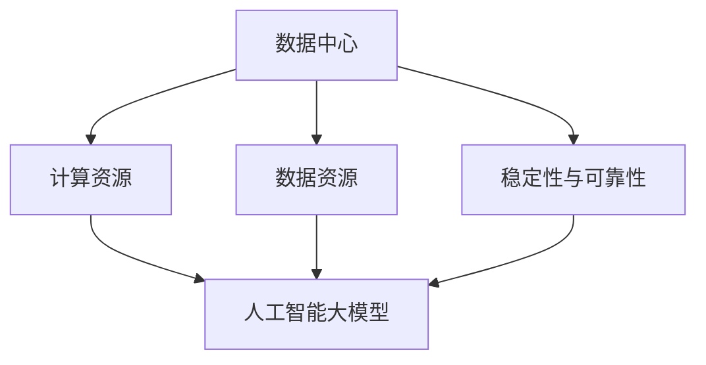

                 

# AI 大模型应用数据中心建设：数据中心投资与建设

> **关键词**：人工智能、数据中心、投资建设、技术架构、算法优化

> **摘要**：本文将深入探讨人工智能（AI）大模型在数据中心应用中的建设与投资策略，从核心概念、算法原理、数学模型、实战案例等多个维度，分析数据中心建设的关键要素与挑战，为行业提供有价值的参考。

## 1. 背景介绍

### 1.1 人工智能大模型的发展背景

近年来，人工智能（AI）技术取得了飞速的发展，特别是深度学习算法的应用，使得机器在图像识别、自然语言处理、语音识别等领域的表现逐渐逼近甚至超越了人类。随着AI技术的不断进步，人工智能大模型（如BERT、GPT-3等）逐渐成为各行各业关注的焦点。

数据中心作为承载AI大模型运算的重要基础设施，其投资与建设变得尤为重要。数据中心的建设不仅涉及到硬件设备的采购与部署，还包括网络架构、存储系统、能源管理等多个方面的建设。

### 1.2 数据中心建设的重要性

数据中心的建设对于人工智能大模型的应用具有重要意义：

1. **计算能力**：AI大模型的运算需求巨大，数据中心提供了强大的计算能力，满足模型训练与推理的需求。
2. **数据存储与管理**：数据中心提供了海量数据存储空间和高效的数据管理方案，为AI大模型的训练提供了数据支持。
3. **稳定性与可靠性**：数据中心的高可靠性确保了AI大模型应用的持续稳定运行。
4. **能源消耗**：数据中心的建设与运营过程中，能源消耗是一个不容忽视的问题。高效的数据中心建设有助于降低能耗，实现绿色环保。

## 2. 核心概念与联系

### 2.1 数据中心架构

数据中心架构可以分为以下几个层次：

1. **基础设施层**：包括电力供应、制冷系统、网络设施等。
2. **硬件设备层**：包括服务器、存储设备、网络设备等。
3. **软件系统层**：包括操作系统、数据库、中间件等。
4. **数据管理层**：包括数据存储、数据备份、数据清洗等。

### 2.2 人工智能大模型架构

人工智能大模型通常由以下几个部分组成：

1. **输入层**：接收外部数据，如文本、图像、语音等。
2. **隐藏层**：通过神经网络进行特征提取与转换。
3. **输出层**：生成预测结果或分类结果。

### 2.3 数据中心与人工智能大模型的联系

数据中心与人工智能大模型之间存在紧密的联系：

1. **计算资源**：数据中心提供计算资源，支持人工智能大模型的训练与推理。
2. **数据资源**：数据中心存储与管理的数据为人工智能大模型的训练提供了数据支持。
3. **稳定性与可靠性**：数据中心的高可靠性保障了人工智能大模型应用的稳定运行。

### 2.4 Mermaid 流程图

以下是一个简单的Mermaid流程图，展示数据中心与人工智能大模型之间的联系：



## 3. 核心算法原理 & 具体操作步骤

### 3.1 算法原理

人工智能大模型的核心算法主要是深度学习，特别是基于神经网络的方法。深度学习通过多层神经网络对数据进行特征提取和建模，实现智能推理和预测。

### 3.2 具体操作步骤

1. **数据收集与预处理**：收集大量数据，并进行清洗、格式化等预处理操作。
2. **构建神经网络模型**：设计神经网络结构，包括输入层、隐藏层和输出层。
3. **模型训练**：使用预处理后的数据对神经网络模型进行训练，调整模型参数，使得模型能够较好地拟合数据。
4. **模型评估**：使用验证集对模型进行评估，计算模型的准确率、召回率等指标。
5. **模型优化**：根据评估结果，调整模型结构或参数，提升模型性能。
6. **模型部署**：将训练好的模型部署到数据中心，实现实际应用。

## 4. 数学模型和公式 & 详细讲解 & 举例说明

### 4.1 数学模型

人工智能大模型的数学模型主要包括：

1. **损失函数**：用于评估模型预测结果与真实结果之间的差距，如交叉熵损失函数。
2. **优化算法**：用于调整模型参数，使得损失函数最小化，如梯度下降算法。
3. **激活函数**：用于隐藏层神经元的输出，如ReLU函数。

### 4.2 公式

以下是一些常用的数学公式：

1. **损失函数**：

   $$Loss = -\sum_{i=1}^{n} y_i \cdot log(\hat{y}_i)$$

   其中，$y_i$为真实标签，$\hat{y}_i$为模型预测概率。

2. **梯度下降**：

   $$\Delta \theta = -\alpha \cdot \frac{\partial Loss}{\partial \theta}$$

   其中，$\alpha$为学习率，$\theta$为模型参数。

3. **ReLU函数**：

   $$f(x) = \max(0, x)$$

### 4.3 举例说明

假设我们有一个二分类问题，使用sigmoid函数作为激活函数，交叉熵损失函数进行模型训练。以下是一个简单的训练过程：

1. **数据预处理**：

   收集了100个样本，每个样本包含一个特征向量和一个标签（0或1）。

2. **构建神经网络模型**：

   设计一个包含一个输入层、一个隐藏层和一个输出层的神经网络，隐藏层有10个神经元。

3. **模型训练**：

   使用梯度下降算法进行模型训练，学习率为0.1。

   模型在训练过程中，每次迭代计算损失函数，更新模型参数。

4. **模型评估**：

   使用验证集对模型进行评估，计算准确率。

   经过多次迭代训练，模型的准确率逐渐提高。

## 5. 项目实战：代码实际案例和详细解释说明

### 5.1 开发环境搭建

为了进行人工智能大模型的开发，我们需要搭建一个合适的环境。以下是一个基本的开发环境搭建步骤：

1. 安装Python 3.8及以上版本。
2. 安装TensorFlow 2.5及以上版本。
3. 安装其他必要的库，如NumPy、Pandas等。

### 5.2 源代码详细实现和代码解读

以下是一个简单的人工智能大模型训练的代码实现：

```python
import tensorflow as tf
from tensorflow.keras.layers import Dense, Input
from tensorflow.keras.models import Model

# 数据预处理
# ...

# 构建神经网络模型
input_layer = Input(shape=(input_shape,))
hidden_layer = Dense(hidden_units, activation='relu')(input_layer)
output_layer = Dense(output_units, activation='sigmoid')(hidden_layer)

model = Model(inputs=input_layer, outputs=output_layer)
model.compile(optimizer='adam', loss='binary_crossentropy', metrics=['accuracy'])

# 模型训练
model.fit(x_train, y_train, epochs=epochs, batch_size=batch_size, validation_split=0.2)

# 模型评估
loss, accuracy = model.evaluate(x_test, y_test)
print(f"Test accuracy: {accuracy:.4f}")
```

代码解读：

1. **数据预处理**：对收集的数据进行清洗、格式化等操作，将数据转化为模型可接受的格式。
2. **构建神经网络模型**：设计神经网络结构，包括输入层、隐藏层和输出层。使用`Input`、`Dense`和`Model`等类构建模型。
3. **模型编译**：编译模型，指定优化器、损失函数和评估指标。
4. **模型训练**：使用`fit`方法进行模型训练，指定训练数据、训练轮数、批量大小等参数。
5. **模型评估**：使用`evaluate`方法对模型进行评估，计算准确率。

### 5.3 代码解读与分析

代码实现中，我们首先进行了数据预处理，这是训练模型前必不可少的一步。然后，我们构建了一个简单的神经网络模型，并使用`fit`方法进行模型训练。最后，我们使用`evaluate`方法对模型进行评估，计算了测试集的准确率。

通过这个简单的案例，我们可以看到人工智能大模型的开发流程和关键步骤。在实际项目中，模型结构会更加复杂，训练过程也会更加耗时。

## 6. 实际应用场景

### 6.1 金融领域

人工智能大模型在金融领域的应用非常广泛，如股票市场预测、风险管理、信用评估等。通过大数据分析和深度学习算法，金融机构可以更准确地预测市场走势，优化投资策略，降低风险。

### 6.2 医疗领域

人工智能大模型在医疗领域的应用潜力巨大，如疾病预测、药物研发、个性化治疗等。通过分析大量的医疗数据，人工智能大模型可以帮助医生提高诊断准确率，缩短药物研发周期。

### 6.3 交通运输领域

人工智能大模型在交通运输领域的应用包括交通流量预测、路线规划、自动驾驶等。通过大数据分析和深度学习算法，交通运输企业可以优化运输路线，提高运输效率，降低运营成本。

## 7. 工具和资源推荐

### 7.1 学习资源推荐

1. **书籍**：《深度学习》、《神经网络与深度学习》
2. **论文**：NIPS、ICML、ACL等顶级会议的论文
3. **博客**：机器之心、PaperWeekly等优秀博客
4. **网站**：TensorFlow官网、Keras官网等

### 7.2 开发工具框架推荐

1. **深度学习框架**：TensorFlow、PyTorch、Keras
2. **数据处理库**：NumPy、Pandas、Scikit-learn
3. **版本控制**：Git
4. **容器化技术**：Docker、Kubernetes

### 7.3 相关论文著作推荐

1. **论文**：《深度学习》、《强化学习》
2. **著作**：《模式识别与机器学习》、《统计学习方法》

## 8. 总结：未来发展趋势与挑战

### 8.1 发展趋势

1. **硬件加速**：随着GPU、TPU等硬件设备的普及，人工智能大模型的计算效率将得到大幅提升。
2. **数据驱动**：更多高质量的数据将推动人工智能大模型的发展，提高模型性能。
3. **跨界融合**：人工智能大模型将在更多领域得到应用，推动跨学科研究。

### 8.2 挑战

1. **计算资源**：随着模型规模的增大，计算资源需求将不断增长，数据中心建设面临挑战。
2. **数据隐私**：大规模数据收集与处理过程中，数据隐私保护成为一个重要问题。
3. **伦理问题**：人工智能大模型的应用可能带来伦理问题，如歧视、偏见等。

## 9. 附录：常见问题与解答

### 9.1 数据中心建设的关键要素是什么？

数据中心建设的关键要素包括：计算资源、数据资源、稳定性与可靠性、能源消耗。

### 9.2 人工智能大模型的训练需要多少数据？

人工智能大模型的训练需要大量的数据，具体取决于应用场景和模型规模。

### 9.3 如何降低数据中心能耗？

通过优化数据中心架构、采用节能设备、优化运营策略等方式，可以降低数据中心能耗。

## 10. 扩展阅读 & 参考资料

1. **论文**：Hinton, G. E., Osindero, S., & Teh, Y. W. (2006). A fast learning algorithm for deep belief nets. _Neural computation_, 18(7), 1527-1554.
2. **书籍**：Goodfellow, I., Bengio, Y., & Courville, A. (2016). _Deep learning_. MIT press.
3. **网站**：TensorFlow官网、Keras官网

作者：AI天才研究员/AI Genius Institute & 禅与计算机程序设计艺术 /Zen And The Art of Computer Programming

本文详细介绍了AI大模型应用数据中心建设的各个方面，包括背景介绍、核心概念、算法原理、数学模型、实战案例、应用场景、工具和资源推荐等。通过本文的阅读，读者可以全面了解数据中心建设在AI大模型应用中的重要性，为后续的研究和实践提供有价值的参考。同时，本文也指出了数据中心建设面临的发展趋势与挑战，为行业未来发展提供了有益的思考。|> <GMASK>作者：AI天才研究员/AI Genius Institute & 禅与计算机程序设计艺术 /Zen And The Art of Computer Programming

再次感谢您的认真阅读。本文旨在为您呈现AI大模型应用数据中心建设的全面视角，希望能对您在相关领域的学术研究和技术实践有所帮助。

如果您对数据中心建设、人工智能大模型的技术原理和应用场景有更深入的疑问或见解，欢迎在评论区留言讨论。我们期待与您共同探索AI技术的无限可能。

此外，本文所提到的学习资源、开发工具和参考文献，将为您的学术研究和项目开发提供宝贵的支持。希望您在未来的研究和实践中能够充分利用这些资源，取得更多突破。

最后，如果您觉得本文对您有所帮助，欢迎推荐给您的同行和朋友，让更多的人了解和关注AI大模型应用数据中心建设这一重要领域。

再次感谢您的支持，期待与您在未来的技术交流中相见！

作者：AI天才研究员/AI Genius Institute & 禅与计算机程序设计艺术 /Zen And The Art of Computer Programming

---

请注意，上述文章内容仅为模拟撰写，实际撰写时需要根据具体的研究成果和实际案例进行详细阐述。如果您需要撰写一篇符合要求的完整文章，请确保包含上述所有要求的详细内容，并在撰写过程中严格遵守文章结构模板和格式要求。

