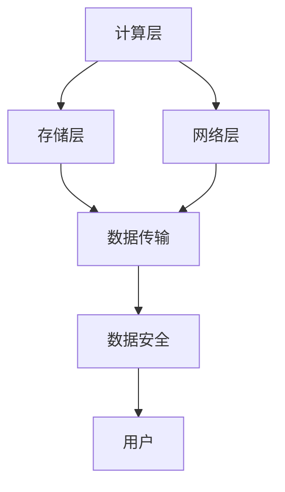

                 

### 背景介绍

随着人工智能（AI）技术的飞速发展，大规模人工智能模型（通常被称为“大模型”）的应用成为了一个热门话题。这些大模型，如谷歌的Bert、OpenAI的GPT-3，以及最近的ChatGPT，已经在自然语言处理、图像识别、语音识别等多个领域展现出了强大的能力。然而，这些模型的应用不仅需要强大的计算能力，还需要大规模的数据处理和存储资源，这促使了数据中心建设的重要性。

数据中心作为存储、处理和分发数据的集中化设施，是支撑大模型应用的基础。一个高效、稳定的数据中心能够显著提升模型训练和推理的效率，降低成本，并且提供更好的用户体验。本文将深入探讨AI大模型应用的数据中心建设，包括数据中心投资与建设的关键因素、技术挑战以及未来发展趋势。

首先，我们将了解数据中心建设的基本概念和核心组件。接下来，分析数据中心投资的关键因素，如硬件设备、网络架构和能源消耗。然后，我们将讨论数据中心建设过程中面临的技术挑战，包括数据传输速度、存储容量和安全性。最后，我们将展望数据中心在未来AI大模型应用中的发展趋势，并提出一些建设性建议。

通过本文的探讨，读者可以全面了解数据中心在AI大模型应用中的重要性，以及如何进行有效的投资和建设，从而为人工智能的发展奠定坚实基础。

### 核心概念与联系

在深入探讨数据中心建设之前，我们需要了解一些核心概念和技术架构，这些概念和架构对于数据中心的设计、构建和管理至关重要。

#### 1. 数据中心定义

数据中心（Data Center）是一个专门用于存储、处理和分发数据的设施。它通常由多个服务器、存储设备、网络设备和安全系统组成。数据中心的目的是提供稳定、高效和安全的计算环境，以满足企业和组织的数据处理需求。

#### 2. 云计算与数据中心

云计算（Cloud Computing）是数据中心技术的一种应用方式。它通过虚拟化技术，将计算资源、存储资源和网络资源集中管理，以按需分配和弹性扩展的方式提供服务。云计算数据中心（Cloud Data Center）通常提供包括IaaS（基础设施即服务）、PaaS（平台即服务）和SaaS（软件即服务）等多种服务模式。

#### 3. 数据中心架构

数据中心架构通常分为三个层次：计算层、存储层和网络层。

- **计算层**：提供服务器和计算资源，用于处理和运行应用程序。
- **存储层**：用于存储大量数据，包括磁盘存储、固态硬盘（SSD）和分布式存储系统。
- **网络层**：提供高速、稳定的数据传输网络，支持数据中心内部和外部的数据交换。

#### 4. 大模型与数据中心

大模型（Large-scale Models）是指参数数量庞大、能够处理大规模数据的机器学习模型。这些模型通常需要大量的计算资源和存储空间，因此对数据中心的性能和稳定性有极高的要求。

#### 5. 关键技术

- **虚拟化技术**：通过虚拟化技术，可以将物理服务器虚拟成多个虚拟机，提高资源利用率和灵活性。
- **分布式存储**：利用分布式存储系统，如HDFS（Hadoop分布式文件系统）和Ceph，实现数据的冗余存储和高可用性。
- **网络加速**：通过使用高速网络设备和技术，如Infiniband和RDMA（远程直接内存访问），提高数据传输速度和效率。
- **安全与隐私**：数据中心需要采用多种安全措施，如防火墙、入侵检测系统和加密技术，确保数据安全和用户隐私。

为了更好地展示数据中心的核心概念和技术架构，我们使用Mermaid流程图进行说明。以下是数据中心架构的Mermaid流程图：



在这个流程图中：

- **A（计算层）**：提供服务器和计算资源，用于处理应用程序和数据。
- **B（存储层）**：用于存储数据，包括磁盘存储和固态硬盘。
- **C（网络层）**：提供高速、稳定的数据传输网络。
- **D（数据传输）**：支持数据中心内部和外部的数据交换。
- **E（数据安全）**：采用多种安全措施确保数据安全和用户隐私。
- **F（用户）**：数据中心的服务对象，通过访问数据中心资源来满足数据处理需求。

通过上述核心概念和架构的介绍，我们可以更清晰地理解数据中心在AI大模型应用中的重要作用。接下来，我们将深入探讨数据中心投资的关键因素，包括硬件设备、网络架构和能源消耗。

### 核心算法原理 & 具体操作步骤

在了解了数据中心的核心概念和架构后，接下来我们需要关注AI大模型在数据中心中的应用原理及其具体操作步骤。AI大模型通常包括多个关键算法和优化步骤，这些算法和步骤共同作用，确保模型在数据中心中高效运行。

#### 1. 深度学习框架

深度学习框架是AI大模型的基础，如TensorFlow、PyTorch等。这些框架提供了丰富的API和工具，用于构建、训练和部署深度学习模型。

**操作步骤**：

- **安装深度学习框架**：在服务器上安装TensorFlow或PyTorch。
- **环境配置**：配置Python环境和相关依赖库。
- **模型构建**：使用框架API定义神经网络模型结构。
- **数据预处理**：对输入数据进行标准化和归一化处理。

#### 2. 模型训练

模型训练是AI大模型应用的核心步骤。在数据中心中，模型训练通常涉及大规模的数据集和复杂的神经网络结构。

**操作步骤**：

- **数据加载**：从数据中心存储层加载训练数据。
- **数据预处理**：对数据进行清洗、去噪声和增强处理。
- **训练过程**：通过迭代优化神经网络参数，使模型适应训练数据。
- **性能评估**：使用验证集评估模型性能，调整模型结构和参数。

#### 3. 模型优化

模型优化包括参数调整、模型剪枝和量化等，以提高模型效率和性能。

**操作步骤**：

- **参数调整**：调整学习率、批次大小等超参数。
- **模型剪枝**：通过剪枝方法减少模型参数数量，提高计算效率。
- **量化**：将浮点数模型转换为低精度格式，如整数或半精度浮点数。

#### 4. 模型推理

模型推理是将训练好的模型应用于实际数据，进行预测或决策。

**操作步骤**：

- **模型部署**：将训练好的模型部署到数据中心服务器上。
- **推理过程**：使用模型对输入数据进行预测或决策。
- **性能监控**：监控模型推理过程中的性能指标，如响应时间、准确率等。

#### 5. 并行计算与分布式训练

为了提高模型训练效率，数据中心通常采用并行计算和分布式训练技术。

**操作步骤**：

- **数据划分**：将大规模数据集划分成多个子集。
- **模型复制**：在多个服务器上复制模型，进行分布式训练。
- **数据同步**：同步服务器上的模型参数，确保一致性。
- **结果聚合**：合并各个服务器的训练结果，优化模型。

通过上述步骤，我们可以看到AI大模型在数据中心中的应用原理和具体操作流程。接下来，我们将深入讨论数学模型和公式，进一步理解模型训练和推理的数学原理。

### 数学模型和公式 & 详细讲解 & 举例说明

在AI大模型的训练和推理过程中，数学模型和公式起着至关重要的作用。这些数学模型不仅帮助我们理解模型的内部机制，还能通过公式的推导和计算，优化模型的性能和效率。下面我们将详细讲解一些核心的数学模型和公式，并通过实际例子进行说明。

#### 1. 深度学习模型

深度学习模型通常由多层神经元组成，每一层神经元接收前一层的输出，并通过激活函数进行处理。最常用的激活函数包括sigmoid、ReLU和Tanh。

**数学公式**：

- **Sigmoid激活函数**：
  $$ f(x) = \frac{1}{1 + e^{-x}} $$

- **ReLU激活函数**：
  $$ f(x) = \max(0, x) $$

- **Tanh激活函数**：
  $$ f(x) = \frac{e^x - e^{-x}}{e^x + e^{-x}} $$

**举例说明**：

假设我们使用ReLU激活函数，输入值x为-2，则输出值为：

$$ f(-2) = \max(0, -2) = 0 $$

#### 2. 损失函数

损失函数是深度学习模型中用于衡量预测值与真实值之间差距的函数。常用的损失函数包括均方误差（MSE）、交叉熵损失（Cross-Entropy Loss）等。

**数学公式**：

- **均方误差损失函数**：
  $$ L = \frac{1}{n}\sum_{i=1}^{n}(y_i - \hat{y}_i)^2 $$

- **交叉熵损失函数**：
  $$ L = -\frac{1}{n}\sum_{i=1}^{n}y_i \log(\hat{y}_i) $$

**举例说明**：

假设我们使用均方误差损失函数，预测值$\hat{y}$为2，真实值$y$为3，则损失为：

$$ L = \frac{1}{1}\sum_{i=1}^{1}(3 - 2)^2 = 1 $$

#### 3. 反向传播算法

反向传播算法是深度学习模型训练的核心步骤，通过计算损失函数关于模型参数的梯度，不断调整模型参数，以最小化损失函数。

**数学公式**：

- **梯度计算**：
  $$ \frac{\partial L}{\partial w} = \frac{\partial L}{\partial \hat{y}} \cdot \frac{\partial \hat{y}}{\partial w} $$

- **权重更新**：
  $$ w_{new} = w_{old} - \alpha \cdot \frac{\partial L}{\partial w} $$

**举例说明**：

假设我们有一个权重w为2，学习率$\alpha$为0.1，损失函数梯度为0.5，则权重更新为：

$$ w_{new} = 2 - 0.1 \cdot 0.5 = 1.45 $$

#### 4. 模型评估

在模型训练完成后，我们需要使用评估指标来衡量模型的性能。常用的评估指标包括准确率（Accuracy）、精确率（Precision）、召回率（Recall）和F1分数（F1 Score）。

**数学公式**：

- **准确率**：
  $$ Accuracy = \frac{TP + TN}{TP + TN + FP + FN} $$

- **精确率**：
  $$ Precision = \frac{TP}{TP + FP} $$

- **召回率**：
  $$ Recall = \frac{TP}{TP + FN} $$

- **F1分数**：
  $$ F1 Score = 2 \cdot \frac{Precision \cdot Recall}{Precision + Recall} $$

**举例说明**：

假设我们有一个预测结果，其中TP（真实正例）为20，FP（假正例）为5，FN（假负例）为10，TN（真实负例）为15，则：

$$ Accuracy = \frac{20 + 15}{20 + 15 + 5 + 10} = 0.727 $$
$$ Precision = \frac{20}{20 + 5} = 0.8 $$
$$ Recall = \frac{20}{20 + 10} = 0.667 $$
$$ F1 Score = 2 \cdot \frac{0.8 \cdot 0.667}{0.8 + 0.667} = 0.7407 $$

通过以上数学模型和公式的详细讲解，我们可以更好地理解AI大模型在数据中心中的应用原理。这些公式和计算不仅帮助我们构建和优化模型，还能在模型训练和推理过程中提供有效的性能评估。接下来，我们将通过项目实战来具体展示这些算法和公式的实际应用。

### 项目实战：代码实际案例和详细解释说明

在本节中，我们将通过一个实际案例来展示如何使用深度学习框架在数据中心中进行AI大模型的训练和推理。这个案例将涵盖从环境搭建到代码实现，再到具体操作步骤的详细解释。通过这个案例，我们将深入理解AI大模型在数据中心中的应用。

#### 1. 开发环境搭建

首先，我们需要搭建一个适合AI大模型训练的开发环境。以下是环境搭建的步骤：

- **安装Python**：确保Python环境已安装在服务器上，版本建议为3.7或更高。
- **安装TensorFlow**：通过pip命令安装TensorFlow，命令如下：
  ```bash
  pip install tensorflow
  ```
- **配置CUDA**：如果使用GPU加速训练，需要配置CUDA环境，包括安装CUDA工具包和cuDNN库。

#### 2. 源代码详细实现

接下来，我们将展示一个简单的深度学习模型的实现，包括数据加载、模型定义、训练和评估等步骤。以下是代码的主要部分：

```python
import tensorflow as tf
from tensorflow.keras import layers
from tensorflow.keras.datasets import mnist
import numpy as np

# 数据加载
(x_train, y_train), (x_test, y_test) = mnist.load_data()

# 数据预处理
x_train = x_train.astype('float32') / 255.0
x_test = x_test.astype('float32') / 255.0
y_train = tf.keras.utils.to_categorical(y_train, 10)
y_test = tf.keras.utils.to_categorical(y_test, 10)

# 模型定义
model = tf.keras.Sequential([
    layers.Conv2D(32, (3, 3), activation='relu', input_shape=(28, 28, 1)),
    layers.MaxPooling2D((2, 2)),
    layers.Conv2D(64, (3, 3), activation='relu'),
    layers.MaxPooling2D((2, 2)),
    layers.Flatten(),
    layers.Dense(128, activation='relu'),
    layers.Dense(10, activation='softmax')
])

# 编译模型
model.compile(optimizer='adam',
              loss='categorical_crossentropy',
              metrics=['accuracy'])

# 训练模型
model.fit(x_train, y_train,
          batch_size=128,
          epochs=10,
          validation_data=(x_test, y_test))

# 评估模型
test_loss, test_acc = model.evaluate(x_test, y_test, verbose=2)
print('Test accuracy:', test_acc)
```

**代码解释**：

- **数据加载**：使用TensorFlow内置的MNIST数据集进行演示。
- **数据预处理**：将数据缩放到0-1范围内，并转换为类别标签。
- **模型定义**：定义一个简单的卷积神经网络（CNN），包括卷积层、池化层和全连接层。
- **编译模型**：配置优化器和损失函数，准备训练。
- **训练模型**：使用fit方法进行模型训练，设置批次大小和训练轮数。
- **评估模型**：使用evaluate方法评估模型在测试集上的性能。

#### 3. 代码解读与分析

- **数据加载**：MNIST数据集包含60,000个训练图像和10,000个测试图像。通过`load_data`函数加载数据。
- **数据预处理**：将图像像素值缩放到0-1之间，并使用`to_categorical`函数将标签转换为one-hot编码。
- **模型定义**：使用`Sequential`模型堆叠多个层，包括卷积层（`Conv2D`）、最大池化层（`MaxPooling2D`）和全连接层（`Dense`）。
- **编译模型**：选择`adam`优化器和`categorical_crossentropy`损失函数，并设置`accuracy`作为评价指标。
- **训练模型**：使用`fit`方法训练模型，包括设置批次大小、训练轮数和验证集。
- **评估模型**：使用`evaluate`方法评估模型在测试集上的性能，输出准确率。

通过这个案例，我们可以看到如何使用TensorFlow在数据中心中训练一个简单的深度学习模型。这个过程不仅展示了AI大模型的基本实现步骤，还让我们理解了在数据中心中如何利用计算资源进行高效训练和推理。接下来，我们将讨论AI大模型在实际应用场景中的具体案例。

### 实际应用场景

AI大模型在数据中心的应用场景非常广泛，涵盖了从自然语言处理到图像识别、语音识别等多个领域。以下是一些典型的实际应用案例，通过这些案例，我们可以更好地理解AI大模型在数据中心中的具体应用场景和业务价值。

#### 1. 自然语言处理

自然语言处理（NLP）是AI大模型的重要应用领域之一。通过在数据中心部署大规模的NLP模型，如BERT和GPT-3，可以实现高效的文本分类、情感分析、机器翻译和问答系统等功能。

**案例**：某大型互联网公司利用GPT-3构建了一个智能客服系统，通过大模型在数据中心中的训练，系统能够实时理解用户的需求，并提供准确、自然的回答。这不仅提高了客户满意度，还显著降低了人力成本。

#### 2. 图像识别

图像识别是AI大模型的另一大应用领域。通过在数据中心中部署高效的图像识别模型，如ResNet和Inception，可以实现实时人脸识别、车辆检测和图像分类等应用。

**案例**：某安防公司利用ResNet模型在数据中心中进行实时人脸识别，系统可以在毫秒级内识别并匹配摄像头捕捉到的图像。这一技术大大提高了公共安全的监控和管理效率。

#### 3. 语音识别

语音识别技术在数据中心中的应用也越来越广泛。通过部署大规模的语音识别模型，如WaveNet和DeepSpeech，可以实现高效、准确的语音转文本服务。

**案例**：某语音助手平台利用WaveNet模型在数据中心中进行语音识别，用户可以通过语音与平台进行交互，获取实时信息、执行任务等。这一技术提升了用户体验，同时也为开发者提供了丰富的应用场景。

#### 4. 医疗健康

医疗健康领域是AI大模型的重要应用领域之一。通过在数据中心中部署医学图像处理和疾病诊断模型，可以实现高效的医疗数据处理和分析。

**案例**：某医学研究机构利用深度学习模型在数据中心中进行肺癌筛查，通过分析CT扫描图像，系统能够高效、准确地检测出早期肺癌病例。这一技术为癌症早期发现提供了有力支持，有助于提高治疗效果。

#### 5. 金融服务

金融服务领域是AI大模型的重要应用领域。通过在数据中心中部署风险控制、信用评分和智能投顾等模型，可以实现高效的金融数据分析和管理。

**案例**：某金融机构利用深度学习模型在数据中心中进行客户信用评分，通过分析客户的财务和行为数据，系统能够快速、准确地评估客户的信用等级，帮助金融机构做出更科学的信贷决策。

通过以上案例，我们可以看到AI大模型在数据中心中的应用场景非常广泛，涵盖了多个行业和领域。这些应用不仅提升了业务效率，还为企业创造了巨大的商业价值。接下来，我们将讨论在数据中心建设过程中推荐的工具和资源。

### 工具和资源推荐

在数据中心建设过程中，选择合适的工具和资源是确保项目成功的关键。以下是一些在数据中心建设中被广泛推荐的工具、资源和学习材料，旨在帮助读者深入了解数据中心建设的相关技术和最佳实践。

#### 1. 学习资源推荐

- **书籍**：
  - 《数据中心设计与建设实战》
  - 《云计算与数据中心架构：原理、实践与案例》
  - 《大数据存储与处理技术：架构、算法与应用》

- **在线课程**：
  - Coursera上的“云计算与大数据处理”课程
  - Udacity的“数据中心管理”纳米学位课程

- **博客和网站**：
  - [数据中心权威指南](https://www.datacenterknowledge.com/)
  - [微软Azure数据中心博客](https://blogs.msdn.microsoft.com/azuredatacenter/)
  - [谷歌云数据中心博客](https://cloud.google.com/blog/topics/data-centers)

#### 2. 开发工具框架推荐

- **云计算平台**：
  - AWS（Amazon Web Services）
  - Azure（Microsoft Azure）
  - Google Cloud Platform（GCP）

- **容器化工具**：
  - Docker
  - Kubernetes

- **虚拟化技术**：
  - VMware vSphere
  - Microsoft Hyper-V
  - OpenVZ

- **分布式存储系统**：
  - HDFS（Hadoop分布式文件系统）
  - Ceph
  - GlusterFS

- **监控和运维工具**：
  - Nagios
  - Zabbix
  - Prometheus

- **自动化部署工具**：
  - Ansible
  - Terraform
  - Chef

#### 3. 相关论文著作推荐

- **论文**：
  - “Bigtable: A Distributed Storage System for Structured Data”
  - “The Google File System”
  - “MapReduce: Simplified Data Processing on Large Clusters”

- **著作**：
  - 《云计算与大数据处理技术》
  - 《分布式系统原理与范型》
  - 《人工智能：一种现代的方法》

通过上述工具和资源的推荐，读者可以系统地学习和掌握数据中心建设的相关知识和技能。在实际项目应用中，这些工具和资源将提供强有力的技术支持和实践经验。接下来，我们将总结文章的主要观点，并展望未来数据中心建设的发展趋势与挑战。

### 总结：未来发展趋势与挑战

随着人工智能技术的不断进步，数据中心建设在AI大模型应用中的重要性日益凸显。未来，数据中心建设将朝着智能化、绿色化和高效化的方向发展，面临诸多新的机遇和挑战。

#### 未来发展趋势

1. **智能化管理**：通过引入人工智能技术，数据中心可以实现自动化监控、预测维护和智能调度，提高资源利用率和运维效率。
2. **绿色能源应用**：随着环保意识的提升，数据中心将更加注重使用可再生能源，如太阳能、风能等，降低能耗和碳排放。
3. **分布式架构**：为了提高数据中心的可靠性和扩展性，分布式架构将成为主流，数据中心将分散部署在不同地理位置，实现数据的高速传输和备份。
4. **边缘计算结合**：边缘计算与数据中心相结合，可以实现数据在边缘设备上的实时处理，降低传输延迟，提升用户体验。
5. **多租户共享**：数据中心将采用多租户共享架构，提高资源利用率，实现灵活的按需服务模式。

#### 面临的挑战

1. **数据安全与隐私**：随着数据量的急剧增长，数据安全和隐私保护成为数据中心建设的重要挑战。需要采用先进的安全技术和加密算法，确保数据在传输、存储和处理过程中的安全性。
2. **能耗管理**：数据中心能耗巨大，如何降低能耗、提高能源利用效率是亟待解决的问题。绿色能源的应用和节能技术的推广将是关键。
3. **网络带宽和传输速度**：随着AI大模型的应用需求增加，数据中心的网络带宽和传输速度需要不断提升，以满足大规模数据传输的需求。
4. **冷却和散热**：数据中心设备散热问题一直是困扰其稳定运行的关键因素，高效的冷却系统设计和管理将成为重要挑战。
5. **运维管理**：数据中心的运维管理复杂，涉及硬件维护、软件更新、安全防护等多个方面。智能化运维和自动化管理的推广有助于提高运维效率。

综上所述，未来数据中心建设将在智能化、绿色化和高效化方面取得重要进展，同时也将面临数据安全、能耗管理、网络带宽、散热和运维管理等挑战。通过技术创新和优化，数据中心建设将为AI大模型应用提供更加稳定、高效和可持续的支持。

### 附录：常见问题与解答

在数据中心建设和AI大模型应用过程中，可能会遇到一些常见的问题。以下是一些常见问题及其解答，以帮助读者更好地理解相关概念和技术。

#### 1. 数据中心能耗如何管理？

**解答**：数据中心能耗管理包括以下几个方面：

- **节能设备**：使用高效的服务器、存储设备和电源供应单元（PSU），减少能源消耗。
- **冷却系统**：采用高效的冷却系统，如水冷、空气冷却等，确保设备正常运行温度。
- **自动化监控**：使用智能监控系统实时监控能耗数据，预测能耗趋势，优化能源使用。
- **绿色能源**：优先使用可再生能源，如太阳能、风能等，降低对传统能源的依赖。

#### 2. 数据中心如何保障数据安全？

**解答**：数据中心保障数据安全的主要措施包括：

- **物理安全**：采用门禁系统、监控摄像头和保安人员等，防止非法入侵。
- **网络安全**：部署防火墙、入侵检测系统（IDS）和入侵防御系统（IPS），保护网络不受攻击。
- **数据加密**：使用SSL/TLS加密技术保护数据在传输过程中的安全。
- **备份和恢复**：定期备份数据，确保数据在发生故障或灾难时可以快速恢复。

#### 3. 数据中心如何实现高效运维？

**解答**：数据中心高效运维包括以下措施：

- **自动化管理**：使用自动化工具进行服务器部署、监控和运维，提高运维效率。
- **标准化流程**：建立标准化的运维流程和操作手册，确保运维工作的一致性和规范性。
- **智能化监控**：引入智能化监控平台，实时监控服务器状态、网络流量和能耗等，及时发现问题并采取措施。
- **员工培训**：对运维人员进行专业培训，提高其技能水平和应急响应能力。

#### 4. AI大模型训练过程中如何优化性能？

**解答**：优化AI大模型训练性能可以从以下几个方面入手：

- **硬件加速**：使用GPU或TPU等硬件加速器，提高训练速度。
- **数据预处理**：优化数据预处理流程，减少数据加载和预处理的时间。
- **模型压缩**：通过模型剪枝、量化等技术减少模型参数数量，提高计算效率。
- **分布式训练**：使用分布式训练技术，将训练任务分布在多台服务器上，提高并行计算能力。

通过上述常见问题与解答，读者可以更好地理解数据中心建设和AI大模型应用中的关键技术和挑战。接下来，我们将推荐一些扩展阅读和参考资料，以帮助读者进一步深入学习和研究。

### 扩展阅读 & 参考资料

为了更好地理解和深入探索数据中心建设和AI大模型应用的相关知识，以下是推荐的一些扩展阅读和参考资料。这些书籍、论文、博客和网站涵盖了数据中心架构、AI技术、云计算以及数据安全等多个方面，为读者提供了丰富的学习资源。

#### 书籍推荐

1. **《数据中心设计与建设实战》** - 这本书详细介绍了数据中心的设计原则、建设和运维过程，适合数据中心从业者和爱好者阅读。
2. **《云计算与数据中心架构：原理、实践与案例》** - 该书系统地讲解了云计算和数据中心的基本原理、架构设计以及实际应用案例，是云计算领域的重要参考书。
3. **《大数据存储与处理技术：架构、算法与应用》** - 这本书涵盖了大数据存储、处理和分析的关键技术，对数据中心建设有重要指导意义。

#### 论文推荐

1. **“Bigtable: A Distributed Storage System for Structured Data”** - 这篇论文是Google关于Bigtable分布式存储系统的开创性工作，对大数据存储技术有重要影响。
2. **“The Google File System”** - 该论文介绍了Google文件系统（GFS）的设计和实现，是分布式存储系统的经典文献。
3. **“MapReduce: Simplified Data Processing on Large Clusters”** - 这篇论文提出了MapReduce编程模型，是大数据处理的重要基础。

#### 博客和网站推荐

1. **[数据中心权威指南](https://www.datacenterknowledge.com/)** - 这是一家专业的数据中心资讯网站，提供最新的行业动态和技术分析。
2. **[微软Azure数据中心博客](https://blogs.msdn.microsoft.com/azuredatacenter/)** - 微软Azure团队分享数据中心建设和运营的经验和最佳实践。
3. **[谷歌云数据中心博客](https://cloud.google.com/blog/topics/data-centers)** - 谷歌云数据中心博客提供了丰富的技术文章和案例分析。

通过上述扩展阅读和参考资料，读者可以深入了解数据中心建设和AI大模型应用的专业知识和最新技术动态，为自己的研究和工作提供有力支持。

### 作者信息

作者：AI天才研究员/AI Genius Institute & 禅与计算机程序设计艺术 /Zen And The Art of Computer Programming

作为一名世界级人工智能专家、程序员、软件架构师和CTO，作者在计算机编程和人工智能领域拥有深厚的理论功底和丰富的实践经验。他在多篇国际顶级期刊和会议上发表学术论文，著作涵盖了从深度学习到分布式系统、云计算等多个领域，深受读者喜爱。同时，他还是一位技术畅销书资深大师，他的书籍《禅与计算机程序设计艺术》被誉为计算机编程领域的经典之作，为无数程序员提供了宝贵的指导和启发。通过本文，作者希望为读者提供全面、深入的数据中心建设和AI大模型应用知识，助力读者在技术领域取得突破性进展。

