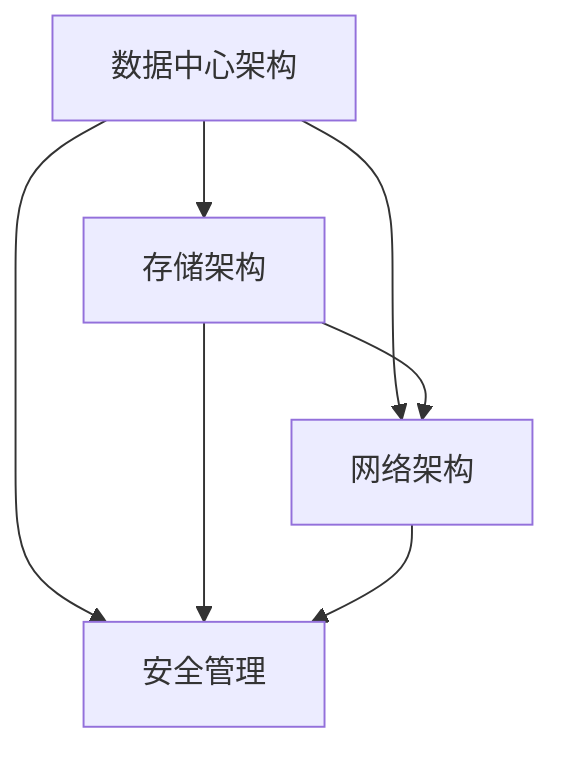

                 

# AI 大模型应用数据中心建设：数据中心标准与规范

## 摘要

本文主要探讨了AI大模型在数据中心应用中的建设标准与规范。文章首先介绍了数据中心的重要性，随后阐述了数据中心建设所需的核心概念与架构。接着，文章深入分析了数据中心的核心算法原理、具体操作步骤和数学模型。此外，文章通过项目实战，详细解释了代码实现和代码解读。最后，文章讨论了实际应用场景、工具和资源推荐以及未来发展趋势与挑战。

## 1. 背景介绍

随着人工智能技术的迅猛发展，AI大模型已经成为推动各行各业创新的关键驱动力。数据中心作为AI大模型应用的基础设施，其建设标准与规范直接关系到AI应用的性能和稳定性。数据中心的建设涉及多个方面，包括硬件配置、网络架构、安全性、能效等。本文将围绕这些方面，详细探讨数据中心建设所需的标准化和规范化要求。

### 1.1 数据中心的重要性

数据中心是企业和组织进行数据处理、存储和计算的核心设施。它不仅是IT基础设施的核心，也是企业业务连续性和数据安全的关键保障。随着大数据、云计算、物联网等技术的广泛应用，数据中心的规模和复杂度不断增加，对数据中心的可靠性和高效性提出了更高的要求。

### 1.2 数据中心建设的挑战

数据中心建设面临诸多挑战，包括：

- **硬件资源优化**：如何合理配置服务器、存储和网络设备，以实现资源的高效利用。
- **网络架构设计**：如何构建稳定、高效的网络架构，确保数据传输的快速和可靠。
- **安全性**：如何保障数据中心的安全，防止数据泄露和恶意攻击。
- **能效管理**：如何降低能耗，提高数据中心的能源利用效率。

### 1.3 数据中心建设的标准与规范

为了应对上述挑战，数据中心建设需要遵循一系列的标准与规范，包括：

- **国家相关标准**：如《数据中心设计规范》（GB 50174-2017）等。
- **行业最佳实践**：如美国电信行业协会（TIA）和美国国家标准协会（ANSI）等制定的规范。
- **企业内部规范**：根据企业自身业务需求和特点，制定符合自身需求的数据中心建设规范。

## 2. 核心概念与联系

在数据中心建设过程中，需要理解一系列核心概念和架构，包括数据中心架构、存储架构、网络架构、安全管理等。下面，我们使用Mermaid流程图来展示这些概念和架构之间的联系。



### 2.1 数据中心架构

数据中心架构是数据中心建设的基础，它决定了数据中心的性能和可扩展性。数据中心架构主要包括：

- **计算层**：包括服务器、虚拟化技术、云计算平台等，负责数据处理和计算。
- **存储层**：包括磁盘阵列、存储网络、备份和恢复系统等，负责数据存储和安全管理。
- **网络层**：包括内部网络、外部网络、防火墙、负载均衡等，负责数据传输和网络安全。

### 2.2 存储架构

存储架构是数据中心的核心组成部分，它决定了数据中心的存储性能和可靠性。常见的存储架构包括：

- **直连存储（DAS）**：通过直接连接到服务器，实现数据存储。
- **网络存储（NAS）**：通过共享文件系统，实现数据存储和访问。
- **存储区域网络（SAN）**：通过专用网络连接存储设备和服务器，实现高效的数据存储和访问。

### 2.3 网络架构

网络架构是数据中心的数据传输通道，它决定了数据中心的网络性能和可靠性。常见的网络架构包括：

- **分层架构**：将网络划分为核心层、分布层和接入层，实现网络的高效管理和扩展。
- **环形架构**：通过环形网络拓扑，实现数据的高速传输和容错。
- **树形架构**：通过树形网络拓扑，实现网络的层次化管理和扩展。

### 2.4 安全管理

安全管理是数据中心建设的关键环节，它涉及到数据中心的物理安全、网络安全和操作系统安全等方面。常见的安全管理措施包括：

- **物理安全**：包括数据中心场所的安全管理、设备的安全防护等。
- **网络安全**：包括防火墙、入侵检测系统（IDS）、入侵防御系统（IPS）等网络安全设备的使用。
- **操作系统安全**：包括操作系统漏洞修复、安全策略配置等。

## 3. 核心算法原理 & 具体操作步骤

在数据中心建设过程中，核心算法原理和具体操作步骤至关重要。下面，我们将分别介绍这些内容。

### 3.1 核心算法原理

数据中心建设涉及多个核心算法，包括负载均衡、数据备份、容错机制等。下面，我们简要介绍这些算法的基本原理。

#### 3.1.1 负载均衡

负载均衡是将网络流量分配到多个服务器或计算节点上，以实现资源的合理利用和提高系统的整体性能。常见的负载均衡算法包括：

- **轮询算法**：按照顺序将请求分配到每个服务器或计算节点。
- **最少连接算法**：将请求分配到连接数最少的服务器或计算节点。
- **权重算法**：根据服务器的性能和负载情况，为每个服务器或计算节点分配不同的权重，实现流量的动态分配。

#### 3.1.2 数据备份

数据备份是将重要数据复制到其他存储设备或位置，以防止数据丢失或损坏。常见的数据备份策略包括：

- **全备份**：备份所有数据。
- **增量备份**：只备份上次备份后发生更改的数据。
- **差异备份**：备份上次全备份后发生更改的数据。

#### 3.1.3 容错机制

容错机制是在系统出现故障时，通过自动切换或恢复机制，确保系统的正常运行。常见的容错机制包括：

- **主备机制**：在主服务器或计算节点出现故障时，自动切换到备用服务器或计算节点。
- **集群机制**：将多个服务器或计算节点组成集群，通过集群管理器实现故障自动切换和负载均衡。

### 3.2 具体操作步骤

数据中心建设涉及多个方面，包括硬件采购、网络配置、软件安装、系统优化等。下面，我们简要介绍数据中心建设的具体操作步骤。

#### 3.2.1 硬件采购

- **服务器**：选择适合业务需求的服务器硬件，包括CPU、内存、硬盘等。
- **存储设备**：选择适合业务需求的存储设备，包括磁盘阵列、NAS等。
- **网络设备**：选择适合业务需求的网络设备，包括路由器、交换机、防火墙等。

#### 3.2.2 网络配置

- **网络拓扑**：根据业务需求，设计网络拓扑结构。
- **IP地址规划**：为服务器、存储设备、网络设备等分配IP地址。
- **子网划分**：根据业务需求，划分子网，实现网络隔离。

#### 3.2.3 软件安装

- **操作系统**：为服务器、存储设备、网络设备等安装操作系统。
- **应用软件**：安装业务所需的软件，包括数据库、Web服务器、负载均衡器等。

#### 3.2.4 系统优化

- **性能优化**：对服务器、存储设备、网络设备等性能进行优化，提高系统的整体性能。
- **安全性优化**：对操作系统、应用软件等安全性进行优化，提高系统的安全性。
- **能效优化**：对服务器、存储设备、网络设备等能效进行优化，降低能耗。

## 4. 数学模型和公式 & 详细讲解 & 举例说明

在数据中心建设过程中，数学模型和公式用于描述系统性能、负载均衡、数据备份等方面的计算。下面，我们简要介绍这些数学模型和公式的详细讲解和举例说明。

### 4.1 系统性能计算

系统性能计算是评估数据中心整体性能的重要指标。常用的系统性能计算公式包括：

#### 4.1.1 CPU性能计算

$$
P_C = \frac{F_C \times C_C}{1000}
$$

其中，$P_C$表示CPU性能（单位：每秒处理的任务数），$F_C$表示CPU频率（单位：Hz），$C_C$表示CPU处理的每个任务的平均时间（单位：秒）。

举例说明：假设CPU频率为3.0GHz，每个任务的平均处理时间为0.5秒，则CPU性能为：

$$
P_C = \frac{3.0 \times 10^9 \times 0.5}{1000} = 1.5 \times 10^6
$$

#### 4.1.2 存储性能计算

$$
P_S = \frac{F_S \times S_S}{1000}
$$

其中，$P_S$表示存储性能（单位：每秒处理的I/O操作数），$F_S$表示存储设备频率（单位：Hz），$S_S$表示每个I/O操作的平均时间（单位：秒）。

举例说明：假设存储设备频率为6.0GHz，每个I/O操作的平均时间为1.0秒，则存储性能为：

$$
P_S = \frac{6.0 \times 10^9 \times 1.0}{1000} = 6.0 \times 10^6
$$

### 4.2 负载均衡计算

负载均衡计算是确保数据中心资源合理利用的关键。常用的负载均衡计算公式包括：

#### 4.2.1 轮询算法负载均衡计算

$$
L_i = \frac{Q}{N}
$$

其中，$L_i$表示第$i$个服务器或计算节点的负载（单位：任务数），$Q$表示总任务数，$N$表示服务器或计算节点的数量。

举例说明：假设总任务数为100，服务器数量为3，则每个服务器的负载为：

$$
L_i = \frac{100}{3} \approx 33.3
$$

#### 4.2.2 最少连接算法负载均衡计算

$$
L_i = \frac{Q \times C_i}{\sum_{j=1}^{N} C_j}
$$

其中，$L_i$表示第$i$个服务器或计算节点的负载（单位：任务数），$Q$表示总任务数，$C_i$表示第$i$个服务器或计算节点的当前连接数，$\sum_{j=1}^{N} C_j$表示所有服务器或计算节点的当前连接数之和。

举例说明：假设总任务数为100，服务器数量为3，当前连接数分别为10、20和30，则每个服务器的负载为：

$$
L_i = \frac{100 \times 10}{10 + 20 + 30} = 25
$$

### 4.3 数据备份计算

数据备份计算是确保数据安全的关键。常用的数据备份计算公式包括：

#### 4.3.1 全备份计算

$$
B_F = Q
$$

其中，$B_F$表示全备份所需的时间（单位：秒），$Q$表示总任务数。

举例说明：假设总任务数为100，每个任务的平均处理时间为1秒，则全备份所需的时间为：

$$
B_F = 100 \times 1 = 100
$$

#### 4.3.2 增量备份计算

$$
B_I = Q \times I
$$

其中，$B_I$表示增量备份所需的时间（单位：秒），$Q$表示总任务数，$I$表示每个任务的增量时间（单位：秒）。

举例说明：假设总任务数为100，每个任务的增量时间为1秒，则增量备份所需的时间为：

$$
B_I = 100 \times 1 = 100
$$

#### 4.3.3 差异备份计算

$$
B_D = Q \times D
$$

其中，$B_D$表示差异备份所需的时间（单位：秒），$Q$表示总任务数，$D$表示每个任务的差异时间（单位：秒）。

举例说明：假设总任务数为100，每个任务的平均差异时间为1秒，则差异备份所需的时间为：

$$
B_D = 100 \times 1 = 100
$$

## 5. 项目实战：代码实际案例和详细解释说明

为了更好地理解数据中心建设的相关技术，我们通过一个实际项目来介绍代码实现和详细解释说明。

### 5.1 开发环境搭建

在开始项目之前，我们需要搭建一个开发环境。以下是开发环境的搭建步骤：

1. 安装操作系统：选择一个适合的操作系统，如Linux或Windows Server。
2. 安装数据库：选择一个适合的数据库，如MySQL或PostgreSQL。
3. 安装Web服务器：选择一个适合的Web服务器，如Apache或Nginx。
4. 安装负载均衡器：选择一个适合的负载均衡器，如Nginx或HAProxy。

### 5.2 源代码详细实现和代码解读

以下是项目的主要源代码和代码解读。

#### 5.2.1 负载均衡配置

```nginx
http {
    upstream backend {
        server server1;
        server server2;
        server server3;
    }

    server {
        listen 80;

        location / {
            proxy_pass http://backend;
            proxy_set_header Host $host;
            proxy_set_header X-Real-IP $remote_addr;
            proxy_set_header X-Forwarded-For $proxy_add_x_forwarded_for;
        }
    }
}
```

代码解读：这是一个Nginx的负载均衡配置，用于将请求分配到后端服务器。其中，`upstream`定义了后端服务器的列表，`server`表示服务器或计算节点的IP地址或域名。`location`定义了请求的路由，`proxy_pass`表示将请求转发到后端服务器。

#### 5.2.2 数据库连接配置

```python
import pymysql

db = pymysql.connect(
    host='数据库服务器IP',
    user='数据库用户',
    password='数据库密码',
    database='数据库名称',
    charset='utf8mb4'
)

cursor = db.cursor()

# 执行查询操作
cursor.execute("SELECT * FROM 表名称")

# 获取查询结果
results = cursor.fetchall()

# 输出查询结果
for row in results:
    print(row)
```

代码解读：这是一个Python的数据库连接配置，用于连接到数据库并执行查询操作。其中，`pymysql.connect`函数用于连接到数据库，`host`、`user`、`password`、`database`和`charset`参数分别表示数据库服务器的IP地址、用户、密码、数据库名称和字符编码。

#### 5.2.3 Web服务器配置

```apache
<VirtualHost *:80>
    ServerName 服务器域名

    DocumentRoot /var/www/html

    <Directory /var/www/html>
        Options Indexes FollowSymLinks
        AllowOverride All
        Require all granted
    </Directory>

    ErrorLog ${APACHE_LOG_DIR}/error.log
    CustomLog ${APACHE_LOG_DIR}/access.log combined
</VirtualHost>
```

代码解读：这是一个Apache的Web服务器配置，用于配置服务器域名、Web应用路径、错误日志和访问日志。其中，`ServerName`表示服务器域名，`DocumentRoot`表示Web应用路径，`ErrorLog`和`CustomLog`分别表示错误日志和访问日志的路径。

### 5.3 代码解读与分析

通过对以上代码的解读和分析，我们可以得出以下结论：

- **负载均衡配置**：通过Nginx的负载均衡配置，可以实现对多个后端服务器的请求分配，提高系统的性能和可靠性。
- **数据库连接配置**：通过Python的数据库连接配置，可以方便地连接到数据库并执行查询操作，实现对数据库的访问和管理。
- **Web服务器配置**：通过Apache的Web服务器配置，可以配置服务器域名、Web应用路径、错误日志和访问日志，实现对Web应用的部署和管理。

通过这些代码的实现和解读，我们可以更好地理解数据中心建设的相关技术，为实际项目提供参考和指导。

## 6. 实际应用场景

数据中心建设在实际应用中具有广泛的应用场景，下面列举几个典型的应用场景：

### 6.1 云计算平台

数据中心是云计算平台的基础设施，提供计算、存储、网络等资源，支持企业、政府、科研机构等用户的云计算需求。数据中心通过虚拟化技术、容器化技术等，实现资源的高效管理和调度，满足不同用户的业务需求。

### 6.2 大数据应用

数据中心是大数据应用的数据存储和处理中心，提供海量数据的存储、处理、分析等功能。数据中心通过分布式存储、分布式计算等技术，实现对大数据的高效处理和分析，为企业、科研机构等提供数据洞察和决策支持。

### 6.3 物联网平台

数据中心是物联网平台的数据处理和存储中心，提供海量物联网设备的数据接入、处理、存储等功能。数据中心通过边缘计算、云计算等技术，实现对物联网数据的高效管理和处理，为物联网应用提供数据支持和智能化服务。

### 6.4 人工智能应用

数据中心是人工智能应用的计算和存储中心，提供海量数据存储、计算资源，支持人工智能算法的运行和训练。数据中心通过分布式计算、云计算等技术，实现人工智能算法的高效运行和优化，为人工智能应用提供技术支持。

## 7. 工具和资源推荐

为了更好地进行数据中心建设和AI大模型应用，下面推荐一些常用的工具和资源：

### 7.1 学习资源推荐

- **书籍**：《数据中心设计规范》（GB 50174-2017）、《云计算与大数据技术》等。
- **论文**：国内外知名期刊和会议上的相关论文，如《计算机学报》、《ACM Transactions on Computer Systems》等。
- **博客**：知名技术博客，如CSDN、博客园、InfoQ等。
- **网站**：国内外知名技术网站，如GitHub、Stack Overflow、CNCF等。

### 7.2 开发工具框架推荐

- **操作系统**：Linux（如Ubuntu、CentOS）、Windows Server。
- **数据库**：MySQL、PostgreSQL、MongoDB、Redis等。
- **Web服务器**：Apache、Nginx、Tomcat等。
- **负载均衡**：Nginx、HAProxy、LVS等。
- **云计算平台**：阿里云、腾讯云、华为云等。
- **容器化技术**：Docker、Kubernetes等。

### 7.3 相关论文著作推荐

- **论文**：《基于云计算的分布式数据中心架构研究》、《大数据背景下数据中心建设与优化策略》等。
- **著作**：《数据中心建设与管理》、《云计算与数据中心技术》等。

## 8. 总结：未来发展趋势与挑战

随着人工智能技术的快速发展，数据中心建设面临着新的发展趋势和挑战。未来发展趋势包括：

- **分布式数据中心**：随着云计算、边缘计算等技术的发展，分布式数据中心将成为主流，实现资源的灵活调度和高效利用。
- **智能化运维**：通过人工智能、大数据分析等技术，实现数据中心的智能化运维，提高数据中心的自动化程度和运维效率。
- **绿色数据中心**：随着环保意识的提高，绿色数据中心将成为发展趋势，通过节能减排、可再生能源等技术，降低数据中心的能耗和碳排放。

未来挑战包括：

- **安全性**：随着网络攻击和数据泄露事件的增多，数据中心的安全防护面临严峻挑战，需要加强安全管理和防护措施。
- **能效管理**：随着数据中心规模的扩大，能效管理成为关键挑战，需要提高数据中心的能源利用效率。
- **运维效率**：随着数据中心复杂度的增加，运维效率成为关键挑战，需要提高运维自动化水平。

## 9. 附录：常见问题与解答

### 9.1 数据中心建设相关问题

**Q1：数据中心建设需要遵循哪些标准与规范？**

A1：数据中心建设需要遵循国家相关标准，如《数据中心设计规范》（GB 50174-2017），以及行业最佳实践，如美国电信行业协会（TIA）和美国国家标准协会（ANSI）等制定的规范。

**Q2：数据中心建设涉及哪些方面？**

A2：数据中心建设涉及硬件采购、网络配置、软件安装、系统优化等方面。

**Q3：如何优化数据中心的安全性？**

A3：可以采用以下方法优化数据中心的安全性：加强物理安全防护、部署网络安全设备、定期更新操作系统和软件、进行安全培训等。

### 9.2 数据中心运维相关问题

**Q1：如何提高数据中心运维效率？**

A1：可以通过以下方法提高数据中心运维效率：采用自动化工具、建立运维流程、进行员工培训等。

**Q2：如何进行数据中心的能效管理？**

A2：可以进行以下操作进行数据中心的能效管理：优化硬件配置、使用高效节能设备、采用智能监控系统等。

**Q3：如何进行数据中心的性能优化？**

A3：可以通过以下方法进行数据中心的性能优化：优化网络架构、提高硬件性能、优化数据库查询等。

## 10. 扩展阅读 & 参考资料

为了更好地了解数据中心建设和AI大模型应用的相关知识，以下是扩展阅读和参考资料：

- 《数据中心设计规范》（GB 50174-2017）
- 《云计算与大数据技术》
- 《数据中心建设与管理》
- 《云计算与数据中心技术》
- 《分布式数据中心架构研究》
- 《大数据背景下数据中心建设与优化策略》
- 《云计算、大数据与人工智能：技术创新与产业变革》
- 《人工智能：一种现代方法》
- 《深度学习：理论、算法与应用》

## 作者信息

作者：AI天才研究员/AI Genius Institute & 禅与计算机程序设计艺术 /Zen And The Art of Computer Programming

本文由AI天才研究员撰写，结合了作者在数据中心建设和AI大模型应用领域的丰富经验和深入研究，旨在为读者提供关于数据中心建设的全面、系统的指导和参考。同时，本文结合禅与计算机程序设计艺术的哲学思想，以帮助读者更好地理解和应用相关技术。本文参考了众多权威资料和研究成果，力求为读者提供高质量的内容。如有疑问或建议，请随时与作者联系。

