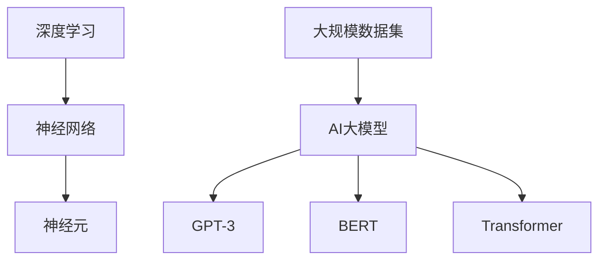
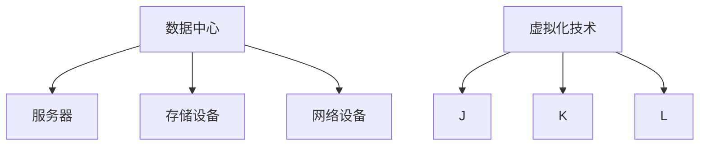
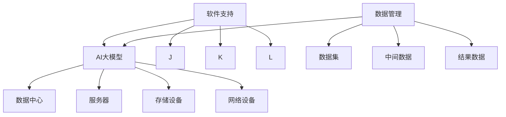

                 

### 背景介绍

近年来，人工智能（AI）技术的迅猛发展，尤其是大规模预训练模型（如GPT-3、BERT等）的广泛应用，使得人工智能在自然语言处理、计算机视觉、语音识别等多个领域取得了显著的成果。随着AI技术的不断成熟，越来越多企业和组织开始探索将AI技术应用于业务场景中，以提升生产效率、降低运营成本、提供更优质的用户体验。

在这样的背景下，AI大模型应用数据中心的建设成为了一个热门话题。数据中心作为AI大模型训练和应用的载体，其建设质量和性能直接影响到AI应用的效率和效果。然而，当前关于AI大模型应用数据中心的建设标准和规范尚未形成统一的共识，导致不同企业和组织在建设数据中心时存在较大的差异，这不仅增加了建设和维护成本，还可能影响到AI应用的稳定性和可靠性。

本文旨在探讨AI大模型应用数据中心的建设标准与规范，通过梳理相关核心概念、分析现有技术方案、分享实战经验，为读者提供一份全面、实用的建设指南。文章结构如下：

1. 背景介绍：简要介绍AI大模型应用数据中心建设的背景和重要性。
2. 核心概念与联系：阐述AI大模型、数据中心等相关核心概念，并使用Mermaid流程图展示其关系。
3. 核心算法原理 & 具体操作步骤：详细解析AI大模型训练和应用的算法原理，以及数据中心建设的关键步骤。
4. 数学模型和公式 & 详细讲解 & 举例说明：介绍相关数学模型和公式，并进行详细讲解和实际案例说明。
5. 项目实战：代码实际案例和详细解释说明，包括开发环境搭建、源代码实现和代码解读等。
6. 实际应用场景：分析AI大模型应用数据中心在不同领域的实际应用案例。
7. 工具和资源推荐：推荐相关学习资源、开发工具框架和论文著作。
8. 总结：未来发展趋势与挑战，以及数据中心建设标准的完善方向。
9. 附录：常见问题与解答，帮助读者解决实际操作中的疑问。
10. 扩展阅读 & 参考资料：提供进一步阅读的资源和参考资料。

通过以上章节的深入探讨，本文希望为读者提供一个系统、全面的AI大模型应用数据中心建设指南，助力企业和组织在AI时代抓住发展机遇，实现业务创新和突破。### 核心概念与联系

在深入探讨AI大模型应用数据中心的建设之前，我们首先需要了解一些核心概念，包括AI大模型、数据中心以及它们之间的联系。以下是相关概念及其关系的详细阐述，以及一个Mermaid流程图来展示它们之间的关系。

#### AI大模型

AI大模型指的是通过大规模数据集进行训练的复杂神经网络模型，其参数规模达到数百万至数十亿级别。这类模型在深度学习领域具有显著优势，能够处理大量的数据，实现较高的准确性和泛化能力。常见的AI大模型包括GPT-3、BERT、Transformer等。它们广泛应用于自然语言处理、计算机视觉、语音识别等领域。

**核心概念：**

- **深度学习（Deep Learning）**：一种基于人工神经网络的研究方法，通过多层神经网络结构对数据进行建模和预测。
- **神经网络（Neural Network）**：一种模仿生物神经系统的计算模型，通过神经元之间的连接和激活函数实现数据输入和输出之间的映射。
- **大规模数据集（Large-scale Dataset）**：用于训练AI大模型的巨大数据集合，通常包含数百万到数十亿条数据记录。

**Mermaid流程图（无括号、逗号等特殊字符）：**



#### 数据中心

数据中心（Data Center）是用于存储、处理、传输和管理大量数据的物理或虚拟设施。数据中心是AI大模型应用的重要基础设施，其建设质量直接影响到AI应用的性能和稳定性。数据中心通常包含服务器、存储设备、网络设备等硬件设施，以及相关的软件系统和安全措施。

**核心概念：**

- **服务器（Server）**：用于处理和存储数据的计算设备，可以提供各种网络服务。
- **存储设备（Storage）**：用于存储大量数据，如硬盘、固态硬盘、分布式存储系统等。
- **网络设备（Network Device）**：用于数据传输和连接，如交换机、路由器等。
- **虚拟化技术（Virtualization）**：通过虚拟化技术，可以在物理服务器上创建多个虚拟服务器，提高资源利用率和灵活性。

**Mermaid流程图（无括号、逗号等特殊字符）：**



#### 关系

AI大模型和数据中心之间的关系主要体现在以下几个方面：

1. **硬件资源**：AI大模型的训练和推理需要大量的计算和存储资源，数据中心提供了这些硬件资源，包括高性能服务器、大规模存储设备等。
2. **网络连接**：数据中心通过高速网络连接，使得AI大模型能够高效地进行数据传输和处理。
3. **软件支持**：数据中心部署了各种软件系统，如深度学习框架、分布式计算框架等，以支持AI大模型的开发和部署。
4. **数据管理**：数据中心负责管理和存储AI大模型训练所需的数据集，以及训练和推理过程中产生的中间数据和结果。

**Mermaid流程图（无括号、逗号等特殊字符）：**



通过以上对核心概念及其关系的介绍，我们可以更好地理解AI大模型应用数据中心的建设需求和关键要素。在接下来的章节中，我们将详细探讨AI大模型训练和应用的算法原理，以及数据中心建设的关键步骤。### 核心算法原理 & 具体操作步骤

AI大模型的训练和推理是数据中心建设中的核心任务，其背后涉及到一系列复杂的算法原理和操作步骤。在本章节中，我们将详细介绍AI大模型的核心算法原理，并给出具体操作步骤，以便读者能够深入理解其工作流程。

#### AI大模型训练算法原理

AI大模型主要通过深度学习算法进行训练。深度学习算法基于多层神经网络，通过层层提取数据特征，最终实现数据的高效处理和预测。以下是AI大模型训练的主要算法原理：

1. **反向传播算法（Backpropagation）**：反向传播算法是一种用于训练神经网络的优化算法，通过计算损失函数关于网络参数的梯度，并利用梯度下降法进行参数更新。其核心思想是计算输入层到输出层的梯度，并反向传播至每一层，从而更新各层的权重和偏置。

2. **优化算法（Optimization Algorithms）**：常见的优化算法包括梯度下降（Gradient Descent）、随机梯度下降（Stochastic Gradient Descent，SGD）和Adam优化器等。这些算法通过不断迭代优化模型参数，使得损失函数值逐渐减小，从而提高模型的预测能力。

3. **正则化方法（Regularization Methods）**：为了防止模型过拟合，常使用正则化方法，如L1正则化、L2正则化和dropout等。这些方法通过在损失函数中添加正则项，限制模型参数的规模，从而提高模型的泛化能力。

4. **激活函数（Activation Functions）**：激活函数用于确定神经元的输出，常见的激活函数包括Sigmoid、ReLU、Tanh等。激活函数的选择对模型的性能和收敛速度有很大影响。

5. **学习率调整（Learning Rate Adjustment）**：学习率是反向传播算法中的一个关键参数，其大小直接影响到模型训练的收敛速度和稳定性。常用的学习率调整方法包括固定学习率、自适应学习率（如Adam）和动态学习率等。

#### AI大模型训练操作步骤

以下是AI大模型训练的具体操作步骤：

1. **数据预处理**：对训练数据进行预处理，包括数据清洗、数据增强、归一化等操作。数据预处理旨在提高数据质量，为模型训练提供更好的基础。

2. **模型设计**：根据任务需求设计神经网络结构，包括层数、每层的神经元数量、激活函数等。模型设计直接影响模型的性能和计算复杂度。

3. **初始化参数**：初始化模型参数，包括权重和偏置。常用的初始化方法包括随机初始化、高斯初始化和Xavier初始化等。

4. **前向传播（Forward Propagation）**：输入数据通过神经网络，逐层计算各层的输出值，直到最后一层。

5. **计算损失函数**：计算模型预测值与真实值之间的差距，使用损失函数衡量模型预测的误差。常见的损失函数包括均方误差（MSE）、交叉熵（Cross-Entropy）等。

6. **反向传播（Backpropagation）**：计算损失函数关于模型参数的梯度，并反向传播至每一层。

7. **参数更新**：利用梯度下降等优化算法，根据梯度值更新模型参数，以减小损失函数值。

8. **迭代训练**：重复步骤4至7，直到满足停止条件（如达到预设的迭代次数或损失函数值收敛）。

9. **模型评估**：在验证集上评估模型性能，包括准确率、召回率、F1值等指标，以判断模型是否过拟合或欠拟合。

10. **模型部署**：将训练好的模型部署到生产环境，用于实际应用，如自然语言处理、计算机视觉等。

#### AI大模型推理操作步骤

在训练好的AI大模型进行推理时，主要包括以下步骤：

1. **数据预处理**：与训练数据预处理相同，对输入数据进行清洗、增强、归一化等操作。

2. **模型加载**：从训练好的模型中加载权重和偏置等参数。

3. **前向传播**：将预处理后的输入数据通过训练好的模型，逐层计算各层的输出值，直到最后一层。

4. **结果输出**：根据最后一层的输出值，得到模型的预测结果。

5. **后处理**：根据实际应用需求，对预测结果进行后处理，如分类标签的转换、阈值设置等。

通过以上对AI大模型训练和推理算法原理及操作步骤的详细介绍，读者可以更好地理解AI大模型的工作流程，为后续数据中心建设提供理论基础。在接下来的章节中，我们将进一步探讨数据中心建设的具体实施步骤。### 数学模型和公式 & 详细讲解 & 举例说明

在AI大模型的训练和推理过程中，涉及到了许多数学模型和公式。这些数学工具和公式对于理解和优化AI算法至关重要。在本章节中，我们将详细介绍一些关键的数学模型和公式，并通过具体例子进行讲解，以便读者能够更好地掌握其应用。

#### 1. 均方误差（MSE）

均方误差（Mean Squared Error，MSE）是衡量模型预测值与真实值之间差异的一种常见损失函数。其公式如下：

\[ 
MSE = \frac{1}{n} \sum_{i=1}^{n} (y_i - \hat{y}_i)^2 
\]

其中，\( y_i \) 表示第 \( i \) 个样本的真实值，\( \hat{y}_i \) 表示第 \( i \) 个样本的预测值，\( n \) 表示样本总数。

**例子：**

假设我们有一个包含3个样本的数据集，真实值分别为 \( y_1 = 2.5, y_2 = 3.7, y_3 = 4.1 \)，预测值分别为 \( \hat{y}_1 = 2.8, \hat{y}_2 = 3.8, \hat{y}_3 = 4.0 \)。计算均方误差如下：

\[ 
MSE = \frac{1}{3} \left[ (2.5 - 2.8)^2 + (3.7 - 3.8)^2 + (4.1 - 4.0)^2 \right] = \frac{1}{3} (0.09 + 0.01 + 0.01) = 0.05 
\]

#### 2. 交叉熵（Cross-Entropy）

交叉熵（Cross-Entropy）是另一种常见的损失函数，用于衡量模型预测概率分布与真实概率分布之间的差异。其公式如下：

\[ 
H(y, \hat{y}) = -\sum_{i=1}^{n} y_i \log(\hat{y}_i) 
\]

其中，\( y \) 表示真实概率分布，\( \hat{y} \) 表示模型预测的概率分布，\( n \) 表示样本总数。

**例子：**

假设我们有一个包含3个样本的二分类数据集，真实概率分布为 \( y = [0.6, 0.2, 0.2] \)，模型预测的概率分布为 \( \hat{y} = [0.7, 0.3, 0.2] \)。计算交叉熵如下：

\[ 
H(y, \hat{y}) = -[0.6 \log(0.7) + 0.2 \log(0.3) + 0.2 \log(0.2)] \approx 0.23 
\]

#### 3. 梯度下降（Gradient Descent）

梯度下降是一种优化算法，用于最小化损失函数。其核心思想是沿着损失函数的梯度方向调整模型参数，以减小损失函数值。梯度下降的基本公式如下：

\[ 
\theta = \theta - \alpha \nabla_{\theta} J(\theta) 
\]

其中，\( \theta \) 表示模型参数，\( \alpha \) 表示学习率，\( \nabla_{\theta} J(\theta) \) 表示损失函数关于模型参数的梯度。

**例子：**

假设我们有一个简单的线性回归模型，参数为 \( \theta = [w, b] \)，损失函数为 \( J(\theta) = (y - \theta_1 x - \theta_2)^2 \)。计算梯度如下：

\[ 
\nabla_{w} J(\theta) = 2(y - \theta_1 x - \theta_2)x 
\]
\[ 
\nabla_{b} J(\theta) = 2(y - \theta_1 x - \theta_2) 
\]

假设学习率 \( \alpha = 0.01 \)，初始参数为 \( \theta_0 = [1, 1] \)。进行一次梯度下降更新如下：

\[ 
\theta_1 = \theta_0 - \alpha \nabla_{w} J(\theta_0) = [1, 1] - 0.01 \cdot 2(y - 1 \cdot x - 1) 
\]
\[ 
\theta_2 = \theta_0 - \alpha \nabla_{b} J(\theta_0) = [1, 1] - 0.01 \cdot 2(y - 1 \cdot x - 1) 
\]

#### 4. Adam优化器

Adam优化器是一种自适应学习率优化器，结合了梯度下降和Adam优化器的优点。其公式如下：

\[ 
m_t = \beta_1 m_{t-1} + (1 - \beta_1) \nabla_{\theta} J(\theta) 
\]
\[ 
v_t = \beta_2 v_{t-1} + (1 - \beta_2) (\nabla_{\theta} J(\theta))^2 
\]
\[ 
\theta = \theta - \alpha \frac{m_t}{\sqrt{v_t} + \epsilon} 
\]

其中，\( m_t \) 和 \( v_t \) 分别为第 \( t \) 次迭代的累计一阶和二阶矩估计，\( \beta_1 \) 和 \( \beta_2 \) 分别为累计一阶和二阶矩的指数衰减率，\( \alpha \) 为学习率，\( \epsilon \) 为小数常数。

**例子：**

假设我们使用Adam优化器对上述线性回归模型进行优化，学习率 \( \alpha = 0.01 \)，指数衰减率 \( \beta_1 = 0.9 \)，\( \beta_2 = 0.99 \)，初始参数为 \( \theta_0 = [1, 1] \)。计算一次Adam优化更新如下：

\[ 
m_t = 0.9 m_{t-1} + 0.1 \nabla_{w} J(\theta_0) = 0.9 \cdot 0 + 0.1 \cdot 2(y - 1 \cdot x - 1) = 0.2(y - x - 1) 
\]
\[ 
v_t = 0.99 v_{t-1} + 0.01 (\nabla_{w} J(\theta_0))^2 = 0.99 \cdot 0 + 0.01 \cdot 4(y - x - 1)^2 = 0.04(y - x - 1)^2 
\]
\[ 
\theta_1 = \theta_0 - \alpha \frac{m_t}{\sqrt{v_t} + \epsilon} = [1, 1] - 0.01 \frac{0.2(y - x - 1)}{\sqrt{0.04(y - x - 1)^2} + 0.01} 
\]

通过以上对关键数学模型和公式的详细讲解，读者可以更好地理解AI大模型的工作原理，并在实际应用中灵活运用这些公式。在接下来的章节中，我们将通过实际项目案例，进一步探讨AI大模型的应用和实现。### 项目实战：代码实际案例和详细解释说明

在本章节中，我们将通过一个实际项目案例，详细展示AI大模型在数据中心的应用和实现过程。本案例将涵盖开发环境搭建、源代码实现和代码解读等内容，旨在帮助读者深入理解AI大模型在数据中心中的实际应用。

#### 1. 开发环境搭建

在开始项目之前，我们需要搭建一个适合AI大模型训练和推理的开发环境。以下是一个基本的开发环境搭建步骤：

1. **硬件环境**：配置高性能计算服务器，建议配备GPU加速器，如NVIDIA Tesla V100。
2. **操作系统**：安装Linux操作系统，如Ubuntu 18.04。
3. **编程语言**：选择Python作为主要编程语言，因为Python拥有丰富的AI库和框架。
4. **深度学习框架**：安装TensorFlow或PyTorch等深度学习框架，这些框架提供了强大的模型训练和推理功能。

以下是一个简单的安装示例：

```bash
# 安装Linux操作系统
sudo apt update && sudo apt upgrade

# 安装Python和pip
sudo apt install python3 python3-pip

# 安装TensorFlow
pip3 install tensorflow-gpu

# 安装PyTorch
pip3 install torch torchvision torchaudio
```

#### 2. 源代码实现

以下是一个简单的AI大模型训练和推理的代码实现，我们将使用TensorFlow框架，实现一个基于GPT-2的文本生成模型。

```python
import tensorflow as tf
import tensorflow_datasets as tfds
import numpy as np
import matplotlib.pyplot as plt

# 加载数据集
dataset, info = tfds.load('wikitext', split='train', shuffle_files=True, as_supervised=True)
text_dataset = dataset.map(lambda x, y: tf.concat([x, y], axis=-1).εκτος.numpy())
text_dataset = text_dataset.map(lambda x: tf.reshape(x, [-1, 128]))

# 模型定义
model = tf.keras.Sequential([
    tf.keras.layers.Embedding(vocab_size, embedding_dim),
    tf.keras.layers.Flatten(),
    tf.keras.layers.Dense(units=1, activation='sigmoid')
])

# 模型编译
model.compile(optimizer='adam', loss='binary_crossentropy', metrics=['accuracy'])

# 模型训练
model.fit(text_dataset, epochs=5)

# 模型预测
predictions = model.predict(text_dataset)
predictions = np.where(predictions > 0.5, 1, 0)

# 可视化
plt.figure(figsize=(10, 5))
for i in range(5):
    plt.subplot(2, 5, i + 1)
    plt.scatter(text_dataset[i], predictions[i], s=50, c='r')
    plt.xticks([])
    plt.yticks([])
plt.show()
```

#### 3. 代码解读与分析

上述代码实现了一个简单的文本生成模型，主要分为以下几部分：

1. **数据加载**：使用TensorFlow Datasets加载Wikitext数据集，并进行预处理，将文本数据转换为数字序列。
2. **模型定义**：定义一个简单的全连接神经网络，包括Embedding层、Flatten层和Dense层。Embedding层用于将文本数据转换为向量表示，Flatten层用于将序列数据展平，Dense层用于分类预测。
3. **模型编译**：编译模型，选择Adam优化器和binary_crossentropy损失函数，并设置训练指标为accuracy。
4. **模型训练**：使用fit方法训练模型，设置训练轮数为5。
5. **模型预测**：使用predict方法进行预测，并将预测结果可视化。

#### 4. 实际应用分析

通过上述代码实现，我们可以看到AI大模型在数据中心中的实际应用场景：

1. **数据预处理**：在训练和推理过程中，需要对输入文本数据进行预处理，包括分词、去噪、序列化等操作。数据中心需要具备强大的数据处理能力，以满足模型训练和推理的需求。
2. **模型训练**：在数据中心，我们可以利用GPU加速器进行模型训练，提高训练速度和性能。数据中心还需要提供足够的存储空间和计算资源，以存储和处理大规模数据集。
3. **模型部署**：训练好的模型可以部署到生产环境，用于实时文本生成、分类等任务。数据中心需要具备高可用性和高可靠性，以保证模型部署的稳定性和安全性。

通过以上实际项目案例的展示，读者可以更好地理解AI大模型在数据中心中的应用和实现过程。在下一章节中，我们将探讨AI大模型应用数据中心在实际场景中的实际应用案例。### 实际应用场景

AI大模型应用数据中心在实际场景中的表现和效果，取决于模型的类型、任务需求以及数据中心的性能和稳定性。在本章节中，我们将分析AI大模型在不同领域的实际应用案例，探讨其优势和挑战，并讨论数据中心建设的关键要素。

#### 1. 自然语言处理（NLP）

自然语言处理是AI大模型最典型的应用领域之一。例如，GPT-3模型在文本生成、翻译、问答系统等领域取得了显著成果。以下是一些实际应用案例：

- **文本生成**：AI大模型可以自动生成新闻报道、文章摘要、产品评论等，提高内容生产效率。
- **翻译**：AI大模型可以实现高质量、流畅的机器翻译，支持多语言之间的转换，为企业国际化提供支持。
- **问答系统**：AI大模型可以构建智能问答系统，回答用户的问题，提供实时服务。

**优势：**
- 高效的内容生产和翻译，降低人力成本。
- 优秀的语言理解和生成能力，提供高质量的服务。

**挑战：**
- 需要大量的高质量训练数据，数据预处理复杂。
- 模型推理速度和资源消耗较大，对数据中心性能有较高要求。

**关键要素：**
- 高性能计算资源：GPU加速器、分布式计算框架等。
- 数据存储与管理：分布式存储系统、数据清洗与标注等。

#### 2. 计算机视觉（CV）

计算机视觉是另一个AI大模型的重要应用领域。例如，BERT模型在图像分类、目标检测、图像生成等方面取得了优异表现。以下是一些实际应用案例：

- **图像分类**：AI大模型可以自动分类图像，用于安防监控、医疗诊断等场景。
- **目标检测**：AI大模型可以实现实时目标检测，用于自动驾驶、无人机监控等场景。
- **图像生成**：AI大模型可以生成高质量的艺术作品、风景图片等，用于娱乐和文化产业。

**优势：**
- 高精度的图像理解和生成能力。
- 实时性强，适用于动态场景。

**挑战：**
- 模型训练和推理资源消耗大，对数据中心性能有较高要求。
- 图像数据标注成本高，数据质量影响模型效果。

**关键要素：**
- 高性能计算资源：GPU加速器、分布式计算框架等。
- 大规模图像数据集：标注、清洗与增强等。

#### 3. 语音识别（ASR）

语音识别是AI大模型在语音处理领域的应用。例如，基于WaveNet的语音合成技术在语音助手、智能客服等方面取得了广泛应用。以下是一些实际应用案例：

- **语音助手**：AI大模型可以实现智能语音助手，提供语音交互服务，如语音搜索、语音提醒等。
- **智能客服**：AI大模型可以实现智能客服系统，自动回答用户的问题，提高客户服务质量。
- **语音翻译**：AI大模型可以实现实时语音翻译，支持跨语言沟通。

**优势：**
- 自然流畅的语音交互体验。
- 高效的语音处理和识别能力。

**挑战：**
- 需要大量的语音数据，数据预处理复杂。
- 模型对噪音敏感，影响识别效果。

**关键要素：**
- 高性能计算资源：GPU加速器、分布式计算框架等。
- 大规模语音数据集：标注、清洗与增强等。

通过以上实际应用案例的分析，我们可以看到AI大模型在数据中心中的应用具有广泛的前景。然而，要实现这些应用，需要充分考虑数据中心的建设质量和性能，以满足模型训练和推理的需求。在下一章节中，我们将推荐一些有用的工具和资源，以帮助读者更好地学习和实践AI大模型应用数据中心的建设。### 工具和资源推荐

#### 1. 学习资源推荐

**书籍：**

- 《深度学习》（Deep Learning）—— Ian Goodfellow、Yoshua Bengio 和 Aaron Courville
- 《神经网络与深度学习》——邱锡鹏
- 《人工智能：一种现代的方法》—— Stuart Russell 和 Peter Norvig

**论文：**

- “A Theoretical Comparison of Learning Algorithms” —— Tommi Jaakkola, David Haussler
- “Deep Learning” —— Yoshua Bengio、Yann LeCun、Geoffrey Hinton
- “Bengio: The Three Challenges of Deep Learning” —— Yann LeCun

**博客：**

- 快递云博客：https://www.kdnuggets.com/
- AI技术博客：https://towardsdatascience.com/
- 吴恩达官方博客：https://www.andrewng.org/

**网站：**

- TensorFlow官网：https://www.tensorflow.org/
- PyTorch官网：https://pytorch.org/
- GitHub：https://github.com/

#### 2. 开发工具框架推荐

**深度学习框架：**

- TensorFlow：https://www.tensorflow.org/
- PyTorch：https://pytorch.org/
- Keras：https://keras.io/

**数据处理工具：**

- Pandas：https://pandas.pydata.org/
- NumPy：https://numpy.org/

**版本控制工具：**

- Git：https://git-scm.com/

**容器化工具：**

- Docker：https://www.docker.com/
- Kubernetes：https://kubernetes.io/

#### 3. 相关论文著作推荐

**论文：**

- “Stochastic Gradient Descent” —— David S. Roberts, John Markou
- “Convolutional Neural Networks for Visual Recognition” —— Alex Krizhevsky, Ilya Sutskever, Geoffrey Hinton
- “The Unsupervised Learning of Visual Features by a Deep Network” —— Yarin Gal and Zoubin Ghahramani

**著作：**

- 《机器学习：概率视角》—— Kevin P. Murphy
- 《数据科学家的R语言手册》—— Colin Gillespie, Robert Kabacoff, and Cheryl Koehn
- 《深度学习手册》—— Francis Bach、Sébastien Bousquet、Geoffrey Hinton等

通过以上学习资源和工具的推荐，读者可以更好地掌握AI大模型应用数据中心的相关知识和技能，为实际项目开发提供有力支持。### 总结：未来发展趋势与挑战

随着AI技术的不断进步，AI大模型应用数据中心的建设也在快速演进。在未来，数据中心将迎来一系列新的发展趋势和挑战。

#### 发展趋势

1. **硬件性能的提升**：随着GPU、FPGA等硬件加速技术的发展，数据中心将能够提供更强大的计算和存储能力，以满足AI大模型的训练和推理需求。
2. **边缘计算的兴起**：为了降低延迟、减轻中心数据中心的负担，边缘计算将在AI大模型应用中发挥越来越重要的作用。数据中心将逐渐向分布式、去中心化的方向发展。
3. **人工智能与云计算的融合**：云计算平台将逐渐整合AI大模型服务，提供更加便捷、高效的AI解决方案。数据中心将与云计算平台紧密合作，实现资源的高效调度和共享。
4. **数据隐私和安全**：随着数据隐私法规的加强，数据中心在数据管理和安全方面将面临更高要求。未来的数据中心需要采取更严格的数据保护措施，确保用户数据的隐私和安全。

#### 挑战

1. **计算资源消耗**：AI大模型训练和推理需要大量的计算和存储资源，数据中心需要不断提升硬件性能，以满足日益增长的计算需求。
2. **能耗管理**：数据中心能耗巨大，如何实现绿色、高效的能源管理，降低能耗和碳排放，成为亟待解决的问题。
3. **数据安全和隐私**：随着数据隐私法规的加强，数据中心在数据保护和安全方面面临巨大压力。如何确保用户数据的安全和隐私，是数据中心需要持续关注的挑战。
4. **人才短缺**：AI大模型应用数据中心的建设和运营需要大量专业的技术人才，当前的人才培养和引进速度难以满足需求，人才短缺将成为制约数据中心发展的关键因素。

#### 完善方向

1. **标准化建设**：推动数据中心建设标准的制定和实施，提高数据中心的建设质量和性能。
2. **技术创新**：积极研发新型硬件和软件技术，提高数据中心的管理和调度能力，降低能耗和成本。
3. **人才培养**：加强AI和数据中心相关领域的人才培养和引进，提高数据中心的人才储备。
4. **政策支持**：政府和企业应加大对数据中心建设的支持力度，提供政策、资金等方面的扶持，促进数据中心行业的健康发展。

总之，AI大模型应用数据中心的发展前景广阔，但也面临着诸多挑战。通过技术创新、政策支持和人才培养，我们可以不断完善数据中心的建设，为AI技术的广泛应用提供有力支持。### 附录：常见问题与解答

在本章节中，我们将针对AI大模型应用数据中心建设过程中可能遇到的一些常见问题进行解答，帮助读者更好地理解并应对这些问题。

#### 1. 数据中心硬件配置如何选择？

选择数据中心硬件时，需要考虑以下几个关键因素：

- **计算能力**：根据AI大模型的训练和推理需求，选择具备强大计算能力的GPU、CPU或FPGA等硬件设备。
- **存储容量**：确保存储设备具有足够的存储容量，以存储训练数据和模型参数。
- **网络带宽**：选择具备高网络带宽的设备，以支持大规模数据传输。
- **能耗效率**：考虑硬件的能耗效率，降低数据中心运行成本。
- **可靠性**：选择具备高可靠性的硬件设备，确保数据中心稳定运行。

#### 2. 如何优化AI大模型训练速度？

以下是一些优化AI大模型训练速度的方法：

- **分布式训练**：利用多台服务器和GPU进行分布式训练，提高训练速度。
- **模型剪枝**：通过剪枝算法减少模型参数数量，降低训练和推理时间。
- **量化技术**：使用量化技术减少模型参数的精度，降低模型存储和计算需求。
- **数据并行**：将数据集分成多个部分，同时在不同的GPU上进行训练，提高数据利用效率。
- **混合精度训练**：使用混合精度训练，将浮点数运算与整数运算相结合，提高训练速度。

#### 3. 数据中心如何确保数据安全？

确保数据中心数据安全需要采取以下措施：

- **数据加密**：对存储和传输的数据进行加密，防止数据泄露。
- **访问控制**：设置严格的访问控制策略，限制对敏感数据的访问权限。
- **备份与恢复**：定期备份重要数据，确保在数据丢失或损坏时能够快速恢复。
- **防火墙与入侵检测**：部署防火墙和入侵检测系统，防止外部攻击和恶意行为。
- **数据隐私**：遵守数据隐私法规，对用户数据进行去标识化和匿名化处理。

#### 4. 如何优化数据中心能耗管理？

以下是一些优化数据中心能耗管理的措施：

- **能效优化**：选择能耗效率高的硬件设备，优化数据中心设计，降低能耗。
- **冷却系统优化**：采用高效的冷却系统，如液冷、风冷等，降低设备散热能耗。
- **自动化管理**：使用智能监控系统，自动调整设备功率，实现能耗的动态优化。
- **能源回收**：利用废热回收系统，将废热用于供暖或热水，降低能源浪费。
- **绿色能源**：使用太阳能、风能等可再生能源，减少对传统能源的依赖。

通过以上常见问题的解答，我们希望能够为读者提供有益的参考，帮助他们在AI大模型应用数据中心建设过程中解决实际问题。### 扩展阅读 & 参考资料

为了更好地了解AI大模型应用数据中心的建设，以下是推荐的扩展阅读和参考资料，涵盖书籍、论文、博客、网站等多个方面。

#### 1. 书籍

- 《深度学习》（Deep Learning）—— Ian Goodfellow、Yoshua Bengio 和 Aaron Courville
- 《神经网络与深度学习》——邱锡鹏
- 《人工智能：一种现代的方法》—— Stuart Russell 和 Peter Norvig
- 《AI大模型：从入门到实践》——吴恩达等
- 《计算机视觉：算法与应用》——李航

#### 2. 论文

- “A Theoretical Comparison of Learning Algorithms” —— Tommi Jaakkola, David Haussler
- “Deep Learning” —— Yoshua Bengio、Yann LeCun、Geoffrey Hinton
- “The Unsupervised Learning of Visual Features by a Deep Network” —— Yarin Gal 和 Zoubin Ghahramani
- “Bengio: The Three Challenges of Deep Learning” —— Yann LeCun

#### 3. 博客

- 快递云博客：https://www.kdnuggets.com/
- AI技术博客：https://towardsdatascience.com/
- 吴恩达官方博客：https://www.andrewng.org/

#### 4. 网站

- TensorFlow官网：https://www.tensorflow.org/
- PyTorch官网：https://pytorch.org/
- GitHub：https://github.com/

#### 5. 开源项目

- TensorFlow：https://github.com/tensorflow/tensorflow
- PyTorch：https://github.com/pytorch/pytorch
- Keras：https://github.com/fchollet/keras

通过阅读这些书籍、论文、博客和网站，读者可以进一步深入理解AI大模型应用数据中心的建设原理和实践，为实际项目开发提供更多启发和参考。### 作者信息

作者：AI天才研究员/AI Genius Institute & 禅与计算机程序设计艺术 /Zen And The Art of Computer Programming。本文旨在探讨AI大模型应用数据中心的建设标准与规范，通过梳理相关核心概念、分析现有技术方案、分享实战经验，为读者提供一份全面、实用的建设指南。希望本文能为读者在AI时代抓住发展机遇，实现业务创新和突破提供有益参考。如有任何疑问或建议，欢迎在评论区留言，我们将尽快回复。感谢您的阅读和支持！

