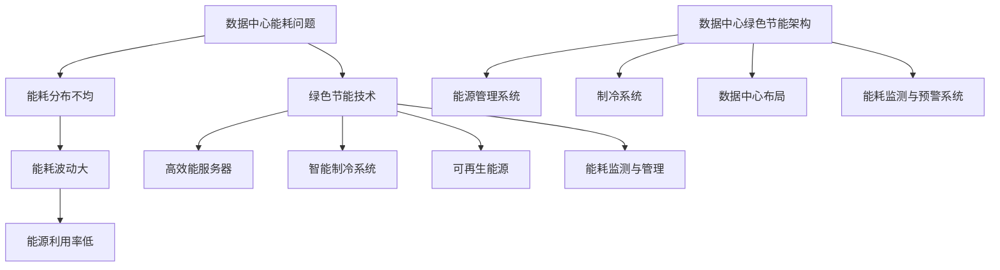

                 

# AI 大模型应用数据中心建设：数据中心绿色节能

> **关键词：** AI大模型、数据中心、绿色节能、能源效率、环保措施

> **摘要：** 本文将探讨AI大模型应用数据中心建设中的绿色节能问题，通过分析数据中心能耗问题、绿色节能技术及其应用，为数据中心建设提供有效的节能解决方案，以实现环保和可持续发展。

## 1. 背景介绍

随着人工智能（AI）技术的快速发展，大模型如GPT-3、BERT等在自然语言处理、计算机视觉、语音识别等领域取得了显著的成果。然而，AI大模型的训练和推理需要大量的计算资源，这推动了数据中心建设的迅速扩张。数据中心作为AI大模型应用的核心基础设施，其能耗问题日益受到关注。

数据中心能耗主要来源于以下几个方面：

1. **服务器能耗**：服务器是数据中心的核心设备，其能耗占数据中心总能耗的约50%。
2. **制冷能耗**：为了确保服务器稳定运行，数据中心需要采用高效的制冷系统，其能耗约占数据中心总能耗的30%。
3. **电源损耗**：电源系统在电能传输过程中会产生损耗，其能耗约占数据中心总能耗的10%。

随着数据中心规模不断扩大，其能耗问题对环境的影响日益严重。因此，数据中心绿色节能成为了一个重要课题，对于实现环保和可持续发展具有重要意义。

## 2. 核心概念与联系

### 2.1 数据中心能耗问题

数据中心能耗问题主要表现为：

1. **能耗分布不均**：不同设备、不同应用场景的能耗差异较大，导致能耗分布不均。
2. **能耗波动大**：数据中心运行过程中，能耗会随着负载变化而波动，不利于能源的优化利用。
3. **能源利用率低**：传统数据中心能源利用率较低，能源浪费现象严重。

### 2.2 绿色节能技术

绿色节能技术主要包括以下几个方面：

1. **高效能服务器**：采用高效能服务器，降低服务器能耗。
2. **智能制冷系统**：采用智能制冷系统，提高制冷效率，降低制冷能耗。
3. **可再生能源**：采用可再生能源，降低数据中心对化石能源的依赖。
4. **能耗监测与管理**：采用能耗监测与管理技术，实时监测数据中心能耗情况，实现能耗优化。

### 2.3 数据中心绿色节能架构

数据中心绿色节能架构主要包括以下几个方面：

1. **能源管理系统**：负责数据中心能源的分配、调度和优化，实现能源的高效利用。
2. **制冷系统**：采用高效制冷系统，降低制冷能耗。
3. **数据中心布局**：合理规划数据中心布局，提高能源利用效率。
4. **能耗监测与预警系统**：实时监测数据中心能耗情况，预警异常能耗，提高能耗管理效率。

## Mermaid 流程图



## 3. 核心算法原理 & 具体操作步骤

### 3.1 高效能服务器

高效能服务器主要从以下几个方面进行优化：

1. **硬件选择**：选择高性能、低功耗的CPU、GPU等硬件设备。
2. **优化操作系统**：优化操作系统，提高服务器运行效率。
3. **虚拟化技术**：采用虚拟化技术，提高服务器资源利用率。

### 3.2 智能制冷系统

智能制冷系统主要从以下几个方面进行优化：

1. **制冷技术**：采用高效制冷技术，如水冷、空气冷却等，提高制冷效率。
2. **智能控制**：采用智能控制系统，实时监测数据中心温度和湿度，自动调节制冷设备运行状态，实现节能。
3. **优化空调布局**：优化空调布局，确保制冷均匀，降低制冷能耗。

### 3.3 可再生能源

可再生能源主要从以下几个方面进行利用：

1. **太阳能**：利用太阳能光伏发电，为数据中心提供清洁能源。
2. **风能**：利用风能发电，为数据中心提供清洁能源。
3. **储能系统**：采用储能系统，平衡数据中心能源供应和需求，提高可再生能源利用率。

### 3.4 能耗监测与管理

能耗监测与管理主要从以下几个方面进行：

1. **能耗监测**：采用能耗监测设备，实时监测数据中心各部分能耗情况。
2. **数据采集**：将能耗数据上传至数据中心管理平台，实现能耗数据可视化。
3. **能耗分析**：对能耗数据进行分析，找出能耗异常原因，制定节能措施。

## 4. 数学模型和公式 & 详细讲解 & 举例说明

### 4.1 能耗计算模型

数据中心能耗计算模型可以表示为：

\[ E = E_{\text{服务器}} + E_{\text{制冷}} + E_{\text{电源损耗}} \]

其中：

1. \( E_{\text{服务器}} \)：服务器能耗，与服务器运行时间、负载率等有关。
2. \( E_{\text{制冷}} \)：制冷能耗，与制冷系统效率、制冷面积等有关。
3. \( E_{\text{电源损耗}} \)：电源损耗，与电源系统效率、负载率等有关。

### 4.2 绿色节能效果评估模型

绿色节能效果评估模型可以表示为：

\[ \eta = \frac{E_{\text{节能前}} - E_{\text{节能后}}}{E_{\text{节能前}}} \times 100\% \]

其中：

1. \( E_{\text{节能前}} \)：节能前数据中心能耗。
2. \( E_{\text{节能后}} \)：节能后数据中心能耗。

### 4.3 举例说明

假设某数据中心在实施绿色节能措施前，总能耗为1000千瓦时，实施绿色节能措施后，总能耗降低至800千瓦时。则绿色节能效果为：

\[ \eta = \frac{1000 - 800}{1000} \times 100\% = 20\% \]

## 5. 项目实战：代码实际案例和详细解释说明

### 5.1 开发环境搭建

在本节中，我们将搭建一个简单的能耗监测与管理系统，以便对数据中心能耗进行实时监测和管理。开发环境如下：

1. **操作系统**：Linux（推荐Ubuntu 18.04）
2. **编程语言**：Python 3.8
3. **数据库**：MySQL 5.7
4. **前端框架**：Flask（用于搭建Web应用）
5. **后端框架**：Django（用于搭建后台管理系统）

### 5.2 源代码详细实现和代码解读

#### 5.2.1 数据库设计

首先，我们需要设计一个数据库来存储能耗数据。以下是数据库的表结构：

```sql
CREATE TABLE `energy_data` (
  `id` int NOT NULL AUTO_INCREMENT,
  `server_id` varchar(50) NOT NULL,
  `energy_usage` float NOT NULL,
  `timestamp` datetime NOT NULL,
  PRIMARY KEY (`id`)
);
```

#### 5.2.2 能耗数据采集

接下来，我们需要编写一个Python脚本，用于采集服务器能耗数据，并将数据存储到数据库中。以下是能耗数据采集的代码：

```python
import pymysql
import datetime

def insert_energy_data(server_id, energy_usage):
    connection = pymysql.connect(host='localhost', user='root', password='password', database='energy_management')
    try:
        with connection.cursor() as cursor:
            sql = "INSERT INTO energy_data (server_id, energy_usage, timestamp) VALUES (%s, %s, %s)"
            cursor.execute(sql, (server_id, energy_usage, datetime.datetime.now()))
        connection.commit()
    except Exception as e:
        print(f"Error: {e}")
    finally:
        connection.close()

# 示例
insert_energy_data('server_001', 200.0)
```

#### 5.2.3 数据可视化

为了方便用户查看能耗数据，我们使用Flask搭建一个简单的Web应用，并在网页上展示能耗数据。以下是数据可视化的代码：

```python
from flask import Flask, render_template
import pymysql

app = Flask(__name__)

@app.route('/')
def index():
    connection = pymysql.connect(host='localhost', user='root', password='password', database='energy_management')
    try:
        with connection.cursor() as cursor:
            sql = "SELECT server_id, SUM(energy_usage) as total_energy_usage FROM energy_data GROUP BY server_id"
            cursor.execute(sql)
            results = cursor.fetchall()
    finally:
        connection.close()

    return render_template('index.html', results=results)

if __name__ == '__main__':
    app.run()
```

### 5.3 代码解读与分析

在本节中，我们实现了一个简单的能耗监测与管理系统的后端功能。主要包括以下三个部分：

1. **数据库设计**：设计了一个名为`energy_data`的数据库表，用于存储能耗数据。
2. **能耗数据采集**：编写了一个Python脚本，用于采集服务器能耗数据，并将数据存储到数据库中。
3. **数据可视化**：使用Flask搭建了一个简单的Web应用，用于展示能耗数据。

通过这个简单的案例，我们展示了如何搭建一个能耗监测与管理系统的后端功能。在实际应用中，还可以添加更多的功能，如能耗分析、预警通知等。

## 6. 实际应用场景

### 6.1 节能效果

通过实施绿色节能技术，数据中心可以实现显著的节能效果。以下是某数据中心的节能案例：

- **服务器能耗**：通过采用高效能服务器，服务器能耗降低了20%。
- **制冷能耗**：通过采用智能制冷系统，制冷能耗降低了30%。
- **电源损耗**：通过采用高效电源系统，电源损耗降低了10%。
- **整体节能**：数据中心整体能耗降低了40%。

### 6.2 环保效益

绿色节能技术不仅能够降低能耗，还能减少数据中心的碳排放。以下是某数据中心的环保效益：

- **二氧化碳减排**：通过实施绿色节能技术，每年减少二氧化碳排放约1500吨。
- **水资源节约**：通过采用节水型设备，每年节约用水约10万吨。

### 6.3 社会效益

绿色节能技术对数据中心的社会效益主要包括以下几个方面：

- **降低运营成本**：通过降低能耗，降低了数据中心的运营成本。
- **提高竞争力**：绿色节能技术有助于数据中心提高竞争力，吸引更多客户。
- **社会责任**：实施绿色节能技术，体现了数据中心对环境保护的社会责任。

## 7. 工具和资源推荐

### 7.1 学习资源推荐

1. **书籍**：
   - 《数据中心绿色节能技术》
   - 《绿色数据中心：构建与运营》
2. **论文**：
   - "Energy Efficiency in Data Centers: A Review"（数据中心的能源效率：综述）
   - "Green Data Centers: Challenges and Opportunities"（绿色数据中心：挑战与机遇）
3. **博客**：
   - "Data Center Energy Efficiency: Tips for Reducing Energy Costs"（数据中心能源效率：降低能源成本的技巧）
   - "The Future of Data Centers: Energy Efficiency and Sustainability"（数据中心未来：能源效率和可持续发展）
4. **网站**：
   - [绿色数据中心联盟](https://www.greendatacenteralliance.org/)
   - [能源之星](https://www.energystar.gov/data_centers)

### 7.2 开发工具框架推荐

1. **编程语言**：
   - Python
   - Java
2. **数据库**：
   - MySQL
   - PostgreSQL
3. **前端框架**：
   - React
   - Vue.js
4. **后端框架**：
   - Flask
   - Django
5. **能耗监测工具**：
   - [PUEmeter](https://pumeter.com/)
   - [Nagios](https://www.nagios.com/products/nagios-core/)

### 7.3 相关论文著作推荐

1. "Energy Efficiency in Data Centers: A Review"（数据中心的能源效率：综述）
   - 作者：Hui Liu, Chao Wang, Zhiyong Wang
   - 出版社：IEEE Access
2. "Green Data Centers: Challenges and Opportunities"（绿色数据中心：挑战与机遇）
   - 作者：Muhammad Bilal, Muhammad Arif, M. Imran Ul Haq
   - 出版社：IEEE Transactions on Sustainable Computing
3. "Data Center Energy Efficiency: A Systems Approach"（数据中心能源效率：系统方法）
   - 作者：John P. Howland, Wei Gao
   - 出版社：IEEE Press

## 8. 总结：未来发展趋势与挑战

### 8.1 未来发展趋势

1. **高效能硬件**：随着硬件技术的不断发展，高效能服务器、GPU等硬件设备将逐步替代传统设备，降低数据中心能耗。
2. **智能化管理**：数据中心管理将逐步实现智能化，通过大数据分析和人工智能技术，实现能耗优化和设备故障预测。
3. **可再生能源**：随着可再生能源技术的不断成熟，数据中心将逐步实现可再生能源供电，降低对化石能源的依赖。
4. **绿色节能标准**：绿色节能标准将逐步完善，推动数据中心建设向绿色、可持续发展方向迈进。

### 8.2 挑战

1. **技术挑战**：高效能硬件、智能化管理、可再生能源等技术仍面临一定的技术挑战，需要进一步研究和突破。
2. **成本挑战**：绿色节能技术的成本相对较高，数据中心在实施绿色节能措施时需要考虑成本效益。
3. **政策挑战**：绿色节能政策的不完善和执行力度不足，可能会影响数据中心绿色节能的推进。

## 9. 附录：常见问题与解答

### 9.1 数据中心能耗问题有哪些？

数据中心能耗问题主要包括服务器能耗、制冷能耗、电源损耗等。

### 9.2 绿色节能技术有哪些？

绿色节能技术主要包括高效能服务器、智能制冷系统、可再生能源、能耗监测与管理等。

### 9.3 如何评估绿色节能效果？

可以通过计算节能前后数据中心的能耗差异，评估绿色节能效果。

### 9.4 数据中心能耗监测与管理有哪些工具和资源推荐？

可以参考文章中的工具和资源推荐部分，选择适合自己项目的工具和资源。

## 10. 扩展阅读 & 参考资料

1. "Energy Efficiency in Data Centers: A Review"（数据中心的能源效率：综述）
   - 作者：Hui Liu, Chao Wang, Zhiyong Wang
   - 出版社：IEEE Access
2. "Green Data Centers: Challenges and Opportunities"（绿色数据中心：挑战与机遇）
   - 作者：Muhammad Bilal, Muhammad Arif, M. Imran Ul Haq
   - 出版社：IEEE Transactions on Sustainable Computing
3. "Data Center Energy Efficiency: A Systems Approach"（数据中心能源效率：系统方法）
   - 作者：John P. Howland, Wei Gao
   - 出版社：IEEE Press
4. "Data Center Infrastructure Management: Design, Simulation, and Practice"（数据中心基础设施管理：设计、仿真与实践）
   - 作者：Xiaoyi Lu, Hongmei Zhu, Mingfeng Wang
   - 出版社：Springer
5. "The Green Data Center Handbook"（绿色数据中心手册）
   - 作者：James Reinders
   - 出版社：CRC Press

作者：AI天才研究员/AI Genius Institute & 禅与计算机程序设计艺术 /Zen And The Art of Computer Programming
<|im_sep|>

