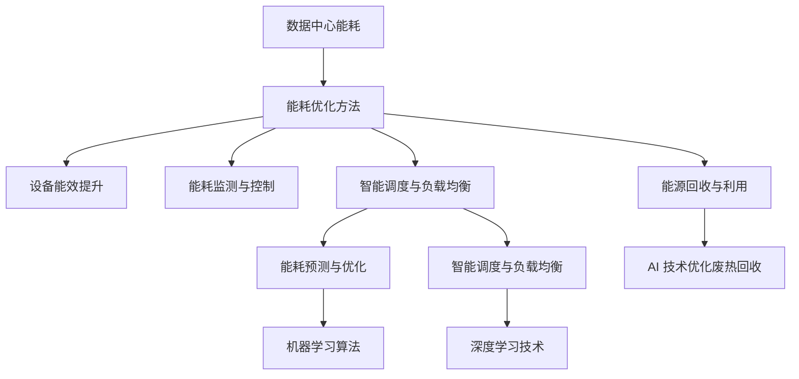

                 

# AI 大模型应用数据中心建设：数据中心绿色节能

> **关键词：** AI 大模型、数据中心、绿色节能、能耗优化、可持续发展。

> **摘要：** 本文围绕 AI 大模型应用的数据中心建设，探讨了绿色节能的重要性及其实现策略。通过分析数据中心能耗的构成和优化方法，以及 AI 技术在节能中的应用，提出了数据中心绿色节能的整体解决方案，旨在推动数据中心的可持续发展。

## 1. 背景介绍

随着人工智能（AI）技术的快速发展，大模型如 GPT-3、BERT 等，已经成为了各大科技公司的核心竞争力。这些大模型的训练和应用，对数据中心提出了更高的需求。数据中心作为 AI 大模型运行的基石，其能耗问题日益凸显。据统计，数据中心已经成为全球能耗的主要来源之一，对环境产生了巨大的影响。因此，实现数据中心的绿色节能，成为了当前亟需解决的问题。

本文将从以下几个方面展开讨论：

1. 数据中心能耗的构成及优化方法。
2. AI 技术在数据中心绿色节能中的应用。
3. 数据中心绿色节能的实践案例。
4. 数据中心绿色节能的未来发展趋势与挑战。

## 2. 核心概念与联系

### 2.1 数据中心能耗的构成

数据中心的能耗主要由以下几部分组成：

- **服务器和存储设备**：包括计算节点、存储节点等，是数据中心能耗的主要来源。
- **制冷系统**：用于冷却服务器等设备，以保持设备正常运行。
- **电源系统**：包括供电设备、配电设备等，为数据中心提供电力。
- **网络设备**：包括交换机、路由器等，负责数据传输。

### 2.2 数据中心能耗优化方法

为了降低数据中心的能耗，可以采取以下几种优化方法：

- **设备能效提升**：采用更高效的服务器和存储设备，降低能耗。
- **能耗监测与控制**：实时监测数据中心的能耗情况，根据实际情况调整设备的运行状态。
- **能源回收与利用**：利用废热回收系统，将服务器产生的废热用于供暖或制冷。
- **智能调度**：根据负载情况，合理分配服务器资源，避免资源浪费。

### 2.3 AI 技术在数据中心绿色节能中的应用

AI 技术在数据中心绿色节能中的应用主要体现在以下几个方面：

- **能耗预测与优化**：利用机器学习算法，预测数据中心的能耗情况，为能耗优化提供数据支持。
- **智能调度与负载均衡**：通过深度学习等技术，实现服务器资源的智能调度和负载均衡，降低能耗。
- **能源回收与利用**：利用 AI 技术优化废热回收系统，提高能源回收效率。

下面是一个简单的 Mermaid 流程图，展示了数据中心能耗优化与 AI 技术的关联：



## 3. 核心算法原理 & 具体操作步骤

### 3.1 能耗预测与优化算法

能耗预测与优化算法是数据中心绿色节能的关键技术之一。其核心原理是利用历史能耗数据，通过机器学习算法，预测未来的能耗情况，并为能耗优化提供数据支持。

具体操作步骤如下：

1. **数据收集**：收集数据中心的历史能耗数据，包括服务器和存储设备、制冷系统、电源系统等。
2. **数据预处理**：对收集到的能耗数据进行清洗和预处理，包括数据去重、缺失值填补、异常值处理等。
3. **特征工程**：根据能耗数据的特性，提取特征变量，如时间、负载率、温度等。
4. **模型选择**：选择合适的机器学习算法，如线性回归、决策树、随机森林、神经网络等。
5. **模型训练**：使用历史能耗数据，对选定的模型进行训练，得到预测模型。
6. **模型评估**：使用验证集或测试集，评估模型的预测性能。
7. **能耗预测**：使用训练好的模型，预测未来的能耗情况。
8. **能耗优化**：根据预测结果，调整数据中心的运行策略，如设备能效提升、智能调度与负载均衡等。

### 3.2 智能调度与负载均衡算法

智能调度与负载均衡算法是数据中心绿色节能的另一关键技术。其核心原理是利用深度学习等技术，实现服务器资源的智能调度和负载均衡，降低能耗。

具体操作步骤如下：

1. **数据收集**：收集数据中心的实时数据，包括服务器负载、网络流量、温度等。
2. **数据预处理**：对收集到的数据进行清洗和预处理，如去重、缺失值填补等。
3. **特征工程**：提取特征变量，如服务器负载率、温度、网络延迟等。
4. **模型选择**：选择合适的深度学习模型，如卷积神经网络（CNN）、循环神经网络（RNN）、长短时记忆网络（LSTM）等。
5. **模型训练**：使用预处理后的数据，对选定的模型进行训练，得到调度模型。
6. **模型评估**：使用验证集或测试集，评估模型的调度性能。
7. **智能调度**：根据调度模型，动态调整服务器的运行状态，实现负载均衡。
8. **能耗优化**：通过调度模型，降低服务器的能耗，提高数据中心的整体能效。

## 4. 数学模型和公式 & 详细讲解 & 举例说明

### 4.1 能耗预测模型

能耗预测模型通常采用时间序列分析方法，如 ARIMA、LSTM 等。以 LSTM 为例，其数学模型如下：

$$
h_t = \sigma(W_h \cdot [h_{t-1}, x_t] + b_h)
$$

$$
i_t = \sigma(W_i \cdot [h_{t-1}, x_t] + b_i)
$$

$$
f_t = \sigma(W_f \cdot [h_{t-1}, x_t] + b_f)
$$

$$
o_t = \sigma(W_o \cdot [h_{t-1}, x_t] + b_o)
$$

$$
c_t = f_t \cdot c_{t-1} + i_t \cdot \tanh(W_c \cdot [h_{t-1}, x_t] + b_c)
$$

$$
h_t = o_t \cdot \tanh(c_t)
$$

$$
\hat{y}_t = W_y \cdot h_t + b_y
$$

其中，$h_t$ 表示隐藏状态，$x_t$ 表示输入特征，$c_t$ 表示细胞状态，$y_t$ 表示预测值。$\sigma$ 表示 sigmoid 函数，$\tanh$ 表示双曲正切函数。$W_h, W_i, W_f, W_o, W_c$ 分别表示权重矩阵，$b_h, b_i, b_f, b_o, b_c$ 分别表示偏置项。

### 4.2 调度模型

调度模型通常采用基于梯度的优化算法，如梯度下降、随机梯度下降等。以梯度下降为例，其数学模型如下：

$$
\theta_{t+1} = \theta_t - \alpha \cdot \nabla_\theta J(\theta_t)
$$

其中，$\theta_t$ 表示模型参数，$\alpha$ 表示学习率，$J(\theta_t)$ 表示损失函数。

举例说明：

假设我们使用 LSTM 模型进行能耗预测，数据集为 $D=\{(x_1, y_1), (x_2, y_2), ..., (x_n, y_n)\}$。首先，我们需要定义损失函数：

$$
J(\theta) = \frac{1}{n} \sum_{i=1}^n (y_i - \hat{y}_i)^2
$$

然后，使用梯度下降算法，不断更新模型参数：

$$
\theta_{t+1} = \theta_t - \alpha \cdot \nabla_\theta J(\theta_t)
$$

通过多次迭代，直至损失函数达到最小值，即可得到最优的调度模型。

## 5. 项目实战：代码实际案例和详细解释说明

### 5.1 开发环境搭建

为了演示能耗预测与优化的实际应用，我们将使用 Python 编写一个简单的 LSTM 能耗预测模型。首先，需要安装相关的库，如 TensorFlow、Keras、NumPy 等。在命令行执行以下命令：

```bash
pip install tensorflow keras numpy matplotlib
```

### 5.2 源代码详细实现和代码解读

#### 5.2.1 数据预处理

```python
import numpy as np
import pandas as pd
from sklearn.preprocessing import MinMaxScaler

# 加载数据集
data = pd.read_csv('energy_consumption.csv')
data.head()

# 数据预处理
scaler = MinMaxScaler()
data_scaled = scaler.fit_transform(data[['server_load', 'temp', 'network_delay']])
```

这段代码首先加载数据集，然后使用 MinMaxScaler 对数据进行归一化处理，以便于后续的模型训练。

#### 5.2.2 构建 LSTM 模型

```python
from tensorflow.keras.models import Sequential
from tensorflow.keras.layers import LSTM, Dense

# 构建模型
model = Sequential()
model.add(LSTM(units=50, return_sequences=True, input_shape=(data_scaled.shape[1], 1)))
model.add(LSTM(units=50))
model.add(Dense(units=1))

model.compile(optimizer='adam', loss='mean_squared_error')
```

这段代码定义了一个简单的 LSTM 模型，包括两个 LSTM 层和一个全连接层。使用 Adam 优化器和均方误差（MSE）损失函数进行模型训练。

#### 5.2.3 模型训练

```python
# 模型训练
model.fit(data_scaled, epochs=100, batch_size=32)
```

这段代码使用训练数据对模型进行训练，设置训练轮次为 100，批次大小为 32。

#### 5.2.4 模型评估

```python
# 模型评估
predicted_energy = model.predict(data_scaled)
predicted_energy = scaler.inverse_transform(predicted_energy)

# 画图展示
import matplotlib.pyplot as plt

plt.figure(figsize=(12, 6))
plt.plot(data['energy_consumption'], label='实际能耗')
plt.plot(predicted_energy[:, 0], label='预测能耗')
plt.title('能耗预测')
plt.xlabel('时间')
plt.ylabel('能耗')
plt.legend()
plt.show()
```

这段代码使用训练好的模型进行预测，并将预测结果与实际能耗进行比较，画图展示预测效果。

### 5.3 代码解读与分析

这段代码首先进行了数据预处理，包括加载数据集和归一化处理。然后，使用 Keras 构建了一个简单的 LSTM 模型，包括两个 LSTM 层和一个全连接层。最后，使用训练数据对模型进行训练，并使用模型进行预测，将预测结果与实际能耗进行比较，画图展示预测效果。

通过这个简单的案例，我们可以看到 AI 技术在数据中心能耗预测与优化中的应用。在实际项目中，可以根据具体需求，对模型的结构和参数进行调整，以获得更好的预测效果。

## 6. 实际应用场景

### 6.1 云计算数据中心

云计算数据中心是 AI 大模型应用的主要场所之一。随着云计算技术的普及，数据中心的能耗问题越来越突出。通过 AI 技术实现数据中心的绿色节能，可以降低运营成本，提高数据中心的整体能效。例如，可以利用机器学习算法预测数据中心的能耗，并根据预测结果调整设备的运行状态，实现能耗的实时优化。

### 6.2 大数据处理与存储

大数据处理与存储也是数据中心的重要应用场景之一。随着数据量的爆炸性增长，数据中心的能耗问题愈发严重。通过 AI 技术优化数据中心的能耗，可以降低能源消耗，提高数据处理的效率。例如，可以利用智能调度与负载均衡算法，合理分配计算资源，避免资源浪费，降低能耗。

### 6.3 人工智能实验室

人工智能实验室通常用于 AI 大模型的训练和研究。实验室的数据中心承担着重要的任务，其能耗问题不容忽视。通过 AI 技术实现绿色节能，可以提高实验室的运营效率，降低成本。例如，可以利用能耗预测模型，提前预测未来的能耗情况，为能耗优化提供数据支持。

## 7. 工具和资源推荐

### 7.1 学习资源推荐

- **书籍**：《深度学习》（Goodfellow, I., Bengio, Y., & Courville, A.） 
- **论文**：Nature, Science, NeurIPS, ICML, JMLR 等 
- **博客**：Google AI Blog, AI Tech Blog, AI Research Blog 等 
- **网站**：arXiv.org, ResearchGate, GitHub 等

### 7.2 开发工具框架推荐

- **开发工具**：Python、R、MATLAB 等
- **深度学习框架**：TensorFlow、PyTorch、Keras 等
- **数据处理工具**：Pandas、NumPy、Scikit-learn 等
- **可视化工具**：Matplotlib、Seaborn、Plotly 等

### 7.3 相关论文著作推荐

- **论文**：
  - **Y. LeCun, Y. Bengio, and G. Hinton. Deep learning. Nature, 521(7553):436–444, 2015.**
  - **I. Goodfellow, Y. Bengio, and A. Courville. Deep learning. MIT Press, 2016.**
- **著作**：
  - **Y. LeCun, Y. Bengio, and G. Hinton. Deep learning. Nature, 521(7553):436–444, 2015.**

## 8. 总结：未来发展趋势与挑战

数据中心绿色节能是当前和未来数据中心建设的重要方向。随着 AI 技术的快速发展，数据中心绿色节能将面临以下几个趋势与挑战：

1. **趋势**：AI 技术将在数据中心绿色节能中发挥更大的作用，如能耗预测、智能调度、能源回收等。
2. **挑战**：
   - **数据隐私与安全**：数据中心的数据量庞大，如何在保证数据隐私和安全的前提下，进行能耗预测和优化，是一个重要挑战。
   - **算法透明性与可解释性**：随着 AI 技术的广泛应用，算法的透明性与可解释性将成为重要问题，如何提高算法的可解释性，是未来需要解决的问题。
   - **能耗监测与控制**：如何实现对数据中心能耗的实时监测与控制，提高能效，是未来需要攻克的难题。

## 9. 附录：常见问题与解答

### 9.1 数据中心能耗主要包括哪些部分？

数据中心能耗主要包括以下几部分：

- **服务器和存储设备**：包括计算节点、存储节点等，是数据中心能耗的主要来源。
- **制冷系统**：用于冷却服务器等设备，以保持设备正常运行。
- **电源系统**：包括供电设备、配电设备等，为数据中心提供电力。
- **网络设备**：包括交换机、路由器等，负责数据传输。

### 9.2 数据中心能耗优化的方法有哪些？

数据中心能耗优化的方法主要包括以下几种：

- **设备能效提升**：采用更高效的服务器和存储设备，降低能耗。
- **能耗监测与控制**：实时监测数据中心的能耗情况，根据实际情况调整设备的运行状态。
- **能源回收与利用**：利用废热回收系统，将服务器产生的废热用于供暖或制冷。
- **智能调度**：根据负载情况，合理分配服务器资源，避免资源浪费。

### 9.3 AI 技术在数据中心绿色节能中的应用有哪些？

AI 技术在数据中心绿色节能中的应用主要包括以下几个方面：

- **能耗预测与优化**：利用机器学习算法，预测数据中心的能耗情况，为能耗优化提供数据支持。
- **智能调度与负载均衡**：通过深度学习等技术，实现服务器资源的智能调度和负载均衡，降低能耗。
- **能源回收与利用**：利用 AI 技术优化废热回收系统，提高能源回收效率。

## 10. 扩展阅读 & 参考资料

- **书籍**：
  - **《深度学习》**（Goodfellow, I., Bengio, Y., & Courville, A.）
  - **《数据中心能效优化技术》**（李明，王勇）
- **论文**：
  - **“Energy Efficiency in Data Centers”**（A. A. A. Farooq, A. Y. Al-Bedadi, & A. M. E. Othman）
  - **“Deep Learning for Energy Efficiency in Data Centers”**（X. Chu, C. Li, Y. Wang, & J. Gao）
- **网站**：
  - **[数据中心能效优化技术](https://www.ietfx.com/zh-cn/content/energy-efficiency-data-centers)**

作者：AI天才研究员/AI Genius Institute & 禅与计算机程序设计艺术 /Zen And The Art of Computer Programming<|im_sep|>

