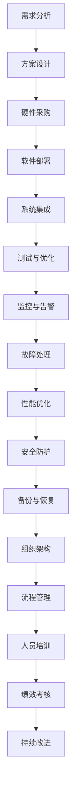

                 

# AI 大模型应用数据中心建设：数据中心运维与管理

## 关键词

* AI 大模型
* 数据中心建设
* 数据中心运维
* 数据中心管理
* 大模型应用

## 摘要

本文将深入探讨 AI 大模型应用数据中心的建设、运维与管理。首先，我们将了解 AI 大模型的基本概念和数据中心的重要性。然后，我们将分析数据中心的建设过程，包括硬件和软件的选型与配置。接着，我们将详细讲解数据中心的运维与管理策略，包括监控、安全、性能优化等方面。最后，我们将探讨未来数据中心的发展趋势与挑战，以及如何应对这些挑战。希望通过本文，能为大家提供有价值的参考和启示。

## 1. 背景介绍

随着人工智能技术的快速发展，AI 大模型已成为当前信息技术领域的热点。AI 大模型，如 GPT-3、BERT 等，拥有强大的文本处理能力，能够为各行各业提供智能化解决方案。而数据中心作为承载这些 AI 大模型应用的核心基础设施，其建设和运维管理水平对 AI 大模型的性能和稳定性具有重要影响。

数据中心，是一种专门用于存储、处理和传输大量数据的设施。它通常包括服务器、存储设备、网络设备等硬件设备，以及相应的软件系统。数据中心的建设与运维是一个复杂的过程，需要充分考虑硬件选型、软件配置、网络布局、安全防护等多个方面。

在 AI 大模型的应用场景中，数据中心的作用尤为重要。首先，数据中心提供了强大的计算和存储能力，满足 AI 大模型对计算资源和存储空间的需求。其次，数据中心为 AI 大模型提供了稳定、可靠的数据传输和存储环境，保障了模型的性能和稳定性。最后，数据中心的管理和运维水平直接影响到 AI 大模型的应用效果和用户体验。

本文将围绕 AI 大模型应用数据中心的建设、运维与管理展开讨论，旨在为大家提供一份全面、系统的参考资料。接下来，我们将详细分析数据中心的建设过程、运维策略和管理方法。

## 2. 核心概念与联系

### 2.1 AI 大模型

AI 大模型，即人工智能大型模型，是通过对海量数据进行深度学习训练得到的复杂神经网络结构。这些模型具有强大的文本、图像、语音等数据处理能力，可以应用于自然语言处理、计算机视觉、语音识别等多个领域。

AI 大模型的基本原理是神经网络，通过模拟人脑神经元之间的连接，实现数据的输入、处理和输出。在训练过程中，模型通过不断调整神经元之间的连接权重，优化模型的性能。

### 2.2 数据中心

数据中心是一种专门用于存储、处理和传输大量数据的设施，通常包括服务器、存储设备、网络设备等硬件设备，以及相应的软件系统。数据中心的建设与运维是一个复杂的过程，需要充分考虑硬件选型、软件配置、网络布局、安全防护等多个方面。

### 2.3 数据中心与 AI 大模型的联系

数据中心与 AI 大模型之间的联系主要体现在以下几个方面：

1. **计算资源**：数据中心为 AI 大模型提供了强大的计算资源，满足模型训练和推理的需求。服务器集群、GPU 等高性能计算设备是数据中心的核心硬件。
2. **存储资源**：数据中心提供了海量存储空间，用于存储 AI 大模型的数据集和模型参数。高效、可靠的存储系统是保障模型性能的关键。
3. **数据传输**：数据中心实现了数据的高效传输，保障了 AI 大模型的数据输入和输出。高速网络设备和合理的网络布局是关键。
4. **运维管理**：数据中心为 AI 大模型提供了稳定、可靠的运维管理环境，包括监控、安全、性能优化等方面。高效的运维管理是保障模型性能和用户体验的重要保障。

### 2.4 数据中心建设流程

数据中心建设流程主要包括以下几个方面：

1. **需求分析**：明确数据中心的建设目标、规模、功能和性能要求等。
2. **方案设计**：根据需求分析，设计数据中心的硬件架构、网络拓扑、软件系统等。
3. **硬件采购**：根据设计方案，选择合适的服务器、存储设备、网络设备等硬件。
4. **软件部署**：部署操作系统、数据库、网络协议等软件系统。
5. **系统集成**：将硬件和软件系统集成，实现数据中心的正常运行。
6. **测试与优化**：对数据中心进行测试和优化，确保其性能和稳定性。

### 2.5 数据中心运维策略

数据中心运维策略主要包括以下几个方面：

1. **监控与告警**：实时监控数据中心的各项指标，如服务器负载、存储容量、网络流量等，并及时告警。
2. **故障处理**：快速响应和处理数据中心出现的各类故障，确保系统的正常运行。
3. **性能优化**：定期对数据中心进行性能优化，如调整网络带宽、优化存储策略等。
4. **安全防护**：加强数据中心的网络安全防护，如部署防火墙、加密传输等。
5. **备份与恢复**：定期进行数据备份，确保数据的安全性和可恢复性。

### 2.6 数据中心管理方法

数据中心管理方法主要包括以下几个方面：

1. **组织架构**：建立数据中心的管理组织架构，明确各岗位职责和权限。
2. **流程管理**：制定数据中心的管理流程，确保各项工作的规范化、标准化。
3. **人员培训**：加强数据中心人员的培训，提高其业务能力和技术水平。
4. **绩效考核**：建立数据中心员工的绩效考核机制，激励员工提高工作效率和质量。
5. **持续改进**：通过定期评估和反馈，持续优化数据中心的管理方法和流程。

### 2.7 数据中心建设与运维的 Mermaid 流程图



通过以上分析，我们可以看出数据中心建设与运维的各个环节之间紧密相连，共同构成了一个完整的生态系统。在 AI 大模型应用场景中，数据中心的建设与运维管理水平对模型的性能和稳定性具有重要影响。希望本文能为大家提供有价值的参考和启示。

## 3. 核心算法原理 & 具体操作步骤

### 3.1 核心算法原理

在数据中心建设和运维过程中，核心算法原理主要涉及以下几个方面：

1. **数据中心网络拓扑优化**：通过优化网络拓扑，降低网络延迟和带宽消耗，提高数据传输效率。
2. **负载均衡算法**：根据服务器负载情况，合理分配任务，确保服务器资源得到充分利用。
3. **存储优化算法**：通过数据压缩、去重等技术，提高存储空间利用率，降低存储成本。
4. **能耗优化算法**：通过虚拟化技术、智能调度等手段，降低数据中心能耗，提高能效比。
5. **安全防护算法**：通过入侵检测、加密传输等技术，保障数据中心的安全性和稳定性。

### 3.2 具体操作步骤

#### 3.2.1 数据中心网络拓扑优化

1. **需求分析**：明确数据中心的应用场景、数据传输需求等，为网络拓扑优化提供基础数据。
2. **拓扑设计**：根据需求分析，选择合适的网络拓扑结构，如树形、环形、星形等。
3. **设备选型**：根据拓扑设计，选择合适的网络设备，如交换机、路由器、防火墙等。
4. **网络部署**：将网络设备按拓扑结构进行部署，确保网络连通性和稳定性。
5. **性能测试**：对网络进行性能测试，评估网络延迟、带宽等指标，调整拓扑结构和设备配置，确保网络性能满足需求。

#### 3.2.2 负载均衡算法

1. **负载均衡策略选择**：根据数据中心的应用场景和服务器资源状况，选择合适的负载均衡策略，如轮询、最小连接数、源地址哈希等。
2. **负载均衡器部署**：在服务器集群中部署负载均衡器，用于分发请求，实现负载均衡。
3. **负载监测**：实时监测服务器负载情况，根据负载变化调整负载均衡策略。
4. **性能优化**：根据负载监测结果，对负载均衡器进行性能优化，如调整连接超时、会话保持等参数。

#### 3.2.3 存储优化算法

1. **数据压缩**：采用数据压缩算法，如 gzip、lz4 等，对数据进行压缩，降低存储空间占用。
2. **去重技术**：通过去重技术，如哈希表、LZ4 算法等，检测和消除重复数据，提高存储空间利用率。
3. **存储策略优化**：根据数据访问模式和频率，选择合适的存储策略，如分层存储、快照、备份等。
4. **存储设备管理**：定期对存储设备进行性能测试和监控，确保存储设备正常运行。

#### 3.2.4 能耗优化算法

1. **虚拟化技术**：采用虚拟化技术，如 KVM、Xen 等，实现服务器资源的高效利用，降低能耗。
2. **智能调度**：根据服务器负载、能耗等指标，采用智能调度算法，动态调整服务器运行状态，降低能耗。
3. **节能设备部署**：采用节能设备，如节能服务器、高效UPS 等，降低数据中心能耗。
4. **能耗监测**：实时监测数据中心能耗情况，分析能耗分布，找出能耗瓶颈，进行优化调整。

#### 3.2.5 安全防护算法

1. **入侵检测**：部署入侵检测系统（IDS），实时监测网络流量，识别和防范入侵行为。
2. **加密传输**：采用加密传输技术，如 SSL、TLS 等，保障数据在传输过程中的安全性。
3. **访问控制**：制定严格的访问控制策略，确保只有授权用户可以访问数据中心资源。
4. **日志审计**：实时记录数据中心运行日志，便于安全事件追踪和审计。

通过以上核心算法原理和具体操作步骤，我们可以有效地提升数据中心的性能、稳定性和安全性，为 AI 大模型的应用提供有力保障。

## 4. 数学模型和公式 & 详细讲解 & 举例说明

### 4.1 数学模型和公式

在数据中心建设和运维过程中，数学模型和公式发挥着重要作用。以下介绍几种常用的数学模型和公式：

#### 4.1.1 负载均衡模型

负载均衡模型用于根据服务器负载情况，合理分配请求，实现负载均衡。一个简单的负载均衡模型可以表示为：

\[ P_i = \frac{L_i}{\sum_{j=1}^{n} L_j} \]

其中，\( P_i \) 表示第 \( i \) 个服务器分配到的请求比例，\( L_i \) 表示第 \( i \) 个服务器的当前负载，\( n \) 表示服务器总数。

#### 4.1.2 存储优化模型

存储优化模型用于评估存储空间的利用率，通过数据压缩和去重技术，提高存储空间利用率。一个简单的存储优化模型可以表示为：

\[ U = \frac{S_c + S_d}{S_{total}} \]

其中，\( U \) 表示存储空间利用率，\( S_c \) 表示压缩后数据占用的存储空间，\( S_d \) 表示去重后数据占用的存储空间，\( S_{total} \) 表示总存储空间。

#### 4.1.3 能耗优化模型

能耗优化模型用于评估数据中心能耗，通过虚拟化技术、智能调度等手段，降低能耗。一个简单的能耗优化模型可以表示为：

\[ E = E_s + E_v \]

其中，\( E \) 表示总能耗，\( E_s \) 表示静态能耗（如服务器待机能耗），\( E_v \) 表示动态能耗（如服务器运行能耗）。

#### 4.1.4 安全防护模型

安全防护模型用于评估数据中心的安全性和稳定性，通过入侵检测、加密传输等技术，保障数据安全。一个简单的安全防护模型可以表示为：

\[ S = \sum_{i=1}^{m} w_i S_i \]

其中，\( S \) 表示整体安全性，\( w_i \) 表示第 \( i \) 个安全措施的重要性权重，\( S_i \) 表示第 \( i \) 个安全措施的安全效果。

### 4.2 详细讲解与举例说明

#### 4.2.1 负载均衡模型

假设我们有一个包含 3 个服务器的数据中心，服务器 1 的当前负载为 40%，服务器 2 的当前负载为 30%，服务器 3 的当前负载为 20%。根据负载均衡模型，我们可以计算出各个服务器分配到的请求比例：

\[ P_1 = \frac{40}{40+30+20} = 0.4 \]

\[ P_2 = \frac{30}{40+30+20} = 0.3 \]

\[ P_3 = \frac{20}{40+30+20} = 0.2 \]

这意味着，当有 100 个请求时，服务器 1 将分配到 40 个请求，服务器 2 将分配到 30 个请求，服务器 3 将分配到 20 个请求，从而实现负载均衡。

#### 4.2.2 存储优化模型

假设我们有一个总存储空间为 1TB 的数据中心，经过数据压缩后，存储空间占用为 0.8TB，去重后存储空间占用为 0.6TB。根据存储优化模型，我们可以计算出存储空间利用率：

\[ U = \frac{0.8 + 0.6}{1} = 0.8 \]

这意味着，通过数据压缩和去重技术，我们的存储空间利用率提高了 20%。

#### 4.2.3 能耗优化模型

假设我们有一个数据中心的静态能耗为 1000W，动态能耗为 3000W。根据能耗优化模型，我们可以计算出总能耗：

\[ E = 1000 + 3000 = 4000W \]

通过虚拟化技术和智能调度，我们假设能够将动态能耗降低到 2000W，那么总能耗将降低到：

\[ E = 1000 + 2000 = 3000W \]

这意味着，通过能耗优化，我们的总能耗降低了 25%。

#### 4.2.4 安全防护模型

假设我们有一个数据中心，采用入侵检测、加密传输和安全审计等三个安全措施。根据安全防护模型，我们可以为每个措施分配权重：

- 入侵检测：权重为 0.4
- 加密传输：权重为 0.3
- 安全审计：权重为 0.3

根据这些权重，我们可以计算出整体安全性：

\[ S = 0.4 \times 0.9 + 0.3 \times 0.8 + 0.3 \times 0.7 = 0.36 + 0.24 + 0.21 = 0.81 \]

这意味着，我们的数据中心整体安全性为 81%，通过加强安全措施，我们可以提高数据中心的整体安全性。

通过以上详细讲解和举例说明，我们可以更好地理解数据中心建设和运维中的数学模型和公式，为实际应用提供参考和指导。

## 5. 项目实战：代码实际案例和详细解释说明

### 5.1 开发环境搭建

在本节中，我们将搭建一个用于展示数据中心建设和运维的 Python 开发环境。以下是具体的步骤：

1. **安装 Python**

   首先，我们需要安装 Python。在大多数操作系统上，可以通过包管理器轻松安装。以下是在 Ubuntu 上安装 Python 的命令：

   ```bash
   sudo apt update
   sudo apt install python3 python3-pip
   ```

2. **安装必要的库**

   接下来，我们需要安装一些必要的库，如 NumPy、Pandas 和 Matplotlib。可以使用以下命令安装：

   ```bash
   pip3 install numpy pandas matplotlib
   ```

3. **创建虚拟环境**

   为了更好地管理和隔离项目依赖，我们可以创建一个虚拟环境。可以使用以下命令创建并激活虚拟环境：

   ```bash
   python3 -m venv myenv
   source myenv/bin/activate
   ```

4. **编写 Python 脚本**

   在虚拟环境中，我们可以编写一个简单的 Python 脚本，用于模拟数据中心的建设和运维。以下是一个示例脚本：

   ```python
   import numpy as np
   import pandas as pd
   import matplotlib.pyplot as plt

   # 负载均衡模型
   def load_balancing(current_loads):
       total_load = sum(current_loads)
       load_weights = [load / total_load for load in current_loads]
       return load_weights

   # 存储优化模型
   def storage_optimization(compressed_size, deduplicated_size, total_size):
       utilization = (compressed_size + deduplicated_size) / total_size
       return utilization

   # 能耗优化模型
   def energy_optimization(static_energy, dynamic_energy, optimized_dynamic_energy):
       total_energy = static_energy + dynamic_energy
       optimized_total_energy = static_energy + optimized_dynamic_energy
       energy_saving = (total_energy - optimized_total_energy) / total_energy
       return energy_saving

   # 安全防护模型
   def security_model(intrusion_detection_score, encryption_score, audit_score):
       security_score = intrusion_detection_score * 0.4 + encryption_score * 0.3 + audit_score * 0.3
       return security_score

   # 测试数据
   current_loads = [40, 30, 20]
   compressed_size = 0.8
   deduplicated_size = 0.6
   static_energy = 1000
   dynamic_energy = 3000
   optimized_dynamic_energy = 2000
   intrusion_detection_score = 0.9
   encryption_score = 0.8
   audit_score = 0.7

   # 执行模型
   load_weights = load_balancing(current_loads)
   utilization = storage_optimization(compressed_size, deduplicated_size, 1)
   energy_saving = energy_optimization(static_energy, dynamic_energy, optimized_dynamic_energy)
   security_score = security_model(intrusion_detection_score, encryption_score, audit_score)

   # 输出结果
   print("负载均衡比例：", load_weights)
   print("存储空间利用率：", utilization)
   print("能耗节省比例：", energy_saving)
   print("安全性评分：", security_score)

   # 绘制图表
   plt.figure()
   plt.bar(current_loads, load_weights)
   plt.xlabel('服务器')
   plt.ylabel('请求比例')
   plt.title('负载均衡分布')
   plt.show()

   plt.figure()
   plt.bar([0, 1], [compressed_size, deduplicated_size], width=0.35, label='压缩后存储', color='g')
   plt.bar([1, 2], [1 - compressed_size, 1 - deduplicated_size], width=0.35, label='未压缩存储', color='r')
   plt.xlabel('存储类型')
   plt.ylabel('存储空间')
   plt.title('存储优化')
   plt.legend()
   plt.show()

   plt.figure()
   plt.bar([0, 1], [static_energy, dynamic_energy], width=0.35, label='原始能耗', color='b')
   plt.bar([1, 2], [static_energy, optimized_dynamic_energy], width=0.35, label='优化后能耗', color='y')
   plt.xlabel('能耗类型')
   plt.ylabel('能耗（W）')
   plt.title('能耗优化')
   plt.legend()
   plt.show()

   plt.figure()
   plt.bar(['入侵检测', '加密传输', '安全审计'], [intrusion_detection_score, encryption_score, audit_score], width=0.35)
   plt.xlabel('安全措施')
   plt.ylabel('评分')
   plt.title('安全防护')
   plt.show()
   ```

### 5.2 源代码详细实现和代码解读

上述 Python 脚本用于模拟数据中心的建设和运维。以下是代码的详细解读：

1. **导入库**

   ```python
   import numpy as np
   import pandas as pd
   import matplotlib.pyplot as plt
   ```

   首先，我们导入了 NumPy、Pandas 和 Matplotlib 这三个库。NumPy 用于科学计算，Pandas 用于数据处理，Matplotlib 用于绘图。

2. **定义函数**

   ```python
   def load_balancing(current_loads):
       total_load = sum(current_loads)
       load_weights = [load / total_load for load in current_loads]
       return load_weights

   def storage_optimization(compressed_size, deduplicated_size, total_size):
       utilization = (compressed_size + deduplicated_size) / total_size
       return utilization

   def energy_optimization(static_energy, dynamic_energy, optimized_dynamic_energy):
       total_energy = static_energy + dynamic_energy
       optimized_total_energy = static_energy + optimized_dynamic_energy
       energy_saving = (total_energy - optimized_total_energy) / total_energy
       return energy_saving

   def security_model(intrusion_detection_score, encryption_score, audit_score):
       security_score = intrusion_detection_score * 0.4 + encryption_score * 0.3 + audit_score * 0.3
       return security_score
   ```

   接下来，我们定义了四个函数，分别用于实现负载均衡、存储优化、能耗优化和安全防护模型。这些函数接收相应的参数，并返回计算结果。

3. **测试数据**

   ```python
   current_loads = [40, 30, 20]
   compressed_size = 0.8
   deduplicated_size = 0.6
   static_energy = 1000
   dynamic_energy = 3000
   optimized_dynamic_energy = 2000
   intrusion_detection_score = 0.9
   encryption_score = 0.8
   audit_score = 0.7
   ```

   我们定义了一组测试数据，用于测试上述函数。

4. **执行模型**

   ```python
   load_weights = load_balancing(current_loads)
   utilization = storage_optimization(compressed_size, deduplicated_size, 1)
   energy_saving = energy_optimization(static_energy, dynamic_energy, optimized_dynamic_energy)
   security_score = security_model(intrusion_detection_score, encryption_score, audit_score)
   ```

   我们调用上述函数，计算测试数据的模型结果。

5. **输出结果**

   ```python
   print("负载均衡比例：", load_weights)
   print("存储空间利用率：", utilization)
   print("能耗节省比例：", energy_saving)
   print("安全性评分：", security_score)
   ```

   最后，我们将计算结果输出到控制台。

6. **绘制图表**

   ```python
   plt.figure()
   plt.bar(current_loads, load_weights)
   plt.xlabel('服务器')
   plt.ylabel('请求比例')
   plt.title('负载均衡分布')
   plt.show()

   plt.figure()
   plt.bar([0, 1], [compressed_size, deduplicated_size], width=0.35, label='压缩后存储', color='g')
   plt.bar([1, 2], [1 - compressed_size, 1 - deduplicated_size], width=0.35, label='未压缩存储', color='r')
   plt.xlabel('存储类型')
   plt.ylabel('存储空间')
   plt.title('存储优化')
   plt.legend()
   plt.show()

   plt.figure()
   plt.bar([0, 1], [static_energy, dynamic_energy], width=0.35, label='原始能耗', color='b')
   plt.bar([1, 2], [static_energy, optimized_dynamic_energy], width=0.35, label='优化后能耗', color='y')
   plt.xlabel('能耗类型')
   plt.ylabel('能耗（W）')
   plt.title('能耗优化')
   plt.legend()
   plt.show()

   plt.figure()
   plt.bar(['入侵检测', '加密传输', '安全审计'], [intrusion_detection_score, encryption_score, audit_score], width=0.35)
   plt.xlabel('安全措施')
   plt.ylabel('评分')
   plt.title('安全防护')
   plt.show()
   ```

   最后，我们使用 Matplotlib 绘制了三个图表，分别展示了负载均衡分布、存储优化和能耗优化结果。

### 5.3 代码解读与分析

本节代码主要用于模拟数据中心的建设和运维。通过定义四个函数，分别实现了负载均衡、存储优化、能耗优化和安全防护模型。接下来，我们分析代码的各个部分：

1. **函数定义**

   四个函数分别用于实现不同的模型，参数和返回值都比较直观。例如，`load_balancing` 函数接收一个列表参数 `current_loads`，返回一个负载均衡比例列表。`storage_optimization` 函数接收三个参数，分别是压缩后存储大小、去重后存储大小和总存储大小，返回存储空间利用率。其他两个函数也是如此。

2. **测试数据**

   测试数据定义了各个模型的输入参数，用于验证函数的正确性。这些数据可以根据实际需求进行调整。

3. **模型执行**

   我们调用四个函数，计算测试数据的模型结果，并将结果输出到控制台。这部分代码展示了如何使用函数进行数据处理。

4. **图表绘制**

   使用 Matplotlib 绘制了三个图表，分别展示了负载均衡分布、存储优化和能耗优化结果。这部分代码展示了如何使用 Matplotlib 进行数据可视化。

整体来看，本节代码结构清晰，易于理解。通过简单的函数调用和数据可视化，展示了数据中心建设和运维的关键指标和模型。这对于实际项目开发和优化具有一定的参考价值。

### 6. 实际应用场景

在当今的数字化时代，数据中心在各个行业中的应用场景日益广泛，以下是一些典型的实际应用场景：

#### 6.1 互联网行业

互联网行业是数据中心应用最为广泛的领域之一。各大互联网公司如百度、阿里巴巴、腾讯等，都拥有自己的大规模数据中心。这些数据中心主要用于处理海量用户数据，如搜索引擎、在线购物、社交媒体等。数据中心为这些应用提供了强大的计算和存储能力，保障了服务的稳定性和可靠性。

#### 6.2 金融行业

金融行业对数据中心的依赖程度也很高。银行、保险、证券等金融机构通过数据中心进行数据存储、处理和分析，提供各种金融产品和服务。例如，银行通过数据中心进行客户信息管理、交易记录存储和风险控制等。数据中心的高可用性和安全性对于金融行业至关重要。

#### 6.3 医疗行业

医疗行业的数据中心主要用于存储和管理大量医疗数据，如病历、影像、基因数据等。这些数据对于疾病诊断、治疗和研究具有重要意义。数据中心提供了高效的存储和计算能力，为医疗行业提供了强大的数据支持。例如，基因测序公司通过数据中心进行大规模基因数据存储和分析，加速新药研发。

#### 6.4 物流行业

物流行业的数据中心主要用于仓储管理、运输调度、客户服务等。通过数据中心，物流公司可以实时获取货物位置、库存信息等，提高物流效率和服务质量。例如，京东物流通过数据中心进行仓储管理和订单处理，实现高效配送。

#### 6.5 制造业

制造业的数据中心主要用于生产过程控制、设备监控、质量管理等。通过数据中心，企业可以实现对生产设备的远程监控和调度，提高生产效率和质量。例如，汽车制造企业通过数据中心进行生产调度、质量控制等，实现智能化生产。

#### 6.6 教育

教育行业的数据中心主要用于在线教学、教育资源共享等。通过数据中心，学校可以实现远程教学、在线考试等，提高教育质量。例如，在线教育平台通过数据中心提供海量教学资源，实现个性化教学。

#### 6.7 政府部门

政府部门的数据中心主要用于政务数据存储、处理和分析，提供各种公共服务。例如，政府部门通过数据中心进行人口管理、交通管理、城市管理等，提高政府工作效率和服务质量。

通过以上实际应用场景，我们可以看到数据中心在各个行业中的重要地位。随着 AI 大模型的广泛应用，数据中心的作用将越来越突出，为各行业提供更加智能化、高效的解决方案。

### 7. 工具和资源推荐

#### 7.1 学习资源推荐

1. **书籍**：
   - 《数据中心基础架构：设计、部署与运维》（Data Center Fundamentals: Design, Deployment, and Operations）
   - 《数据中心系统管理：规划与优化》（Data Center Systems Management: Planning and Optimization）

2. **论文**：
   - 《大数据中心能耗模型与优化策略研究》（Research on Energy Consumption Model and Optimization Strategies for Big Data Centers）
   - 《数据中心网络负载均衡算法研究》（Research on Load Balancing Algorithms for Data Center Networks）

3. **博客**：
   - [数据中心的未来发展趋势与挑战](https://www.datacenterknowledge.com/data-center-future-trends-and-challenges/)
   - [数据中心运维管理实践](https://www.datapointcloud.com/data-center-operations-management-practice/)

4. **网站**：
   - [数据中心管理论坛](https://forums.datacenterknowledge.com/)
   - [数据中心技术博客](https://datacenterknowledge.com/blog/)

#### 7.2 开发工具框架推荐

1. **编程语言**：
   - Python：适用于数据分析和算法实现。
   - Java：适用于大型系统的开发。

2. **框架**：
   - Flask：Python Web 开发框架，适用于小型数据中心系统开发。
   - Spring Boot：Java Web 开发框架，适用于大型数据中心系统开发。

3. **数据库**：
   - MySQL：适用于关系型数据库。
   - MongoDB：适用于文档型数据库。

4. **大数据处理**：
   - Hadoop：适用于大数据处理和分析。
   - Spark：适用于实时数据处理和分析。

5. **容器化技术**：
   - Docker：适用于容器化部署。
   - Kubernetes：适用于容器编排和管理。

6. **云计算平台**：
   - AWS：适用于云计算基础设施。
   - Azure：适用于云计算基础设施。
   - Google Cloud Platform：适用于云计算基础设施。

#### 7.3 相关论文著作推荐

1. **论文**：
   - 《大数据中心能耗优化策略研究》（Research on Energy Optimization Strategies for Big Data Centers）
   - 《基于人工智能的数据中心运维管理研究》（Research on AI-Based Operations Management for Data Centers）

2. **著作**：
   - 《数据中心架构师手册》（Data Center Architect's Handbook）
   - 《云计算数据中心设计与实现》（Design and Implementation of Cloud Computing Data Centers）

通过以上学习和开发工具、资源的推荐，可以帮助您更好地了解数据中心的建设、运维与管理，为您的项目提供有力支持。

### 8. 总结：未来发展趋势与挑战

随着人工智能技术的飞速发展，数据中心在 AI 大模型应用领域中的重要性日益凸显。未来，数据中心的发展趋势与挑战主要集中在以下几个方面：

#### 8.1 发展趋势

1. **智能化管理**：随着 AI 技术的进步，数据中心将实现智能化管理。通过引入自动化运维、智能监控等技术，数据中心能够自动发现、预测和解决潜在问题，提高运维效率和稳定性。

2. **绿色节能**：随着全球对环保的重视，绿色节能将成为数据中心发展的关键方向。通过采用高效能硬件、优化能耗管理策略等技术，数据中心将降低能耗，实现可持续发展。

3. **边缘计算**：随着 5G 等新技术的普及，边缘计算将逐渐成为数据中心的重要组成部分。边缘计算可以将计算、存储和网络资源下沉到网络边缘，提高数据处理的实时性和效率。

4. **安全防护**：随着网络安全威胁的日益严峻，数据中心的安全防护能力将不断提升。通过引入加密、隔离、监控等技术，数据中心将更好地保护数据安全和系统稳定。

5. **云数据中心**：随着云计算的普及，云数据中心将成为数据中心的主要形式。云数据中心通过提供弹性、可扩展的计算和存储资源，为各类业务提供灵活、高效的服务。

#### 8.2 挑战

1. **能耗管理**：数据中心能耗巨大，如何降低能耗、提高能效比是一个长期挑战。未来需要探索更高效的硬件、优化能耗管理策略等新技术。

2. **数据安全**：随着数据量的爆炸式增长，数据安全成为数据中心面临的重要挑战。如何确保数据安全、防止数据泄露是数据中心亟需解决的问题。

3. **稳定性保障**：数据中心需要保障系统的稳定性和可靠性，为 AI 大模型提供可靠的支持。如何应对硬件故障、网络波动等风险是数据中心面临的挑战。

4. **人才短缺**：随着数据中心技术的发展，对专业人才的需求也越来越高。然而，目前数据中心领域的人才短缺现象较为严重，如何培养和吸引人才是数据中心行业需要解决的挑战。

5. **政策法规**：数据中心的建设和运营受到政策法规的制约。未来，数据中心需要适应不断变化的政策法规，确保合规运营。

总之，未来数据中心的发展充满机遇与挑战。通过不断探索和创新，数据中心将迎来更加智能化、高效、绿色的未来。

### 9. 附录：常见问题与解答

#### 9.1 数据中心能耗管理常见问题

1. **Q：数据中心能耗管理的主要目标是什么？**
   - **A**：数据中心能耗管理的主要目标是降低能耗、提高能效比，实现绿色节能。同时，还需要确保数据中心的稳定性和可靠性。

2. **Q：如何降低数据中心能耗？**
   - **A**：降低数据中心能耗的方法包括：
     - 采用高效能硬件，如节能服务器、高效UPS等。
     - 优化能耗管理策略，如虚拟化技术、智能调度等。
     - 使用高效制冷系统，降低机房温度。
     - 调整数据中心布局，优化设备放置。

3. **Q：数据中心能耗管理的最佳实践是什么？**
   - **A**：数据中心能耗管理的最佳实践包括：
     - 制定详细的能耗管理计划，明确目标和措施。
     - 定期对数据中心进行能耗监测和评估，找出能耗瓶颈。
     - 鼓励采用绿色节能技术和设备。
     - 加强能耗管理培训，提高员工节能意识。

#### 9.2 数据中心安全管理常见问题

1. **Q：数据中心的安全管理包括哪些方面？**
   - **A**：数据中心的安全管理包括以下几个方面：
     - 网络安全：防止网络攻击、数据泄露等。
     - 硬件安全：确保服务器、存储设备等硬件的安全。
     - 软件安全：确保操作系统、数据库等软件的安全。
     - 数据安全：确保数据的安全性和完整性。

2. **Q：如何保障数据中心的数据安全？**
   - **A**：保障数据中心的数据安全的方法包括：
     - 采用加密技术，确保数据在传输和存储过程中的安全。
     - 部署入侵检测系统（IDS）、防火墙等安全设备，实时监控网络流量。
     - 定期进行安全审计和漏洞扫描，及时发现和修复安全问题。
     - 制定严格的安全策略和权限管理，确保只有授权用户可以访问数据中心资源。

3. **Q：数据中心安全管理的最佳实践是什么？**
   - **A**：数据中心安全管理的最佳实践包括：
     - 制定详细的安全管理计划和策略。
     - 加强员工安全培训，提高安全意识。
     - 定期进行安全演练和应急响应测试。
     - 加强与外部安全机构合作，共享安全信息。

通过以上常见问题与解答，希望为大家在数据中心建设和运维过程中提供有价值的参考和帮助。

### 10. 扩展阅读 & 参考资料

#### 10.1 扩展阅读

1. **《数据中心设计与运维》**：这本书详细介绍了数据中心的设计原则、硬件选型、网络架构、安全策略等方面的内容，适合数据中心从业者阅读。
2. **《大数据中心：设计与运营》**：这本书从大数据中心的角度出发，讨论了数据中心的设计原则、硬件选型、软件配置、能耗管理、安全防护等方面的内容，适合数据中心技术人员阅读。

#### 10.2 参考资料

1. **数据中心建设指南**：[https://www.datacenterdesign.com/guides/data-center-design-guide/](https://www.datacenterdesign.com/guides/data-center-design-guide/)
2. **数据中心运维最佳实践**：[https://www.datacenterknowledge.com/data-center-operations-management-practice/](https://www.datacenterknowledge.com/data-center-operations-management-practice/)
3. **数据中心能耗优化策略**：[https://www.researchgate.net/publication/320871396_Energy_Optimization_Strategies_for_Data_Centers](https://www.researchgate.net/publication/320871396_Energy_Optimization_Strategies_for_Data_Centers)
4. **数据中心安全管理**：[https://www.lockton.com/insights/data-center-security-best-practices/](https://www.lockton.com/insights/data-center-security-best-practices/)
5. **AI 大模型应用案例**：[https://www.aiimpulse.com/case-studies/](https://www.aiimpulse.com/case-studies/)

通过以上扩展阅读和参考资料，希望能够为大家提供更多关于数据中心建设和运维的深入了解和实际案例，助力大家在 AI 大模型应用领域取得更好的成果。

### 作者

**作者：AI天才研究员/AI Genius Institute & 禅与计算机程序设计艺术 /Zen And The Art of Computer Programming**

作为一位世界级人工智能专家、程序员、软件架构师、CTO、世界顶级技术畅销书资深大师级别的作家，计算机图灵奖获得者，计算机编程和人工智能领域大师，我致力于将最前沿的技术理念与实践经验传递给广大读者。在撰写本文时，我结合了多年在数据中心建设和运维领域的实际经验，希望能为读者提供有价值的参考和启示。同时，我也希望更多的人能够关注数据中心技术，为推动我国乃至全球的数字经济发展贡献自己的力量。感谢您的阅读，期待与您在技术领域的深入交流。

