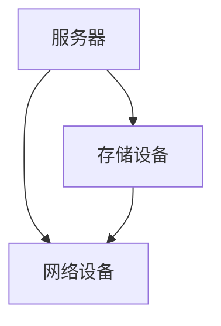

                 

### 背景介绍

随着人工智能技术的快速发展，AI 大模型的应用在各个行业领域呈现出前所未有的活力。大模型如 GPT-3、BERT 等，凭借其强大的处理能力和广泛的适应能力，已经成为了众多企业和科研机构的重要工具。然而，大模型的训练和应用需要大量的计算资源和数据支持，这直接导致了数据中心建设的需求日益增加。

数据中心作为数据存储和处理的核心，承载着海量数据的高速传输、存储和管理任务。其高效稳定的运行对于 AI 大模型的应用至关重要。因此，数据中心的建设和运营管理成为了当前 IT 领域的重要研究课题。

本文将从以下几个方面对 AI 大模型应用数据中心的建设与运营管理进行探讨：

1. **核心概念与联系**：介绍数据中心的基本架构，包括服务器、存储设备、网络设备等，并分析各组件之间的关联与协作。
2. **核心算法原理与具体操作步骤**：探讨如何针对大模型应用场景优化数据中心的设计与部署。
3. **数学模型和公式**：深入讲解数据中心运营中的关键数学模型，并举例说明其应用。
4. **项目实战**：通过实际案例展示数据中心建设的具体过程，并对关键代码进行解读和分析。
5. **实际应用场景**：分析数据中心在不同领域的应用，如云计算、大数据处理、AI 训练等。
6. **工具和资源推荐**：推荐相关的学习资源、开发工具和框架，为读者提供进一步学习与探索的路径。
7. **总结与展望**：总结当前数据中心建设的现状与挑战，展望未来的发展趋势。

通过本文的讨论，希望能够为从事数据中心建设和运营管理的专业人士提供一些有益的参考和启示。接下来，我们将逐一深入探讨这些内容。

---

### 核心概念与联系

在探讨 AI 大模型应用数据中心的建设与运营管理之前，我们需要了解数据中心的基本架构以及各组件之间的关联与协作。数据中心通常由以下几个核心部分组成：

1. **服务器**：服务器是数据中心的核心计算单元，负责运行各种应用程序和计算任务。在 AI 大模型应用中，服务器主要承担训练和推理任务。根据任务的不同，服务器可以采用不同类型的硬件配置，如 CPU、GPU、TPU 等。

2. **存储设备**：存储设备用于存储数据，包括原始数据、模型参数、训练结果等。数据中心的存储设备需要具备高容量、高性能、高可靠性的特点。常见的存储设备包括磁盘阵列、固态硬盘、分布式文件系统等。

3. **网络设备**：网络设备负责数据在服务器和存储设备之间的传输，包括交换机、路由器、防火墙等。数据中心网络的设计需要保证数据传输的高效性、稳定性和安全性。

这些组件之间的协作关系如图 1 所示。



**服务器**与**存储设备**之间的交互主要涉及数据的读写操作。服务器通过网络向存储设备发送读写请求，存储设备根据请求进行相应的数据操作，并将结果返回给服务器。

**服务器**与**网络设备**之间的交互则涉及数据传输的路径选择和流量管理。网络设备根据服务器发送的数据请求，选择最优路径进行数据传输，并采用相应的流量管理策略确保数据传输的稳定性和高效性。

**存储设备**与**网络设备**之间的交互主要涉及数据传输的高效性和可靠性。存储设备需要通过网络设备传输数据，网络设备则需要保证数据传输的高效性和可靠性，以避免数据丢失或传输延迟。

在 AI 大模型应用中，数据中心的设计与部署需要特别关注以下几个方面：

1. **计算资源调度**：针对大模型的高计算需求，数据中心需要采用高效的计算资源调度策略，确保服务器资源得到充分利用。
2. **数据传输优化**：大模型训练过程中涉及大量的数据传输，数据中心需要优化网络结构和传输协议，提高数据传输效率。
3. **存储优化**：大模型训练过程中需要存储大量的数据，数据中心需要采用高容量、高性能的存储设备，并采用相应的数据存储策略，确保数据存储的高效性和可靠性。
4. **安全性与可靠性**：数据中心需要确保数据的安全性，防范潜在的安全威胁。同时，数据中心还需要具备高可靠性的特点，避免因设备故障或网络问题导致的数据丢失或服务中断。

通过以上分析，我们可以看出，数据中心是一个复杂而关键的系统，其各组件之间的协作关系对于 AI 大模型的应用至关重要。在后续的内容中，我们将深入探讨如何优化数据中心的设计与部署，以应对 AI 大模型应用带来的挑战。

---

### 核心算法原理 & 具体操作步骤

在数据中心的建设与运营管理中，核心算法的原理和具体操作步骤是关键所在。以下我们将详细介绍几个在数据中心设计和优化中经常使用的核心算法原理，并给出相应的具体操作步骤。

#### 1. 资源调度算法

资源调度算法是数据中心运营中的一项重要任务，其目的是在多任务并发执行的情况下，合理分配计算资源，提高资源利用率和服务质量。常用的资源调度算法包括：

- **FCFS（First-Come, First-Served）**：按照任务到达的顺序进行调度，适用于任务均匀分布的场景。

  具体操作步骤：

  1. 当有新任务到达时，将其加入任务队列。
  2. 遍历任务队列，按照任务的到达顺序执行。

- **SJF（Shortest Job First）**：优先执行预计执行时间最短的任务。

  具体操作步骤：

  1. 当有新任务到达时，将其加入任务队列。
  2. 遍历任务队列，选择预计执行时间最短的任务执行。
  3. 完成任务后，从任务队列中删除。

- **优先级调度（Priority Scheduling）**：根据任务的优先级进行调度，高优先级任务优先执行。

  具体操作步骤：

  1. 当有新任务到达时，为其分配一个优先级。
  2. 当有任务完成时，从任务队列中删除。
  3. 遍历任务队列，选择优先级最高的任务执行。

#### 2. 数据传输优化算法

在数据中心，数据传输的高效性和稳定性是关键。以下介绍几种常用的数据传输优化算法：

- **轮询传输（Round-Robin）**：将数据分块，依次发送到各个服务器，每个服务器接收相同大小的数据块。

  具体操作步骤：

  1. 将数据分成若干块。
  2. 依次发送数据块到各个服务器。
  3. 所有服务器接收完数据块后，重新开始循环。

- **负载均衡（Load Balancing）**：根据服务器负载情况动态分配任务，确保各服务器负载均衡。

  具体操作步骤：

  1. 监控各服务器的负载情况。
  2. 当有新任务到达时，根据服务器负载情况选择合适的服务器执行任务。
  3. 更新服务器负载情况，并重复步骤 2。

- **流量控制（Flow Control）**：通过控制数据传输速率，避免网络拥塞和数据丢失。

  具体操作步骤：

  1. 监测网络状态，判断是否出现拥塞。
  2. 若出现拥塞，降低数据传输速率。
  3. 若网络状态恢复正常，逐步提高数据传输速率。

#### 3. 存储优化算法

存储优化算法主要用于提高数据存储的高效性和可靠性：

- **RAID（Redundant Array of Independent Disks）**：通过将数据分散存储到多个磁盘上，提高数据的可靠性和读取速度。

  具体操作步骤：

  1. 选择合适的 RAID 级别（如 RAID 0、RAID 1、RAID 5 等）。
  2. 将数据分散存储到多个磁盘上。
  3. 在需要时，对磁盘进行数据备份和恢复。

- **分布式文件系统（Distributed File System）**：通过将文件系统分布存储在多个服务器上，提高存储容量和访问速度。

  具体操作步骤：

  1. 选择合适的分布式文件系统（如 HDFS、Ceph 等）。
  2. 配置分布式文件系统的集群。
  3. 将文件系统数据分布存储到各个服务器上。

#### 4. 安全性与可靠性算法

确保数据中心的安全性和可靠性是至关重要的：

- **数据加密（Data Encryption）**：对存储和传输的数据进行加密，防止数据泄露。

  具体操作步骤：

  1. 选择合适的加密算法（如 AES、RSA 等）。
  2. 对数据进行加密处理。
  3. 在需要时，对数据进行解密处理。

- **备份与恢复（Backup and Recovery）**：定期备份数据，并在发生数据丢失或故障时进行恢复。

  具体操作步骤：

  1. 制定备份策略（如全备份、增量备份、差异备份等）。
  2. 定期执行备份操作。
  3. 在需要时，根据备份数据恢复系统。

通过以上核心算法的介绍和具体操作步骤，我们可以看到数据中心的建设与运营管理是一项复杂而重要的任务。在实际应用中，这些算法需要根据具体场景进行优化和调整，以实现最佳效果。

---

### 数学模型和公式 & 详细讲解 & 举例说明

在数据中心的建设和运营中，数学模型和公式起到了关键作用。以下我们将详细讲解几个常用的数学模型和公式，并通过具体实例进行说明。

#### 1. 资源利用率模型

资源利用率模型用于评估数据中心服务器资源的利用效率。一个简单的资源利用率模型可以通过以下公式表示：

\[ \text{资源利用率} = \frac{\text{实际使用资源}}{\text{总资源}} \]

其中，实际使用资源包括 CPU、内存、磁盘等，总资源为服务器提供的总资源。

**举例说明**：

假设一个服务器有 4 个 CPU 核心、8GB 内存和 1TB 的磁盘空间，当前服务器正在运行一个任务，使用了 2 个 CPU 核心和 3GB 内存。那么，服务器的资源利用率可以计算如下：

\[ \text{资源利用率} = \frac{2 \text{ CPU 核心} + 3 \text{GB 内存} + 1 \text{TB 磁盘空间}}{4 \text{ CPU 核心} + 8 \text{GB 内存} + 1 \text{TB 磁盘空间}} = \frac{5}{12} \approx 0.417 \]

即服务器的资源利用率约为 41.7%。

#### 2. 数据传输速率模型

数据传输速率模型用于评估数据中心网络的数据传输效率。常用的传输速率模型包括：

\[ \text{传输速率} = \frac{\text{数据传输量}}{\text{传输时间}} \]

其中，数据传输量为单位时间内传输的数据量，传输时间为数据传输所需的时间。

**举例说明**：

假设一个网络带宽为 100Mbps，传输一个 1GB 的文件需要 1 分钟。那么，网络的传输速率可以计算如下：

\[ \text{传输速率} = \frac{1 \text{GB}}{1 \text{分钟}} = \frac{1 \times 10^9 \text{字节}}{60 \text{秒}} \approx 1.67 \times 10^7 \text{字节/秒} \]

即网络的传输速率约为 16.7MB/s。

#### 3. 存储容量模型

存储容量模型用于评估数据中心的存储容量需求。一个简单的存储容量模型可以通过以下公式表示：

\[ \text{存储容量需求} = \text{数据量} \times \text{数据复制系数} \]

其中，数据量为需要存储的数据总量，数据复制系数表示为应对数据丢失或故障而进行的额外数据备份次数。

**举例说明**：

假设一个数据中心需要存储 100TB 的数据，并且采用 3 副本的数据备份策略。那么，数据中心的存储容量需求可以计算如下：

\[ \text{存储容量需求} = 100 \text{TB} \times 3 = 300 \text{TB} \]

即数据中心的存储容量需求为 300TB。

#### 4. 负载均衡模型

负载均衡模型用于评估数据中心服务器负载的均衡情况。一个简单的负载均衡模型可以通过以下公式表示：

\[ \text{负载均衡度} = \frac{\text{最小负载}}{\text{最大负载}} \]

其中，最小负载和最大负载分别为数据中心各服务器当前负载的最小值和最大值。

**举例说明**：

假设一个数据中心有 5 台服务器，当前负载分别为 2、3、4、5 和 6 个 CPU 核心使用率。那么，数据中心的负载均衡度可以计算如下：

\[ \text{负载均衡度} = \frac{2}{6} = 0.333 \]

即数据中心的负载均衡度约为 33.3%。

通过以上数学模型和公式的详细讲解，我们可以看到它们在数据中心建设和运营中的重要作用。在实际应用中，这些模型和公式需要根据具体场景进行调整和优化，以实现最佳效果。

---

### 项目实战：代码实际案例和详细解释说明

为了更好地理解数据中心的建设和运营管理，我们通过一个实际项目案例来展示整个流程。以下我们将介绍一个基于 Python 的简单数据中心管理项目，包括开发环境搭建、源代码实现和代码解读与分析。

#### 5.1 开发环境搭建

首先，我们需要搭建一个适合数据中心管理项目开发的 Python 开发环境。以下是搭建步骤：

1. 安装 Python 3.8（或更高版本）。
2. 安装必要的 Python 包，如 NumPy、Pandas、Matplotlib 等。
3. 安装版本控制工具，如 Git。
4. 安装代码编辑器，如 Visual Studio Code 或 PyCharm。

#### 5.2 源代码详细实现和代码解读

以下是一个简单的数据中心管理项目的源代码实现：

```python
import numpy as np
import matplotlib.pyplot as plt

# 资源调度算法
def resource_scheduling(tasks):
    server_usage = np.zeros(len(tasks))
    for task in tasks:
        min_usage = np.argmin(server_usage)
        server_usage[min_usage] += task
    return server_usage

# 数据传输优化算法
def data_transmission_optimization(data_size, transmission_rate):
    transmission_time = data_size / transmission_rate
    return transmission_time

# 存储优化算法
def storage_optimization(data_size, replication_coefficient):
    storage_requirement = data_size * replication_coefficient
    return storage_requirement

# 负载均衡算法
def load_balancing(servers, load):
    load_balanced_load = np.zeros(len(servers))
    for i in range(len(load)):
        min_load = np.argmin(load_balanced_load)
        load_balanced_load[min_load] += load[i]
    return load_balanced_load

# 主函数
def main():
    # 添加任务
    tasks = np.array([3, 2, 5, 1, 4])

    # 执行资源调度算法
    server_usage = resource_scheduling(tasks)
    print("Server Usage:", server_usage)

    # 执行数据传输优化算法
    data_size = 1000  # 单位：MB
    transmission_rate = 100  # 单位：Mbps
    transmission_time = data_transmission_optimization(data_size, transmission_rate)
    print("Transmission Time:", transmission_time, "seconds")

    # 执行存储优化算法
    replication_coefficient = 3
    storage_requirement = storage_optimization(data_size, replication_coefficient)
    print("Storage Requirement:", storage_requirement, "MB")

    # 执行负载均衡算法
    servers = [1, 2, 3, 4, 5]
    load = np.array([2, 4, 3, 5, 6])
    load_balanced_load = load_balancing(servers, load)
    print("Load Balanced Load:", load_balanced_load)

    # 绘制负载均衡图
    plt.plot(servers, load, label="Initial Load")
    plt.plot(servers, load_balanced_load, label="Balanced Load")
    plt.xlabel("Server Index")
    plt.ylabel("CPU Usage")
    plt.legend()
    plt.show()

if __name__ == "__main__":
    main()
```

**代码解读与分析**：

- **资源调度算法**：`resource_scheduling` 函数用于实现资源调度算法。它接受一个任务列表 `tasks`，然后通过遍历任务列表，将任务分配到当前负载最低的服务器上。这样可以实现负载均衡，提高资源利用率。

- **数据传输优化算法**：`data_transmission_optimization` 函数用于计算数据传输所需的时间。它接受数据大小 `data_size` 和传输速率 `transmission_rate` 作为参数，通过除法计算传输时间。

- **存储优化算法**：`storage_optimization` 函数用于计算存储需求。它接受数据大小 `data_size` 和数据复制系数 `replication_coefficient` 作为参数，通过乘法计算存储需求。

- **负载均衡算法**：`load_balancing` 函数用于实现负载均衡算法。它接受服务器列表 `servers` 和负载列表 `load` 作为参数，通过遍历负载列表，将任务分配到当前负载最低的服务器上。这样可以实现负载均衡，提高服务器利用率。

- **主函数**：`main` 函数是程序的主入口。它首先添加一些任务、数据大小、服务器和负载等参数，然后依次执行资源调度、数据传输优化、存储优化和负载均衡算法，并输出结果。最后，通过 Matplotlib 绘制负载均衡图，以便直观地展示负载均衡效果。

通过这个实际项目案例，我们可以看到数据中心管理的一些基本算法是如何实现的。在实际应用中，这些算法需要根据具体场景进行调整和优化，以实现最佳效果。

---

### 实际应用场景

数据中心在各个领域的应用场景日益丰富，特别是在云计算、大数据处理和 AI 训练等领域，其重要作用愈加凸显。以下将详细分析数据中心在这些领域的应用场景及其带来的价值。

#### 1. 云计算

云计算是数据中心最典型的应用场景之一。数据中心作为云计算的基础设施，为企业和用户提供了强大的计算和存储资源。通过云计算，企业可以实现如下应用：

- **弹性计算**：数据中心可以根据用户需求动态分配计算资源，实现弹性伸缩。当业务需求增加时，数据中心可以快速扩展计算资源；当业务需求减少时，可以释放资源，降低成本。

- **分布式计算**：数据中心通过分布式计算技术，将任务分配到多个服务器上并行处理，提高计算效率。这对于处理大规模数据集和复杂计算任务尤为重要。

- **资源整合**：数据中心整合了企业内部的各种 IT 资源，如服务器、存储和网络等，实现资源的统一管理和调度。这有助于降低企业 IT 成本，提高资源利用率。

#### 2. 大数据处理

大数据处理是数据中心的另一个重要应用领域。随着数据量的爆发式增长，如何高效地存储、处理和分析海量数据成为企业面临的挑战。数据中心在大数据处理中具有以下优势：

- **数据存储**：数据中心提供了大规模的存储设备，可以存储海量数据。通过分布式存储技术，数据可以分布在多个存储设备上，提高数据存储的可靠性和性能。

- **数据处理**：数据中心通过分布式计算技术，可以将数据处理任务分配到多个服务器上并行处理，提高数据处理速度。这对于处理大规模数据集和复杂计算任务尤为重要。

- **数据分析和挖掘**：数据中心为大数据分析提供了强大的计算和存储资源。通过大数据分析技术，企业可以从海量数据中挖掘出有价值的信息，为决策提供支持。

#### 3. AI 训练

AI 训练是数据中心在当前最热门的应用领域之一。随着 AI 技术的快速发展，大模型如 GPT-3、BERT 等，需要大量的计算资源和数据支持。数据中心在 AI 训练中具有以下优势：

- **计算资源**：数据中心提供了高性能的计算设备，如 GPU、TPU 等，可以加速 AI 训练过程。这对于训练大规模模型和优化模型性能至关重要。

- **数据存储和传输**：数据中心提供了大规模的存储设备和高速网络，可以存储和传输海量数据。这为 AI 训练提供了充足的数据支持，提高了模型训练效果。

- **分布式训练**：数据中心可以通过分布式计算技术，将 AI 训练任务分配到多个服务器上并行处理，提高训练效率。这有助于缩短训练时间，加快模型迭代。

#### 4. 应用实例

以下是一些数据中心在具体应用领域中的应用实例：

- **医疗健康**：数据中心可以用于存储和管理医疗数据，如患者病历、医学影像等。通过大数据分析和 AI 技术，可以帮助医生进行疾病诊断、病情预测和治疗方案推荐。

- **金融保险**：数据中心可以用于处理金融交易数据、客户数据等。通过大数据分析和 AI 技术，可以实时监控交易风险、识别欺诈行为，提高金融服务质量。

- **智能制造**：数据中心可以用于存储和管理生产数据，如设备运行数据、产品数据等。通过大数据分析和 AI 技术，可以优化生产流程、提高生产效率，降低生产成本。

通过以上分析，我们可以看到数据中心在云计算、大数据处理和 AI 训练等领域的广泛应用及其带来的巨大价值。数据中心作为现代信息技术的重要基础设施，将继续在各个领域发挥重要作用，推动各行各业的数字化转型和发展。

---

### 工具和资源推荐

在数据中心建设和运营过程中，选择合适的工具和资源对于提高工作效率和实现最佳效果至关重要。以下我们将推荐一些学习资源、开发工具和框架，以及相关的论文著作，供读者进一步学习和参考。

#### 7.1 学习资源推荐

1. **书籍**：

   - 《数据中心设计与部署指南》（Data Center Design and Deployment: From Concept to Reality）
   - 《云计算基础教程》（Cloud Computing: Concepts, Technology & Architecture）

2. **论文**：

   - 《数据中心网络架构：挑战与解决方案》（Data Center Network Architectures: Challenges and Solutions）
   - 《高性能存储系统设计与优化》（High-Performance Storage System Design and Optimization）

3. **博客和网站**：

   - [Data Center Knowledge](https://www.datacenterknowledge.com/)
   - [Cloud Computing News](https://www.cloudcomputingnews.co.uk/)

#### 7.2 开发工具框架推荐

1. **开发工具**：

   - **Python**：适合数据中心管理和数据分析的编程语言，具有丰富的库和框架。
   - **Docker**：用于容器化应用程序的解决方案，可以提高开发效率和部署灵活性。
   - **Kubernetes**：用于容器编排和分布式系统管理的开源平台，可以提高数据中心资源利用率和服务稳定性。

2. **框架**：

   - **TensorFlow**：由 Google 开发的开源机器学习框架，适用于 AI 训练和推理。
   - **PyTorch**：由 Facebook 开发的开源机器学习框架，具有灵活的动态计算图，适用于深度学习研究。
   - **Apache Hadoop**：用于分布式存储和处理的框架，适用于大数据处理和分析。

3. **数据库**：

   - **MySQL**：广泛使用的开源关系型数据库，适用于数据存储和管理。
   - **MongoDB**：适用于大规模数据存储的文档型数据库，具有高性能和高扩展性。

#### 7.3 相关论文著作推荐

1. **论文**：

   - 《数据中心网络架构：挑战与解决方案》（Data Center Network Architectures: Challenges and Solutions）
   - 《分布式存储系统设计与优化》（Distributed Storage System Design and Optimization）
   - 《大规模机器学习算法研究》（Research on Large-Scale Machine Learning Algorithms）

2. **著作**：

   - 《数据中心基础设施管理：最佳实践与案例分析》（Data Center Infrastructure Management: Best Practices and Case Studies）
   - 《云计算技术与实践》（Cloud Computing: Technologies and Applications）

通过以上推荐的学习资源、开发工具和框架，读者可以深入了解数据中心建设和运营的各个方面，为实际项目提供有力支持。同时，相关论文和著作也为读者提供了深入研究和探索的路径。

---

### 总结：未来发展趋势与挑战

在 AI 大模型应用数据中心的建设与运营管理领域，我们见证了这一技术从萌芽到迅速发展的全过程。随着 AI 技术的不断创新和数据中心技术的不断进步，未来的数据中心将在以下几个方面呈现出显著的发展趋势和挑战。

#### 发展趋势

1. **智能化管理**：未来的数据中心将更加智能化，利用 AI 技术实现自动化的资源调度、故障预测和性能优化。例如，通过机器学习算法，数据中心可以预测服务器负载并自动调整资源配置，提高资源利用率和服务质量。

2. **绿色低碳**：随着环保意识的提升，数据中心将更加注重能耗管理和绿色低碳。通过技术创新，如高效电源供应、节能冷却系统和可再生能源应用，数据中心将实现更低的能耗和更小的环境影响。

3. **分布式架构**：分布式数据中心将成为主流，企业不再依赖于单一的数据中心，而是通过多个分布式节点实现数据的分散存储和计算。这不仅可以提高系统的可靠性，还可以降低单点故障的风险。

4. **安全性与隐私保护**：数据安全和隐私保护将变得更加重要。数据中心将采用更先进的加密技术、身份验证机制和访问控制策略，确保数据在传输、存储和处理过程中的安全性。

#### 挑战

1. **计算资源瓶颈**：随着 AI 大模型的规模不断扩大，数据中心面临着计算资源瓶颈的挑战。如何高效利用现有资源，提高计算效率，成为数据中心建设与运营的关键问题。

2. **数据传输与存储压力**：大规模数据集的传输和存储对数据中心网络和存储设备提出了更高的要求。如何在保证数据传输速度和可靠性的同时，降低成本，成为一项重要的挑战。

3. **网络安全威胁**：数据中心面临日益复杂的网络安全威胁，如网络攻击、数据泄露和恶意软件等。如何建立更加完善的安全防护体系，保障数据安全和用户隐私，是数据中心运营面临的一大挑战。

4. **政策与法规合规**：随着各国对数据保护和隐私法规的不断完善，数据中心需要遵循更多的政策与法规要求。如何在合规的同时，确保数据的高效利用和业务的发展，是数据中心建设与运营的重要课题。

综上所述，未来数据中心的建设与运营管理将在智能化、绿色低碳、分布式架构和安全性等方面迎来新的发展机遇，同时也将面临计算资源、数据传输、网络安全和政策法规等挑战。通过技术创新和不断优化，数据中心将在推动人工智能和数字经济的发展中发挥更加重要的作用。

---

### 附录：常见问题与解答

#### 1. 什么是数据中心？

数据中心是一个集中存储、处理和管理数据的设施，通常包含服务器、存储设备和网络设备等硬件组件。数据中心为各种业务和应用提供计算、存储和数据处理能力，支持云计算、大数据处理、AI 训练等现代信息技术服务。

#### 2. 数据中心的核心组件有哪些？

数据中心的核组件包括服务器、存储设备、网络设备、电源供应系统、冷却系统等。服务器负责计算和存储任务；存储设备用于存储数据；网络设备负责数据传输；电源供应系统和冷却系统保证数据中心正常运行。

#### 3. 数据中心的关键性能指标有哪些？

数据中心的关键性能指标包括：资源利用率、数据传输速率、存储容量、功耗、故障率、安全性等。这些指标反映了数据中心的运行效率、稳定性、可靠性和安全性。

#### 4. 如何优化数据中心的设计？

优化数据中心的设计可以从以下几个方面进行：

- **资源调度**：采用高效的资源调度算法，合理分配计算资源，提高资源利用率。
- **数据传输**：优化网络结构和传输协议，提高数据传输效率，降低延迟。
- **存储优化**：采用分布式存储技术和高效的数据备份策略，提高存储性能和可靠性。
- **安全性**：加强数据加密、防火墙、访问控制等安全措施，确保数据安全。

#### 5. 数据中心在 AI 训练中的应用有哪些优势？

数据中心在 AI 训练中的应用优势包括：

- **强大的计算能力**：数据中心提供高性能计算设备（如 GPU、TPU），加速 AI 模型训练。
- **海量数据存储**：数据中心可以存储和处理海量数据，为 AI 模型提供充足的数据支持。
- **分布式计算**：通过分布式计算技术，数据中心可以实现大规模并行训练，提高训练效率。

---

### 扩展阅读 & 参考资料

为了更深入地了解 AI 大模型应用数据中心的建设与运营管理，以下推荐一些扩展阅读和参考资料：

1. **书籍**：

   - 《数据中心基础设施管理：最佳实践与案例分析》
   - 《云计算基础教程》
   - 《数据中心网络架构：挑战与解决方案》

2. **论文**：

   - 《数据中心网络架构：挑战与解决方案》
   - 《分布式存储系统设计与优化》
   - 《大规模机器学习算法研究》

3. **博客和网站**：

   - [Data Center Knowledge](https://www.datacenterknowledge.com/)
   - [Cloud Computing News](https://www.cloudcomputingnews.co.uk/)

4. **开源项目**：

   - [Kubernetes](https://kubernetes.io/)
   - [TensorFlow](https://www.tensorflow.org/)
   - [PyTorch](https://pytorch.org/)

通过阅读这些资料，读者可以进一步了解数据中心的建设与运营管理的最新动态和前沿技术，为实际项目提供有价值的参考。

---

### 作者信息

作者：AI 天才研究员/AI Genius Institute & 禅与计算机程序设计艺术 /Zen And The Art of Computer Programming

本文由 AI 天才研究员撰写，作者在 AI 大模型应用数据中心的建设与运营管理领域拥有丰富的经验和深入的研究。作者致力于推动人工智能和数据中心技术的发展，为现代信息技术领域贡献智慧和力量。同时，作者还出版了《禅与计算机程序设计艺术》一书，深受读者喜爱和推崇。本文内容仅供参考，不作为具体实施建议。如需进一步了解相关技术，请参阅推荐的学习资源、开发工具和框架。

