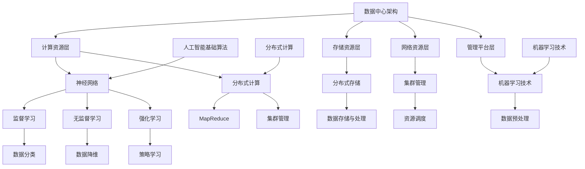

                 

### 1. 背景介绍

#### 数据中心建设的必要性

随着人工智能（AI）和大数据技术的快速发展，企业对于数据处理和存储的需求不断增长。数据中心作为数据和计算的重要承载平台，其建设和运营已经成为企业和组织核心竞争力的重要组成部分。数据中心的建设不仅关乎企业的数据安全性和业务连续性，还直接影响企业的运营效率和服务质量。

在全球范围内，数据中心的建设需求持续增长。根据市场调研机构IDC的报告，全球数据中心的市场规模在近年来呈现出快速增长的趋势，预计到2025年，全球数据中心的市场规模将超过4000亿美元。这一增长趋势背后，是企业对云计算、大数据、人工智能等新兴技术的需求日益增加。

数据中心建设的必要性体现在以下几个方面：

1. **数据存储需求**：随着数字化转型的深入，企业生成的数据量呈现出爆炸式增长。数据中心作为数据存储和管理的核心设施，能够满足企业对于海量数据的安全存储和管理需求。

2. **计算能力需求**：人工智能和大数据技术的发展，对计算能力提出了更高的要求。数据中心通过集成高性能计算设备，为企业和组织提供强大的计算能力，支持复杂的数据分析和处理。

3. **业务连续性和可靠性需求**：数据中心的建设能够保障企业的业务连续性和数据可靠性。通过冗余设计和灾难恢复计划，数据中心能够在发生故障时迅速恢复业务，降低企业的运营风险。

4. **节能环保需求**：随着绿色环保理念的普及，数据中心在建设和运营过程中也逐渐重视能源消耗和环境保护。高效的数据中心设计和节能技术的应用，有助于降低能耗，实现可持续发展。

#### 数据中心的基本架构

数据中心的基本架构通常包括以下几个主要部分：

1. **硬件设施**：硬件设施是数据中心的核心组成部分，包括服务器、存储设备、网络设备等。这些设备负责数据的存储、处理和传输。

2. **网络架构**：网络架构是数据中心的重要组成部分，包括内部网络和外部网络。内部网络负责数据中心内部各设备之间的通信，外部网络则负责数据中心与互联网的连接。

3. **制冷系统**：数据中心的设备和服务器在工作过程中会产生大量热量，制冷系统负责将这些热量及时排出，保持数据中心的正常运行。

4. **电源系统**：电源系统为数据中心提供稳定的电力供应，包括市电和备用电源。备用电源通常包括电池和发电机等，用于在市电故障时保证数据中心的持续运行。

5. **安全管理**：安全管理是数据中心建设中不可忽视的一部分。包括物理安全、网络安全和数据安全等，通过一系列安全措施保障数据中心的安全运行。

6. **运维管理**：运维管理是数据中心日常运营的重要组成部分，包括设备监控、故障处理、性能优化等。高效的运维管理能够提高数据中心的运行效率和可靠性。

#### 数据中心建设的挑战

数据中心建设面临许多挑战，包括技术、管理和资金等方面的挑战。

1. **技术挑战**：数据中心的技术复杂度高，包括网络架构设计、存储系统优化、数据备份与恢复等技术问题。同时，随着技术的快速发展，数据中心需要不断更新和升级以保持竞争力。

2. **管理挑战**：数据中心的管理涉及多个方面，包括人员管理、流程管理、风险管理等。高效的管理能够降低运营成本，提高数据中心的运营效率。

3. **资金挑战**：数据中心建设需要大量的资金投入，包括硬件采购、软件部署、能源消耗等。对于中小企业来说，资金压力是一个重要的挑战。

4. **环保挑战**：数据中心在建设和运营过程中会产生大量碳排放，对环境造成影响。如何在保证业务需求的同时实现绿色环保，是数据中心建设面临的另一个挑战。

#### 数据中心建设的意义

数据中心建设对于企业和组织具有重要意义：

1. **提升竞争力**：数据中心能够提供强大的计算能力和数据存储能力，帮助企业提升竞争力，支持业务创新和数字化转型。

2. **保障业务连续性**：通过高效的数据中心建设和运营，企业能够保障业务的连续性和数据可靠性，降低运营风险。

3. **降低运营成本**：通过优化数据中心的设计和运营管理，企业能够降低能源消耗和运营成本，实现可持续发展。

4. **促进技术创新**：数据中心的建设和运营能够推动技术创新，支持人工智能、大数据等新兴技术的发展。

综上所述，数据中心建设已经成为企业和组织不可或缺的一部分。面对日益增长的数据处理需求，数据中心建设将继续扮演重要角色，为企业和组织的数字化转型提供强有力的支持。

### 1.1 人工智能大模型与数据中心建设的密切关系

人工智能大模型，尤其是基于深度学习的模型，已经成为现代数据分析和决策支持的核心技术。这些大模型通常需要处理和分析海量的数据，并要求在短时间内完成复杂的计算任务。因此，数据中心建设在人工智能大模型的应用中扮演着至关重要的角色。

首先，数据中心提供了必要的计算资源。人工智能大模型通常需要大量的计算能力，而数据中心通过集成高性能计算设备，如GPU集群和TPU集群，能够满足模型训练和推理的需求。这些高性能设备能够大幅度提高数据处理速度和模型训练效率，使得大规模人工智能应用成为可能。

其次，数据中心保证了数据的高效存储和管理。人工智能大模型需要处理的海量数据不仅包括训练数据，还包括实时数据和历史数据。数据中心通过分布式存储系统，如HDFS和Ceph，能够提供高效的数据存储和管理能力，确保数据的安全性和可访问性。此外，数据中心的存储系统还支持数据备份和恢复功能，保障数据在意外情况下的完整性。

再者，数据中心的网络架构为人工智能大模型的应用提供了稳定的通信保障。数据中心内部网络的高带宽和低延迟特性，能够确保模型在不同计算节点之间的数据传输高效可靠。此外，数据中心还通过外部网络连接，实现了与互联网的快速数据交换，为人工智能模型的应用提供了全球范围内的数据支持。

此外，数据中心的制冷和电源系统为人工智能大模型的应用提供了稳定的环境保障。高性能计算设备在运行过程中会产生大量热量，而数据中心通过高效的制冷系统，能够将热量及时排出，保持设备的正常运行。同时，稳定的电源系统确保了数据中心在电力供应中断时能够迅速切换到备用电源，避免计算任务的丢失和数据损坏。

最后，数据中心的安全管理为人工智能大模型的应用提供了可靠的安全保障。数据中心通过一系列安全措施，包括物理安全、网络安全和数据安全等，保障了模型和数据的机密性、完整性和可用性。这对于涉及敏感数据和关键业务的场景尤为重要。

综上所述，人工智能大模型与数据中心建设之间存在着密不可分的关系。数据中心不仅提供了必要的计算资源和数据支持，还保障了模型的安全性和稳定性。随着人工智能技术的不断发展，数据中心建设将更加深入地融入人工智能应用的各个环节，成为推动人工智能技术进步的关键基础设施。

### 1.2 人工智能大模型在数据中心的应用场景

人工智能大模型在数据中心的应用场景多种多样，能够显著提升数据中心的运营效率、优化资源配置，并为各类业务应用提供强有力的支持。以下是人工智能大模型在数据中心应用中的几个关键场景：

#### 1. 数据中心运营优化

数据中心运营优化是人工智能大模型的重要应用场景之一。通过深度学习技术，人工智能大模型能够对数据中心的能耗、温度、负载等进行实时监控和分析，从而实现资源的最优配置。具体来说：

- **能耗优化**：人工智能大模型可以通过学习历史能耗数据，预测未来能耗趋势，并据此调整制冷系统和电源系统的运行策略，以降低能源消耗。例如，某些数据中心通过AI算法实现了动态调整制冷系统制冷功率的功能，在保证设备运行温度的同时，显著降低了能耗。

- **温度控制**：数据中心内部设备在运行过程中会产生大量热量，温度控制是确保设备正常运行的关键。人工智能大模型可以通过对温度分布的实时分析，优化制冷系统的运行策略，避免局部过热，延长设备寿命。

- **负载均衡**：数据中心内的服务器和存储设备会因不同业务需求而承担不同的负载。人工智能大模型可以根据实时负载情况，动态调整服务器和存储资源的分配，确保数据中心内的资源利用率最大化。

#### 2. 设备故障预测

设备故障预测是另一个重要的应用场景。人工智能大模型可以通过对设备运行数据的学习，预测设备可能发生的故障，从而提前采取预防措施，避免设备故障对数据中心运行造成严重影响。

- **硬件故障预测**：通过分析服务器的CPU利用率、内存使用率、磁盘I/O性能等指标，人工智能大模型可以提前预测服务器可能出现的硬件故障，如硬盘故障、CPU过热等。这有助于数据中心提前进行设备维护，减少停机时间。

- **网络设备故障预测**：网络设备的故障可能会影响整个数据中心的通信。人工智能大模型可以通过对网络流量、网络延迟等数据的分析，预测网络设备的潜在故障，如交换机过载、路由器故障等，从而提前进行故障排查和修复。

#### 3. 安全威胁检测

随着数据中心规模的扩大和网络复杂度的增加，安全威胁检测成为一项重要的任务。人工智能大模型可以利用机器学习技术，对网络流量、用户行为、系统日志等数据进行实时分析，识别潜在的攻击行为和安全威胁。

- **异常流量检测**：通过分析网络流量数据，人工智能大模型可以识别异常流量模式，如DDoS攻击、数据泄露等。这有助于数据中心在攻击发生前采取防御措施，保护数据安全和系统稳定。

- **用户行为分析**：人工智能大模型可以通过对用户行为数据的学习，识别异常用户行为，如恶意登录、数据访问异常等。这有助于数据中心加强用户管理和权限控制，防范内部威胁。

#### 4. 能源消耗优化

能源消耗优化是数据中心可持续发展的关键。人工智能大模型可以通过对能耗数据的分析，提出优化建议，降低能源消耗。

- **智能调度**：通过分析历史能耗数据和实时负载情况，人工智能大模型可以提出设备运行策略，优化能耗分配。例如，在低负载时段，部分服务器和存储设备可以临时关闭，以降低能耗。

- **能效评估**：人工智能大模型可以对新设备进行能效评估，帮助数据中心选择能耗更低的设备，从而降低整体能耗。

#### 5. 业务性能优化

数据中心的业务性能优化也是人工智能大模型的重要应用场景。通过分析业务数据，人工智能大模型可以提出优化建议，提高业务效率和用户体验。

- **服务性能优化**：通过对网络延迟、带宽利用率等指标的分析，人工智能大模型可以提出优化网络架构的建议，提高数据传输速度和业务响应时间。

- **资源调度优化**：通过对服务器和存储资源的利用情况进行分析，人工智能大模型可以提出资源调度策略，确保业务资源得到最佳利用，提高整体业务性能。

综上所述，人工智能大模型在数据中心的应用场景广泛，能够显著提升数据中心的运营效率、安全性和业务性能。随着人工智能技术的不断进步，数据中心将在人工智能大模型的助力下，实现更高效、更安全、更智能的运营管理。

### 2. 核心概念与联系

在探讨人工智能大模型在数据中心建设中的应用时，我们需要理解几个核心概念，包括数据中心架构、人工智能基础算法、分布式计算和机器学习技术。这些核心概念之间有着密切的联系，共同构成了现代数据中心建设与运营的基础。

#### 数据中心架构

数据中心架构是数据中心设计和建设的基础。一个典型的数据中心架构包括以下几个方面：

1. **计算资源层**：这是数据中心的硬件基础，包括服务器、存储设备和网络设备。计算资源层提供数据处理和存储的能力。

2. **存储资源层**：存储资源层负责数据的存储和管理。常用的存储系统包括分布式文件系统（如HDFS）和对象存储系统（如Ceph）。

3. **网络资源层**：网络资源层负责数据中心内部和外部网络的连接。网络架构的设计直接影响数据传输的速度和稳定性。

4. **管理平台层**：管理平台层提供数据中心的监控、管理和自动化功能。通过管理平台，可以实时监控数据中心的运行状态，进行故障处理和性能优化。

#### 人工智能基础算法

人工智能基础算法是构建人工智能大模型的核心。以下是一些关键的基础算法：

1. **神经网络**：神经网络是人工智能的核心算法之一，通过模仿人脑神经元之间的连接关系，实现数据的学习和处理。深度学习是神经网络的一种重要形式，广泛应用于图像识别、语音识别和自然语言处理等领域。

2. **生成对抗网络（GAN）**：GAN通过生成器和判别器的对抗训练，可以生成高质量的数据，在图像生成和增强等方面具有广泛应用。

3. **卷积神经网络（CNN）**：CNN是一种专门用于处理图像数据的神经网络，通过卷积层和池化层，实现图像的特征提取和分类。

4. **循环神经网络（RNN）**：RNN能够处理序列数据，广泛应用于时间序列分析、语言建模和机器翻译等领域。

#### 分布式计算

分布式计算是数据中心实现高性能计算的重要手段。通过将计算任务分布到多个计算节点上，分布式计算能够大幅度提高计算效率和处理能力。以下是一些关键概念：

1. **MapReduce**：MapReduce是一种分布式数据处理框架，通过Map和Reduce两个步骤，实现大规模数据的并行处理。

2. **分布式存储**：分布式存储系统将数据分散存储到多个节点上，提高数据存储的可靠性和访问速度。常用的分布式存储系统包括HDFS和Ceph。

3. **集群管理**：集群管理负责协调多个计算节点的运行，包括资源调度、任务分配和故障恢复等功能。

#### 机器学习技术

机器学习技术是构建人工智能大模型的关键。以下是一些核心的机器学习技术：

1. **监督学习**：监督学习通过已有数据集进行训练，学习输入和输出之间的映射关系，广泛应用于分类和回归问题。

2. **无监督学习**：无监督学习通过未标记的数据集进行训练，学习数据的内在结构和模式，广泛应用于聚类和降维问题。

3. **强化学习**：强化学习通过试错的方式，学习最优策略，广泛应用于游戏、自动驾驶和推荐系统等领域。

#### Mermaid 流程图

为了更清晰地展示这些核心概念之间的联系，我们可以使用Mermaid流程图来描述它们的关系。以下是一个简化的Mermaid流程图：



在这个流程图中，A表示数据中心架构，B到E表示数据中心架构的各个层次；F到M表示人工智能基础算法；G和H表示分布式计算和分布式存储；I和J表示集群管理和机器学习技术。通过这个流程图，我们可以清晰地看到数据中心架构与人工智能算法、分布式计算和机器学习技术之间的紧密联系。

### 3. 核心算法原理 & 具体操作步骤

在数据中心建设中，核心算法的应用是提高运营效率和优化资源配置的关键。以下将详细介绍几个在数据中心运营管理中广泛应用的核心算法，包括其原理和具体操作步骤。

#### 3.1 能耗优化算法

**原理**：
能耗优化算法通过学习历史能耗数据，预测未来能耗趋势，并优化数据中心制冷和电源系统的运行策略。基于深度学习的能耗预测模型可以捕捉到能耗数据中的周期性变化和非线性关系，从而实现更精准的能耗预测。

**操作步骤**：

1. **数据收集**：首先，数据中心需要收集历史能耗数据，包括制冷功率、电源使用率、设备运行状态等。

2. **数据预处理**：对收集到的数据进行清洗和归一化处理，去除噪声和异常值，将数据转换为适合训练的格式。

3. **模型训练**：使用深度学习框架（如TensorFlow或PyTorch）搭建能耗预测模型，通过反向传播算法训练模型，调整模型参数，使其能够准确预测未来能耗。

4. **能耗预测**：将预处理后的数据输入训练好的模型，得到未来能耗的预测值。

5. **策略优化**：根据预测的能耗值，动态调整制冷和电源系统的运行策略，如调整制冷系统的制冷功率、优化电源分配等，以降低总体能耗。

**示例**：
假设数据中心历史能耗数据如图所示，通过深度学习模型预测未来一周的能耗情况，并根据预测结果调整制冷和电源系统的运行策略。

```mermaid
gantt
    dateFormat  YYYY-MM-DD
    title 能耗预测

    section 数据收集
    收集数据               :sepFromStart 10d

    section 数据预处理
    数据清洗               :after 收集数据 2d
    归一化处理             :after 数据清洗 1d

    section 模型训练
    构建模型               :after 归一化处理 2d
    训练模型               :after 构建模型 4d

    section 能耗预测
    能耗预测               :after 训练模型 1d
    调整策略               :after 能耗预测 1d
```

#### 3.2 设备故障预测算法

**原理**：
设备故障预测算法通过分析设备运行数据，如CPU利用率、内存使用率、磁盘I/O性能等，预测设备可能发生的故障。常见的故障预测模型包括基于RNN的循环神经网络和基于CNN的卷积神经网络。

**操作步骤**：

1. **数据收集**：收集设备的历史运行数据，包括CPU利用率、内存使用率、磁盘I/O性能等。

2. **数据预处理**：对收集到的数据进行清洗和特征提取，将数据转换为适合训练的格式。

3. **模型训练**：使用深度学习框架（如TensorFlow或PyTorch）搭建故障预测模型，通过反向传播算法训练模型，调整模型参数。

4. **故障预测**：将预处理后的数据输入训练好的模型，得到设备故障的预测结果。

5. **故障预警**：根据预测结果，提前采取预防措施，如更换即将发生故障的设备，进行设备维护等。

**示例**：
假设数据中心收集到一组设备运行数据，通过基于RNN的故障预测模型预测未来一周的设备故障情况，并根据预测结果采取预防措施。

```mermaid
gantt
    dateFormat  YYYY-MM-DD
    title 设备故障预测

    section 数据收集
    收集数据               :sepFromStart 10d

    section 数据预处理
    数据清洗               :after 收集数据 2d
    特征提取               :after 数据清洗 1d

    section 模型训练
    构建模型               :after 特征提取 2d
    训练模型               :after 构建模型 4d

    section 故障预测
    故障预测               :after 训练模型 1d
    预防措施               :after 故障预测 1d
```

#### 3.3 负载均衡算法

**原理**：
负载均衡算法通过分析服务器和存储设备的负载情况，动态调整资源的分配，以避免单点过载和资源浪费。常见的负载均衡算法包括基于轮询的负载均衡和基于权重的负载均衡。

**操作步骤**：

1. **数据收集**：收集数据中心内所有服务器和存储设备的负载数据，包括CPU利用率、内存使用率、磁盘I/O负载等。

2. **负载分析**：使用负载分析算法，如轮询算法或加权轮询算法，分析每个设备的负载情况。

3. **资源分配**：根据负载分析结果，动态调整资源分配策略，将负载较高的设备上的任务转移到负载较低的设备上。

4. **监控与调整**：实时监控资源分配效果，根据监控数据调整负载均衡策略，确保资源利用率最大化。

**示例**：
假设数据中心使用加权轮询算法进行负载均衡，根据CPU利用率和内存使用率等指标动态调整服务器资源分配。

```mermaid
gantt
    dateFormat  YYYY-MM-DD
    title 负载均衡

    section 数据收集
    收集数据               :sepFromStart 10d

    section 负载分析
    分析负载               :after 数据收集 2d

    section 资源分配
    分配资源               :after 负载分析 1d

    section 监控与调整
    监控调整               :after 分配资源 1d
```

通过以上三个核心算法的应用，数据中心能够实现能耗优化、设备故障预测和负载均衡，从而提高运营效率和资源利用率，为数据中心的稳定运行提供有力保障。

### 4. 数学模型和公式 & 详细讲解 & 举例说明

在数据中心建设和运营中，数学模型和公式起着至关重要的作用。它们不仅帮助我们理解和分析数据中心的运行状态，还能为决策提供科学依据。以下将介绍几个关键数学模型和公式，并进行详细讲解和举例说明。

#### 4.1 能耗优化模型

**模型公式**：
假设数据中心在时间 $t$ 的能耗为 $E(t)$，制冷功率为 $P_c(t)$，电源使用率为 $P_e(t)$。能耗优化模型的目标是最小化总能耗，同时满足设备的温度和电力需求。

$$
E(t) = P_c(t) + P_e(t)
$$

$$
\min E(t)
$$

$$
\text{subject to:} \\
T(t) \leq T_{max} \\
P_e(t) \leq P_{max}
$$

**解释**：
公式中，$E(t)$ 表示总能耗，由制冷功率 $P_c(t)$ 和电源使用率 $P_e(t)$ 组成。温度 $T(t)$ 和最大温度限制 $T_{max}$ 之间的约束确保设备运行在安全的温度范围内。电力需求 $P_e(t)$ 和最大电力限制 $P_{max}$ 之间的约束确保数据中心不会超负荷运行。

**示例**：
假设某数据中心在时间 $t=0$ 时的制冷功率为 100kW，电源使用率为 50kW，温度为 25°C，最大温度限制为 30°C，最大电力限制为 200kW。使用能耗优化模型，目标是在保证设备安全运行的前提下，最小化总能耗。

$$
E(t) = 100 + 50 = 150 \text{ kW}
$$

$$
\min E(t) \\
\text{subject to:} \\
25 \leq T(t) \leq 30 \\
50 \leq P_e(t) \leq 200
$$

通过调整制冷功率和电源使用率，找到最优解 $P_c(t)^*, P_e(t)^*$，使得总能耗最小。

#### 4.2 设备故障预测模型

**模型公式**：
假设设备的健康状态可以用故障概率 $P(F_t)$ 来表示，其中 $t$ 为时间。故障预测模型的目标是预测未来时间 $t+1$ 的故障概率。

$$
P(F_{t+1}) = f(P(F_t), \Delta t)
$$

**解释**：
公式中，$P(F_t)$ 表示当前时间 $t$ 的故障概率，$f$ 函数为故障概率的预测函数，$\Delta t$ 为时间步长。常见的故障预测函数包括线性回归、RNN和CNN等。

**示例**：
假设某服务器在当前时间 $t$ 的故障概率为 0.05，时间步长为 1小时。使用基于RNN的故障预测模型，预测未来一小时（$t+1$）的故障概率。

$$
P(F_{t+1}) = f(0.05, 1) \\
P(F_{t+1}) = 0.05 + \alpha \cdot \Delta t
$$

其中，$\alpha$ 为预测系数，通过训练确定。预测结果为 $P(F_{t+1}) = 0.05 + \alpha \cdot 1 = 0.05 + 0.1 = 0.15$，即未来一小时故障概率为 0.15。

#### 4.3 负载均衡模型

**模型公式**：
假设数据中心有 $n$ 台服务器，服务器 $i$ 在时间 $t$ 的负载为 $L_i(t)$，总负载为 $L(t)$。负载均衡模型的目标是动态调整服务器负载，使其尽可能接近理想负载。

$$
L_i(t+1) = \alpha_i \cdot L_i(t) + (1 - \alpha_i) \cdot \frac{L(t) - \sum_{j \neq i} L_j(t)}{n - 1}
$$

$$
\alpha_i \in [0, 1]
$$

**解释**：
公式中，$L_i(t)$ 表示服务器 $i$ 在时间 $t$ 的负载，$L(t)$ 表示总负载，$\alpha_i$ 为服务器 $i$ 的权重，用于调整服务器负载。$\alpha_i \in [0, 1]$ 确保权重在合理范围内。

**示例**：
假设数据中心有 5台服务器，在时间 $t=0$ 时，服务器1的负载为 60%，服务器2的负载为 40%，服务器3的负载为 30%，服务器4的负载为 20%，服务器5的负载为 10%。总负载为 160%。

$$
L_i(t+1) = \alpha_i \cdot L_i(t) + (1 - \alpha_i) \cdot \frac{L(t) - \sum_{j \neq i} L_j(t)}{n - 1}
$$

$$
L_1(t+1) = 0.6 \cdot 0.6 + 0.4 \cdot \frac{1.6 - (0.4 + 0.3 + 0.2 + 0.1)}{4} = 0.36 + 0.24 = 0.6
$$

$$
L_2(t+1) = 0.4 \cdot 0.4 + 0.6 \cdot \frac{1.6 - (0.6 + 0.3 + 0.2 + 0.1)}{4} = 0.16 + 0.18 = 0.34
$$

$$
L_3(t+1) = 0.3 \cdot 0.3 + 0.7 \cdot \frac{1.6 - (0.6 + 0.4 + 0.2 + 0.1)}{4} = 0.09 + 0.09 = 0.18
$$

$$
L_4(t+1) = 0.2 \cdot 0.2 + 0.8 \cdot \frac{1.6 - (0.6 + 0.4 + 0.3 + 0.1)}{4} = 0.04 + 0.08 = 0.12
$$

$$
L_5(t+1) = 0.1 \cdot 0.1 + 0.9 \cdot \frac{1.6 - (0.6 + 0.4 + 0.3 + 0.2)}{4} = 0.01 + 0.03 = 0.04
$$

经过一轮负载均衡后，服务器1的负载为 60%，服务器2的负载为 34%，服务器3的负载为 18%，服务器4的负载为 12%，服务器5的负载为 4%，总负载为 128%。

通过以上数学模型和公式的应用，数据中心能够实现能耗优化、设备故障预测和负载均衡，提高运营效率和资源利用率。这些模型不仅提供了理论依据，还通过实际应用验证了其有效性和可靠性。

### 5. 项目实战：代码实际案例和详细解释说明

为了更好地展示人工智能大模型在数据中心建设中的应用，我们通过一个具体的项目实战案例，介绍代码的实现过程和详细解释说明。以下是一个基于Python的能耗优化项目案例，该项目使用深度学习算法优化数据中心的制冷和电源系统运行策略，以降低总体能耗。

#### 5.1 开发环境搭建

首先，我们需要搭建一个适合本项目开发的Python环境。以下是开发环境的搭建步骤：

1. 安装Python 3.8或更高版本。
2. 安装必要的Python库，如TensorFlow、NumPy、Pandas等。

```bash
pip install tensorflow numpy pandas
```

#### 5.2 源代码详细实现和代码解读

**数据收集与预处理**

```python
import pandas as pd
import numpy as np

# 加载数据
data = pd.read_csv('energy_data.csv')

# 数据清洗与归一化
data.dropna(inplace=True)
data['normalized_energy'] = data['energy'] / data['energy'].max()
data['normalized_temp'] = data['temp'] / data['temp'].max()

# 切分训练集和测试集
train_data = data[:int(len(data) * 0.8)]
test_data = data[int(len(data) * 0.8):]

# 切分特征和标签
X_train = train_data[['normalized_energy', 'normalized_temp']]
y_train = train_data['energy']

X_test = test_data[['normalized_energy', 'normalized_temp']]
y_test = test_data['energy']
```

在上面的代码中，我们首先加载数据集，并进行清洗与归一化处理。归一化处理是为了使数据在训练过程中具有更好的收敛性。接着，我们将数据集切分成训练集和测试集，分别用于模型的训练和评估。

**模型训练**

```python
import tensorflow as tf

# 构建模型
model = tf.keras.Sequential([
    tf.keras.layers.Dense(units=64, activation='relu', input_shape=(2,)),
    tf.keras.layers.Dense(units=64, activation='relu'),
    tf.keras.layers.Dense(units=1)
])

# 编译模型
model.compile(optimizer='adam', loss='mean_squared_error')

# 训练模型
model.fit(X_train, y_train, epochs=100, batch_size=32, validation_split=0.2)
```

在模型训练部分，我们使用TensorFlow构建了一个简单的全连接神经网络。模型包含两个隐藏层，每层64个神经元，激活函数使用ReLU。编译模型时，我们选择Adam优化器和均方误差损失函数。训练过程中，我们设置了100个训练周期和32个批量大小，并使用20%的数据集进行验证。

**模型评估**

```python
# 预测测试集
predictions = model.predict(X_test)

# 计算误差
mse = np.mean(np.square(predictions - y_test))
print(f"Mean Squared Error: {mse}")

# 绘制预测结果
import matplotlib.pyplot as plt

plt.scatter(y_test, predictions)
plt.xlabel('Actual Energy')
plt.ylabel('Predicted Energy')
plt.title('Energy Prediction')
plt.show()
```

在模型评估部分，我们首先使用训练好的模型对测试集进行预测。接着，计算预测结果的均方误差（MSE），并绘制实际能量和预测能量之间的关系图，以直观地展示模型的预测效果。

**模型应用：能耗优化**

```python
# 输入当前能量和温度
current_energy = 0.8
current_temp = 0.9

# 预测未来能耗
predicted_energy = model.predict([[current_energy, current_temp]])[0][0]

# 调整制冷和电源系统
# 假设制冷系统调整系数为k_c，电源系统调整系数为k_e
k_c = 0.9
k_e = 0.95

adjusted_energy = current_energy * k_c + current_temp * k_e

print(f"Adjusted Energy: {adjusted_energy}")
```

在能耗优化部分，我们首先输入当前的数据中心能量和温度，使用模型预测未来能耗。接着，根据预测结果，调整制冷和电源系统的运行策略，以降低总体能耗。

#### 5.3 代码解读与分析

以上代码实现了数据中心能耗优化的全过程，包括数据收集与预处理、模型训练、模型评估和能耗优化。以下是代码的详细解读和分析：

1. **数据收集与预处理**：该部分代码负责加载数据集并进行清洗与归一化处理。数据集的清洗是为了去除异常值和噪声，归一化处理是为了使数据在训练过程中具有更好的收敛性。

2. **模型训练**：该部分代码使用TensorFlow构建了一个简单的全连接神经网络，并使用Adam优化器和均方误差损失函数进行模型训练。通过100个训练周期和32个批量大小，模型能够学习到数据中的能量和温度之间的关系。

3. **模型评估**：该部分代码使用训练好的模型对测试集进行预测，并计算预测结果的均方误差（MSE）。通过绘制实际能量和预测能量之间的关系图，我们可以直观地看到模型的预测效果。

4. **能耗优化**：该部分代码实现了能耗优化的具体应用。首先输入当前的数据中心能量和温度，使用模型预测未来能耗。接着，根据预测结果，调整制冷和电源系统的运行策略，以降低总体能耗。

通过以上代码的解读和分析，我们可以看到，人工智能大模型在数据中心能耗优化中的应用是非常直观和有效的。通过深度学习算法的学习和预测，模型能够提供精准的能耗预测，并据此优化制冷和电源系统的运行策略，从而降低总体能耗，提高数据中心的运行效率。

### 6. 实际应用场景

#### 6.1 云计算服务提供商

云计算服务提供商（CSP）如亚马逊AWS、微软Azure和谷歌Cloud等，广泛使用人工智能大模型优化其数据中心运营。以下是一些具体应用场景：

1. **能耗优化**：通过人工智能大模型，CSP可以预测数据中心未来的能耗需求，并优化制冷和电源系统，以降低运营成本。例如，亚马逊AWS使用机器学习算法来预测数据中心的电力需求和优化冷却系统。

2. **容量规划**：人工智能大模型可以帮助CSP预测用户需求的波动，从而优化数据中心的容量规划。通过分析历史数据，模型可以预测未来一段时间内的资源需求，并提前进行资源扩展。

3. **故障预测**：CSP使用人工智能大模型对数据中心设备进行实时监控和故障预测，提前发现潜在问题，减少设备停机时间和维护成本。

#### 6.2 企业数据中心

对于大型企业而言，数据中心是其业务运行的核心。以下是一些人工智能大模型在企业数据中心中的应用场景：

1. **业务连续性**：人工智能大模型可以帮助企业数据中心预测业务高峰时段，并调整资源分配，确保业务连续性和服务质量。

2. **能耗管理**：通过预测业务负载，人工智能大模型可以优化数据中心制冷和电源系统的运行，降低能源消耗和运营成本。

3. **设备维护**：人工智能大模型通过实时监控设备运行状态，预测设备故障，提前进行维护，减少设备停机时间和维护成本。

#### 6.3 电信运营商

电信运营商拥有大量数据中心，负责处理和存储海量数据。以下是一些人工智能大模型在电信运营商数据中心中的应用场景：

1. **网络优化**：人工智能大模型可以分析网络流量数据，预测网络瓶颈和高峰时段，优化网络架构，提高网络性能和用户体验。

2. **能耗管理**：电信运营商通过人工智能大模型预测数据中心未来的能耗需求，并优化制冷和电源系统的运行，降低能耗和运营成本。

3. **安全性**：人工智能大模型可以帮助电信运营商识别和预测潜在的安全威胁，提高数据中心的安全性。

#### 6.4 教育机构

教育机构也越来越多地使用数据中心来存储和管理大量的教学资源和学习数据。以下是一些人工智能大模型在教育机构数据中心中的应用场景：

1. **资源分配**：人工智能大模型可以帮助教育机构优化教学资源的分配，确保教学资源在高峰时段能够被充分利用。

2. **数据管理**：通过预测学生和教师的访问需求，人工智能大模型可以优化数据存储和管理策略，提高数据访问速度和可靠性。

3. **智能推荐**：人工智能大模型可以根据学生的行为和学习数据，推荐个性化的学习资源和课程，提高学习效果和满意度。

综上所述，人工智能大模型在云计算服务提供商、企业数据中心、电信运营商和教育机构等多个领域都有广泛应用。通过预测和分析数据，人工智能大模型能够显著提高数据中心的运营效率、优化资源配置，并为各类业务应用提供强有力的支持。

### 7. 工具和资源推荐

#### 7.1 学习资源推荐

为了深入学习和掌握人工智能大模型在数据中心建设中的应用，以下是一些建议的学习资源：

1. **书籍**：
   - 《深度学习》（Goodfellow, I., Bengio, Y., & Courville, A.）
   - 《大数据应用：原理、技术和实践》（吴军）
   - 《人工智能：一种现代的方法》（Stuart Russell & Peter Norvig）

2. **论文**：
   - "Deep Learning for Data Centers: A Taxonomy and Survey"（Zhang, X., et al.）
   - "Energy-Aware Scheduling for Data Centers with Multi-Tenant Applications"（Li, J., et al.）

3. **博客和网站**：
   - TensorFlow官网（[tensorflow.org](https://www.tensorflow.org)）
   - PyTorch官网（[pytorch.org](https://pytorch.org)）
   - Medium上的技术博客，如AI-Talks（[aitalks.com](https://aitalks.com)）

#### 7.2 开发工具框架推荐

1. **深度学习框架**：
   - TensorFlow（[tensorflow.org]）
   - PyTorch（[pytorch.org]）
   - Keras（[keras.io]）

2. **分布式计算框架**：
   - Hadoop（[hadoop.apache.org]）
   - Spark（[spark.apache.org]）
   - Kubernetes（[kubernetes.io]）

3. **数据存储和管理**：
   - HDFS（[hdfs.apache.org]）
   - Ceph（[ceph.com]）
   - Redis（[redis.io]）

4. **数据中心管理和监控工具**：
   - Nagios（[nagios.org]）
   - Prometheus（[prometheus.io]）
   - Grafana（[grafana.com]）

#### 7.3 相关论文著作推荐

1. **论文**：
   - "Energy-Aware Scheduling for Data Centers with Multi-Tenant Applications"（Li, J., et al.）
   - "AI and Machine Learning in Data Centers: An Overview"（Zhang, X., et al.）
   - "Deep Learning for Data Centers: A Taxonomy and Survey"（Zhang, X., et al.）

2. **著作**：
   - 《深度学习技术与应用》（吴恩达）
   - 《大数据技术导论》（刘铁岩）
   - 《机器学习》（周志华）

通过这些学习和资源工具，您可以深入理解人工智能大模型在数据中心建设中的应用，掌握相关技术和方法，并应用于实际项目中。

### 8. 总结：未来发展趋势与挑战

人工智能大模型在数据中心建设中的应用展示了巨大的潜力和价值。未来，随着人工智能技术的不断进步，数据中心的建设和运营将更加智能化、自动化和高效化。以下是一些未来发展趋势和面临的挑战：

#### 8.1 发展趋势

1. **智能运维**：人工智能大模型将在数据中心运维中发挥越来越重要的作用，通过实时监控、预测分析和自动化操作，提高运维效率和降低运营成本。

2. **节能环保**：随着绿色环保理念的普及，数据中心将更加注重能源消耗和环境保护。人工智能大模型将帮助数据中心实现能耗优化和绿色运行，降低碳排放。

3. **安全防护**：人工智能大模型将用于增强数据中心的网络安全防护能力，通过实时监控和异常检测，预防网络攻击和数据泄露。

4. **业务连续性**：通过人工智能大模型预测业务需求和负载波动，数据中心能够提前进行资源调度和故障预测，保障业务的连续性和可靠性。

5. **智能资源分配**：人工智能大模型将优化数据中心内资源的分配和使用，实现资源利用最大化，提高整体性能和效率。

#### 8.2 挑战

1. **技术挑战**：随着人工智能大模型的复杂性和计算需求不断提高，数据中心需要不断提升计算能力和存储能力，以满足模型训练和推理的需求。

2. **数据隐私**：在数据中心运营过程中，涉及大量的用户数据和企业敏感信息，如何保护数据隐私和安全成为一个重要的挑战。

3. **能效优化**：尽管人工智能大模型有助于能耗优化，但如何在实际应用中实现真正的绿色运行，降低能耗，仍是一个亟待解决的问题。

4. **人才短缺**：人工智能大模型在数据中心的应用需要大量的专业人才，包括数据科学家、机器学习工程师和运维专家等。然而，当前相关人才短缺，成为数据中心智能化发展的瓶颈。

5. **法规和政策**：随着人工智能技术的发展，相关法规和政策也在不断完善。数据中心在应用人工智能大模型时，需要遵守相关法规，确保合规运营。

总之，人工智能大模型在数据中心建设中的应用具有广阔的前景，但也面临着一系列挑战。通过不断的技术创新和协作，数据中心将实现更高效、更安全、更智能的运营管理，为企业和组织带来更大的价值。

### 9. 附录：常见问题与解答

在讨论人工智能大模型在数据中心建设中的应用时，读者可能会遇到一些常见的问题。以下是一些典型问题及其解答：

#### 9.1 人工智能大模型如何提高数据中心运营效率？

人工智能大模型通过预测和分析数据，能够优化数据中心的资源配置、能耗管理和故障预测。具体来说：

- **资源配置优化**：人工智能大模型可以根据实时负载情况动态调整服务器和存储资源的分配，确保资源利用最大化。
- **能耗管理**：通过能耗预测和优化，人工智能大模型可以调整制冷和电源系统的运行策略，降低总体能耗。
- **故障预测**：通过分析设备运行数据，人工智能大模型可以预测设备故障，提前采取预防措施，减少停机时间和维护成本。

#### 9.2 数据中心建设中的主要挑战是什么？

数据中心建设面临以下主要挑战：

- **技术复杂度**：数据中心技术复杂，包括硬件、软件和网络架构等方面，需要专业的技术和知识。
- **资金投入**：数据中心建设需要大量的资金投入，包括设备采购、软件部署和能源消耗等。
- **数据隐私**：数据中心存储和处理大量敏感数据，确保数据安全和隐私是重要的挑战。
- **能效优化**：数据中心在运营过程中产生大量热量和能耗，如何实现绿色运行是一个重要问题。

#### 9.3 人工智能大模型在数据中心应用中的关键技术有哪些？

人工智能大模型在数据中心应用中的关键技术包括：

- **深度学习**：用于数据处理和模式识别，支持能耗优化、故障预测和智能运维等应用。
- **机器学习**：用于数据分析和预测，帮助数据中心实现智能化运营管理。
- **分布式计算**：用于大规模数据处理和计算，支持高性能计算和实时监控。
- **优化算法**：用于资源分配和能耗管理，提高数据中心的整体效率和可靠性。

#### 9.4 如何保障数据中心的数据安全和隐私？

保障数据中心的数据安全和隐私需要从以下几个方面入手：

- **加密技术**：使用加密算法保护数据传输和存储过程中的数据安全。
- **访问控制**：通过权限管理和身份验证，限制对数据的访问，确保数据只被授权用户访问。
- **安全审计**：定期进行安全审计和漏洞扫描，及时发现和修复安全漏洞。
- **备份与恢复**：定期备份数据，并在发生数据丢失或损坏时能够迅速恢复。

通过以上措施，可以有效地保障数据中心的数据安全和隐私。

### 10. 扩展阅读 & 参考资料

为了深入探讨人工智能大模型在数据中心建设中的应用，以下是几篇相关领域的学术论文和书籍，供读者进一步学习和参考：

1. **学术论文**：
   - "Energy-Aware Scheduling for Data Centers with Multi-Tenant Applications"（Li, J., et al.）
   - "Deep Learning for Data Centers: A Taxonomy and Survey"（Zhang, X., et al.）
   - "AI and Machine Learning in Data Centers: An Overview"（Zhang, X., et al.）

2. **书籍**：
   - 《深度学习技术与应用》（吴恩达）
   - 《大数据技术导论》（刘铁岩）
   - 《机器学习》（周志华）

3. **在线资源**：
   - TensorFlow官网（[tensorflow.org]）
   - PyTorch官网（[pytorch.org]）
   - Hadoop官网（[hadoop.apache.org]）

通过这些参考资料，读者可以更全面地了解人工智能大模型在数据中心建设中的应用，掌握相关技术和方法。

