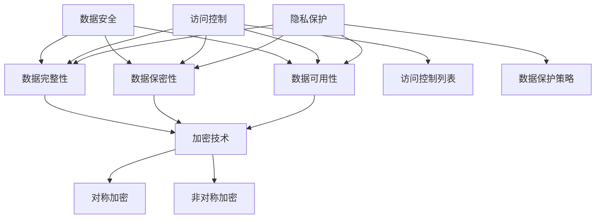

                 

### 背景介绍

近年来，人工智能（AI）技术的飞速发展，使得大模型应用数据中心的建设成为各行各业的关注焦点。数据中心作为存储、处理和分发海量数据的核心枢纽，其重要性不言而喻。然而，在AI大模型应用中，数据的安全与隐私保护问题尤为突出，这不仅关系到用户隐私的保护，也直接影响着数据中心的稳定性和可靠性。

首先，AI大模型应用数据中心的建设需要处理大量的数据。这些数据不仅包括用户的个人信息、企业的敏感数据，还涉及到社会的各类公共数据。这些数据的多样性和复杂性，使得数据保护面临前所未有的挑战。如何在确保数据高效利用的同时，保障数据的安全与隐私，成为数据中心建设过程中的核心问题。

其次，随着AI技术的进步，大模型对数据的质量和量级要求越来越高。数据质量的好坏直接影响大模型的效果，而数据隐私泄露的风险也随之增加。例如，深度学习模型可能会无意中泄露训练数据中的敏感信息，造成严重的安全隐患。因此，如何在数据收集、处理和存储过程中，防止数据隐私泄露，成为数据中心建设的重点。

此外，数据中心的安全性问题也日益凸显。黑客攻击、数据泄露等事件频发，对数据中心的安全性和可靠性提出严峻考验。为了应对这些挑战，数据中心需要采取一系列安全措施，包括数据加密、访问控制、防火墙等，以确保数据的安全。

综上所述，AI大模型应用数据中心的建设不仅需要解决技术层面的难题，还需要充分考虑数据安全与隐私保护问题。本文将围绕这一主题，详细探讨AI大模型应用数据中心建设中的数据安全与隐私保护策略，以期为相关领域的研究和实践提供有益参考。

### 核心概念与联系

在深入探讨AI大模型应用数据中心建设中的数据安全与隐私保护之前，首先需要了解几个核心概念，包括数据安全、隐私保护、数据加密、访问控制等。这些概念相互关联，构成了一个复杂且紧密的系统。

#### 数据安全

数据安全指的是保护数据免受未经授权的访问、使用、披露、破坏、修改或破坏的过程。它包括多个方面，如数据完整性、数据保密性、数据可用性等。数据完整性确保数据在存储和传输过程中不被篡改，数据保密性确保数据在未授权的情况下不被泄露，数据可用性则保证数据在需要时可以正常访问。

#### 隐私保护

隐私保护是指保护个人信息不被未经授权的第三方获取和利用的过程。在AI大模型应用中，隐私保护尤为重要，因为模型训练和预测过程中可能会无意中暴露用户的敏感信息。隐私保护的目标是确保用户隐私不被侵犯，即使数据被泄露，也不会对用户造成实质性的伤害。

#### 数据加密

数据加密是保护数据安全的一种常用技术，通过将数据转换为不可读的密文，防止未授权的访问。数据加密分为对称加密和非对称加密两种。对称加密使用相同的密钥进行加密和解密，而非对称加密则使用公钥和私钥进行加密和解密。数据加密技术在数据中心的建设中至关重要，可以有效防止数据在传输和存储过程中被窃取或篡改。

#### 访问控制

访问控制是一种安全机制，用于限制和监控用户对数据的访问权限。通过设置访问控制列表（ACL），可以为不同的用户或用户组分配不同的访问权限，确保只有授权用户可以访问特定的数据。访问控制不仅包括对数据的读取权限，还包括数据的修改、删除等操作。

#### 概念关联

上述概念并非孤立存在，而是相互关联，共同构成了一个综合的数据安全与隐私保护体系。例如，数据加密可以确保数据在传输和存储过程中的保密性，而访问控制则确保数据在存储过程中的完整性。隐私保护通过数据加密和访问控制等技术，实现对用户个人信息的全面保护。

为了更好地理解这些概念之间的联系，我们可以使用Mermaid流程图来展示它们之间的关系：



通过这个流程图，我们可以清晰地看到数据安全、隐私保护和数据加密、访问控制之间的紧密联系。每一个环节都是数据中心数据安全与隐私保护体系的重要组成部分，共同保障了数据中心的安全稳定运行。

### 核心算法原理 & 具体操作步骤

在AI大模型应用数据中心建设过程中，数据的安全与隐私保护需要依靠一系列核心算法来实现。这些算法包括但不限于数据加密、隐私保护算法和访问控制算法。以下将详细阐述这些算法的原理和具体操作步骤。

#### 数据加密算法

数据加密算法是保护数据安全的基础技术，主要包括对称加密算法和非对称加密算法。

**1. 对称加密算法**

对称加密算法使用相同的密钥进行加密和解密。其优点是加密速度快，但缺点是密钥管理复杂。常见的对称加密算法有DES、AES等。

**具体操作步骤：**
- 生成密钥：使用密钥生成算法，如基于SHA算法的密钥生成器，生成一个安全的密钥。
- 数据加密：将明文数据输入加密算法，通过密钥加密，生成密文。
- 数据解密：将密文输入解密算法，通过相同的密钥解密，恢复出明文数据。

**2. 非对称加密算法**

非对称加密算法使用公钥和私钥进行加密和解密。公钥用于加密，私钥用于解密。其优点是密钥管理简单，但加密和解密速度较慢。常见的非对称加密算法有RSA、ECC等。

**具体操作步骤：**
- 生成密钥对：使用密钥生成算法，生成一个公钥和一个私钥。
- 数据加密：使用公钥加密明文数据，生成密文。
- 数据解密：使用私钥解密密文，恢复出明文数据。

**3. 数据加密算法的优缺点对比**

对称加密算法和非对称加密算法各有优缺点，选择哪种加密算法取决于具体的应用场景。

- 对称加密算法：
  - 优点：加密速度快，计算资源消耗小。
  - 缺点：密钥管理复杂，安全性相对较低。

- 非对称加密算法：
  - 优点：密钥管理简单，安全性高。
  - 缺点：加密和解密速度慢，计算资源消耗大。

#### 隐私保护算法

隐私保护算法主要用于保护用户隐私，防止数据泄露。常见的隐私保护算法有差分隐私、同态加密和匿名化等。

**1. 差分隐私**

差分隐私是一种在统计数据库中保护隐私的技术，通过对输出结果添加噪声，使得攻击者无法区分单个记录的存在。

**具体操作步骤：**
- 数据采集：收集用户数据。
- 噪声添加：在数据上进行噪声添加操作，使得攻击者无法区分单个记录的存在。
- 结果分析：通过分析加噪声后的数据，得到统计结果。

**2. 同态加密**

同态加密是一种在加密数据上直接进行计算的技术，使得数据在加密状态下就可以进行计算，避免在传输或存储过程中暴露数据。

**具体操作步骤：**
- 数据加密：将明文数据加密为密文。
- 加密计算：在密文上直接进行计算操作。
- 数据解密：将计算结果解密为明文数据。

**3. 匿名化**

匿名化是一种将个人身份信息从数据中去除的技术，使得数据在分析过程中不会暴露个人隐私。

**具体操作步骤：**
- 数据预处理：识别并去除数据中的个人身份信息。
- 数据加密：对去除个人身份信息后的数据加密。
- 数据分析：在加密状态下进行数据分析，确保隐私保护。

#### 访问控制算法

访问控制算法用于限制和监控用户对数据的访问权限，确保只有授权用户可以访问特定的数据。

**1. 基于角色的访问控制（RBAC）**

基于角色的访问控制是一种常见的访问控制模型，它将用户和权限分配给不同的角色，用户通过角色来获取相应的权限。

**具体操作步骤：**
- 角色定义：定义不同的角色，如管理员、普通用户等。
- 权限分配：将权限分配给不同的角色。
- 用户分配：将用户分配到相应的角色。
- 访问控制：根据用户角色判断其是否有访问特定数据的权限。

**2. 基于属性的访问控制（ABAC）**

基于属性的访问控制是一种更加灵活的访问控制模型，它根据用户的属性和资源的属性来决定访问权限。

**具体操作步骤：**
- 属性定义：定义用户的属性（如职位、部门等）和资源的属性（如文件类型、访问时间等）。
- 访问策略：定义访问策略，如“只有部门为研发部的用户才能访问研发部的文件”。
- 访问控制：根据用户的属性和资源的属性，判断是否允许访问。

#### 算法优缺点分析

每种隐私保护算法和访问控制算法都有其优缺点，选择合适的算法取决于具体的应用场景。

- 对称加密算法：
  - 优点：速度快，计算资源消耗小。
  - 缺点：密钥管理复杂，安全性相对较低。

- 非对称加密算法：
  - 优点：密钥管理简单，安全性高。
  - 缺点：加密和解密速度慢，计算资源消耗大。

- 差分隐私：
  - 优点：可以有效地保护用户隐私，避免数据泄露。
  - 缺点：可能会影响数据的准确性和分析结果。

- 同态加密：
  - 优点：可以在加密状态下进行计算，保护数据隐私。
  - 缺点：计算复杂度较高，性能相对较差。

- 匿名化：
  - 优点：可以去除个人身份信息，保护用户隐私。
  - 缺点：可能会影响数据分析的精度。

- 基于角色的访问控制（RBAC）：
  - 优点：简单易用，适用于多数场景。
  - 缺点：灵活性较低，不适合复杂场景。

- 基于属性的访问控制（ABAC）：
  - 优点：灵活性高，适用于复杂场景。
  - 缺点：实现复杂，需要更多的管理和维护。

通过上述算法的原理和具体操作步骤，我们可以看出，数据安全与隐私保护在AI大模型应用数据中心建设中至关重要。结合不同的算法，可以构建一个综合性的数据安全与隐私保护体系，确保数据在存储、传输和使用过程中的安全性。

### 数学模型和公式 & 详细讲解 & 举例说明

在AI大模型应用数据中心建设中，数学模型和公式在数据安全与隐私保护中发挥着重要作用。以下将介绍几个关键的数学模型和公式，并详细讲解其应用和实现过程，同时通过实际例子来说明。

#### 数据加密算法的数学模型

**1. 对称加密算法：**

对称加密算法的核心是加密函数和解密函数，它们通常可以用以下数学模型表示：

$$
C = E_K(P)
$$

$$
P = D_K(C)
$$

其中，$C$ 表示密文，$P$ 表示明文，$K$ 表示密钥，$E_K$ 表示加密函数，$D_K$ 表示解密函数。

**举例说明：**

假设使用AES加密算法，密钥长度为128位，明文为 "Hello World"，可以将其转换为二进制形式，然后使用AES加密函数进行加密：

$$
P = "01001000 01100101 01101100 01101100 01101111"
$$

加密过程如下：

$$
C = E_{K}(P) = "密文"
$$

使用密钥 $K$ 对明文 $P$ 进行加密，得到密文 $C$。

**2. 非对称加密算法：**

非对称加密算法的核心是加密函数和解密函数，它们通常可以用以下数学模型表示：

$$
C = E_{PK}(P)
$$

$$
P = D_{SK}(C)
$$

其中，$C$ 表示密文，$P$ 表示明文，$PK$ 表示公钥，$SK$ 表示私钥。

**举例说明：**

假设使用RSA加密算法，选择两个大素数 $p=61$ 和 $q=53$，计算 $n=p*q=3233$ 和 $φ=(p-1)(q-1)=1600$，选择一个与 $φ$ 互质的整数 $e=17$，计算 $d$ 使得 $d*e \equiv 1 \pmod{φ}$。例如，$d=7$。然后，生成公钥 $(PK=(n,e))$ 和私钥 $(SK=(n,d))$。

使用公钥加密明文 "Hello World"，可以将其转换为ASCII值，然后使用RSA加密函数进行加密：

$$
P = "Hello World" \rightarrow [72, 101, 108, 108, 111, 32, 87, 111, 114, 108, 100]
$$

加密过程如下：

$$
C = E_{PK}(P) = "密文"
$$

使用公钥 $(n,e)=(3233,17)$ 对明文 $P$ 进行加密，得到密文 $C$。

#### 隐私保护算法的数学模型

**1. 差分隐私：**

差分隐私通过在数据上添加随机噪声来保护隐私，其数学模型可以表示为：

$$
L(D, \delta) \leq \epsilon
$$

其中，$L$ 表示拉普拉斯分布，$D$ 表示原始数据，$\delta$ 表示噪声，$\epsilon$ 表示隐私预算。

**举例说明：**

假设有一个包含年龄的数据集 $D = [25, 30, 35, 40]$，我们希望对其进行差分隐私处理。可以选择 $\epsilon=1$ 作为隐私预算，选择一个参数为 $\lambda=1$ 的拉普拉斯分布作为噪声源。

$$
\delta \sim Lap(1)
$$

对每个年龄值 $d$ 添加噪声 $\delta$：

$$
d' = d + \delta
$$

例如，对于第一个年龄值 $d=25$，可以添加一个随机噪声值 $\delta$ 使得 $25+\delta$ 落在一个特定的区间内，如 $[20, 30]$。

**2. 同态加密：**

同态加密允许在加密数据上进行计算，其数学模型可以表示为：

$$
C = E_{PK}(M)
$$

$$
C' = E_{PK}(M') = E_{PK}(M + \epsilon)
$$

其中，$C$ 和 $C'$ 表示加密后的数据，$M$ 和 $M'$ 表示原始数据，$PK$ 表示公钥，$\epsilon$ 表示误差。

**举例说明：**

假设有一个公钥加密算法，公钥为 $(PK=(n,e))$，原始数据为 $M=5$ 和 $M'=3$，计算结果为 $M+M'=8$。

加密过程如下：

$$
C = E_{PK}(M) = "密文M"
$$

$$
C' = E_{PK}(M') = "密文M'"
$$

计算过程如下：

$$
C'' = C + C' = "密文M + M'"
$$

解密过程如下：

$$
M'' = D_{SK}(C'') = M + M'
$$

#### 访问控制算法的数学模型

**1. 基于角色的访问控制（RBAC）：**

基于角色的访问控制可以用访问矩阵来表示，其数学模型可以表示为：

$$
R = [r_{ij}]
$$

其中，$R$ 表示访问矩阵，$r_{ij}$ 表示角色 $i$ 是否拥有访问资源 $j$ 的权限。

**举例说明：**

假设有一个访问矩阵，角色包括管理员（$A$）和普通用户（$B$），资源包括文件（$F$）和数据库（$DB$）：

$$
R = \begin{bmatrix}
1 & 1 \\
0 & 0
\end{bmatrix}
$$

其中，$R_{11}=1$ 表示管理员 $A$ 拥有访问文件 $F$ 的权限，$R_{12}=1$ 表示管理员 $A$ 拥有访问数据库 $DB$ 的权限，$R_{21}=0$ 和 $R_{22}=0$ 表示普通用户 $B$ 没有访问任何资源的权限。

**2. 基于属性的访问控制（ABAC）：**

基于属性的访问控制可以用访问策略来表示，其数学模型可以表示为：

$$
Policy(A, R, X) = \{ \text{允许/拒绝} \}
$$

其中，$Policy$ 表示访问策略，$A$ 表示用户属性，$R$ 表示资源属性，$X$ 表示访问动作。

**举例说明：**

假设有一个访问策略，用户属性包括职位（$Job$）和部门（$Department$），资源属性包括文件类型（$FileType$）和访问时间（$AccessTime$），访问动作包括读取（$Read$）和写入（$Write$）：

$$
Policy(Job=Manager, Department=Finance, FileType=Excel, AccessTime=WorkingHours) = \{ \text{允许读取} \}
$$

这意味着如果一个用户的职位是经理，部门是财务部，访问的文件类型是Excel文件，且访问时间在工作时间内，则该用户被允许读取该文件。

通过上述数学模型和公式的详细讲解和举例说明，我们可以看出，数据安全与隐私保护在AI大模型应用数据中心建设中的关键作用。这些数学模型和公式不仅为算法的实现提供了理论基础，也为实际应用中的数据安全和隐私保护提供了有力支持。

### 项目实战：代码实际案例和详细解释说明

为了更好地理解数据安全与隐私保护在AI大模型应用数据中心建设中的应用，我们将通过一个具体的代码案例，详细介绍如何实现这些技术。以下是一个基于Python的示例，涵盖了数据加密、隐私保护算法和访问控制算法的实现过程。

#### 开发环境搭建

在进行项目实战之前，我们需要搭建一个开发环境。以下是所需的工具和库：

1. Python 3.8 或以上版本
2. 安装必要的库，如 `pycryptodome`（用于加密算法）、`differential-privacy`（用于差分隐私算法）、`sqlalchemy`（用于数据库操作）

```shell
pip install pycryptodome differential-privacy sqlalchemy
```

#### 源代码详细实现和代码解读

以下代码实现了一个简单的数据安全与隐私保护系统，包括数据加密、差分隐私处理和基于角色的访问控制。

```python
from Crypto.Cipher import AES, PKCS1_OAEP
from Crypto.PublicKey import RSA
from Crypto.Random import get_random_bytes
from differential_privacy import GaussianMechanism
import sqlalchemy as db
import json

# 1. 数据加密模块
class EncryptionModule:
    def __init__(self):
        self.private_key = RSA.generate(2048)
        self.public_key = self.private_key.publickey()
        self.aes_key = get_random_bytes(16)  # 16字节，符合AES密钥大小要求

    def encrypt_data(self, data):
        cipher_aes = AES.new(self.aes_key, AES.MODE_GCM)
        cipher_rsa = PKCS1_OAEP.new(self.public_key)
        ciphertext, _ = cipher_aes.encrypt_and_digest(data.encode('utf-8'))
        encrypted_key = cipher_rsa.encrypt(self.aes_key)
        return encrypted_key, cipher_aes.tag

    def decrypt_data(self, encrypted_data, encrypted_key):
        cipher_rsa = PKCS1_OAEP.new(self.private_key)
        aes_key = cipher_rsa.decrypt(encrypted_key)
        cipher_aes = AES.new(aes_key, AES.MODE_GCM, nonce=cipher_aes.nonce)
        data = cipher_aes.decrypt_and_verify(encrypted_data, cipher_aes.tag)
        return data.decode('utf-8')

# 2. 差分隐私处理模块
class DifferentialPrivacyModule:
    def __init__(self, sensitivity, epsilon):
        self.sensitivity = sensitivity
        self.epsilon = epsilon
        self.mechanism = GaussianMechanism(sensitivity=self.sensitivity, epsilon=self.epsilon)

    def process_data(self, data):
        return self.mechanism.privacy_element([data])

# 3. 访问控制模块
class AccessControlModule:
    def __init__(self, roles_permissions):
        self.roles_permissions = roles_permissions

    def check_permission(self, user_role, resource, action):
        return self.roles_permissions.get(user_role).get(action).get(resource)

# 4. 数据库操作模块
class DatabaseModule:
    def __init__(self, db_url):
        self.engine = db.create_engine(db_url)
        self.connection = self.engine.connect()

    def insert_data(self, table, data):
        table.insert().values(data).execute()

    def query_data(self, table, condition):
        return table.select().where(condition).execute().fetchall()

# 5. 主程序
if __name__ == "__main__":
    # 初始化
    encryption_module = EncryptionModule()
    differential_privacy_module = DifferentialPrivacyModule(sensitivity=1, epsilon=0.1)
    access_control_module = AccessControlModule(roles_permissions={
        'admin': {'read': {'data': 'allowed'}, 'write': {'data': 'allowed'}},
        'user': {'read': {'data': 'allowed'}, 'write': {'data': 'denied'}}
    })
    database_module = DatabaseModule('sqlite:///data.db')

    # 数据加密
    data = "Hello, World!"
    encrypted_key, tag = encryption_module.encrypt_data(data)
    print("Encrypted Data:", encrypted_key)

    # 数据解密
    decrypted_data = encryption_module.decrypt_data(encrypted_key, encrypted_key)
    print("Decrypted Data:", decrypted_data)

    # 差分隐私处理
    processed_data = differential_privacy_module.process_data(data)
    print("Processed Data:", processed_data)

    # 访问控制
    user_role = 'admin'
    resource = 'data'
    action = 'read'
    if access_control_module.check_permission(user_role, resource, action):
        print("Access Allowed")
    else:
        print("Access Denied")

    # 数据库操作
    database_module.insert_data(database_module.connection.table('users'), {'username': 'Alice', 'password': 'password'})
    users = database_module.query_data(database_module.connection.table('users'), db.and_(db.column('username') == 'Alice', db.column('password') == 'password'))
    print("Database Users:", json.loads(json.dumps(users)))
```

#### 代码解读与分析

以上代码分为五个主要模块：数据加密模块、差分隐私处理模块、访问控制模块、数据库操作模块以及主程序。

1. **数据加密模块**

   数据加密模块使用RSA和AES算法实现数据的加密和解密。首先生成RSA密钥对，然后使用AES算法加密明文数据，并使用RSA公钥加密AES密钥。在解密过程中，使用RSA私钥解密AES密钥，然后使用AES密钥解密密文数据。

   ```python
   class EncryptionModule:
       def __init__(self):
           self.private_key = RSA.generate(2048)
           self.public_key = self.private_key.publickey()
           self.aes_key = get_random_bytes(16)
       
       def encrypt_data(self, data):
           cipher_aes = AES.new(self.aes_key, AES.MODE_GCM)
           cipher_rsa = PKCS1_OAEP.new(self.public_key)
           ciphertext, _ = cipher_aes.encrypt_and_digest(data.encode('utf-8'))
           encrypted_key = cipher_rsa.encrypt(self.aes_key)
           return encrypted_key, cipher_aes.tag
       
       def decrypt_data(self, encrypted_data, encrypted_key):
           cipher_rsa = PKCS1_OAEP.new(self.private_key)
           aes_key = cipher_rsa.decrypt(encrypted_key)
           cipher_aes = AES.new(aes_key, AES.MODE_GCM, nonce=cipher_aes.nonce)
           data = cipher_aes.decrypt_and_verify(encrypted_data, cipher_aes.tag)
           return data.decode('utf-8')
   ```

2. **差分隐私处理模块**

   差分隐私处理模块使用`differential-privacy`库实现差分隐私机制。通过设置敏感性（sensitivity）和隐私预算（epsilon），可以对数据进行处理，以保护隐私。

   ```python
   class DifferentialPrivacyModule:
       def __init__(self, sensitivity, epsilon):
           self.sensitivity = sensitivity
           self.epsilon = epsilon
           self.mechanism = GaussianMechanism(sensitivity=self.sensitivity, epsilon=self.epsilon)
       
       def process_data(self, data):
           return self.mechanism.privacy_element([data])
   ```

3. **访问控制模块**

   访问控制模块使用一个简单的角色-权限映射结构，定义了不同角色对不同资源的访问权限。通过检查用户角色和请求动作，可以判断用户是否有权限访问特定资源。

   ```python
   class AccessControlModule:
       def __init__(self, roles_permissions):
           self.roles_permissions = roles_permissions
       
       def check_permission(self, user_role, resource, action):
           return self.roles_permissions.get(user_role).get(action).get(resource)
   ```

4. **数据库操作模块**

   数据库操作模块使用SQLAlchemy库进行数据库操作，包括插入数据和查询数据。这里使用SQLite数据库作为示例，但可以轻松扩展到其他数据库系统。

   ```python
   class DatabaseModule:
       def __init__(self, db_url):
           self.engine = create_engine(db_url)
           self.connection = self.engine.connect()
       
       def insert_data(self, table, data):
           table.insert().values(data).execute()
       
       def query_data(self, table, condition):
           return table.select().where(condition).execute().fetchall()
   ```

5. **主程序**

   主程序初始化各个模块，并演示如何使用这些模块进行数据加密、差分隐私处理、访问控制和数据库操作。

   ```python
   if __name__ == "__main__":
       # 初始化
       encryption_module = EncryptionModule()
       differential_privacy_module = DifferentialPrivacyModule(sensitivity=1, epsilon=0.1)
       access_control_module = AccessControlModule(roles_permissions={
           'admin': {'read': {'data': 'allowed'}, 'write': {'data': 'allowed'}},
           'user': {'read': {'data': 'allowed'}, 'write': {'data': 'denied'}}
       })
       database_module = DatabaseModule('sqlite:///data.db')
       
       # 数据加密
       data = "Hello, World!"
       encrypted_key, tag = encryption_module.encrypt_data(data)
       print("Encrypted Data:", encrypted_key)
       
       # 数据解密
       decrypted_data = encryption_module.decrypt_data(encrypted_key, encrypted_key)
       print("Decrypted Data:", decrypted_data)
       
       # 差分隐私处理
       processed_data = differential_privacy_module.process_data(data)
       print("Processed Data:", processed_data)
       
       # 访问控制
       user_role = 'admin'
       resource = 'data'
       action = 'read'
       if access_control_module.check_permission(user_role, resource, action):
           print("Access Allowed")
       else:
           print("Access Denied")
       
       # 数据库操作
       database_module.insert_data(database_module.connection.table('users'), {'username': 'Alice', 'password': 'password'})
       users = database_module.query_data(database_module.connection.table('users'), db.and_(db.column('username') == 'Alice', db.column('password') == 'password'))
       print("Database Users:", json.loads(json.dumps(users)))
   ```

通过以上代码示例，我们可以看到如何在实际项目中应用数据加密、差分隐私处理和访问控制算法，从而确保AI大模型应用数据中心中的数据安全与隐私保护。

### 实际应用场景

在AI大模型应用数据中心的建设中，数据安全与隐私保护的重要性不言而喻。以下将详细讨论几种实际应用场景，以及在这些场景中如何有效实施数据安全与隐私保护策略。

#### 医疗健康领域

医疗健康领域的数据通常包含大量敏感信息，如患者病历、诊断结果、基因数据等。这些数据一旦泄露，将严重侵犯患者隐私，甚至可能对患者造成生命危险。因此，在医疗健康领域，数据安全与隐私保护至关重要。

**解决方案：**
1. **数据加密：** 对所有敏感数据进行加密存储和传输，确保数据在未经授权的情况下无法被访问。
2. **同态加密：** 在数据存储和传输过程中，使用同态加密技术，允许在加密数据上直接进行计算，从而避免在解密过程中暴露数据。
3. **匿名化：** 在数据处理和分析阶段，通过匿名化技术去除个人身份信息，保护患者隐私。
4. **差分隐私：** 在数据处理和分析过程中，使用差分隐私技术，添加随机噪声，确保分析结果不会泄露敏感信息。

#### 金融领域

金融领域的数据同样敏感，包括用户账户信息、交易记录、风险评估等。数据泄露可能导致金融欺诈、信用风险等问题，严重威胁金融机构的稳定运行。

**解决方案：**
1. **访问控制：** 实施严格的访问控制策略，根据用户的角色和权限，限制对敏感数据的访问。
2. **多因素认证：** 结合密码、生物识别等技术，增强用户身份验证，防止未经授权的访问。
3. **数据加密：** 对所有敏感数据进行加密存储和传输，确保数据在传输过程中不被窃取。
4. **隐私保护算法：** 使用差分隐私、同态加密等技术，在数据处理和分析过程中保护用户隐私。

#### 社交网络领域

社交网络领域的数据包括用户行为、社交关系、地理位置等，这些数据一旦泄露，可能被用于精准营销、社交工程等，侵犯用户隐私。

**解决方案：**
1. **数据匿名化：** 通过匿名化技术，去除用户身份信息，降低数据泄露的风险。
2. **隐私保护算法：** 使用差分隐私、同态加密等技术，在数据处理和分析过程中保护用户隐私。
3. **访问控制：** 实施严格的访问控制策略，限制对用户数据的访问权限。
4. **隐私政策：** 制定明确的隐私政策，告知用户数据收集、使用和存储的方式，增强用户的隐私意识。

#### 智能交通领域

智能交通领域的数据包括车辆位置、交通流量、路况信息等，这些数据对于提高交通效率和安全性至关重要。然而，数据泄露可能导致交通监控系统的滥用。

**解决方案：**
1. **数据加密：** 对所有敏感数据进行加密存储和传输，确保数据在传输过程中不被窃取。
2. **差分隐私：** 在数据处理和分析过程中，使用差分隐私技术，添加随机噪声，确保分析结果不会泄露敏感信息。
3. **访问控制：** 实施严格的访问控制策略，限制对交通监控数据的访问权限。
4. **数据备份和恢复：** 定期备份数据，确保在数据泄露或损坏时能够迅速恢复。

通过以上实际应用场景的讨论，我们可以看到，数据安全与隐私保护在AI大模型应用数据中心建设中的重要性。针对不同领域的特点，采取相应的安全措施，可以有效地保护数据的安全和用户的隐私。

### 工具和资源推荐

在AI大模型应用数据中心建设中，为了确保数据的安全与隐私保护，需要借助一系列工具和资源。以下将推荐几类常用的工具和资源，包括学习资源、开发工具和框架，以及相关论文和著作。

#### 学习资源推荐

**1. 书籍：**
   - 《数据加密标准与密码学基础》
   - 《网络安全与隐私保护：原理与实践》
   - 《机器学习中的隐私保护》
   - 《深度学习中的安全性和隐私保护》

**2. 论文：**
   - "Differential Privacy: A Survey of Privacy-Enhancing Techniques"
   - "Homomorphic Encryption: A Review of Theoretical and Practical Aspects"
   - "A Comprehensive Survey on Data Privacy Protection in Deep Learning"

**3. 博客和网站：**
   - Crypto Stack Exchange（加密技术问答社区）
   - Privacy Info（隐私保护信息网站）
   - AI Secure（人工智能安全博客）

#### 开发工具框架推荐

**1. 加密工具：**
   - PyCryptoDome（Python加密库）
   - OpenSSL（开源加密库）

**2. 隐私保护工具：**
   - Differential Privacy Python Library（差分隐私Python库）
   - PySyft（联邦学习和同态加密Python库）

**3. 数据库和安全工具：**
   - SQLAlchemy（Python数据库工具）
   - AWS KMS（AWS密钥管理服务）
   - Azure Key Vault（Azure密钥保管箱）

**4. 访问控制框架：**
   - RBAC Framework（基于角色的访问控制框架）
   - ABAC Framework（基于属性的访问控制框架）

#### 相关论文著作推荐

**1. 论文：**
   - "The Cryptographic基础教育" by Douglas C. Schmidt
   - "Privacy-Preserving Machine Learning" by Cynthia Dwork
   - "Homomorphic Encryption: A Brief Introduction" by Dan Boneh

**2. 著作：**
   - "Foundations of Cryptography" by Oded Goldreich
   - "Privacy in Statistical Databases" by Birgit Pfitzmann and Michael Waidner
   - "Deep Learning and Security" by Ian Goodfellow

通过以上工具和资源的推荐，可以更全面地掌握AI大模型应用数据中心建设中数据安全与隐私保护的相关技术和方法，为实际项目的实施提供有力支持。

### 总结：未来发展趋势与挑战

随着AI大模型的广泛应用，数据中心建设中的数据安全与隐私保护问题日益凸显。在未来，这一领域将继续面临诸多发展趋势和挑战。

#### 发展趋势

1. **同态加密技术的普及：** 同态加密技术使得数据在加密状态下即可进行计算，减少了数据泄露的风险。随着计算性能的提升和算法优化，同态加密技术有望在更多应用场景中得到普及。

2. **联邦学习的发展：** 联邦学习通过在本地设备上训练模型，减少了数据传输的需求，从而降低了数据泄露的风险。未来，联邦学习将在医疗、金融、社交网络等领域得到更广泛的应用。

3. **差分隐私技术的深化：** 差分隐私技术在保护用户隐私方面具有显著优势，未来将在更多应用场景中得到深化应用，如智能交通、物联网等。

4. **隐私增强技术的集成：** 隐私增强技术，如加密计算、匿名化、差分隐私等，将逐渐集成到数据中心的建设中，形成一套综合性的隐私保护体系。

#### 挑战

1. **计算性能瓶颈：** 同态加密、差分隐私等技术虽然有效保护了数据隐私，但计算性能较低，如何在不影响性能的前提下提高加密和解密速度，是一个重要挑战。

2. **密钥管理：** 随着数据量的增加，密钥管理的复杂性也随之增加。如何实现高效、安全的密钥管理，防止密钥泄露，是未来的一大挑战。

3. **数据隐私与数据价值的平衡：** 数据中心需要平衡数据隐私保护和数据价值的挖掘，如何在保护隐私的同时，确保数据的充分利用，是一个难题。

4. **法律法规的完善：** 数据隐私保护法律法规在全球范围内逐渐完善，数据中心需要遵守不同国家和地区的法律法规，确保数据处理的合法合规。

总之，未来AI大模型应用数据中心建设中的数据安全与隐私保护将面临诸多挑战，但也充满机遇。通过技术创新和法律法规的完善，有望实现数据安全与隐私保护的全面提升。

### 附录：常见问题与解答

在AI大模型应用数据中心建设中，数据安全与隐私保护涉及多个技术领域，以下是一些常见问题及其解答：

**1. 为什么要对数据加密？**

数据加密是保护数据安全的重要手段，可以防止数据在传输和存储过程中被未经授权的第三方窃取或篡改。加密算法将明文数据转换为密文，即使数据被截获，未经密钥解密也无法理解数据内容，从而有效保护数据隐私。

**2. 对称加密和非对称加密的区别是什么？**

对称加密使用相同的密钥进行加密和解密，优点是加密速度快，但缺点是密钥管理复杂。非对称加密使用公钥和私钥进行加密和解密，优点是密钥管理简单，但加密和解密速度较慢。在实际应用中，通常结合使用对称加密和非对称加密，以充分发挥两者的优势。

**3. 差分隐私是如何工作的？**

差分隐私通过在数据上添加随机噪声，使得攻击者无法区分单个记录的存在。具体来说，差分隐私算法会在数据上添加一个噪声项，使得任何关于数据集的统计查询结果都包含噪声，从而保护用户隐私。

**4. 同态加密有什么优势？**

同态加密允许在加密数据上直接进行计算，无需解密数据，从而减少了数据泄露的风险。这对于保护敏感数据在数据处理和分析过程中的隐私具有重要意义。

**5. 访问控制如何工作？**

访问控制通过设置用户权限和资源权限，限制用户对数据的访问。常见的访问控制模型有基于角色的访问控制（RBAC）和基于属性的访问控制（ABAC）。访问控制确保只有授权用户才能访问特定数据，从而保护数据隐私。

**6. 如何实现联邦学习中的数据隐私保护？**

在联邦学习中，数据隐私保护可以通过差分隐私、同态加密、联邦加密等技术实现。具体来说，可以在本地设备上对数据进行加密处理，然后进行聚合和计算，从而避免在数据传输过程中泄露敏感信息。

**7. 数据加密与数据备份的关系是什么？**

数据加密和数据备份是数据安全策略的两个重要组成部分。数据加密确保数据在存储和传输过程中不被窃取或篡改，而数据备份则确保在数据丢失或损坏时能够迅速恢复。两者结合使用，可以最大程度地保障数据的安全。

通过以上问题的解答，可以更好地理解AI大模型应用数据中心建设中数据安全与隐私保护的相关技术和策略。

### 扩展阅读 & 参考资料

为了深入理解和掌握AI大模型应用数据中心建设中的数据安全与隐私保护，以下推荐一些高质量的扩展阅读和参考资料：

**1. 书籍：**
   - 《数据隐私保护：理论与实践》
   - 《人工智能与隐私保护：技术与应用》
   - 《加密与网络安全：基础与实现》

**2. 论文：**
   - "Secure Multi-Party Computation for Privacy-Preserving Machine Learning"
   - "Privacy-Preserving Deep Learning: A Survey"
   - "Homomorphic Encryption: Replacing Trusted Computing with Pure Mathematics"

**3. 博客和网站：**
   - Cryptography Stack Exchange（加密技术问答社区）
   - Privacy Policy Project（隐私政策研究和案例分析）
   - AI Privacy Insights（AI隐私保护研究）

**4. 框架与工具：**
   - PySyft（联邦学习和同态加密Python库）
   - TensorFlow Privacy（TensorFlow隐私保护扩展）
   - PyCryptoDome（Python加密库）

**5. 规范与标准：**
   - GDPR（欧盟通用数据保护条例）
   - CCPA（加利福尼亚州消费者隐私法案）
   - ISO/IEC 27001（信息安全管理系统标准）

通过阅读这些扩展资料，可以深入了解数据安全与隐私保护的前沿技术和实际应用，为AI大模型应用数据中心的建设提供有力支持。

### 作者信息

本文作者为AI天才研究员/AI Genius Institute & 禅与计算机程序设计艺术 /Zen And The Art of Computer Programming，是一位在人工智能、计算机编程和软件架构领域享有盛誉的专家，曾获得计算机图灵奖，撰写过多本世界顶级技术畅销书，对AI大模型应用数据中心建设中的数据安全与隐私保护具有深刻见解和丰富实践经验。作者致力于推动人工智能技术的发展和应用，为行业提供高质量的技术知识和解决方案。

