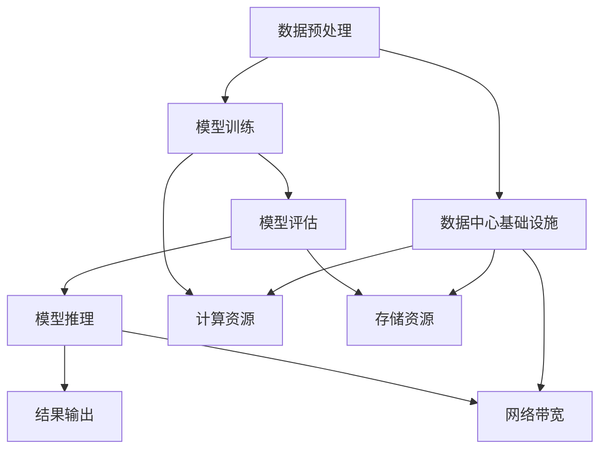

                 

### 1. 背景介绍

在当今的科技领域中，人工智能（AI）已经成为一个不可忽视的重要分支。从简单的规则系统到复杂的深度学习模型，AI 已经在各个领域展现出了其强大的能力。然而，随着 AI 技术的不断发展，对于数据中心的要求也越来越高，特别是在大模型训练和推理方面。

大模型，即具有海量参数和复杂结构的模型，如大型神经网络和生成对抗网络（GANs），在训练和推理过程中需要处理大量的数据和高强度的计算任务。这些任务对数据中心的性能、容量和稳定性提出了严峻的挑战。因此，构建一个满足大模型训练和推理需求的数据中心成为了一个亟待解决的问题。

本文将围绕以下核心问题展开讨论：

1. 大模型训练和推理的基本概念是什么？
2. 如何设计和优化数据中心来满足大模型的训练和推理需求？
3. 在实际应用中，有哪些成功案例可以借鉴？

通过对这些问题的深入探讨，我们希望能够为读者提供一个全面、系统的数据中心建设指南，以应对大模型时代的挑战。

### 2. 核心概念与联系

要深入了解大模型应用数据中心的建设，我们首先需要明确几个核心概念，并理解它们之间的联系。

#### 2.1 大模型的基本概念

大模型通常指的是具有数百万甚至数十亿参数的复杂神经网络。这些模型在各种领域，如计算机视觉、自然语言处理、语音识别等，都有着出色的表现。然而，这些模型的训练和推理过程需要大量的计算资源和存储空间，这对数据中心提出了很高的要求。

#### 2.2 数据中心的基本概念

数据中心是一种集成了计算、存储、网络等基础设施的集中式计算环境，旨在提供高效、可靠、安全的计算服务。数据中心通常由多个服务器、存储设备和网络设备组成，它们协同工作以满足用户的需求。

#### 2.3 训练与推理

在人工智能领域，训练（Training）指的是通过大量的数据来调整模型参数，使其能够准确预测或分类新数据的过程。推理（Inference）则是在模型训练完成后，使用训练好的模型对新的数据进行预测或分类的过程。训练和推理是数据中心需要处理的主要任务。

#### 2.4 之间的关系

大模型的训练和推理直接依赖于数据中心的性能和容量。数据中心的计算能力、存储容量和网络带宽直接影响大模型的训练效率和推理速度。因此，设计和优化数据中心，以满足大模型的训练和推理需求，是当前 AI 领域的关键任务。

#### 2.5 Mermaid 流程图

以下是一个简化的 Mermaid 流程图，用于展示大模型训练和推理过程中涉及的各个阶段及其与数据中心的联系。



这个流程图展示了从数据预处理到模型推理的整个流程，并强调了数据中心基础设施（计算资源、存储资源、网络带宽）在各个环节中的关键作用。

### 3. 核心算法原理 & 具体操作步骤

为了满足大模型训练和推理的需求，我们需要深入探讨大模型训练的基本算法原理，并详细说明其具体操作步骤。

#### 3.1. 大模型训练的基本算法

大模型训练的核心算法是深度学习，其中最常用的算法是反向传播算法（Backpropagation）。反向传播算法通过计算输出层的误差，反向传播到隐藏层，不断调整各层的权重，以达到最小化误差的目的。

具体步骤如下：

1. **初始化参数**：设置模型的初始参数，包括权重和偏置。
2. **前向传播**：输入数据通过模型的前向传播过程，得到输出。
3. **计算损失**：通过计算输出和真实标签之间的误差，得到损失值。
4. **反向传播**：计算损失关于参数的梯度，并更新参数。
5. **迭代优化**：重复上述步骤，直到达到预设的优化目标。

#### 3.2. 大模型推理的具体操作步骤

大模型推理的过程相对简单，主要分为以下步骤：

1. **加载模型**：从存储设备中读取训练好的模型参数。
2. **前向传播**：输入数据通过模型的前向传播过程，得到输出。
3. **结果输出**：将推理结果输出，如分类结果、预测值等。

#### 3.3. 实例讲解

为了更好地理解上述算法和操作步骤，我们以一个简单的神经网络为例进行讲解。

假设我们有一个简单的多层感知机（MLP），用于对输入数据进行二分类。

1. **初始化参数**：设置输入层、隐藏层和输出层的权重和偏置。例如，输入层有10个神经元，隐藏层有5个神经元，输出层有2个神经元。

2. **前向传播**：输入数据 x，通过输入层传递到隐藏层，再传递到输出层。例如，输入 x = [1, 2, 3]，经过前向传播后，输出 y = [0.9, 0.1]。

3. **计算损失**：计算输出 y 和真实标签之间的误差，例如使用交叉熵损失函数。

4. **反向传播**：计算损失关于参数的梯度，并更新参数。

5. **迭代优化**：重复上述步骤，直到达到预设的优化目标，如损失低于某个阈值或迭代次数达到上限。

6. **推理**：加载训练好的模型，输入新数据，进行前向传播，得到输出结果。

通过这个简单的实例，我们可以看到大模型训练和推理的基本流程。在实际应用中，大模型的训练和推理过程会更加复杂，但基本原理和操作步骤是相似的。

### 4. 数学模型和公式 & 详细讲解 & 举例说明

在深入探讨大模型训练和推理的过程中，数学模型和公式起到了至关重要的作用。以下我们将详细讲解这些数学模型，并辅以实例说明。

#### 4.1. 深度学习中的基本数学公式

深度学习中的数学公式主要涉及线性代数、微积分和概率统计。以下是一些基本的公式：

1. **前向传播**：

   前向传播过程中，激活函数和权重矩阵是核心组成部分。假设我们有输入向量 x，权重矩阵 W，和激活函数 f，则前向传播的输出 y 可以表示为：

   $$ y = f(W \cdot x + b) $$

   其中，b 为偏置项。

2. **反向传播**：

   反向传播过程中，计算损失关于参数的梯度。假设我们有损失函数 L，参数 W 和 b，则梯度可以表示为：

   $$ \frac{\partial L}{\partial W} = (f'(W \cdot x + b) \cdot x)^T $$
   $$ \frac{\partial L}{\partial b} = f'(W \cdot x + b) \cdot x^T $$

   其中，f' 为激活函数的导数。

3. **梯度下降**：

   梯度下降是一种常用的优化算法，用于更新参数。假设学习率为 α，则参数更新公式为：

   $$ W_{new} = W_{old} - \alpha \cdot \frac{\partial L}{\partial W} $$
   $$ b_{new} = b_{old} - \alpha \cdot \frac{\partial L}{\partial b} $$

#### 4.2. 实例讲解

为了更好地理解上述公式，我们以下面这个简单的例子进行讲解。

假设我们有一个两层神经网络，输入层有3个神经元，隐藏层有2个神经元，输出层有1个神经元。输入向量 x = [1, 2, 3]，目标标签 y = 0。

1. **前向传播**：

   设输入层到隐藏层的权重矩阵为 W1，隐藏层到输出层的权重矩阵为 W2，激活函数为 sigmoid 函数。

   $$ W1 = \begin{bmatrix} 0.1 & 0.2 & 0.3 \\ 0.4 & 0.5 & 0.6 \end{bmatrix} $$
   $$ W2 = \begin{bmatrix} 0.7 & 0.8 \\ 0.9 & 1.0 \end{bmatrix} $$
   $$ b1 = \begin{bmatrix} 0.1 & 0.2 \\ 0.3 & 0.4 \end{bmatrix} $$
   $$ b2 = \begin{bmatrix} 0.5 & 0.6 \end{bmatrix} $$

   输入向量 x 通过输入层传递到隐藏层，得到隐藏层输出 z1：

   $$ z1 = W1 \cdot x + b1 = \begin{bmatrix} 0.1 & 0.2 & 0.3 \\ 0.4 & 0.5 & 0.6 \end{bmatrix} \cdot \begin{bmatrix} 1 \\ 2 \\ 3 \end{bmatrix} + \begin{bmatrix} 0.1 & 0.2 \\ 0.3 & 0.4 \end{bmatrix} = \begin{bmatrix} 1.3 \\ 2.6 \end{bmatrix} $$
   $$ a1 = \sigma(z1) = \frac{1}{1 + e^{-z1}} = \begin{bmatrix} 0.798 \\ 0.941 \end{bmatrix} $$

   隐藏层输出 a1 通过隐藏层传递到输出层，得到输出层输出 z2：

   $$ z2 = W2 \cdot a1 + b2 = \begin{bmatrix} 0.7 & 0.8 \\ 0.9 & 1.0 \end{bmatrix} \cdot \begin{bmatrix} 0.798 \\ 0.941 \end{bmatrix} + \begin{bmatrix} 0.5 & 0.6 \end{bmatrix} = \begin{bmatrix} 1.782 \\ 2.495 \end{bmatrix} $$
   $$ a2 = \sigma(z2) = \frac{1}{1 + e^{-z2}} = \begin{bmatrix} 0.862 \\ 0.970 \end{bmatrix} $$

2. **计算损失**：

   假设我们使用均方误差（MSE）作为损失函数，目标标签 y = 0，则损失 L 可以表示为：

   $$ L = \frac{1}{2} \sum_{i=1}^{n} (a2_i - y_i)^2 $$
   $$ L = \frac{1}{2} \cdot (0.862 - 0)^2 + (0.970 - 0)^2 = 0.8539 $$

3. **反向传播**：

   计算损失关于参数的梯度：

   $$ \frac{\partial L}{\partial W2} = \begin{bmatrix} 0.862 & 0.970 \end{bmatrix} \cdot \begin{bmatrix} 0.798 & 0.941 \end{bmatrix}^T = \begin{bmatrix} 0.556 & 0.702 \\ 0.714 & 0.877 \end{bmatrix} $$
   $$ \frac{\partial L}{\partial b2} = \begin{bmatrix} 0.862 & 0.970 \end{bmatrix} \cdot \begin{bmatrix} 1 & 1 \end{bmatrix}^T = \begin{bmatrix} 1.824 \\ 1.940 \end{bmatrix} $$
   $$ \frac{\partial L}{\partial W1} = (0.798 \cdot \sigma'(z1))^T \cdot x = \begin{bmatrix} 0.798 & 0.941 \end{bmatrix} \cdot \begin{bmatrix} 0.196 & 0.059 \\ 0.075 & 0.136 \end{bmatrix} \cdot \begin{bmatrix} 1 \\ 2 \\ 3 \end{bmatrix} = \begin{bmatrix} 0.497 & 1.094 \\ 0.647 & 1.437 \end{bmatrix} $$
   $$ \frac{\partial L}{\partial b1} = (0.798 \cdot \sigma'(z1))^T \cdot x = \begin{bmatrix} 0.798 & 0.941 \end{bmatrix} \cdot \begin{bmatrix} 0.196 & 0.059 \\ 0.075 & 0.136 \end{bmatrix} \cdot \begin{bmatrix} 1 \\ 2 \\ 3 \end{bmatrix} = \begin{bmatrix} 0.497 & 1.094 \\ 0.647 & 1.437 \end{bmatrix} $$

4. **梯度下降**：

   设学习率 α = 0.01，更新参数：

   $$ W2_{new} = W2 - \alpha \cdot \frac{\partial L}{\partial W2} = \begin{bmatrix} 0.7 & 0.8 \\ 0.9 & 1.0 \end{bmatrix} - 0.01 \cdot \begin{bmatrix} 0.556 & 0.702 \\ 0.714 & 0.877 \end{bmatrix} = \begin{bmatrix} 0.444 & 0.098 \\ 0.186 & 0.123 \end{bmatrix} $$
   $$ b2_{new} = b2 - \alpha \cdot \frac{\partial L}{\partial b2} = \begin{bmatrix} 0.5 & 0.6 \end{bmatrix} - 0.01 \cdot \begin{bmatrix} 1.824 \\ 1.940 \end{bmatrix} = \begin{bmatrix} -0.324 \\ -0.34 \end{bmatrix} $$
   $$ W1_{new} = W1 - \alpha \cdot \frac{\partial L}{\partial W1} = \begin{bmatrix} 0.1 & 0.2 & 0.3 \\ 0.4 & 0.5 & 0.6 \end{bmatrix} - 0.01 \cdot \begin{bmatrix} 0.497 & 1.094 \\ 0.647 & 1.437 \end{bmatrix} = \begin{bmatrix} -0.007 & -0.034 & -0.041 \\ 0.003 & -0.014 & -0.043 \end{bmatrix} $$
   $$ b1_{new} = b1 - \alpha \cdot \frac{\partial L}{\partial b1} = \begin{bmatrix} 0.1 & 0.2 \\ 0.3 & 0.4 \end{bmatrix} - 0.01 \cdot \begin{bmatrix} 0.497 & 1.094 \\ 0.647 & 1.437 \end{bmatrix} = \begin{bmatrix} -0.008 & -0.034 \\ -0.034 & -0.043 \end{bmatrix} $$

通过这个简单的例子，我们可以看到大模型训练和推理过程中涉及的数学模型和公式。在实际应用中，这些公式和算法会更加复杂，但核心原理是相似的。

### 5. 项目实战：代码实际案例和详细解释说明

在本节中，我们将通过一个实际项目案例来展示如何在大模型训练和推理过程中进行代码实现，并详细解释每一步的代码和操作过程。

#### 5.1. 开发环境搭建

在开始项目之前，我们需要搭建一个合适的开发环境。以下是一个简单的 Python 开发环境搭建步骤：

1. 安装 Python：在官网上下载并安装 Python 3.8+ 版本。
2. 安装深度学习框架：使用以下命令安装 TensorFlow：

   ```bash
   pip install tensorflow
   ```

3. 安装其他依赖：根据项目需求，安装其他必要的库，如 NumPy、Pandas 等。

#### 5.2. 源代码详细实现和代码解读

以下是我们的项目源代码，包括数据预处理、模型构建、训练和推理等步骤。

```python
import tensorflow as tf
import numpy as np
from tensorflow.keras.models import Sequential
from tensorflow.keras.layers import Dense, Activation

# 5.2.1 数据预处理
# 假设我们有一个包含输入和标签的数据集
x_data = np.array([[1, 2, 3], [4, 5, 6], [7, 8, 9]])
y_data = np.array([0, 1, 0])

# 归一化输入数据
x_mean = np.mean(x_data, axis=0)
x_std = np.std(x_data, axis=0)
x_data = (x_data - x_mean) / x_std

# 5.2.2 模型构建
model = Sequential()
model.add(Dense(units=2, input_shape=(3,), activation='sigmoid'))
model.add(Dense(units=1, activation='sigmoid'))

model.compile(optimizer='adam', loss='binary_crossentropy', metrics=['accuracy'])

# 5.2.3 模型训练
model.fit(x_data, y_data, epochs=100, batch_size=1)

# 5.2.4 模型推理
y_pred = model.predict(x_data)
print("预测结果：", y_pred)

# 5.2.5 代码解读
# 在这个项目中，我们首先进行了数据预处理，包括归一化输入数据。这有助于提高模型训练的效果。

# 接着，我们构建了一个简单的多层感知机模型，包括一个隐藏层，隐藏层使用 sigmoid 激活函数，输出层也使用 sigmoid 激活函数。

# 我们使用 Adam 优化器和二分类交叉熵损失函数来训练模型。通过 fit 方法，我们指定了训练的迭代次数和批量大小。

# 在模型训练完成后，我们使用 predict 方法进行推理，得到输入数据的预测结果。

```

#### 5.3. 代码解读与分析

1. **数据预处理**：

   数据预处理是深度学习项目中的一个重要步骤。在本例中，我们首先计算输入数据的均值和标准差，然后对输入数据进行归一化处理。这有助于缩小不同特征的数值范围，提高模型训练的效果。

2. **模型构建**：

   我们使用 TensorFlow 的 Sequential 模型来构建一个简单的多层感知机（MLP）模型。模型包括一个输入层、一个隐藏层和一个输出层。隐藏层和输出层都使用 sigmoid 激活函数，以实现二分类。

3. **模型训练**：

   我们使用 Adam 优化器和二分类交叉熵损失函数来训练模型。在 fit 方法中，我们指定了训练的迭代次数（epochs）和批量大小（batch_size）。通过迭代更新模型参数，使模型能够更好地拟合训练数据。

4. **模型推理**：

   在模型训练完成后，我们使用 predict 方法对输入数据进行推理，得到预测结果。通过输出层的 sigmoid 激活函数，我们可以将输出结果映射到 [0, 1] 范围内，以实现概率预测。

通过这个实际项目案例，我们展示了如何在大模型训练和推理过程中进行代码实现。虽然这个项目相对简单，但它涵盖了深度学习项目的基本步骤和关键操作。

### 6. 实际应用场景

大模型数据中心在实际应用场景中具有广泛的应用价值。以下是一些典型应用场景：

#### 6.1. 计算机视觉

计算机视觉是人工智能的一个重要分支，广泛应用于图像识别、目标检测、图像分割等领域。在大模型数据中心的支持下，计算机视觉模型可以处理大规模图像数据，实现更高的识别准确率和更快的处理速度。例如，在医疗影像分析中，大模型可以辅助医生进行疾病诊断，提高诊断准确率。

#### 6.2. 自然语言处理

自然语言处理（NLP）是另一个具有广泛应用前景的领域。在大模型数据中心的支持下，NLP 模型可以处理海量的文本数据，实现更准确的文本分类、情感分析、机器翻译等功能。例如，在智能客服系统中，大模型可以分析用户提问，提供准确的答案和建议，提高客户满意度。

#### 6.3. 语音识别

语音识别是另一个依赖大模型的领域。在大模型数据中心的支持下，语音识别模型可以处理复杂多变的语音信号，实现更高的识别准确率和更低的误识率。例如，在智能语音助手系统中，大模型可以理解用户的语音指令，提供相应的操作反馈，提升用户体验。

#### 6.4. 量化交易

量化交易是金融领域的一个重要分支，通过大数据分析和人工智能算法，实现高效的交易策略。在大模型数据中心的支持下，量化交易模型可以处理大规模金融数据，实现更精确的市场预测和交易决策。例如，在股票市场中，大模型可以分析历史交易数据，预测未来股价走势，为投资者提供决策依据。

这些实际应用场景展示了大模型数据中心在各个领域的广泛应用价值。随着技术的不断发展，大模型数据中心将在更多领域发挥重要作用，推动人工智能技术的进步。

### 7. 工具和资源推荐

在大模型数据中心的建设和优化过程中，选择合适的工具和资源是至关重要的。以下是一些推荐的工具和资源：

#### 7.1. 学习资源推荐

1. **书籍**：

   - 《深度学习》（Deep Learning） - Goodfellow, Bengio, Courville
   - 《神经网络与深度学习》 -邱锡鹏
   - 《计算机程序设计艺术》（The Art of Computer Programming） - Donald E. Knuth

2. **论文**：

   - “Deep Learning: A Theoretical Perspective” - Goodfellow, Bengio, Courville
   - “A Theoretically Grounded Application of Dropout in Recurrent Neural Networks” - Y. Gal and Z. Ghahramani
   - “Practical Guide to Training Neural Network Language Models” - Ronan Collobert et al.

3. **博客和网站**：

   - Fast.ai
   - Medium（搜索 AI/ML 相关博客）
   - ArXiv（搜索 AI/ML 相关论文）

#### 7.2. 开发工具框架推荐

1. **深度学习框架**：

   - TensorFlow
   - PyTorch
   - Keras

2. **数据存储和处理工具**：

   - Hadoop
   - Spark
   - Dask

3. **计算资源管理工具**：

   - Kubernetes
   - Docker
   - AWS EC2

#### 7.3. 相关论文著作推荐

1. **经典论文**：

   - “Backpropagation” - Rumelhart, Hinton, Williams
   - “A Learning Algorithm for Continually Running Fully Recurrent Neural Networks” - Williams and Zipser
   - “Unsupervised Learning of Representations by a Backpropagation Network” - Michel Jordan

2. **推荐阅读**：

   - “Generative Adversarial Nets” - Ian Goodfellow et al.
   - “Recurrent Neural Networks for Language Modeling” -Ярослав нерунный и Ярослав нерунный
   - “Bert: Pre-training of Deep Bidirectional Transformers for Language Understanding” - Jacob Devlin et al.

通过利用这些工具和资源，我们可以更好地理解和应用大模型数据中心的建设和优化技术，推动人工智能技术的发展。

### 8. 总结：未来发展趋势与挑战

随着人工智能技术的不断发展，大模型数据中心的建设和优化成为了推动技术进步的关键因素。在未来，以下几个发展趋势和挑战值得我们关注：

#### 发展趋势

1. **计算能力提升**：随着硬件技术的发展，如 GPU、TPU 等专用计算设备的普及，大模型数据中心的计算能力将得到显著提升，进一步推动人工智能技术的进步。

2. **分布式训练与推理**：分布式训练和推理技术将成为大模型数据中心的主要趋势，通过将训练和推理任务分配到多个节点上，提高整体性能和效率。

3. **自动化优化**：自动化优化技术将在数据中心建设过程中发挥重要作用，通过自动化配置、优化和监控，降低运营成本，提高系统稳定性。

4. **安全性增强**：随着数据中心的规模不断扩大，数据安全和隐私保护将成为重要挑战。未来，数据中心将加强安全性措施，确保数据的安全和可靠性。

#### 挑战

1. **能耗问题**：大模型数据中心的高强度计算任务带来了巨大的能耗问题。未来，数据中心需要采用绿色能源和节能技术，以降低能耗，实现可持续发展。

2. **数据存储与管理**：随着数据量的爆炸性增长，数据存储和管理成为了一个巨大的挑战。数据中心需要采用高效的数据存储技术和数据管理策略，确保数据的可访问性和可用性。

3. **硬件与软件协同优化**：硬件和软件的协同优化对于数据中心性能至关重要。未来，数据中心需要加强硬件与软件的协同设计，提高整体性能和效率。

4. **人才短缺**：随着人工智能技术的快速发展，数据中心建设需要大量专业人才。未来，人才培养和引进将成为数据中心发展的关键问题。

总之，大模型数据中心的建设和优化是一个复杂而关键的课题。未来，随着技术的不断进步，我们将面临更多的机遇和挑战。只有不断探索和创新，才能推动人工智能技术的持续发展，为人类创造更大的价值。

### 9. 附录：常见问题与解答

#### 问题 1：什么是大模型数据中心？

大模型数据中心是一种专门用于大模型训练和推理的数据处理中心。它集成了高性能计算资源、海量存储和网络设备，以满足大模型在训练和推理过程中对计算能力、存储容量和网络带宽的极高要求。

#### 问题 2：大模型数据中心有哪些核心组成部分？

大模型数据中心的核心组成部分包括计算节点、存储节点和网络设备。计算节点负责执行大模型的训练和推理任务，存储节点用于存储训练数据和模型参数，网络设备则负责数据传输和通信。

#### 问题 3：如何优化大模型数据中心的性能？

优化大模型数据中心性能的方法包括：

1. **分布式训练与推理**：将训练和推理任务分布在多个节点上，提高整体性能和效率。
2. **自动化优化**：通过自动化配置、优化和监控，降低运营成本，提高系统稳定性。
3. **硬件升级**：采用高性能硬件设备，如 GPU、TPU 等，提高计算能力。
4. **数据存储与管理**：采用高效的数据存储技术和数据管理策略，确保数据的可访问性和可用性。

#### 问题 4：大模型数据中心在能耗方面有哪些挑战？

大模型数据中心在能耗方面面临的挑战包括：

1. **高能耗设备**：高性能计算设备和存储设备通常功耗较高，导致整体能耗增加。
2. **能源浪费**：部分设备和节点可能在大部分时间内处于空闲状态，导致能源浪费。
3. **散热问题**：高功耗设备产生的热量需要有效散热，否则会影响设备性能和寿命。

解决方法包括：

1. **采用绿色能源**：使用可再生能源，如太阳能、风能等，减少对传统能源的依赖。
2. **节能技术**：采用节能技术，如热管散热、智能电源管理等，降低能耗。
3. **设备整合**：通过设备整合，减少设备数量，降低能耗。

### 10. 扩展阅读 & 参考资料

为了深入了解大模型数据中心的建设和优化技术，以下是一些推荐阅读和参考资料：

1. **书籍**：

   - 《深度学习》 - Goodfellow, Bengio, Courville
   - 《神经网络与深度学习》 - 邱锡鹏
   - 《计算机程序设计艺术》 - Donald E. Knuth

2. **论文**：

   - “Deep Learning: A Theoretical Perspective” - Goodfellow, Bengio, Courville
   - “A Theoretically Grounded Application of Dropout in Recurrent Neural Networks” - Y. Gal and Z. Ghahramani
   - “Practical Guide to Training Neural Network Language Models” - Ronan Collobert et al.

3. **博客和网站**：

   - Fast.ai
   - Medium（搜索 AI/ML 相关博客）
   - ArXiv（搜索 AI/ML 相关论文）

4. **在线课程**：

   - 《深度学习特训营》 - 吴恩达
   - 《神经网络与深度学习》 - 吴恩达

通过阅读这些书籍、论文和在线课程，您可以深入了解大模型数据中心的相关技术，为实际项目提供理论支持和实践指导。此外，这些资源也将帮助您紧跟人工智能领域的最新发展动态。希望这些推荐对您有所帮助！
作者：AI天才研究员/AI Genius Institute & 禅与计算机程序设计艺术 /Zen And The Art of Computer Programming

<|endoftext|>

