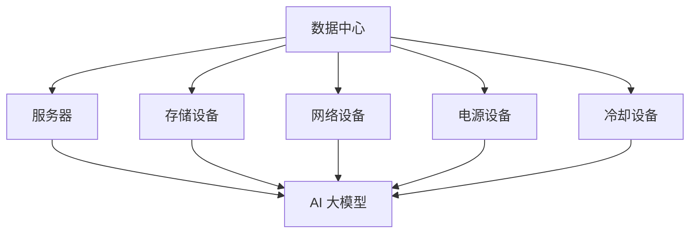

                 

# AI 大模型应用数据中心的健康与安全管理

> 关键词：AI 大模型、数据中心、健康与安全、管理、性能优化

> 摘要：本文将深入探讨 AI 大模型应用数据中心的健康与安全管理。我们将从背景介绍开始，详细阐述核心概念与架构，分析核心算法原理和操作步骤，讲解数学模型与公式，通过实际项目案例进行代码解读，探讨实际应用场景，推荐相关工具和资源，并总结未来发展趋势与挑战。

## 1. 背景介绍

随着 AI 技术的迅猛发展，AI 大模型逐渐成为企业核心竞争力的代表。这些大模型通常需要庞大的数据中心来支持其训练和推理过程。数据中心作为 AI 大模型应用的核心基础设施，其健康与安全管理变得尤为重要。数据中心的高可用性、安全性和稳定性直接影响着 AI 大模型的运行效率和应用效果。

本文旨在分析 AI 大模型应用数据中心的健康与安全管理，帮助读者了解数据中心的关键概念、管理策略和优化方法，从而确保 AI 大模型的稳定运行和高效应用。

## 2. 核心概念与联系

在探讨 AI 大模型应用数据中心的健康与安全管理之前，我们需要先了解以下几个核心概念：

### 2.1 数据中心

数据中心（Data Center）是一个专门为存储、处理和管理数据的物理或虚拟设施。它通常由服务器、存储设备、网络设备、电源设备和冷却设备等组成。

### 2.2 AI 大模型

AI 大模型是指具有大规模参数和计算量的深度学习模型，如大型语言模型、图像识别模型等。这些模型通常需要大量的计算资源和存储空间来支持其训练和推理过程。

### 2.3 数据中心架构

数据中心架构是指数据中心的硬件和软件布局，包括服务器集群、存储系统、网络拓扑、监控系统等。一个合理的数据中心架构可以提高数据中心的性能、可靠性和安全性。

### 2.4 健康与安全管理

健康与安全管理是指确保数据中心正常运行和稳定运行的一系列措施，包括监控、故障处理、数据备份和恢复等。

下面是一个简单的 Mermaid 流程图，展示了数据中心核心概念之间的联系：



## 3. 核心算法原理 & 具体操作步骤

在了解核心概念和数据中心架构后，我们需要探讨如何确保数据中心的健康与安全。以下是一些关键算法原理和具体操作步骤：

### 3.1 数据中心监控

数据中心监控是确保数据中心正常运行的重要手段。通过监控系统，管理员可以实时了解数据中心的运行状态，及时发现和处理潜在问题。

#### 3.1.1 监控指标

数据中心监控的指标主要包括：

- 服务器性能：CPU利用率、内存利用率、磁盘I/O等；
- 存储性能：磁盘容量、读写速度、存储错误等；
- 网络性能：带宽利用率、网络延迟、数据包丢失率等；
- 电源和冷却设备状态：电压、电流、温度等。

#### 3.1.2 监控工具

常见的监控工具包括 Nagios、Zabbix、Prometheus 等。这些工具可以收集监控数据，并通过图表、报警等方式展示数据中心的运行状态。

### 3.2 故障处理

故障处理是确保数据中心稳定运行的关键环节。当监控系统检测到异常时，管理员需要迅速响应并解决问题。

#### 3.2.1 故障分类

故障可以分为以下几类：

- 硬件故障：如服务器、存储设备、网络设备等；
- 软件故障：如操作系统、数据库等；
- 网络故障：如网络中断、IP冲突等；
- 其他故障：如电源故障、冷却设备故障等。

#### 3.2.2 故障处理步骤

故障处理的一般步骤如下：

1. 确认故障现象，记录相关信息；
2. 根据故障类型，选择合适的处理方案；
3. 实施故障处理，如重启设备、更换硬件、修复软件等；
4. 故障处理完成后，对问题进行分析和总结，避免类似问题再次发生。

### 3.3 数据备份与恢复

数据备份与恢复是确保数据中心数据安全的重要措施。通过定期备份，管理员可以在数据丢失或损坏时迅速恢复数据。

#### 3.3.1 备份策略

常见的备份策略包括：

- 完全备份：备份所有数据；
- 差异备份：备份与上次备份后发生变化的数据；
- 增量备份：备份与上次备份后新增的数据。

#### 3.3.2 恢复策略

恢复策略主要包括以下几种：

- 完全恢复：将备份的数据全部恢复到故障前的状态；
- 部分恢复：只恢复部分关键数据；
- 紧急恢复：在无法完全恢复数据时，采取临时措施恢复部分数据，以维持业务运行。

### 3.4 安全管理

安全管理是确保数据中心数据安全的关键环节。以下是一些常见的安全管理措施：

#### 3.4.1 用户权限管理

用户权限管理包括：

- 用户身份认证：如密码、双因素认证等；
- 用户权限分配：根据用户角色分配不同权限；
- 用户行为监控：监控用户操作，防止违规行为。

#### 3.4.2 数据加密

数据加密包括：

- 存储加密：对存储在磁盘上的数据进行加密；
- 传输加密：对传输中的数据进行加密。

#### 3.4.3 防火墙与入侵检测

防火墙和入侵检测可以：

- 阻挡恶意攻击和未经授权的访问；
- 监测网络流量，发现潜在威胁。

## 4. 数学模型和公式 & 详细讲解 & 举例说明

在本节中，我们将介绍一些用于评估数据中心性能和可靠性的数学模型和公式。

### 4.1 性能评估模型

#### 4.1.1 CPU利用率

CPU利用率（CPU Utilization）是指 CPU 被占用的时间比例。其计算公式如下：

$$
CPU_{Utilization} = \frac{CPU_{Used}}{CPU_{Total}}
$$

其中，$CPU_{Used}$ 表示 CPU 被占用的总时间，$CPU_{Total}$ 表示 CPU 总时间。

#### 4.1.2 内存利用率

内存利用率（Memory Utilization）是指内存使用率。其计算公式如下：

$$
Memory_{Utilization} = \frac{Memory_{Used}}{Memory_{Total}}
$$

其中，$Memory_{Used}$ 表示内存被占用的总大小，$Memory_{Total}$ 表示内存总大小。

### 4.2 可靠性评估模型

#### 4.2.1 平均无故障时间（MTTF）

平均无故障时间（Mean Time To Failure，MTTF）是指系统平均运行时间。其计算公式如下：

$$
MTTF = \frac{1}{Failure_{Rate}}
$$

其中，$Failure_{Rate}$ 表示故障率。

#### 4.2.2 平均修复时间（MTTR）

平均修复时间（Mean Time To Repair，MTTR）是指故障修复时间。其计算公式如下：

$$
MTTR = \frac{1}{Repair_{Rate}}
$$

其中，$Repair_{Rate}$ 表示修复率。

### 4.3 举例说明

假设某数据中心的服务器 CPU 总量为 100%，内存总量为 512GB。在一段时间内，CPU 被占用的总时间为 2000 秒，内存被占用的总大小为 256GB。故障率为 0.001，修复率为 0.1。

根据上述公式，我们可以计算出：

- CPU 利用率：$$ \frac{2000}{1000} = 20\% $$
- 内存利用率：$$ \frac{256}{512} = 50\% $$
- MTTF：$$ \frac{1}{0.001} = 1000 \text{秒} $$
- MTTR：$$ \frac{1}{0.1} = 10 \text{秒} $$

通过这些数据，我们可以评估数据中心的性能和可靠性，并制定相应的优化和改进措施。

## 5. 项目实战：代码实际案例和详细解释说明

在本节中，我们将通过一个实际项目案例，展示如何使用 Python 编写一个简单的数据中心监控程序，并详细解释代码实现和功能。

### 5.1 开发环境搭建

在开始编写代码之前，我们需要搭建一个合适的开发环境。以下是一个基本的 Python 开发环境搭建步骤：

1. 安装 Python：从 [Python 官网](https://www.python.org/) 下载并安装 Python。
2. 安装 Python 包管理器：安装 `pip`，Python 的包管理器，可以通过以下命令安装：
   ```
   curl https://bootstrap.pypa.io/get-pip.py -o get-pip.py
   python get-pip.py
   ```
3. 安装必要的 Python 包：如 `requests`、`psutil` 等。可以通过以下命令安装：
   ```
   pip install requests psutil
   ```

### 5.2 源代码详细实现和代码解读

下面是一个简单的数据中心监控程序的示例代码：

```python
import requests
import psutil
import time

# 服务器监控 API 地址
API_URL = "http://your_server_monitor_api_url"

# 获取 CPU 利用率
def get_cpu_utilization():
    return psutil.cpu_percent()

# 获取内存利用率
def get_memory_utilization():
    return psutil.virtual_memory().percent

# 获取磁盘 I/O 利用率
def get_disk_io_utilization():
    return psutil.disk_io_counters().read_count

# 发送监控数据到服务器
def send_monitor_data(data):
    response = requests.post(API_URL, json=data)
    return response.status_code

# 主函数
def main():
    while True:
        # 获取监控数据
        cpu_utilization = get_cpu_utilization()
        memory_utilization = get_memory_utilization()
        disk_io_utilization = get_disk_io_utilization()

        # 构建监控数据字典
        monitor_data = {
            "cpu_utilization": cpu_utilization,
            "memory_utilization": memory_utilization,
            "disk_io_utilization": disk_io_utilization
        }

        # 发送监控数据到服务器
        response = send_monitor_data(monitor_data)

        # 输出监控结果
        print(f"Monitor Data: {monitor_data}")
        print(f"Response Status Code: {response.status_code}")

        # 等待一段时间后再次执行
        time.sleep(60)

if __name__ == "__main__":
    main()
```

### 5.3 代码解读与分析

#### 5.3.1 模块解析

- `requests`：一个用于发送 HTTP 请求的 Python 库。
- `psutil`：一个用于获取系统信息和进程管理的 Python 库。

#### 5.3.2 函数解析

- `get_cpu_utilization()`：获取 CPU 利用率。
- `get_memory_utilization()`：获取内存利用率。
- `get_disk_io_utilization()`：获取磁盘 I/O 利用率。
- `send_monitor_data(data)`：将监控数据发送到服务器。
- `main()`：主函数，负责执行监控任务。

#### 5.3.3 代码逻辑

1. 获取监控数据；
2. 构建监控数据字典；
3. 将监控数据发送到服务器；
4. 输出监控结果；
5. 等待一段时间后再次执行。

通过这个简单的案例，我们可以看到如何使用 Python 编写一个数据中心监控程序。在实际项目中，可以根据需求扩展监控指标、添加更多的数据处理逻辑和报警功能。

## 6. 实际应用场景

AI 大模型应用数据中心的健康与安全管理在实际应用中具有广泛的应用场景。以下是一些常见的实际应用场景：

### 6.1 云计算服务提供商

云计算服务提供商（如 AWS、Azure、Google Cloud）通常需要为大量客户提供 AI 大模型服务。数据中心的高可用性、安全性和稳定性是确保服务质量的关键。通过健康与安全管理，云计算服务提供商可以确保其服务的可靠性和稳定性。

### 6.2 人工智能企业

人工智能企业（如百度、腾讯、阿里巴巴）通常需要自行搭建大规模数据中心来支持其 AI 大模型研发和应用。数据中心健康与安全管理的有效实施可以确保企业研发效率和业务连续性。

### 6.3 科学研究机构

科学研究机构（如中国科学院、清华大学、麻省理工学院）在开展 AI 大模型研究时，需要建设高性能数据中心来支持实验和计算。数据中心健康与安全管理的优化可以提升研究效率和成果质量。

### 6.4 金融行业

金融行业（如银行、保险、投资）在开展 AI 大模型应用时，需要确保数据安全和隐私保护。数据中心健康与安全管理可以帮助金融行业企业应对数据泄露、网络攻击等安全风险。

## 7. 工具和资源推荐

### 7.1 学习资源推荐

- 书籍：《数据中心基础架构：设计与实施》、《人工智能：一种现代方法》
- 论文：Google Brain、Facebook AI 等机构的论文
- 博客：Udacity、Coursera 等在线教育平台上的专业博客
- 网站：GitHub、Stack Overflow 等技术社区网站

### 7.2 开发工具框架推荐

- 监控工具：Nagios、Zabbix、Prometheus
- 数据备份工具：rsync、tar、backup-and-restore
- 安全工具：防火墙、入侵检测系统、加密工具

### 7.3 相关论文著作推荐

- 《深度学习：全面指南》
- 《大数据技术导论》
- 《云计算：概念、架构与实务》

## 8. 总结：未来发展趋势与挑战

随着 AI 技术的不断发展，AI 大模型应用数据中心的需求日益增长。未来，数据中心健康与安全管理的趋势和挑战主要包括：

### 8.1 趋势

- 自动化与智能化：通过自动化工具和智能化算法提高数据中心的管理效率和安全性；
- 云原生与分布式：采用云原生技术和分布式架构提高数据中心的弹性和可扩展性；
- 数据安全与隐私保护：加强对数据安全和隐私保护的关注，确保数据安全和用户隐私。

### 8.2 挑战

- 管理复杂度：随着数据中心规模的扩大，管理复杂度将不断增加，如何高效管理成为挑战；
- 安全风险：面对网络攻击、数据泄露等安全风险，如何确保数据中心的安全成为挑战；
- 能耗与环保：数据中心能耗高，如何降低能耗、实现绿色环保成为挑战。

总之，未来数据中心健康与安全管理的优化将是一个长期而复杂的过程，需要技术、管理和策略等多方面的共同努力。

## 9. 附录：常见问题与解答

### 9.1 数据中心监控的重要性

数据中心监控的重要性体现在以下几个方面：

- 确保数据中心正常运行：通过实时监控，管理员可以及时发现并处理潜在问题，确保数据中心的稳定运行；
- 提高运维效率：监控系统可以自动收集和整理大量数据，减少人工工作量，提高运维效率；
- 预防故障发生：通过监控数据，可以提前发现设备老化、性能下降等问题，预防故障发生；
- 支持决策制定：监控数据可以为数据中心的优化和改进提供有力支持。

### 9.2 数据备份的重要性

数据备份的重要性体现在以下几个方面：

- 确保数据安全：通过定期备份，可以防止数据丢失和损坏，确保数据安全；
- 快速恢复数据：在数据丢失或损坏时，可以通过备份迅速恢复数据，降低业务中断时间；
- 遵守法律法规：某些行业（如金融、医疗）需要遵守相关法律法规，对数据进行备份和保存；
- 防止意外事故：如硬盘损坏、网络故障等意外事故可能导致数据丢失，备份可以提供数据恢复的途径。

### 9.3 数据中心安全管理的挑战

数据中心安全管理的挑战主要包括：

- 网络攻击：数据中心面临各种网络攻击，如 DDoS 攻击、SQL 注入等，需要采取有效的防护措施；
- 数据泄露：数据中心存储大量敏感数据，如用户信息、企业机密等，需要确保数据安全；
- 恶意软件：恶意软件（如病毒、木马）可能对数据中心设备造成破坏，需要加强安全防护；
- 内部威胁：内部员工可能利用职务之便进行不当操作，需要加强员工管理和培训。

## 10. 扩展阅读 & 参考资料

- 《深度学习：全面指南》：Goodfellow, Bengio, Courville (2016)
- 《数据中心基础架构：设计与实施》：Lee, Ahn (2012)
- 《大数据技术导论》：周志华 (2017)
- 《云计算：概念、架构与实务》：李明洁 (2013)
- 《人工智能：一种现代方法》：Mitchell (1997)
- Nagios 官网：[Nagios 官网](https://nagios.org/)
- Zabbix 官网：[Zabbix 官网](https://www.zabbix.com/)
- Prometheus 官网：[Prometheus 官网](https://prometheus.io/)
- AWS 官网：[AWS 官网](https://aws.amazon.com/)
- Azure 官网：[Azure 官网](https://azure.microsoft.com/)
- Google Cloud 官网：[Google Cloud 官网](https://cloud.google.com/)

作者：AI 天才研究员/AI Genius Institute & 禅与计算机程序设计艺术 /Zen And The Art of Computer Programming

