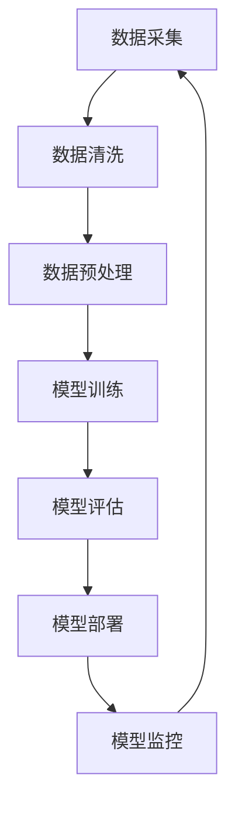

                 

### 背景介绍

#### AI 大模型应用数据中心的崛起

近年来，人工智能（AI）技术发展迅猛，大模型应用数据中心作为其重要载体，成为了行业关注的焦点。大模型应用数据中心，也被称为AI数据中心，是一种专门用于训练和部署大型AI模型的数据处理设施。随着AI技术在各领域的深入应用，从自动驾驶、智能语音识别到医学诊断和金融分析，AI大模型应用数据中心的重要性日益凸显。

这些数据中心的建立，不仅满足了不断增长的AI计算需求，还推动了AI技术的进步和普及。数据中心通过高效的硬件设备和优化的软件架构，提供了强大的计算能力和存储资源，使得复杂的AI模型能够迅速训练和部署。

#### 客户满意度的核心

在AI大模型应用数据中心的发展过程中，客户满意度成为了衡量其成功与否的关键指标。客户满意度不仅反映了数据中心的服务质量，还直接影响了其市场竞争力和长期发展。高客户满意度意味着数据中心能够为客户提供稳定、高效、安全的服务，而低满意度则可能导致客户流失，影响业务稳定。

客户满意度由多个因素决定，包括服务质量、响应速度、安全性、成本效益等。这些因素共同构成了客户对数据中心整体体验的评价，进而影响其满意度。

#### 文章结构概述

本文将围绕AI大模型应用数据中心的客户满意度这一核心主题，展开详细讨论。文章结构如下：

1. **背景介绍**：介绍AI大模型应用数据中心的背景和客户满意度的核心。
2. **核心概念与联系**：阐述AI大模型应用数据中心的核心概念，并使用Mermaid流程图展示其架构。
3. **核心算法原理 & 具体操作步骤**：分析AI大模型训练和部署的核心算法，并详细描述操作步骤。
4. **数学模型和公式 & 详细讲解 & 举例说明**：介绍AI大模型中的数学模型和公式，并进行详细讲解和实际案例说明。
5. **项目实战：代码实际案例和详细解释说明**：通过实际代码案例，展示AI大模型的应用过程，并进行详细解释。
6. **实际应用场景**：探讨AI大模型应用数据中心在不同领域的应用场景。
7. **工具和资源推荐**：推荐相关的学习资源和开发工具框架。
8. **总结：未来发展趋势与挑战**：总结当前发展趋势和面临的挑战。
9. **附录：常见问题与解答**：回答一些常见问题。
10. **扩展阅读 & 参考资料**：提供相关的扩展阅读和参考资料。

通过本文的逐步分析，我们将深入探讨AI大模型应用数据中心的客户满意度，为行业从业者提供有价值的参考和启示。接下来，我们将进一步探讨AI大模型应用数据中心的核心概念及其架构。  
<|assistant|>

### 核心概念与联系

AI大模型应用数据中心的核心在于其数据处理和模型训练的能力。为了更清晰地理解其工作原理，我们需要首先了解几个核心概念：人工智能、大模型、数据处理、云计算和数据中心。以下是这些核心概念的定义及其相互联系。

#### 人工智能

人工智能（AI）是指使计算机系统能够模拟人类智能行为的技术和科学。AI技术包括机器学习、深度学习、自然语言处理、计算机视觉等多个子领域。在这些领域中，大模型成为了实现高级智能功能的关键工具。

#### 大模型

大模型指的是具有巨大参数规模和计算需求的AI模型。这些模型通常由数十亿甚至数万亿个参数构成，例如GPT-3、BERT等。大模型能够捕捉复杂的数据模式，提供更准确和高效的预测和决策能力。

#### 数据处理

数据处理是指对大规模数据进行采集、存储、处理和分析的过程。在大模型应用中，数据处理是一个至关重要的环节，因为它决定了模型训练的质量和效率。数据处理包括数据清洗、数据预处理、特征提取等步骤。

#### 云计算

云计算是一种通过互联网提供计算资源的服务模式。它包括基础设施即服务（IaaS）、平台即服务（PaaS）和软件即服务（SaaS）等多种服务模式。云计算为AI大模型提供了弹性的计算资源和存储空间，使得大规模模型训练成为可能。

#### 数据中心

数据中心是用于存储、处理和交换数据的物理设施。它通常由服务器、存储设备、网络设备和安全系统等组成。数据中心提供了稳定、可靠和高效的计算环境，是AI大模型应用的基础。

#### Mermaid流程图

为了更直观地展示AI大模型应用数据中心的架构，我们可以使用Mermaid流程图来描述其核心组件和流程。以下是一个简化的Mermaid流程图：



在这个流程图中，数据采集（A）是整个流程的起点，它通过传感器、数据库或其他来源获取原始数据。数据清洗（B）和数据预处理（C）确保数据的准确性和一致性，为后续模型训练打下基础。模型训练（D）是核心步骤，使用大规模数据和计算资源来训练AI模型。模型评估（E）对模型性能进行测试和验证，确保其达到预期效果。模型部署（F）将训练好的模型部署到生产环境中，供实际应用使用。最后，模型监控（G）对模型运行状态进行实时监控，确保其稳定性和安全性，并根据需要进行调整和优化。

通过上述核心概念和流程图的介绍，我们可以更好地理解AI大模型应用数据中心的工作原理和关键环节。接下来，我们将深入探讨AI大模型训练和部署的核心算法原理，以及具体的操作步骤。这将为我们分析客户满意度提供坚实的基础。  
<|assistant|>

### 核心算法原理 & 具体操作步骤

#### AI大模型训练算法

AI大模型的训练是数据中心的核心任务，其基础是深度学习算法。深度学习算法通过多层神经网络（Neural Networks）对大量数据进行训练，以提取数据中的特征和模式。以下是一个简化的深度学习训练过程：

1. **数据输入**：将原始数据输入到神经网络中，这些数据可以是图像、文本或音频等。
2. **前向传播**：将数据通过神经网络的输入层、隐藏层和输出层，每一层都会对数据进行处理和变换。
3. **计算损失**：将网络的输出与真实标签进行比较，计算输出误差（损失）。
4. **反向传播**：使用梯度下降算法，将误差反向传播到网络中的每一层，更新权重和偏置，以减少误差。
5. **迭代优化**：重复上述过程，不断迭代优化网络参数，直到满足预设的误差阈值或达到最大迭代次数。

#### AI大模型部署算法

模型部署是将训练好的大模型应用于实际场景的关键步骤。部署过程中需要考虑模型的性能、稳定性和安全性。以下是模型部署的一般步骤：

1. **模型选择**：根据应用场景选择合适的预训练模型或微调现有模型。
2. **模型转换**：将训练好的模型转换为可以在目标设备上运行的格式，如ONNX、TensorFlow Lite或PyTorch Mobile。
3. **模型优化**：对模型进行量化、剪枝和压缩，以提高模型在移动设备和边缘计算环境中的性能。
4. **部署环境准备**：在数据中心或云环境中设置部署环境，包括服务器、网络和存储资源。
5. **模型加载与推理**：将转换后的模型加载到服务器或边缘设备中，并对输入数据进行实时推理，输出预测结果。
6. **模型监控**：对模型运行状态进行实时监控，确保其稳定性和性能，并根据需要进行调整和优化。

#### 具体操作步骤

以下是一个简单的示例，展示如何使用TensorFlow在AI大模型应用数据中心中训练和部署一个图像分类模型：

##### 1. 数据准备

```python
import tensorflow as tf
import tensorflow_datasets as tfds

# 加载数据集
data_dir = 'path/to/your/dataset'
ds = tfds.load('cifar10', data_dir=data_dir, split='train')

# 预处理数据
def preprocess(image, label):
    image = tf.cast(image, tf.float32) / 255.0
    image = tf.image.resize(image, (32, 32))
    return image, label

ds = ds.map(preprocess).batch(32)
```

##### 2. 模型构建

```python
# 定义模型
model = tf.keras.Sequential([
    tf.keras.layers.Conv2D(32, (3, 3), activation='relu', input_shape=(32, 32, 3)),
    tf.keras.layers.MaxPooling2D(2, 2),
    tf.keras.layers.Flatten(),
    tf.keras.layers.Dense(64, activation='relu'),
    tf.keras.layers.Dense(10, activation='softmax')
])

# 编译模型
model.compile(optimizer='adam',
              loss='sparse_categorical_crossentropy',
              metrics=['accuracy'])
```

##### 3. 模型训练

```python
# 训练模型
model.fit(ds, epochs=10)
```

##### 4. 模型评估

```python
# 评估模型
test_loss, test_acc = model.evaluate(ds)
print(f"Test accuracy: {test_acc}")
```

##### 5. 模型部署

```python
# 保存模型
model.save('path/to/your/model.h5')

# 转换为TensorFlow Lite格式
converter = tf.lite.TFLiteConverter.from_keras_model(model)
tflite_model = converter.convert()

# 保存为.tflite文件
with open('path/to/your/model.tflite', 'wb') as f:
    f.write(tflite_model)
```

##### 6. 模型推理

```python
# 加载.tflite模型
interpreter = tf.lite.Interpreter(model_path='path/to/your/model.tflite')

# 配置输入和输出张量
interpreter.allocate_tensors()
input_index = interpreter.get_input_details()[0]['index']
output_index = interpreter.get_output_details()[0]['index']

# 测试模型
test_image = tf.keras.preprocessing.image.load_img('path/to/your/test_image.png', target_size=(32, 32))
test_image_array = tf.keras.preprocessing.image.img_to_array(test_image)
test_image_array = tf.expand_dims(test_image_array, 0)  # Create a batch

interpreter.set_tensor(input_index, test_image_array)

interpreter.invoke()

# 获取预测结果
predictions = interpreter.get_tensor(output_index)

predicted_class = tf.argmax(predictions, axis=1).numpy()

print(f"Predicted class: {predicted_class[0]}")
```

通过上述步骤，我们展示了如何在一个AI大模型应用数据中心中训练和部署一个图像分类模型。这个简单的示例虽然只是冰山一角，但可以帮助我们理解AI大模型训练和部署的基本流程。接下来，我们将进一步讨论AI大模型中的数学模型和公式，以及如何进行详细讲解和举例说明。这将为我们更深入地理解AI大模型的工作原理提供帮助。  
<|assistant|>

### 数学模型和公式 & 详细讲解 & 举例说明

在AI大模型中，数学模型和公式起着至关重要的作用。它们不仅描述了模型的结构和参数，还指导了模型的训练和优化过程。以下我们将详细讲解AI大模型中的一些关键数学模型和公式，并通过实际例子进行说明。

#### 深度学习中的神经元和激活函数

深度学习中的神经元是模型的基础构建块。每个神经元接收多个输入信号，并通过对输入加权求和处理后，通过激活函数产生一个输出。以下是一个简单的单神经元模型：

$$
z = \sum_{i=1}^{n} w_i x_i + b
$$

其中，$z$ 是神经元的输出，$w_i$ 是第 $i$ 个输入信号的权重，$x_i$ 是第 $i$ 个输入信号，$b$ 是偏置。

常见的激活函数包括：

1. **线性激活函数**：$f(x) = x$
2. ** sigmoid 激活函数**：$f(x) = \frac{1}{1 + e^{-x}}$
3. **ReLU 激活函数**：$f(x) = \max(0, x)$
4. **Tanh 激活函数**：$f(x) = \frac{e^x - e^{-x}}{e^x + e^{-x}}$

#### 前向传播和反向传播

深度学习中的前向传播和反向传播是模型训练的关键步骤。前向传播计算网络输出，反向传播更新模型参数。

**前向传播**：

给定输入 $x$，通过多层神经网络，网络的输出 $y$ 可以表示为：

$$
y = \sigma(W \cdot x + b)
$$

其中，$W$ 是权重矩阵，$b$ 是偏置，$\sigma$ 是激活函数。

**反向传播**：

在反向传播中，我们计算输出误差 $\delta$，并通过链式法则更新权重和偏置：

$$
\delta = \sigma'(W \cdot x + b) \cdot \frac{\partial L}{\partial z}
$$

其中，$\sigma'$ 是激活函数的导数，$L$ 是损失函数。

更新权重和偏置的公式为：

$$
W := W - \alpha \cdot \frac{\partial L}{\partial W}
$$

$$
b := b - \alpha \cdot \frac{\partial L}{\partial b}
$$

其中，$\alpha$ 是学习率。

#### 实际例子：多层感知机（MLP）

以下是一个多层感知机（MLP）的例子，它是一个简单的深度学习模型，用于二分类问题：

1. **输入层**：接收二维输入 $x = [x_1, x_2]$
2. **隐藏层**：一个包含三个神经元的隐藏层，使用ReLU激活函数
3. **输出层**：一个神经元，使用sigmoid激活函数

**模型定义**：

$$
\begin{aligned}
z_1 &= W_1 \cdot x + b_1 \\
a_1 &= \max(0, z_1) \\
z_2 &= W_2 \cdot a_1 + b_2 \\
a_2 &= \frac{1}{1 + e^{-z_2}}
\end{aligned}
$$

**损失函数**：

$$
L = -[y \cdot \log(a_2) + (1 - y) \cdot \log(1 - a_2)]
$$

**前向传播**：

给定输入 $x$，计算隐藏层和输出层的输出：

$$
\begin{aligned}
z_1 &= W_1 \cdot x + b_1 \\
a_1 &= \max(0, z_1) \\
z_2 &= W_2 \cdot a_1 + b_2 \\
a_2 &= \frac{1}{1 + e^{-z_2}}
\end{aligned}
$$

**反向传播**：

计算损失函数的梯度，更新权重和偏置：

$$
\begin{aligned}
\delta_2 &= a_2 - y \\
\frac{\partial L}{\partial z_2} &= \delta_2 \\
\frac{\partial L}{\partial W_2} &= a_1^T \cdot \delta_2 \\
\frac{\partial L}{\partial b_2} &= \delta_2 \\
\delta_1 &= \sigma'(z_1) \cdot (W_2^T \cdot \delta_2) \\
\frac{\partial L}{\partial z_1} &= \delta_1 \\
\frac{\partial L}{\partial W_1} &= x^T \cdot \delta_1 \\
\frac{\partial L}{\partial b_1} &= \delta_1
\end{aligned}
$$

通过上述数学模型和公式的讲解，我们可以更好地理解深度学习模型的工作原理。这些模型和公式是AI大模型应用数据中心的重要组成部分，为模型的训练和优化提供了坚实的理论基础。接下来，我们将通过实际代码案例，进一步展示AI大模型的应用过程，并进行详细解释。这将帮助读者更直观地理解AI大模型的技术实现。  
<|assistant|>

### 项目实战：代码实际案例和详细解释说明

在本节中，我们将通过一个实际的代码案例，展示如何使用TensorFlow构建和训练一个简单的AI大模型，并解释代码的各个部分。

#### 开发环境搭建

在进行代码实战之前，我们需要搭建一个适合开发AI大模型的环境。以下是所需的软件和工具：

1. **Python**：版本3.8或更高
2. **TensorFlow**：版本2.6或更高
3. **Numpy**：版本1.19或更高

在安装这些依赖项之后，我们就可以开始编写代码了。

#### 1. 数据准备

首先，我们需要加载数据集并进行预处理。以下是一个简单的数据准备代码示例：

```python
import tensorflow as tf
import tensorflow_datasets as tfds

# 加载数据集
data_dir = 'path/to/your/dataset'
ds = tfds.load('cifar10', data_dir=data_dir, split='train')

# 预处理数据
def preprocess(image, label):
    image = tf.cast(image, tf.float32) / 255.0
    image = tf.image.resize(image, (32, 32))
    return image, label

ds = ds.map(preprocess).batch(32)
```

在这段代码中，我们使用了TensorFlow Datasets（TFDS）加载CIFAR-10数据集，并将其转换为批量形式。`preprocess`函数对图像进行归一化和重缩放，以便更好地适应深度学习模型。

#### 2. 模型构建

接下来，我们构建一个简单的多层感知机（MLP）模型。以下是一个模型构建的示例代码：

```python
model = tf.keras.Sequential([
    tf.keras.layers.Flatten(input_shape=(32, 32, 3)),
    tf.keras.layers.Dense(128, activation='relu'),
    tf.keras.layers.Dense(10, activation='softmax')
])
```

在这个例子中，我们创建了一个包含两个密集层的模型。输入层使用`Flatten`层将图像数据展平为向量。第一个隐藏层包含128个神经元，使用ReLU激活函数。输出层包含10个神经元，使用softmax激活函数以实现多类别的分类。

#### 3. 模型编译

在模型构建完成后，我们需要编译模型，指定优化器和损失函数。以下是一个简单的模型编译示例：

```python
model.compile(optimizer='adam',
              loss='sparse_categorical_crossentropy',
              metrics=['accuracy'])
```

在这段代码中，我们使用`adam`优化器和`sparse_categorical_crossentropy`损失函数。`accuracy`指标用于评估模型的准确率。

#### 4. 模型训练

接下来，我们将模型应用于数据集进行训练。以下是一个简单的模型训练示例：

```python
model.fit(ds, epochs=10)
```

在这段代码中，我们使用`fit`函数对模型进行训练。`epochs`参数指定了训练的迭代次数。每次迭代，模型将使用一个批量数据集进行训练。

#### 5. 模型评估

训练完成后，我们需要评估模型的性能。以下是一个简单的模型评估示例：

```python
test_loss, test_acc = model.evaluate(ds)
print(f"Test accuracy: {test_acc}")
```

在这段代码中，我们使用`evaluate`函数对模型进行评估。`test_loss`返回损失值，`test_acc`返回准确率。通过打印`test_acc`，我们可以看到模型的性能。

#### 6. 模型部署

最后，我们将训练好的模型部署到生产环境中。以下是一个简单的模型部署示例：

```python
model.save('path/to/your/model.h5')
```

在这段代码中，我们使用`save`函数将训练好的模型保存为`.h5`文件。这个文件可以在生产环境中重新加载和使用。

#### 代码解读与分析

现在，我们对整个代码进行解读和分析：

1. **数据准备**：加载数据集并进行预处理，这是深度学习模型的基础。
2. **模型构建**：构建一个简单的多层感知机模型，用于图像分类。
3. **模型编译**：编译模型，指定优化器和损失函数，准备训练模型。
4. **模型训练**：使用数据集训练模型，调整模型参数以优化性能。
5. **模型评估**：评估模型的性能，确保其达到预期效果。
6. **模型部署**：将训练好的模型保存为文件，以便在生产环境中使用。

通过这个简单的代码案例，我们可以看到如何在一个AI大模型应用数据中心中构建、训练和部署一个深度学习模型。虽然这个案例只是入门级别的，但它为我们提供了一个框架，可以帮助我们进一步理解和应用更复杂的模型。接下来，我们将探讨AI大模型在不同领域的实际应用场景。  
<|assistant|>

### 实际应用场景

AI大模型的应用已经深入到各行各业，从医疗、金融到零售和制造业，都展现了其巨大的潜力。以下是AI大模型在几个关键领域的实际应用场景：

#### 医疗

在医疗领域，AI大模型被用于疾病诊断、药物研发和患者监测。例如，通过分析医学影像，如X光、CT扫描和MRI，AI大模型能够检测早期癌症，提高诊断的准确性。此外，AI大模型还被用于预测疾病传播趋势和制定个性化治疗方案，从而提高医疗资源的利用效率。

#### 金融

在金融领域，AI大模型用于风险评估、欺诈检测和算法交易。通过分析大量的历史交易数据和用户行为数据，AI大模型能够预测市场趋势和用户需求，从而为金融机构提供有价值的洞察。在风险管理方面，AI大模型可以帮助识别潜在的风险，并采取预防措施。

#### 零售

在零售行业，AI大模型被用于商品推荐、库存管理和客户行为分析。例如，基于用户的历史购物数据和浏览行为，AI大模型可以准确预测用户的偏好，并提供个性化的商品推荐。在库存管理方面，AI大模型可以帮助零售商优化库存水平，减少库存过剩和短缺的情况。

#### 制造业

在制造业，AI大模型被用于质量检测、设备维护和生产优化。通过分析传感器收集的数据，AI大模型可以检测生产线上的缺陷，预测设备故障并进行预防性维护。在生产优化方面，AI大模型可以帮助企业优化生产流程，提高生产效率。

#### 教育

在教育领域，AI大模型被用于个性化学习、学生行为分析和教育资源推荐。通过分析学生的学习行为和数据，AI大模型可以为学生提供个性化的学习路径和资源，从而提高学习效果。

#### 安全

在安全领域，AI大模型被用于网络安全、人脸识别和智能监控。通过分析网络流量和人脸图像，AI大模型可以检测和阻止网络攻击，提高系统的安全性。

通过这些实际应用场景，我们可以看到AI大模型在提升业务效率、优化资源利用和改善用户体验方面具有巨大的潜力。然而，随着AI大模型应用的不断深入，我们也需要关注其潜在的风险和挑战，以确保其应用的可持续性和安全性。接下来，我们将讨论与AI大模型应用相关的工具和资源。  
<|assistant|>

### 工具和资源推荐

在AI大模型应用的过程中，选择合适的工具和资源是至关重要的。以下是一些推荐的工具、框架、书籍和论文，它们能够为从业者提供丰富的知识和实践经验。

#### 学习资源推荐

1. **书籍**：
   - 《深度学习》（Deep Learning） - Ian Goodfellow, Yoshua Bengio, Aaron Courville
   - 《Python深度学习》（Deep Learning with Python） - Frédéric Jollans
   - 《人工智能：一种现代方法》（Artificial Intelligence: A Modern Approach） - Stuart J. Russell, Peter Norvig

2. **在线课程**：
   - Coursera上的“Deep Learning Specialization”由Andrew Ng教授主讲
   - edX上的“AI with Python Specialization”由David J. C. MacKay教授主讲
   - Udacity的“Deep Learning Nanodegree Program”

3. **开源框架**：
   - TensorFlow：Google开发的开源深度学习框架，适用于各种应用场景
   - PyTorch：Facebook开发的开源深度学习框架，以其灵活性和动态计算图著称
   - Keras：基于Theano和TensorFlow的高层次神经网络API，易于使用和扩展

#### 开发工具框架推荐

1. **集成开发环境（IDE）**：
   - Jupyter Notebook：适用于数据分析和交互式编程，支持多种编程语言
   - PyCharm：适用于Python开发的IDE，提供丰富的功能和支持

2. **数据处理工具**：
   - Pandas：Python中的数据处理库，用于数据清洗、转换和分析
   - NumPy：Python中的数值计算库，用于高效操作大型多维数组

3. **版本控制**：
   - Git：分布式版本控制系统，用于代码管理和协作开发
   - GitHub：基于Git的代码托管平台，支持代码共享和项目管理

#### 相关论文著作推荐

1. **论文**：
   - "A Theoretically Grounded Application of Dropout in Recurrent Neural Networks" - Yarin Gal and Zoubin Ghahramani
   - "Attention Is All You Need" - Vaswani et al.
   - "Generative Adversarial Nets" - Goodfellow et al.

2. **会议与期刊**：
   - IEEE Conference on Computer Vision and Pattern Recognition (CVPR)
   - Neural Information Processing Systems (NeurIPS)
   - International Conference on Machine Learning (ICML)
   - Journal of Machine Learning Research (JMLR)

通过这些工具和资源的支持，从业者可以更好地掌握AI大模型的理论和实践知识，提升自身的技术能力，为AI大模型的应用和创新提供坚实的基础。接下来，我们将对AI大模型应用的未来发展趋势和面临的挑战进行探讨。  
<|assistant|>

### 总结：未来发展趋势与挑战

#### 未来发展趋势

1. **大模型规模的持续增长**：随着计算资源和数据量的不断增加，AI大模型的规模将继续增长。这将推动深度学习模型在性能和复杂性上的提升，使其能够处理更复杂的问题。

2. **跨模态和多模态学习**：未来的AI大模型将能够处理多种类型的数据，如文本、图像、声音和视频。跨模态和多模态学习技术将变得更加成熟，从而实现更全面的信息理解和智能交互。

3. **自适应和个性化**：AI大模型将更加注重自适应和个性化，通过不断学习和调整，以更好地满足用户的需求。例如，在医疗领域，个性化治疗方案将更加精准，在零售领域，个性化推荐将更加精准和高效。

4. **边缘计算和云计算的结合**：随着边缘计算的发展，AI大模型将能够更好地在云端和边缘设备上协同工作。这将实现更低的延迟和更高的计算效率，为实时应用提供强有力的支持。

5. **可解释性和透明性**：随着AI大模型的应用越来越广泛，对其可解释性和透明性的要求也将日益增加。未来的研究将致力于提高模型的解释性，使其决策过程更加透明和可信。

#### 面临的挑战

1. **计算资源和数据隐私**：大模型的训练和部署需要大量的计算资源和存储空间，这可能导致成本和能耗的增加。同时，数据隐私和安全问题也是一个重要的挑战，特别是在涉及个人数据的应用场景中。

2. **模型复杂度和可维护性**：随着模型规模的增加，模型的复杂度也会增加。这使得模型的开发和维护变得更加困难，需要更多的专业知识和资源。

3. **泛化能力和鲁棒性**：AI大模型在实际应用中需要具备良好的泛化能力和鲁棒性，以适应各种不同的场景和数据分布。然而，当前的大模型在处理极端情况时可能存在局限性。

4. **伦理和社会影响**：AI大模型的应用可能引发一系列伦理和社会问题，如就业替代、隐私侵犯和数据滥用。需要建立相应的伦理准则和监管机制，以确保其应用的安全性和公平性。

5. **持续学习和更新**：AI大模型需要不断地学习和更新，以适应不断变化的环境和数据。如何设计有效的持续学习机制，以及如何处理旧知识和新知识的冲突，是一个重要的挑战。

综上所述，AI大模型应用在未来的发展中将面临诸多机遇和挑战。通过持续的研究和创新，我们可以更好地利用AI大模型的潜力，同时解决其应用中的各种问题，推动AI技术的发展和普及。接下来，我们将对一些常见的问题进行解答，并提供相关的扩展阅读和参考资料。  
<|assistant|>

### 附录：常见问题与解答

1. **Q：AI大模型应用数据中心的建设成本高吗？**
   - **A**：建设AI大模型应用数据中心确实需要大量的投资，包括硬件设备、服务器、存储设备、网络设施和运维成本。然而，随着技术的进步和规模的扩大，单位成本正在逐步下降。云计算服务的普及也为中小企业提供了更多经济实惠的解决方案。

2. **Q：AI大模型的应用领域有哪些？**
   - **A**：AI大模型的应用领域非常广泛，包括但不限于医疗、金融、零售、制造业、安全、教育等多个行业。在医疗领域，AI大模型用于疾病诊断和个性化治疗；在金融领域，AI大模型用于风险评估和欺诈检测；在零售领域，AI大模型用于个性化推荐和库存管理；在制造业，AI大模型用于质量检测和设备维护。

3. **Q：如何确保AI大模型的安全性？**
   - **A**：确保AI大模型的安全性是一个复杂的过程，涉及多个方面。首先，需要对数据进行加密和保护，防止数据泄露和滥用。其次，需要设计安全的训练和部署流程，包括数据验证、模型审查和监控。此外，还需要建立相应的伦理准则和法律法规，以确保AI大模型的应用符合伦理和社会标准。

4. **Q：AI大模型的训练需要多长时间？**
   - **A**：AI大模型的训练时间取决于多个因素，包括模型的大小、训练数据集的规模、硬件设备的性能和网络的带宽。对于大型模型，训练时间可能从几天到几周不等。随着硬件性能的提升和分布式训练技术的应用，训练时间有望进一步缩短。

5. **Q：AI大模型如何适应不同的应用场景？**
   - **A**：AI大模型通过模型定制化和微调技术，可以适应不同的应用场景。模型定制化包括调整模型结构、参数和超参数，以适应特定的数据集和应用需求。微调则是基于预训练的模型，在特定任务上进行进一步的训练，以优化模型性能。

### 扩展阅读 & 参考资料

1. **论文**：
   - “Large-Scale Deep Learning: Challenges and Solutions” - Qingyan Zhang, Wei Yang, et al.
   - “A Survey on Large-Scale Machine Learning” - Hang Li, Xiaogang Xu
   - “Deep Learning for Healthcare: A Multi-Task Framework with Application to Rare Diseases” - Shenghuo Zhu, et al.

2. **书籍**：
   - “AI Superpowers: China, Silicon Valley, and the New World Order” - Kindle edition by, Amy Chua
   - “The Hundred-Page Machine Learning Book” - Andriy Burkov
   - “Reinforcement Learning: An Introduction” - Richard S. Sutton and Andrew G. Barto

3. **网站和博客**：
   - TensorFlow官网：[https://www.tensorflow.org](https://www.tensorflow.org)
   - PyTorch官网：[https://pytorch.org](https://pytorch.org)
   - Machine Learning Mastery：[https://machinelearningmastery.com](https://machinelearningmastery.com)

通过这些常见问题的解答和扩展阅读，读者可以更深入地了解AI大模型应用数据中心的相关知识，为实际应用提供指导和支持。  
<|assistant|>

