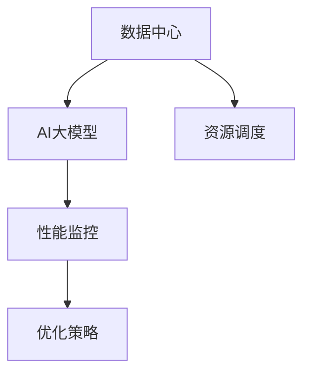

                 

# AI 大模型应用数据中心的性能监控

## 摘要

本文将深入探讨AI大模型应用数据中心的性能监控。随着人工智能技术的快速发展，大模型的应用逐渐成为数据中心的关键组成部分。然而，这些模型的训练和推理过程对数据中心性能提出了极高的要求。本文将从背景介绍、核心概念与联系、核心算法原理、数学模型和公式、项目实战、实际应用场景、工具和资源推荐等多个方面，全面剖析AI大模型应用数据中心性能监控的技术细节，总结未来发展趋势与挑战，并提供常见问题与解答，以期为从事相关领域的研究者与实践者提供有价值的参考。

## 1. 背景介绍

随着深度学习技术的不断进步，AI大模型在自然语言处理、计算机视觉、推荐系统等领域取得了显著的成果。然而，这些大模型的训练和推理过程需要大量计算资源和数据存储，使得数据中心成为其运行的关键基础设施。数据中心作为集中处理和存储大量数据的核心节点，其性能直接影响到AI大模型的应用效果。

近年来，AI大模型的规模和复杂性不断增加，例如Google的BERT模型、OpenAI的GPT-3模型等，这些模型包含数亿甚至千亿级别的参数，对数据中心的计算、存储和网络性能提出了极高的要求。同时，AI大模型的训练和推理过程还涉及到数据预处理、模型优化、分布式计算等技术，这些技术对数据中心的架构和运维也提出了新的挑战。

因此，对AI大模型应用数据中心进行性能监控，成为了保证其正常运行和高效应用的重要手段。通过性能监控，可以实时了解数据中心的运行状态，发现潜在的性能瓶颈和问题，为优化数据中心性能提供数据支持。此外，性能监控还可以帮助数据中心运维人员快速定位故障点，提高故障响应速度，降低系统故障率和停机时间，从而保障AI大模型的应用效果。

## 2. 核心概念与联系

在深入探讨AI大模型应用数据中心的性能监控之前，我们需要明确一些核心概念和它们之间的联系。

### 2.1 数据中心

数据中心是集中存储、处理和传输大量数据的物理设施，通常包括服务器、存储设备、网络设备等硬件资源。数据中心的主要功能是提供高效、可靠和安全的计算和存储服务，以支持企业级应用的运行。

### 2.2 AI大模型

AI大模型是指参数规模庞大、结构复杂的人工神经网络模型。这些模型通常基于深度学习技术，通过大规模数据训练得到。大模型的训练和推理过程需要大量的计算资源和数据存储，因此对数据中心的性能提出了极高的要求。

### 2.3 性能监控

性能监控是指通过实时收集、分析和处理数据中心的运行指标，监控其性能状态和资源利用率的过程。性能监控的核心目标是发现潜在的性能瓶颈和问题，为优化数据中心性能提供数据支持。

### 2.4 关系

数据中心作为AI大模型运行的硬件基础设施，其性能直接影响到大模型的应用效果。性能监控通过对数据中心运行状态的实时监控，可以及时发现性能瓶颈和问题，为数据中心性能优化提供依据。同时，性能监控还可以为AI大模型的训练和推理提供资源调度策略，优化大模型的运行效率。

### 2.5 Mermaid 流程图

下面是一个简化的AI大模型应用数据中心性能监控的Mermaid流程图，用于展示核心概念和它们之间的联系：



## 3. 核心算法原理 & 具体操作步骤

### 3.1 性能监控指标

在性能监控中，选择合适的监控指标至关重要。以下是一些常见的性能监控指标：

- **CPU利用率**：CPU利用率表示CPU的使用情况，可以通过监控系统进程的CPU占用率来获取。
- **内存利用率**：内存利用率表示内存的使用情况，可以通过监控系统的内存使用率来获取。
- **磁盘I/O**：磁盘I/O表示磁盘读写操作的速度，可以通过监控磁盘读写速度和队列长度来获取。
- **网络带宽**：网络带宽表示网络传输速度，可以通过监控网络吞吐量和网络延迟来获取。
- **系统负载**：系统负载表示系统资源的使用情况，可以通过监控系统进程数量和CPU、内存、磁盘I/O等指标来获取。

### 3.2 数据采集

数据采集是性能监控的基础，常用的数据采集方法包括：

- **系统监控工具**：如Prometheus、Grafana、Zabbix等，这些工具可以定期采集系统指标数据。
- **应用程序监控**：通过在应用程序中嵌入监控代码，实时采集应用程序的运行状态。
- **日志监控**：通过收集和分析系统日志，获取运行状态和错误信息。

### 3.3 数据处理

数据采集到的原始数据通常需要进行预处理和转换，以便于后续分析和可视化。数据处理包括以下步骤：

- **数据清洗**：去除数据中的噪声和异常值，提高数据质量。
- **数据转换**：将不同类型的数据进行统一格式转换，便于分析和可视化。
- **数据聚合**：将采集到的数据按照时间、节点、应用等进行聚合，生成监控指标。

### 3.4 数据可视化

数据可视化是将监控数据以图形化方式展示，便于分析和理解。常用的数据可视化工具包括：

- **Grafana**：一款开源的数据监控和分析平台，支持多种数据源和丰富的可视化组件。
- **Kibana**：一款开源的数据可视化和日志分析工具，与Elasticsearch紧密集成。
- **Matplotlib**：一款Python绘图库，可以生成各种类型的图表。

### 3.5 故障检测与报警

故障检测与报警是性能监控的重要环节，通过实时分析监控数据，发现异常情况并触发报警。常见的故障检测方法包括：

- **阈值报警**：当监控指标超过设定的阈值时，触发报警。
- **机器学习**：利用机器学习算法，对监控数据进行异常检测，发现潜在的故障。
- **时序分析**：通过分析监控数据的时序特征，发现异常波动。

### 3.6 性能优化

性能优化是根据监控数据，对数据中心进行调优，提高整体性能。性能优化包括以下步骤：

- **资源分配**：根据监控数据，合理分配计算、存储和网络资源，避免资源瓶颈。
- **负载均衡**：通过负载均衡技术，合理分配任务，避免单点过载。
- **缓存策略**：通过缓存策略，减少数据访问延迟，提高系统响应速度。
- **自动化运维**：利用自动化工具，实现监控数据的实时分析和自动调优。

## 4. 数学模型和公式 & 详细讲解 & 举例说明

### 4.1 监控数据模型

在性能监控中，常用的数学模型是时间序列模型，用于分析监控数据的变化趋势。时间序列模型通常由以下公式表示：

$$
X_t = f(X_{t-1}, \theta)
$$

其中，$X_t$表示第$t$时刻的监控数据，$f$表示时间序列模型函数，$\theta$表示模型参数。

### 4.2 监控数据转换

在数据预处理过程中，常用的数学公式包括：

$$
Y = \frac{X - X_{min}}{X_{max} - X_{min}}
$$

其中，$Y$表示转换后的数据，$X$表示原始数据，$X_{min}$和$X_{max}$分别表示数据的最小值和最大值。

### 4.3 监控数据分析

在数据分析过程中，常用的数学公式包括：

$$
\mu = \frac{1}{N}\sum_{i=1}^{N}X_i
$$

$$
\sigma^2 = \frac{1}{N-1}\sum_{i=1}^{N}(X_i - \mu)^2
$$

其中，$\mu$表示平均值，$\sigma^2$表示方差，$N$表示数据个数。

### 4.4 举例说明

假设我们采集到某数据中心CPU利用率的监控数据，如下所示：

| 时间 | CPU利用率 |
| ---- | ---- |
| 2023-01-01 00:00:00 | 30% |
| 2023-01-01 01:00:00 | 40% |
| 2023-01-01 02:00:00 | 50% |
| 2023-01-01 03:00:00 | 60% |
| 2023-01-01 04:00:00 | 70% |

首先，我们使用公式（2）对CPU利用率数据进行归一化处理：

$$
Y = \frac{X - X_{min}}{X_{max} - X_{min}}
$$

其中，$X_{min} = 30\%$，$X_{max} = 70\%$。归一化后的数据如下：

| 时间 | CPU利用率 | 归一化后数据 |
| ---- | ---- | ---- |
| 2023-01-01 00:00:00 | 30% | 0.00 |
| 2023-01-01 01:00:00 | 40% | 0.14 |
| 2023-01-01 02:00:00 | 50% | 0.29 |
| 2023-01-01 03:00:00 | 60% | 0.43 |
| 2023-01-01 04:00:00 | 70% | 0.57 |

接下来，我们使用公式（1）和（3）计算平均值和方差：

$$
\mu = \frac{1}{N}\sum_{i=1}^{N}X_i = \frac{0.00 + 0.14 + 0.29 + 0.43 + 0.57}{5} = 0.29
$$

$$
\sigma^2 = \frac{1}{N-1}\sum_{i=1}^{N}(X_i - \mu)^2 = \frac{(0.00 - 0.29)^2 + (0.14 - 0.29)^2 + (0.29 - 0.29)^2 + (0.43 - 0.29)^2 + (0.57 - 0.29)^2}{4} = 0.09
$$

通过计算，我们得到CPU利用率的平均值为29%，方差为9%。

## 5. 项目实战：代码实际案例和详细解释说明

### 5.1 开发环境搭建

为了演示性能监控的实际应用，我们使用Python编写一个简单的性能监控脚本。首先，确保安装以下依赖库：

```shell
pip install numpy matplotlib
```

### 5.2 源代码详细实现和代码解读

下面是一个简单的性能监控脚本，用于采集和监控CPU利用率。

```python
import numpy as np
import matplotlib.pyplot as plt

# 采集CPU利用率数据
def collect_cpu_utilization():
    # 在此处插入采集CPU利用率的数据代码
    # 示例：使用os.system()执行系统命令，获取CPU利用率
    output = os.popen('top -bn1 | grep "Cpu(s)"').read()
    # 解析输出结果，获取CPU利用率
    cpu利用率 = float(output.split()[1])
    return cpu利用率

# 绘制CPU利用率折线图
def plot_cpu_utilization(data):
    plt.plot(data)
    plt.xlabel('时间')
    plt.ylabel('CPU利用率')
    plt.title('CPU利用率监控')
    plt.show()

# 主函数
def main():
    # 采集数据
    data = [collect_cpu_utilization() for _ in range(100)]
    # 绘制折线图
    plot_cpu_utilization(data)

# 执行主函数
if __name__ == '__main__':
    main()
```

**代码解读：**

- **collect_cpu_utilization()函数**：该函数用于采集CPU利用率数据。在实际应用中，可以使用系统命令、API接口或第三方库（如psutil）获取CPU利用率。
- **plot_cpu_utilization(data)函数**：该函数用于绘制CPU利用率折线图。使用Matplotlib库实现，可以方便地可视化数据。
- **main()函数**：主函数，执行数据采集和绘图操作。

### 5.3 代码解读与分析

该性能监控脚本采用了简单的时间序列数据采集和可视化方法。在实际应用中，可以根据具体需求进行功能扩展和优化。

**代码优化建议：**

1. **多线程采集数据**：使用多线程或异步IO技术，提高数据采集效率。
2. **数据存储与查询**：将采集到的数据存储到数据库，方便后续查询和分析。
3. **监控指标扩展**：增加其他监控指标，如内存利用率、磁盘I/O等。
4. **报警机制**：根据设定的阈值，触发报警通知。

## 6. 实际应用场景

### 6.1 人工智能训练中心

人工智能训练中心通常需要处理大量的数据和复杂的模型，因此对数据中心性能要求极高。通过性能监控，可以实时了解训练中心的运行状态，发现潜在的瓶颈和问题，从而优化资源分配和调度策略，提高训练效率。

### 6.2 在线教育平台

在线教育平台需要支持大规模的用户并发访问，对数据中心的性能稳定性要求较高。通过性能监控，可以实时监控平台运行状态，发现并解决性能问题，保障用户的学习体验。

### 6.3 金融风控系统

金融风控系统需要对海量数据进行实时处理和分析，以保证金融交易的安全和合规。通过性能监控，可以及时发现和处理系统故障，降低风险暴露。

### 6.4 大数据应用平台

大数据应用平台需要对海量数据进行存储、处理和分析，以满足不同业务场景的需求。通过性能监控，可以优化数据平台的性能和稳定性，提高数据处理效率。

## 7. 工具和资源推荐

### 7.1 学习资源推荐

- **书籍**：
  - 《深入理解计算机系统》（作者的经典之作，介绍了计算机系统的各个方面）
  - 《大规模分布式系统设计》（详细讲解了分布式系统的设计原则和实现方法）
- **论文**：
  - 《深度学习：本质发现与进步方向》（对深度学习技术的发展进行了全面的综述）
  - 《分布式计算：理论与实践》（介绍了分布式计算的基本原理和关键技术）
- **博客**：
  - 《码农铭心录》（分享了作者在计算机编程和系统设计方面的经验和心得）
  - 《深度学习技术博客》（涵盖了深度学习领域的最新研究进展和技术应用）
- **网站**：
  - Coursera、edX、Udacity等在线教育平台，提供了丰富的计算机科学和人工智能课程资源。

### 7.2 开发工具框架推荐

- **监控工具**：
  - Prometheus、Grafana、Zabbix等开源监控系统，适用于大规模数据中心的性能监控。
  - Elastic Stack（Elasticsearch、Kibana等），适用于日志监控和分析。
- **分布式计算框架**：
  - Apache Spark、Flink等，适用于大规模数据处理和分布式计算。
  - TensorFlow、PyTorch等，适用于深度学习模型训练和推理。
- **数据库**：
  - MySQL、PostgreSQL等关系型数据库，适用于结构化数据存储。
  - MongoDB、Cassandra等，适用于海量非结构化数据存储。

### 7.3 相关论文著作推荐

- **论文**：
  - 《分布式系统原理与范型》（作者：Andrew S. Tanenbaum）
  - 《深度学习》（作者：Ian Goodfellow、Yoshua Bengio、Aaron Courville）
- **著作**：
  - 《计算机网络：自顶向下方法》（作者：Kurose、Ross）
  - 《人工智能：一种现代方法》（作者：Stuart J. Russell、Peter Norvig）

## 8. 总结：未来发展趋势与挑战

随着人工智能技术的不断进步，AI大模型的应用越来越广泛，对数据中心性能监控提出了更高的要求。未来，数据中心性能监控将呈现以下发展趋势：

- **智能化监控**：利用机器学习和人工智能技术，实现智能化监控和故障预测，提高监控效率和准确性。
- **分布式监控**：支持大规模分布式数据中心的监控，实现跨地域、跨云平台的监控能力。
- **自动化优化**：通过自动化工具和算法，实现数据中心的自动化优化，提高资源利用率和系统性能。
- **实时监控与响应**：提高监控数据的实时性和响应速度，实现快速发现和处理性能问题。

然而，数据中心性能监控也面临一系列挑战：

- **海量数据处理**：如何高效处理和存储海量监控数据，实现实时监控和分析。
- **多维度监控**：如何同时监控多个维度（如计算、存储、网络等）的性能，实现全面的性能监控。
- **跨平台兼容性**：如何在不同操作系统、不同硬件平台上实现统一的监控工具和算法。
- **安全与隐私**：如何在保障数据中心安全的同时，保护用户隐私和数据安全。

## 9. 附录：常见问题与解答

### 9.1 性能监控与性能优化的关系是什么？

性能监控是指实时收集、分析和处理数据中心的运行指标，监控其性能状态和资源利用率的过程。性能优化是根据监控数据，对数据中心进行调优，提高整体性能的过程。性能监控是性能优化的基础，通过监控数据发现性能瓶颈和问题，为性能优化提供依据；性能优化是性能监控的目标，通过优化策略和措施，提高数据中心性能，保障AI大模型的应用效果。

### 9.2 如何选择合适的性能监控指标？

选择合适的性能监控指标需要考虑以下因素：

- **业务需求**：根据业务场景和需求，选择对业务性能有直接影响的监控指标。
- **系统特点**：根据数据中心的系统特点和硬件配置，选择适合的监控指标。
- **数据采集难度**：选择易于采集、处理和分析的监控指标，降低监控成本。
- **实时性**：选择具有实时性的监控指标，便于快速发现和处理性能问题。

### 9.3 如何进行分布式数据中心的性能监控？

分布式数据中心的性能监控可以采用以下方法：

- **集中式监控**：通过集中式监控系统，实时收集分布式节点的监控数据，进行统一分析和处理。
- **分布式监控**：在分布式节点上部署监控工具，独立采集和存储监控数据，然后进行汇总和分析。
- **代理监控**：在分布式节点上部署代理程序，将监控数据发送到集中式监控系统，实现分布式监控。
- **日志监控**：通过收集分布式节点的系统日志，分析日志内容，发现性能问题和故障。

### 9.4 如何实现性能监控的自动化优化？

实现性能监控的自动化优化可以采用以下方法：

- **机器学习**：利用机器学习算法，分析监控数据，发现性能瓶颈和优化机会，自动生成优化策略。
- **规则引擎**：根据预设的优化规则，自动调整数据中心的资源分配、负载均衡等参数，实现性能优化。
- **自动化运维**：利用自动化工具，实现监控数据的实时分析和自动调优，降低运维成本。
- **反馈循环**：通过实时反馈机制，将优化效果反馈到监控系统中，持续优化性能。

## 10. 扩展阅读 & 参考资料

- 《数据中心性能监控与优化》：一本全面介绍数据中心性能监控与优化的专业书籍，涵盖了监控指标、监控工具、优化方法等内容。
- 《大规模分布式系统设计》：一本关于分布式系统设计原则和实现方法的经典著作，适合对分布式监控系统感兴趣的研究者。
- 《深度学习性能优化》：一本介绍深度学习模型性能优化技巧和方法的书籍，内容包括模型压缩、加速训练等。
- 《计算机系统性能评估》：一本介绍计算机系统性能评估方法和技术的高等教育教材，适用于计算机科学和工程专业的学生。

