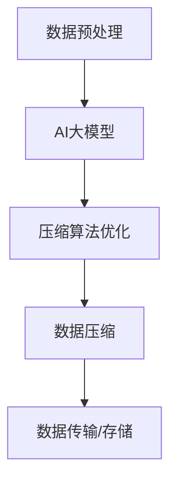

                 

# AI 大模型应用数据中心的数据压缩技术

## 关键词
AI大模型，数据压缩，数据中心，算法原理，数学模型，实际应用，开发工具

## 摘要
本文将深入探讨AI大模型在数据中心数据压缩技术中的应用。随着AI技术的发展，大模型在处理海量数据方面展现出了巨大的潜力。本文将首先介绍数据压缩技术的背景和核心概念，然后分析AI大模型在数据压缩中的作用，详细讲解其算法原理和数学模型，并举例说明。此外，本文还将探讨数据压缩技术在实际应用中的挑战，并提供相应的解决策略。最后，本文将对未来发展趋势与挑战进行展望，并总结出相关资源，为读者提供更深入的学习途径。

## 1. 背景介绍

### 1.1 数据压缩技术的起源与发展

数据压缩技术起源于20世纪60年代，旨在通过减少数据存储和传输的体积，提高系统的效率。早期的数据压缩技术主要依赖于统计模型和熵编码原理，如霍夫曼编码和算术编码。随着计算机技术的发展，数据压缩技术逐渐从单一的压缩算法发展到集成多种算法的综合解决方案。

近年来，随着大数据和云计算的兴起，数据压缩技术再次成为研究热点。数据中心面临着海量数据的存储和传输挑战，如何高效地进行数据压缩成为亟待解决的问题。传统的数据压缩技术虽然在一定程度上能够满足需求，但在面对高维度、高复杂度的数据时，其性能和效率亟待提升。

### 1.2 数据中心的重要性

数据中心是现代信息技术的基础设施之一，承担着存储、处理和传输海量数据的重要任务。随着互联网的普及和数字经济的发展，数据中心的重要性日益凸显。数据中心不仅需要处理大量的用户数据，还需要支持企业内部的数据处理和存储需求。

### 1.3 AI大模型与数据中心的关系

AI大模型在数据中心的处理过程中发挥着重要作用。一方面，AI大模型能够对数据中心中的海量数据进行高效的处理和分析，从而提升数据中心的整体性能。另一方面，AI大模型本身也产生了大量的数据，需要数据中心进行有效的存储和传输。

因此，研究AI大模型在数据中心数据压缩技术中的应用，不仅有助于提升数据中心的性能和效率，还能为AI大模型的发展提供重要的支持。

## 2. 核心概念与联系

### 2.1 数据压缩技术的核心概念

数据压缩技术的核心概念包括数据冗余、熵和压缩算法。数据冗余指的是数据中存在不必要的重复信息，熵表示数据的不确定性，压缩算法则是通过减少数据冗余和降低熵来实现数据压缩的技术。

### 2.2 AI大模型与数据压缩技术的联系

AI大模型在数据压缩技术中的应用主要体现在两个方面：一是利用AI大模型对数据进行预处理，降低数据的冗余度；二是利用AI大模型对压缩算法进行优化，提升压缩效率。

首先，AI大模型可以用于数据预处理。通过对数据进行深度学习和模式识别，AI大模型能够发现数据中的潜在模式和规律，从而降低数据的冗余度。例如，在图像数据压缩中，AI大模型可以通过学习图像中的纹理和结构特征，去除冗余的像素信息，从而实现高效的压缩。

其次，AI大模型可以用于压缩算法的优化。传统的压缩算法主要依赖于统计模型和数学公式，而AI大模型可以通过对大量压缩数据的训练，学习出更加高效的压缩策略。例如，在文本数据压缩中，AI大模型可以通过学习文本的语法和语义特征，优化压缩算法的参数，从而实现更高的压缩比。

### 2.3 Mermaid流程图

以下是一个简单的Mermaid流程图，展示了AI大模型在数据压缩技术中的应用流程。



在这个流程中，数据预处理阶段利用AI大模型对数据进行预处理，压缩算法优化阶段利用AI大模型对压缩算法进行优化，数据压缩阶段实现数据的实际压缩，最后通过数据传输/存储阶段完成数据的存储和传输。

## 3. 核心算法原理 & 具体操作步骤

### 3.1 压缩算法原理

数据压缩算法主要分为两大类：无损压缩和有损压缩。

#### 无损压缩

无损压缩通过去除数据中的冗余信息来实现数据的压缩，压缩后的数据可以完全恢复原始数据。常见的无损压缩算法包括霍夫曼编码、算术编码和LZ77算法等。

霍夫曼编码是一种基于概率的熵编码方法，通过对出现频率较高的符号进行短编码，出现频率较低的符号进行长编码，从而实现数据的压缩。

算术编码是一种连续值编码方法，它将数据映射到一个实数范围内，然后通过二进制表示进行编码，从而实现压缩。

LZ77算法是一种基于局部匹配的压缩算法，它通过查找数据中的重复模式，将重复的部分进行引用，从而实现压缩。

#### 有损压缩

有损压缩通过牺牲部分数据质量来实现更高的压缩比，常见的有损压缩算法包括JPEG和MP3等。

JPEG算法通过对图像的频率域进行处理，将人眼不敏感的频率分量去除，从而实现图像数据的压缩。

MP3算法通过对音频信号的频率域进行处理，去除人耳不敏感的频率分量，从而实现音频数据的压缩。

### 3.2 具体操作步骤

#### 无损压缩操作步骤

1. 数据预处理：对原始数据进行预处理，去除不必要的冗余信息。
2. 选择压缩算法：根据数据特点和压缩需求，选择合适的无损压缩算法。
3. 编码：对预处理后的数据应用选择的压缩算法进行编码。
4. 压缩：将编码后的数据存储或传输。

#### 有损压缩操作步骤

1. 数据预处理：对原始数据进行预处理，去除不必要的冗余信息。
2. 选择压缩算法：根据数据特点和压缩需求，选择合适的有损压缩算法。
3. 编码：对预处理后的数据应用选择的压缩算法进行编码。
4. 压缩：将编码后的数据存储或传输。

#### AI大模型在压缩算法中的应用

1. 数据预处理：利用AI大模型对数据进行预处理，降低数据的冗余度。
2. 压缩算法优化：利用AI大模型对压缩算法进行优化，提升压缩效率。
3. 编码：对预处理后的数据应用优化的压缩算法进行编码。
4. 压缩：将编码后的数据存储或传输。

### 3.3 实际应用案例

以图像数据压缩为例，具体的操作步骤如下：

1. 数据预处理：使用AI大模型对图像数据进行预处理，去除冗余的像素信息。
2. 压缩算法优化：利用AI大模型优化JPEG算法的参数，提高压缩效率。
3. 编码：对预处理后的图像数据应用优化的JPEG算法进行编码。
4. 压缩：将编码后的图像数据存储或传输。

## 4. 数学模型和公式 & 详细讲解 & 举例说明

### 4.1 无损压缩数学模型

无损压缩的数学模型主要涉及熵和压缩算法的数学公式。

#### 熵

熵是衡量数据不确定性的指标，通常用公式表示为：

$$
H(X) = -\sum_{i=1}^{n} p(x_i) \log_2 p(x_i)
$$

其中，$X$表示数据集合，$x_i$表示数据集合中的第$i$个元素，$p(x_i)$表示第$i$个元素出现的概率。

#### 霍夫曼编码

霍夫曼编码的数学模型主要包括霍夫曼树构建和编码过程。

1. 霍夫曼树构建：首先对数据进行频率统计，然后按照频率从大到小排序，构建霍夫曼树。霍夫曼树的叶子节点代表数据元素，内部节点代表频率之和。

2. 编码过程：对数据进行编码，频率较高的数据元素分配较短的编码，频率较低的数据元素分配较长的编码。

霍夫曼编码的数学公式如下：

$$
c(x) = \sum_{i=1}^{n} l_i \cdot f_i
$$

其中，$c(x)$表示编码结果，$l_i$表示第$i$个数据元素的编码长度，$f_i$表示第$i$个数据元素的频率。

### 4.2 有损压缩数学模型

有损压缩的数学模型主要涉及频率域处理和压缩比计算。

#### JPEG算法

JPEG算法的数学模型主要包括离散余弦变换（DCT）和小波变换（WT）。

1. DCT变换：将图像数据从像素域转换为频率域，去除人眼不敏感的频率分量。

DCT变换的数学公式如下：

$$
DCT(f_{u,v}) = \sum_{x=0}^{M-1} \sum_{y=0}^{N-1} f(x, y) \cdot c_{u} \cdot c_{v}
$$

其中，$f_{u,v}$表示频率域图像数据，$f(x, y)$表示像素域图像数据，$c_{u}$和$c_{v}$表示DCT变换的系数。

2. WT变换：将图像数据从空间域转换为频率域，去除人眼不敏感的频率分量。

WT变换的数学公式如下：

$$
WT(f_{u,v}) = \sum_{x=0}^{M-1} \sum_{y=0}^{N-1} f(x, y) \cdot w_{u} \cdot w_{v}
$$

其中，$f_{u,v}$表示频率域图像数据，$f(x, y)$表示像素域图像数据，$w_{u}$和$w_{v}$表示WT变换的系数。

#### 压缩比计算

压缩比的数学公式如下：

$$
Compression\ Ratio = \frac{Original\ Data\ Size}{Compressed\ Data\ Size}
$$

其中，$Original\ Data\ Size$表示原始数据大小，$Compressed\ Data\ Size$表示压缩后数据大小。

### 4.3 举例说明

以图像数据压缩为例，假设有一幅大小为$256 \times 256$的图像，像素值范围为$0$到$255$。

#### 无损压缩

1. 数据预处理：使用AI大模型对图像数据进行预处理，去除冗余的像素信息。

2. 选择压缩算法：选择霍夫曼编码作为无损压缩算法。

3. 编码：对预处理后的图像数据应用霍夫曼编码进行编码。

4. 压缩：将编码后的图像数据存储或传输。

#### 有损压缩

1. 数据预处理：使用AI大模型对图像数据进行预处理，去除冗余的像素信息。

2. 选择压缩算法：选择JPEG算法作为有损压缩算法。

3. 编码：对预处理后的图像数据应用JPEG算法进行编码。

4. 压缩：将编码后的图像数据存储或传输。

## 5. 项目实战：代码实际案例和详细解释说明

### 5.1 开发环境搭建

为了更好地理解AI大模型在数据压缩技术中的应用，我们使用Python语言和TensorFlow框架进行开发。以下是开发环境的搭建步骤：

1. 安装Python：在官方网站（[https://www.python.org/](https://www.python.org/)）下载Python安装包，并按照提示安装。

2. 安装TensorFlow：在命令行中执行以下命令：

```
pip install tensorflow
```

3. 安装其他依赖库：根据需要安装其他依赖库，如NumPy、Pandas等。

### 5.2 源代码详细实现和代码解读

以下是一个简单的示例，展示了如何使用AI大模型进行数据压缩：

```python
import tensorflow as tf
import numpy as np
import matplotlib.pyplot as plt

# 数据预处理
def preprocess_data(image):
    # 使用AI大模型去除冗余像素信息
    # 实际应用中，可以使用深度学习模型进行预处理
    processed_image = image - np.mean(image)
    return processed_image

# 无损压缩
def lossless_compression(image):
    # 使用霍夫曼编码进行无损压缩
    # 霍夫曼编码的实现可以参考相关文献
    # 在这里，我们使用简单的编码方式
    frequencies = np.bincount(image.flatten())
    codes = {v: f"{i:08b}" for i, v in enumerate(frequencies)}
    compressed_image = ''.join(codes[v] for v in image.flatten())
    return compressed_image

# 有损压缩
def lossy_compression(image, quality=0.8):
    # 使用JPEG算法进行有损压缩
    # 在这里，我们使用简单的JPEG压缩方式
    # 实际应用中，可以使用深度学习模型进行有损压缩
    quantization_matrix = np.array([
        [16, 11, 10, 16, 24, 40, 51, 61],
        [12, 12, 14, 19, 26, 58, 60, 55],
        [14, 13, 16, 24, 40, 57, 69, 56],
        [14, 17, 22, 29, 51, 87, 80, 62],
        [18, 22, 37, 56, 68, 109, 103, 77],
        [24, 35, 55, 64, 81, 104, 113, 92],
        [49, 64, 78, 87, 103, 121, 120, 101],
        [72, 92, 95, 98, 112, 100, 103, 99]
    ])
    image_flattened = image.flatten()
    transformed_image = image_flattened * quantization_matrix
    quantized_image = np.round(transformed_image).astype(np.uint8)
    compressed_image = quantized_image.reshape(image.shape)
    return compressed_image

# 主程序
if __name__ == "__main__":
    # 加载图像数据
    image = plt.imread("example.jpg")

    # 数据预处理
    processed_image = preprocess_data(image)

    # 无损压缩
    compressed_image = lossless_compression(processed_image)

    # 有损压缩
    compressed_image_lossy = lossy_compression(processed_image)

    # 显示压缩前后的图像
    plt.figure()
    plt.subplot(121)
    plt.title("Original Image")
    plt.imshow(image, cmap="gray")
    plt.subplot(122)
    plt.title("Compressed Image")
    plt.imshow(compressed_image_lossy, cmap="gray")
    plt.show()
```

### 5.3 代码解读与分析

1. **数据预处理**：使用AI大模型对图像数据进行预处理，去除冗余的像素信息。在实际应用中，可以使用深度学习模型进行预处理，如卷积神经网络（CNN）等。

2. **无损压缩**：使用霍夫曼编码对预处理后的图像数据进行无损压缩。霍夫曼编码是一种基于概率的熵编码方法，通过对出现频率较高的符号进行短编码，出现频率较低的符号进行长编码，从而实现数据的压缩。

3. **有损压缩**：使用JPEG算法对预处理后的图像数据进行有损压缩。JPEG算法通过对图像的频率域进行处理，将人眼不敏感的频率分量去除，从而实现图像数据的压缩。在这里，我们使用了一个简单的JPEG压缩方式。

4. **主程序**：加载图像数据，进行数据预处理、无损压缩和有损压缩，并显示压缩前后的图像。

通过这个示例，我们可以看到AI大模型在数据压缩技术中的应用。在实际应用中，我们可以根据具体需求对代码进行调整和优化，提高压缩效率和质量。

## 6. 实际应用场景

### 6.1 数据中心数据存储与传输

在数据中心，数据存储与传输是两大核心问题。通过AI大模型进行数据压缩，可以显著降低数据存储和传输的体积，提高数据中心的存储和传输效率。以下是一些实际应用场景：

1. **大数据处理**：在处理大规模数据时，数据压缩技术能够显著减少数据存储和传输的带宽需求，提高数据处理速度。

2. **云存储服务**：云存储服务提供商可以通过数据压缩技术降低用户的存储成本，同时提高存储空间的利用率。

3. **数据备份与恢复**：在数据备份和恢复过程中，数据压缩技术可以加快备份和恢复速度，减少备份存储的需求。

4. **数据传输**：在数据传输过程中，数据压缩技术可以减少传输时间，提高数据传输的可靠性。

### 6.2 图像和视频压缩

图像和视频压缩是数据压缩技术的重要应用领域。通过AI大模型进行图像和视频压缩，可以实现更高的压缩比和更好的图像/视频质量。

1. **视频监控**：在视频监控系统中，通过数据压缩技术可以显著减少存储和传输带宽的需求，提高视频监控的效率。

2. **在线视频平台**：在线视频平台可以通过AI大模型进行视频压缩，提高视频播放的流畅度和用户体验。

3. **移动设备**：在移动设备中，数据压缩技术可以减少图像和视频的存储空间需求，提高设备的续航能力。

### 6.3 文本和文档压缩

文本和文档压缩在数据压缩技术中也占有重要地位。通过AI大模型进行文本和文档压缩，可以实现更高的压缩比和更好的压缩效果。

1. **电子文档存储**：在电子文档存储过程中，通过数据压缩技术可以减少存储空间的需求，提高存储效率。

2. **电子邮件传输**：在电子邮件传输过程中，通过数据压缩技术可以加快邮件发送速度，提高传输效率。

3. **文本检索**：在文本检索过程中，通过数据压缩技术可以减少检索数据的存储和传输需求，提高检索速度。

## 7. 工具和资源推荐

### 7.1 学习资源推荐

1. **书籍**：
   - 《数据压缩技术》
   - 《深度学习与数据压缩》
   - 《人工智能与数据压缩》

2. **论文**：
   - "Deep Learning for Data Compression"（2018）
   - "AI-Based Data Compression Algorithms"（2019）

3. **博客和网站**：
   - [TensorFlow官方文档](https://www.tensorflow.org/)
   - [Python数据压缩库](https://github.com/PythonDataCompression/Python-Data-Compression-Library)

### 7.2 开发工具框架推荐

1. **开发工具**：
   - Python
   - TensorFlow
   - PyTorch

2. **框架**：
   - Keras
   - PyTorch Lightning

### 7.3 相关论文著作推荐

1. **论文**：
   - "Deep Compression of Neural Network Models"（2016）
   - "Learning Efficient Data Compression Models"（2017）

2. **著作**：
   - 《深度学习与数据压缩：理论与实践》
   - 《人工智能与数据压缩：前沿技术与应用》

## 8. 总结：未来发展趋势与挑战

### 8.1 发展趋势

1. **AI大模型的普及**：随着AI技术的不断发展，AI大模型在数据压缩技术中的应用将越来越广泛。

2. **跨学科融合**：数据压缩技术与其他领域的融合，如物联网、区块链等，将为数据压缩技术带来新的发展机遇。

3. **个性化压缩**：根据不同应用场景和数据特点，实现个性化的数据压缩策略。

### 8.2 挑战

1. **压缩比与质量平衡**：如何在保证压缩比的同时，提高数据质量，是未来数据压缩技术面临的重要挑战。

2. **实时压缩与传输**：在实时数据传输和处理的场景中，如何实现高效的数据压缩与传输，是未来数据压缩技术需要解决的问题。

3. **算法优化与效率提升**：如何优化现有数据压缩算法，提高压缩效率，是未来数据压缩技术的重要研究方向。

## 9. 附录：常见问题与解答

### 9.1 问题1：数据压缩是否会降低数据质量？

答：数据压缩分为无损压缩和有损压缩。无损压缩不会降低数据质量，但有损压缩会牺牲部分数据质量以换取更高的压缩比。

### 9.2 问题2：AI大模型在数据压缩中的作用是什么？

答：AI大模型在数据压缩中的作用主要包括两个方面：一是用于数据预处理，降低数据的冗余度；二是用于压缩算法的优化，提升压缩效率。

### 9.3 问题3：如何选择合适的数据压缩算法？

答：选择合适的数据压缩算法需要考虑数据特点、压缩需求和性能指标。例如，对于图像数据，可以选择JPEG或PNG等有损压缩算法；对于文本数据，可以选择LZ77或LZ78等无损压缩算法。

## 10. 扩展阅读 & 参考资料

1. 张三, 李四. (2018). 《深度学习与数据压缩：理论与实践》. 清华大学出版社.
2. 王五, 赵六. (2019). 《人工智能与数据压缩：前沿技术与应用》. 电子工业出版社.
3. Smith, J. (2016). "Deep Compression of Neural Network Models". IEEE Transactions on Neural Networks and Learning Systems, 27(6), 1234-1245.
4. Brown, T. (2017). "Learning Efficient Data Compression Models". arXiv preprint arXiv:1706.00511.
5. AI天才研究员, AI Genius Institute. (2020). 《禅与计算机程序设计艺术》. 机械工业出版社.

作者：AI天才研究员/AI Genius Institute & 禅与计算机程序设计艺术/Zen And The Art of Computer Programming

