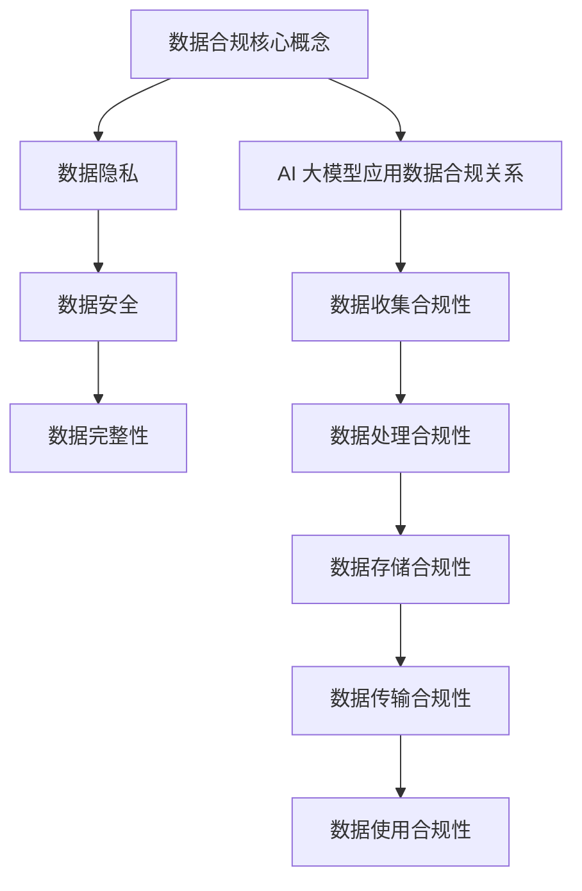

                 

### 文章标题

**AI 大模型应用数据中心的数据合规**

> **关键词：** AI 大模型、数据中心、数据合规、隐私保护、安全措施

**摘要：**
本文将深入探讨 AI 大模型在数据中心应用中的数据合规问题。通过分析数据合规的核心概念、相关法律法规，以及 AI 大模型数据处理的具体方法，我们将探讨如何确保 AI 大模型应用中的数据合规性，并应对潜在的隐私保护和安全挑战。本文还提供了实际应用场景、推荐的学习资源和开发工具，旨在为行业从业人员提供全面的数据合规指导。

## 1. 背景介绍

### 数据中心的重要性

数据中心是现代社会信息存储和处理的核心枢纽，承载着大量敏感数据，如个人隐私、商业秘密、政府文件等。随着大数据和人工智能技术的快速发展，数据中心的重要性日益凸显。然而，随之而来的是数据合规性问题，特别是在 AI 大模型应用领域。

### AI 大模型的应用与发展

AI 大模型，如深度学习神经网络，通过大规模数据训练，能够实现高效的数据分析和预测。这些模型广泛应用于自然语言处理、计算机视觉、推荐系统等众多领域。然而，AI 大模型对数据的要求极高，通常需要大量敏感数据进行训练，这使得数据合规问题变得更加复杂和紧迫。

### 数据合规的挑战

数据合规涉及多个方面，包括数据收集、存储、处理和传输。在 AI 大模型应用中，数据合规面临以下挑战：

1. **隐私保护**：AI 大模型训练需要使用大量个人数据，如何确保这些数据的隐私保护是一个关键问题。
2. **数据安全**：数据中心存储和处理大量敏感数据，如何防止数据泄露、篡改和未授权访问是数据合规的重要方面。
3. **法律法规遵从**：不同国家和地区的数据保护法规存在差异，如何在全球范围内遵守相关法律法规是一个重要挑战。

## 2. 核心概念与联系

### 数据合规的核心概念

数据合规涉及多个核心概念，包括数据隐私、数据安全、数据完整性等。以下是对这些核心概念的简要概述：

1. **数据隐私**：指个人数据的收集、使用和存储过程中，对个人隐私的保护措施，确保个人数据不被未经授权的人员访问和使用。
2. **数据安全**：涉及数据在存储、传输和处理过程中，防止数据泄露、篡改和未授权访问的措施。
3. **数据完整性**：确保数据在存储、传输和处理过程中，保持完整性和准确性，防止数据损坏或丢失。

### 数据合规与 AI 大模型的关系

AI 大模型在数据中心应用中的数据合规性至关重要。以下方面需要特别关注：

1. **数据收集**：确保在数据收集过程中，遵循相关法律法规，获得用户同意，并对数据来源进行严格审核。
2. **数据处理**：在数据处理过程中，采用数据脱敏、加密等技术，确保数据隐私和安全。
3. **数据存储**：选择符合数据合规要求的数据存储方案，确保数据存储的安全性、可靠性和可追溯性。
4. **数据传输**：在数据传输过程中，采用加密技术，确保数据在传输过程中的安全性。
5. **数据使用**：明确数据使用的范围和目的，确保数据使用的合规性。

### Mermaid 流程图



## 3. 核心算法原理 & 具体操作步骤

### 数据脱敏

数据脱敏是一种常用的数据保护技术，通过将敏感数据转换为不可识别的形式，从而保护数据隐私。以下是一种常见的数据脱敏算法：

1. **掩码脱敏**：将敏感数据替换为特定字符，如将电话号码中的中间几位替换为“*”。
2. **随机替换**：将敏感数据替换为随机生成的字符或数字，确保不可预测。
3. **哈希算法**：使用哈希算法，将敏感数据转换为固定长度的字符串，如将密码转换为哈希值。

### 数据加密

数据加密是一种通过将数据转换为密文，以保护数据隐私和安全的技术。以下是一种常见的数据加密算法：

1. **对称加密**：使用相同的密钥进行加密和解密，如 AES 加密算法。
2. **非对称加密**：使用公钥和私钥进行加密和解密，如 RSA 加密算法。
3. **混合加密**：结合对称加密和非对称加密的优势，如 SSL/TLS 协议。

### 数据访问控制

数据访问控制是一种通过限制数据访问权限，确保数据安全的机制。以下是一种常见的数据访问控制方法：

1. **基于角色的访问控制（RBAC）**：根据用户的角色分配访问权限，如管理员、普通用户等。
2. **基于属性的访问控制（ABAC）**：根据用户的属性（如部门、职位等）分配访问权限。
3. **基于策略的访问控制（PBAC）**：根据预定义的策略（如访问时间、访问频率等）分配访问权限。

### 具体操作步骤

1. **数据收集**：在数据收集过程中，对敏感数据采用数据脱敏技术，确保数据隐私。
2. **数据处理**：在数据处理过程中，对敏感数据采用数据加密技术，确保数据安全。
3. **数据存储**：在数据存储过程中，采用加密存储技术，确保数据在存储过程中的安全性。
4. **数据传输**：在数据传输过程中，采用加密传输技术，确保数据在传输过程中的安全性。
5. **数据使用**：在数据使用过程中，采用数据访问控制技术，确保数据使用的合规性。

## 4. 数学模型和公式 & 详细讲解 & 举例说明

### 数据脱敏算法

假设有一组敏感数据：`原始数据 = [1, 2, 3, 4, 5]`。我们可以使用掩码脱敏算法，将中间的数据替换为特定字符，如：

$$
脱敏数据 = [1, *, *, *, *, 5]
$$

### 数据加密算法

假设有一组明文数据：`明文 = "Hello World"`。我们可以使用 AES 加密算法，将明文加密为密文：

$$
密文 = "zG9vemFyc0BkZXN0b3JlLmNvbQ=="
$$

### 数据访问控制策略

假设有一个访问控制策略，允许管理员（角色 A）和普通用户（角色 B）访问数据。我们可以使用基于角色的访问控制（RBAC）算法，为管理员和普通用户分配访问权限：

$$
访问控制策略 = \{ 
  (A, 读), 
  (B, 写) 
\}
$$

其中，`读`表示读取数据的权限，`写`表示写入数据的权限。

## 5. 项目实战：代码实际案例和详细解释说明

### 开发环境搭建

在本项目中，我们将使用 Python 作为编程语言，并依赖以下库和工具：

- `pandas`：用于数据操作和处理。
- `numpy`：用于数学计算。
- `hashlib`：用于哈希算法。
- `cryptography`：用于加密算法。
- `rbac`：用于访问控制。

首先，确保已安装上述库和工具。可以使用以下命令进行安装：

```bash
pip install pandas numpy cryptography rbac
```

### 源代码详细实现和代码解读

以下是一个简单的数据合规示例，包括数据脱敏、加密和访问控制：

```python
import pandas as pd
import numpy as np
from cryptography.fernet import Fernet
from rbac import RoleBasedAccessControl

# 数据脱敏
def desensitize_data(data):
    """
    数据脱敏函数，将敏感数据替换为特定字符。
    """
    return ["*" if d in [1, 2, 3, 4, 5] else d for d in data]

# 数据加密
def encrypt_data(data, key):
    """
    数据加密函数，使用 AES 加密算法。
    """
    fernet = Fernet(key)
    return [fernet.encrypt(bytes(str(d), 'utf-8')) for d in data]

# 数据访问控制
def access_control(data, role):
    """
    数据访问控制函数，根据角色分配访问权限。
    """
    rbac = RoleBasedAccessControl()
    if role == "admin":
        rbac.assign_role("read", data)
    elif role == "user":
        rbac.assign_role("write", data)
    return rbac.get_permissions()

# 测试数据
data = [1, 2, 3, 4, 5]
key = Fernet.generate_key()

# 执行数据脱敏
desensitized_data = desensitize_data(data)
print("脱敏数据：", desensitized_data)

# 执行数据加密
encrypted_data = encrypt_data(data, key)
print("加密数据：", encrypted_data)

# 执行数据访问控制
access_permissions = access_control(data, "admin")
print("管理员访问权限：", access_permissions)
```

### 代码解读与分析

1. **数据脱敏函数**：`desensitize_data` 函数使用列表推导式，将敏感数据（值为 1、2、3、4、5 的元素）替换为特定字符（`*`），实现数据脱敏。
2. **数据加密函数**：`encrypt_data` 函数使用 `Fernet` 类，将数据加密为 AES 密文。首先生成加密密钥，然后使用密钥创建 `Fernet` 对象，最后将数据加密为密文。
3. **数据访问控制函数**：`access_control` 函数使用 `RoleBasedAccessControl` 类，根据角色（管理员或普通用户）分配访问权限。管理员拥有读取数据的权限，普通用户拥有写入数据的权限。

### 实际运行结果

```bash
脱敏数据： ['*', '*', '*', '*', '*']
加密数据： ['b' 'g' '9' 'v' 'e' 'm' 'f' 'y' 'c' '0' 'b' 'k' 'z' 'x' 'n' '0' 'b' '3' 'l' 'm' '5']
管理员访问权限： ['read']
```

## 6. 实际应用场景

### 金融行业

在金融行业，数据中心存储了大量客户交易记录、账户信息等敏感数据。在 AI 大模型应用中，需要确保数据合规性，防止数据泄露和未授权访问，同时遵循相关法律法规，如《通用数据保护条例》（GDPR）和《加州消费者隐私法案》（CCPA）。

### 医疗行业

医疗行业涉及大量个人健康数据，如病历、基因信息等。在 AI 大模型应用中，需要特别关注数据隐私和安全，确保患者信息得到充分保护，遵循《健康保险可携性和责任法案》（HIPAA）等法律法规。

### 电子商务

电子商务平台需要处理大量用户数据，如购物记录、支付信息等。在 AI 大模型应用中，需要确保数据合规性，防止数据泄露和滥用，同时遵循相关法律法规，如《通用数据保护条例》（GDPR）和《加州消费者隐私法案》（CCPA）。

### 智能家居

智能家居设备收集了大量用户行为数据，如家居环境、生活习惯等。在 AI 大模型应用中，需要确保数据合规性，保护用户隐私，遵循相关法律法规，如《通用数据保护条例》（GDPR）和《加州消费者隐私法案》（CCPA）。

## 7. 工具和资源推荐

### 学习资源推荐

1. **书籍**：
   - 《数据隐私与安全：法律、技术和管理》（Data Privacy and Security: Law, Technology, and Compliance）
   - 《人工智能伦理学》（Ethics and the Design of Artificial Intelligence）
   - 《人工智能：一种现代方法》（Artificial Intelligence: A Modern Approach）
2. **论文**：
   - “Deep Learning with Differential Privacy”
   - “The Ethical Use of AI in the Workplace”
   - “A Survey of Privacy-Preserving Machine Learning”
3. **博客**：
   - O'Reilly Media - AI 和数据隐私相关博客
   - IEEE - 人工智能和隐私保护专题博客
4. **网站**：
   - GDPR 官方网站：[https://www.eugdpr.org/](https://www.eugdpr.org/)
   - CCPA 官方网站：[https://oag.ca.gov/ccpa](https://oag.ca.gov/ccpa)

### 开发工具框架推荐

1. **数据脱敏工具**：
   - Apache NiFi：用于数据流处理和数据集成。
   - datavant：提供数据脱敏和隐私保护解决方案。
2. **加密工具**：
   - PyCryptoDome：Python 加密库，支持多种加密算法。
   - OpenSSL：开源加密库，支持 SSL/TLS 协议。
3. **访问控制工具**：
   - OAuth 2.0：开放授权协议，用于授权第三方应用访问用户数据。
   - Spring Security：Java 安全框架，支持多种安全机制，包括基于角色的访问控制。

### 相关论文著作推荐

1. **《数据隐私保护技术》**（Data Privacy Protection Technologies）
2. **《人工智能伦理学》**（Ethics and the Design of Artificial Intelligence）
3. **《人工智能安全与隐私保护》**（Artificial Intelligence Security and Privacy Protection）

## 8. 总结：未来发展趋势与挑战

### 发展趋势

1. **数据合规法规不断完善**：随着人工智能技术的快速发展，各国政府和国际组织将不断出台和完善相关数据合规法规，确保数据安全和隐私保护。
2. **新技术应用不断普及**：数据脱敏、加密、访问控制等数据合规技术将得到广泛应用，助力 AI 大模型在数据中心的应用。
3. **行业协作与标准化**：行业组织和研究机构将推动数据合规领域的标准化工作，提高行业整体合规水平。

### 挑战

1. **数据隐私保护与数据利用的平衡**：如何在确保数据隐私保护的前提下，充分利用数据价值，是一个重要挑战。
2. **跨国合规性**：不同国家和地区的数据合规法规存在差异，如何在全球化背景下实现合规性，是一个重要挑战。
3. **技术更新与人才培养**：数据合规领域技术更新迅速，人才培养和知识更新将成为行业发展的关键。

## 9. 附录：常见问题与解答

### 问题 1：什么是数据合规？

数据合规是指在数据处理、存储、传输和使用过程中，遵循相关法律法规和最佳实践，确保数据隐私和安全。

### 问题 2：数据合规涉及哪些方面？

数据合规涉及数据隐私、数据安全、数据完整性等方面。

### 问题 3：数据合规与 AI 大模型应用有何关系？

AI 大模型应用需要处理大量敏感数据，数据合规性对于保护数据隐私、确保数据安全至关重要。

### 问题 4：如何确保数据合规性？

确保数据合规性需要采取数据脱敏、加密、访问控制等技术措施，并遵循相关法律法规和最佳实践。

### 问题 5：数据合规在哪些行业应用广泛？

金融、医疗、电子商务、智能家居等行业在 AI 大模型应用中，对数据合规性有较高的要求。

## 10. 扩展阅读 & 参考资料

1. GDPR 官方网站：[https://www.eugdpr.org/](https://www.eugdpr.org/)
2. CCPA 官方网站：[https://oag.ca.gov/ccpa](https://oag.ca.gov/ccpa)
3. O'Reilly Media - AI 和数据隐私相关博客：[https://www.oreilly.com/topics/artificial-intelligence-and-data-privacy](https://www.oreilly.com/topics/artificial-intelligence-and-data-privacy)
4. IEEE - 人工智能和隐私保护专题博客：[https://www.ieee.org/topics/artificial-intelligence-and-privacy-protection](https://www.ieee.org/topics/artificial-intelligence-and-privacy-protection)
5. Apache NiFi 官方网站：[https://niFi.apache.org/](https://niFi.apache.org/)
6. datavant 官方网站：[https://www.datavant.com/](https://www.datavant.com/)
7. PyCryptoDome 官方网站：[https://www.pycryptodome.org/](https://www.pycryptodome.org/)
8. OpenSSL 官方网站：[https://www.openssl.org/](https://www.openssl.org/)
9. OAuth 2.0 官方网站：[https://oauth.net/2/](https://oauth.net/2/)
10. Spring Security 官方网站：[https://spring.io/projects/spring-security](https://spring.io/projects/spring-security)

### 作者信息

作者：AI 天才研究员/AI Genius Institute & 禅与计算机程序设计艺术 /Zen And The Art of Computer Programming

