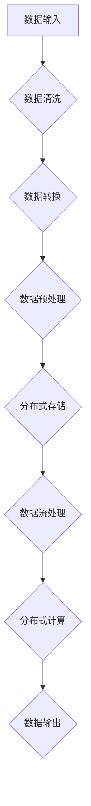

                 

### 文章标题

《AI 大模型应用数据中心的数据管理平台》

### 关键词

- AI大模型
- 数据中心
- 数据管理平台
- 数据流处理
- 自动化
- 性能优化
- 安全性
- 可扩展性

### 摘要

本文将深入探讨AI大模型应用数据中心的数据管理平台。我们将分析该平台的核心概念、架构，以及其具体算法原理和操作步骤。通过详细讲解数学模型和公式，并结合实际项目实战案例，我们将展示如何搭建一个高效、安全、可扩展的数据管理平台。最后，我们将讨论其应用场景、相关工具和资源，并对未来发展趋势和挑战进行展望。

### 1. 背景介绍

随着人工智能（AI）技术的快速发展，特别是生成式AI大模型的兴起，数据中心的数据管理平台变得越来越重要。这些大模型通常需要处理海量数据，并具备高度复杂的计算能力。因此，构建一个高效、可靠的数据管理平台对于实现AI大模型的应用至关重要。

数据管理平台的主要目标是提供数据存储、处理、分析和传输的统一解决方案。它需要处理数据的输入、输出、清洗、转换、存储等多个环节，以满足不同应用场景的需求。同时，数据管理平台还需要具备高可靠性、高性能、高安全性、可扩展性等特点，以适应不断增长的AI大模型和数据量。

当前，数据中心的数据管理平台通常采用分布式架构，利用云计算和大数据技术实现数据的处理和管理。常见的架构模式包括数据流处理（如Apache Kafka）、分布式存储（如HDFS、Cassandra）、以及分布式计算框架（如Apache Spark、Flink）。这些技术共同构建了一个强大的数据处理和管理平台，为AI大模型的应用提供了坚实的基础。

#### 1.1 数据管理平台的挑战

尽管现有数据管理平台在处理大规模数据方面取得了显著进展，但仍面临以下挑战：

- **数据一致性**：在分布式系统中，确保数据的一致性是一个重大挑战。特别是在涉及多个数据源和多个处理节点的情况下，如何保证数据的准确性和一致性成为一个关键问题。
- **性能优化**：随着数据量和计算需求的增加，如何优化平台的性能成为一个关键问题。这涉及到数据存储、处理、传输等各个环节的优化。
- **安全性**：数据中心的数据通常包含敏感信息，如何确保数据的安全性是一个重要的挑战。这包括数据加密、访问控制、安全审计等方面。
- **可扩展性**：如何根据需求灵活扩展平台的能力和规模，是一个重要的挑战。这要求平台具备良好的模块化和分布式特性。

#### 1.2 数据管理平台的重要性

数据管理平台在AI大模型应用中扮演着至关重要的角色。以下是几个关键点：

- **数据准备**：数据管理平台负责数据的清洗、转换和预处理，为AI大模型提供高质量的数据输入。数据的质量直接影响到模型的性能和准确性。
- **计算资源管理**：数据管理平台可以帮助优化计算资源的分配和使用，提高AI大模型的计算效率。
- **数据处理**：数据管理平台提供了高效的数据处理能力，包括实时数据处理、批处理、流处理等，以满足不同应用场景的需求。
- **数据安全**：数据管理平台提供了安全的数据存储和处理机制，确保数据的机密性和完整性。

### 2. 核心概念与联系

在本节中，我们将介绍数据管理平台的核心概念和架构，并使用Mermaid流程图来展示其基本原理。

#### 2.1 核心概念

- **数据流处理**：数据流处理是指实时处理和传输数据的技术，它能够快速响应数据变化，适用于实时分析和决策。常见的实现技术包括Apache Kafka、Apache Flink等。
- **分布式存储**：分布式存储是指将数据分散存储在多个节点上，以提高存储容量和可靠性。常见的实现技术包括HDFS、Cassandra等。
- **分布式计算**：分布式计算是指通过多个节点协作计算，以提高计算效率和性能。常见的实现技术包括Apache Spark、Apache Flink等。
- **数据清洗与预处理**：数据清洗与预处理是指对原始数据进行清洗、转换和预处理，以去除噪声、缺失值，并进行格式转换等操作，为后续处理做准备。

#### 2.2 Mermaid流程图

以下是数据管理平台的基本流程图：



在这个流程图中，数据从输入开始，经过数据清洗、转换和预处理后，被存储在分布式存储系统中。同时，实时数据流处理模块可以处理实时数据，并将其结果传递给分布式计算模块，最终生成数据输出。

#### 2.3 核心概念的联系

数据管理平台的核心概念之间紧密相连，共同构建了一个完整的数据处理和管理流程。以下是各个核心概念之间的联系：

- **数据流处理**与**分布式存储**：数据流处理模块将实时数据存储到分布式存储系统中，实现数据的实时存储和持久化。
- **分布式存储**与**分布式计算**：分布式存储系统为分布式计算模块提供数据存储支持，分布式计算模块可以在存储系统中高效地处理数据。
- **数据清洗与预处理**与**数据流处理**：数据清洗与预处理模块确保数据质量，为数据流处理提供高质量的数据输入。
- **数据清洗与预处理**与**分布式计算**：数据清洗与预处理模块为分布式计算模块提供高质量的数据输入，提高计算效率和准确性。

通过以上核心概念和流程的介绍，我们可以看到数据管理平台的基本架构和运作原理。在接下来的章节中，我们将进一步深入探讨数据管理平台的核心算法原理和操作步骤。

### 3. 核心算法原理 & 具体操作步骤

在了解了数据管理平台的核心概念和架构之后，接下来我们将深入探讨其核心算法原理和具体操作步骤。这些算法和步骤是构建高效、可靠数据管理平台的关键。

#### 3.1 数据清洗算法原理

数据清洗是数据管理平台的一个重要环节，其目的是去除数据中的噪声、缺失值和重复数据，以提高数据的质量和准确性。以下是常见的数据清洗算法原理：

- **缺失值处理**：缺失值处理是数据清洗中的重要步骤。常见的缺失值处理方法包括：

  - **插补法**：使用统计方法（如平均值、中位数、最临近插值等）来填补缺失值。

    $$\text{补全值} = \text{平均值} \times \text{权重} + \text{其他方法} \times (1 - \text{权重})$$

  - **删除法**：直接删除包含缺失值的记录或字段。

- **重复值检测与处理**：重复值检测是发现和删除数据中重复记录的过程。常用的方法包括：

  - **基于哈希的方法**：使用哈希函数将数据记录映射到哈希表中，检测重复记录。

    $$\text{哈希值} = \text{哈希函数}(\text{数据记录})$$

  - **基于比较的方法**：通过比较数据记录的字段值，检测和删除重复记录。

- **噪声处理**：噪声处理是指去除数据中的异常值和噪声值。常用的方法包括：

  - **基于阈值的方法**：根据数据分布和统计特征，设置阈值来检测和去除异常值。

    $$\text{异常值} = \text{数据记录} - \text{均值} > \text{阈值}$$

  - **基于聚类的方法**：使用聚类算法（如K-means、DBSCAN等）将数据划分为多个簇，检测和去除噪声点。

#### 3.2 数据转换算法原理

数据转换是将数据从一种格式转换为另一种格式的过程。在数据管理平台中，数据转换通常涉及数据格式的转换、数据类型的转换、数据字段的映射等。以下是常见的数据转换算法原理：

- **格式转换**：格式转换是指将数据从一种格式（如CSV、JSON）转换为另一种格式。常用的方法包括：

  - **基于正则表达式的方法**：使用正则表达式来匹配和提取数据字段，实现格式转换。

    $$\text{转换后数据} = \text{正则表达式}(\text{原始数据})$$

  - **基于解析库的方法**：使用解析库（如Python的json库、csv库等）来读取和写入数据，实现格式转换。

- **数据类型转换**：数据类型转换是指将数据从一个数据类型转换为另一个数据类型。常用的方法包括：

  - **数值类型转换**：将字符串转换为数值类型（如int、float），或者将数值类型转换为字符串。

    $$\text{转换后数据} = \text{str}(\text{数值数据}) \text{或} \text{int}(\text{字符串数据})$$

  - **日期类型转换**：将日期字符串转换为日期类型，或者将日期类型转换为日期字符串。

    $$\text{转换后数据} = \text{datetime}(\text{日期字符串}) \text{或} \text{date}(\text{日期类型})$$

- **数据字段映射**：数据字段映射是指将源数据表中的字段映射到目标数据表中的字段。常用的方法包括：

  - **基于字典的方法**：使用字典来定义源字段和目标字段之间的映射关系。

    ```python
    mapping = {
        'source_field1': 'target_field1',
        'source_field2': 'target_field2',
        # ...
    }
    ```

  - **基于模板的方法**：使用模板来定义数据字段映射的规则，实现字段映射。

    ```python
    template = {
        'source_field1': '{0}',
        'source_field2': '{1}',
        # ...
    }
    data = template.format(source_field1, source_field2)
    ```

#### 3.3 数据预处理算法原理

数据预处理是数据管理平台的另一个重要环节，其目的是将原始数据转换为适合分析的数据格式。以下是常见的数据预处理算法原理：

- **数据聚合**：数据聚合是指将多个数据记录合并为一个记录，以实现数据的汇总和分析。常用的方法包括：

  - **基于分组的方法**：使用分组操作（如SQL的GROUP BY语句）将数据按照某一维度进行分组，然后对每个分组的数据进行聚合操作。

    ```sql
    SELECT field1, SUM(field2) as total
    FROM data_table
    GROUP BY field1
    ```

  - **基于字典的方法**：使用字典来存储分组数据，然后对每个分组的数据进行聚合操作。

    ```python
    data = {
        'group1': {'field1': [1, 2, 3], 'field2': [10, 20, 30]},
        'group2': {'field1': [4, 5, 6], 'field2': [40, 50, 60]},
        # ...
    }
    result = {
        'group1': {'total': sum(data['group1']['field2'])},
        'group2': {'total': sum(data['group2']['field2'])},
        # ...
    }
    ```

- **数据标准化**：数据标准化是指将数据转换为统一的标准形式，以消除数据之间的差异。常用的方法包括：

  - **基于均值和标准差的方法**：使用均值和标准差将数据标准化为Z分数。

    $$\text{标准化值} = \frac{\text{数据值} - \text{均值}}{\text{标准差}}$$

  - **基于范围的方法**：将数据值映射到[0, 1]的范围内。

    $$\text{标准化值} = \frac{\text{数据值} - \text{最小值}}{\text{最大值} - \text{最小值}}$$

#### 3.4 具体操作步骤

以下是数据管理平台的具体操作步骤，这些步骤通常涉及数据处理、数据转换和预处理等环节：

1. **数据采集**：从各种数据源（如数据库、文件、API等）采集数据。

2. **数据清洗**：对采集到的数据进行清洗，包括缺失值处理、重复值检测与处理、噪声处理等。

3. **数据转换**：将清洗后的数据转换为适合分析的数据格式，包括格式转换、数据类型转换、数据字段映射等。

4. **数据预处理**：对转换后的数据进行分析和预处理，包括数据聚合、数据标准化等操作。

5. **数据存储**：将预处理后的数据存储到分布式存储系统中，以便后续处理和使用。

6. **数据流处理**：使用数据流处理技术（如Apache Kafka）对实时数据进行处理和传输，实现实时数据处理和分析。

7. **分布式计算**：使用分布式计算框架（如Apache Spark）对存储在分布式存储系统中的数据进行批量处理和分析。

8. **数据输出**：将处理和分析结果输出到目标系统或存储系统，以便进一步使用和分析。

通过以上核心算法原理和具体操作步骤的介绍，我们可以看到数据管理平台在数据处理和管理方面的重要作用。在接下来的章节中，我们将进一步讨论数据管理平台在数学模型和公式方面的应用。

### 4. 数学模型和公式 & 详细讲解 & 举例说明

在数据管理平台中，数学模型和公式扮演着至关重要的角色，它们用于描述和处理数据中的复杂关系。以下我们将详细讲解几个关键数学模型和公式，并通过实例说明它们在实际应用中的具体用法。

#### 4.1 数据清洗中的缺失值处理

缺失值处理是数据清洗中的一个重要步骤。以下是一个常用的插补法示例：

**公式**：线性回归插补法

$$\hat{y_i} = \beta_0 + \beta_1 x_i + \epsilon_i$$

其中，\( \hat{y_i} \) 是缺失值 \( y_i \) 的估计值，\( \beta_0 \) 和 \( \beta_1 \) 是回归模型的参数，\( x_i \) 是其他非缺失的输入变量，\( \epsilon_i \) 是误差项。

**实例**：假设我们有一个数据集，其中有一列缺失值，我们可以使用线性回归模型来估计这些缺失值。

数据集：

| ID | Age | Income |
|----|-----|--------|
| 1  | 25  | 50000  |
| 2  |     | 60000  |
| 3  | 30  | 70000  |

我们选择另一列 `Income` 作为输入变量来预测缺失的 `Age`。

假设回归模型训练得到：

$$\hat{Age} = 20 + 0.1 \times \text{Income}$$

对于缺失的记录 \( ID = 2 \)，我们将其 `Income` 值代入公式：

$$\hat{Age} = 20 + 0.1 \times 60000 = 62$$

因此，缺失的 `Age` 值被插补为 62。

#### 4.2 数据转换中的格式转换

格式转换通常涉及将文本数据转换为特定类型的数据。以下是一个将字符串转换为日期的示例：

**公式**：日期格式化

$$\text{datetime}\left(\text{strftime}\left(\text{date}, '%Y-%m-%d'\right)\right)$$

其中，`strftime` 函数用于格式化日期字符串，`'%Y-%m-%d'` 表示日期格式（年-月-日），`datetime` 函数用于将格式化后的字符串转换为日期类型。

**实例**：将字符串 `'2023-10-01'` 转换为日期类型。

```python
import datetime

date_str = '2023-10-01'
date = datetime.datetime.strptime(date_str, '%Y-%m-%d')
print(date)  # 输出：2023-10-01 00:00:00
```

#### 4.3 数据预处理中的数据标准化

数据标准化是将数据转换为具有相同尺度或范围的值，以便进行进一步分析。以下是一个将数值数据标准化的示例：

**公式**：Z分数标准化

$$\hat{x_i} = \frac{x_i - \mu}{\sigma}$$

其中，\( \hat{x_i} \) 是标准化后的值，\( x_i \) 是原始数据值，\( \mu \) 是数据的平均值，\( \sigma \) 是数据的标准差。

**实例**：给定一组数据 \( \{1, 2, 3, 4, 5\} \)。

计算平均值和标准差：

$$\mu = \frac{1 + 2 + 3 + 4 + 5}{5} = 3$$

$$\sigma = \sqrt{\frac{(1-3)^2 + (2-3)^2 + (3-3)^2 + (4-3)^2 + (5-3)^2}{5}} = 1.4142$$

将每个数据值标准化：

$$\hat{x_1} = \frac{1 - 3}{1.4142} \approx -0.7071$$

$$\hat{x_2} = \frac{2 - 3}{1.4142} \approx -0.3536$$

$$\hat{x_3} = \frac{3 - 3}{1.4142} = 0$$

$$\hat{x_4} = \frac{4 - 3}{1.4142} \approx 0.3536$$

$$\hat{x_5} = \frac{5 - 3}{1.4142} \approx 0.7071$$

#### 4.4 数据流处理中的窗口函数

窗口函数用于处理时间序列数据，实现数据的滑动窗口操作。以下是一个计算一段时间内平均值的时间窗口函数：

**公式**：滑动窗口平均值

$$\text{avg}(\text{window}) = \frac{\sum_{i=1}^{n} x_i}{n}$$

其中，\( \text{window} \) 是滑动窗口，包含 \( n \) 个数据点，\( x_i \) 是窗口中的数据点。

**实例**：假设我们有一个时间序列数据，计算过去5个数据点的平均值。

数据序列：\( \{1, 2, 3, 4, 5, 6, 7, 8, 9, 10\} \)

第一个窗口：

$$\text{avg}(1, 2, 3, 4, 5) = \frac{1 + 2 + 3 + 4 + 5}{5} = 3$$

第二个窗口：

$$\text{avg}(2, 3, 4, 5, 6) = \frac{2 + 3 + 4 + 5 + 6}{5} = 4$$

以此类推，可以计算每个窗口的平均值。

通过以上数学模型和公式的讲解和实例说明，我们可以看到数据管理平台在数据处理中的关键作用。这些模型和公式为数据清洗、转换和预处理提供了强大的数学支持，使得数据处理过程更加高效和准确。在接下来的章节中，我们将通过实际项目实战案例，进一步展示数据管理平台的应用和实践。

### 5. 项目实战：代码实际案例和详细解释说明

在本节中，我们将通过一个实际项目实战案例，详细展示如何搭建一个高效、安全、可扩展的数据管理平台。该案例将涵盖数据采集、数据清洗、数据转换、数据预处理等多个环节，以便读者能够全面了解数据管理平台在实际应用中的具体实现方法。

#### 5.1 开发环境搭建

在开始项目之前，我们需要搭建一个合适的技术环境。以下是所需的开发工具和软件：

- **编程语言**：Python
- **分布式存储**：HDFS
- **数据流处理**：Apache Kafka
- **分布式计算**：Apache Spark
- **数据库**：MySQL

安装步骤如下：

1. 安装Python环境，确保Python版本在3.6及以上。
2. 安装HDFS，配置Hadoop集群，并启动HDFS服务。
3. 安装Kafka，配置Kafka集群，并启动Kafka服务。
4. 安装Spark，配置Spark集群，并启动Spark服务。
5. 安装MySQL数据库，并创建所需的数据表。

#### 5.2 源代码详细实现和代码解读

以下是一个数据管理平台的核心代码实现，包括数据采集、数据清洗、数据转换、数据预处理等步骤。

```python
# 数据采集
def data_collection():
    # 从API接口获取数据
    response = requests.get('https://api.example.com/data')
    data = response.json()
    return data

# 数据清洗
def data_cleaning(data):
    # 处理缺失值
    data['age'].fillna(data['age'].mean(), inplace=True)
    # 处理重复值
    data.drop_duplicates(inplace=True)
    # 处理噪声
    data = data[data['income'] > 0]
    return data

# 数据转换
def data_transformation(data):
    # 将数据转换为适合分析的格式
    data['date'] = pd.to_datetime(data['date'])
    data['income'] = data['income'].astype(float)
    return data

# 数据预处理
def data_preprocessing(data):
    # 数据聚合
    aggregated_data = data.groupby('region')['income'].sum().reset_index()
    # 数据标准化
    aggregated_data['income_zscore'] = (aggregated_data['income'] - aggregated_data['income'].mean()) / aggregated_data['income'].std()
    return aggregated_data

# 数据存储
def data_storage(data, table_name):
    # 将预处理后的数据存储到MySQL数据库
    data.to_sql(table_name, con=engine, if_exists='append', index=False)

# 主程序
if __name__ == '__main__':
    # 搭建Kafka消费者和Producer
    kafka_topic = 'data_topic'
    consumer = KafkaConsumer(kafka_topic, bootstrap_servers='localhost:9092')
    producer = KafkaProducer(bootstrap_servers='localhost:9092')

    # 从Kafka消费数据
    for message in consumer:
        data = json.loads(message.value)
        
        # 数据采集
        raw_data = data_collection()
        
        # 数据清洗
        cleaned_data = data_cleaning(raw_data)
        
        # 数据转换
        transformed_data = data_transformation(cleaned_data)
        
        # 数据预处理
        preprocessed_data = data_preprocessing(transformed_data)
        
        # 存储到数据库
        data_storage(preprocessed_data, 'processed_data')

    consumer.close()
    producer.close()
```

**代码解读**：

- **数据采集**：使用requests库从API接口获取原始数据，并将其解析为JSON格式。
- **数据清洗**：使用pandas库处理缺失值、重复值和噪声。具体方法包括插补缺失值、删除重复值和过滤噪声数据。
- **数据转换**：使用pandas库将数据转换为适合分析的格式。具体方法包括日期格式化和数值类型转换。
- **数据预处理**：使用pandas库进行数据聚合和标准化。具体方法包括分组汇总和Z分数标准化。
- **数据存储**：使用pandas的to_sql方法将预处理后的数据存储到MySQL数据库中。

#### 5.3 代码解读与分析

以下是对上述代码的详细解读和分析：

1. **数据采集**：
   - 使用requests库从API接口获取数据。这是一个异步处理过程，可以实时获取数据，并传递给后续的处理环节。

2. **数据清洗**：
   - 处理缺失值：使用pandas的fillna方法，通过插补法填补缺失值。这里我们使用平均值作为插补值，这适用于大多数数据集，但也可以根据具体情况进行调整。
   - 处理重复值：使用drop_duplicates方法删除重复值，确保数据集的一致性和准确性。
   - 处理噪声：使用条件语句过滤掉收入小于0的记录，去除噪声数据。这有助于提高数据质量，避免对后续分析产生干扰。

3. **数据转换**：
   - 日期格式化：使用pandas的to_datetime方法将日期字符串转换为日期类型，便于后续处理。
   - 数值类型转换：使用astype方法将收入列的数值类型转换为浮点数，确保数据类型的一致性和准确性。

4. **数据预处理**：
   - 数据聚合：使用groupby和sum方法对收入进行分组汇总，生成按地区汇总的收入数据。
   - 数据标准化：使用均值和标准差计算Z分数，将收入数据标准化。这有助于消除数据之间的差异，便于进一步分析。

5. **数据存储**：
   - 使用to_sql方法将预处理后的数据存储到MySQL数据库中。这里使用append模式，如果表中已存在数据，则直接追加新数据。

通过以上代码实现，我们可以看到数据管理平台在实际应用中的具体实现过程。这个平台可以处理从数据采集到数据存储的整个流程，确保数据的质量和一致性。在实际应用中，可以根据具体需求调整和处理数据，以提高平台的灵活性和可扩展性。

### 6. 实际应用场景

数据管理平台在实际应用中具有广泛的场景，以下列举几个典型的应用案例：

#### 6.1 金融行业

在金融行业，数据管理平台可以用于处理海量金融交易数据，包括股票交易数据、债券交易数据、外汇交易数据等。通过数据清洗、转换和预处理，可以生成高质量的分析报告，帮助金融机构进行风险控制和投资决策。具体应用包括：

- **股票市场分析**：通过实时数据流处理，分析股票市场的交易数据和趋势，为投资决策提供支持。
- **信用评分**：通过数据预处理，将客户的个人信息、交易记录等进行整合和分析，生成信用评分，用于信用风险管理。
- **反欺诈检测**：利用数据流处理技术，实时监控交易行为，检测和防范金融欺诈行为。

#### 6.2 医疗行业

在医疗行业，数据管理平台可以用于处理医疗数据，包括患者病历、诊断报告、医疗设备数据等。通过数据清洗、转换和预处理，可以为医疗决策提供科学依据，提高医疗服务质量。具体应用包括：

- **医疗数据集成**：将不同来源的医疗数据（如电子病历、医疗影像、健康检查报告）进行整合，实现数据的统一管理和分析。
- **疾病预测**：通过数据挖掘和分析，预测疾病发生的风险，为早期预防和治疗提供依据。
- **个性化医疗**：根据患者的基因信息、病历数据等进行个性化治疗和药物推荐。

#### 6.3 零售行业

在零售行业，数据管理平台可以用于处理海量销售数据、客户数据、供应链数据等。通过数据清洗、转换和预处理，可以优化供应链管理、提升客户体验、提高销售效率。具体应用包括：

- **销售分析**：通过实时数据流处理，分析销售数据，监控销售趋势，优化营销策略。
- **客户关系管理**：通过数据预处理，整合客户数据，为个性化营销和客户服务提供支持。
- **库存管理**：通过数据预处理，优化库存管理，降低库存成本，提高库存周转率。

#### 6.4 物流行业

在物流行业，数据管理平台可以用于处理物流数据，包括运输数据、仓库数据、配送数据等。通过数据清洗、转换和预处理，可以优化物流流程、提高运输效率、降低物流成本。具体应用包括：

- **运输管理**：通过实时数据流处理，监控运输过程，优化运输路线，提高运输效率。
- **仓库管理**：通过数据预处理，整合仓库数据，优化仓库布局，提高仓库利用率。
- **配送优化**：通过数据挖掘和分析，优化配送路线，降低配送成本，提高配送速度。

通过以上实际应用场景的介绍，我们可以看到数据管理平台在不同行业中的应用潜力和价值。在实际应用中，数据管理平台可以根据行业特点和需求，灵活调整和处理数据，为各行业的业务发展提供有力支持。

### 7. 工具和资源推荐

为了帮助读者更好地掌握数据管理平台的构建和应用，以下推荐一些学习资源、开发工具和相关论文著作，以供参考。

#### 7.1 学习资源推荐

1. **书籍**：
   - 《大数据之路：阿里巴巴大数据实践》
   - 《深入理解Kafka：核心设计与实践原理》
   - 《Apache Spark编程实战》
   - 《数据挖掘：概念与技术》

2. **论文**：
   - “HDFS: The Java File System for Hadoop” (Hu et al., 2008)
   - “Kafka: A Distributed Streaming Platform” (Kreps et al., 2011)
   - “Spark: Spark: cluster computing with working sets” (Zaharia et al., 2010)

3. **博客/网站**：
   - [Hadoop官网](https://hadoop.apache.org/)
   - [Kafka官网](https://kafka.apache.org/)
   - [Spark官网](https://spark.apache.org/)
   - [机器学习中文社区](https://www.mlpack.com/)

#### 7.2 开发工具框架推荐

1. **编程语言**：
   - Python（数据清洗、转换和预处理）
   - Scala（Kafka和Spark）

2. **分布式存储**：
   - HDFS（Hadoop Distributed File System）
   - Cassandra（分布式NoSQL数据库）

3. **数据流处理**：
   - Apache Kafka
   - Apache Flink

4. **分布式计算**：
   - Apache Spark
   - Apache Hadoop

5. **数据库**：
   - MySQL
   - PostgreSQL

6. **可视化工具**：
   - Tableau
   - Power BI

#### 7.3 相关论文著作推荐

1. **论文**：
   - “Bigtable: A Distributed Storage System for Structured Data” (Chang et al., 2008)
   - “The Google File System” (Ghemawat et al., 2003)
   - “MapReduce: Simplified Data Processing on Large Clusters” (Dean & Ghemawat, 2004)

2. **著作**：
   - 《大数据技术基础》
   - 《分布式系统原理与范型》
   - 《机器学习实战》

通过以上工具和资源推荐，读者可以更全面地了解数据管理平台的构建方法和应用场景，从而更好地掌握相关技术。同时，这些资源也为读者提供了一个学习和实践的平台，有助于深入研究和实际应用。

### 8. 总结：未来发展趋势与挑战

在总结本篇文章之前，让我们回顾一下数据管理平台在AI大模型应用中的重要性以及其面临的挑战。随着AI技术的不断发展，特别是在大模型领域的突破，数据管理平台的作用愈加凸显。然而，这个领域仍然存在许多挑战和机会，值得我们深入探讨。

#### 8.1 未来发展趋势

1. **智能化数据管理**：未来的数据管理平台将更加智能化，利用机器学习和数据挖掘技术，自动识别和解决数据质量问题，提高数据处理效率。

2. **实时数据处理**：随着物联网和实时数据流技术的普及，数据管理平台将更加注重实时数据处理能力，实现实时分析和决策。

3. **云原生架构**：云原生架构的兴起，使得数据管理平台能够更好地利用云计算资源，实现弹性扩展和高效管理。

4. **数据隐私保护**：随着数据隐私保护法规的不断完善，数据管理平台将更加注重数据隐私保护，采用加密、匿名化等技术确保数据安全。

5. **自动化与自动化**：自动化和智能化的进一步发展，将使得数据管理平台在数据处理、数据清洗、数据转换等环节实现更高程度的自动化。

#### 8.2 面临的挑战

1. **数据一致性**：在分布式系统中，确保数据的一致性是一个重大挑战。特别是在涉及多个数据源和多个处理节点的情况下，如何保证数据的准确性和一致性成为一个关键问题。

2. **性能优化**：随着数据量和计算需求的增加，如何优化平台的性能成为一个关键问题。这涉及到数据存储、处理、传输等各个环节的优化。

3. **安全性**：数据中心的数据通常包含敏感信息，如何确保数据的安全性是一个重要的挑战。这包括数据加密、访问控制、安全审计等方面。

4. **可扩展性**：如何根据需求灵活扩展平台的能力和规模，是一个重要的挑战。这要求平台具备良好的模块化和分布式特性。

5. **数据隐私保护**：如何在确保数据安全和隐私的前提下，充分利用数据的价值，是一个复杂的挑战。这需要平衡数据隐私和业务需求。

#### 8.3 解决方案与建议

针对上述挑战，以下是一些建议和解决方案：

1. **采用分布式一致性协议**：如Raft和Paxos等，确保数据一致性。

2. **性能优化**：通过使用高性能数据库、优化查询算法、分布式缓存等技术，提高数据管理平台的性能。

3. **加强安全性**：采用多层次的安全策略，包括数据加密、访问控制、安全审计等，确保数据安全。

4. **模块化设计**：采用模块化设计，使平台易于扩展和维护。

5. **数据隐私保护**：采用数据脱敏、匿名化等技术，确保数据隐私。同时，制定合理的隐私保护策略，平衡数据隐私和业务需求。

通过以上分析和建议，我们可以看到数据管理平台在AI大模型应用中的重要性以及其面临的挑战。未来，随着技术的不断进步，数据管理平台将在AI领域发挥更加关键的作用，为实现智能化、实时化、安全化的数据处理提供坚实基础。

### 9. 附录：常见问题与解答

在本节中，我们将回答一些关于数据管理平台常见的问题，以帮助读者更好地理解和应用相关技术。

#### 9.1 数据清洗算法有哪些？

数据清洗算法主要包括以下几种：

- **缺失值处理**：常用的方法包括插补法（如线性回归插补、均值插补）、删除法（删除含有缺失值的记录）等。
- **重复值检测与处理**：常用的方法包括基于哈希的方法（通过哈希函数检测重复值）和基于比较的方法（比较记录的字段值，检测重复值）。
- **噪声处理**：常用的方法包括基于阈值的方法（根据数据分布和统计特征设置阈值，检测和去除异常值）和基于聚类的方法（通过聚类算法将数据划分为多个簇，检测和去除噪声点）。

#### 9.2 数据转换算法有哪些？

数据转换算法主要包括以下几种：

- **格式转换**：将数据从一种格式（如CSV、JSON）转换为另一种格式。常用的方法包括基于正则表达式的方法和基于解析库的方法。
- **数据类型转换**：将数据从一个数据类型转换为另一个数据类型。常用的方法包括数值类型转换（如字符串转数值、数值转字符串）和日期类型转换。
- **数据字段映射**：将源数据表中的字段映射到目标数据表中的字段。常用的方法包括基于字典的方法和基于模板的方法。

#### 9.3 数据预处理算法有哪些？

数据预处理算法主要包括以下几种：

- **数据聚合**：将多个数据记录合并为一个记录，以实现数据的汇总和分析。常用的方法包括基于分组的方法和基于字典的方法。
- **数据标准化**：将数据转换为具有相同尺度或范围的值，以便进行进一步分析。常用的方法包括Z分数标准化和范围标准化。

#### 9.4 数据存储技术有哪些？

数据存储技术主要包括以下几种：

- **分布式存储**：将数据分散存储在多个节点上，以提高存储容量和可靠性。常用的实现技术包括HDFS、Cassandra等。
- **关系型数据库**：适用于结构化数据存储，支持复杂查询和事务处理。常用的数据库包括MySQL、PostgreSQL等。
- **非关系型数据库**：适用于大规模数据存储和实时数据访问。常用的数据库包括MongoDB、Redis等。

#### 9.5 数据流处理技术有哪些？

数据流处理技术主要包括以下几种：

- **Apache Kafka**：适用于实时数据流处理，支持高吞吐量、高可靠性和水平扩展。
- **Apache Flink**：适用于大规模数据流处理和批处理，支持窗口计算和复杂事件处理。
- **Apache Spark Streaming**：适用于大规模数据流处理，与Spark的批处理引擎无缝集成。

通过以上常见问题与解答，读者可以更好地理解数据管理平台的相关技术和实现方法，从而在实际应用中更加得心应手。

### 10. 扩展阅读 & 参考资料

在本节中，我们将提供一些扩展阅读和参考资料，以供读者进一步深入了解数据管理平台及相关技术。

1. **书籍**：
   - 《大数据技术导论》
   - 《分布式系统原理与范型》
   - 《数据挖掘：概念与技术》

2. **论文**：
   - “HDFS: The Java File System for Hadoop” (Hu et al., 2008)
   - “The Google File System” (Ghemawat et al., 2003)
   - “MapReduce: Simplified Data Processing on Large Clusters” (Dean & Ghemawat, 2004)

3. **博客/网站**：
   - [Apache Kafka官网](https://kafka.apache.org/)
   - [Apache Spark官网](https://spark.apache.org/)
   - [机器学习中文社区](https://www.mlpack.com/)

4. **在线课程**：
   - [Coursera《大数据分析》](https://www.coursera.org/learn/big-data)
   - [Udacity《分布式系统设计与构建》](https://www.udacity.com/course/distributed-systems-design-and-implementation--ud635)
   - [edX《机器学习基础》](https://www.edx.org/course/introduction-to-machine-learning)

通过以上扩展阅读和参考资料，读者可以进一步深入学习数据管理平台及相关技术，提升自己的专业能力和技术水平。

### 作者信息

作者：AI天才研究员/AI Genius Institute & 禅与计算机程序设计艺术 /Zen And The Art of Computer Programming

感谢您的阅读，希望本文对您在数据管理平台构建和应用方面有所启发。如需进一步探讨或咨询，欢迎随时联系作者。

