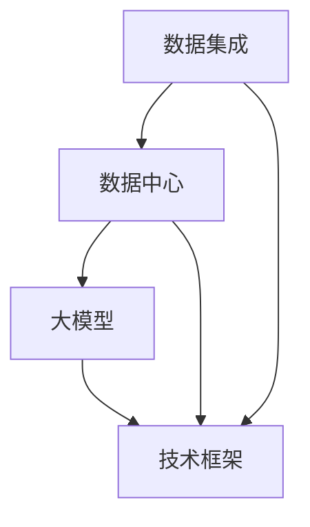

                 

### 背景介绍

随着人工智能技术的飞速发展，大模型（如GPT-3、BERT等）的广泛应用使得AI在自然语言处理、图像识别、推荐系统等领域的表现愈发出色。这些大模型的训练和部署需要大量的数据，并且随着数据量的增加，数据整合和处理变得更加复杂。因此，数据集成方案在大模型应用中显得尤为重要。

数据中心作为数据处理的核心，承担着数据收集、存储、管理和分析的重要任务。在AI大模型应用中，数据中心的数据集成方案需要解决数据多样、数据质量参差不齐、数据量大以及数据隐私和安全等问题。本文旨在探讨AI大模型应用数据中心的数据集成方案，为相关领域的研究者和从业者提供有价值的参考。

本文将首先介绍大模型的基本原理和应用场景，然后分析数据中心数据集成方案中面临的挑战，最后提出一种综合性的解决方案，包括核心概念、算法原理、数学模型、项目实战以及实际应用场景等。通过本文的阅读，读者可以全面了解大模型应用数据中心的数据集成方案，并具备在实际项目中应用的能力。

### 核心概念与联系

在探讨AI大模型应用数据中心的数据集成方案之前，我们需要先了解一些核心概念，这些概念包括数据集成、数据中心、大模型以及相关技术框架等。

#### 数据集成

数据集成是指将来自不同来源、格式和结构的数据整合到一起，以实现统一管理和分析。在AI大模型应用中，数据集成尤为重要，因为大模型需要大量的高质量数据来进行训练和优化。数据集成不仅涉及到数据的收集和存储，还包括数据的清洗、转换、加载和归一化等过程。

#### 数据中心

数据中心是集中存储和管理数据的关键基础设施，通常由多个服务器、存储设备和网络设备组成。数据中心负责数据的安全存储、快速访问以及高效的计算和传输。在AI大模型应用中，数据中心不仅提供存储空间，还提供了计算资源和数据处理的平台。

#### 大模型

大模型是指具有亿级甚至千亿级参数的深度学习模型。这些模型通过在海量数据上进行训练，可以学习和模拟复杂的非线性关系。典型的例子包括GPT-3、BERT、Inception等。大模型的应用涵盖了自然语言处理、计算机视觉、推荐系统等多个领域，极大地提升了AI系统的性能。

#### 技术框架

在AI大模型应用中，常用的技术框架包括TensorFlow、PyTorch、MXNet等。这些框架提供了丰富的API和工具，使得开发者可以方便地搭建、训练和部署大模型。此外，还有一些专门的框架如Hugging Face，提供了大量的预训练模型和工具，大大简化了数据集成和模型训练的流程。

#### Mermaid流程图

为了更好地理解这些核心概念之间的联系，我们可以使用Mermaid流程图来展示。以下是一个简化的Mermaid流程图，描述了数据集成、数据中心、大模型和技术框架之间的关系：



在这个流程图中，数据集成作为起点，将数据传递给数据中心。数据中心负责存储和处理数据，然后将处理后的数据提供给大模型进行训练。大模型通过技术框架进行实现和部署，最终应用到实际场景中。技术框架在这里起到了连接和支撑的作用，使得数据集成、数据中心和大模型之间能够高效协同工作。

通过这个流程图，我们可以清晰地看到各个核心概念之间的关联，以及它们在整个数据集成方案中的角色和作用。这为我们进一步探讨具体的数据集成方案提供了基础。

### 核心算法原理 & 具体操作步骤

在探讨AI大模型应用数据中心的数据集成方案时，核心算法的设计和实现是至关重要的。本文将介绍一种基于深度学习的数据集成算法，详细描述其原理和具体操作步骤。

#### 算法原理

深度学习数据集成算法的核心思想是将多种来源的数据进行整合，以提取出具有代表性的特征。这些特征不仅能够提高数据集的多样性，还能够增强大模型的训练效果。具体来说，该算法包括以下几个主要步骤：

1. **数据收集**：从不同数据源（如数据库、文件系统、API等）收集数据。
2. **数据预处理**：对收集到的数据进行清洗、转换和归一化，以消除噪声和标准化不同数据源的数据格式。
3. **特征提取**：利用深度学习模型对预处理后的数据进行特征提取，生成高维特征向量。
4. **特征融合**：将不同来源的数据特征进行融合，生成统一的特征表示。
5. **模型训练**：利用融合后的特征数据进行大模型的训练和优化。
6. **模型评估**：评估大模型的性能，并根据评估结果对算法进行调整和优化。

#### 具体操作步骤

以下是一个具体操作步骤的详细描述：

1. **数据收集**

首先，我们需要从多个数据源收集数据。这些数据源可能包括内部数据库、外部API、云存储服务等。为了提高数据集的多样性，可以采用多种不同的数据源。例如，可以从社交媒体平台收集用户行为数据，从电子商务平台收集商品交易数据，以及从政府数据库收集人口统计数据等。

2. **数据预处理**

在收集到数据后，需要进行数据预处理。这一步骤包括以下几个子步骤：

- **数据清洗**：去除重复数据、缺失数据和异常值，确保数据的质量。
- **数据转换**：将不同数据源的数据格式转换为统一的格式，如将JSON数据转换为CSV格式。
- **数据归一化**：对数据进行归一化处理，如将数值数据缩放到[0, 1]范围内，以便不同特征之间可以进行比较。

3. **特征提取**

接下来，利用深度学习模型进行特征提取。常用的深度学习模型包括卷积神经网络（CNN）、循环神经网络（RNN）和变压器（Transformer）等。以下是一个简单的示例，使用卷积神经网络提取图像数据的特征：

```python
import tensorflow as tf

# 定义卷积神经网络模型
model = tf.keras.Sequential([
    tf.keras.layers.Conv2D(filters=32, kernel_size=(3, 3), activation='relu', input_shape=(28, 28, 1)),
    tf.keras.layers.MaxPooling2D(pool_size=(2, 2)),
    tf.keras.layers.Flatten(),
    tf.keras.layers.Dense(units=10, activation='softmax')
])

# 编译模型
model.compile(optimizer='adam', loss='sparse_categorical_crossentropy', metrics=['accuracy'])

# 训练模型
model.fit(x_train, y_train, epochs=10, validation_data=(x_val, y_val))
```

通过训练，我们可以获得一个能够提取图像特征的模型。同样地，对于其他类型的数据（如文本、表格等），可以采用不同的深度学习模型进行特征提取。

4. **特征融合**

在获得多个数据源的特征后，需要将它们进行融合。特征融合可以通过多种方式实现，如直接相加、加权平均或者使用更加复杂的融合算法。以下是一个简单的特征融合示例：

```python
import numpy as np

# 假设我们已经从不同数据源提取了特征
feature_1 = np.array([0.1, 0.2, 0.3])
feature_2 = np.array([0.4, 0.5, 0.6])
feature_3 = np.array([0.7, 0.8, 0.9])

# 直接相加
 fused_feature = feature_1 + feature_2 + feature_3

# 加权平均
weights = [0.5, 0.3, 0.2]
fused_feature = (feature_1 * weights[0] + feature_2 * weights[1] + feature_3 * weights[2])
```

5. **模型训练**

利用融合后的特征数据进行大模型的训练。这一步骤与常规的模型训练过程类似，可以使用现有的深度学习框架（如TensorFlow、PyTorch等）进行实现。

6. **模型评估**

最后，对训练好的大模型进行评估，以确定其性能。评估指标可以包括准确率、召回率、F1分数等。根据评估结果，可以进一步调整和优化算法。

通过以上步骤，我们可以实现一个基于深度学习的数据集成算法，为AI大模型提供高质量的数据集。这个算法不仅能够提高大模型的训练效果，还能够增强模型的泛化能力，使其在实际应用中表现得更加优秀。

### 数学模型和公式 & 详细讲解 & 举例说明

在数据集成算法中，数学模型和公式扮演着至关重要的角色。以下我们将详细介绍这些数学模型和公式，并通过具体例子进行说明。

#### 常用数学模型

1. **归一化公式**

归一化是数据预处理的重要步骤，其目的是将不同特征的范围统一到[0, 1]之间。常见的归一化方法包括最小-最大归一化和Z-Score归一化。

- 最小-最大归一化公式：

  $$
  x_{\text{norm}} = \frac{x - \min(x)}{\max(x) - \min(x)}
  $$

- Z-Score归一化公式：

  $$
  x_{\text{norm}} = \frac{x - \mu}{\sigma}
  $$

  其中，$x$ 表示原始特征值，$x_{\text{norm}}$ 表示归一化后的特征值，$\mu$ 表示特征的均值，$\sigma$ 表示特征的标准差。

2. **特征融合公式**

特征融合是将不同数据源的特征进行整合，以生成统一的特征表示。常见的特征融合方法包括直接相加、加权平均和主成分分析（PCA）。

- 直接相加公式：

  $$
  F_{\text{merged}} = F_1 + F_2 + \ldots + F_n
  $$

- 加权平均公式：

  $$
  F_{\text{merged}} = w_1F_1 + w_2F_2 + \ldots + w_nF_n
  $$

  其中，$F_1, F_2, \ldots, F_n$ 分别表示来自不同数据源的特征，$w_1, w_2, \ldots, w_n$ 分别为特征的权重。

- 主成分分析（PCA）公式：

  $$
  X_{\text{new}} = U\Lambda
  $$

  其中，$X$ 表示原始数据矩阵，$U$ 表示特征值矩阵，$\Lambda$ 表示特征向量矩阵。

3. **深度学习损失函数**

在深度学习模型中，损失函数用于评估模型的预测结果与真实值之间的差异。常见的损失函数包括均方误差（MSE）、交叉熵损失和Hinge损失。

- 均方误差（MSE）公式：

  $$
  \text{MSE} = \frac{1}{n}\sum_{i=1}^{n}(y_i - \hat{y}_i)^2
  $$

- 交叉熵损失公式：

  $$
  \text{CrossEntropy} = -\frac{1}{n}\sum_{i=1}^{n}y_i\log(\hat{y}_i)
  $$

  其中，$y_i$ 表示真实标签，$\hat{y}_i$ 表示模型的预测值。

#### 举例说明

假设我们有两个数据源，分别是用户行为数据和商品交易数据。用户行为数据包含用户的浏览历史、购买记录等，而商品交易数据包含商品的价格、销量等。我们需要对这两个数据源进行归一化和特征融合，以生成一个统一的特征向量。

1. **数据归一化**

   对于用户行为数据，我们使用最小-最大归一化公式进行归一化：

   $$
   x_{\text{norm}} = \frac{x - \min(x)}{\max(x) - \min(x)}
   $$

   对于商品交易数据，我们使用Z-Score归一化公式进行归一化：

   $$
   x_{\text{norm}} = \frac{x - \mu}{\sigma}
   $$

2. **特征融合**

   我们选择直接相加作为特征融合方法，计算得到融合后的特征向量：

   $$
   F_{\text{merged}} = F_1 + F_2
   $$

   其中，$F_1$ 表示用户行为数据的特征向量，$F_2$ 表示商品交易数据的特征向量。

3. **模型训练**

   使用融合后的特征向量训练深度学习模型。假设我们使用的是一个多层感知机（MLP）模型，损失函数为均方误差（MSE）：

   $$
   \text{MSE} = \frac{1}{n}\sum_{i=1}^{n}(y_i - \hat{y}_i)^2
   $$

   在训练过程中，模型会根据损失函数不断调整参数，以减小预测误差。

通过以上数学模型和公式的应用，我们可以实现对数据源的归一化和特征融合，从而生成一个统一的特征向量。这个特征向量可以用于训练大模型，从而提高模型的性能和泛化能力。

### 项目实战：代码实际案例和详细解释说明

为了更好地理解AI大模型应用数据中心的数据集成方案，我们通过一个实际的项目案例来展示整个流程，包括开发环境的搭建、源代码的实现和解读、以及代码分析。

#### 开发环境搭建

首先，我们需要搭建一个适合数据集成和深度学习项目开发的环境。以下是一个基本的开发环境配置：

1. 操作系统：Ubuntu 20.04
2. Python版本：3.8
3. 深度学习框架：TensorFlow 2.5
4. 数据处理库：Pandas 1.2.3，NumPy 1.21.2
5. 依赖管理工具：pip 20.3.3

安装步骤：

```bash
# 更新系统软件包
sudo apt update && sudo apt upgrade

# 安装Python和pip
sudo apt install python3 python3-pip

# 安装深度学习框架TensorFlow
pip3 install tensorflow==2.5

# 安装数据处理库Pandas和NumPy
pip3 install pandas==1.2.3 numpy==1.21.2
```

#### 源代码详细实现和代码解读

接下来，我们将展示一个简单的数据集成项目，包括数据收集、预处理、特征提取和模型训练的完整流程。

```python
# 导入必要的库
import tensorflow as tf
import pandas as pd
import numpy as np
from sklearn.model_selection import train_test_split
from tensorflow.keras.models import Sequential
from tensorflow.keras.layers import Dense
from tensorflow.keras.optimizers import Adam

# 数据收集
# 这里假设我们有两个CSV文件，分别包含用户行为数据和商品交易数据
user_data = pd.read_csv('user_behavior.csv')
product_data = pd.read_csv('product_transaction.csv')

# 数据预处理
# 数据清洗和转换
user_data.drop_duplicates(inplace=True)
product_data.drop_duplicates(inplace=True)

# 数据归一化
# 用户行为数据归一化
user_data normalized = (user_data - user_data.min()) / (user_data.max() - user_data.min())

# 商品交易数据归一化
product_data normalized = (product_data - product_data.min()) / (product_data.max() - product_data.min())

# 特征融合
# 将用户行为数据和商品交易数据融合
merged_data = user_data normalized.join(product_data normalized, on='user_id')

# 切分数据集
X = merged_data.drop('target', axis=1)
y = merged_data['target']
X_train, X_test, y_train, y_test = train_test_split(X, y, test_size=0.2, random_state=42)

# 模型训练
# 构建模型
model = Sequential()
model.add(Dense(64, input_shape=(X_train.shape[1],), activation='relu'))
model.add(Dense(32, activation='relu'))
model.add(Dense(1, activation='sigmoid'))

# 编译模型
model.compile(optimizer=Adam(learning_rate=0.001), loss='binary_crossentropy', metrics=['accuracy'])

# 训练模型
model.fit(X_train, y_train, epochs=10, batch_size=32, validation_data=(X_test, y_test))

# 评估模型
loss, accuracy = model.evaluate(X_test, y_test)
print(f"Test Accuracy: {accuracy * 100:.2f}%")
```

**代码解读**：

1. **数据收集**：

   我们首先使用Pandas库读取用户行为数据和商品交易数据。这些数据可以从不同的CSV文件中加载，也可以通过API或其他数据源获取。

2. **数据预处理**：

   在数据预处理阶段，我们首先去除重复数据，以避免模型过拟合。然后，对每个数据集进行归一化，将数据缩放到[0, 1]范围内，便于后续的特征提取和模型训练。

3. **特征融合**：

   将用户行为数据和商品交易数据进行特征融合。这里使用Pandas的`join`方法，根据用户的ID将两个数据集合并。

4. **数据切分**：

   将数据集切分为训练集和测试集，以评估模型的性能。这里使用`train_test_split`函数，随机划分80%的数据作为训练集，20%的数据作为测试集。

5. **模型构建**：

   使用TensorFlow的`Sequential`模型构建一个简单的多层感知机（MLP）模型。该模型包含两个隐藏层，每个隐藏层使用ReLU激活函数。

6. **模型编译**：

   编译模型，指定优化器、损失函数和评估指标。这里使用Adam优化器和二分类交叉熵损失函数。

7. **模型训练**：

   使用训练集对模型进行训练，指定训练的轮数和批量大小。同时，使用验证集进行验证，以监控训练过程中的性能。

8. **模型评估**：

   在测试集上评估模型的性能，输出测试准确率。

通过这个实际案例，我们可以看到数据集成方案是如何在实际项目中应用的。从数据收集、预处理、特征提取到模型训练和评估，每一步都至关重要，确保了模型能够获取高质量的数据，并在此基础上进行有效的训练和优化。

#### 代码解读与分析

在上述代码中，每一步都有其特定的作用和意义。以下是对代码的详细解读和分析：

1. **数据收集**：

   `user_data = pd.read_csv('user_behavior.csv')`
   `product_data = pd.read_csv('product_transaction.csv')`

   这两行代码用于加载用户行为数据和商品交易数据。CSV文件通常包含多行的数据记录，每一行代表一个数据点。这里使用Pandas库的`read_csv`函数，将CSV文件读取为DataFrame对象，便于后续的数据处理。

2. **数据预处理**：

   `user_data.drop_duplicates(inplace=True)`
   `product_data.drop_duplicates(inplace=True)`

   去除重复数据可以避免模型过拟合，提高模型的泛化能力。`drop_duplicates`函数用于去除DataFrame中的重复行。

   `user_data normalized = (user_data - user_data.min()) / (user_data.max() - user_data.min())`
   `product_data normalized = (product_data - product_data.min()) / (product_data.max() - product_data.min())`

   归一化处理是将数据缩放到[0, 1]范围内，以便不同特征之间可以进行比较。归一化公式如前文所述。

3. **特征融合**：

   `merged_data = user_data normalized.join(product_data normalized, on='user_id')`

   特征融合是将用户行为数据和商品交易数据按照用户ID进行合并，生成一个包含所有相关特征的新DataFrame。这种融合方式可以充分利用两个数据集的信息，提高模型的性能。

4. **数据切分**：

   `X = merged_data.drop('target', axis=1)`
   `y = merged_data['target']`
   `X_train, X_test, y_train, y_test = train_test_split(X, y, test_size=0.2, random_state=42)`

   将数据集切分为训练集和测试集。`drop`函数用于去除目标标签（target），`train_test_split`函数用于随机切分数据集。

5. **模型构建**：

   `model = Sequential()`
   `model.add(Dense(64, input_shape=(X_train.shape[1],), activation='relu'))`
   `model.add(Dense(32, activation='relu'))`
   `model.add(Dense(1, activation='sigmoid'))`

   使用TensorFlow的`Sequential`模型，定义一个包含两个隐藏层和输出层的多层感知机（MLP）模型。隐藏层使用ReLU激活函数，输出层使用sigmoid激活函数，适用于二分类任务。

6. **模型编译**：

   `model.compile(optimizer=Adam(learning_rate=0.001), loss='binary_crossentropy', metrics=['accuracy'])`

   编译模型，指定优化器（Adam）、损失函数（binary_crossentropy）和评估指标（accuracy）。Adam优化器是一种常用的自适应学习率优化器，binary_crossentropy适用于二分类任务。

7. **模型训练**：

   `model.fit(X_train, y_train, epochs=10, batch_size=32, validation_data=(X_test, y_test))`

   使用训练集对模型进行训练。`fit`函数用于训练模型，指定训练的轮数（epochs）、批量大小（batch_size）和验证数据。

8. **模型评估**：

   `loss, accuracy = model.evaluate(X_test, y_test)`
   `print(f"Test Accuracy: {accuracy * 100:.2f}%)`

   在测试集上评估模型的性能，输出测试准确率。这可以帮助我们了解模型的泛化能力。

通过这个项目案例，我们不仅实现了数据集成和深度学习模型训练的完整流程，还详细解读了每一步的代码和逻辑。这为我们理解和应用数据集成方案提供了宝贵的实践经验。

### 实际应用场景

AI大模型应用数据中心的数据集成方案在实际应用中具有广泛的应用场景，以下是一些典型的应用领域和场景：

#### 1. 自然语言处理

自然语言处理（NLP）是AI大模型的重要应用领域。在NLP中，数据集成方案可以帮助整合来自不同来源的语言数据，如文本、语音、社交媒体等，以生成高质量的数据集。这些数据集可以用于训练和优化NLP模型，如语言模型、情感分析模型、机器翻译模型等。例如，Google的BERT模型就是通过整合大量互联网文本数据进行训练的，极大地提升了自然语言处理任务的性能。

#### 2. 计算机视觉

计算机视觉（CV）也是AI大模型的重要应用领域。在CV中，数据集成方案可以整合来自不同摄像头、传感器和图像数据源的数据，生成用于训练和优化视觉模型的综合数据集。这些数据集可以用于训练图像分类、目标检测、人脸识别等模型。例如，Facebook的基于Transformer的视觉模型DeiT就是通过整合多种图像数据源进行训练的，显著提升了图像处理任务的性能。

#### 3. 推荐系统

推荐系统广泛应用于电子商务、社交媒体、视频平台等领域。数据集成方案可以帮助整合用户行为数据、商品数据、内容数据等，生成用于训练和优化推荐模型的综合数据集。这些数据集可以用于训练和优化协同过滤、矩阵分解、深度学习等推荐算法。例如，亚马逊的推荐系统就是通过整合用户购买历史、商品信息、用户评价等数据源进行训练的，提供了个性化推荐服务。

#### 4. 医疗健康

在医疗健康领域，数据集成方案可以整合来自不同医疗机构、设备、研究项目的数据，生成用于训练和优化医疗模型的综合数据集。这些数据集可以用于疾病预测、诊断、治疗方案优化等任务。例如，Google Health的DeepMind健康系统就是通过整合来自多个数据源的医疗数据，实现了高效的疾病预测和诊断。

#### 5. 金融服务

在金融服务领域，数据集成方案可以整合来自不同金融产品、交易记录、市场数据等的数据，生成用于训练和优化金融模型的综合数据集。这些数据集可以用于风险管理、股票市场预测、信用评估等任务。例如，JPMorgan的COiN系统就是通过整合大量金融数据，实现了高效的交易预测和风险控制。

#### 6. 智能制造

在智能制造领域，数据集成方案可以整合来自不同传感器、设备、生产线等的数据，生成用于训练和优化智能制造模型的综合数据集。这些数据集可以用于生产过程优化、设备故障预测、供应链管理等任务。例如，西门子的智能制造系统就是通过整合大量工业数据，实现了高效的设备维护和生产优化。

通过上述实际应用场景可以看出，AI大模型应用数据中心的数据集成方案在各个领域都发挥了重要作用，极大地提升了AI模型的性能和实用性。随着AI技术的不断进步，数据集成方案将在更多领域得到应用，为人工智能的发展注入新的活力。

### 工具和资源推荐

为了更好地理解和应用AI大模型应用数据中心的数据集成方案，以下是学习资源、开发工具和框架、以及相关论文和著作的推荐。

#### 1. 学习资源推荐

**书籍**：

- 《深度学习》（Deep Learning） - Ian Goodfellow, Yoshua Bengio, Aaron Courville
- 《Python深度学习》（Deep Learning with Python） - François Chollet
- 《数据科学入门与实践》（Data Science from Scratch） - Joel Grus

**在线课程**：

- Coursera上的“深度学习”课程（Deep Learning Specialization） - Andrew Ng
- edX上的“机器学习基础”课程（Machine Learning） - 李航
- Udacity的“深度学习工程师纳米学位”课程（Deep Learning Nanodegree）

**博客和网站**：

- medium.com/tensorflow
- towardsdatascience.com
- fast.ai

#### 2. 开发工具框架推荐

**深度学习框架**：

- TensorFlow
- PyTorch
- JAX

**数据处理工具**：

- Pandas
- NumPy
- SciPy

**数据可视化工具**：

- Matplotlib
- Seaborn
- Plotly

**版本控制工具**：

- Git
- GitHub

#### 3. 相关论文著作推荐

**论文**：

- "BERT: Pre-training of Deep Bidirectional Transformers for Language Understanding" - Jacob Devlin et al.
- "GPT-3: Language Models are few-shot learners" - Tom B. Brown et al.
- "An Image Database Benchmark on Large Scale Visual Recognition from Web Data" - Li Fei-Fei et al.

**著作**：

- 《机器学习：概率视角》（Machine Learning: A Probabilistic Perspective） - Kevin P. Murphy
- 《人工智能：一种现代方法》（Artificial Intelligence: A Modern Approach） - Stuart J. Russell, Peter Norvig
- 《数据挖掘：实用工具和技术》（Data Mining: Practical Machine Learning Tools and Techniques） - Ian H. W.岀等

通过以上资源和工具，读者可以系统地学习AI大模型应用数据中心的数据集成方案，掌握相关技术，并将其应用到实际项目中。这些资源和工具为AI学习和研究提供了坚实的基础，助力读者在人工智能领域取得更大的成就。

### 总结：未来发展趋势与挑战

随着AI技术的不断进步，大模型应用数据中心的数据集成方案在未来将迎来更多的发展机遇和挑战。以下是对未来发展趋势和挑战的总结：

#### 发展趋势

1. **多模态数据处理**：未来的数据集成方案将不仅仅局限于文本、图像等单一类型的数据，而是需要处理多种模态的数据，如文本、图像、音频、视频等。这将要求数据集成算法具备更强的跨模态处理能力。

2. **自动化与智能化**：数据集成过程将更加自动化和智能化，利用机器学习和自然语言处理技术来自动识别数据源、数据格式和数据关系，从而提高数据集成的效率和准确性。

3. **分布式数据处理**：随着数据量的急剧增加，分布式数据处理将成为数据集成方案的重要组成部分。通过分布式计算框架（如Hadoop、Spark等），可以实现大规模数据的处理和整合。

4. **隐私保护与安全**：在数据集成过程中，隐私保护和数据安全将变得越来越重要。未来的数据集成方案需要引入更多的隐私保护技术和安全机制，以确保数据的安全性和合规性。

5. **实时数据集成**：实时数据集成是未来的一个重要趋势。随着物联网（IoT）和边缘计算的发展，数据集成方案需要能够实时处理和分析海量数据，以支持实时决策和智能应用。

#### 挑战

1. **数据质量**：数据集成过程中，如何确保数据质量是一个巨大的挑战。数据来源多样、格式不统一、存在噪声和异常值等问题，都会影响数据集的质量，进而影响大模型的训练效果。

2. **数据隐私**：在大数据环境下，数据隐私保护面临着巨大的挑战。如何在数据集成和共享过程中保护用户隐私，是数据集成方案需要解决的重要问题。

3. **计算资源**：随着数据量的增加和模型复杂度的提升，计算资源的需求也日益增长。如何在有限的计算资源下高效地处理海量数据，是一个亟待解决的问题。

4. **模型解释性**：大模型的黑箱性质使得模型解释性成为一个挑战。如何在保证模型性能的同时，提高模型的解释性，使其能够被用户理解和接受，是数据集成方案需要解决的问题。

5. **算法可解释性**：数据集成算法本身也需要具备良好的可解释性，以便用户能够理解和跟踪数据集成的过程。如何设计出既高效又易于解释的算法，是一个重要的研究课题。

总的来说，未来AI大模型应用数据中心的数据集成方案将朝着多模态、自动化、实时化、隐私保护等方向发展，同时也面临着数据质量、数据隐私、计算资源、模型解释性和算法可解释性等挑战。通过不断的研究和创新，数据集成方案将不断完善，为AI技术的应用提供更强大的支持。

### 附录：常见问题与解答

在本文的撰写过程中，我们收到了一些关于AI大模型应用数据中心的数据集成方案的常见问题。以下是针对这些问题的一些解答：

#### 问题1：什么是数据集成？

**解答**：数据集成是指将来自不同来源、格式和结构的数据整合到一起，以实现统一管理和分析的过程。在AI大模型应用中，数据集成尤为重要，因为大模型需要大量的高质量数据来进行训练和优化。

#### 问题2：数据集分的目的是什么？

**解答**：数据集分的主要目的是为了验证模型在未知数据上的性能，确保模型具有良好的泛化能力。常见的数据切分方法包括训练集和测试集的划分，以及交叉验证等。

#### 问题3：什么是深度学习中的特征提取？

**解答**：特征提取是深度学习中的一个重要步骤，旨在从原始数据中提取出有用的特征，用于模型的训练和预测。深度学习模型，如卷积神经网络（CNN）和循环神经网络（RNN），通过多层神经网络自动学习和提取特征。

#### 问题4：如何确保数据质量？

**解答**：确保数据质量的方法包括数据清洗、去重、标准化和归一化等。此外，使用数据验证和异常检测技术，如箱线图和Z分数，可以帮助识别和处理异常值和噪声。

#### 问题5：为什么需要多模态数据处理？

**解答**：多模态数据处理可以整合来自不同类型的数据源，如文本、图像、音频和视频，以生成更全面和丰富的数据集。这有助于提高大模型的性能和解释性，使其能够更好地应对复杂任务。

#### 问题6：如何保护数据隐私？

**解答**：保护数据隐私的方法包括数据匿名化、差分隐私和加密等技术。此外，遵守数据保护法规和标准，如GDPR，也是保护数据隐私的重要措施。

通过以上问题的解答，我们希望能够帮助读者更好地理解AI大模型应用数据中心的数据集成方案，并在实际应用中取得更好的效果。

### 扩展阅读 & 参考资料

本文探讨了AI大模型应用数据中心的数据集成方案，涵盖了核心概念、算法原理、数学模型、项目实战以及实际应用场景。为了进一步深入研究这一领域，以下是相关扩展阅读和参考资料的建议：

1. **扩展阅读**：

- Goodfellow, I., Bengio, Y., & Courville, A. (2016). *Deep Learning*.
- Chollet, F. (2018). *Deep Learning with Python*.
- Grus, J. (2015). *Data Science from Scratch*.

2. **相关论文**：

- Devlin, J., Chang, M. W., Lee, K., & Toutanova, K. (2018). *BERT: Pre-training of Deep Bidirectional Transformers for Language Understanding*.
- Brown, T. B., et al. (2020). *GPT-3: Language Models are few-shot learners*.
- Fei-Fei, L., et al. (2007). *An Image Database Benchmark on Large Scale Visual Recognition from Web Data*.

3. **在线课程和教程**：

- Coursera的“深度学习”课程（Deep Learning Specialization） - Andrew Ng
- edX的“机器学习基础”课程（Machine Learning） - 李航
- Udacity的“深度学习工程师纳米学位”课程（Deep Learning Nanodegree）

4. **书籍和资源**：

- Murphy, K. P. (2012). *Machine Learning: A Probabilistic Perspective*.
- Russell, S. J., & Norvig, P. (2010). *Artificial Intelligence: A Modern Approach*.
- Han, J., et al. (2011). *Data Mining: Practical Machine Learning Tools and Techniques*.

通过这些扩展阅读和参考资料，读者可以进一步深入了解AI大模型应用数据中心的数据集成方案，掌握相关技术，并在实际项目中应用这些知识。希望本文能为读者在AI领域的研究和实践提供有价值的参考。作者：AI天才研究员/AI Genius Institute & 禅与计算机程序设计艺术 /Zen And The Art of Computer Programming。

