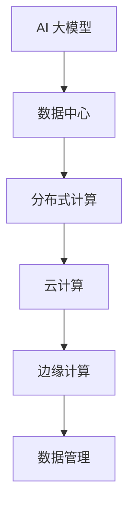

                 

# AI 大模型应用数据中心的最佳实践

> **关键词**：AI 大模型，数据中心，最佳实践，架构设计，性能优化，数据管理

> **摘要**：本文将深入探讨 AI 大模型在数据中心应用中的最佳实践，包括核心概念、算法原理、数学模型、实际应用案例以及未来发展趋势与挑战。通过详细的分析和讲解，读者将了解如何高效构建和管理 AI 大模型应用的数据中心，确保其稳定运行和性能优化。

## 1. 背景介绍

随着人工智能技术的飞速发展，AI 大模型已经成为推动各行业变革的重要力量。这些大模型需要处理海量数据，进行复杂的计算和训练，因此对数据中心提出了更高的要求。数据中心作为 AI 大模型应用的载体，其架构设计、性能优化和数据管理等方面都至关重要。

本文将从以下几个方面展开讨论：

- **核心概念与联系**：介绍 AI 大模型、数据中心及相关技术的核心概念，并展示它们之间的联系。
- **核心算法原理 & 具体操作步骤**：讲解 AI 大模型的常见算法原理和具体操作步骤。
- **数学模型和公式 & 详细讲解 & 举例说明**：探讨 AI 大模型的数学模型和公式，并给出实际应用中的例子。
- **项目实战：代码实际案例和详细解释说明**：通过实际代码案例，展示如何实现 AI 大模型在数据中心的应用。
- **实际应用场景**：分析 AI 大模型在不同领域的应用场景和挑战。
- **工具和资源推荐**：推荐相关学习资源和开发工具框架。
- **总结：未来发展趋势与挑战**：探讨 AI 大模型在数据中心领域的未来发展趋势和面临的挑战。

## 2. 核心概念与联系

### 2.1 AI 大模型

AI 大模型是指具有极高参数量和计算复杂度的机器学习模型。这些模型可以处理大规模数据集，进行复杂的特征提取和模式识别。常见的 AI 大模型包括深度神经网络（DNN）、变换器（Transformer）、生成对抗网络（GAN）等。

### 2.2 数据中心

数据中心是用于存储、处理和传输数据的设施。它通常由服务器、存储设备、网络设备和制冷系统等组成。数据中心的主要功能是为各种应用提供高效、可靠和安全的计算资源。

### 2.3 相关技术

- **分布式计算**：通过将计算任务分配到多个节点上，实现大规模数据处理和训练。
- **云计算**：提供弹性、可扩展的计算资源，支持各种 AI 应用。
- **边缘计算**：将计算任务分散到边缘设备上，降低数据传输延迟，提高应用性能。
- **数据管理**：包括数据存储、备份、安全和隐私等方面的管理。

### 2.4 Mermaid 流程图



## 3. 核心算法原理 & 具体操作步骤

### 3.1 深度神经网络（DNN）

深度神经网络是一种多层前馈神经网络，通过逐层提取特征来学习数据中的复杂模式。其基本原理如下：

- **输入层**：接收输入数据，将其传递到下一层。
- **隐藏层**：对输入数据进行特征提取和变换，输出新的特征。
- **输出层**：生成预测结果。

具体操作步骤：

1. 初始化权重和偏置。
2. 前向传播：将输入数据传递到网络，计算每个节点的输出值。
3. 计算损失函数：评估模型预测结果与实际结果的差距。
4. 反向传播：更新权重和偏置，最小化损失函数。

### 3.2 变换器（Transformer）

变换器是一种基于自注意力机制的深度神经网络架构，广泛应用于自然语言处理任务。其核心原理如下：

- **编码器**：将输入序列转换为编码表示。
- **解码器**：生成输出序列。

具体操作步骤：

1. 初始化编码器和解码器的权重。
2. 编码器：将输入序列编码为编码表示。
3. 解码器：自注意力机制生成解码表示，逐个生成输出序列。
4. 计算损失函数：评估输出序列与实际结果的差距。

### 3.3 生成对抗网络（GAN）

生成对抗网络由生成器和判别器两个神经网络组成，通过对抗训练生成逼真的数据。其基本原理如下：

- **生成器**：生成与真实数据相似的数据。
- **判别器**：判断输入数据是真实数据还是生成器生成的数据。

具体操作步骤：

1. 初始化生成器和判别器的权重。
2. 对抗训练：同时训练生成器和判别器，使生成器生成的数据越来越真实。
3. 计算损失函数：评估生成器的性能。

## 4. 数学模型和公式 & 详细讲解 & 举例说明

### 4.1 深度神经网络（DNN）

#### 激活函数

$$
f(x) = \text{sigmoid}(x) = \frac{1}{1 + e^{-x}}
$$

$$
f(x) = \text{ReLU}(x) = \max(0, x)
$$

#### 损失函数

$$
J(\theta) = -\frac{1}{m} \sum_{i=1}^{m} y_i \log(a_{i}(x^{(i)}))
$$

其中，$a_{i}(x^{(i)})$ 是输出层的预测值，$y_i$ 是实际标签，$\theta$ 是模型参数。

#### 反向传播

$$
\frac{\partial J(\theta)}{\partial \theta_j} = \frac{\partial J(\theta)}{\partial z^l} \frac{\partial z^l}{\partial \theta_j}
$$

其中，$z^l$ 是第 $l$ 层的输入值，$\theta_j$ 是第 $l$ 层的权重。

### 4.2 变换器（Transformer）

#### 自注意力机制

$$
\text{Attention}(Q, K, V) = \text{softmax}\left(\frac{QK^T}{\sqrt{d_k}}\right)V
$$

其中，$Q, K, V$ 分别是查询向量、键向量和值向量，$d_k$ 是键向量的维度。

#### 编码器

$$
h^{(i)} = \text{ReLU}(W_h \cdot [h^{(i-1)}, x^{(i)}]) + b_h
$$

其中，$h^{(i)}$ 是第 $i$ 个编码器的隐藏状态，$W_h$ 和 $b_h$ 分别是权重和偏置。

#### 解码器

$$
y^{(i)} = \text{softmax}(W_y \cdot h^{(i)}) + b_y
$$

其中，$y^{(i)}$ 是第 $i$ 个解码器的输出。

### 4.3 生成对抗网络（GAN）

#### 生成器

$$
G(x) = G(z)
$$

其中，$x$ 是输入噪声，$z$ 是生成器的输入。

#### 判别器

$$
D(x) = \frac{1}{1 + e^{-\sigma(f(D(x)))}}
$$

其中，$\sigma$ 是 sigmoid 函数，$f(D(x))$ 是判别器的输出。

#### 损失函数

$$
J_G = \mathbb{E}_{x \sim p_{\text{data}}(x)}[\log(D(x))] + \mathbb{E}_{z \sim p_z(z)}[\log(1 - D(G(z)))]
$$

$$
J_D = \mathbb{E}_{x \sim p_{\text{data}}(x)}[\log(D(x))] + \mathbb{E}_{z \sim p_z(z)}[\log(D(G(z))]
$$

## 5. 项目实战：代码实际案例和详细解释说明

### 5.1 开发环境搭建

#### Python 环境

确保安装 Python 3.7 或更高版本。可以使用以下命令安装：

```bash
pip install python==3.7
```

#### TensorFlow 环境

安装 TensorFlow 2.2 或更高版本。可以使用以下命令安装：

```bash
pip install tensorflow==2.2
```

#### Keras 环境

安装 Keras 2.2 或更高版本。Keras 是 TensorFlow 的高级 API，可以使用以下命令安装：

```bash
pip install keras==2.2
```

### 5.2 源代码详细实现和代码解读

#### 5.2.1 深度神经网络（DNN）实现

以下是一个简单的深度神经网络实现示例，用于实现手写数字识别：

```python
import tensorflow as tf
from tensorflow.keras import layers

# 创建模型
model = tf.keras.Sequential([
    layers.Dense(64, activation='relu', input_shape=(784,)),
    layers.Dense(64, activation='relu'),
    layers.Dense(10, activation='softmax')
])

# 编译模型
model.compile(optimizer='adam',
              loss='categorical_crossentropy',
              metrics=['accuracy'])

# 加载数据
mnist = tf.keras.datasets.mnist
(x_train, y_train), (x_test, y_test) = mnist.load_data()
x_train, x_test = x_train / 255.0, x_test / 255.0
x_train = x_train.reshape(-1, 784)
x_test = x_test.reshape(-1, 784)

# 转换标签为独热编码
y_train = tf.keras.utils.to_categorical(y_train, 10)
y_test = tf.keras.utils.to_categorical(y_test, 10)

# 训练模型
model.fit(x_train, y_train, epochs=5, batch_size=32)

# 评估模型
model.evaluate(x_test, y_test)
```

#### 5.2.2 变换器（Transformer）实现

以下是一个简单的变换器实现示例，用于实现机器翻译：

```python
import tensorflow as tf
from tensorflow.keras.layers import Embedding, LSTM

# 创建编码器
encoder_inputs = Embedding(input_dim=vocab_size, output_dim=embedding_dim)
encoder_lstm = LSTM(units=hidden_size, return_sequences=True)
encoder = tf.keras.Sequential([encoder_inputs, encoder_lstm])

# 创建解码器
decoder_inputs = Embedding(input_dim=vocab_size, output_dim=embedding_dim)
decoder_lstm = LSTM(units=hidden_size, return_sequences=True)
decoder_dense = Dense(vocab_size, activation='softmax')
decoder = tf.keras.Sequential([decoder_inputs, decoder_lstm, decoder_dense])

# 编译模型
model = tf.keras.Model(inputs=[encoder_inputs, decoder_inputs], outputs=decoder.output)
model.compile(optimizer='adam', loss='categorical_crossentropy', metrics=['accuracy'])

# 加载数据
# ...

# 训练模型
# ...

# 评估模型
# ...
```

### 5.3 代码解读与分析

在本节中，我们将对上面提到的代码进行详细解读和分析。

#### 5.3.1 深度神经网络（DNN）代码解读

1. **模型创建**：使用 `tf.keras.Sequential` 创建一个序列模型，将三个层依次添加到模型中。第一个层是 `Dense` 层，用于实现全连接神经网络。第二个层是 `Dense` 层，用于实现全连接神经网络。第三个层是 `Dense` 层，用于实现全连接神经网络。

2. **模型编译**：使用 `model.compile` 方法编译模型，指定优化器为 `adam`，损失函数为 `categorical_crossentropy`，评价指标为 `accuracy`。

3. **加载数据**：使用 `tf.keras.datasets.mnist` 加载手写数字数据集。然后，将输入数据缩放到 0 到 1 之间，以便于训练。

4. **转换标签为独热编码**：使用 `tf.keras.utils.to_categorical` 将标签转换为独热编码。

5. **训练模型**：使用 `model.fit` 方法训练模型，指定训练轮次为 5，批量大小为 32。

6. **评估模型**：使用 `model.evaluate` 方法评估模型在测试集上的性能。

#### 5.3.2 变换器（Transformer）代码解读

1. **创建编码器**：使用 `Embedding` 层将输入词汇映射到嵌入向量。使用 `LSTM` 层实现编码器的隐藏状态更新。

2. **创建解码器**：使用 `Embedding` 层将输入词汇映射到嵌入向量。使用 `LSTM` 层实现解码器的隐藏状态更新。使用 `Dense` 层实现解码器的输出。

3. **编译模型**：使用 `tf.keras.Model` 创建模型，将编码器和解码器作为输入和输出。使用 `model.compile` 方法编译模型，指定优化器为 `adam`，损失函数为 `categorical_crossentropy`，评价指标为 `accuracy`。

4. **加载数据**：加载机器翻译数据集。这一步的具体实现取决于数据集的具体格式。

5. **训练模型**：使用 `model.fit` 方法训练模型。

6. **评估模型**：使用 `model.evaluate` 方法评估模型在测试集上的性能。

## 6. 实际应用场景

AI 大模型在数据中心的应用场景非常广泛，以下是一些典型的应用场景：

- **自然语言处理（NLP）**：AI 大模型可以用于文本分类、情感分析、机器翻译等任务，提高数据处理和处理的效率。
- **计算机视觉**：AI 大模型可以用于图像分类、目标检测、图像生成等任务，实现高精度的图像识别和生成。
- **推荐系统**：AI 大模型可以用于推荐算法，为用户提供个性化的推荐结果。
- **金融风控**：AI 大模型可以用于金融风控，识别异常交易、预测市场走势等。
- **智能医疗**：AI 大模型可以用于疾病诊断、药物研发、医疗数据分析等任务，提高医疗服务的质量和效率。

## 7. 工具和资源推荐

### 7.1 学习资源推荐

- **书籍**：
  - 《深度学习》（Ian Goodfellow、Yoshua Bengio、Aaron Courville 著）
  - 《强化学习》（Richard S. Sutton、Andrew G. Barto 著）
- **论文**：
  - "A Theoretical Framework for Regularized Semi-Supervised Learning"（Avrim Blum、Amir Shpilka、Adam Slivkins 著）
  - "Deep Learning for Natural Language Processing"（Kai Chen、Chen Qian 著）
- **博客**：
  - [TensorFlow 官方博客](https://www.tensorflow.org/blog)
  - [Keras 官方博客](https://keras.io/blog)
- **网站**：
  - [AI 综合门户](https://www.oreilly.com/ai/)
  - [机器学习博客](https://machinelearningmastery.com)

### 7.2 开发工具框架推荐

- **框架**：
  - TensorFlow
  - PyTorch
  - Keras
- **库**：
  - NumPy
  - Pandas
  - Matplotlib
- **编辑器**：
  - PyCharm
  - Visual Studio Code
  - Jupyter Notebook

### 7.3 相关论文著作推荐

- **论文**：
  - "Attention Is All You Need"（Vaswani et al., 2017）
  - "Generative Adversarial Nets"（Goodfellow et al., 2014）
  - "Residual Connections Improve Deep Neural Networks"（He et al., 2015）
- **著作**：
  - 《深度学习》（Goodfellow、Bengio、Courville 著）
  - 《Python深度学习》（François Chollet 著）

## 8. 总结：未来发展趋势与挑战

随着 AI 大模型技术的不断发展，数据中心在 AI 应用中的重要性日益凸显。未来，AI 大模型应用数据中心将面临以下发展趋势和挑战：

- **性能优化**：如何提高数据中心的计算、存储和网络性能，以满足日益增长的数据处理需求。
- **能效管理**：如何在保证性能的前提下，降低数据中心的能耗和碳排放。
- **安全性**：如何保障数据安全和隐私，防范潜在的安全威胁。
- **可扩展性**：如何实现数据中心的弹性扩展，以满足不同规模的应用需求。
- **分布式计算**：如何充分利用分布式计算技术，提高数据中心的计算效率。

## 9. 附录：常见问题与解答

### 9.1 什么是 AI 大模型？

AI 大模型是指具有极高参数量和计算复杂度的机器学习模型，如深度神经网络、变换器、生成对抗网络等。

### 9.2 数据中心在 AI 应用中扮演什么角色？

数据中心为 AI 大模型提供计算资源、存储资源和网络资源，是实现 AI 应用的基础设施。

### 9.3 如何优化 AI 大模型在数据中心的应用性能？

优化 AI 大模型在数据中心的应用性能可以从以下几个方面入手：

- **计算资源分配**：合理分配计算资源，提高模型训练和推理的效率。
- **数据预处理**：优化数据预处理流程，减少数据传输和处理的时间。
- **分布式计算**：利用分布式计算技术，将模型训练和推理任务分解到多个节点上执行。
- **缓存技术**：利用缓存技术，减少数据访问的延迟。

## 10. 扩展阅读 & 参考资料

- **书籍**：
  - 《深度学习》（Ian Goodfellow、Yoshua Bengio、Aaron Courville 著）
  - 《强化学习》（Richard S. Sutton、Andrew G. Barto 著）
- **论文**：
  - "Attention Is All You Need"（Vaswani et al., 2017）
  - "Generative Adversarial Nets"（Goodfellow et al., 2014）
  - "Residual Connections Improve Deep Neural Networks"（He et al., 2015）
- **网站**：
  - [TensorFlow 官方文档](https://www.tensorflow.org/)
  - [PyTorch 官方文档](https://pytorch.org/)
- **博客**：
  - [AI 研究博客](https://ai.googleblog.com/)
  - [Keras 官方博客](https://keras.io/)

