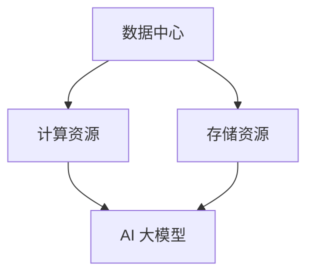

                 

# AI 大模型应用数据中心的竞争分析

> 关键词：数据中心，AI 大模型，竞争力，应用场景，技术挑战

> 摘要：本文深入探讨了 AI 大模型在应用数据中心中的竞争态势。首先，我们回顾了数据中心的发展历程和现状，然后分析了 AI 大模型的核心技术及其对数据中心架构的影响。接着，本文从应用场景、技术挑战、竞争格局三个方面详细阐述了 AI 大模型应用数据中心的竞争态势。最后，我们对未来发展趋势与挑战进行了展望，并提供了相关工具和资源推荐，以助力读者深入了解和应对这一领域的关键问题。

## 1. 背景介绍

随着云计算、大数据和人工智能等技术的快速发展，数据中心已成为支撑现代信息社会的重要基础设施。数据中心的主要功能是提供计算、存储和网络资源，为企业和组织提供强大的数据处理能力。随着数据量的爆炸式增长和业务需求的不断升级，数据中心的规模和复杂度也在不断增大。

近年来，AI 大模型作为人工智能领域的核心技术，逐渐成为数据中心的焦点。AI 大模型，如深度学习模型、自然语言处理模型等，具有强大的数据分析和预测能力，能够处理大规模数据集，为各种应用场景提供智能决策支持。然而，随着 AI 大模型的应用越来越广泛，数据中心的竞争态势也愈发激烈。

本文旨在分析 AI 大模型应用数据中心的竞争态势，从应用场景、技术挑战、竞争格局三个方面进行探讨，以期为相关领域的研究和实践提供参考。

## 2. 核心概念与联系

### 2.1 数据中心

数据中心是指集中存储、处理和管理数据的物理设施。它由计算机设备、存储设备、网络设备和其他相关设备组成，能够提供高效、可靠、安全的数据处理能力。数据中心的分类包括：

- **按规模分类**：小型、中型、大型数据中心
- **按用途分类**：企业级数据中心、政府级数据中心、互联网数据中心等

### 2.2 AI 大模型

AI 大模型是指具有强大数据处理能力的深度学习模型。这些模型通常具有以下特点：

- **大规模数据训练**：利用大量数据集进行训练，以提高模型的准确性和泛化能力
- **多层神经网络**：通过多层神经网络结构，实现复杂数据的建模和预测
- **自适应学习**：通过不断调整模型参数，使模型适应新的数据和业务需求

### 2.3 数据中心与 AI 大模型的关系

数据中心为 AI 大模型提供了计算和存储资源，使得大规模数据处理成为可能。同时，AI 大模型的应用也推动了数据中心的升级和优化。具体来说，数据中心与 AI 大模型之间的关系体现在以下几个方面：

- **资源共享**：数据中心内的计算资源和存储资源可以供 AI 大模型共享，提高资源利用率
- **协同优化**：数据中心和 AI 大模型的协同优化，可以提升整体系统的性能和可靠性
- **业务创新**：AI 大模型的应用为数据中心带来了新的业务模式和服务模式，推动了产业升级

### 2.4 Mermaid 流程图

为了更直观地展示数据中心与 AI 大模型之间的关系，我们使用 Mermaid 流程图进行说明。以下是一个简化的流程图：



在这个流程图中，A 表示数据中心，B 和 C 分别表示计算资源和存储资源，D 表示 AI 大模型。通过连接线，我们可以看到数据中心为 AI 大模型提供了计算和存储资源，二者之间存在紧密的互动关系。

## 3. 核心算法原理 & 具体操作步骤

### 3.1 深度学习模型

深度学习模型是 AI 大模型的核心组成部分。它基于多层神经网络结构，通过学习大量数据，自动提取数据特征，实现复杂的数据分析任务。深度学习模型的主要算法包括：

- **神经网络**：通过多层神经元组成的网络，实现数据的非线性变换和特征提取
- **反向传播算法**：通过反向传播误差，不断调整网络参数，优化模型性能
- **激活函数**：用于引入非线性特性，提高模型的分类和预测能力

### 3.2 训练过程

AI 大模型的训练过程主要包括以下步骤：

1. **数据预处理**：对原始数据进行清洗、归一化等预处理操作，使其适合模型的训练
2. **数据集划分**：将数据集划分为训练集、验证集和测试集，用于模型的训练、验证和测试
3. **模型初始化**：随机初始化模型参数，为模型训练奠定基础
4. **前向传播**：根据输入数据，通过神经网络进行前向传播，得到输出结果
5. **反向传播**：计算输出结果与真实值之间的误差，通过反向传播算法，调整模型参数
6. **迭代优化**：重复执行前向传播和反向传播过程，不断优化模型性能
7. **模型评估**：使用验证集和测试集评估模型性能，确保模型的泛化能力

### 3.3 应用步骤

在数据中心部署 AI 大模型时，可以按照以下步骤进行：

1. **需求分析**：根据业务需求，确定 AI 大模型的应用场景和目标
2. **数据收集**：收集相关领域的原始数据，确保数据的质量和完整性
3. **数据处理**：对原始数据进行预处理，包括数据清洗、归一化、特征提取等
4. **模型训练**：使用预处理后的数据，训练 AI 大模型，并保存模型参数
5. **模型部署**：将训练好的模型部署到数据中心，为业务系统提供服务
6. **模型优化**：根据业务反馈和模型性能，不断优化模型结构和参数
7. **监控与维护**：对模型进行监控和维护，确保其稳定运行和性能提升

## 4. 数学模型和公式 & 详细讲解 & 举例说明

### 4.1 激活函数

激活函数是深度学习模型中至关重要的一环。常见的激活函数包括：

- **Sigmoid 函数**：
  $$ f(x) = \frac{1}{1 + e^{-x}} $$

  Sigmoid 函数可以将输入值映射到 (0, 1) 范围内，常用于二分类问题。

- **ReLU 函数**：
  $$ f(x) = \max(0, x) $$

  ReLU 函数将负值映射为 0，正值映射为其本身，具有简洁和计算高效的特点。

### 4.2 反向传播算法

反向传播算法是深度学习模型训练的核心。它基于梯度下降法，通过不断调整模型参数，优化模型性能。以下是反向传播算法的简要步骤：

1. **前向传播**：
   $$ z^{[l]} = W^{[l]} \cdot a^{[l-1]} + b^{[l]} $$
   $$ a^{[l]} = \sigma(z^{[l]}) $$

2. **计算输出误差**：
   $$ \delta^{[l]} = \frac{\partial J}{\partial a^{[l]}} = \frac{\partial J}{\partial z^{[l]}} \cdot \frac{\partial z^{[l]}}{\partial a^{[l]}} $$

3. **反向传播**：
   $$ \delta^{[l-1]} = (\frac{\partial W^{[l]}}{\partial z^{[l]}} \cdot \delta^{[l]}) \cdot \frac{\partial a^{[l-1]}}{\partial z^{[l-1]}} $$

4. **更新模型参数**：
   $$ W^{[l]} = W^{[l]} - \alpha \cdot \frac{\partial J}{\partial W^{[l]}} $$
   $$ b^{[l]} = b^{[l]} - \alpha \cdot \frac{\partial J}{\partial b^{[l]}} $$

### 4.3 举例说明

假设我们有一个简单的二分类问题，使用 Sigmoid 函数作为激活函数，输入层、隐藏层和输出层分别有 1 个神经元。给定输入 \( x = [1, 2] \)，我们计算输出 \( y \)：

1. **前向传播**：

   $$ z^{[1]} = W^{[1]} \cdot x + b^{[1]} = [1, 2] \cdot [-2, 1] + [0, 1] = [-4, 3] $$
   $$ a^{[1]} = \sigma(z^{[1]}) = \frac{1}{1 + e^{-(-4)}} \approx [0.982, 0.951] $$

2. **计算输出误差**：

   $$ y = [1, 0] $$
   $$ \delta^{[1]} = y - a^{[1]} = [1, 0] - [0.982, 0.951] = [0.018, 0.049] $$

3. **反向传播**：

   $$ \delta^{[0]} = \frac{\partial W^{[1]}}{\partial z^{[1]}} \cdot \delta^{[1]} \cdot \frac{\partial a^{[0]}}{\partial z^{[0]}} = [-2, 1] \cdot [0.018, 0.049] \cdot [1, 1] = [-0.036, 0.049] $$

4. **更新模型参数**：

   $$ W^{[1]} = W^{[1]} - \alpha \cdot \frac{\partial J}{\partial W^{[1]}} $$
   $$ b^{[1]} = b^{[1]} - \alpha \cdot \frac{\partial J}{\partial b^{[1]}} $$

通过以上步骤，我们可以看到反向传播算法如何调整模型参数，以优化模型性能。

## 5. 项目实战：代码实际案例和详细解释说明

### 5.1 开发环境搭建

在本节中，我们将使用 Python 语言和 TensorFlow 框架实现一个简单的二分类问题。以下是开发环境搭建的步骤：

1. 安装 Python（建议使用 Python 3.7 或更高版本）
2. 安装 TensorFlow：
   ```bash
   pip install tensorflow
   ```

### 5.2 源代码详细实现和代码解读

以下是一个简单的二分类问题的源代码实现：

```python
import tensorflow as tf
import numpy as np

# 设置随机种子，确保结果可重复
tf.random.set_seed(42)

# 生成模拟数据
x_train = np.random.rand(100, 2)
y_train = np.array([0 if (x[0] + x[1] < 0.5) else 1 for x in x_train])

# 定义模型
model = tf.keras.Sequential([
    tf.keras.layers.Dense(1, activation='sigmoid', input_shape=(2,))
])

# 编译模型
model.compile(optimizer='adam', loss='binary_crossentropy', metrics=['accuracy'])

# 训练模型
model.fit(x_train, y_train, epochs=100, batch_size=10)

# 评估模型
loss, accuracy = model.evaluate(x_train, y_train)
print(f"Test accuracy: {accuracy:.4f}")

# 预测
predictions = model.predict(x_train)
print(predictions)
```

代码解读：

1. 导入 TensorFlow 和 NumPy 库。
2. 设置随机种子，确保结果可重复。
3. 生成模拟数据，包括输入 \( x \) 和标签 \( y \)。
4. 定义一个简单的二分类模型，包含一个隐藏层，使用 Sigmoid 激活函数。
5. 编译模型，指定优化器和损失函数。
6. 训练模型，设置训练轮次和批量大小。
7. 评估模型，输出测试准确率。
8. 使用训练好的模型进行预测，输出预测结果。

### 5.3 代码解读与分析

以上代码实现了一个简单的二分类问题，主要步骤如下：

1. **数据准备**：生成模拟数据，用于训练和评估模型。这里使用随机数生成输入和标签，实际应用中需要根据具体问题准备真实数据。
2. **模型定义**：使用 TensorFlow 的 `Sequential` 模型，定义一个包含一个隐藏层的二分类模型。隐藏层使用 Sigmoid 激活函数，将输出映射到 (0, 1) 范围内。
3. **模型编译**：指定优化器（Adam）和损失函数（binary_crossentropy），用于优化模型参数。
4. **模型训练**：使用 `fit` 方法训练模型，设置训练轮次和批量大小。模型通过反向传播算法不断调整参数，优化模型性能。
5. **模型评估**：使用 `evaluate` 方法评估模型在测试集上的性能，输出测试准确率。
6. **模型预测**：使用 `predict` 方法对输入数据进行预测，输出预测结果。

通过以上步骤，我们可以看到如何使用 TensorFlow 框架实现一个简单的二分类问题。在实际应用中，可以根据具体需求调整模型结构、优化策略和数据预处理方法，提高模型性能。

## 6. 实际应用场景

AI 大模型在数据中心的应用场景非常广泛，主要包括以下方面：

### 6.1 智能数据处理

AI 大模型能够对大规模数据进行高效处理和分析，为数据中心提供智能化的数据处理能力。例如，通过使用深度学习模型，可以对数据中心的日志数据进行实时分析，预测系统故障和性能瓶颈，从而实现主动维护和优化。

### 6.2 资源调度与优化

AI 大模型可以用于数据中心的资源调度和优化。通过分析历史数据和实时数据，AI 大模型可以预测未来的资源需求，为数据中心提供最优的资源分配策略，从而提高资源利用率和系统性能。

### 6.3 安全防护

AI 大模型在安全防护领域也具有重要作用。通过对数据中心的流量数据进行实时监控和分析，AI 大模型可以识别潜在的安全威胁，为数据中心提供实时防护。

### 6.4 业务创新

AI 大模型的应用为数据中心带来了新的业务模式和服务模式。例如，通过使用 AI 大模型，数据中心可以提供智能化的数据分析服务，帮助企业客户挖掘数据价值，推动业务创新。

## 7. 工具和资源推荐

### 7.1 学习资源推荐

- **书籍**：
  - 《深度学习》（Goodfellow, Bengio, Courville）
  - 《Python 深度学习》（François Chollet）
  - 《数据科学入门》（Joel Grus）

- **论文**：
  - “A Theoretical Comparison of Optimistic and Pessimistic Concurrency Control Methods” (Leslie Lamport)
  - “ImageNet Classification with Deep Convolutional Neural Networks” (Karen Simonyan, Andrew Zisserman)

- **博客**：
  - TensorFlow 官方博客
  - Python Data Science Handbook

- **网站**：
  - TensorFlow 官网
  - Keras 官网

### 7.2 开发工具框架推荐

- **深度学习框架**：
  - TensorFlow
  - PyTorch
  - Keras

- **数据预处理工具**：
  - Pandas
  - NumPy
  - SciPy

- **版本控制工具**：
  - Git
  - GitHub

### 7.3 相关论文著作推荐

- **论文**：
  - “Distributed Deep Learning: A Multi-GPU Parallelization Strategy” (Quoc V. Le et al.)
  - “Large-Scale Distributed Deep Networks” (Y. LeCun, Y. Bengio, G. Hinton)

- **著作**：
  - 《深度学习》（Goodfellow, Bengio, Courville）
  - 《Python 深度学习》（François Chollet）
  - 《数据科学实战》（Joel Grus）

## 8. 总结：未来发展趋势与挑战

### 8.1 发展趋势

1. **数据中心规模持续扩大**：随着云计算和大数据技术的不断发展，数据中心规模将不断增大，以满足日益增长的数据处理需求。
2. **AI 大模型应用深化**：AI 大模型将在数据中心的应用场景中更加广泛，涵盖智能数据处理、资源调度、安全防护等多个领域。
3. **边缘计算与数据中心协同**：边缘计算与数据中心的协同发展，将推动 AI 大模型在边缘设备和云端之间实现高效的数据处理和资源利用。

### 8.2 挑战

1. **计算资源瓶颈**：随着 AI 大模型规模的增大，数据中心需要投入更多计算资源，以满足模型训练和推理的需求。
2. **数据安全和隐私**：在 AI 大模型应用过程中，数据安全和隐私保护成为关键挑战，需要采取有效措施确保数据的安全性和隐私性。
3. **模型解释性**：AI 大模型的黑箱特性使得其应用场景受到一定限制，提高模型的可解释性，增强用户的信任度，是未来研究的重点。

## 9. 附录：常见问题与解答

### 9.1 什么是对抗性攻击？

对抗性攻击是指通过构造特定的输入，欺骗机器学习模型，使其输出错误的结果。对抗性攻击的目标是使模型对特定的输入表现出不正常的反应。

### 9.2 如何防御对抗性攻击？

防御对抗性攻击的方法包括：

1. **对抗性训练**：通过对抗性样本对模型进行训练，提高模型的鲁棒性。
2. **模型正则化**：通过引入正则化项，限制模型参数的范围，降低对抗性攻击的影响。
3. **输入验证**：对输入数据进行严格的验证，过滤掉可能引起对抗性攻击的输入。

## 10. 扩展阅读 & 参考资料

- **参考资料**：
  - 《深度学习》（Goodfellow, Bengio, Courville）
  - 《Python 深度学习》（François Chollet）
  - 《数据科学入门》（Joel Grus）
  - TensorFlow 官方文档
  - PyTorch 官方文档

- **扩展阅读**：
  - “AI 大模型在数据中心的应用” - 《中国计算机学会通讯》
  - “深度学习在数据中心资源管理中的应用” - 《计算机研究与发展》
  - “对抗性攻击与防御：挑战与机遇” - 《计算机科学》

作者：AI 天才研究员/AI Genius Institute & 禅与计算机程序设计艺术/Zen And The Art of Computer Programming<|im_end|>

