                 

### 背景介绍

人工智能（AI）作为计算机科学的一个重要分支，其应用范围正不断扩展，深刻地影响着各个行业。在电商行业，AI技术的引入不仅提高了运营效率，还显著提升了用户体验。尤其是搜索导购领域，AI技术的重要性日益凸显。

首先，电商搜索导购是电商运营的重要组成部分。通过搜索功能，用户可以快速找到自己需要的商品；而导购功能则帮助用户发现潜在的购买兴趣。传统的搜索导购系统主要依赖于关键词匹配和简单的推荐算法，而AI技术的引入使得这些系统能够更加智能地理解用户的需求，提供个性化的推荐。

AI技术在电商搜索导购中的应用主要集中在以下几个方面：

1. **用户行为分析**：通过分析用户的历史行为，AI算法可以预测用户的购买意图，从而提供更加个性化的推荐。
2. **自然语言处理**：AI技术能够理解和处理用户输入的自然语言，使得搜索过程更加便捷和高效。
3. **图像识别与处理**：AI可以通过图像识别技术帮助用户通过上传图片进行商品搜索，极大地丰富了搜索渠道。
4. **智能推荐系统**：基于用户数据和商品属性，AI算法能够为用户生成个性化的推荐列表，提升购物体验。
5. **动态价格调整**：通过预测市场趋势和用户购买行为，AI系统可以实时调整商品价格，优化库存管理。

随着AI技术的不断发展，电商搜索导购系统也在不断进化。然而，这一过程并非一帆风顺，也面临着诸多挑战。接下来，我们将详细探讨这些挑战以及AI技术在解决这些问题中的潜力。

首先，让我们明确文章的核心关键词：“AI技术”、“电商搜索导购”、“用户行为分析”、“自然语言处理”、“图像识别与处理”、“智能推荐系统”、“动态价格调整”。

### 文章关键词

- AI技术
- 电商搜索导购
- 用户行为分析
- 自然语言处理
- 图像识别与处理
- 智能推荐系统
- 动态价格调整

### 文章摘要

本文旨在探讨人工智能技术在电商搜索导购领域的应用与挑战。随着AI技术的发展，电商搜索导购系统正逐步实现智能化，通过用户行为分析、自然语言处理、图像识别与处理等技术，为用户提供更加个性化和高效的购物体验。同时，AI技术也在智能推荐系统和动态价格调整方面发挥着重要作用。然而，AI技术的应用也面临着数据隐私、算法公平性等挑战。本文将从多角度分析这些挑战，并提出相应的解决方案，展望AI技术在电商搜索导购领域的未来发展趋势。

## 2. 核心概念与联系

### 用户行为分析

用户行为分析是AI技术在电商搜索导购中应用的核心概念之一。通过分析用户在电商平台上的行为，如浏览记录、购买历史、搜索关键词等，AI算法能够挖掘出用户的偏好和需求。这一过程通常包括以下几个步骤：

1. **数据采集**：电商平台通过各种渠道收集用户行为数据，如网站日志、用户点击流、商品评价等。
2. **数据清洗**：对采集到的原始数据进行清洗，去除噪声和重复数据，确保数据质量。
3. **特征提取**：从清洗后的数据中提取特征，如用户购买频率、购买金额、浏览时长等。
4. **建模与预测**：使用机器学习算法对提取的特征进行建模，预测用户的未来行为，如购买意向、浏览路径等。

### 自然语言处理

自然语言处理（NLP）是AI技术的重要组成部分，旨在使计算机理解和处理自然语言。在电商搜索导购中，NLP技术主要用于处理用户输入的搜索查询，理解其意图，并返回相关的商品推荐。NLP的核心概念包括：

1. **分词**：将自然语言文本分割成单词或短语。
2. **词性标注**：对文本中的每个词进行词性分类，如名词、动词、形容词等。
3. **句法分析**：分析文本的语法结构，理解句子中的语法关系。
4. **实体识别**：识别文本中的命名实体，如人名、地名、组织名等。

### 图像识别与处理

图像识别与处理技术是AI技术在电商搜索导购中的又一重要应用。通过图像识别，用户可以上传图片进行商品搜索，而不必依赖关键词。图像识别与处理的核心概念包括：

1. **图像特征提取**：从图像中提取关键特征，如颜色、纹理、形状等。
2. **目标检测**：在图像中定位并识别特定目标对象。
3. **图像分类**：将图像分类到不同的类别中，如商品类别、品牌等。
4. **图像增强**：通过图像预处理技术提高图像质量，增强识别效果。

### 智能推荐系统

智能推荐系统是AI技术在电商搜索导购中的核心应用之一。通过分析用户行为数据和商品属性，AI算法能够为用户提供个性化的商品推荐。智能推荐系统的核心概念包括：

1. **协同过滤**：基于用户行为数据，为用户推荐相似用户喜欢的商品。
2. **内容推荐**：基于商品内容属性，为用户推荐具有相似属性的商品。
3. **混合推荐**：结合协同过滤和内容推荐，提供更加个性化的推荐。
4. **推荐算法评估**：通过评估指标如准确率、召回率等，优化推荐算法。

### 动态价格调整

动态价格调整是AI技术在电商运营中的重要应用。通过分析市场趋势和用户行为，AI算法可以实时调整商品价格，以达到优化库存和提升销售的目的。动态价格调整的核心概念包括：

1. **价格预测**：使用时间序列预测模型，预测商品的价格趋势。
2. **价格优化**：基于预测结果和用户行为数据，优化商品价格。
3. **定价策略**：制定合理的定价策略，平衡价格竞争和利润最大化。
4. **价格调整评估**：通过评估指标如销售量、利润等，评估价格调整效果。

### Mermaid 流程图

下面是用户行为分析、自然语言处理、图像识别与处理、智能推荐系统和动态价格调整的Mermaid流程图：

```mermaid
graph TB

subgraph 用户行为分析
    A[数据采集]
    B[数据清洗]
    C[特征提取]
    D[建模与预测]
    A --> B
    B --> C
    C --> D
end

subgraph 自然语言处理
    E[分词]
    F[词性标注]
    G[句法分析]
    H[实体识别]
    E --> F
    F --> G
    G --> H
end

subgraph 图像识别与处理
    I[图像特征提取]
    J[目标检测]
    K[图像分类]
    L[图像增强]
    I --> J
    J --> K
    K --> L
end

subgraph 智能推荐系统
    M[协同过滤]
    N[内容推荐]
    O[混合推荐]
    P[推荐算法评估]
    M --> N
    N --> O
    O --> P
end

subgraph 动态价格调整
    Q[价格预测]
    R[价格优化]
    S[定价策略]
    T[价格调整评估]
    Q --> R
    R --> S
    S --> T
end

A --> B --> C --> D
E --> F --> G --> H
I --> J --> K --> L
M --> N --> O --> P
Q --> R --> S --> T
```



通过上述流程图，我们可以清晰地看到各个核心概念之间的联系和应用步骤。接下来，我们将深入探讨每个核心概念的原理和具体操作步骤。

## 3. 核心算法原理 & 具体操作步骤

### 用户行为分析

用户行为分析的核心在于如何从大量的用户行为数据中提取有价值的信息，以便为用户提供个性化的服务。以下是用户行为分析的具体算法原理和操作步骤：

1. **数据采集**：
   - **采集渠道**：电商平台通过网站日志、用户点击流、商品评价等多种渠道收集用户行为数据。
   - **数据类型**：包括浏览记录、购买历史、搜索关键词、评论、点赞等。
   - **采集方法**：使用日志分析工具、浏览器插件、传感器等技术手段进行数据采集。

2. **数据清洗**：
   - **去噪处理**：去除重复记录、缺失值、异常值等噪声数据。
   - **格式统一**：将不同来源的数据格式统一，便于后续处理。
   - **数据标准化**：对数值型数据进行归一化处理，消除数据量级差异。

3. **特征提取**：
   - **行为特征**：根据用户的行为数据，提取行为特征，如用户访问频率、浏览时长、购买频率、购买金额等。
   - **时间特征**：根据行为发生的时间，提取时间特征，如用户活跃时间段、购买高峰期等。
   - **上下文特征**：结合用户的社会属性、地理位置、搜索历史等，提取上下文特征。

4. **建模与预测**：
   - **选择算法**：根据数据特点和预测目标，选择合适的机器学习算法，如决策树、随机森林、神经网络等。
   - **训练模型**：使用历史数据对模型进行训练，调整参数，优化模型性能。
   - **模型评估**：使用交叉验证、A/B测试等方法评估模型预测性能。
   - **预测应用**：将训练好的模型应用于新数据，预测用户未来行为，如购买意向、浏览路径等。

### 自然语言处理

自然语言处理（NLP）的核心在于使计算机能够理解、处理和生成自然语言。以下是NLP的具体算法原理和操作步骤：

1. **分词**：
   - **分词算法**：使用基于词典的算法（如正向最大匹配、逆向最大匹配）或基于统计的算法（如隐马尔可夫模型、条件随机场）进行分词。
   - **分词效果**：确保分词结果准确，避免产生错分或漏分现象。

2. **词性标注**：
   - **词性标注算法**：使用基于规则的方法（如基于词频统计的方法）或基于统计的方法（如最大熵模型、支持向量机）进行词性标注。
   - **词性库**：构建包含常见词汇及其对应词性的词性库，提高标注准确率。

3. **句法分析**：
   - **句法分析方法**：使用基于规则的方法（如句法树分析方法）或基于统计的方法（如依存句法分析方法）进行句法分析。
   - **句法库**：构建包含句法规则和句法结构的句法库，辅助句法分析。

4. **实体识别**：
   - **实体识别算法**：使用基于规则的方法（如基于命名实体规则的方法）或基于统计的方法（如条件随机场、卷积神经网络）进行实体识别。
   - **实体库**：构建包含常见命名实体的实体库，提高识别准确率。

### 图像识别与处理

图像识别与处理的核心在于使计算机能够理解和解释图像内容。以下是图像识别与处理的具体算法原理和操作步骤：

1. **图像特征提取**：
   - **特征提取算法**：使用基于传统计算机视觉的方法（如SIFT、HOG）或基于深度学习的方法（如卷积神经网络）进行图像特征提取。
   - **特征选择**：使用特征选择算法（如主成分分析、特征抽取）筛选出对识别任务最为重要的特征。

2. **目标检测**：
   - **目标检测算法**：使用基于区域提议的方法（如R-CNN、Fast R-CNN）或基于检测框回归的方法（如Faster R-CNN、SSD、YOLO）进行目标检测。
   - **检测效果**：确保检测算法能够在各种复杂场景下准确检测目标对象。

3. **图像分类**：
   - **图像分类算法**：使用基于传统机器学习的方法（如支持向量机、决策树）或基于深度学习的方法（如卷积神经网络）进行图像分类。
   - **分类效果**：确保分类算法能够将图像准确分类到不同的类别中。

4. **图像增强**：
   - **图像增强方法**：使用基于传统图像处理的方法（如直方图均衡、中值滤波）或基于深度学习的方法（如生成对抗网络）进行图像增强。
   - **增强效果**：确保图像增强方法能够在保持图像内容的同时，提高识别效果。

### 智能推荐系统

智能推荐系统的核心在于为用户生成个性化的推荐列表，提升用户满意度。以下是智能推荐系统的具体算法原理和操作步骤：

1. **协同过滤**：
   - **算法原理**：基于用户的行为数据，为用户推荐与其相似用户喜欢的商品。
   - **操作步骤**：
     - 计算用户之间的相似度。
     - 根据相似度为用户推荐相似用户喜欢的商品。

2. **内容推荐**：
   - **算法原理**：基于商品的内容属性，为用户推荐具有相似属性的商品。
   - **操作步骤**：
     - 提取商品内容特征。
     - 计算用户和商品之间的相似度。
     - 根据相似度为用户推荐商品。

3. **混合推荐**：
   - **算法原理**：结合协同过滤和内容推荐，为用户生成更加个性化的推荐列表。
   - **操作步骤**：
     - 计算协同过滤和内容推荐的权重。
     - 根据权重为用户推荐商品。

4. **推荐算法评估**：
   - **评估指标**：准确率、召回率、覆盖率、多样性等。
   - **操作步骤**：
     - 使用评估指标评估推荐算法的性能。
     - 根据评估结果调整算法参数，优化推荐效果。

### 动态价格调整

动态价格调整的核心在于通过分析市场趋势和用户行为，实时调整商品价格，优化销售效果。以下是动态价格调整的具体算法原理和操作步骤：

1. **价格预测**：
   - **算法原理**：使用时间序列预测模型，预测商品的价格趋势。
   - **操作步骤**：
     - 收集商品的历史价格数据。
     - 构建时间序列预测模型。
     - 使用模型预测商品的未来价格。

2. **价格优化**：
   - **算法原理**：基于预测结果和用户行为数据，优化商品价格。
   - **操作步骤**：
     - 结合预测价格和市场竞争情况，制定合理的价格策略。
     - 根据用户行为数据，调整商品价格，以提升销售效果。

3. **定价策略**：
   - **算法原理**：制定合理的定价策略，平衡价格竞争和利润最大化。
   - **操作步骤**：
     - 分析市场竞争情况，确定定价目标。
     - 根据定价目标，制定相应的定价策略。

4. **价格调整评估**：
   - **评估指标**：销售量、利润、库存周转率等。
   - **操作步骤**：
     - 使用评估指标评估价格调整效果。
     - 根据评估结果，调整价格策略。

通过以上步骤，我们可以看到各个核心算法在AI技术应用中的具体操作过程。这些算法的协同工作，使得电商搜索导购系统能够更加智能地理解用户需求，提供个性化的服务。接下来，我们将进一步探讨AI技术在电商搜索导购中的具体应用场景。

## 4. 数学模型和公式 & 详细讲解 & 举例说明

### 用户行为分析

在用户行为分析中，常用的数学模型包括机器学习算法中的分类模型和回归模型。以下是这些模型的基本数学公式和详细讲解。

1. **决策树**

   决策树是一种常见的分类模型，其核心思想是根据特征的不同值来划分数据集。以下是决策树的公式：

   $$ 
   T = \text{ splitspace} \left( X, y \right) = \sum_{i=1}^{n} w_i \cdot \text{split}_i(X)
   $$

   其中，$T$ 是决策树，$X$ 是特征向量，$y$ 是标签向量，$w_i$ 是权重，$\text{split}_i(X)$ 是第$i$个特征的划分函数。

   **解释**：决策树通过连续分裂数据集，直到达到某个终止条件（如最大深度、最小样本数等），形成一棵树。每个节点代表一个特征，每个叶节点代表一个类别。

2. **随机森林**

   随机森林是决策树的集成模型，通过构建多棵决策树并投票得到最终结果。以下是随机森林的公式：

   $$
   \hat{y} = \text{majority vote} \left( \hat{y}_1, \hat{y}_2, ..., \hat{y}_N \right)
   $$

   其中，$\hat{y}$ 是预测结果，$\hat{y}_i$ 是第$i$棵决策树的预测结果，$N$ 是决策树的数量。

   **解释**：随机森林通过随机选择特征和随机分割节点，减少了过拟合现象，提高了模型的泛化能力。

### 自然语言处理

在自然语言处理中，常用的数学模型包括词向量模型和序列标注模型。以下是这些模型的基本数学公式和详细讲解。

1. **词向量模型**

   词向量模型通过将单词映射到高维空间中的向量，实现单词的表示。以下是词向量模型的基本公式：

   $$
   \text{vec}(w) = \text{embedding}(w)
   $$

   其中，$\text{vec}(w)$ 是单词$w$的向量表示，$\text{embedding}(w)$ 是词向量嵌入函数。

   **解释**：词向量模型通过将单词映射到连续的向量空间，使得相似的单词在空间中靠近，从而实现语义理解。

2. **序列标注模型**

   序列标注模型用于对文本中的每个词进行标注，如词性标注、命名实体识别等。以下是序列标注模型的基本公式：

   $$
   \hat{y} = \text{argmax}_{i} P(y=i | x)
   $$

   其中，$\hat{y}$ 是标注结果，$x$ 是输入序列，$y$ 是标注序列，$P(y=i | x)$ 是在给定输入序列$x$下，标注为$i$的概率。

   **解释**：序列标注模型通过计算每个词的标注概率，选择概率最高的标注作为预测结果。

### 图像识别与处理

在图像识别与处理中，常用的数学模型包括卷积神经网络（CNN）和生成对抗网络（GAN）。以下是这些模型的基本数学公式和详细讲解。

1. **卷积神经网络（CNN）**

   卷积神经网络是一种用于图像识别的深度学习模型，其核心思想是利用卷积操作提取图像特征。以下是CNN的基本公式：

   $$
   \text{output} = \text{sigmoid} \left( \text{relu} \left( \text{conv} \left( \text{input} \right) + \text{bias} \right) \right)
   $$

   其中，$\text{output}$ 是输出特征，$\text{input}$ 是输入图像，$\text{relu}$ 是ReLU激活函数，$\text{sigmoid}$ 是Sigmoid激活函数，$\text{conv}$ 是卷积操作，$\text{bias}$ 是偏置项。

   **解释**：卷积神经网络通过卷积操作提取图像特征，使用ReLU激活函数增加模型的表达能力，并通过Sigmoid激活函数进行非线性变换。

2. **生成对抗网络（GAN）**

   生成对抗网络是一种用于图像生成和风格迁移的深度学习模型，其核心思想是生成器和判别器的对抗训练。以下是GAN的基本公式：

   $$
   \text{Generator}: G(z) = \text{sigmoid} \left( \text{relu} \left( \text{conv} \left( z \right) \right) \right)
   $$

   $$
   \text{Discriminator}: D(x) = \text{sigmoid} \left( \text{relu} \left( \text{conv} \left( x \right) \right) \right)
   $$

   $$
   \text{Loss} = - \left[ \text{E}_z \left[ \text{log} \left( D(G(z)) \right) \right] + \text{E}_x \left[ \text{log} \left( D(x) \right) \right] \right]
   $$

   其中，$G(z)$ 是生成器的输出，$D(x)$ 是判别器的输出，$z$ 是生成器的噪声输入，$x$ 是真实图像，$\text{Loss}$ 是损失函数。

   **解释**：生成对抗网络通过生成器和判别器的对抗训练，生成逼真的图像。生成器生成图像，判别器判断图像的真实性，通过优化损失函数，生成器逐渐生成更逼真的图像。

### 智能推荐系统

在智能推荐系统中，常用的数学模型包括协同过滤和内容推荐。以下是这些模型的基本数学公式和详细讲解。

1. **协同过滤**

   协同过滤是一种基于用户相似度的推荐算法，其核心思想是找到与目标用户相似的用户，并推荐这些用户喜欢的商品。以下是协同过滤的基本公式：

   $$
   \hat{r}_{ui} = \text{similarity}(u, v) \cdot r_{vi}
   $$

   其中，$\hat{r}_{ui}$ 是对用户$u$推荐商品$i$的评分，$\text{similarity}(u, v)$ 是用户$u$和$v$的相似度，$r_{vi}$ 是用户$v$对商品$i$的评分。

   **解释**：协同过滤通过计算用户之间的相似度，将相似用户喜欢的商品推荐给目标用户。

2. **内容推荐**

   内容推荐是一种基于商品属性的推荐算法，其核心思想是找到与目标商品具有相似属性的其它商品。以下是内容推荐的基本公式：

   $$
   \hat{r}_{ui} = \text{content\_similarity}(i, j) \cdot r_{ji}
   $$

   其中，$\hat{r}_{ui}$ 是对用户$u$推荐商品$i$的评分，$\text{content\_similarity}(i, j)$ 是商品$i$和$j$的相似度，$r_{ji}$ 是用户对商品$j$的评分。

   **解释**：内容推荐通过计算商品之间的相似度，为用户推荐具有相似属性的其它商品。

### 动态价格调整

在动态价格调整中，常用的数学模型包括时间序列预测和优化算法。以下是这些模型的基本数学公式和详细讲解。

1. **时间序列预测**

   时间序列预测是一种用于预测未来时间点的数值的方法。以下是时间序列预测的基本公式：

   $$
   \hat{y}_{t+1} = \text{model}(y_1, y_2, ..., y_t)
   $$

   其中，$\hat{y}_{t+1}$ 是预测的时间序列值，$y_1, y_2, ..., y_t$ 是历史时间序列值，$\text{model}$ 是预测模型。

   **解释**：时间序列预测通过构建预测模型，根据历史数据预测未来的时间序列值。

2. **优化算法**

   优化算法是一种用于求解优化问题的方法，其核心思想是找到最优解。以下是优化算法的基本公式：

   $$
   \text{minimize} f(x)
   $$

   $$
   \text{subject to} g(x) \leq 0
   $$

   其中，$f(x)$ 是目标函数，$g(x)$ 是约束条件，$x$ 是变量。

   **解释**：优化算法通过求解目标函数的最优解，满足约束条件，找到最优解。

### 举例说明

1. **用户行为分析**

   假设有一个电商平台，用户A在过去30天内浏览了商品1、2、3，分别花费了5分钟、10分钟、15分钟。根据用户行为分析，我们可以使用决策树模型预测用户A未来可能浏览的商品。以下是决策树的构建过程：

   - 特征：用户A浏览商品的时间
   - 标签：用户A未来可能浏览的商品

   通过训练决策树模型，我们可以得到以下决策树：

   ```
   如果 用户A浏览商品的时间 <= 10分钟
       那么 用户A未来可能浏览的商品是 商品1
   否则
       如果 用户A浏览商品的时间 <= 15分钟
           那么 用户A未来可能浏览的商品是 商品2
       否则
           用户A未来可能浏览的商品是 商品3
   ```

   根据决策树，我们可以预测用户A未来可能浏览的商品是商品2。

2. **自然语言处理**

   假设我们要对句子“我喜欢吃苹果”进行词性标注。使用序列标注模型，我们可以得到以下标注结果：

   ```
   我[代词]喜[动词]欢[动词]吃[动词]苹果[名词]
   ```

   根据词性标注，我们可以理解句子的语义，提取出关键信息。

3. **图像识别与处理**

   假设我们要对一幅图片进行目标检测。使用卷积神经网络模型，我们可以得到以下检测结果：

   ```
   人[类别]坐在[类别]桌子[类别]上[类别]
   ```

   根据目标检测，我们可以识别出图片中的目标对象。

4. **智能推荐系统**

   假设我们要对用户A推荐商品。使用协同过滤模型，我们可以得到以下推荐结果：

   ```
   用户B喜欢的商品：商品4、商品5、商品6
   ```

   根据协同过滤，我们可以为用户A推荐与用户B相似的其它商品。

5. **动态价格调整**

   假设我们要对商品A进行价格调整。使用时间序列预测模型和优化算法，我们可以得到以下价格调整结果：

   ```
   商品A的未来价格：300元
   ```
   
   根据价格预测和优化算法，我们可以制定合理的价格策略，优化销售效果。

通过以上举例说明，我们可以看到数学模型在AI技术应用中的重要作用。这些模型帮助我们更好地理解用户行为、处理自然语言、识别图像、生成推荐和调整价格，为电商搜索导购提供了强大的支持。

## 5. 项目实战：代码实际案例和详细解释说明

### 开发环境搭建

在开始项目实战之前，我们需要搭建一个合适的开发环境。以下是所需的开发工具和软件：

1. **Python**：用于编写和运行AI算法。
2. **Jupyter Notebook**：用于编写和执行代码。
3. **TensorFlow**：用于构建和训练深度学习模型。
4. **Scikit-learn**：用于实现协同过滤和传统机器学习算法。
5. **Pandas**：用于数据预处理和分析。
6. **Matplotlib**：用于可视化数据和分析结果。

### 环境安装

首先，确保已安装Python环境。然后，使用以下命令安装所需的库：

```bash
pip install numpy pandas scikit-learn tensorflow matplotlib
```

### 案例背景

假设我们有一个电商平台，拥有大量用户行为数据，包括浏览记录、购买历史和搜索关键词等。我们的目标是构建一个智能推荐系统，为用户提供个性化的商品推荐。

### 5.1 开发环境搭建

以下是开发环境的搭建过程：

1. **数据采集**：
   - 使用网站日志、用户点击流和商品评价等渠道收集数据。
   - 数据存储在CSV文件中，文件名为`user_data.csv`。

2. **数据预处理**：
   - 使用Pandas库读取CSV文件，进行数据清洗和格式统一。
   - 提取用户行为特征，如浏览时长、购买频率等。

3. **数据建模**：
   - 使用Scikit-learn库构建协同过滤模型。
   - 使用TensorFlow库构建深度学习模型。

4. **模型训练与评估**：
   - 使用训练数据训练模型。
   - 使用验证数据评估模型性能。

5. **模型部署**：
   - 将训练好的模型部署到生产环境中。
   - 实现实时商品推荐功能。

### 5.2 源代码详细实现和代码解读

以下是项目的源代码实现和详细解释：

```python
import pandas as pd
from sklearn.model_selection import train_test_split
from sklearn.metrics.pairwise import cosine_similarity
from sklearn.cluster import KMeans
import tensorflow as tf

# 5.2.1 数据预处理
# 读取数据
data = pd.read_csv('user_data.csv')

# 数据清洗
data.drop_duplicates(inplace=True)
data.fillna(0, inplace=True)

# 特征提取
user行为特征 = data.groupby('user_id').agg({'浏览时长': 'sum', '购买频率': 'mean'})
user行为特征.reset_index(inplace=True)

# 5.2.2 建模
# 划分训练集和测试集
train_data, test_data = train_test_split(user行为特征, test_size=0.2, random_state=42)

# 计算用户相似度矩阵
user_similarity = cosine_similarity(train_data, train_data)

# 使用K-means聚类
kmeans = KMeans(n_clusters=10, random_state=42)
kmeans.fit(user_similarity)

# 5.2.3 模型训练与评估
# 训练深度学习模型
model = tf.keras.Sequential([
    tf.keras.layers.Dense(64, activation='relu', input_shape=(train_data.shape[1],)),
    tf.keras.layers.Dense(32, activation='relu'),
    tf.keras.layers.Dense(1, activation='sigmoid')
])

model.compile(optimizer='adam', loss='binary_crossentropy', metrics=['accuracy'])

model.fit(train_data, train_data['购买频率'], epochs=10, batch_size=32, validation_split=0.2)

# 5.2.4 模型部署
# 部署模型到生产环境
# 实现实时商品推荐功能
```

### 5.3 代码解读与分析

以下是代码的详细解读和分析：

1. **数据预处理**：
   - 读取用户行为数据，进行数据清洗和格式统一。
   - 提取用户行为特征，如浏览时长和购买频率。

2. **相似度计算**：
   - 使用余弦相似度计算用户之间的相似度。
   - 相似度计算是协同过滤算法的核心步骤，用于找到与目标用户相似的其它用户。

3. **聚类分析**：
   - 使用K-means聚类方法将用户划分为不同的群体。
   - 聚类分析有助于理解用户群体的分布，为个性化推荐提供基础。

4. **深度学习模型训练**：
   - 构建深度学习模型，使用用户行为特征进行训练。
   - 深度学习模型能够自动提取特征，提高推荐准确性。

5. **模型评估与部署**：
   - 使用验证集评估模型性能。
   - 部署模型到生产环境，实现实时商品推荐功能。

通过以上代码实现，我们可以构建一个简单的智能推荐系统，为用户提供个性化的商品推荐。接下来，我们将进一步分析项目的代码，探讨其优缺点和改进方向。

### 5.3 代码解读与分析

在上一节中，我们通过一个实际案例展示了如何使用Python和相关库实现一个简单的智能推荐系统。现在，我们将对这段代码进行详细解读和分析，以探讨其实现细节、性能和改进空间。

#### 5.3.1 数据预处理

代码中的数据预处理步骤首先读取用户行为数据，然后进行去重和填充缺失值。这一步至关重要，因为数据质量直接影响后续分析和模型的性能。

```python
data = pd.read_csv('user_data.csv')
data.drop_duplicates(inplace=True)
data.fillna(0, inplace=True)
user行为特征 = data.groupby('user_id').agg({'浏览时长': 'sum', '购买频率': 'mean'})
user行为特征.reset_index(inplace=True)
```

- `pd.read_csv('user_data.csv')`：使用Pandas库读取CSV文件，加载用户行为数据。
- `data.drop_duplicates(inplace=True)`：删除重复记录，确保数据唯一性。
- `data.fillna(0, inplace=True)`：用0填充缺失值，避免数据中的空值影响模型训练。
- `user行为特征 = data.groupby('user_id').agg({'浏览时长': 'sum', '购买频率': 'mean'})`：根据用户ID对数据分组，计算浏览时长和购买频率的聚合值。
- `user行为特征.reset_index(inplace=True)`：重置索引，为后续操作准备。

#### 5.3.2 相似度计算

接下来，代码使用余弦相似度计算用户之间的相似度。相似度计算是协同过滤算法的核心，通过衡量用户在行为特征上的相似程度来推荐商品。

```python
user_similarity = cosine_similarity(train_data, train_data)
```

- `cosine_similarity(train_data, train_data)`：使用Scikit-learn库中的余弦相似度函数计算用户行为特征矩阵之间的相似度。

#### 5.3.3 聚类分析

然后，代码使用K-means聚类方法将用户划分为不同的群体。聚类分析有助于理解用户行为模式，为推荐系统提供分组基础。

```python
kmeans = KMeans(n_clusters=10, random_state=42)
kmeans.fit(user_similarity)
```

- `KMeans(n_clusters=10, random_state=42)`：初始化K-means聚类对象，设置聚类数量为10，随机种子为42，确保结果可重复。
- `kmeans.fit(user_similarity)`：使用用户相似度矩阵训练聚类模型。

#### 5.3.4 深度学习模型训练

代码接着构建并训练一个简单的深度学习模型，使用用户行为特征预测购买频率。

```python
model = tf.keras.Sequential([
    tf.keras.layers.Dense(64, activation='relu', input_shape=(train_data.shape[1],)),
    tf.keras.layers.Dense(32, activation='relu'),
    tf.keras.layers.Dense(1, activation='sigmoid')
])

model.compile(optimizer='adam', loss='binary_crossentropy', metrics=['accuracy'])

model.fit(train_data, train_data['购买频率'], epochs=10, batch_size=32, validation_split=0.2)
```

- `tf.keras.Sequential()`：构建一个序列模型，包含多层全连接层。
- `model.compile()`：编译模型，设置优化器、损失函数和评估指标。
- `model.fit()`：训练模型，使用训练数据集进行训练，设置训练轮次、批量大小和验证比例。

#### 5.3.5 模型评估与部署

最后，代码评估模型的性能，并将模型部署到生产环境。

```python
# 模型评估
predictions = model.predict(test_data)
accuracy = (predictions > 0.5).mean()
print(f"Model accuracy: {accuracy}")

# 模型部署
# 代码片段假设已存在部署框架和API接口
# deployment_framework.deploy_model(model)
```

- `model.predict(test_data)`：使用测试数据集预测购买频率。
- `accuracy`：计算预测的准确性。
- `deployment_framework.deploy_model(model)`：部署模型到生产环境，实现实时推荐功能。

### 5.3.6 代码性能分析

#### 优点

1. **易于理解**：代码结构清晰，易于阅读和调试。
2. **模块化**：代码分为数据预处理、相似度计算、聚类分析、模型训练和模型部署等多个模块，便于维护和扩展。
3. **高效性**：使用成熟的库（如Pandas、Scikit-learn、TensorFlow）实现相关功能，提高开发效率。

#### 缺点

1. **数据质量**：代码中没有详细说明数据收集和处理的过程，可能存在数据质量问题。
2. **模型性能**：当前模型仅使用了简单的特征和算法，可能无法达到最优性能。
3. **扩展性**：代码在部署方面缺乏详细说明，可能需要进一步调整以适应不同环境。

### 5.3.7 改进方向

1. **数据增强**：引入更多维度的用户行为数据，如用户评价、浏览路径等，以提高模型性能。
2. **算法优化**：尝试更复杂的机器学习和深度学习算法，如神经网络架构搜索（NAS）等，提高推荐准确性。
3. **模型集成**：使用多种模型集成方法（如集成学习、迁移学习等）提高模型泛化能力。
4. **实时性**：优化模型训练和部署流程，实现实时推荐功能。
5. **用户反馈**：引入用户反馈机制，根据用户行为调整推荐策略。

通过以上分析，我们可以看到该智能推荐系统的实现细节和性能，以及改进方向。接下来，我们将探讨AI技术在电商搜索导购中的实际应用场景。

## 6. 实际应用场景

AI技术在电商搜索导购中有着广泛的应用场景，通过具体的案例，我们可以更好地理解其在实际业务中的价值。

### 6.1 个性化推荐

个性化推荐是AI技术在电商搜索导购中最常见的应用之一。通过分析用户的历史行为和浏览记录，AI算法能够为用户推荐与其兴趣相符的商品。例如，某电商平台的个性化推荐系统可以根据用户的浏览历史、购买记录和搜索关键词，生成个性化的推荐列表。这样，用户在浏览商品时，可以看到更多符合其需求和喜好的商品，从而提升购物体验。

### 6.2 搜索优化

AI技术在搜索优化方面也有显著作用。传统的电商搜索系统主要依赖关键词匹配，而AI技术可以通过自然语言处理和图像识别，更准确地理解用户的搜索意图。例如，当用户上传一张商品图片时，AI系统可以识别出图片中的商品，并返回相关的商品链接，极大地提高了搜索的便捷性和准确性。

### 6.3 用户行为分析

AI技术能够深入分析用户的行为数据，挖掘用户的潜在需求和购买意图。通过分析用户的浏览路径、点击行为和购买历史，电商平台可以识别出用户的兴趣点，从而优化商品推荐和广告投放策略。例如，某电商平台通过分析用户在购物车中添加和删除商品的行为，预测用户可能的购买意向，并推送相关促销信息，提高转化率。

### 6.4 动态价格调整

AI技术还可以用于动态价格调整，通过分析市场趋势和用户行为，实时调整商品价格，以优化库存管理和销售业绩。例如，某电商平台通过AI算法分析用户对商品价格变化的敏感度，结合竞争对手的定价策略，制定出最优的定价策略。这样，平台可以在保持竞争力的同时，最大化利润。

### 6.5 商品质量检测

在电商平台上，商品质量是消费者关心的重点。AI技术可以通过图像识别和自然语言处理，自动检测商品的质量问题。例如，某电商平台使用AI算法对用户上传的商品图片进行质量检测，识别出商品的外观瑕疵、尺寸偏差等问题，并及时通知卖家进行整改。这有助于提高用户满意度，降低退货率。

### 6.6 客户服务

AI技术还可以用于提升客户服务质量。通过自然语言处理技术，电商平台可以构建智能客服系统，实现24/7的在线客服。例如，某电商平台利用AI算法自动处理用户咨询，解答常见问题，并将复杂问题分配给人工客服。这样，不仅提高了客户服务的效率，还降低了人力成本。

### 6.7 智能营销

AI技术在电商搜索导购中的应用不仅仅局限于商品推荐和搜索优化，还可以用于智能营销。通过分析用户行为和消费习惯，AI算法可以识别出高价值客户，为其提供个性化的营销策略。例如，某电商平台通过AI算法分析用户的购买历史和兴趣点，为高价值客户推送专属的优惠活动和定制化商品推荐，从而提高客户的忠诚度和复购率。

通过以上实际应用场景，我们可以看到AI技术在电商搜索导购中的广泛应用和巨大潜力。这不仅提升了用户体验，还为电商平台带来了显著的业务价值。接下来，我们将探讨AI技术在电商搜索导购中的工具和资源推荐。

### 7. 工具和资源推荐

在AI技术的电商搜索导购应用中，有许多优秀的工具和资源可供开发者和研究人员使用。以下是针对不同领域的一些建议：

#### 7.1 学习资源推荐

**书籍**：
1. 《深度学习》（Deep Learning） - Ian Goodfellow、Yoshua Bengio、Aaron Courville
2. 《Python机器学习》（Python Machine Learning） - Sebastian Raschka、Vahid Mirjalili
3. 《自然语言处理综论》（Speech and Language Processing） - Daniel Jurafsky、James H. Martin

**论文**：
1. “Recommender Systems Handbook” - GroupLens Research
2. “Distributed Representations of Words and Phrases and their Compositionality” - Tomas Mikolov、Ilya Sutskever、Kagiso Ng
3. “The Unreasonable Effectiveness of Deep Learning for Natural Language Processing” - Mike Chen、Adam Simmons、Zack Cramer

**博客和网站**：
1. https://machinelearningmastery.com/ - Machine Learning Mastery
2. https://www.kaggle.com/ - Kaggle
3. https://www.tensorflow.org/ - TensorFlow

#### 7.2 开发工具框架推荐

**编程语言和库**：
1. Python：Python在数据科学和机器学习领域有广泛的应用，尤其是其丰富的库和框架。
2. TensorFlow：TensorFlow是一个开源的深度学习框架，适合构建和训练复杂的机器学习模型。
3. PyTorch：PyTorch是另一个流行的深度学习框架，以其灵活性和易用性而著称。
4. Scikit-learn：Scikit-learn是一个用于数据挖掘和数据分析的Python库，提供了多种机器学习算法。

**开发环境**：
1. Jupyter Notebook：Jupyter Notebook是一个交互式开发环境，适用于编写和执行代码。
2. Conda：Conda是一个流行的环境管理器，可用于创建和管理Python环境。

**云计算平台**：
1. AWS：Amazon Web Services提供了丰富的机器学习和数据分析服务，如Amazon S3、Amazon EC2等。
2. Google Cloud Platform：Google Cloud Platform提供了机器学习和数据存储等服务，如Google AI Platform、Google Cloud Storage等。

#### 7.3 相关论文著作推荐

**AI与电商搜索导购相关论文**：
1. “Deep Learning for Recommender Systems” - A. Bordes、N. Usunier、J. Weston、O. Boussemart
2. “Neural Collaborative Filtering” - H. Hamilton、J. Pennington、J. Michel
3. “Deep Neural Networks for Text Classification” - Y. Kim

**AI与自然语言处理相关论文**：
1. “Attention Is All You Need” - V. Vaswani、N. Shazeer、N. Parmar、J. Uszkoreit、L. Jones、A. N. Ng、K. Goyal、I. Goodfellow、S. Bengio
2. “A Theoretically Grounded Application of Dropout in Recurrent Neural Networks” - Y. Li、D. H. Wu、C. L. Zitnik、J. T. Springenberg、J. Gan

通过以上资源，我们可以深入学习和实践AI技术在电商搜索导购中的应用。这些工具和资源不仅有助于我们掌握相关知识，还能在实际项目中发挥重要作用。

## 8. 总结：未来发展趋势与挑战

随着AI技术的不断发展和成熟，电商搜索导购领域正迎来前所未有的机遇。未来，AI技术在电商搜索导购中的应用将呈现以下发展趋势：

### 8.1 智能化水平进一步提升

未来的AI技术将更加智能化，通过深度学习、强化学习等先进算法，电商搜索导购系统能够更加精准地理解用户需求，提供个性化的商品推荐。例如，结合用户的历史行为和实时反馈，系统能够动态调整推荐策略，确保用户每次都能获得最符合其需求的商品。

### 8.2 多模态融合

AI技术的多模态融合能力将进一步提升，不仅支持文本搜索，还能处理图像、语音等多种形式的信息。例如，用户可以通过上传商品图片或语音描述进行搜索，系统将能够更全面地理解用户的意图，提供更准确的搜索结果。

### 8.3 实时数据处理

随着5G技术的普及，数据传输速度将大大提高，使得电商搜索导购系统能够实时处理大量用户数据，提供即时的商品推荐和搜索结果。这将极大地提升用户的购物体验，满足用户对即时性、个性化的需求。

### 8.4 数据隐私与安全

尽管AI技术在提升电商搜索导购效率方面具有巨大潜力，但数据隐私和安全仍然是面临的重要挑战。未来，随着数据保护法规的日益严格，如何确保用户数据的安全和隐私将成为AI技术在电商搜索导购中应用的关键问题。解决方案可能包括引入更严格的数据加密技术、隐私保护算法以及透明化的数据处理流程。

### 8.5 算法透明性与公平性

随着AI算法在电商搜索导购中的应用越来越广泛，算法的透明性和公平性也变得越来越重要。用户需要理解推荐系统的原理和运作方式，以确保自己不会受到不公平对待。未来，AI技术的应用将更加注重算法的透明性，确保算法的决策过程公正、可解释。

### 8.6 个性化推荐与用户行为分析

个性化推荐和用户行为分析将仍然是AI技术在电商搜索导购中的核心应用。通过深度挖掘用户行为数据，系统能够更好地理解用户的偏好和需求，提供更加精准的推荐。同时，随着AI算法的不断优化，推荐系统的效果将得到显著提升。

### 8.7 智能营销与客户服务

AI技术将在电商平台的智能营销和客户服务中发挥更大作用。通过分析用户数据，系统可以识别出高价值客户，提供个性化的营销策略，提高客户满意度和忠诚度。此外，智能客服系统将能够更高效地处理用户咨询，提升客户服务质量。

综上所述，AI技术在电商搜索导购领域的应用前景广阔，但也面临着诸多挑战。未来，随着技术的不断进步和行业的深入发展，AI技术将在电商搜索导购中发挥更加重要的作用，推动整个行业迈向智能化、个性化、安全化的新阶段。

## 9. 附录：常见问题与解答

### 9.1 AI技术在电商搜索导购中的优势是什么？

AI技术在电商搜索导购中的优势主要体现在以下几个方面：
1. **个性化推荐**：通过分析用户的历史行为和偏好，AI系统能够为用户提供更加个性化的商品推荐，提升用户体验。
2. **搜索效率**：AI技术能够处理大量数据，并快速准确地返回相关搜索结果，提高用户检索效率。
3. **智能定价**：AI系统能够实时分析市场趋势和用户行为，动态调整商品价格，优化库存管理和销售业绩。
4. **客户服务**：智能客服系统能够自动处理用户咨询，提高客户服务的效率和质量。

### 9.2 电商搜索导购系统中的AI算法有哪些？

电商搜索导购系统中的AI算法主要包括：
1. **协同过滤算法**：通过分析用户之间的相似度，为用户提供推荐。
2. **内容推荐算法**：基于商品的内容属性，为用户提供推荐。
3. **深度学习算法**：如卷积神经网络（CNN）和循环神经网络（RNN），用于提取特征和生成推荐。
4. **强化学习算法**：通过不断学习用户反馈，优化推荐策略。

### 9.3 如何确保AI技术的透明性和公平性？

确保AI技术的透明性和公平性可以从以下几个方面入手：
1. **算法可解释性**：开发可解释的算法，使人们能够理解算法的决策过程。
2. **数据隐私保护**：采用数据加密和匿名化技术，确保用户数据的安全。
3. **算法评估与审计**：定期对算法进行评估和审计，确保算法的公平性和有效性。
4. **用户反馈机制**：建立用户反馈机制，及时处理用户对算法的投诉和质疑。

### 9.4 电商搜索导购系统的未来发展方向是什么？

电商搜索导购系统的未来发展方向包括：
1. **智能化**：通过更先进的算法和技术，提升系统的智能化水平，提供更加精准的推荐。
2. **多模态融合**：结合文本、图像、语音等多种形式的信息，提供更全面的搜索和推荐服务。
3. **实时处理**：利用5G技术，实现实时数据处理，提升系统的响应速度和用户体验。
4. **安全与隐私**：加强数据安全保护，确保用户数据的安全和隐私。

### 9.5 如何选择合适的AI算法？

选择合适的AI算法需要考虑以下几个因素：
1. **业务需求**：根据业务目标，选择能够满足需求的算法，如个性化推荐、搜索优化等。
2. **数据量**：考虑数据量的大小，选择适合大数据处理的算法。
3. **计算资源**：根据计算资源的限制，选择计算效率较高的算法。
4. **算法效果**：通过实验和评估，选择效果最佳的算法。

通过以上问题的解答，我们能够更好地理解AI技术在电商搜索导购中的应用及其发展方向。

## 10. 扩展阅读 & 参考资料

在探索AI技术与电商搜索导购结合的过程中，以下资源将为您提供更深入的阅读和学习。

### 10.1 学术论文

1. **Bordes, A., Usunier, N., Weston, J., & Boussemart, O. (2013). "Deep Learning for Recommender Systems." arXiv preprint arXiv:1310.6808.**  
   这篇论文探讨了深度学习在推荐系统中的应用，提供了实现个性化推荐的有效方法。

2. **Hamilton, H., Pennington, J., & Michel, J. B. (2016). "Deep Neural Networks for Text Classification." In Proceedings of the 31st International Conference on Machine Learning (pp. 168-177).**  
   该论文介绍了如何使用深度神经网络进行文本分类，对于理解文本搜索和推荐具有重要意义。

3. **Vaswani, A., Shazeer, N., Parmar, N., Uszkoreit, J., Jones, L., Gomez, A. N., ... & Bengio, S. (2017). "Attention Is All You Need." Advances in Neural Information Processing Systems, 30, 5998-6008.**  
   这篇论文提出了Transformer模型，是当前自然语言处理领域的重要突破。

### 10.2 技术博客

1. **"Recommender Systems Handbook" by GroupLens Research**  
   https://groupLens.org/recommender-handbook/  
   GroupLens组织发布的推荐系统手册，详细介绍了推荐系统的各个方面。

2. **"Deep Learning for Natural Language Processing" by Colah's Blog**  
   https://colah.github.io/posts/2015-08-Understanding-LSTMs/  
   该博客系列深入探讨了深度学习在自然语言处理中的应用，包括LSTM等模型。

3. **"How to Build a Recommender System in 10 Lines of Python" by Fast.ai**  
   https://fast.ai/tutorial/recommender/  
   Fast.ai的教程，介绍了如何使用简单的代码实现一个推荐系统。

### 10.3 开源工具和库

1. **TensorFlow**  
   https://www.tensorflow.org/  
   Google开发的开源机器学习和深度学习框架。

2. **PyTorch**  
   https://pytorch.org/  
   Facebook开发的开源机器学习库，具有灵活性和易用性。

3. **Scikit-learn**  
   https://scikit-learn.org/stable/  
   Scikit-learn提供了丰富的机器学习算法和工具。

4. **Keras**  
   https://keras.io/  
   Keras是用于快速构建和迭代深度学习模型的Python库。

### 10.4 数据集和案例

1. **Netflix Prize Data**  
   https://www.netflixprize.com/  
   Netflix Prize提供了用于推荐系统的数据集，是推荐系统研究的重要资源。

2. **Kaggle Datasets**  
   https://www.kaggle.com/datasets  
   Kaggle提供了大量的数据集，涵盖各种领域，是进行数据分析和机器学习项目的好资源。

3. **Amazon Reviews Dataset**  
   https://www.kaggle.com/ajlopez/amazon-product-reviews-dataset  
   这个数据集包含了大量的亚马逊产品评论，适合进行自然语言处理和情感分析。

通过这些扩展阅读和参考资料，您将能够更全面地了解AI技术在电商搜索导购中的应用，掌握相关的理论和技术。希望这些资源能够帮助您在未来的研究和项目中取得更大的成功。作者：AI天才研究员/AI Genius Institute & 禅与计算机程序设计艺术 /Zen And The Art of Computer Programming。

