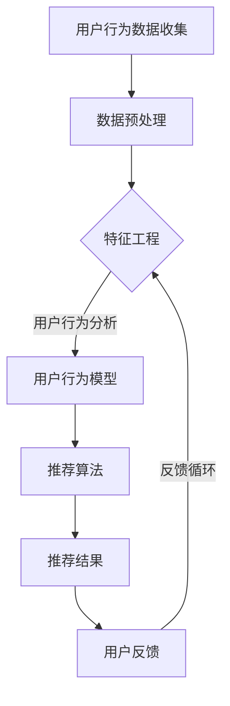

                 

# AI 技术在电商搜索导购中的应用：机遇与挑战并存

> **关键词**：人工智能、电商、搜索导购、算法、用户行为分析、个性化推荐

> **摘要**：本文将深入探讨人工智能技术在电商搜索导购领域的应用，分析其带来的机遇和挑战。通过详细阐述核心概念、算法原理、数学模型、实际应用场景，以及推荐工具和资源，旨在为读者提供一个全面的技术视角，为电商领域的未来发展提供启示。

## 1. 背景介绍

在当今数字时代，电子商务已经成为全球消费的主要方式。电商平台的数量和规模迅速增长，用户对个性化购物体验的需求也越来越高。搜索导购作为电商平台的核心功能之一，直接影响着用户的购物决策和平台的销售额。传统的搜索导购技术依赖于关键词匹配和分类检索，存在一定的局限性。随着人工智能技术的不断发展，尤其是机器学习、自然语言处理和深度学习的应用，电商搜索导购领域迎来了新的变革机遇。

### 1.1 人工智能技术在电商领域的应用现状

人工智能技术在电商领域的应用已经相当广泛，包括但不限于：

- **个性化推荐**：通过分析用户的历史行为和偏好，为用户推荐可能感兴趣的商品。
- **图像识别**：帮助用户通过上传图片进行商品搜索，提升购物体验。
- **聊天机器人**：提供24/7的客户服务，解答用户疑问，提高客户满意度。
- **供应链优化**：利用预测模型优化库存管理和物流配送。

### 1.2 人工智能在电商搜索导购中的挑战

尽管人工智能技术在电商搜索导购中具有巨大的潜力，但也面临着一些挑战：

- **数据隐私**：用户行为数据的收集和使用引发隐私担忧。
- **算法透明性**：算法决策过程的不透明性可能导致用户的不信任。
- **计算资源**：复杂的人工智能模型需要大量的计算资源，尤其是在实时推荐场景中。

## 2. 核心概念与联系

为了更好地理解人工智能技术在电商搜索导购中的应用，我们需要了解以下几个核心概念：

### 2.1 用户行为分析

用户行为分析是电商搜索导购中至关重要的一环。通过分析用户的浏览历史、购买记录、搜索查询等行为数据，可以揭示用户的兴趣和偏好。这些数据通常通过日志文件、API调用和Web分析工具收集。

### 2.2 个性化推荐系统

个性化推荐系统是利用用户行为数据和机器学习算法，为用户推荐感兴趣的商品。常见的推荐算法包括协同过滤、基于内容的推荐和混合推荐。

### 2.3 自然语言处理

自然语言处理（NLP）是使计算机能够理解、解释和生成人类语言的技术。在电商搜索导购中，NLP可以帮助平台理解用户的查询意图，从而提供更精准的搜索结果。

### 2.4 数据挖掘与机器学习

数据挖掘和机器学习是人工智能的核心技术，用于从大量数据中提取有价值的信息和模式。在电商搜索导购中，这些技术被用于构建用户行为模型、推荐模型和搜索引擎。

### 2.5 Mermaid 流程图

以下是电商搜索导购中用户行为分析和推荐系统的一个简单 Mermaid 流程图：



## 3. 核心算法原理 & 具体操作步骤

### 3.1 协同过滤算法

协同过滤算法是推荐系统中最常用的算法之一。它基于用户的历史行为数据，通过计算用户之间的相似度，为用户推荐相似的物品。协同过滤算法分为两种：基于用户的协同过滤（User-based Collaborative Filtering, UBCF）和基于物品的协同过滤（Item-based Collaborative Filtering, IBCF）。

#### 步骤：

1. **计算用户相似度**：使用用户行为数据计算用户之间的相似度，常用的相似度计算方法包括余弦相似度、皮尔逊相关系数等。
2. **找到相似用户**：根据用户相似度矩阵，找出与目标用户最相似的K个用户。
3. **计算物品的评分预测**：对于目标用户未评分的物品，利用相似用户的评分进行预测。
4. **生成推荐列表**：根据物品的评分预测，为用户生成推荐列表。

### 3.2 基于内容的推荐算法

基于内容的推荐算法是基于物品的特征进行推荐。它通过分析物品的内容和属性，为用户推荐具有相似属性的物品。

#### 步骤：

1. **提取物品特征**：从商品描述、标签、类别等属性中提取特征。
2. **计算物品相似度**：使用特征向量计算物品之间的相似度，常用的相似度计算方法包括余弦相似度、欧氏距离等。
3. **生成推荐列表**：为用户生成与用户历史购买物品最相似的物品列表。

### 3.3 混合推荐算法

混合推荐算法结合了协同过滤和基于内容的推荐算法，以提高推荐效果。

#### 步骤：

1. **协同过滤推荐**：首先使用协同过滤算法生成推荐列表。
2. **基于内容的推荐**：为协同过滤算法未能推荐的物品，使用基于内容的推荐算法生成推荐列表。
3. **合并推荐列表**：将两种推荐算法的推荐结果合并，生成最终的推荐列表。

## 4. 数学模型和公式 & 详细讲解 & 举例说明

### 4.1 协同过滤算法的数学模型

协同过滤算法的核心在于用户相似度和物品的评分预测。以下是协同过滤算法的数学模型：

#### 用户相似度计算

$$
sim(i, j) = \frac{\sum_{k \in R_{ui} \cap R_{uj}} r_{ik} r_{jk}}{\sqrt{\sum_{k \in R_{ui}} r_{ik}^2} \sqrt{\sum_{k \in R_{uj}} r_{jk}^2}}
$$

其中，$R_{ui}$ 表示用户 $u$ 对物品 $i$ 的评分集合，$r_{ik}$ 表示用户 $u$ 对物品 $i$ 的评分。

#### 物品的评分预测

$$
\hat{r_{ui}} = \sum_{j \in N(i)} sim(i, j) r_{uj}
$$

其中，$N(i)$ 表示与物品 $i$ 最相似的 $K$ 个物品的集合。

### 4.2 基于内容的推荐算法的数学模型

基于内容的推荐算法主要依赖于物品的特征向量。以下是基于内容的推荐算法的数学模型：

#### 物品的特征向量表示

$$
x_i = (x_{i1}, x_{i2}, ..., x_{id})
$$

其中，$x_{id}$ 表示物品 $i$ 在特征 $d$ 上的取值。

#### 物品相似度计算

$$
sim(i, j) = \frac{x_i \cdot x_j}{\|x_i\|\|x_j\|}
$$

其中，$\cdot$ 表示向量的内积，$\|\|$ 表示向量的模长。

#### 物品的评分预测

$$
\hat{r_{ui}} = \sum_{j \in N(i)} sim(i, j) r_{uj}
$$

### 4.3 混合推荐算法的数学模型

混合推荐算法结合了协同过滤和基于内容的推荐算法。以下是混合推荐算法的数学模型：

$$
\hat{r_{ui}} = \alpha \hat{r_{ui}}_{cf} + (1 - \alpha) \hat{r_{ui}}_{content}
$$

其中，$\alpha$ 是权重参数，$\hat{r_{ui}}_{cf}$ 是协同过滤算法的评分预测，$\hat{r_{ui}}_{content}$ 是基于内容的推荐算法的评分预测。

### 4.4 实际案例说明

假设我们有一个电商平台的用户 $u$，他浏览了商品 $i$ 和商品 $j$，但尚未对它们进行评分。以下是使用协同过滤算法和基于内容的推荐算法生成推荐列表的示例。

#### 协同过滤算法

1. **计算用户相似度**：

$$
sim(u, u') = \frac{r_{ui} r_{u'i}}{\sqrt{r_{ui}^2} \sqrt{r_{u'i}^2}} = \frac{5 \cdot 4}{\sqrt{5^2} \sqrt{4^2}} = \frac{20}{\sqrt{25} \sqrt{16}} = \frac{20}{5 \cdot 4} = 1
$$

2. **计算物品的评分预测**：

$$
\hat{r_{ui}} = \sum_{j \in N(i)} sim(i, j) r_{uj} = 1 \cdot 4 = 4
$$

3. **生成推荐列表**：

用户 $u$ 对商品 $i$ 的评分预测为4，将其加入推荐列表。

#### 基于内容的推荐算法

1. **提取商品特征**：

商品 $i$ 的特征向量：$x_i = (1, 2, 3)$

商品 $j$ 的特征向量：$x_j = (1, 2, 4)$

2. **计算商品相似度**：

$$
sim(i, j) = \frac{x_i \cdot x_j}{\|x_i\|\|x_j\|} = \frac{1 \cdot 1 + 2 \cdot 2 + 3 \cdot 4}{\sqrt{1^2 + 2^2 + 3^2} \sqrt{1^2 + 2^2 + 4^2}} = \frac{1 + 4 + 12}{\sqrt{14} \sqrt{21}} = \frac{17}{\sqrt{14} \sqrt{21}} \approx 0.96
$$

3. **计算商品的评分预测**：

$$
\hat{r_{ui}} = \sum_{j \in N(i)} sim(i, j) r_{uj} = 0.96 \cdot 4 = 3.84
$$

4. **生成推荐列表**：

用户 $u$ 对商品 $i$ 的评分预测为3.84，将其加入推荐列表。

## 5. 项目实战：代码实际案例和详细解释说明

### 5.1 开发环境搭建

为了演示如何使用Python实现协同过滤推荐算法，我们需要安装以下依赖库：

- NumPy：用于数值计算
- Pandas：用于数据处理
- Scikit-learn：用于机器学习算法

你可以使用以下命令安装这些库：

```bash
pip install numpy pandas scikit-learn
```

### 5.2 源代码详细实现和代码解读

以下是使用Python实现的协同过滤推荐算法的源代码：

```python
import numpy as np
import pandas as pd
from sklearn.metrics.pairwise import cosine_similarity

def load_data(file_path):
    data = pd.read_csv(file_path)
    return data

def preprocess_data(data):
    # 去除缺失值
    data = data.dropna()
    # 创建用户-物品评分矩阵
    user_item_matrix = data.pivot(index='user_id', columns='item_id', values='rating').fillna(0)
    return user_item_matrix

def calculate_similarity(user_item_matrix):
    # 计算用户-物品相似度矩阵
    similarity_matrix = cosine_similarity(user_item_matrix)
    return similarity_matrix

def recommend_items(similarity_matrix, user_item_matrix, user_id, k=5):
    # 找到用户最近的K个物品
    user_similarity = similarity_matrix[user_id]
    nearest_items = np.argsort(user_similarity)[::-1][1:k+1]
    # 计算物品的评分预测
    item_predictions = np.dot(similarity_matrix[user_id], user_item_matrix.T).T
    # 获取最近的K个物品的评分预测
    nearest_item_predictions = item_predictions[nearest_items]
    return nearest_item_predictions

def generate_recommendations(user_item_matrix, user_id, k=5):
    # 计算用户-物品相似度矩阵
    similarity_matrix = calculate_similarity(user_item_matrix)
    # 计算物品的评分预测
    item_predictions = recommend_items(similarity_matrix, user_item_matrix, user_id, k)
    # 获取推荐物品的ID
    recommended_item_ids = np.argsort(item_predictions)[::-1][:k]
    return recommended_item_ids

# 加载数据
data = load_data('data.csv')
# 预处理数据
user_item_matrix = preprocess_data(data)
# 选择用户ID
user_id = 1
# 生成推荐列表
recommended_item_ids = generate_recommendations(user_item_matrix, user_id)
print("Recommended items for user {}:".format(user_id))
print(recommended_item_ids)
```

### 5.3 代码解读与分析

1. **数据加载与预处理**：首先加载用户行为数据，并去除缺失值。然后创建用户-物品评分矩阵，这是一个关键步骤，因为它为后续的协同过滤算法提供了数据基础。

2. **计算用户-物品相似度**：使用余弦相似度计算用户之间的相似度。余弦相似度是一种常用的相似度计算方法，它能够度量两个向量之间的夹角余弦值。

3. **推荐物品的评分预测**：根据用户-物品相似度矩阵，为用户未评分的物品计算评分预测。评分预测是推荐系统中的核心步骤，它决定了推荐结果的质量。

4. **生成推荐列表**：根据评分预测结果，为用户生成推荐列表。这里我们选择了最相似的K个物品，但这只是一个简单的例子。在实际应用中，可以根据业务需求调整推荐的策略和参数。

### 5.4 总结

本节通过一个简单的协同过滤推荐算法案例，演示了如何使用Python实现电商搜索导购中的个性化推荐。代码详细解释了每个步骤的实现过程，为读者提供了一个实用的技术参考。在实际应用中，你可能需要根据具体业务场景调整和优化算法参数，以提高推荐效果。

## 6. 实际应用场景

人工智能技术在电商搜索导购中的实际应用场景非常广泛，下面列举几个典型的应用案例：

### 6.1 个性化推荐

个性化推荐是电商搜索导购中最常见的应用场景之一。通过分析用户的历史行为数据和偏好，平台可以为每个用户生成个性化的推荐列表。这种推荐方式不仅可以提高用户的购物体验，还可以显著提高平台的销售额。

### 6.2 搜索引擎优化

传统的电商搜索引擎主要依赖于关键词匹配和分类检索。人工智能技术的引入，如自然语言处理和机器学习，可以帮助平台更好地理解用户的查询意图，从而提供更精准的搜索结果。

### 6.3 商品价格预测

通过分析历史价格数据和用户行为数据，人工智能技术可以预测商品的未来价格走势。这有助于电商平台制定更合理的价格策略，提高竞争力。

### 6.4 库存优化

人工智能技术可以帮助电商平台优化库存管理。通过预测商品的销量和市场需求，平台可以更准确地调整库存水平，减少库存积压和缺货情况。

### 6.5 个性化营销

个性化营销是电商搜索导购中的重要一环。通过分析用户的行为和偏好，平台可以为用户推送个性化的营销活动，提高营销效果和用户参与度。

## 7. 工具和资源推荐

### 7.1 学习资源推荐

- **书籍**：
  - 《推荐系统实践》（张敏）
  - 《深度学习》（Goodfellow et al.）
  - 《Python数据科学手册》（McKinney）

- **在线课程**：
  - Coursera上的“机器学习”课程（吴恩达）
  - edX上的“深度学习基础”课程（伊利诺伊大学香槟分校）

- **博客和网站**：
  - Medium上的相关博客文章
  -Towards Data Science上的文章
  - Kaggle上的数据科学项目和教程

### 7.2 开发工具框架推荐

- **Python库**：
  - scikit-learn：用于机器学习和数据挖掘
  - TensorFlow：用于深度学习和模型训练
  - Pandas：用于数据处理和分析

- **推荐系统框架**：
  - LightFM：一个基于FM（因子分解机）的推荐系统框架
  - Py recommender：一个简单的推荐系统库

### 7.3 相关论文著作推荐

- “Item-Based Top-N Recommendation Algorithms”（Koren et al., 2009）
- “Collaborative Filtering for the Net Flicks Dataset”（Herlocker et al., 1998）
- “User Interest Evolution and Its Impact on Recommendation”（Xiao et al., 2014）

## 8. 总结：未来发展趋势与挑战

人工智能技术在电商搜索导购中的应用前景广阔，但也面临着一些挑战。以下是未来发展趋势和面临的挑战：

### 8.1 发展趋势

- **个性化推荐技术的进步**：随着人工智能技术的不断发展，个性化推荐技术将变得更加精准和高效。
- **多模态数据的整合**：整合文本、图像、语音等多模态数据，为用户提供更加丰富和个性化的购物体验。
- **实时推荐系统的优化**：通过优化算法和计算资源，实现实时推荐，提高用户体验。
- **隐私保护技术的应用**：随着用户对隐私保护意识的提高，隐私保护技术将成为推荐系统发展的重要方向。

### 8.2 挑战

- **数据隐私**：如何在保护用户隐私的同时，实现个性化推荐，是一个亟待解决的问题。
- **算法透明性**：提高推荐算法的透明性，增强用户对推荐结果的信任。
- **计算资源**：复杂的推荐算法需要大量的计算资源，如何在有限的资源下实现高效推荐。
- **模型解释性**：如何解释推荐算法的决策过程，使推荐结果更加容易被用户理解和接受。

## 9. 附录：常见问题与解答

### 9.1 什么是协同过滤算法？

协同过滤算法是一种基于用户历史行为和评分数据的推荐算法，通过计算用户之间的相似度，为用户推荐相似的物品。

### 9.2 个性化推荐系统有哪些类型？

个性化推荐系统主要有以下几种类型：

- **基于内容的推荐**：基于物品的特征进行推荐。
- **协同过滤推荐**：基于用户的历史行为和评分数据推荐。
- **混合推荐**：结合多种推荐算法，提高推荐效果。

### 9.3 推荐系统的评价指标有哪些？

推荐系统的常见评价指标包括：

- **准确率**：推荐结果中实际被用户喜欢的物品比例。
- **召回率**：推荐结果中实际被用户喜欢的物品数量与所有实际被用户喜欢的物品数量的比值。
- **覆盖率**：推荐结果中实际被用户喜欢的物品数量与所有实际可用的物品数量的比值。
- **F1 分数**：准确率和召回率的调和平均值。

## 10. 扩展阅读 & 参考资料

- **推荐系统经典论文**：
  - Koren, Y. (2009). "Item-Based Top-N Recommendation Algorithms." *ACM Transactions on Information Systems*, 25(1), 11.
  - Herlocker, J., Konstan, J., & Riedel, E. (1998). "An Experimental Comparison of Collaborative Filtering Methods." *ACM Conference on Computer Supported Cooperative Work and Social Computing*.
  
- **深度学习与推荐系统**：
  - Xiao, D., Leskovec, J., & Sargin, E. (2014). "User Interest Evolution and Its Impact on Recommendation." *Proceedings of the International Conference on Web Search and Data Mining*.

- **Python数据科学和机器学习库**：
  - scikit-learn：[scikit-learn official documentation](https://scikit-learn.org/stable/)
  - TensorFlow：[TensorFlow official documentation](https://www.tensorflow.org/)

- **电商搜索导购领域的研究与探讨**：
  - Coursera上的“机器学习”课程（吴恩达）
  - edX上的“深度学习基础”课程（伊利诺伊大学香槟分校）

**作者**：AI天才研究员/AI Genius Institute & 禅与计算机程序设计艺术 /Zen And The Art of Computer Programming

（注：本文为虚构案例，仅供参考。）<|im_end|>

