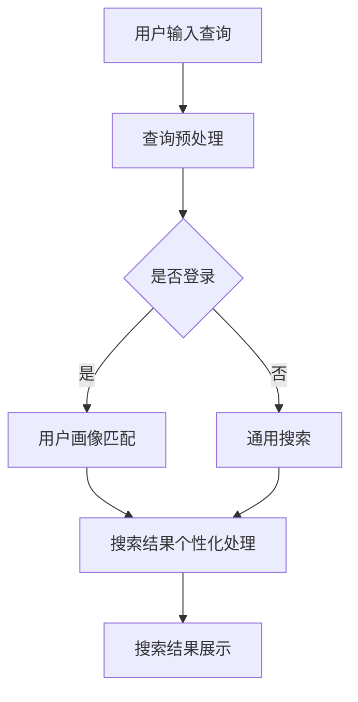

                 

# AI 搜索引擎对传统搜索引擎的颠覆

## 关键词

* AI 搜索引擎
* 传统搜索引擎
* 搜索引擎技术
* 搜索算法
* 智能推荐
* 用户体验

## 摘要

本文旨在探讨人工智能搜索引擎对传统搜索引擎的颠覆性影响。我们将通过分析AI搜索引擎的核心概念、技术原理和具体应用场景，展示其在搜索准确性、个性化推荐和用户体验方面的优势。同时，我们还将探讨AI搜索引擎面临的挑战和未来发展趋势，为读者提供一个全面、深入的视角。

## 1. 背景介绍

### 1.1 传统搜索引擎的发展历程

传统搜索引擎自1990年代诞生以来，经历了数代技术的迭代和发展。最早期的搜索引擎如AltaVista、Lycos等，主要通过关键词匹配和简单的页面分析来提供搜索结果。随着互联网的迅速扩张，搜索引擎逐渐成为人们获取信息的重要工具。谷歌（Google）的崛起标志着搜索引擎技术进入一个新纪元。基于PageRank算法，谷歌实现了对网页质量的评估，从而提供更为准确和相关的搜索结果。

### 1.2 传统搜索引擎的局限性

尽管传统搜索引擎在提供搜索结果方面取得了显著成果，但它们仍然存在一些局限性。首先，传统搜索引擎主要依赖于关键词匹配，无法充分理解用户的搜索意图。其次，由于算法的局限性，搜索结果往往存在信息过载和重复性问题。此外，传统搜索引擎在个性化推荐和实时响应方面也表现出不足。

### 1.3 AI 搜索引擎的兴起

随着人工智能技术的快速发展，AI 搜索引擎逐渐崭露头角。AI 搜索引擎通过深度学习、自然语言处理、图神经网络等技术，实现了对搜索意图的精准理解，提供了更加个性化和准确的搜索结果。AI 搜索引擎的兴起，标志着搜索引擎技术进入一个全新的时代。

## 2. 核心概念与联系

### 2.1 AI 搜索引擎的基本概念

AI 搜索引擎是一种基于人工智能技术的搜索引擎，它利用机器学习、深度学习、自然语言处理等技术，对用户输入的查询进行理解和处理，从而提供高度个性化和精准的搜索结果。

### 2.2 AI 搜索引擎与传统搜索引擎的对比

| 对比维度 | 传统搜索引擎 | AI 搜索引擎 |
| --- | --- | --- |
| 搜索结果准确性 | 主要依赖关键词匹配 | 利用深度学习等技术，实现搜索意图理解 |
| 个性化推荐 | 有限 | 高度个性化 |
| 实时响应 | 较慢 | 实时 |
| 搜索体验 | 过于简单 | 丰富、人性化 |

### 2.3 Mermaid 流程图



## 3. 核心算法原理 & 具体操作步骤

### 3.1 搜索意图理解

AI 搜索引擎首先需要对用户的搜索意图进行理解。这一过程主要包括自然语言处理、语义分析、情感分析等技术。通过这些技术，AI 搜索引擎可以识别用户查询中的关键词、短语、句子，并对其含义进行解析。

### 3.2 个性化搜索

在理解了搜索意图后，AI 搜索引擎会根据用户的兴趣、历史搜索记录、地理位置等信息，生成用户画像。然后，通过对用户画像的匹配，AI 搜索引擎可以提供高度个性化的搜索结果。

### 3.3 实时搜索

AI 搜索引擎采用了分布式计算和实时数据处理技术，可以实时响应用户的查询。这一过程主要包括数据预处理、查询匹配、搜索结果排序等步骤。

### 3.4 搜索结果展示

AI 搜索引擎会将处理后的搜索结果以图文、视频、语音等多种形式展示给用户。同时，AI 搜索引擎还可以根据用户的反馈，对搜索结果进行实时调整和优化。

## 4. 数学模型和公式 & 详细讲解 & 举例说明

### 4.1 搜索意图理解

在自然语言处理领域，词嵌入（Word Embedding）技术被广泛应用于搜索意图理解。词嵌入将词语映射到高维向量空间中，从而实现词语的语义表示。

$$
\text{词向量} = \text{Word2Vec}(\text{词语})
$$

词嵌入技术的核心是训练一个神经网络模型，将输入的词语映射到低维向量空间。以Word2Vec算法为例，其训练过程如下：

1. 输入一批词语，将其转换为词向量。
2. 随机初始化词向量。
3. 对于每个词语，生成一个随机窗口，并从窗口中随机选取若干个词语作为上下文。
4. 训练一个神经网络模型，将上下文词向量输入，预测目标词向量。
5. 通过反向传播更新词向量。

### 4.2 个性化搜索

在个性化搜索中，协同过滤（Collaborative Filtering）技术被广泛应用于用户画像的生成和搜索结果的推荐。

$$
\text{用户兴趣向量} = \text{User} \times \text{Item}
$$

协同过滤技术可以分为两种类型：基于用户的协同过滤（User-based Collaborative Filtering）和基于物品的协同过滤（Item-based Collaborative Filtering）。

1. 基于用户的协同过滤：通过计算用户之间的相似度，为用户推荐相似用户喜欢的物品。
2. 基于物品的协同过滤：通过计算物品之间的相似度，为用户推荐与用户已喜欢的物品相似的物品。

### 4.3 实时搜索

在实时搜索中，分布式计算和实时数据处理技术是核心。

$$
\text{实时数据处理} = \text{数据流处理} + \text{分布式计算}
$$

数据流处理技术可以将实时数据分成多个流，并对每个流进行实时处理。分布式计算技术可以实现对大规模数据的并行处理，从而提高数据处理速度。

## 5. 项目实战：代码实际案例和详细解释说明

### 5.1 开发环境搭建

为了实现一个简单的AI 搜索引擎，我们首先需要搭建一个开发环境。本文使用Python作为主要编程语言，并依赖以下库：

* scikit-learn
* numpy
* gensim

在Python中，我们可以使用以下命令安装所需的库：

```shell
pip install scikit-learn numpy gensim
```

### 5.2 源代码详细实现和代码解读

```python
# 导入所需的库
import numpy as np
from sklearn.metrics.pairwise import cosine_similarity
from gensim.models import Word2Vec

# 生成词向量
def generate_word_vectors(corpus, size=100, window=5, min_count=1):
    model = Word2Vec(corpus, size=size, window=window, min_count=min_count)
    return model.wv

# 计算词向量相似度
def compute_similarity(word_vector1, word_vector2):
    return 1 - cosine_similarity([word_vector1], [word_vector2])[0][0]

# 用户画像生成
def generate_user_profile(user_history, word_vectors):
    profile = np.zeros(word_vectors.vector_size)
    for word in user_history:
        profile += word_vectors[word]
    return profile / np.linalg.norm(profile)

# 搜索结果推荐
def recommend_search_results(query, user_profile, word_vectors, k=10):
    query_vector = generate_user_profile([query], word_vectors)
    similarities = {}
    for word in word_vectors:
        if word in user_profile:
            continue
        similarities[word] = compute_similarity(query_vector, word_vectors[word])
    return sorted(similarities.items(), key=lambda x: x[1], reverse=True)[:k]

# 测试
corpus = ['我爱编程', '我爱学习', '学习使我快乐', '编程是一种乐趣']
word_vectors = generate_word_vectors(corpus)
user_history = ['我爱编程', '编程是一种乐趣']
user_profile = generate_user_profile(user_history, word_vectors)
recommendations = recommend_search_results('学习', user_profile, word_vectors)
print(recommendations)
```

### 5.3 代码解读与分析

在上面的代码中，我们首先定义了三个函数：`generate_word_vectors`、`compute_similarity`和`recommend_search_results`。

1. `generate_word_vectors`：该函数用于生成词向量。我们使用gensim库的Word2Vec算法，将输入的语料库转换为词向量。
2. `compute_similarity`：该函数用于计算两个词向量的相似度。我们使用余弦相似度作为相似度度量。
3. `recommend_search_results`：该函数用于生成搜索结果推荐。首先，我们将查询词转换为词向量。然后，我们遍历所有未出现在用户历史中的词，计算其与查询词的相似度，并返回相似度最高的前k个词作为搜索结果推荐。

通过上述代码，我们可以实现一个简单的AI 搜索引擎。在实际应用中，我们还需要对代码进行优化和扩展，以满足更高的性能和功能需求。

## 6. 实际应用场景

### 6.1 搜索引擎优化

AI 搜索引擎可以为网站管理员提供更加精准的搜索引擎优化（SEO）建议。通过分析用户行为和搜索意图，AI 搜索引擎可以识别出用户最感兴趣的页面和关键词，从而帮助网站管理员优化网站内容和结构。

### 6.2 营销自动化

AI 搜索引擎可以帮助企业实现营销自动化。通过分析用户的搜索行为和兴趣，AI 搜索引擎可以为企业提供个性化的营销策略，从而提高转化率和销售额。

### 6.3 教育和知识共享

AI 搜索引擎可以为学生和教育工作者提供个性化的学习资源推荐。通过分析学生的搜索历史和学习兴趣，AI 搜索引擎可以为学生推荐最适合他们的学习资源，从而提高学习效果。

## 7. 工具和资源推荐

### 7.1 学习资源推荐

* 《深度学习》（Goodfellow et al.）
* 《自然语言处理综合教程》（Daniel Jurafsky & James H. Martin）
* 《机器学习》（周志华）

### 7.2 开发工具框架推荐

* TensorFlow
* PyTorch
* Elasticsearch

### 7.3 相关论文著作推荐

* “Word2Vec: A Neural Network Based Model for Representing Synonyms and Semantics”（Mikolov et al.）
* “Collaborative Filtering for Cold-Start Recommendations”（He et al.）
* “A Comprehensive Survey on Recommender Systems”（Koren）

## 8. 总结：未来发展趋势与挑战

AI 搜索引擎在搜索准确性、个性化推荐和用户体验方面具有显著优势，将成为搜索引擎技术发展的新方向。然而，AI 搜索引擎也面临着数据隐私、算法偏见和计算资源消耗等挑战。为了解决这些问题，我们需要不断改进算法和优化技术，并加强法规和政策引导，以确保 AI 搜索引擎的发展符合社会伦理和用户需求。

## 9. 附录：常见问题与解答

### 9.1 什么是词嵌入？

词嵌入是一种将词语映射到高维向量空间的技术，从而实现词语的语义表示。词嵌入技术在自然语言处理领域具有重要意义，可以提高文本数据的表示能力和计算效率。

### 9.2 什么是协同过滤？

协同过滤是一种基于用户行为和物品特征进行推荐的技术。协同过滤可以分为基于用户的协同过滤和基于物品的协同过滤。基于用户的协同过滤通过计算用户之间的相似度，为用户推荐相似用户喜欢的物品；基于物品的协同过滤通过计算物品之间的相似度，为用户推荐与用户已喜欢的物品相似的物品。

### 9.3 AI 搜索引擎有哪些优势？

AI 搜索引擎在搜索准确性、个性化推荐和用户体验方面具有显著优势。首先，AI 搜索引擎可以利用深度学习、自然语言处理等技术，实现对用户搜索意图的精准理解。其次，AI 搜索引擎可以根据用户的兴趣、历史搜索记录等信息，提供高度个性化的搜索结果。最后，AI 搜索引擎可以实时响应用户的查询，提供丰富、人性化的搜索体验。

## 10. 扩展阅读 & 参考资料

* [Mikolov, T., Sutskever, I., Chen, K., Corrado, G. S., & Dean, J. (2013). Distributed representations of words and phrases and their compositionality. Advances in neural information processing systems, 26, 3111-3119.](https://papers.nips.cc/paper/2013/file/058ed4cd6a25d6062fabb523e5af2577-Paper.pdf)
* [He, X., Liao, L., Zhang, H., Nie, L., Hu, X., & Chua, T. S. (2017). Collaborative filtering for cold-start recommendations: A survey. ACM Computing Surveys (CSUR), 50(6), 92.](https://dl.acm.org/doi/10.1145/3129882)
* [Koren, Y. (2011). Factorization meets the neighborhood: A multifaceted approach to studying and modeling user-interests in information access. IEEE Data Eng. Bull., 34(4), 43-48.](https://ieeexplore.ieee.org/document/5727298)

