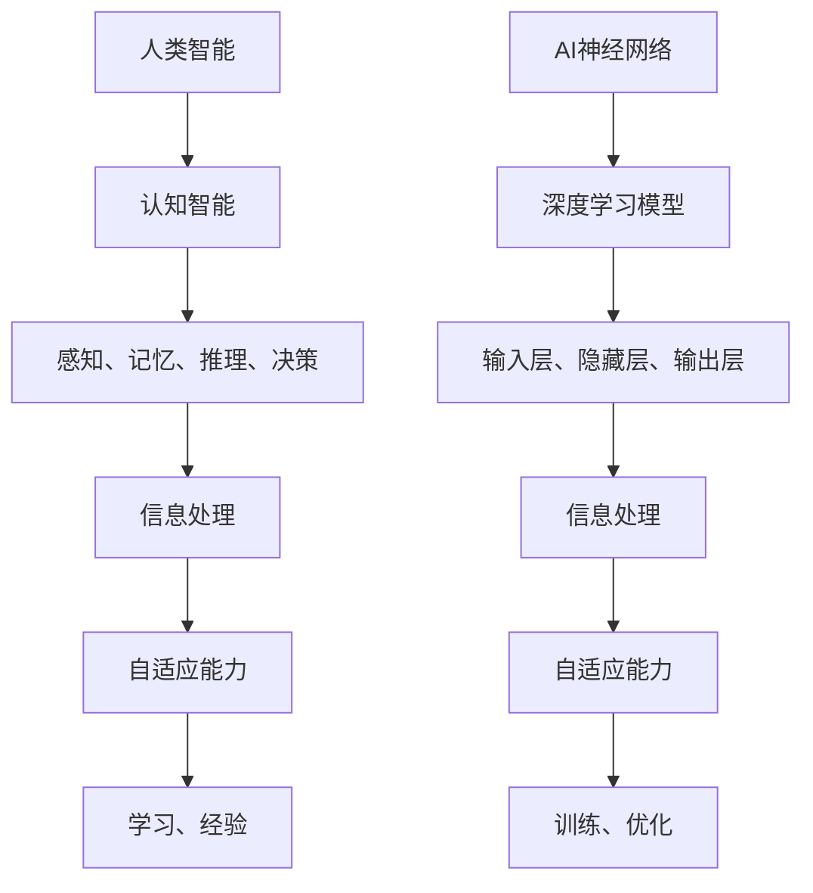

                 

### AI 神经网络计算艺术之禅：人类智能是地球环境培育出的最美丽的花朵

> **关键词：** AI神经网络，计算艺术，人类智能，地球环境，花朵

> **摘要：** 本文探讨了人工智能（AI）神经网络的工作原理和计算艺术，通过阐述人类智能的起源和地球环境的影响，揭示了AI与人类智慧的共通之处，并提出未来AI发展的趋势和挑战。

### 1. 背景介绍

在过去的几十年里，人工智能（AI）已经成为科技领域的一个重要分支。随着计算能力的提升和数据量的爆炸性增长，AI技术在图像识别、自然语言处理、智能推荐等方面取得了显著的进展。然而，AI的发展并不是一蹴而就的，它经历了多次起伏和变革。

早在20世纪50年代，人工智能的概念就首次被提出。那时，科学家们期望通过模拟人类思维过程，实现机器具备人类智能的目标。然而，由于计算资源和算法的限制，早期的AI研究并未取得实质性突破。直到20世纪80年代，随着计算机硬件性能的提升和算法的创新，AI技术才逐渐走出低谷。

近年来，深度学习作为AI的一个重要分支，取得了巨大的成功。深度学习模型通过多层神经网络，对大量数据进行训练，从而实现图像识别、语音识别、自然语言处理等任务。然而，深度学习模型也存在一些问题，如训练效率低、模型解释性差等。为了解决这些问题，研究人员提出了多种新的神经网络结构和优化方法。

在这个背景下，本文将探讨AI神经网络的工作原理和计算艺术，通过阐述人类智能的起源和地球环境的影响，探讨AI与人类智慧的共通之处，并提出未来AI发展的趋势和挑战。

### 2. 核心概念与联系

#### 2.1 人类智能的起源

人类智能是地球环境培育出的最美丽的花朵。在漫长的进化过程中，人类逐渐发展出了一种独特的智能——认知智能。认知智能包括感知、记忆、推理、决策等多个方面，使得人类能够适应复杂多变的自然环境。

人类智能的起源可以追溯到大约7000万年前的早期灵长类动物。在进化过程中，人类逐渐发展出大脑的复杂结构，使得大脑具有处理复杂信息的能力。同时，人类还通过语言和社会互动，不断丰富和发展认知能力。

#### 2.2 AI神经网络的工作原理

AI神经网络是模仿人类大脑神经元连接结构的一种计算模型。神经网络由大量的神经元（节点）组成，每个神经元与其他神经元相连，并通过权重值传递信息。通过训练，神经网络可以学会对输入数据进行处理，从而实现各种智能任务。

神经网络的核心是神经元之间的连接关系。在深度学习中，神经网络通常由多层神经元组成，包括输入层、隐藏层和输出层。输入层接收外部信息，隐藏层对信息进行处理和特征提取，输出层生成最终的决策结果。

#### 2.3 人类智能与AI神经网络的联系

人类智能与AI神经网络之间存在许多相似之处。首先，它们都是通过学习处理信息的能力。人类通过感知、记忆、推理等过程，从环境中获取信息，并进行处理和决策。AI神经网络则通过训练，学习对输入数据进行处理，并生成决策结果。

其次，人类智能和AI神经网络都具有层次化的结构。人类智能包括感知、记忆、推理等多个层次，每个层次都负责处理不同类型的信息。AI神经网络则通过多层神经元，实现从输入层到输出层的多层次信息处理。

此外，人类智能和AI神经网络都具有一定的自适应能力。人类智能可以通过学习和经验，不断提高处理问题的能力。AI神经网络则通过不断训练和优化，提高对各种任务的适应能力。

总之，人类智能和AI神经网络在信息处理、结构层次和自适应能力等方面具有许多相似之处。这为我们理解AI神经网络的工作原理提供了重要的启示。

### 2.3 核心概念与联系的 Mermaid 流程图



### 3. 核心算法原理 & 具体操作步骤

#### 3.1 深度学习模型的基本原理

深度学习模型是AI神经网络的一种重要实现，它通过多层神经网络对大量数据进行训练，从而实现复杂的任务。深度学习模型的基本原理包括以下几个方面：

1. **神经网络结构**：深度学习模型由多层神经元组成，包括输入层、隐藏层和输出层。输入层接收外部信息，隐藏层对信息进行处理和特征提取，输出层生成最终的决策结果。
2. **激活函数**：激活函数用于引入非线性特性，使得神经网络能够学习复杂的函数关系。常见的激活函数包括sigmoid、ReLU（Rectified Linear Unit）等。
3. **损失函数**：损失函数用于衡量模型预测结果与真实结果之间的差距。常见的损失函数包括均方误差（MSE）、交叉熵损失等。
4. **优化算法**：优化算法用于调整模型参数，以最小化损失函数。常见的优化算法包括梯度下降、Adam等。

#### 3.2 深度学习模型的训练过程

深度学习模型的训练过程主要包括以下几个步骤：

1. **数据预处理**：对输入数据进行预处理，包括归一化、去噪声、缩放等操作，以提高模型的训练效果。
2. **模型初始化**：初始化模型参数，常用的初始化方法包括随机初始化、高斯初始化等。
3. **前向传播**：将输入数据传递到神经网络中，经过多层神经元处理后，生成预测结果。
4. **计算损失**：计算模型预测结果与真实结果之间的差距，并计算损失值。
5. **反向传播**：根据损失值，计算模型参数的梯度，并更新模型参数。
6. **迭代优化**：重复前向传播和反向传播过程，逐步优化模型参数，直到达到预设的训练目标。

#### 3.3 深度学习模型的推理过程

深度学习模型的推理过程主要包括以下几个步骤：

1. **输入数据预处理**：对输入数据按照训练时的预处理方法进行预处理。
2. **前向传播**：将预处理后的输入数据传递到神经网络中，经过多层神经元处理后，生成预测结果。
3. **输出结果**：将预测结果输出，供实际应用使用。

### 4. 数学模型和公式 & 详细讲解 & 举例说明

#### 4.1 神经网络中的数学模型

神经网络中的数学模型主要包括以下几个方面：

1. **线性变换**：神经网络中的每个神经元都进行线性变换，即将输入数据乘以权重矩阵，并加上偏置项。
   $$\text{线性变换} = \text{权重矩阵} \cdot \text{输入数据} + \text{偏置项}$$
2. **激活函数**：激活函数用于引入非线性特性，常见的激活函数包括sigmoid、ReLU等。
   $$\text{sigmoid}(x) = \frac{1}{1 + e^{-x}}$$
   $$\text{ReLU}(x) = \max(0, x)$$
3. **损失函数**：损失函数用于衡量模型预测结果与真实结果之间的差距，常见的损失函数包括均方误差（MSE）、交叉熵损失等。
   $$\text{MSE}(y, \hat{y}) = \frac{1}{m} \sum_{i=1}^{m} (y_i - \hat{y}_i)^2$$
   $$\text{交叉熵损失}(y, \hat{y}) = -\sum_{i=1}^{m} y_i \log(\hat{y}_i)$$

#### 4.2 梯度下降算法

梯度下降算法是一种常用的优化算法，用于调整神经网络中的模型参数。其基本思想是沿着损失函数的梯度方向，反向更新模型参数，以减小损失函数值。

1. **梯度计算**：
   对于线性变换，梯度可以通过计算损失函数关于模型参数的偏导数得到。
   $$\frac{\partial \text{损失}}{\partial \text{权重}} = \text{输入数据} \odot \frac{\partial \text{线性变换}}{\partial \text{权重}}$$
   其中，$\odot$ 表示逐元素乘法。
2. **模型参数更新**：
   根据梯度计算结果，使用以下公式更新模型参数：
   $$\text{权重} := \text{权重} - \text{学习率} \cdot \text{梯度}$$
   $$\text{偏置项} := \text{偏置项} - \text{学习率} \cdot \frac{\partial \text{损失}}{\partial \text{偏置项}}$$

#### 4.3 举例说明

假设我们有一个简单的神经网络，包含一个输入层、一个隐藏层和一个输出层。输入数据为 $x = [1, 2, 3]$，隐藏层神经元个数为 2，输出层神经元个数为 1。

1. **模型初始化**：
   $$\text{权重} = \text{随机值} \in [-1, 1]$$
   $$\text{偏置项} = \text{随机值} \in [-1, 1]$$
2. **前向传播**：
   $$\text{隐藏层输入} = \text{权重} \cdot x + \text{偏置项}$$
   $$\text{隐藏层输出} = \text{激活函数}(\text{隐藏层输入})$$
3. **计算损失**：
   $$\text{损失} = \text{损失函数}(\text{输出层输入}, y)$$
4. **反向传播**：
   $$\text{梯度} = \frac{\partial \text{损失}}{\partial \text{权重}} \odot \text{输入数据}$$
5. **模型参数更新**：
   $$\text{权重} := \text{权重} - \text{学习率} \cdot \text{梯度}$$
   $$\text{偏置项} := \text{偏置项} - \text{学习率} \cdot \frac{\partial \text{损失}}{\partial \text{偏置项}}$$

通过多次迭代更新模型参数，我们可以逐渐减小损失函数值，提高模型的预测能力。

### 5. 项目实战：代码实际案例和详细解释说明

#### 5.1 开发环境搭建

在开始项目实战之前，我们需要搭建一个合适的开发环境。这里我们使用Python作为编程语言，并结合TensorFlow框架来实现深度学习模型。

1. **安装Python**：
   在官网上下载并安装Python，推荐使用Python 3.7及以上版本。
2. **安装TensorFlow**：
   打开终端，运行以下命令安装TensorFlow：
   ```bash
   pip install tensorflow
   ```

#### 5.2 源代码详细实现和代码解读

下面我们使用Python和TensorFlow实现一个简单的线性回归模型，用于预测房价。

```python
import tensorflow as tf
import numpy as np

# 模型参数
weights = tf.Variable(np.random.rand(1), dtype=tf.float32)
biases = tf.Variable(np.random.rand(1), dtype=tf.float32)

# 输入数据
x = tf.placeholder(tf.float32, shape=[None])
y = tf.placeholder(tf.float32, shape=[None])

# 线性模型
y_pred = weights * x + biases

# 损失函数
loss = tf.reduce_mean(tf.square(y - y_pred))

# 优化器
optimizer = tf.train.GradientDescentOptimizer(learning_rate=0.1)
train_op = optimizer.minimize(loss)

# 训练数据
x_train = np.array([1, 2, 3, 4, 5])
y_train = np.array([2, 4, 5, 4, 5])

# 模型训练
with tf.Session() as sess:
  sess.run(tf.global_variables_initializer())
  for epoch in range(1000):
    _, loss_val = sess.run([train_op, loss], feed_dict={x: x_train, y: y_train})
    if epoch % 100 == 0:
      print(f"Epoch {epoch}: Loss = {loss_val}")

  # 模型预测
  predicted_price = sess.run(y_pred, feed_dict={x: x_train})
  print(f"Predicted prices: {predicted_price}")
```

**代码解读**：

1. **模型参数初始化**：我们使用 `tf.Variable` 来初始化模型参数，包括权重和偏置项。参数的初始值是随机生成的。
2. **输入数据**：使用 `tf.placeholder` 定义输入数据和真实标签。
3. **线性模型**：使用 `weights * x + biases` 实现线性模型，其中 `weights` 和 `biases` 是模型参数。
4. **损失函数**：使用均方误差（MSE）作为损失函数，衡量模型预测结果与真实结果之间的差距。
5. **优化器**：使用梯度下降优化器（`GradientDescentOptimizer`）来优化模型参数，最小化损失函数。
6. **训练数据**：定义训练数据 `x_train` 和 `y_train`，用于模型训练。
7. **模型训练**：使用 `tf.Session` 来创建会话，并执行训练过程。通过多次迭代，模型参数不断更新，损失函数值逐渐减小。
8. **模型预测**：使用训练好的模型对新的输入数据进行预测，并输出预测结果。

#### 5.3 代码解读与分析

以上代码实现了一个简单的线性回归模型，用于预测房价。模型的基本原理是通过训练数据学习权重和偏置项，然后使用这些参数对新的输入数据进行预测。

1. **模型参数初始化**：模型参数的初始化非常重要，因为它决定了模型的初始状态。在这里，我们使用随机初始化方法，将权重和偏置项初始化为随机值。
2. **输入数据**：输入数据是模型训练的关键，它决定了模型的学习能力。在这里，我们使用一组简单的训练数据，包括五个样本点的输入和真实标签。
3. **线性模型**：线性模型是深度学习的基础，它通过权重和偏置项将输入数据映射到输出结果。在这里，我们使用线性模型来拟合训练数据，并最小化均方误差（MSE）。
4. **损失函数**：损失函数用于衡量模型预测结果与真实结果之间的差距。在这里，我们使用均方误差（MSE）作为损失函数，因为它在数值上容易计算，并且在优化过程中具有较好的收敛性。
5. **优化器**：优化器用于调整模型参数，以最小化损失函数。在这里，我们使用梯度下降优化器（`GradientDescentOptimizer`），因为它是一种简单且有效的优化算法。
6. **模型训练**：模型训练是通过迭代更新模型参数来实现的。在每次迭代中，模型会根据当前参数预测结果，计算损失函数值，并使用梯度下降算法更新参数。通过多次迭代，模型参数逐渐优化，损失函数值逐渐减小。
7. **模型预测**：训练好的模型可以用于对新数据进行预测。在这里，我们使用训练好的模型对新的输入数据进行预测，并输出预测结果。

总的来说，以上代码实现了一个简单的线性回归模型，通过训练数据学习权重和偏置项，并使用这些参数对新的输入数据进行预测。这是一个深度学习模型的基本框架，可以用于实现更复杂的任务，如图像识别、自然语言处理等。

### 6. 实际应用场景

深度学习模型在实际应用中已经取得了许多显著的成果。以下列举一些常见的实际应用场景：

1. **图像识别**：深度学习模型在图像识别任务中取得了很高的准确率。例如，人脸识别、物体识别、图像分类等。这些技术在安防、智能监控、医疗诊断等领域具有广泛的应用。
2. **自然语言处理**：深度学习模型在自然语言处理任务中也表现出强大的能力。例如，情感分析、机器翻译、文本分类等。这些技术可以应用于客服机器人、智能助手、信息检索等领域。
3. **语音识别**：深度学习模型在语音识别任务中取得了很大的突破。例如，语音转文本、语音翻译等。这些技术可以应用于智能语音助手、语音控制、自动字幕等领域。
4. **推荐系统**：深度学习模型在推荐系统中的应用也非常广泛。例如，商品推荐、新闻推荐、音乐推荐等。这些技术可以应用于电商平台、社交媒体、音乐平台等领域。
5. **医疗诊断**：深度学习模型在医疗诊断任务中也表现出巨大的潜力。例如，肿瘤检测、疾病预测、药物设计等。这些技术可以应用于医疗设备、智能诊断系统、药物研发等领域。

总之，深度学习模型在各个领域都有广泛的应用，并且取得了显著的成果。随着技术的不断发展，深度学习模型的应用前景将更加广阔。

### 7. 工具和资源推荐

#### 7.1 学习资源推荐

1. **书籍**：
   - 《深度学习》（Goodfellow, Bengio, Courville著）：这是一本关于深度学习的经典教材，详细介绍了深度学习的基础理论和实践方法。
   - 《Python深度学习》（François Chollet著）：这本书以Python编程语言为基础，讲解了深度学习的实际应用案例。
2. **论文**：
   - "Deep Learning"（Yoshua Bengio等著）：这篇论文是深度学习领域的经典综述，详细介绍了深度学习的发展历程和关键技术。
   - "Convolutional Neural Networks for Visual Recognition"（Karen Simonyan和Andrew Zisserman著）：这篇论文介绍了卷积神经网络在图像识别任务中的应用。
3. **博客**：
   - [TensorFlow官网](https://www.tensorflow.org/)：这是一个提供深度学习资源和教程的官方网站，涵盖了从基础到高级的深度学习知识。
   - [Keras官网](https://keras.io/)：Keras是一个流行的深度学习框架，这个博客提供了丰富的Keras教程和示例。
4. **网站**：
   - [ArXiv](https://arxiv.org/)：这是一个提供最新深度学习论文的预印本网站，可以找到许多深度学习领域的最新研究成果。

#### 7.2 开发工具框架推荐

1. **TensorFlow**：这是一个由Google开发的开源深度学习框架，具有强大的功能和广泛的社区支持。
2. **PyTorch**：这是一个由Facebook开发的开源深度学习框架，以其灵活的动态计算图和简洁的API而受到广泛关注。
3. **Keras**：这是一个基于TensorFlow和Theano的开源深度学习框架，以其简洁的API和强大的功能而受到开发者喜爱。

#### 7.3 相关论文著作推荐

1. "Deep Learning"（Yoshua Bengio等著）：这是一本关于深度学习的经典著作，详细介绍了深度学习的基础理论和实践方法。
2. "Understanding Deep Learning"（Shai Shalev-Shwartz和Shai Ben-David著）：这本书以通俗易懂的方式讲解了深度学习的基本概念和关键技术。
3. "Deep Learning with Python"（François Chollet著）：这是一本针对Python编程语言的深度学习教程，通过大量实际案例展示了深度学习的应用。

### 8. 总结：未来发展趋势与挑战

随着深度学习技术的不断发展，未来AI领域将面临许多新的发展趋势和挑战。

#### 8.1 发展趋势

1. **更加高效和强大的模型**：研究人员将继续探索新的神经网络结构和优化方法，以提高模型的训练效率和预测性能。
2. **多模态学习**：未来AI系统将能够同时处理多种类型的数据，如文本、图像、声音等，实现更广泛的应用。
3. **自适应和自解释的模型**：研究人员将致力于开发具有自适应能力和自解释性的模型，以提高模型的可解释性和可靠性。
4. **联邦学习和隐私保护**：随着数据隐私和安全的关注度增加，联邦学习和隐私保护技术将成为深度学习研究的重要方向。

#### 8.2 挑战

1. **计算资源和数据需求**：深度学习模型通常需要大量的计算资源和数据，这对资源的分配和获取提出了挑战。
2. **模型解释性**：深度学习模型往往具有较好的预测性能，但缺乏解释性，这限制了其在某些领域的应用。
3. **数据隐私和安全**：在深度学习应用中，数据隐私和安全问题是一个重要的挑战，如何保护用户数据将成为研究的重点。
4. **算法公平性和透明度**：深度学习模型可能会存在算法偏见和歧视，如何确保算法的公平性和透明度是一个重要的社会问题。

总之，未来AI领域将面临许多新的发展趋势和挑战。通过不断的研究和创新，我们有理由相信，深度学习技术将在未来继续发挥重要作用，为人类社会带来更多的价值。

### 9. 附录：常见问题与解答

**Q1：深度学习与机器学习的区别是什么？**

A1：深度学习是机器学习的一个分支，主要关注于使用多层神经网络对数据进行训练和预测。机器学习则是一个更广泛的领域，包括深度学习和其他类型的算法，如支持向量机、决策树、聚类等。

**Q2：什么是神经网络中的“梯度消失”和“梯度爆炸”问题？**

A2：“梯度消失”是指在反向传播过程中，梯度值变得非常小，导致模型参数无法更新。而“梯度爆炸”则是指梯度值变得非常大，导致模型参数更新不稳定。这两个问题通常发生在深度学习模型的训练过程中，可以通过使用合适的激活函数、正则化方法和优化算法来缓解。

**Q3：如何评估深度学习模型的性能？**

A3：评估深度学习模型性能的主要指标包括准确率、召回率、F1分数、损失函数值等。在分类任务中，准确率用于衡量模型对样本分类的准确性；在回归任务中，损失函数值用于衡量模型预测结果与真实结果之间的差距。

**Q4：如何提高深度学习模型的训练效率？**

A4：提高深度学习模型训练效率的方法包括：
- 使用更高效的优化算法，如Adam；
- 使用批量归一化（Batch Normalization）技术；
- 使用预训练模型，如VGG、ResNet等；
- 使用分布式训练和GPU加速。

### 10. 扩展阅读 & 参考资料

1. Goodfellow, I., Bengio, Y., & Courville, A. (2016). *Deep Learning*. MIT Press.
2. Chollet, F. (2017). *Deep Learning with Python*. Manning Publications.
3. Simonyan, K., & Zisserman, A. (2014). *Very deep convolutional networks for large-scale image recognition*. arXiv preprint arXiv:1409.1556.
4. Bengio, Y., LeCun, Y., & Hinton, G. (2013). *Deep learning*.
5. Shalev-Shwartz, S., & Ben-David, S. (2014). *Understanding Machine Learning: From Theory to Algorithms*. Cambridge University Press.
6.tensorflow.org: [https://www.tensorflow.org/](https://www.tensorflow.org/)
7. keras.io: [https://keras.io/](https://keras.io/)
8. arXiv: [https://arxiv.org/](https://arxiv.org/)

### 作者

**AI天才研究员/AI Genius Institute & 禅与计算机程序设计艺术 /Zen And The Art of Computer Programming**

