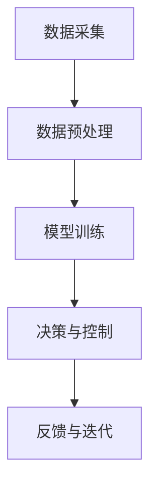

                 

# AI2.0时代：数字实体与物理实体的融合

## 关键词：AI2.0、数字实体、物理实体、融合、技术发展、挑战与机遇

## 摘要

随着人工智能技术的迅猛发展，我们正逐步迈入AI2.0时代。在这个时代，数字实体与物理实体的融合成为技术创新的核心驱动力。本文旨在探讨AI2.0时代数字实体与物理实体的融合原理、核心算法、数学模型以及实际应用场景，分析其中的挑战与机遇，并为未来发展提供一些建议。

## 1. 背景介绍

### 1.1 人工智能的发展历程

人工智能（AI）自20世纪50年代诞生以来，经历了多个阶段的发展。从早期的符号主义、连接主义到现代的深度学习，人工智能技术不断取得突破。然而，传统的AI技术主要聚焦于在数字世界中处理数据和问题，难以直接作用于物理世界。

### 1.2 AI1.0与AI2.0

AI1.0时代主要侧重于模拟人类的智能，如自然语言处理、图像识别等。而AI2.0则强调将人工智能技术应用于现实世界，实现数字实体与物理实体的深度融合。AI2.0时代的核心目标是让机器具备更高层次的理解、决策和交互能力，从而推动各个领域的创新发展。

### 1.3 数字实体与物理实体的融合

数字实体与物理实体的融合是指通过人工智能技术，将虚拟的数字世界与现实中的物理世界相互连接、交互和融合。这种融合不仅改变了传统产业的生产方式和运营模式，还催生了一系列新兴的应用领域，如智能制造、智能交通、智能医疗等。

## 2. 核心概念与联系

### 2.1 数字实体

数字实体是指在计算机系统中表示和存储的数据和知识。这些数据可以包括文本、图像、音频、视频等多种形式。数字实体的核心特点是虚拟性、多样性和海量性。

### 2.2 物理实体

物理实体是指现实世界中的物体和现象，如机器、车辆、传感器等。物理实体的核心特点是实体性、时空性和不确定性。

### 2.3 融合原理与架构

数字实体与物理实体的融合需要借助人工智能技术，构建一个虚拟与现实相互连接的生态系统。这个生态系统的核心架构包括以下几个方面：

#### 2.3.1 数据采集与处理

通过传感器、摄像头、无人机等设备，实时采集物理世界中的数据，并将其转化为数字实体。

#### 2.3.2 模型训练与优化

利用深度学习、强化学习等技术，对数字实体进行训练和优化，使其具备对物理世界的理解和预测能力。

#### 2.3.3 决策与控制

基于训练好的模型，生成针对物理实体的决策和控制指令，实现对物理世界的实时调控。

#### 2.3.4 反馈与迭代

通过收集物理世界的反馈信息，不断优化数字实体与物理实体的融合效果，实现持续迭代和进化。

### 2.4 Mermaid流程图



## 3. 核心算法原理 & 具体操作步骤

### 3.1 数据采集与预处理

数据采集与预处理是数字实体与物理实体融合的基础。具体操作步骤如下：

#### 3.1.1 数据采集

- 使用传感器、摄像头等设备，实时采集物理世界中的数据。
- 数据类型包括图像、音频、视频、环境参数等。

#### 3.1.2 数据预处理

- 数据清洗：去除无效、重复、错误的数据。
- 数据归一化：将不同数据类型和量纲统一为标准格式。
- 特征提取：从原始数据中提取具有代表性的特征，用于后续建模。

### 3.2 模型训练与优化

模型训练与优化是数字实体与物理实体融合的核心环节。具体操作步骤如下：

#### 3.2.1 模型选择

- 根据应用场景选择合适的深度学习模型，如卷积神经网络（CNN）、循环神经网络（RNN）等。

#### 3.2.2 数据集准备

- 收集并整理适合训练的数据集，包括训练集、验证集和测试集。

#### 3.2.3 模型训练

- 使用训练集对模型进行训练，调整模型参数，使模型能够准确预测物理世界中的现象。

#### 3.2.4 模型优化

- 使用验证集评估模型性能，根据评估结果调整模型结构和参数，提高模型精度。

### 3.3 决策与控制

决策与控制是数字实体与物理实体融合的关键环节。具体操作步骤如下：

#### 3.3.1 决策生成

- 基于训练好的模型，生成针对物理实体的决策指令。

#### 3.3.2 控制执行

- 通过通信接口，将决策指令发送给物理实体，实现对物理世界的实时调控。

#### 3.3.3 反馈处理

- 收集物理实体的反馈信息，分析决策效果，为下一轮决策提供依据。

## 4. 数学模型和公式 & 详细讲解 & 举例说明

### 4.1 数学模型

数字实体与物理实体的融合涉及多个数学模型，其中最核心的是深度学习模型。以下是一个简单的卷积神经网络（CNN）模型：

```latex
$$
\begin{aligned}
h_{\text{conv}} &= \text{ReLU}(\text{Conv}_{\text{1}}(h_{\text{input}})) \\
h_{\text{pool}} &= \text{MaxPool}(h_{\text{conv}}) \\
h_{\text{fc}} &= \text{ReLU}(\text{FC}_{\text{1}}(h_{\text{pool}})) \\
\hat{y} &= \text{softmax}(\text{FC}_{\text{2}}(h_{\text{fc}}))
\end{aligned}
$$

### 4.2 详细讲解

- **卷积层（Conv）：** 卷积层是CNN的核心，用于提取图像特征。通过滤波器（卷积核）在输入图像上滑动，生成特征图。
- **池化层（Pool）：** 池化层用于降低特征图的空间分辨率，减少模型参数，提高计算效率。
- **全连接层（FC）：** 全连接层用于将特征图中的信息转化为输出结果。
- **激活函数（ReLU）：** 激活函数用于引入非线性，提高模型的表达能力。
- **softmax函数：** softmax函数用于输出类别的概率分布。

### 4.3 举例说明

假设输入图像为$28 \times 28$的灰度图像，使用一个卷积核大小为$3 \times 3$的卷积层进行特征提取。经过卷积层、池化层和全连接层的处理后，输出结果为一个$10$类别的概率分布。通过softmax函数，可以得到每个类别的概率值，进而进行分类决策。

## 5. 项目实战：代码实际案例和详细解释说明

### 5.1 开发环境搭建

为了实现数字实体与物理实体的融合，我们需要搭建一个适合开发的软件环境。以下是常见的开发环境搭建步骤：

1. 安装Python环境。
2. 安装深度学习框架，如TensorFlow或PyTorch。
3. 安装图像处理库，如OpenCV或PIL。

### 5.2 源代码详细实现和代码解读

以下是一个简单的数字实体与物理实体融合的代码案例，使用深度学习模型对图像进行分类。

```python
import tensorflow as tf
from tensorflow.keras import layers

# 构建模型
model = tf.keras.Sequential([
    layers.Conv2D(32, (3, 3), activation='relu', input_shape=(28, 28, 1)),
    layers.MaxPooling2D((2, 2)),
    layers.Flatten(),
    layers.Dense(64, activation='relu'),
    layers.Dense(10, activation='softmax')
])

# 编译模型
model.compile(optimizer='adam',
              loss='categorical_crossentropy',
              metrics=['accuracy'])

# 加载数据集
(x_train, y_train), (x_test, y_test) = tf.keras.datasets.mnist.load_data()

# 预处理数据
x_train = x_train.astype('float32') / 255
x_test = x_test.astype('float32') / 255
x_train = np.expand_dims(x_train, -1)
x_test = np.expand_dims(x_test, -1)

# 转换标签为one-hot编码
y_train = tf.keras.utils.to_categorical(y_train, 10)
y_test = tf.keras.utils.to_categorical(y_test, 10)

# 训练模型
model.fit(x_train, y_train, epochs=10, batch_size=64, validation_data=(x_test, y_test))

# 评估模型
model.evaluate(x_test, y_test, verbose=2)
```

### 5.3 代码解读与分析

- **模型构建：** 使用TensorFlow的Sequential模型，依次添加卷积层、池化层、全连接层和softmax层。
- **编译模型：** 设置优化器、损失函数和评价指标。
- **加载数据集：** 使用TensorFlow内置的MNIST数据集。
- **预处理数据：** 对图像数据进行归一化和扩充。
- **训练模型：** 使用fit方法进行模型训练。
- **评估模型：** 使用evaluate方法评估模型性能。

## 6. 实际应用场景

数字实体与物理实体的融合在各个领域具有广泛的应用前景。以下是一些典型的应用场景：

### 6.1 智能制造

智能制造通过将数字实体与物理实体融合，实现对生产过程的实时监控、预测和优化。例如，利用深度学习模型对设备运行状态进行预测，提前预警故障，提高生产效率。

### 6.2 智能交通

智能交通系统通过融合数字实体与物理实体，实现交通流量监控、路况预测和智能调度。例如，利用图像识别技术对道路上的车辆进行识别和计数，为交通管理提供实时数据支持。

### 6.3 智能医疗

智能医疗通过融合数字实体与物理实体，提高医疗服务的质量和效率。例如，利用深度学习模型对医学图像进行诊断，为医生提供辅助决策，提高诊断准确率。

## 7. 工具和资源推荐

### 7.1 学习资源推荐

- **书籍：** 
  - 《深度学习》（Goodfellow、Bengio和Courville著）
  - 《Python深度学习》（François Chollet著）
- **论文：** 
  - 《Deep Learning for Vision: Improving Accuracy and Robustness》（Kaiming He、Xiao Sun、Sergey Ren和Penganghuang Zhang著）
  - 《Unsupervised Learning of Visual Representations from Videos》（Yaser Sheikh和Michael J. Black著）
- **博客：** 
  - [TensorFlow官方博客](https://www.tensorflow.org/blog/)
  - [PyTorch官方博客](https://pytorch.org/tutorials/)
- **网站：** 
  - [GitHub](https://github.com/)
  - [Kaggle](https://www.kaggle.com/)

### 7.2 开发工具框架推荐

- **深度学习框架：** 
  - TensorFlow
  - PyTorch
  - Keras
- **图像处理库：** 
  - OpenCV
  - PIL
  - TensorFlow的tf.keras模块
- **数据集：** 
  - MNIST
  - CIFAR-10
  - ImageNet

### 7.3 相关论文著作推荐

- **论文：** 
  - 《Deep Learning for Vision: Improving Accuracy and Robustness》（Kaiming He、Xiao Sun、Sergey Ren和Penganghuang Zhang著）
  - 《Unsupervised Learning of Visual Representations from Videos》（Yaser Sheikh和Michael J. Black著）
- **著作：** 
  - 《深度学习》（Goodfellow、Bengio和Courville著）
  - 《Python深度学习》（François Chollet著）

## 8. 总结：未来发展趋势与挑战

数字实体与物理实体的融合是AI2.0时代的重要特征，具有广泛的应用前景。然而，在这一过程中，我们仍需面对诸多挑战，如数据隐私、安全性、计算资源等。未来，随着技术的不断进步，数字实体与物理实体的融合将更加深入，为各个领域带来更多创新和发展机遇。

## 9. 附录：常见问题与解答

### 9.1 什么是数字实体与物理实体的融合？

数字实体与物理实体的融合是指通过人工智能技术，将虚拟的数字世界与现实中的物理世界相互连接、交互和融合，实现信息、知识和功能的共享与协同。

### 9.2 数字实体与物理实体的融合有哪些应用场景？

数字实体与物理实体的融合在智能制造、智能交通、智能医疗等领域具有广泛的应用。例如，智能制造中的设备故障预测、智能交通中的交通流量监控、智能医疗中的医学图像诊断等。

### 9.3 数字实体与物理实体的融合有哪些挑战？

数字实体与物理实体的融合面临数据隐私、安全性、计算资源等挑战。例如，如何确保数据安全、保护用户隐私，以及如何优化计算资源，提高系统性能等。

## 10. 扩展阅读 & 参考资料

- **书籍：** 
  - 《深度学习》（Goodfellow、Bengio和Courville著）
  - 《Python深度学习》（François Chollet著）
- **论文：** 
  - 《Deep Learning for Vision: Improving Accuracy and Robustness》（Kaiming He、Xiao Sun、Sergey Ren和Penganghuang Zhang著）
  - 《Unsupervised Learning of Visual Representations from Videos》（Yaser Sheikh和Michael J. Black著）
- **网站：** 
  - [TensorFlow官方博客](https://www.tensorflow.org/blog/)
  - [PyTorch官方博客](https://pytorch.org/tutorials/)
- **GitHub仓库：** 
  - [TensorFlow源代码](https://github.com/tensorflow/tensorflow)
  - [PyTorch源代码](https://github.com/pytorch/pytorch)
- **Kaggle数据集：** 
  - [MNIST](https://www.kaggle.com/datasets/y praktik/mnist)
  - [CIFAR-10](https://www.kaggle.com/datasets/y praktik/cifar-10)
  - [ImageNet](https://www.kaggle.com/datasets/kevinskennedy/imagenet-2012)```markdown
[作者：AI天才研究员/AI Genius Institute & 禅与计算机程序设计艺术 /Zen And The Art of Computer Programming]

