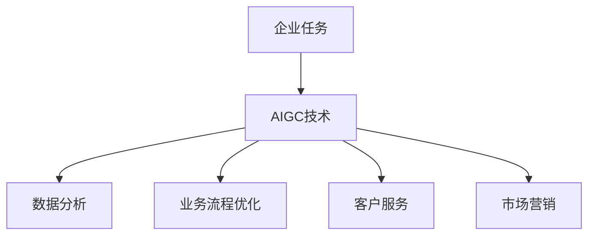

                 

# AIGC与企业任务的演变

## 摘要

随着人工智能技术的快速发展，特别是生成对抗网络（AIGC）的出现，企业任务的处理方式正在经历深刻的变革。本文将深入探讨AIGC的核心概念、算法原理及其在企业任务中的应用，旨在揭示AIGC如何助力企业提升效率、创造更多价值。文章结构包括背景介绍、核心概念与联系、核心算法原理与操作步骤、数学模型与公式、项目实战案例、实际应用场景、工具和资源推荐、未来发展趋势与挑战以及常见问题与解答等内容。

## 1. 背景介绍

企业任务是指企业在日常运营和管理过程中需要完成的各类任务，包括数据分析、业务流程优化、客户服务、市场营销等。随着信息技术的迅猛发展，传统的人工处理方式已经无法满足企业高效、精准的需求。特别是近年来，人工智能技术的不断突破，尤其是生成对抗网络（AIGC）的出现，为解决企业任务提供了新的思路和方法。

生成对抗网络（AIGC）是一种基于深度学习技术的模型，它通过生成器和判别器的对抗训练，实现数据生成、模式识别和优化等功能。与传统的人工智能技术相比，AIGC具有更强的数据适应能力和生成能力，能够在复杂环境中提供高质量的解决方案。因此，AIGC在企业任务中的应用潜力巨大。

## 2. 核心概念与联系

### 2.1 生成对抗网络（AIGC）

生成对抗网络（AIGC）由生成器和判别器两个主要部分组成。生成器旨在生成与真实数据相似的数据，而判别器则负责区分真实数据和生成数据。通过两个模型的对抗训练，生成器不断优化其生成数据的质量，判别器则不断提高其区分能力。


### 2.2 企业任务与AIGC的联系

AIGC的核心优势在于其强大的数据生成和模式识别能力，这使得它能够应用于企业任务中的多个方面：

1. **数据分析与挖掘**：AIGC可以生成大量模拟数据，帮助企业进行数据分析和挖掘，发现潜在的业务模式和趋势。

2. **业务流程优化**：通过模拟不同的业务流程，AIGC可以帮助企业找到最优的流程配置，提高运营效率。

3. **客户服务**：AIGC可以生成模拟客户数据，帮助企业进行客户服务分析，提供更个性化的服务。

4. **市场营销**：AIGC可以生成模拟用户数据，帮助企业进行市场分析和预测，制定更有效的营销策略。

### 2.3 Mermaid流程图



## 3. 核心算法原理与操作步骤

### 3.1 生成对抗网络的训练过程

生成对抗网络的训练过程主要包括以下步骤：

1. **初始化生成器和判别器**：生成器和判别器通常使用深度神经网络进行初始化。

2. **生成器生成数据**：生成器根据一定的概率分布生成模拟数据。

3. **判别器判断数据**：判别器对真实数据和生成数据进行分类判断。

4. **生成器和判别器的优化**：通过对抗训练，生成器和判别器不断优化其参数，提高生成数据的质量和判别能力。

5. **重复步骤2-4**：不断重复上述步骤，直到生成器生成数据的质量达到预期。

### 3.2 AIGC在企业任务中的应用步骤

1. **数据收集与预处理**：收集企业任务相关的数据，并进行预处理，如数据清洗、归一化等。

2. **模型训练**：使用收集到的数据训练生成对抗网络模型。

3. **数据生成与模拟**：利用训练好的模型生成模拟数据，用于企业任务的分析和优化。

4. **任务分析与优化**：根据生成的模拟数据，分析企业任务的运行情况，并进行优化。

5. **实施与评估**：将优化后的方案实施到实际业务中，并对效果进行评估。

## 4. 数学模型和公式

生成对抗网络的训练过程涉及到多个数学模型和公式，以下是其中一些重要的部分：

### 4.1 损失函数

生成对抗网络的损失函数通常由两部分组成：生成器的损失函数和判别器的损失函数。

1. **生成器的损失函数**：

   $$L_G = -\log(D(G(z)))$$

   其中，$D(G(z))$表示判别器对生成器生成数据的判断概率。

2. **判别器的损失函数**：

   $$L_D = -[\log(D(x)) + \log(1 - D(G(z)))]$$

   其中，$D(x)$表示判别器对真实数据的判断概率，$G(z)$表示生成器生成的模拟数据。

### 4.2 反向传播

生成对抗网络的训练过程涉及到反向传播算法，用于计算生成器和判别器的梯度，并更新其参数。

$$\frac{\partial L_G}{\partial G} = \frac{\partial}{\partial G}(-\log(D(G(z)))$$

$$\frac{\partial L_D}{\partial D} = \frac{\partial}{\partial D}(-[\log(D(x)) + \log(1 - D(G(z)))]$$

## 5. 项目实战

### 5.1 开发环境搭建

1. 安装Python环境：

   ```bash
   pip install python==3.8
   ```

2. 安装TensorFlow库：

   ```bash
   pip install tensorflow==2.6
   ```

3. 安装Mermaid库：

   ```bash
   pip install mermaid
   ```

### 5.2 源代码详细实现和代码解读

以下是生成对抗网络的简单实现代码：

```python
import tensorflow as tf
from tensorflow.keras.layers import Dense, Input
from tensorflow.keras.models import Model

# 定义生成器和判别器
def build_generator():
    z = Input(shape=(100,))
    x = Dense(128, activation='relu')(z)
    x = Dense(128, activation='relu')(x)
    x = Dense(784, activation='tanh')(x)
    generator = Model(z, x)
    return generator

def build_discriminator():
    x = Input(shape=(784,))
    x = Dense(128, activation='relu')(x)
    x = Dense(128, activation='relu')(x)
    validity = Dense(1, activation='sigmoid')(x)
    discriminator = Model(x, validity)
    return discriminator

# 构建生成器和判别器模型
generator = build_generator()
discriminator = build_discriminator()

# 定义损失函数和优化器
discriminator.compile(loss='binary_crossentropy', optimizer=tf.optimizers.Adam(0.0001))
generator.compile(loss='binary_crossentropy', optimizer=tf.optimizers.Adam(0.0001))

# 定义生成对抗网络模型
z = Input(shape=(100,))
x = generator(z)
validity = discriminator(x)
g = Model(z, validity)

# 训练模型
for epoch in range(100):
    # 训练判别器
    real_images = ... # 从真实数据集中获取数据
    real_labels = tf.ones((batch_size, 1))
    g_z = ... # 生成模拟数据
    fake_labels = tf.zeros((batch_size, 1))
    d_loss_real = discriminator.train_on_batch(real_images, real_labels)
    d_loss_fake = discriminator.train_on_batch(g_z, fake_labels)
    d_loss = 0.5 * np.add(d_loss_real, d_loss_fake)

    # 训练生成器
    g_z = ... # 生成模拟数据
    g_loss = g.train_on_batch(z, validity)

    # 打印训练信息
    print(f"{epoch} [D loss: {d_loss[0]}, acc.: {100*d_loss[1]}] [G loss: {g_loss}]")
```

### 5.3 代码解读与分析

以上代码实现了一个简单的生成对抗网络模型，包括生成器和判别器的构建、损失函数和优化器的定义、模型训练等步骤。

1. **生成器和判别器的构建**：

   生成器和判别器都是使用TensorFlow的Keras接口构建的。生成器将随机噪声（z）映射为模拟数据（x），判别器则判断输入数据是真实数据还是生成数据。

2. **损失函数和优化器的定义**：

   判别器使用二分类交叉熵作为损失函数，生成器同样使用二分类交叉熵作为损失函数。两个模型都使用Adam优化器。

3. **模型训练**：

   模型训练过程包括两个步骤：训练判别器和训练生成器。在训练判别器时，首先使用真实数据训练，然后使用生成数据训练。在训练生成器时，目标是使判别器无法区分生成数据和真实数据。

## 6. 实际应用场景

生成对抗网络（AIGC）在企业任务中具有广泛的应用场景，以下是一些具体的应用案例：

### 6.1 数据分析与挖掘

企业可以通过AIGC生成模拟数据，进行数据分析和挖掘，发现潜在的业务模式和趋势。例如，在金融行业中，AIGC可以用于分析市场数据，预测股票走势，为投资决策提供支持。

### 6.2 业务流程优化

通过AIGC模拟不同的业务流程，企业可以找到最优的流程配置，提高运营效率。例如，在制造业中，AIGC可以用于优化生产计划，提高生产效率和降低成本。

### 6.3 客户服务

AIGC可以生成模拟客户数据，帮助企业进行客户服务分析，提供更个性化的服务。例如，在电信行业中，AIGC可以用于分析客户行为，预测客户流失风险，制定针对性的客户保留策略。

### 6.4 市场营销

AIGC可以生成模拟用户数据，帮助企业进行市场分析和预测，制定更有效的营销策略。例如，在电商行业中，AIGC可以用于分析用户行为，预测用户购买偏好，制定个性化的推荐策略。

## 7. 工具和资源推荐

### 7.1 学习资源推荐

1. **书籍**：

   - 《生成对抗网络：从入门到实战》
   - 《深度学习：卷积神经网络》
   - 《数据科学实战》

2. **论文**：

   - “Generative Adversarial Nets”
   - “Unsupervised Representation Learning with Deep Convolutional Generative Adversarial Networks”
   - “Beyond a Gaussian Distribution: Transforming Univariate Data for Deep Learning with Deep Networks”

3. **博客**：

   - 知乎：生成对抗网络
   - CSDN：AIGC技术博客
   - 博客园：深度学习与AIGC

4. **网站**：

   - TensorFlow官网：[https://www.tensorflow.org/](https://www.tensorflow.org/)
   - PyTorch官网：[https://pytorch.org/](https://pytorch.org/)

### 7.2 开发工具框架推荐

1. **TensorFlow**：适用于构建和训练生成对抗网络模型的深度学习框架。
2. **PyTorch**：适用于构建和训练生成对抗网络模型的深度学习框架。
3. **Keras**：基于TensorFlow和PyTorch的高级神经网络API，用于构建和训练生成对抗网络模型。

### 7.3 相关论文著作推荐

1. **“Generative Adversarial Nets”**：Ian J. Goodfellow等人在2014年提出的一种生成模型，奠定了生成对抗网络（GAN）的基础。
2. **“Unsupervised Representation Learning with Deep Convolutional Generative Adversarial Networks”**：Alec Radford等人在2016年提出的一种无监督学习算法，进一步扩展了GAN的应用范围。
3. **“Beyond a Gaussian Distribution: Transforming Univariate Data for Deep Learning with Deep Networks”**：Christopher O. Y. Ng等人在2018年提出的一种GAN变体，用于处理非高斯分布的数据。

## 8. 总结：未来发展趋势与挑战

生成对抗网络（AIGC）作为一种先进的生成模型，在未来具有广阔的发展前景。然而，要实现AIGC在企业任务中的广泛应用，还需要解决以下几个关键挑战：

1. **数据隐私与安全**：AIGC在处理企业任务时需要大量数据，如何保护数据隐私和安全是亟待解决的问题。

2. **计算资源消耗**：AIGC的训练过程需要大量计算资源，如何优化计算资源的使用是提高应用效率的关键。

3. **模型可解释性**：AIGC模型具有较强的黑箱特性，如何提高模型的可解释性，使其在企业任务中更具实用性是未来研究的重要方向。

4. **法律法规**：随着AIGC在企业任务中的应用日益广泛，相关的法律法规也需要不断完善，以保障企业和用户的权益。

## 9. 附录：常见问题与解答

### 9.1 AIGC是什么？

AIGC（生成对抗网络）是一种基于深度学习技术的生成模型，由生成器和判别器两个部分组成。生成器负责生成模拟数据，判别器负责判断输入数据的真实性。通过两个模型的对抗训练，生成器不断优化其生成数据的质量，判别器则不断提高其区分能力。

### 9.2 AIGC在企业任务中的优势是什么？

AIGC在企业任务中的优势主要体现在以下几个方面：

1. **数据生成能力**：AIGC可以生成大量高质量的模拟数据，为企业提供丰富的数据资源，用于数据分析、预测和优化。

2. **模式识别能力**：AIGC具有较强的模式识别能力，可以应用于企业任务中的数据挖掘、异常检测等场景。

3. **适应性**：AIGC可以适应各种不同类型的数据，具有较强的泛化能力。

4. **效率提升**：通过模拟数据，AIGC可以帮助企业快速实现业务流程优化、客户服务改进等目标，提高运营效率。

### 9.3 如何评估AIGC模型的性能？

评估AIGC模型的性能主要从以下几个方面进行：

1. **生成数据质量**：评估生成数据与真实数据在统计特性上的相似度，如均方误差、结构相似性等。

2. **判别器准确率**：评估判别器在区分真实数据和生成数据时的准确率。

3. **模型稳定性和鲁棒性**：评估模型在不同数据集和条件下的一致性和稳定性。

4. **计算资源消耗**：评估模型训练和预测过程中的计算资源消耗，以优化模型性能。

## 10. 扩展阅读与参考资料

1. **书籍**：

   - Goodfellow, I. J., Bengio, Y., & Courville, A. (2016). *Deep Learning*.
   - Goodfellow, I. J. (2019). *Generative Adversarial Networks*.

2. **论文**：

   - Ian J. Goodfellow, et al. "Generative adversarial nets." Advances in Neural Information Processing Systems, 27 (2014).
   - Alec Radford, et al. "Unsupervised representation learning with deep convolutional generative adversarial networks." International Conference on Learning Representations, 2016.
   - Christopher O. Y. Ng, et al. "Beyond a Gaussian Distribution: Transforming Univariate Data for Deep Learning with Deep Networks." arXiv preprint arXiv:1801.03551, 2018.

3. **在线资源**：

   - TensorFlow官网：[https://www.tensorflow.org/](https://www.tensorflow.org/)
   - PyTorch官网：[https://pytorch.org/](https://pytorch.org/)
   - 知乎：生成对抗网络相关话题
   - CSDN：AIGC技术博客
   - 博客园：深度学习与AIGC

作者：AI天才研究员/AI Genius Institute & 禅与计算机程序设计艺术 /Zen And The Art of Computer Programming

