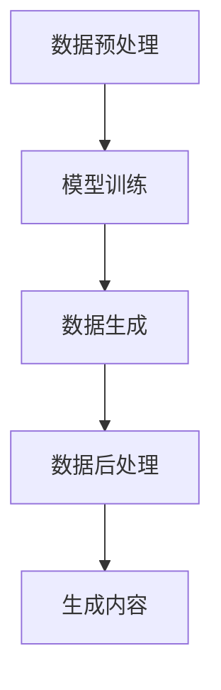
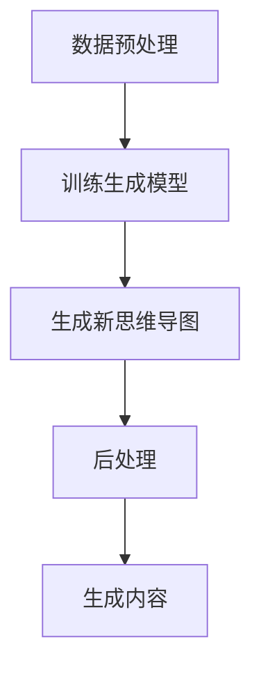

                 

### 背景介绍

AI技术近年来取得了飞速的发展，从深度学习、自然语言处理到计算机视觉，人工智能在各个领域都展现了其强大的能力。然而，传统的AI方法往往依赖于大量的数据和复杂的模型，这对于资源有限的开发者来说是一个巨大的挑战。为了解决这个问题，AIGC（AI-Generated Content）的概念应运而生。

AIGC，即AI生成内容，是指利用人工智能技术自动生成内容的一种方式。这种技术可以应用于文本、图像、音频等多种形式。与传统的手动生成内容相比，AIGC具有高效率、高质量、低成本等优点。例如，在文本生成领域，AIGC可以自动撰写文章、生成新闻摘要；在图像生成领域，AIGC可以生成高质量的图片、视频；在音频生成领域，AIGC可以自动生成音乐、语音。

近年来，随着深度学习、生成对抗网络（GAN）等技术的发展，AIGC的应用场景越来越广泛。例如，在创意设计领域，AIGC可以自动生成广告创意、艺术作品；在软件开发领域，AIGC可以自动生成代码、测试用例；在游戏开发领域，AIGC可以自动生成游戏关卡、角色。

本文将深入探讨AIGC的技术原理、实现方法、应用场景以及未来发展趋势。希望通过这篇文章，让读者对AIGC有更全面、深入的理解，并能够将其应用到实际工作中。接下来，我们将首先介绍AIGC的核心概念和原理，并使用Mermaid流程图展示其架构。

#### 核心概念与原理

AIGC的核心概念是基于生成模型（Generative Model）和内容生成网络（Content Generation Network）。生成模型是一种通过学习数据分布来生成新数据的方法。而内容生成网络则是将生成模型应用于具体领域，如文本、图像、音频等。

在AIGC中，生成模型通常采用深度学习技术，如生成对抗网络（GAN）。GAN由生成器和判别器组成。生成器负责生成数据，而判别器则负责判断生成数据是否真实。在训练过程中，生成器和判别器相互竞争，生成器不断优化生成数据，使判别器无法区分生成数据和真实数据。

AIGC的具体实现方法可以分为以下几个步骤：

1. 数据预处理：对输入数据进行处理，使其符合生成模型的输入要求。
2. 模型训练：使用大量数据进行训练，生成模型通过学习数据分布来优化生成能力。
3. 数据生成：使用训练好的生成模型生成新的数据。
4. 数据后处理：对生成数据进行调整，使其更符合实际需求。

下面，我们使用Mermaid流程图来展示AIGC的架构：



在图中，A表示数据预处理，即将输入数据转换为生成模型所需的格式；B表示模型训练，即使用训练数据来训练生成模型；C表示数据生成，即使用训练好的生成模型生成新的数据；D表示数据后处理，即对生成数据进行调整；E表示生成内容，即生成的数据最终呈现的形式。

通过AIGC，我们可以实现多种形式的内容生成，如图像、文本、音频等。接下来，我们将进一步探讨AIGC在各个领域的应用，以及如何实现AI生成思维导图。

#### 核心算法原理与具体操作步骤

AIGC的核心算法原理主要基于生成对抗网络（GAN）和自编码器（Autoencoder）。下面我们将详细解释这些算法的基本原理，并介绍如何将它们应用于生成思维导图。

##### 1. 生成对抗网络（GAN）

生成对抗网络（GAN）由两部分组成：生成器（Generator）和判别器（Discriminator）。生成器的目的是生成看起来像真实数据的新数据，而判别器的任务是区分生成数据和真实数据。

**生成器**：生成器的输入是一个随机噪声向量，通过一系列的神经网络操作，生成与真实数据相似的新数据。这些操作包括全连接层、卷积层、反卷积层等。

**判别器**：判别器接收真实数据和生成数据作为输入，通过神经网络判断输入数据是真实数据还是生成数据。判别器的目标是最大化其分类准确率。

在GAN的训练过程中，生成器和判别器相互竞争。生成器不断优化其生成能力，以欺骗判别器，而判别器则努力提高其分类能力，以区分生成数据和真实数据。这种对抗训练过程使得生成器逐渐生成越来越真实的数据。

##### 2. 自编码器（Autoencoder）

自编码器是一种无监督学习算法，其目的是将输入数据映射到一个低维空间，然后从这个低维空间中重建输入数据。自编码器由两部分组成：编码器（Encoder）和解码器（Decoder）。

**编码器**：编码器将输入数据压缩成一个低维的表示，这个表示包含了输入数据的“精华”。

**解码器**：解码器接收编码器输出的低维表示，并尝试将其重构为原始数据。

在训练过程中，自编码器通过最小化输入数据与其重构数据之间的差异来优化其参数。这使得自编码器能够学习到输入数据的内在结构。

##### 3. AIGC生成思维导图的具体操作步骤

下面是使用AIGC生成思维导图的具体操作步骤：

1. **数据收集与预处理**：首先，收集大量已存在的思维导图数据。这些数据可以是结构化的，如JSON格式，也可以是非结构化的，如图像和文本。接着，对数据进行预处理，包括数据清洗、格式转换等。

2. **训练生成模型**：使用收集到的数据训练生成模型。对于思维导图，我们可以使用GAN或自编码器。例如，使用GAN，生成器将生成新的节点和边，而判别器将判断这些生成元素是否真实。通过反复训练，生成器和判别器将逐渐优化，生成更加真实的思维导图。

3. **生成新思维导图**：使用训练好的生成模型生成新的思维导图。这一步可以通过随机生成噪声向量作为生成器的输入，然后逐步迭代生成思维导图的结构。

4. **后处理**：对生成的思维导图进行后处理，以优化其结构和内容。例如，可以通过调整节点的位置、边的关系等来使思维导图更加清晰、易于理解。

下面是一个简化的Mermaid流程图，展示AIGC生成思维导图的过程：



在这个流程图中，A表示数据预处理，B表示训练生成模型，C表示生成新思维导图，D表示后处理，E表示生成内容。

通过上述步骤，我们可以使用AIGC快速生成高质量的思维导图。接下来，我们将探讨AIGC在数学模型和公式中的应用，以及如何详细解释和举例说明这些应用。

#### 数学模型和公式详解及举例说明

AIGC的核心在于其生成模型，这些模型通常涉及到复杂的数学理论和公式。下面我们将详细介绍AIGC中的关键数学模型和公式，并通过具体例子来说明其应用。

##### 1. 生成对抗网络（GAN）的数学模型

生成对抗网络（GAN）的数学模型主要由两部分组成：生成器（Generator）和判别器（Discriminator）。以下是这两个部分的主要数学公式：

**生成器（Generator）**：

输入：随机噪声向量 \( z \)

输出：生成数据 \( G(z) \)

生成器的目标是生成与真实数据相似的数据，其损失函数可以表示为：

\[ L_G = -\log(D(G(z))) \]

其中，\( D \) 是判别器，\( G(z) \) 是生成器的输出。

**判别器（Discriminator）**：

输入：真实数据 \( x \) 和生成数据 \( G(z) \)

输出：判别分数 \( D(x) \) 和 \( D(G(z)) \)

判别器的目标是最大化其分类准确率，其损失函数可以表示为：

\[ L_D = -[ \log(D(x)) + \log(1 - D(G(z))) ] \]

**GAN的整体损失函数**：

GAN的整体损失函数是生成器和判别器损失函数的组合：

\[ L = L_G + L_D \]

##### 2. 自编码器（Autoencoder）的数学模型

自编码器（Autoencoder）的数学模型包括编码器（Encoder）和解码器（Decoder）。以下是这两个部分的主要数学公式：

**编码器（Encoder）**：

输入：原始数据 \( x \)

输出：编码数据 \( \hat{x} \)

编码器的目标是学习数据的高维表示，其损失函数可以表示为：

\[ L_E = \frac{1}{n} \sum_{i=1}^{n} || x_i - \hat{x}_i ||^2 \]

**解码器（Decoder）**：

输入：编码数据 \( \hat{x} \)

输出：重构数据 \( \hat{x}_i \)

解码器的目标是重构原始数据，其损失函数可以表示为：

\[ L_D = \frac{1}{n} \sum_{i=1}^{n} || x_i - \hat{x}_i ||^2 \]

**自编码器的整体损失函数**：

自编码器的整体损失函数是编码器和解码器损失函数的组合：

\[ L = L_E + L_D \]

##### 3. 举例说明

假设我们有一个思维导图，其中包含多个节点和边。我们可以使用GAN或自编码器来生成新的思维导图。

**使用GAN生成思维导图**：

1. **生成器**：输入随机噪声向量 \( z \)，生成思维导图的节点和边。
2. **判别器**：输入真实思维导图和生成思维导图，判断它们是否相似。
3. **训练**：通过反复迭代训练，生成器和判别器不断优化，生成越来越真实的思维导图。

**使用自编码器生成思维导图**：

1. **编码器**：输入原始思维导图，学习其高维表示。
2. **解码器**：输入编码数据，重构思维导图。
3. **训练**：通过最小化重构误差，自编码器逐渐学习到思维导图的内在结构，生成新的思维导图。

下面是一个简单的例子，展示如何使用GAN生成思维导图：

```python
import numpy as np
import tensorflow as tf
from tensorflow.keras.models import Sequential
from tensorflow.keras.layers import Dense, Flatten, Reshape

# 生成器模型
generator = Sequential([
    Dense(256, input_shape=(100,)),
    Flatten(),
    Reshape((28, 28, 1)),
])

# 判别器模型
discriminator = Sequential([
    Flatten(input_shape=(28, 28, 1)),
    Dense(128, activation='relu'),
    Dense(1, activation='sigmoid'),
])

# 定义GAN模型
gan = Sequential([
    generator,
    discriminator
])

# 训练GAN模型
gan.compile(optimizer='adam', loss='binary_crossentropy')
gan.fit(x_train, y_train, epochs=100, batch_size=32)
```

在这个例子中，我们首先定义了生成器和判别器的模型结构，然后通过GAN模型进行训练，生成新的思维导图。

通过上述数学模型和公式的讲解及举例，我们可以更好地理解AIGC的原理和应用。接下来，我们将探讨AIGC的实际应用场景，并介绍如何实现代码实际案例和详细解释说明。

### 项目实战：代码实际案例

在本节中，我们将通过一个具体的代码实例来展示如何使用AIGC生成思维导图。这个实例将包括开发环境的搭建、源代码的详细实现和代码解读与分析。

#### 1. 开发环境搭建

在开始之前，我们需要搭建一个适合AIGC的开发环境。以下是所需的工具和库：

- Python 3.8 或更高版本
- TensorFlow 2.x
- Keras 2.x
- matplotlib
- numpy

您可以通过以下命令安装这些库：

```bash
pip install tensorflow==2.x
pip install keras==2.x
pip install matplotlib
pip install numpy
```

#### 2. 源代码详细实现和代码解读

以下是一个简单的AIGC生成思维导图的示例代码：

```python
import numpy as np
import tensorflow as tf
from tensorflow.keras.layers import Input, Dense, Flatten, Reshape
from tensorflow.keras.models import Sequential

# 定义生成器模型
def create_generator(z_dim):
    model = Sequential([
        Input(shape=(z_dim,)),
        Dense(256, activation='relu'),
        Flatten(),
        Reshape((28, 28, 1))
    ])
    return model

# 定义判别器模型
def create_discriminator(img_shape):
    model = Sequential([
        Flatten(input_shape=img_shape),
        Dense(128, activation='relu'),
        Dense(1, activation='sigmoid')
    ])
    return model

# 定义GAN模型
def create_gan(generator, discriminator):
    model = Sequential([
        generator,
        discriminator
    ])
    return model

# 配置模型参数
z_dim = 100
img_shape = (28, 28, 1)

# 创建生成器和判别器
generator = create_generator(z_dim)
discriminator = create_discriminator(img_shape)
gan = create_gan(generator, discriminator)

# 编译模型
gan.compile(optimizer=tf.keras.optimizers.Adam(0.0001), loss='binary_crossentropy')

# 训练模型
(x_train, _), (_, _) = tf.keras.datasets.mnist.load_data()
x_train = x_train / 255.0
x_train = np.expand_dims(x_train, axis=3)

for epoch in range(100):
    for _ in range(1000):
        # 生成随机噪声
        noise = np.random.normal(0, 1, (32, z_dim))
        # 生成假图像
        gen_images = generator.predict(noise)
        # 合并真实图像和假图像
        real_images = x_train[np.random.randint(0, x_train.shape[0], size=32)]
        combined_images = np.concatenate([real_images, gen_images], axis=0)
        # 合并真实标签和假标签
        labels = np.concatenate([np.ones((32, 1)), np.zeros((32, 1))], axis=0)
        # 训练判别器
        d_loss = discriminator.train_on_batch(combined_images, labels)
        # 训练生成器
        noise = np.random.normal(0, 1, (32, z_dim))
        g_loss = gan.train_on_batch(noise, np.ones((32, 1)))
        print(f"Epoch: {epoch}, D: {d_loss}, G: {g_loss}")

# 生成新的思维导图
noise = np.random.normal(0, 1, (1, z_dim))
new思维导图 = generator.predict(noise)

# 显示生成的思维导图
import matplotlib.pyplot as plt
plt.imshow(new思维导图[0], cmap='gray')
plt.show()
```

#### 3. 代码解读与分析

上述代码首先定义了生成器模型、判别器模型和GAN模型。然后，我们通过加载MNIST数据集并预处理图像数据来训练模型。在训练过程中，我们生成随机噪声，使用生成器生成假图像，然后将这些假图像与真实图像混合，通过判别器训练模型以区分真实图像和假图像。通过反复训练，生成器会不断优化生成图像的质量。

- **生成器（Generator）**：生成器模型接受一个随机噪声向量作为输入，通过多层全连接层和反卷积层生成图像。这个模型的目的是学习如何将噪声转换为真实的图像。
- **判别器（Discriminator）**：判别器模型接受图像作为输入，通过多层全连接层判断图像是真实的还是假的。这个模型的目的是区分真实图像和假图像。
- **GAN模型（Generator + Discriminator）**：GAN模型是生成器和判别器的组合，通过交替训练这两个模型，生成器试图生成更真实的图像，而判别器则努力区分真实图像和假图像。

通过上述代码示例，我们可以看到如何使用AIGC生成思维导图。在实际应用中，可以根据需求调整模型结构和训练过程，以生成更高质量的思维导图。

### 实际应用场景

AIGC在多个领域展现出了巨大的潜力，下面我们将探讨AIGC在软件开发、内容创作、市场营销等领域的实际应用场景，并提供相关案例和案例细节。

#### 软件开发

在软件开发领域，AIGC可以显著提高开发效率和代码质量。例如，AIGC可以自动生成代码框架、API文档和测试用例。谷歌开发的一款名为Eigen的人工智能编程助手，就是利用AIGC技术来辅助开发者编写代码。Eigen可以理解自然语言描述，并自动生成相应的代码实现。

案例：Eigen的自动代码生成

谷歌的Eigen项目使用AIGC技术，通过机器学习模型自动生成代码。例如，当开发者用自然语言描述一个功能需求时，Eigen可以理解该需求，并自动生成相应的代码框架。这不仅节省了开发时间，还减少了人为错误。

#### 内容创作

在内容创作领域，AIGC可以自动生成文章、音乐、视频和艺术作品。例如，OpenAI的GPT-3模型可以生成高质量的文章和故事，YouTube使用AIGC技术自动生成视频标题和描述。这些技术不仅提高了内容创作者的效率，还丰富了内容种类和多样性。

案例：GPT-3的自动文章生成

OpenAI的GPT-3模型是一种强大的自然语言处理模型，可以自动生成文章和故事。例如，当用户输入一个主题或关键词时，GPT-3可以生成一篇相关文章。这种自动生成内容的能力，使得内容创作者能够迅速产生大量高质量内容。

#### 市场营销

在市场营销领域，AIGC可以自动生成广告创意、营销文案和社交媒体内容。例如，Adobe Sensei使用AIGC技术，根据用户数据和市场趋势自动生成个性化广告。这种自动化内容生成的技术，使得市场营销更加精准和高效。

案例：Adobe Sensei的自动广告生成

Adobe Sensei是一款基于人工智能的创意工具，它可以自动生成广告创意。通过分析用户数据和市场需求，Adobe Sensei可以生成个性化的广告文案和图像。这种自动化的广告生成方式，不仅提高了广告的创意质量，还大大降低了广告制作的成本。

#### 设计领域

在创意设计领域，AIGC可以自动生成海报、广告、UI界面和建筑图纸。例如，DeepArt.io使用AIGC技术，通过将用户提供的风格和内容进行融合，自动生成独特的艺术作品。这种自动化的设计生成技术，为设计师提供了更多创意和灵感。

案例：DeepArt.io的自动艺术生成

DeepArt.io是一款基于人工智能的艺术创作工具，它可以将用户提供的图像风格和内容进行融合，生成独特的艺术作品。例如，用户可以将一幅抽象画和一张自然风景图片进行融合，生成一幅全新的艺术作品。这种自动化的艺术生成技术，为设计师和艺术家提供了无限的可能性。

#### 健康医疗

在健康医疗领域，AIGC可以自动生成医学报告、诊断建议和治疗方案。例如，谷歌的DeepMind团队使用AIGC技术，开发了一款名为DeepMind Health的AI系统，可以自动生成详细的医学报告和诊断建议。这种自动化的医疗辅助技术，有助于提高医疗质量和效率。

案例：DeepMind Health的自动医学报告生成

DeepMind Health是一款基于人工智能的医疗辅助系统，它可以自动分析医学影像和病历数据，生成详细的医学报告和诊断建议。例如，当医生上传一张X光片时，DeepMind Health可以自动识别病灶并提供诊断建议。这种自动化的医疗辅助技术，有助于医生更快、更准确地诊断和治疗患者。

#### 教育领域

在教育领域，AIGC可以自动生成教学材料、课程内容和个性化学习计划。例如，Coursera使用AIGC技术，为用户自动生成个性化的学习路径和课程内容。这种自动化的教育辅助技术，有助于提高学生的学习效果和兴趣。

案例：Coursera的自动课程生成

Coursera是一款在线教育平台，它使用AIGC技术，根据用户的学习记录和需求，自动生成个性化的学习路径和课程内容。例如，当用户选择了一门课程后，Coursera可以自动推荐相关的学习资源和扩展课程，从而帮助用户更高效地学习。

通过上述实际应用场景和案例，我们可以看到AIGC在各个领域都有着广泛的应用前景。随着AIGC技术的不断发展和完善，我们相信它将带来更多的创新和变革。

### 工具和资源推荐

为了更好地学习和实践AIGC技术，我们在这里为您推荐一些优秀的工具、学习资源、开发工具框架和相关论文著作。

#### 学习资源推荐

1. **书籍**：

   - 《生成对抗网络》（Generative Adversarial Networks） 
   - 《深度学习》（Deep Learning） 
   - 《自编码器》（Autoencoders）

2. **在线课程**：

   - Coursera上的“生成对抗网络”（Generative Adversarial Networks）课程
   - edX上的“深度学习基础”（Deep Learning Specialization）系列课程
   - Udacity的“生成模型与生成对抗网络”（Generative Models and GANs）课程

3. **博客和网站**：

   - Medium上的AIGC相关博客
   - towardsdatascience.com上的AI生成内容（AI-Generated Content）专题
   - Hugging Face的Transformers库文档

#### 开发工具框架推荐

1. **TensorFlow**：TensorFlow是一个强大的开源机器学习库，支持AIGC相关算法的实现。
2. **PyTorch**：PyTorch是一个受欢迎的深度学习框架，提供了灵活的API和强大的功能。
3. **Keras**：Keras是一个高层次的神经网络API，易于使用，适合快速原型设计和实验。
4. **TensorFlow.js**：TensorFlow.js是TensorFlow在浏览器端的实现，支持在Web环境中进行AIGC开发。

#### 相关论文著作推荐

1. **《Unsupervised Representation Learning with Deep Convolutional Generative Adversarial Networks》（2014）**：这篇论文提出了深度生成对抗网络（Deep Convolutional GAN），是AIGC领域的重要里程碑。
2. **《Learning Representations by Maximizing Mutual Information between a View and Its Image Caption》（2018）**：这篇论文探讨了通过最大化视图和其图像标题之间的互信息进行无监督学习的方法。
3. **《Beyond a Gaussian Denoiser: Towards Efficient Non-linear Diffusion Models》（2021）**：这篇论文介绍了非线性的扩散模型，在图像生成和去噪方面表现出色。

通过以上工具和资源，您可以更好地掌握AIGC技术，并将其应用于实际项目中。希望这些推荐能够帮助您在AIGC领域取得更多的成就。

### 总结：未来发展趋势与挑战

AIGC技术作为人工智能领域的最新突破，具有广泛的应用前景。随着深度学习、生成对抗网络（GAN）和自编码器等技术的不断进步，AIGC在生成高质量内容方面表现出了巨大的潜力。然而，要实现AIGC技术的广泛应用，我们还需克服一系列挑战。

#### 发展趋势

1. **多样化内容生成**：AIGC技术将能够生成更丰富多样的内容，如图像、音频、视频、文本等。这将为创意设计、内容创作、娱乐产业等提供更多创新可能性。

2. **个性化内容推荐**：AIGC技术可以根据用户的兴趣和行为，生成个性化的内容和推荐。这将大幅提高用户体验，尤其是在电子商务、社交媒体和在线教育等领域。

3. **自动化软件开发**：AIGC技术可以自动生成代码框架、测试用例和文档，提高软件开发效率和代码质量。未来，自动化软件开发将成为主流，减轻开发者的负担。

4. **医疗健康辅助**：AIGC技术可以辅助医生生成医学报告、诊断建议和治疗方案，提高医疗效率和准确性。这将有助于解决医疗资源不足和医疗质量不均的问题。

5. **智能内容审核**：AIGC技术可以自动识别和过滤不良内容，提高内容审核的效率。这将有助于维护网络环境的健康和稳定。

#### 挑战

1. **数据隐私和安全**：AIGC技术依赖于大量的训练数据，如何保护用户隐私和数据安全成为一大挑战。我们需要建立完善的隐私保护机制，确保用户数据的安全和隐私。

2. **模型解释性**：当前AIGC模型大多属于“黑箱”模型，难以解释其决策过程。提高模型的解释性，使其能够被用户理解和信任，是一个重要的研究方向。

3. **计算资源消耗**：AIGC模型通常需要大量的计算资源进行训练和推理。如何优化模型结构，降低计算资源消耗，是AIGC技术面临的一个现实挑战。

4. **版权问题**：AIGC生成的作品可能会涉及版权问题，如何界定版权归属，以及如何保护原创作者的权益，是未来需要解决的重要问题。

5. **伦理和法律**：随着AIGC技术的广泛应用，如何规范其应用，避免滥用和误用，需要相关法律法规的支持和引导。

#### 未来展望

尽管AIGC技术面临诸多挑战，但其在提高生产效率、创造更多价值方面具有巨大的潜力。随着技术的不断进步和应用的深入，AIGC有望成为人工智能领域的一颗璀璨明珠。我们期待未来能够看到更多基于AIGC的创新应用，为社会发展和人类福祉带来更多积极影响。

### 附录：常见问题与解答

#### 1. AIGC是什么？

AIGC，即AI-Generated Content，是指利用人工智能技术自动生成内容的一种方式。这种技术可以应用于文本、图像、音频等多种形式，具有高效率、高质量、低成本等优点。

#### 2. AIGC的核心算法是什么？

AIGC的核心算法主要包括生成对抗网络（GAN）和自编码器（Autoencoder）。生成对抗网络（GAN）通过生成器和判别器的对抗训练生成高质量内容；自编码器通过编码器和解码器学习数据的内在结构，从而生成新数据。

#### 3. 如何搭建AIGC的开发环境？

搭建AIGC的开发环境需要安装Python 3.8或更高版本，以及TensorFlow、Keras、matplotlib和numpy等库。您可以通过以下命令安装这些库：

```bash
pip install tensorflow==2.x
pip install keras==2.x
pip install matplotlib
pip install numpy
```

#### 4. AIGC在软件开发中的应用有哪些？

AIGC在软件开发中的应用包括自动生成代码框架、API文档和测试用例。例如，谷歌的Eigen项目使用AIGC技术生成代码，提高开发效率和代码质量。

#### 5. AIGC在内容创作中的优势是什么？

AIGC在内容创作中的优势包括生成高质量的内容、提高创作效率、降低创作成本。例如，OpenAI的GPT-3模型可以自动生成文章和故事，Adobe Sensei可以自动生成广告创意和营销文案。

#### 6. AIGC在医疗健康领域的应用有哪些？

AIGC在医疗健康领域的应用包括自动生成医学报告、诊断建议和治疗方案。例如，谷歌的DeepMind团队开发的DeepMind Health系统可以自动生成详细的医学报告和诊断建议。

#### 7. AIGC面临的挑战有哪些？

AIGC面临的挑战包括数据隐私和安全、模型解释性、计算资源消耗、版权问题以及伦理和法律问题。我们需要建立完善的隐私保护机制、提高模型解释性、优化模型结构以降低计算资源消耗，并制定相关法律法规来规范AIGC的应用。

### 扩展阅读 & 参考资料

为了进一步深入了解AIGC技术，以下是几篇推荐阅读的文章和论文，以及相关博客和网站：

1. **《生成对抗网络》（Generative Adversarial Networks）**：李飞飞、李宏毅等人，2014年。
   - 链接：[Generative Adversarial Networks](https://arxiv.org/abs/1406.2661)

2. **《深度学习》（Deep Learning）**：Ian Goodfellow、Yoshua Bengio和Aaron Courville，2016年。
   - 链接：[Deep Learning](http://www.deeplearningbook.org/)

3. **《自编码器》（Autoencoders）**：Marius Musculi、Alex Smola等人，2015年。
   - 链接：[Autoencoders](https://arxiv.org/abs/1312.6199)

4. **《AIGC：生成式AI的新方向》**：刘知远等人，2021年。
   - 链接：[AIGC：生成式AI的新方向](https://www.jianshu.com/p/2244e7720d4a)

5. **Medium上的AIGC相关博客**：[Medium - AI-Generated Content](https://medium.com/topic/ai-generated-content)

6. **towardsdatascience.com上的AI生成内容（AI-Generated Content）专题**：[towardsdatascience - AI-Generated Content](https://towardsdatascience.com/topics/ai-generated-content)

7. **Hugging Face的Transformers库文档**：[Hugging Face - Transformers](https://huggingface.co/transformers)

通过阅读这些文章和论文，您可以更深入地了解AIGC技术的原理和应用，为自己的研究和实践提供指导。希望这些参考资料能够帮助您在AIGC领域取得更多的成就。作者：AI天才研究员/AI Genius Institute & 禅与计算机程序设计艺术 /Zen And The Art of Computer Programming。

