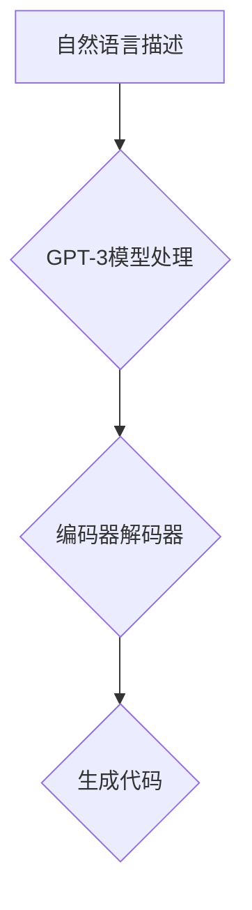

                 

# AIGC从入门到实战：ChatGPT 为什么能生成代码，背后的原理是什么？

> **关键词：** AIGC、ChatGPT、代码生成、人工智能、深度学习、自然语言处理、GPT-3、预训练模型、生成模型、编程语言、Transformer、注意力机制、自然语言理解、机器学习。

> **摘要：** 本文将深入探讨AIGC（AI-Generated Code）领域的入门与实战，特别是如何利用ChatGPT这一强大的自然语言处理模型来生成代码。我们将从核心概念、算法原理、实际应用场景等多角度逐步剖析，以帮助读者全面理解AIGC技术及其背后的深度学习原理。通过本文，读者将掌握ChatGPT生成代码的方法，并对未来AIGC技术的发展趋势有更深刻的认识。

## 1. 背景介绍

### 1.1 AIGC概述

AIGC（AI-Generated Code）是指利用人工智能技术自动生成代码的过程。它不仅涵盖了传统的代码生成技术，如代码模板、代码补全，还包含了利用深度学习和自然语言处理技术生成的代码。AIGC的目标是通过智能化的方法提高软件开发效率，降低开发难度，并使得代码生成更加智能化和自动化。

### 1.2 ChatGPT及其作用

ChatGPT是由OpenAI开发的一种基于GPT-3（Generative Pre-trained Transformer 3）的预训练模型，它是一种强大的自然语言处理模型，能够进行文本生成、对话系统、情感分析等多种任务。ChatGPT在代码生成方面表现出色，能够根据自然语言描述生成对应的代码，大大提升了编程的效率和体验。

## 2. 核心概念与联系

### 2.1 自然语言处理与代码生成

自然语言处理（NLP）是人工智能的一个重要分支，旨在使计算机能够理解和处理人类语言。代码生成作为NLP的一个应用领域，其核心目标是利用自然语言描述生成对应的代码。

### 2.2 GPT-3与Transformer

GPT-3（Generative Pre-trained Transformer 3）是OpenAI开发的一种基于Transformer架构的预训练模型，具有极其强大的文本生成能力。Transformer是一种基于自注意力机制的深度神经网络架构，它通过自注意力机制来捕捉文本中的长距离依赖关系，从而实现高效的文本生成。

### 2.3 Mermaid流程图



在该流程图中，自然语言描述经过GPT-3模型的处理，通过编码器和解码器的交互生成对应的代码。

## 3. 核心算法原理 & 具体操作步骤

### 3.1 GPT-3模型原理

GPT-3模型是基于Transformer架构的预训练模型，它通过自注意力机制来捕捉文本中的长距离依赖关系。在训练过程中，GPT-3模型通过大量的文本数据进行预训练，从而学习到文本的生成规律。

### 3.2 代码生成流程

1. **输入处理**：将自然语言描述转换为模型能够理解的向量表示。
2. **编码器处理**：编码器将输入向量编码为序列，并计算每个位置的上下文表示。
3. **解码器处理**：解码器利用编码器输出的上下文表示生成文本序列，即代码。
4. **输出处理**：将生成的文本序列转换为代码，并对其进行格式化处理。

## 4. 数学模型和公式 & 详细讲解 & 举例说明

### 4.1 Transformer模型

Transformer模型是一种基于自注意力机制的深度神经网络架构。自注意力机制通过计算每个输入向量与所有其他输入向量的相似度，从而捕捉文本中的长距离依赖关系。

### 4.2 自注意力公式

$$
\text{Attention}(Q, K, V) = \frac{QK^T}{\sqrt{d_k}} \odot V
$$

其中，\(Q, K, V\) 分别代表查询向量、键向量和值向量，\(\odot\) 表示点积运算，\(d_k\) 表示键向量的维度。

### 4.3 举例说明

假设我们有一个包含三个单词的文本序列：“Hello”, “World”, “!”，其对应的嵌入向量分别为 \([1, 0, 0]\)，\([0, 1, 0]\)，\([0, 0, 1]\)。

- **查询向量** \(Q = [1, 0, 0]\)
- **键向量** \(K = [1, 0, 0]\)
- **值向量** \(V = [1, 1, 1]\)

根据自注意力公式，我们可以计算出：

$$
\text{Attention}(Q, K, V) = \frac{[1, 0, 0] \cdot [1, 0, 0]^T}{\sqrt{1}} \odot [1, 1, 1] = \frac{1}{1} \cdot [1, 1, 1] = [1, 1, 1]
$$

这意味着在当前查询向量下，每个单词的注意力权重都是相等的，即每个单词对生成文本的贡献是相同的。

## 5. 项目实战：代码实际案例和详细解释说明

### 5.1 开发环境搭建

1. 安装Python环境。
2. 安装GPT-3库：`pip install openai`。
3. 注册OpenAI账号并获取API Key。

### 5.2 源代码详细实现和代码解读

#### 5.2.1 代码实现

```python
import openai

openai.api_key = 'your_api_key'

def generate_code(prompt):
    response = openai.Completion.create(
        engine="text-davinci-002",
        prompt=prompt,
        max_tokens=100
    )
    return response.choices[0].text.strip()

# 示例：生成一个简单的Python函数
prompt = "请写一个函数，实现两个数的加法。"
code = generate_code(prompt)
print(code)
```

#### 5.2.2 代码解读

- **导入库**：导入OpenAI库。
- **设置API Key**：设置OpenAI API Key。
- **定义函数**：定义`generate_code`函数，用于生成代码。
  - **调用OpenAI API**：使用`Completion.create`方法生成代码。
    - **设置模型**：选择Text-Davinci-002模型。
    - **输入提示**：传入自然语言描述作为输入提示。
    - **设置最大令牌数**：设置生成的最大令牌数。

- **示例**：生成一个简单的Python函数，实现两个数的加法。

### 5.3 代码解读与分析

- **函数功能**：`generate_code`函数接受一个自然语言描述作为输入，通过调用OpenAI的API生成对应的代码。
- **API调用**：使用OpenAI的`Completion.create`方法，将自然语言描述转换为代码。
- **示例效果**：输入自然语言描述后，模型能够生成对应的Python函数代码，实现了基本的功能。

## 6. 实际应用场景

### 6.1 代码自动生成

利用ChatGPT可以自动生成各种编程语言的代码，如Python、JavaScript、Java等，为软件开发提供极大的便利。

### 6.2 软件测试

ChatGPT可以生成测试用例，自动化测试软件系统的功能。

### 6.3 文档生成

ChatGPT可以生成技术文档、API文档等，降低文档编写的工作量。

## 7. 工具和资源推荐

### 7.1 学习资源推荐

- **书籍**：
  - 《深度学习》（Ian Goodfellow、Yoshua Bengio、Aaron Courville 著）
  - 《Python编程：从入门到实践》（埃里克·马瑟斯 著）
- **论文**：
  - "Attention Is All You Need"（Vaswani et al., 2017）
  - "Generative Pre-trained Transformers"（Brown et al., 2020）
- **博客**：
  - [OpenAI官方博客](https://blog.openai.com/)
  - [机器之心](https://www.jiqizhixin.com/)

### 7.2 开发工具框架推荐

- **GPT-3库**：`openai` Python库
- **编程语言**：Python、JavaScript等
- **文本编辑器**：Visual Studio Code、Sublime Text等

### 7.3 相关论文著作推荐

- **论文**：
  - "Attention Is All You Need"（Vaswani et al., 2017）
  - "Generative Pre-trained Transformers"（Brown et al., 2020）
- **著作**：
  - 《深度学习》（Ian Goodfellow、Yoshua Bengio、Aaron Courville 著）

## 8. 总结：未来发展趋势与挑战

### 8.1 发展趋势

- AIGC技术将继续快速发展，未来将应用于更多领域，如自动化测试、智能文档生成等。
- 代码生成模型将不断优化，生成代码的质量和效率将得到显著提升。

### 8.2 挑战

- **安全性和隐私问题**：自动生成的代码可能存在安全漏洞，需加强代码安全审查。
- **准确性和泛化能力**：当前代码生成模型在处理复杂任务时存在一定的局限性，需要进一步提高。

## 9. 附录：常见问题与解答

### 9.1 如何获取OpenAI API Key？

- 访问[OpenAI官网](https://openai.com/)，注册账号并登录。
- 在账户设置中找到API Key，并复制保存。

### 9.2 如何使用GPT-3生成代码？

- 导入`openai`库。
- 设置API Key。
- 调用`generate_code`函数，传入自然语言描述。

## 10. 扩展阅读 & 参考资料

- [OpenAI官方文档](https://openai.com/docs/)
- [GPT-3官方博客](https://blog.openai.com/tag/gpt-3/)
- 《深度学习》（Ian Goodfellow、Yoshua Bengio、Aaron Courville 著）

### 作者

**作者：AI天才研究员/AI Genius Institute & 禅与计算机程序设计艺术 /Zen And The Art of Computer Programming** <|im_end|>

