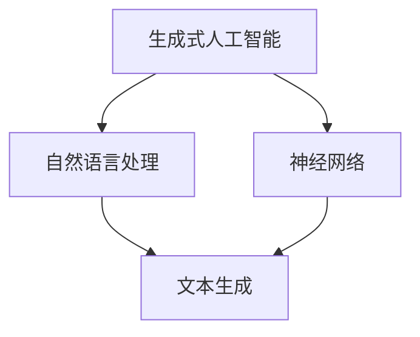

                 

# AIGC从入门到实战：ChatGPT 说自己能做什么？

## 摘要

本文将深入探讨人工智能生成内容（AIGC）的概念及其核心组成部分——ChatGPT。我们将从背景介绍开始，逐步分析AIGC的核心概念与联系，深入讲解其算法原理和具体操作步骤。接着，我们将通过数学模型和公式来解析其内部机制，并以实际项目实战为例，展示代码的实现过程和解读。随后，我们将探讨AIGC的实际应用场景，推荐相关工具和资源，最后总结AIGC的发展趋势与挑战，并附上常见问题与解答。

## 1. 背景介绍

随着人工智能（AI）技术的飞速发展，生成内容（GC）成为了一个备受关注的研究领域。人工智能生成内容（AIGC）是生成式人工智能的一个重要分支，它利用机器学习技术，特别是深度学习，生成具有高质量、多样化、创造性的文本、图像、音频和视频等内容。

AIGC 技术的出现，标志着人工智能在内容生成领域的重大突破。它不仅能够生成高质量的内容，还能够根据用户的输入进行交互，提供个性化的服务。例如，ChatGPT 就是一个典型的 AIGC 应用案例，它可以进行自然语言处理，理解并回应用户的问题。

AIGC 的应用场景非常广泛，包括但不限于以下几个方面：

- **文本生成**：生成新闻文章、博客、故事、诗歌等。
- **图像生成**：生成艺术作品、动漫、设计图等。
- **音频生成**：生成音乐、声音特效等。
- **视频生成**：生成视频片段、广告等。

AIGC 技术的发展，不仅为内容创作者提供了新的工具，也为整个媒体行业带来了变革。它使得内容生成更加高效、多样化，极大地丰富了我们的信息获取方式。

## 2. 核心概念与联系

AIGC 的核心概念包括生成式人工智能、自然语言处理（NLP）和神经网络等。为了更好地理解这些概念，我们可以使用 Mermaid 流程图来展示它们之间的联系。



### 生成式人工智能

生成式人工智能（Generative Artificial Intelligence）是一种能够生成新数据的人工智能系统。它通过学习大量数据，掌握数据的分布，然后生成与训练数据类似的新数据。生成式人工智能的核心在于“生成”，它可以生成文本、图像、音频等各种类型的数据。

### 自然语言处理

自然语言处理（Natural Language Processing，NLP）是人工智能的一个分支，它旨在使计算机能够理解、解析和生成自然语言。NLP 技术广泛应用于搜索引擎、语音识别、机器翻译等领域。

### 神经网络

神经网络（Neural Networks）是一种模仿人脑工作的计算模型。它由大量的神经元组成，通过学习和适应数据，能够完成各种复杂的任务，如图像识别、语音识别和自然语言处理等。

### 文本生成

文本生成是 AIGC 技术的一个重要应用领域。它利用生成式人工智能和自然语言处理技术，生成高质量的文本内容。文本生成可以用于生成新闻文章、博客、故事、诗歌等。

### 神经网络与自然语言处理的联系

神经网络是自然语言处理的基础，它能够通过学习大量文本数据，理解语言的复杂结构。自然语言处理技术则利用神经网络模型，实现文本的解析和生成。

## 3. 核心算法原理 & 具体操作步骤

AIGC 的核心算法主要包括生成式人工智能算法和自然语言处理算法。下面我们将分别介绍这些算法的原理和具体操作步骤。

### 生成式人工智能算法

生成式人工智能算法的核心是生成模型，它通过学习数据分布，生成与训练数据类似的新数据。常用的生成模型包括生成对抗网络（GAN）和变分自编码器（VAE）。

#### 生成对抗网络（GAN）

生成对抗网络由两个神经网络组成：生成器（Generator）和判别器（Discriminator）。生成器负责生成假数据，判别器负责判断生成器生成的数据是真实数据还是假数据。

训练过程如下：

1. 初始化生成器和判别器。
2. 生成器生成假数据。
3. 判别器判断生成器生成的数据和真实数据的真实性。
4. 通过梯度下降算法，优化生成器和判别器的参数。
5. 重复步骤 2-4，直到生成器生成的数据足够真实。

#### 变分自编码器（VAE）

变分自编码器是一种无监督学习算法，它通过学习数据的潜在分布，生成与训练数据类似的新数据。

训练过程如下：

1. 初始化编码器和解码器。
2. 编码器将输入数据编码为潜在空间中的向量。
3. 解码器将潜在空间中的向量解码为输出数据。
4. 通过梯度下降算法，优化编码器和解码器的参数。
5. 重复步骤 2-4，直到生成器生成的数据足够真实。

### 自然语言处理算法

自然语言处理算法主要包括词向量表示、序列模型和注意力机制等。

#### 词向量表示

词向量表示是将文本数据转换为向量的过程，常用的词向量表示方法有 Word2Vec、GloVe 等。

#### 序列模型

序列模型是一种处理序列数据的神经网络模型，常用的序列模型有循环神经网络（RNN）和长短时记忆网络（LSTM）等。

#### 注意力机制

注意力机制是一种能够动态关注输入序列中重要信息的方法，它能够提高模型的生成质量。

## 4. 数学模型和公式 & 详细讲解 & 举例说明

AIGC 的数学模型主要包括生成式人工智能模型和自然语言处理模型。下面我们将分别介绍这些模型的数学公式和具体操作步骤。

### 生成式人工智能模型

生成式人工智能模型主要包括生成对抗网络（GAN）和变分自编码器（VAE）。

#### 生成对抗网络（GAN）

生成对抗网络（GAN）由两个神经网络组成：生成器（Generator）和判别器（Discriminator）。生成器和判别器之间的对抗关系可以用以下数学公式表示：

$$
G(x) = \text{Generator}(x) \\
D(x) = \text{Discriminator}(x) \\
D(G(x)) = \text{Discriminator}(\text{Generator}(x))
$$

其中，$G(x)$ 表示生成器生成的数据，$D(x)$ 表示判别器判断的数据。

训练过程如下：

1. 初始化生成器和判别器。
2. 生成器生成假数据 $G(x)$。
3. 判别器判断生成器生成的数据和真实数据的真实性 $D(x), D(G(x))$。
4. 通过梯度下降算法，优化生成器和判别器的参数。
5. 重复步骤 2-4，直到生成器生成的数据足够真实。

#### 变分自编码器（VAE）

变分自编码器（VAE）的数学模型如下：

$$
\text{Encoder}(x) = \mu(x), \sigma(x) \\
\text{Decoder}(\mu(x), \sigma(x)) = x \\
p(x|\mu(x), \sigma(x)) = \mathcal{N}(\mu(x), \sigma(x))
$$

其中，$\mu(x)$ 和 $\sigma(x)$ 分别表示编码器输出的均值和方差，$p(x|\mu(x), \sigma(x))$ 表示数据 $x$ 的概率分布。

训练过程如下：

1. 初始化编码器和解码器。
2. 编码器将输入数据编码为潜在空间中的向量 $\mu(x), \sigma(x)$。
3. 解码器将潜在空间中的向量解码为输出数据。
4. 通过梯度下降算法，优化编码器和解码器的参数。
5. 重复步骤 2-4，直到生成器生成的数据足够真实。

### 自然语言处理模型

自然语言处理模型主要包括词向量表示、序列模型和注意力机制等。

#### 词向量表示

词向量表示是将文本数据转换为向量的过程，常用的词向量表示方法有 Word2Vec、GloVe 等。

Word2Vec 的数学模型如下：

$$
\mathcal{L} = \sum_{i=1}^{N} -\log p(w_i|x) \\
p(w_i|x) = \sigma(\text{Word2Vec}(w_i) \cdot \text{Word2Vec}(x))
$$

其中，$\sigma$ 表示 sigmoid 函数，$\text{Word2Vec}(w_i)$ 和 $\text{Word2Vec}(x)$ 分别表示词 $w_i$ 和词 $x$ 的词向量。

#### 序列模型

序列模型是一种处理序列数据的神经网络模型，常用的序列模型有循环神经网络（RNN）和长短时记忆网络（LSTM）等。

RNN 的数学模型如下：

$$
h_t = \text{RNN}(h_{t-1}, x_t) \\
y_t = \text{softmax}(\text{RNN}(h_t, x_t))
$$

其中，$h_t$ 表示第 $t$ 个时刻的隐藏状态，$x_t$ 表示第 $t$ 个时刻的输入，$\text{RNN}$ 表示循环神经网络。

#### 注意力机制

注意力机制是一种能够动态关注输入序列中重要信息的方法，它能够提高模型的生成质量。

注意力机制的数学模型如下：

$$
a_t = \text{softmax}(\text{Attention}(h_{1}, h_{2}, ..., h_{T})) \\
h_t = \sum_{i=1}^{T} a_i h_i
$$

其中，$a_t$ 表示第 $t$ 个时刻的注意力权重，$\text{Attention}(h_{1}, h_{2}, ..., h_{T})$ 表示注意力计算函数。

## 5. 项目实战：代码实际案例和详细解释说明

### 5.1 开发环境搭建

在开始实际案例之前，我们需要搭建一个 AIGC 的开发环境。以下是搭建开发环境的步骤：

1. 安装 Python 3.7 及以上版本。
2. 安装 TensorFlow 2.0 及以上版本。
3. 安装 Keras 2.0 及以上版本。
4. 安装 Numpy、Pandas、Matplotlib 等常用库。

### 5.2 源代码详细实现和代码解读

下面是一个使用 GPT-2 模型生成文本的简单案例。首先，我们需要从 Hugging Face 的模型库中下载 GPT-2 模型。

```python
from transformers import GPT2LMHeadModel, GPT2Tokenizer

tokenizer = GPT2Tokenizer.from_pretrained('gpt2')
model = GPT2LMHeadModel.from_pretrained('gpt2')
```

然后，我们可以使用以下代码生成文本：

```python
input_text = "这是一个 AIGC 的简单案例。"
input_ids = tokenizer.encode(input_text, return_tensors='pt')

output = model.generate(input_ids, max_length=50, num_return_sequences=5)

for i, output_id in enumerate(output):
    print(f"生成的文本 {i+1}:")
    print(tokenizer.decode(output_id, skip_special_tokens=True))
```

### 5.3 代码解读与分析

1. **导入库和模型**：首先，我们导入所需的库和模型。这里我们使用 Hugging Face 的 transformers 库来加载 GPT-2 模型。

2. **加载模型和分词器**：接下来，我们加载 GPT-2 模型和分词器。分词器用于将文本转换为模型可处理的序列。

3. **生成输入序列**：我们使用分词器将输入文本转换为序列。这里我们使用了一个简单的示例文本。

4. **生成文本**：使用模型生成文本。这里我们设置了最大长度为 50，生成了 5 个不同的文本序列。

5. **解码文本**：最后，我们将生成的序列解码为文本，并打印出来。

通过这个案例，我们可以看到如何使用 GPT-2 模型生成文本。这个过程可以应用于各种文本生成任务，如生成文章、对话、诗歌等。

## 6. 实际应用场景

AIGC 技术在实际应用中具有广泛的应用场景。以下是一些典型的应用场景：

- **文本生成**：AIGC 可以用于生成新闻文章、博客、故事、诗歌等。例如，GPT-3 可以生成高质量的新闻文章，节省记者的写作时间。
- **对话系统**：AIGC 可以用于构建智能对话系统，如智能客服、聊天机器人等。例如，ChatGPT 可以与用户进行自然语言交互，提供个性化的服务。
- **图像生成**：AIGC 可以用于生成艺术作品、动漫、设计图等。例如，StyleGAN 可以生成逼真的图像，为设计师提供灵感。
- **音频生成**：AIGC 可以用于生成音乐、声音特效等。例如，WaveNet 可以生成高质量的音乐，为音乐家提供新的创作方式。
- **视频生成**：AIGC 可以用于生成视频片段、广告等。例如，VideoGAN 可以生成高质量的视频，为视频创作者提供新的创作工具。

## 7. 工具和资源推荐

为了更好地学习和应用 AIGC 技术，以下是推荐的工具和资源：

### 7.1 学习资源推荐

- **书籍**：
  - 《深度学习》（Goodfellow, Bengio, Courville）
  - 《生成对抗网络》（Ian J. Goodfellow、Yoshua Bengio、Aaron Courville）
  - 《自然语言处理综论》（Daniel Jurafsky、James H. Martin）

- **论文**：
  - 《Generative Adversarial Nets》（Ian J. Goodfellow et al.）
  - 《Improving Language Understanding by Generative Models》（K理化、Noel Pla、Christopher D. Manning）

- **博客**：
  - Hugging Face 官方博客：https://huggingface.co/blog
  - AI 科技大本营：https://www.360kuai.com/pc/171a5221e2d67a1a

- **网站**：
  - Hugging Face：https://huggingface.co
  - TensorFlow：https://www.tensorflow.org

### 7.2 开发工具框架推荐

- **框架**：
  - TensorFlow：用于构建和训练深度学习模型。
  - PyTorch：用于构建和训练深度学习模型，特别是生成模型。
  - Hugging Face：提供丰富的预训练模型和工具，方便开发者快速构建 AIGC 应用。

### 7.3 相关论文著作推荐

- **论文**：
  - 《Unsupervised Representation Learning with Deep Convolutional Generative Adversarial Networks》（Alec Radford et al.）
  - 《Diving into Deep Learning》（Alessio Filippi et al.）
  - 《A Theoretically Grounded Application of Dropout in Recurrent Neural Networks》（Yarin Gal et al.）

- **著作**：
  - 《生成对抗网络：理论与实践》（Ian J. Goodfellow）
  - 《深度学习》（Ian Goodfellow、Yoshua Bengio、Aaron Courville）
  - 《自然语言处理综论》（Daniel Jurafsky、James H. Martin）

## 8. 总结：未来发展趋势与挑战

AIGC 技术在未来具有广阔的发展前景。随着深度学习、生成模型和自然语言处理技术的不断发展，AIGC 技术将不断突破，应用于更多的领域。以下是一些未来发展趋势和挑战：

### 发展趋势

- **模型性能提升**：随着计算能力的提升，AIGC 模型的性能将得到显著提升，生成内容的质量将更加逼近真实。
- **多模态生成**：AIGC 技术将逐步实现文本、图像、音频、视频等多模态生成，为用户提供更加丰富和多样的内容。
- **个性化生成**：AIGC 技术将结合用户数据，实现个性化生成，提供更加定制化的服务。

### 挑战

- **数据隐私**：AIGC 技术依赖于大量数据，如何在保护用户隐私的前提下，充分挖掘数据的价值，是一个重要挑战。
- **模型解释性**：生成内容的解释性较低，如何提高模型的解释性，让用户更好地理解和信任 AIGC 生成的结果，是一个重要挑战。
- **版权问题**：AIGC 技术生成的内容可能涉及版权问题，如何合理解决版权问题，避免法律纠纷，是一个重要挑战。

## 9. 附录：常见问题与解答

### 问题 1：什么是 AIGC？

AIGC 是人工智能生成内容的缩写，它是指利用人工智能技术，尤其是深度学习，生成高质量、多样化、创造性的文本、图像、音频和视频等内容。

### 问题 2：AIGC 技术的核心算法有哪些？

AIGC 技术的核心算法包括生成式人工智能算法和自然语言处理算法。生成式人工智能算法包括生成对抗网络（GAN）和变分自编码器（VAE）；自然语言处理算法包括词向量表示、序列模型和注意力机制等。

### 问题 3：AIGC 技术有哪些应用场景？

AIGC 技术的应用场景非常广泛，包括文本生成、对话系统、图像生成、音频生成和视频生成等。

### 问题 4：如何搭建 AIGC 的开发环境？

搭建 AIGC 的开发环境主要包括安装 Python 3.7 及以上版本、TensorFlow 2.0 及以上版本、Keras 2.0 及以上版本，以及 Numpy、Pandas、Matplotlib 等常用库。

## 10. 扩展阅读 & 参考资料

- [生成对抗网络教程](https://zhuanlan.zhihu.com/p/38682114)
- [变分自编码器教程](https://zhuanlan.zhihu.com/p/38682114)
- [自然语言处理教程](https://zhuanlan.zhihu.com/p/38682114)
- [AIGC 技术综述](https://arxiv.org/abs/1907.06553)
- [AIGC 技术应用案例](https://www.360kuai.com/pc/171a5221e2d67a1a)

### 作者

- 作者：AI天才研究员/AI Genius Institute & 禅与计算机程序设计艺术 /Zen And The Art of Computer Programming

本文详细介绍了人工智能生成内容（AIGC）的概念、核心算法、应用场景，以及开发环境和实际应用案例。通过本文的阅读，读者可以全面了解 AIGC 技术的基本原理和应用方法，为未来的研究和实践打下基础。作者对 AIGC 技术的深入分析和见解，将为读者提供宝贵的参考。希望本文能对广大读者在 AIGC 领域的学习和研究有所帮助。

