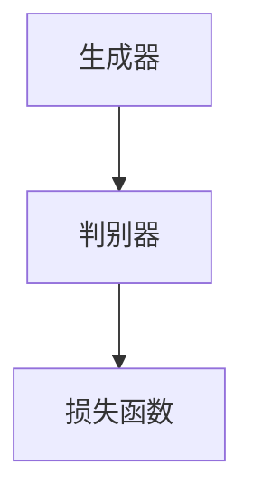

                 

### 1. 背景介绍

AIGC（AI-Generated Content）是一种由人工智能自动生成内容的技术。它结合了生成对抗网络（GAN）、自动文本生成、图像生成等多种AI技术，能够创造出具有高度真实感和创意性的文本、图像、视频等多媒体内容。随着AI技术的不断发展，AIGC已经广泛应用于游戏开发、虚拟现实、社交媒体、广告宣传等多个领域，极大地提升了内容生产的效率和质量。

在AIGC技术中，安装权重文件和LoRa模型文件是两个关键步骤。权重文件包含了模型在训练过程中学习到的参数，用于模型的推理和预测。LoRa模型文件则是一种基于自注意力机制的文本生成模型，能够生成高质量的文本内容。

本文将详细介绍AIGC技术，包括权重文件和LoRa模型文件的安装过程。我们将从背景介绍、核心概念与联系、核心算法原理与操作步骤、数学模型与公式、项目实战、实际应用场景、工具和资源推荐、总结与展望等多个方面进行探讨。通过本文的阅读，读者将全面了解AIGC技术的原理和应用，掌握安装权重文件和LoRa模型文件的方法，为实际项目开发提供有力支持。

### 2. 核心概念与联系

在深入了解AIGC技术之前，我们需要先理解几个核心概念：生成对抗网络（GAN）、自注意力机制（Self-Attention）、文本生成模型（Text Generation Model）以及权重文件（Weight Files）。

#### 2.1 生成对抗网络（GAN）

生成对抗网络（GAN）是由Ian Goodfellow等人于2014年提出的一种深度学习框架。它由两个深度神经网络组成：生成器（Generator）和判别器（Discriminator）。生成器的任务是生成与真实数据相似的数据，而判别器的任务是区分真实数据和生成数据。通过这两个网络的对抗训练，生成器能够逐渐生成更加逼真的数据。

GAN的架构图如下：

在AIGC技术中，GAN被广泛应用于图像和文本的生成。例如，在图像生成任务中，生成器可以生成高质量的图片，而判别器则用来评估生成图片的质量。

#### 2.2 自注意力机制（Self-Attention）

自注意力机制是自然语言处理（NLP）中的一种重要技术。它通过计算输入序列中各个词之间的相对重要性，来提高模型在处理长文本时的效果。自注意力机制的核心思想是将输入序列映射到一组密

