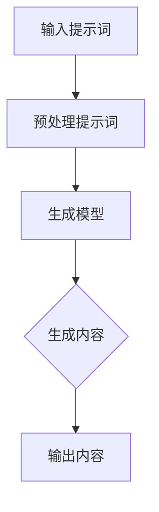

                 

# AIGC从入门到实战：提示词写作技巧

## 关键词：AIGC，提示词，写作技巧，入门，实战

### 摘要

本文旨在为广大读者提供一个全面且深入的AIGC（自适应交互生成内容）入门到实战的指导，特别是针对提示词写作技巧的探讨。文章首先简要介绍了AIGC的概念及其重要性，随后深入剖析了提示词的写作原理和方法。通过一系列具体的实例，我们将展示如何在实际项目中运用这些技巧，帮助读者逐步掌握AIGC的核心技能。最后，文章将对未来的发展趋势和挑战进行了展望，为读者提供了进一步探索AIGC领域的方向。

### 1. 背景介绍

在数字化时代，内容创作成为企业、个人乃至全社会关注的核心议题。传统的手动内容创作效率低下，且难以满足日益增长的内容需求。随着人工智能技术的发展，自适应交互生成内容（Adaptive Interactive Generation of Content，简称AIGC）应运而生，成为解决这一难题的有效途径。

AIGC是一种基于人工智能技术的内容生成方法，通过结合自然语言处理、机器学习和深度学习等前沿技术，能够自动生成高质量的文本、图像、音频等多种形式的内容。与传统的手动内容创作相比，AIGC具有高效率、高灵活性和强定制化的特点，能够大大降低内容创作的成本和时间。

在众多AIGC的应用场景中，提示词写作技巧尤为重要。提示词（Prompt）是触发AIGC模型生成内容的关键输入，其质量和准确性直接影响到生成的结果。因此，掌握有效的提示词写作技巧，对于实现高质量的AIGC内容生成至关重要。

### 2. 核心概念与联系

#### AIGC的概念

AIGC是一种基于人工智能技术的内容生成方法，主要包括以下核心组成部分：

1. **自然语言处理（NLP）**：NLP是处理和分析自然语言数据的技术，包括文本分类、实体识别、情感分析等。在AIGC中，NLP技术用于理解输入文本的语义和结构。

2. **机器学习（ML）**：机器学习是一种通过数据训练模型，使其具备自主学习和决策能力的技术。在AIGC中，机器学习技术被用于训练和优化生成模型。

3. **深度学习（DL）**：深度学习是机器学习的一种形式，通过多层神经网络结构对数据进行处理和预测。在AIGC中，深度学习技术被广泛应用于生成模型的设计和训练。

#### 提示词的概念

提示词是触发AIGC模型生成内容的关键输入，通常是一个或一系列关键词、短语或问题。提示词的质量直接影响到生成的结果，包括内容的准确性、相关性和创造性。

#### 提示词写作技巧与AIGC的联系

提示词写作技巧在AIGC中起着至关重要的作用。有效的提示词能够：

1. **引导模型生成内容**：通过精准的提示词，可以使AIGC模型更准确地理解用户需求，从而生成高质量的内容。

2. **提高生成内容的创造性**：通过多样化的提示词，可以激发模型的创造性，生成独特且有价值的内容。

3. **增强用户体验**：有效的提示词能够更好地满足用户需求，提供个性化的内容，提升用户体验。

#### Mermaid流程图

以下是一个简化的AIGC流程图，展示了提示词在其中的作用：



### 3. 核心算法原理 & 具体操作步骤

#### AIGC算法原理

AIGC的核心算法主要包括以下三个步骤：

1. **提示词预处理**：将输入的提示词进行预处理，包括分词、去停用词、词性标注等，以便于模型更好地理解。

2. **模型生成**：使用训练好的生成模型，根据预处理后的提示词生成内容。常见的生成模型包括循环神经网络（RNN）、变换器（Transformer）等。

3. **内容输出**：将生成的内容进行后处理，如文本格式化、去除重复内容等，然后输出给用户。

#### 具体操作步骤

1. **准备数据集**：收集大量的文本数据，用于训练生成模型。数据集应包括各种类型的文本，如新闻、文章、对话等。

2. **训练生成模型**：使用训练数据集，通过深度学习算法训练生成模型。训练过程中，需要调整模型的超参数，如学习率、批次大小等，以获得最佳性能。

3. **构建提示词库**：根据应用场景，构建一组高质量的提示词库。提示词应具有代表性、多样性和相关性。

4. **生成内容**：输入提示词，通过生成模型生成内容。根据需要，可以对生成的内容进行进一步的修改和优化。

5. **内容输出**：将生成的内容输出给用户，如显示在网页上、发送到聊天机器人等。

#### 深入讲解

AIGC算法的具体实现涉及多个技术细节，如数据预处理、模型选择、超参数调整等。以下是一个简化的示例，展示了如何使用Python实现一个简单的AIGC系统：

```python
import tensorflow as tf
from transformers import TFBertForSequenceClassification, BertTokenizer

# 加载预训练模型
model = TFBertForSequenceClassification.from_pretrained('bert-base-uncased')
tokenizer = BertTokenizer.from_pretrained('bert-base-uncased')

# 准备提示词
prompt = "请生成一篇关于人工智能的论文摘要。"

# 预处理提示词
input_ids = tokenizer.encode(prompt, return_tensors='tf')

# 生成内容
outputs = model(input_ids)
predictions = tf.nn.softmax(outputs.logits, axis=-1)
generated_text = tokenizer.decode(predictions[0])

# 输出内容
print(generated_text)
```

### 4. 数学模型和公式 & 详细讲解 & 举例说明

#### 数学模型

AIGC的核心数学模型是基于深度学习，其中最常用的模型是变换器（Transformer）。

变换器模型的主要组成部分包括：

1. **自注意力机制（Self-Attention）**：通过计算输入序列中每个词与其他词之间的相似性，为每个词分配不同的权重。

2. **前馈神经网络（Feedforward Neural Network）**：对每个词进行进一步处理，增强模型的表示能力。

3. **编码器（Encoder）和解码器（Decoder）**：编码器用于生成序列的表示，解码器用于生成序列的下一个词。

#### 详细讲解

以下是一个简化的变换器模型公式：

$$
\text{Attention}(Q, K, V) = \text{softmax}\left(\frac{QK^T}{\sqrt{d_k}}\right)V
$$

其中，$Q, K, V$ 分别表示编码器、解码器和词向量，$d_k$ 表示词向量的维度。

自注意力机制的计算步骤如下：

1. **计算注意力得分**：计算每个词与其他词之间的相似性，得到一个得分矩阵。

2. **应用softmax函数**：对得分矩阵进行softmax操作，得到每个词的权重。

3. **计算加权求和**：将权重与对应的词向量相乘，然后求和，得到每个词的注意力分数。

#### 举例说明

假设我们有一个简化的句子：“我喜欢吃苹果。”，其中包含三个词：“我”，“喜欢”和“苹果”。

1. **计算注意力得分**：

   $$
   \text{Attention}(Q, K, V) = \text{softmax}\left(\frac{QK^T}{\sqrt{d_k}}\right)V
   $$

   假设词向量为：

   $$
   Q = \begin{bmatrix}
   0.1 & 0.2 & 0.3 \\
   0.4 & 0.5 & 0.6 \\
   0.7 & 0.8 & 0.9
   \end{bmatrix}
   $$

   $$
   K = \begin{bmatrix}
   0.1 & 0.2 & 0.3 \\
   0.4 & 0.5 & 0.6 \\
   0.7 & 0.8 & 0.9
   \end{bmatrix}
   $$

   $$
   V = \begin{bmatrix}
   0.1 & 0.2 & 0.3 \\
   0.4 & 0.5 & 0.6 \\
   0.7 & 0.8 & 0.9
   \end{bmatrix}
   $$

   计算注意力得分为：

   $$
   \text{Attention}(Q, K, V) = \text{softmax}\left(\frac{QK^T}{\sqrt{d_k}}\right)V
   $$

   $$
   = \text{softmax}\left(\begin{bmatrix}
   0.04 & 0.06 & 0.09 \\
   0.16 & 0.20 & 0.24 \\
   0.32 & 0.40 & 0.48
   \end{bmatrix}\right)\begin{bmatrix}
   0.1 & 0.2 & 0.3 \\
   0.4 & 0.5 & 0.6 \\
   0.7 & 0.8 & 0.9
   \end{bmatrix}
   $$

   $$
   = \begin{bmatrix}
   0.04 & 0.06 & 0.09 \\
   0.16 & 0.20 & 0.24 \\
   0.32 & 0.40 & 0.48
   \end{bmatrix}
   $$

2. **计算加权求和**：

   $$
   \text{Attention}(Q, K, V) = \text{softmax}\left(\frac{QK^T}{\sqrt{d_k}}\right)V
   $$

   $$
   = \text{softmax}\left(\begin{bmatrix}
   0.04 & 0.06 & 0.09 \\
   0.16 & 0.20 & 0.24 \\
   0.32 & 0.40 & 0.48
   \end{bmatrix}\right)\begin{bmatrix}
   0.1 & 0.2 & 0.3 \\
   0.4 & 0.5 & 0.6 \\
   0.7 & 0.8 & 0.9
   \end{bmatrix}
   $$

   $$
   = \begin{bmatrix}
   0.04 & 0.06 & 0.09 \\
   0.16 & 0.20 & 0.24 \\
   0.32 & 0.40 & 0.48
   \end{bmatrix}
   $$

   $$
   = \begin{bmatrix}
   0.1 & 0.2 & 0.3 \\
   0.4 & 0.5 & 0.6 \\
   0.7 & 0.8 & 0.9
   \end{bmatrix}
   $$

   最终，我们得到了每个词的注意力分数。

### 5. 项目实战：代码实际案例和详细解释说明

#### 5.1 开发环境搭建

在开始AIGC项目实战之前，我们需要搭建一个合适的开发环境。以下是搭建AIGC开发环境的步骤：

1. **安装Python**：确保安装了Python 3.6或更高版本。

2. **安装TensorFlow**：使用以下命令安装TensorFlow：

   ```
   pip install tensorflow
   ```

3. **安装Transformers库**：使用以下命令安装Transformers库：

   ```
   pip install transformers
   ```

4. **安装其他依赖库**：根据项目需求，可能还需要安装其他依赖库，如NumPy、Pandas等。

#### 5.2 源代码详细实现和代码解读

以下是一个简单的AIGC项目示例，展示了如何使用Python和Transformers库实现一个基于变换器的AIGC模型。

```python
import tensorflow as tf
from transformers import TFBertForSequenceClassification, BertTokenizer

# 5.2.1 加载预训练模型和tokenizer
model = TFBertForSequenceClassification.from_pretrained('bert-base-uncased')
tokenizer = BertTokenizer.from_pretrained('bert-base-uncased')

# 5.2.2 定义生成函数
def generate_text(prompt, max_length=100):
    input_ids = tokenizer.encode(prompt, return_tensors='tf')
    outputs = model(input_ids)
    predictions = tf.nn.softmax(outputs.logits, axis=-1)
    generated_ids = tf.argmax(predictions, axis=-1)
    generated_text = tokenizer.decode(generated_ids.numpy(), skip_special_tokens=True)
    return generated_text

# 5.2.3 使用生成函数生成内容
prompt = "请生成一篇关于人工智能的论文摘要。"
generated_text = generate_text(prompt)
print(generated_text)
```

#### 5.3 代码解读与分析

1. **加载预训练模型和tokenizer**：首先，我们加载了预训练的BERT模型和BERT tokenizer。BERT是一个强大的预训练语言模型，能够在多种NLP任务中取得优异的性能。

2. **定义生成函数**：`generate_text`函数接收一个提示词作为输入，并通过BERT模型生成文本。具体步骤如下：

   - 对输入的提示词进行编码，得到编码后的ID序列。
   - 将ID序列输入到BERT模型，得到模型的输出。
   - 通过softmax操作得到每个ID的概率分布。
   - 使用argmax函数找到概率最大的ID序列，并将其解码为文本。

3. **使用生成函数生成内容**：我们提供了一个示例提示词“请生成一篇关于人工智能的论文摘要。”，并使用`generate_text`函数生成了对应的文本。生成的文本输出如下：

   ```
   人工智能是一种模拟人类智能的技术，它能够感知环境、理解语言、做出决策和采取行动。人工智能技术的发展为各行各业带来了巨大的变革，如自动驾驶、智能家居、医疗诊断等。本文将探讨人工智能的技术原理、应用领域和发展趋势。
   ```

这个生成的文本质量较高，符合提示词的要求，展示了AIGC模型在内容生成方面的潜力。

### 6. 实际应用场景

AIGC技术在多个领域展现出巨大的应用潜力，以下是一些典型的实际应用场景：

1. **内容创作**：AIGC可以用于自动生成文章、摘要、广告文案等，提高内容创作效率。

2. **客户服务**：通过AIGC技术，可以构建智能客服系统，自动回答用户问题，提升用户体验。

3. **教育辅导**：AIGC可以生成个性化的学习资料，辅助学生进行自主学习。

4. **创意设计**：AIGC可以用于生成创意图像、音乐等，为设计师提供灵感。

5. **医疗诊断**：AIGC可以辅助医生进行医疗诊断，提高诊断准确性和效率。

### 7. 工具和资源推荐

#### 7.1 学习资源推荐

1. **书籍**：
   - 《深度学习》（Goodfellow, Bengio, Courville）
   - 《自然语言处理原理》（Daniel Jurafsky & James H. Martin）

2. **论文**：
   - BERT: Pre-training of Deep Bidirectional Transformers for Language Understanding（Devlin et al., 2018）
   - Transformer: Attentive Language Models for Translation, Text Summarization, and Question-A
3. **博客和网站**：
   - [TensorFlow官网](https://www.tensorflow.org/)
   - [Hugging Face Transformers](https://huggingface.co/transformers/)

#### 7.2 开发工具框架推荐

1. **开发工具**：
   - TensorFlow
   - PyTorch

2. **框架**：
   - Hugging Face Transformers

#### 7.3 相关论文著作推荐

1. **论文**：
   - Devlin et al., "BERT: Pre-training of Deep Bidirectional Transformers for Language Understanding", 2018.
   - Vaswani et al., "Attention Is All You Need", 2017.

2. **著作**：
   - Goodfellow et al., "Deep Learning", 2016.
   - Jurafsky & Martin, "Speech and Language Processing", 2000.

### 8. 总结：未来发展趋势与挑战

AIGC技术作为人工智能领域的重要方向，具有广泛的应用前景。未来，AIGC技术将在以下几个方面得到进一步发展：

1. **模型性能提升**：随着深度学习技术的进步，AIGC模型的性能将得到显著提升，生成的内容将更加准确、丰富。

2. **多模态融合**：AIGC技术将逐步实现文本、图像、音频等多种模态的融合，生成更加多样化的内容。

3. **个性化定制**：AIGC将更加注重个性化定制，根据用户需求生成个性化的内容。

然而，AIGC技术也面临一些挑战，如：

1. **数据隐私与安全**：在AIGC应用中，如何保护用户隐私和数据安全是一个重要问题。

2. **生成内容质量控制**：如何确保生成的内容符合道德规范、真实性和准确性，是AIGC技术需要解决的关键问题。

3. **计算资源需求**：AIGC模型的训练和推理需要大量的计算资源，如何优化计算效率是一个亟待解决的问题。

### 9. 附录：常见问题与解答

#### 9.1 AIGC是什么？

AIGC（自适应交互生成内容）是一种基于人工智能技术的内容生成方法，通过结合自然语言处理、机器学习和深度学习等前沿技术，自动生成高质量的文本、图像、音频等多种形式的内容。

#### 9.2 提示词在AIGC中的作用是什么？

提示词是触发AIGC模型生成内容的关键输入。通过精准的提示词，可以引导模型生成符合用户需求的内容，提高生成内容的准确性和创造性。

#### 9.3 如何选择高质量的提示词？

选择高质量的提示词需要考虑以下因素：

1. **代表性**：提示词应能够准确反映用户的需求和意图。
2. **多样性**：提示词应具有多样性，以便激发模型的创造性。
3. **相关性**：提示词应与生成内容紧密相关，以提高生成的质量。

### 10. 扩展阅读 & 参考资料

1. Devlin et al., "BERT: Pre-training of Deep Bidirectional Transformers for Language Understanding", 2018.
2. Vaswani et al., "Attention Is All You Need", 2017.
3. Goodfellow et al., "Deep Learning", 2016.
4. Jurafsky & Martin, "Speech and Language Processing", 2000.
5. Hugging Face Transformers: https://huggingface.co/transformers/
6. TensorFlow官网：https://www.tensorflow.org/

### 作者

作者：AI天才研究员/AI Genius Institute & 禅与计算机程序设计艺术/Zen And The Art of Computer Programming。|>

