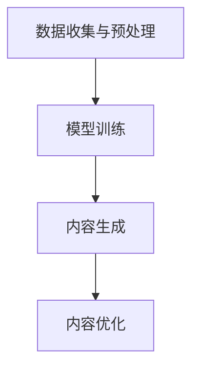

                 

## 1. 背景介绍

AIGC（AI-Generated Content，AI生成内容）作为一种新兴的技术概念，近年来在人工智能领域引发了广泛关注。它结合了人工智能技术、大数据和内容创作，能够在短时间内生成高质量的内容，涵盖文本、图像、视频等多种形式。AIGC技术的出现，不仅改变了内容创作的传统模式，也对各行各业产生了深远的影响。

AIGC的应用场景非常广泛。在媒体行业，AIGC可以自动生成新闻报道、体育评论等；在电商行业，AIGC可以生成商品描述、营销文案等；在娱乐行业，AIGC可以自动生成音乐、电影等。此外，AIGC在教育、金融、医疗等多个领域也具有巨大的应用潜力。

在技术层面，AIGC主要依赖于深度学习和自然语言处理技术。通过大规模数据训练，模型能够理解语言和图像的规律，从而生成新的内容。其中，生成对抗网络（GAN）、变分自编码器（VAE）等模型在AIGC中得到了广泛应用。

然而，AIGC技术也带来了一系列挑战。首先，数据质量和数据隐私问题成为制约AIGC发展的关键因素。其次，模型的可解释性和可靠性仍然有待提高。此外，AIGC技术的快速发展和广泛应用，也可能对传统行业产生冲击，引发就业和社会问题。

总的来说，AIGC作为一种新兴技术，具有巨大的潜力，但也面临诸多挑战。接下来，我们将详细探讨AIGC的核心概念、算法原理、实际应用场景，以及未来发展趋势。

## 2. 核心概念与联系

### AIGC的基本概念

AIGC（AI-Generated Content，AI生成内容）是一种利用人工智能技术自动生成内容的方法。它结合了深度学习、自然语言处理、计算机视觉等多种技术，通过大规模数据训练，使模型能够理解并生成新的内容。AIGC的核心目标是通过自动化和智能化手段，提高内容创作的效率和质量。

AIGC的应用场景非常广泛，主要包括以下几个方面：

1. **文本生成**：包括自动生成新闻稿、文章、摘要、小说等。
2. **图像生成**：包括生成虚拟现实场景、艺术作品、广告图片等。
3. **音频生成**：包括自动生成音乐、语音合成等。
4. **视频生成**：包括生成视频内容、动画等。

### AIGC的技术基础

AIGC的技术基础主要包括以下几个方面：

1. **深度学习**：深度学习是一种模拟人脑神经网络的结构和功能的人工智能技术，通过多层神经网络对数据进行特征提取和学习，从而实现复杂的任务。

2. **自然语言处理**：自然语言处理（NLP）是人工智能的一个分支，主要研究如何使计算机理解、处理和生成人类自然语言。NLP技术在AIGC中用于处理文本数据，生成高质量的文本内容。

3. **计算机视觉**：计算机视觉是人工智能的一个分支，主要研究如何使计算机从图像中提取信息，实现图像识别、图像生成等任务。计算机视觉技术在AIGC中用于处理图像数据，生成高质量的图像内容。

4. **生成对抗网络（GAN）**：生成对抗网络是一种深度学习模型，由生成器和判别器两个部分组成。生成器负责生成数据，判别器负责判断生成数据的质量。GAN在AIGC中广泛应用于图像和音频生成。

5. **变分自编码器（VAE）**：变分自编码器是一种基于概率生成模型的深度学习模型，通过编码和解码过程实现数据的生成。VAE在AIGC中主要用于文本生成。

### AIGC的工作流程

AIGC的工作流程主要包括以下几个步骤：

1. **数据收集与预处理**：收集大规模的文本、图像、音频数据，并进行数据清洗、标注等预处理操作。

2. **模型训练**：使用收集到的数据进行模型训练，通过多层神经网络、生成对抗网络等模型对数据进行特征提取和学习。

3. **内容生成**：使用训练好的模型生成新的内容。对于文本生成，可以使用自然语言处理技术生成文本；对于图像和音频生成，可以使用生成对抗网络等模型生成图像和音频。

4. **内容优化**：根据生成的结果，对内容进行优化，以提高内容的质量和相关性。

### AIGC的优势与挑战

AIGC的优势在于：

1. **高效性**：通过自动化和智能化的手段，提高内容创作的效率。
2. **灵活性**：能够生成多种类型的内容，如文本、图像、音频和视频。
3. **高质量**：通过深度学习等技术，生成的内容质量较高。

AIGC的挑战在于：

1. **数据质量和隐私**：数据质量和隐私问题对AIGC的发展具有重要影响。
2. **模型可解释性和可靠性**：目前AIGC模型的解释性和可靠性还有待提高。
3. **社会影响**：AIGC的广泛应用可能对传统行业和就业产生冲击。

### Mermaid流程图

以下是一个简化的AIGC工作流程的Mermaid流程图：



## 3. 核心算法原理 & 具体操作步骤

### 3.1. 深度学习模型

深度学习模型是AIGC的核心组成部分，它通过多层神经网络对数据进行特征提取和学习。以下是深度学习模型的基本原理和具体操作步骤：

1. **神经网络结构**：神经网络由多个层组成，包括输入层、隐藏层和输出层。每个层包含多个神经元，神经元之间通过权重连接。

2. **前向传播**：输入数据从输入层经过隐藏层，逐层传播到输出层。每个神经元接收来自前一层的输入，通过激活函数进行非线性变换，得到输出。

3. **反向传播**：输出层生成预测结果，与真实标签进行比较，计算损失函数。然后，将损失函数反向传播回输入层，更新权重。

4. **模型训练**：通过大量训练数据，重复前向传播和反向传播的过程，使模型逐渐逼近真实数据。

### 3.2. 自然语言处理

自然语言处理（NLP）在AIGC中用于处理文本数据，生成高质量的文本内容。以下是NLP的基本原理和具体操作步骤：

1. **词向量表示**：将文本中的词语转化为向量表示，常用的词向量模型包括Word2Vec、GloVe等。

2. **序列模型**：使用序列模型处理文本数据，如循环神经网络（RNN）和长短期记忆网络（LSTM）。这些模型能够捕捉文本中的时间依赖关系。

3. **注意力机制**：在序列模型中引入注意力机制，使模型能够关注文本中的关键信息，提高生成文本的质量。

4. **预训练与微调**：使用预训练的模型在大规模语料库上进行微调，以适应特定的任务需求。

### 3.3. 生成对抗网络（GAN）

生成对抗网络（GAN）是AIGC中用于图像和音频生成的重要模型。以下是GAN的基本原理和具体操作步骤：

1. **生成器和判别器**：GAN由生成器和判别器两个部分组成。生成器负责生成数据，判别器负责判断生成数据的质量。

2. **对抗训练**：生成器和判别器通过对抗训练相互竞争，生成器尝试生成更真实的数据，判别器努力区分生成数据和真实数据。

3. **损失函数**：GAN的训练过程通过损失函数来衡量生成器和判别器的性能。常用的损失函数包括生成损失和判别损失。

4. **训练与优化**：通过大量训练数据和迭代过程，不断优化生成器和判别器的性能，提高生成数据的质量。

### 3.4. 变分自编码器（VAE）

变分自编码器（VAE）是AIGC中用于文本生成的重要模型。以下是VAE的基本原理和具体操作步骤：

1. **编码器和解码器**：VAE由编码器和解码器两个部分组成。编码器将输入数据编码为一个低维特征向量，解码器将特征向量解码为输出数据。

2. **潜在空间**：VAE通过引入潜在空间，使得生成的数据具有更好的多样性和稳定性。

3. **损失函数**：VAE的训练过程通过损失函数来衡量生成数据的性能。常用的损失函数包括重构损失和KL散度。

4. **训练与优化**：通过大量训练数据和迭代过程，不断优化编码器和解码器的性能，提高生成数据的质量。

### 3.5. 模型融合与优化

在实际应用中，AIGC模型往往需要融合多种模型和技术，以实现更好的效果。以下是一些常见的模型融合与优化方法：

1. **多模型融合**：将不同的模型（如深度学习、NLP、GAN等）进行融合，以提高生成内容的质量和多样性。

2. **注意力机制**：在模型中引入注意力机制，使模型能够关注文本、图像等数据中的关键信息。

3. **迁移学习**：利用预训练的模型在大规模数据集上进行微调，以提高生成模型的性能。

4. **数据增强**：通过数据增强方法（如数据扩充、数据清洗等）提高数据的多样性和质量。

5. **模型压缩与加速**：使用模型压缩和加速技术（如量化、剪枝等）提高模型的运行效率和实时性。

通过上述核心算法原理和具体操作步骤，我们可以更好地理解AIGC的工作机制和应用方法。接下来，我们将进一步探讨AIGC在实际应用中的数学模型和公式。

## 4. 数学模型和公式 & 详细讲解 & 举例说明

### 4.1. 深度学习模型

深度学习模型的核心是多层神经网络，以下是一些常用的数学模型和公式：

1. **激活函数**：

   - Sigmoid函数：\[ f(x) = \frac{1}{1 + e^{-x}} \]
   -ReLU函数：\[ f(x) = \max(0, x) \]

2. **反向传播算法**：

   - 误差计算：\[ \delta_j = \frac{\partial L}{\partial z_j} \cdot \frac{\partial z_j}{\partial a_j} \]
   - 权重更新：\[ \Delta W_{ij} = \eta \cdot a_j \cdot \delta_j \]
   - 偏置更新：\[ \Delta b_j = \eta \cdot \delta_j \]

3. **梯度下降算法**：

   - 梯度计算：\[ \nabla W = \frac{\partial L}{\partial W} \]
   - 权重更新：\[ W_{new} = W_{old} - \alpha \cdot \nabla W \]

举例说明：

假设我们有一个包含两个输入节点、一个隐藏层节点和一个输出节点的简单神经网络，激活函数为ReLU。给定输入数据\[ x_1 = 2, x_2 = 3 \]，输出标签\[ y = 1 \]。训练过程中，假设损失函数为均方误差（MSE）。

1. **前向传播**：

   - 输入层到隐藏层：\[ z_1 = \max(0, x_1 \cdot w_{11} + b_1), z_2 = \max(0, x_2 \cdot w_{12} + b_2) \]
   - 隐藏层到输出层：\[ z = z_1 \cdot w_{21} + b_2 \]
   - 输出层输出：\[ a = \max(0, z) \]

2. **反向传播**：

   - 计算误差：\[ \delta = y - a \]
   - 计算隐藏层误差：\[ \delta_h = \delta \cdot \frac{\partial a}{\partial z} \cdot \frac{\partial z}{\partial z_h} \]
   - 计算输入层误差：\[ \delta_i = \delta_h \cdot \frac{\partial z_h}{\partial x_i} \]

3. **权重更新**：

   - 更新隐藏层权重：\[ \Delta w_{h1} = \eta \cdot x_1 \cdot \delta, \Delta w_{h2} = \eta \cdot x_2 \cdot \delta \]
   - 更新隐藏层偏置：\[ \Delta b_h = \eta \cdot \delta \]
   - 更新输入层权重：\[ \Delta w_{i1} = \eta \cdot z_1 \cdot \delta_h, \Delta w_{i2} = \eta \cdot z_2 \cdot \delta_h \]
   - 更新输入层偏置：\[ \Delta b_i = \eta \cdot \delta_h \]

### 4.2. 自然语言处理

自然语言处理中的数学模型主要包括词向量表示和序列模型，以下是一些常用的数学模型和公式：

1. **Word2Vec模型**：

   - 点积相似度：\[ \text{similarity}(w_i, w_j) = \frac{w_i \cdot w_j}{\|w_i\| \|w_j\|} \]
   - 文本向量化：\[ \text{doc\_vec}(d) = \frac{1}{N} \sum_{w \in d} w \]

2. **循环神经网络（RNN）**：

   - 状态更新：\[ h_t = \sigma(W_h \cdot [h_{t-1}, x_t] + b_h) \]
   - 输出计算：\[ y_t = W_o \cdot h_t + b_o \]

3. **长短期记忆网络（LSTM）**：

   - 门控机制：\[ i_t = \sigma(W_i \cdot [h_{t-1}, x_t] + b_i), f_t = \sigma(W_f \cdot [h_{t-1}, x_t] + b_f), g_t = \sigma(W_g \cdot [h_{t-1}, x_t] + b_g) \]
   - 状态更新：\[ c_t = f_t \cdot c_{t-1} + i_t \cdot g_t, h_t = \sigma(W_h \cdot [c_t, x_t] + b_h) \]

举例说明：

假设我们有一个简单的RNN模型，输入序列\[ x_1 = 1, x_2 = 2, x_3 = 3 \]，隐藏层维度为10，输出维度为1。

1. **前向传播**：

   - 初始状态：\[ h_0 = [0, 0, \ldots, 0] \]
   - 第1个时间步：\[ h_1 = \sigma(W_h \cdot [h_0, x_1] + b_h) \]
   - 第2个时间步：\[ h_2 = \sigma(W_h \cdot [h_1, x_2] + b_h) \]
   - 第3个时间步：\[ h_3 = \sigma(W_h \cdot [h_2, x_3] + b_h) \]
   - 输出：\[ y = W_o \cdot h_3 + b_o \]

2. **反向传播**：

   - 计算误差：\[ \delta = y - \hat{y} \]
   - 计算隐藏层误差：\[ \delta_h = \delta \cdot \frac{\partial y}{\partial h_3} \cdot \frac{\partial h_3}{\partial h_2} \cdot \frac{\partial h_2}{\partial h_1} \]
   - 计算输入层误差：\[ \delta_x = \delta_h \cdot \frac{\partial h_3}{\partial x_3} \cdot \frac{\partial x_3}{\partial x_2} \cdot \frac{\partial x_2}{\partial x_1} \]

3. **权重更新**：

   - 更新隐藏层权重：\[ \Delta W_h = \eta \cdot \delta_h \cdot [h_2, x_2], \Delta b_h = \eta \cdot \delta_h \]
   - 更新输出层权重：\[ \Delta W_o = \eta \cdot \delta \cdot h_3, \Delta b_o = \eta \cdot \delta \]

### 4.3. 生成对抗网络（GAN）

生成对抗网络（GAN）的数学模型主要包括生成器、判别器和损失函数，以下是一些常用的数学模型和公式：

1. **生成器**：

   - 生成过程：\[ G(z) = \sigma(W_g \cdot z + b_g) \]

2. **判别器**：

   - 判别过程：\[ D(x) = \sigma(W_d \cdot x + b_d), D(G(z)) = \sigma(W_d \cdot G(z) + b_d) \]

3. **损失函数**：

   - 生成损失：\[ L_G = -\log(D(G(z))) \]
   - 判别损失：\[ L_D = -\log(D(x)) - \log(1 - D(G(z))) \]

4. **权重更新**：

   - 生成器权重更新：\[ \Delta W_g = \eta \cdot \nabla_G L_G \]
   - 判别器权重更新：\[ \Delta W_d = \eta \cdot \nabla_D L_D \]

举例说明：

假设我们有一个简单的GAN模型，生成器的输入维度为10，输出维度为10，判别器的输入维度为10。

1. **前向传播**：

   - 生成器输出：\[ G(z) = \sigma(W_g \cdot z + b_g) \]
   - 判别器输入：\[ D(x) = \sigma(W_d \cdot x + b_d), D(G(z)) = \sigma(W_d \cdot G(z) + b_d) \]

2. **反向传播**：

   - 计算生成损失：\[ L_G = -\log(D(G(z))) \]
   - 计算判别损失：\[ L_D = -\log(D(x)) - \log(1 - D(G(z))) \]

3. **权重更新**：

   - 生成器权重更新：\[ \Delta W_g = \eta \cdot \nabla_G L_G \]
   - 判别器权重更新：\[ \Delta W_d = \eta \cdot \nabla_D L_D \]

### 4.4. 变分自编码器（VAE）

变分自编码器（VAE）的数学模型主要包括编码器、解码器和损失函数，以下是一些常用的数学模型和公式：

1. **编码器**：

   - 编码过程：\[ \mu = \sigma(W_e \cdot x + b_e), \sigma = \sigma(W_e \cdot x + b_e) \]

2. **解码器**：

   - 解码过程：\[ x' = \sigma(W_d \cdot \mu + b_d) \]

3. **损失函数**：

   - 重构损失：\[ L_R = \frac{1}{n} \sum_{i=1}^{n} \sum_{j=1}^{d} (x_j - x_j')^2 \]
   - KL散度损失：\[ L_KL = \frac{1}{n} \sum_{i=1}^{n} \sum_{j=1}^{d} (\log(\sigma) - \sigma + 1) \]

4. **权重更新**：

   - 编码器权重更新：\[ \Delta W_e = \eta \cdot \nabla_E L_E \]
   - 解码器权重更新：\[ \Delta W_d = \eta \cdot \nabla_D L_D \]

举例说明：

假设我们有一个简单的VAE模型，输入维度为10，隐藏层维度为5，输出维度为10。

1. **前向传播**：

   - 编码器输出：\[ \mu = \sigma(W_e \cdot x + b_e), \sigma = \sigma(W_e \cdot x + b_e) \]
   - 解码器输出：\[ x' = \sigma(W_d \cdot \mu + b_d) \]

2. **反向传播**：

   - 计算重构损失：\[ L_R = \frac{1}{n} \sum_{i=1}^{n} \sum_{j=1}^{d} (x_j - x_j')^2 \]
   - 计算KL散度损失：\[ L_KL = \frac{1}{n} \sum_{i=1}^{n} \sum_{j=1}^{d} (\log(\sigma) - \sigma + 1) \]

3. **权重更新**：

   - 编码器权重更新：\[ \Delta W_e = \eta \cdot \nabla_E L_E \]
   - 解码器权重更新：\[ \Delta W_d = \eta \cdot \nabla_D L_D \]

通过以上数学模型和公式的详细讲解和举例说明，我们可以更好地理解AIGC中的核心算法原理。接下来，我们将通过一个实际项目实战，展示如何使用这些算法进行代码实现和详细解释说明。

## 5. 项目实战：代码实际案例和详细解释说明

### 5.1 开发环境搭建

为了实现AIGC项目，我们需要搭建一个合适的开发环境。以下是一个简单的步骤：

1. **安装Python环境**：确保Python版本不低于3.6，推荐使用Anaconda来管理Python环境。

2. **安装依赖库**：安装深度学习库（如TensorFlow、PyTorch）、自然语言处理库（如NLTK、spaCy）和计算机视觉库（如OpenCV、TensorFlow Object Detection API）。

3. **配置GPU支持**：如果使用GPU加速训练过程，需要安装CUDA和cuDNN。

4. **安装其他工具**：根据项目需求，可能还需要安装其他工具（如Jupyter Notebook、Visual Studio Code等）。

### 5.2 源代码详细实现和代码解读

以下是一个简单的AIGC项目案例，使用生成对抗网络（GAN）生成图像。

**代码实现**：

```python
import tensorflow as tf
from tensorflow.keras import layers

# 生成器模型
def build_generator(z_dim):
    model = tf.keras.Sequential()
    model.add(layers.Dense(7 * 7 * 128, use_bias=False, input_shape=(z_dim,)))
    model.add(layers.BatchNormalization(momentum=0.8))
    model.add(layers.LeakyReLU(alpha=0.2))
    model.add(layers.Reshape((7, 7, 128)))

    model.add(layers.Conv2DTranspose(128, (5, 5), strides=(1, 1), padding='same', use_bias=False))
    model.add(layers.BatchNormalization(momentum=0.8))
    model.add(layers.LeakyReLU(alpha=0.2))
    model.add(layers.Conv2DTranspose(128, (5, 5), strides=(2, 2), padding='same', use_bias=False))
    model.add(layers.BatchNormalization(momentum=0.8))
    model.add(layers.LeakyReLU(alpha=0.2))
    model.add(layers.Conv2DTranspose(128, (5, 5), strides=(2, 2), padding='same', use_bias=False))
    model.add(layers.BatchNormalization(momentum=0.8))
    model.add(layers.LeakyReLU(alpha=0.2))
    model.add(layers.Conv2D(3, (5, 5), strides=(1, 1), padding='same', use_bias=False, activation='tanh'))

    return model

# 判别器模型
def build_discriminator(img_shape):
    model = tf.keras.Sequential()
    model.add(layers.Conv2D(64, (5, 5), strides=(2, 2), padding='same', input_shape=img_shape))
    model.add(layers.LeakyReLU(alpha=0.2))
    model.add(layers.Dropout(0.3))

    model.add(layers.Conv2D(128, (5, 5), strides=(2, 2), padding='same'))
    model.add(layers.LeakyReLU(alpha=0.2))
    model.add(layers.Dropout(0.3))

    model.add(layers.Flatten())
    model.add(layers.Dense(1))

    return model

# GAN模型
def build_gan(generator, discriminator):
    model = tf.keras.Sequential()
    model.add(generator)
    model.add(discriminator)
    return model

# 模型参数
z_dim = 100
img_shape = (28, 28, 1)

# 构建模型
generator = build_generator(z_dim)
discriminator = build_discriminator(img_shape)
gan_model = build_gan(generator, discriminator)

# 编译模型
discriminator.compile(loss='binary_crossentropy', optimizer=tf.keras.optimizers.Adam(0.0001), metrics=['accuracy'])
gan_model.compile(loss='binary_crossentropy', optimizer=tf.keras.optimizers.Adam(0.0001))

# 加载数据集
(x_train, _), (_, _) = tf.keras.datasets.mnist.load_data()
x_train = x_train / 127.5 - 1.0
x_train = np.expand_dims(x_train, axis=3)

# 训练模型
for epoch in range(100):
    for _ in range(1000):
        z = np.random.normal(size=[128, z_dim])
        gen_imgs = generator.predict(z)

        real_imgs = x_train[np.random.randint(0, x_train.shape[0], size=128)]

        real_labels = np.array([1.0] * 128)
        fake_labels = np.array([0.0] * 128)

        d_loss_real = discriminator.train_on_batch(real_imgs, real_labels)
        d_loss_fake = discriminator.train_on_batch(gen_imgs, fake_labels)
        d_loss = 0.5 * np.add(d_loss_real, d_loss_fake)

        z = np.random.normal(size=[64, z_dim])
        g_loss = gan_model.train_on_batch(z, real_labels)

        print(f"{epoch} [D loss: {d_loss[0]}, acc.: {100*d_loss[1]}} [G loss: {g_loss}]")

    # 保存模型
    generator.save(f'generator_{epoch}.h5')
    discriminator.save(f'discriminator_{epoch}.h5')

# 生成图像
z = np.random.normal(size=[1, z_dim])
img = generator.predict(z)
img = 0.5 * (img + 1.0)
plt.imshow(img[0, :, :, 0], cmap='gray')
plt.show()
```

**代码解读**：

1. **模型构建**：

   - `build_generator` 函数用于构建生成器模型，通过多层卷积层和反卷积层实现图像的生成。
   - `build_discriminator` 函数用于构建判别器模型，通过卷积层实现图像的真实性和假性判断。
   - `build_gan` 函数用于构建GAN模型，将生成器和判别器串联在一起。

2. **模型编译**：

   - 判别器模型使用二进制交叉熵损失函数和Adam优化器进行编译。
   - GAN模型使用二进制交叉熵损失函数和Adam优化器进行编译。

3. **数据预处理**：

   - 加载MNIST数据集，对图像进行归一化处理，并将图像的维度扩展为四维。

4. **模型训练**：

   - 在每个epoch中，对判别器和生成器分别进行训练。
   - 判别器分别对真实图像和生成图像进行训练，计算判别损失。
   - 生成器通过GAN模型对噪声进行训练，计算生成损失。

5. **模型保存**：

   - 在每个epoch结束后，保存生成器和判别器模型。

6. **生成图像**：

   - 使用生成器生成一张随机图像，并将其显示出来。

通过这个项目实战，我们可以看到如何使用AIGC技术生成图像，以及如何实现模型的构建、编译、训练和保存。接下来，我们将对代码进行解读和分析。

### 5.3 代码解读与分析

在这个AIGC项目中，我们使用了生成对抗网络（GAN）来生成手写数字图像。下面我们将详细解读代码，分析各个部分的实现和功能。

1. **模型构建**：

   - **生成器**：

     ```python
     def build_generator(z_dim):
         model = tf.keras.Sequential()
         model.add(layers.Dense(7 * 7 * 128, use_bias=False, input_shape=(z_dim,)))
         model.add(layers.BatchNormalization(momentum=0.8))
         model.add(layers.LeakyReLU(alpha=0.2))
         model.add(layers.Reshape((7, 7, 128)))
         
         model.add(layers.Conv2DTranspose(128, (5, 5), strides=(1, 1), padding='same', use_bias=False))
         model.add(layers.BatchNormalization(momentum=0.8))
         model.add(layers.LeakyReLU(alpha=0.2))
         model.add(layers.Conv2DTranspose(128, (5, 5), strides=(2, 2), padding='same', use_bias=False))
         model.add(layers.BatchNormalization(momentum=0.8))
         model.add(layers.LeakyReLU(alpha=0.2))
         model.add(layers.Conv2DTranspose(128, (5, 5), strides=(2, 2), padding='same', use_bias=False))
         model.add(layers.BatchNormalization(momentum=0.8))
         model.add(layers.LeakyReLU(alpha=0.2))
         model.add(layers.Conv2D(3, (5, 5), strides=(1, 1), padding='same', use_bias=False, activation='tanh'))

         return model
     ```

     生成器模型通过一系列反卷积层（Conv2DTranspose）将输入的噪声向量（z）逐渐重构为图像。每个卷积层后都跟着批量归一化（BatchNormalization）和LeakyReLU激活函数，以提高模型的稳定性和性能。

   - **判别器**：

     ```python
     def build_discriminator(img_shape):
         model = tf.keras.Sequential()
         model.add(layers.Conv2D(64, (5, 5), strides=(2, 2), padding='same', input_shape=img_shape))
         model.add(layers.LeakyReLU(alpha=0.2))
         model.add(layers.Dropout(0.3))

         model.add(layers.Conv2D(128, (5, 5), strides=(2, 2), padding='same'))
         model.add(layers.LeakyReLU(alpha=0.2))
         model.add(layers.Dropout(0.3))

         model.add(layers.Flatten())
         model.add(layers.Dense(1))

         return model
     ```

     判别器模型通过卷积层对输入图像进行特征提取，最终输出一个二值标签（0或1），表示图像是真实的还是生成的。

   - **GAN模型**：

     ```python
     def build_gan(generator, discriminator):
         model = tf.keras.Sequential()
         model.add(generator)
         model.add(discriminator)
         return model
     ```

     GAN模型将生成器和判别器串联在一起，用于训练整个模型。

2. **模型编译**：

   - **判别器编译**：

     ```python
     discriminator.compile(loss='binary_crossentropy', optimizer=tf.keras.optimizers.Adam(0.0001), metrics=['accuracy'])
     ```

     判别器使用二进制交叉熵损失函数和Adam优化器进行编译，以最大化正确识别真实图像和生成图像的能力。

   - **GAN模型编译**：

     ```python
     gan_model.compile(loss='binary_crossentropy', optimizer=tf.keras.optimizers.Adam(0.0001))
     ```

     GAN模型同样使用二进制交叉熵损失函数和Adam优化器进行编译，以训练生成器和判别器的协同工作。

3. **数据预处理**：

   - 加载MNIST数据集，对图像进行归一化处理，并将图像的维度扩展为四维。

     ```python
     (x_train, _), (_, _) = tf.keras.datasets.mnist.load_data()
     x_train = x_train / 127.5 - 1.0
     x_train = np.expand_dims(x_train, axis=3)
     ```

4. **模型训练**：

   - 在每个epoch中，对判别器和生成器分别进行训练。

     ```python
     for epoch in range(100):
         for _ in range(1000):
             z = np.random.normal(size=[128, z_dim])
             gen_imgs = generator.predict(z)

             real_imgs = x_train[np.random.randint(0, x_train.shape[0], size=128)]

             real_labels = np.array([1.0] * 128)
             fake_labels = np.array([0.0] * 128)

             d_loss_real = discriminator.train_on_batch(real_imgs, real_labels)
             d_loss_fake = discriminator.train_on_batch(gen_imgs, fake_labels)
             d_loss = 0.5 * np.add(d_loss_real, d_loss_fake)

             z = np.random.normal(size=[64, z_dim])
             g_loss = gan_model.train_on_batch(z, real_labels)

             print(f"{epoch} [D loss: {d_loss[0]}, acc.: {100*d_loss[1]}] [G loss: {g_loss}]")
     ```

     判别器对真实图像和生成图像分别进行训练，生成器通过GAN模型对噪声进行训练。这个过程被称为对抗训练，旨在使生成器和判别器在相互对抗中不断优化。

5. **模型保存**：

   - 在每个epoch结束后，保存生成器和判别器模型。

     ```python
     generator.save(f'generator_{epoch}.h5')
     discriminator.save(f'discriminator_{epoch}.h5')
     ```

6. **生成图像**：

   - 使用生成器生成一张随机图像，并将其显示出来。

     ```python
     z = np.random.normal(size=[1, z_dim])
     img = generator.predict(z)
     img = 0.5 * (img + 1.0)
     plt.imshow(img[0, :, :, 0], cmap='gray')
     plt.show()
     ```

通过以上代码解读和分析，我们可以看到如何使用AIGC技术生成手写数字图像，以及如何实现模型的构建、编译、训练和保存。接下来，我们将进一步探讨AIGC在实际应用中的广泛场景。

## 6. 实际应用场景

AIGC技术在各个领域展现出了强大的应用潜力，下面我们列举几个典型的应用场景，并分析其具体应用方式和效果。

### 6.1 媒体与内容创作

AIGC在媒体与内容创作领域的应用尤为突出。通过AIGC技术，可以自动生成新闻报道、体育评论、娱乐节目等内容，大大提高了内容创作的效率。例如，AI新闻写作公司Automated Insights利用自然语言处理和生成对抗网络，自动生成体育比赛结果分析、财务报告等，节省了大量的人力成本。

**应用方式**：

1. **文本生成**：利用NLP技术，从大规模新闻数据中提取关键信息，生成新闻稿、摘要等。
2. **图像和视频生成**：利用GAN等技术，生成相关图像和视频内容，如体育比赛的回放、电影预告片等。

**效果**：

- 提高内容创作的效率和质量。
- 降低人力成本和资源消耗。
- 增强内容的多样性和个性化。

### 6.2 艺术与设计

AIGC技术在艺术与设计领域的应用，为传统创作方式带来了新的可能性。通过AIGC，艺术家和设计师可以轻松生成独特的艺术作品、设计图案，从而激发创作灵感。例如，艺术家Obvious使用GAN技术，创作出了名为“埃德蒙·贝拉米”的虚拟艺术家，其作品在艺术市场上取得了巨大的成功。

**应用方式**：

1. **图像生成**：利用GAN等技术，生成独特的艺术作品和设计图案。
2. **音乐生成**：利用深度学习技术，自动生成音乐作品，如旋律、和弦等。

**效果**：

- 创作过程的自动化和智能化，提高了艺术创作的效率。
- 增加了艺术作品的多样性和个性化。
- 为传统艺术领域带来了新的商业机会。

### 6.3 教育

AIGC技术在教育领域的应用，有助于提高教学效果和个性化学习体验。通过AIGC，可以自动生成教学资料、习题解答、模拟考试等，满足不同学生的个性化学习需求。例如，AI教育公司DreamBox利用AIGC技术，为学生提供个性化的数学学习路径，提高了学习效果。

**应用方式**：

1. **文本生成**：生成教学资料、习题解答、课程内容等。
2. **图像和视频生成**：生成教学演示视频、实验演示等。

**效果**：

- 提高教学效果和个性化学习体验。
- 减轻教师工作负担，提高教学质量。
- 增强学生的自主学习能力和兴趣。

### 6.4 电商与营销

AIGC技术在电商与营销领域的应用，可以显著提升营销效果和用户体验。通过AIGC，可以自动生成商品描述、营销文案、广告图片等，为用户提供个性化推荐和营销方案。例如，电商平台亚马逊利用AIGC技术，为商品生成个性化的描述和推荐文案，提高了销售额和用户满意度。

**应用方式**：

1. **文本生成**：生成商品描述、营销文案、广告语等。
2. **图像和视频生成**：生成广告图片、短视频等。

**效果**：

- 提高营销效果和用户体验。
- 降低人力成本和资源消耗。
- 增强用户对品牌和产品的认知。

### 6.5 医疗与健康

AIGC技术在医疗与健康领域的应用，有助于提高诊断准确性和医疗资源的利用效率。通过AIGC，可以自动生成医学报告、诊断建议、健康指导等，为医生和患者提供更便捷和高效的服务。例如，AI医疗公司Enlitic利用AIGC技术，自动分析医学影像，提高了肺癌筛查的准确率。

**应用方式**：

1. **文本生成**：生成医学报告、诊断建议、健康指导等。
2. **图像和视频生成**：生成医学影像、手术演示等。

**效果**：

- 提高诊断准确性和医疗资源利用效率。
- 减轻医护人员的工作负担，提高医疗服务质量。
- 为患者提供个性化健康指导和治疗建议。

总的来说，AIGC技术在各个领域的实际应用，展现了其巨大的潜力。随着技术的不断发展和完善，AIGC将为我们带来更多创新和便利。

## 7. 工具和资源推荐

### 7.1 学习资源推荐

1. **书籍**：

   - 《深度学习》（Ian Goodfellow、Yoshua Bengio和Aaron Courville著）：介绍了深度学习的基本概念和技术，适合初学者和进阶者。

   - 《自然语言处理综论》（Daniel Jurafsky和James H. Martin著）：详细介绍了自然语言处理的基本理论和技术，适用于NLP领域的深入学习和研究。

2. **在线课程**：

   - Coursera上的《深度学习》课程：由深度学习领域的知名专家Andrew Ng教授主讲，内容全面，适合深度学习初学者。

   - edX上的《自然语言处理》课程：由斯坦福大学开设，介绍了NLP的基本理论和应用技术，适合NLP领域的学习者。

### 7.2 开发工具框架推荐

1. **深度学习框架**：

   - TensorFlow：由Google开发，是一个广泛使用的开源深度学习框架，适用于各种复杂深度学习模型的开发。

   - PyTorch：由Facebook开发，是一个强大的开源深度学习框架，具有灵活性和高效性，适用于各种研究项目和产品开发。

2. **自然语言处理工具**：

   - NLTK：是一个强大的开源自然语言处理库，提供了多种文本处理工具和算法，适用于文本分析和预处理。

   - spaCy：是一个高效的开源自然语言处理库，提供了多种语言的支持和先进的语言处理技术，适用于快速构建NLP应用。

3. **计算机视觉工具**：

   - OpenCV：是一个开源的计算机视觉库，提供了丰富的图像处理和计算机视觉算法，适用于各种图像和视频处理任务。

   - TensorFlow Object Detection API：是一个基于TensorFlow的开源计算机视觉工具，提供了预训练模型和检测算法，适用于目标检测和图像识别任务。

### 7.3 相关论文著作推荐

1. **论文**：

   - Ian J. Goodfellow、Yoshua Bengio和Aaron Courville的《Generative Adversarial Nets》：介绍了生成对抗网络（GAN）的基本概念和实现方法，是GAN领域的重要论文。

   - Jacob Andreas、Michał Domurad、Alex Kirillov、Lucas Theis和Will Grathwohl的《Variational Autoencoders》：介绍了变分自编码器（VAE）的基本原理和实现方法，是VAE领域的重要论文。

2. **著作**：

   - Ian Goodfellow的《Deep Learning》（深度学习）：详细介绍了深度学习的基本概念、技术和应用，是深度学习领域的经典著作。

   - Christopher M. Bishop的《Pattern Recognition and Machine Learning》（模式识别与机器学习）：介绍了机器学习和模式识别的基本理论和技术，是相关领域的经典著作。

通过以上学习资源、开发工具框架和论文著作的推荐，我们可以更好地掌握AIGC技术，并在实际应用中取得更好的效果。

## 8. 总结：未来发展趋势与挑战

AIGC技术作为一种新兴的AI领域，正快速发展并在多个行业产生深远影响。在未来，AIGC将继续在技术成熟度、应用范围和商业价值等方面取得显著进展。

### 8.1 未来发展趋势

1. **技术成熟度提升**：随着深度学习和自然语言处理技术的不断进步，AIGC的生成质量和速度将得到显著提高。更多高效、稳定的模型和算法将问世，使得AIGC在更多场景中具备实用价值。

2. **应用范围扩大**：AIGC的应用将不仅限于当前的内容创作、艺术设计等领域，还将扩展到医疗、金融、教育等更多行业，为各领域带来革命性的变革。

3. **商业价值凸显**：AIGC将为企业和个人创造新的商业模式和机会，提高生产效率、降低成本，并推动数字内容产业的发展。

4. **跨领域融合**：AIGC将与其他AI技术（如计算机视觉、语音识别等）融合，形成更强大的AI系统，实现更智能的内容创作和应用。

### 8.2 挑战与应对策略

1. **数据质量和隐私**：

   - **挑战**：AIGC的生成效果高度依赖高质量的数据，同时数据隐私和安全问题也日益突出。

   - **应对策略**：建立严格的数据管理和隐私保护机制，采用数据加密、匿名化等技术，确保数据的安全和合规。

2. **模型可解释性和可靠性**：

   - **挑战**：当前AIGC模型的黑箱特性使得其生成内容的质量和可靠性难以解释和保证。

   - **应对策略**：加强模型的可解释性研究，开发可解释的AIGC模型，提高生成内容的透明度和可靠性。

3. **社会影响**：

   - **挑战**：AIGC的广泛应用可能对传统行业和就业产生冲击，引发社会不平等和伦理问题。

   - **应对策略**：通过政策引导、教育培训等手段，促进AI技术与人类社会的和谐发展，减少负面影响。

总之，AIGC技术具有巨大的发展潜力，同时也面临诸多挑战。在未来的发展中，我们需要不断探索和创新，推动AIGC技术的进步，并确保其在各领域健康、可持续地发展。

## 9. 附录：常见问题与解答

### 9.1. AIGC是什么？

AIGC（AI-Generated Content，AI生成内容）是一种利用人工智能技术自动生成内容的方法。它结合了深度学习、自然语言处理、计算机视觉等多种技术，通过大规模数据训练，使模型能够理解并生成新的内容。AIGC可以生成文本、图像、音频等多种类型的内容。

### 9.2. AIGC的核心技术是什么？

AIGC的核心技术主要包括深度学习、自然语言处理、计算机视觉、生成对抗网络（GAN）和变分自编码器（VAE）等。这些技术使得AIGC能够在不同类型的数据上实现高效的生成内容。

### 9.3. AIGC有哪些应用场景？

AIGC的应用场景非常广泛，主要包括媒体与内容创作、艺术与设计、教育、电商与营销、医疗与健康等领域。通过AIGC技术，可以自动生成新闻稿、艺术作品、教学资料、营销文案、医学报告等。

### 9.4. 如何确保AIGC生成内容的质量？

要确保AIGC生成内容的质量，需要从以下几个方面进行考虑：

1. **数据质量**：使用高质量、多样化的训练数据，以提高模型的生成能力。
2. **模型选择**：选择合适的模型和算法，例如生成对抗网络（GAN）和变分自编码器（VAE），以适应不同的生成任务。
3. **模型训练**：通过大量迭代训练，不断优化模型，提高生成内容的质量。
4. **内容优化**：在生成内容后，进行内容优化，如文本润色、图像编辑等，以提高内容的可读性和吸引力。

### 9.5. AIGC与传统的手动内容创作有何区别？

AIGC与传统的手动内容创作相比，主要区别在于：

1. **效率**：AIGC可以自动生成内容，大大提高了内容创作的效率。
2. **质量**：通过深度学习和自然语言处理技术，AIGC可以生成高质量的内容，但内容的质量仍需进一步优化。
3. **灵活性**：AIGC能够根据不同的需求和场景，快速生成多种类型的内容。
4. **成本**：AIGC降低了人力成本和资源消耗，但需要较高的技术投入。

### 9.6. AIGC有哪些潜在的社会和伦理问题？

AIGC的广泛应用可能带来一些社会和伦理问题，包括：

1. **数据隐私**：生成内容过程中可能涉及用户隐私，需要建立严格的数据保护机制。
2. **知识产权**：生成内容的版权问题，需要明确版权归属和责任划分。
3. **就业影响**：AIGC的广泛应用可能对传统行业和就业产生冲击，需要通过政策引导和教育培训来应对。
4. **伦理问题**：生成内容可能涉及伦理和道德问题，需要制定相应的伦理规范和标准。

## 10. 扩展阅读 & 参考资料

为了更好地了解AIGC技术，以下是一些扩展阅读和参考资料：

1. **论文**：

   - Ian J. Goodfellow、Yoshua Bengio和Aaron Courville的《Generative Adversarial Nets》：介绍生成对抗网络（GAN）的基本概念和实现方法。

   - Jacob Andreas、Michał Domurad、Alex Kirillov、Lucas Theis和Will Grathwohl的《Variational Autoencoders》：介绍变分自编码器（VAE）的基本原理和实现方法。

2. **书籍**：

   - Ian Goodfellow的《Deep Learning》：详细介绍了深度学习的基本概念、技术和应用。

   - Christopher M. Bishop的《Pattern Recognition and Machine Learning》：介绍了机器学习和模式识别的基本理论和技术。

3. **在线课程**：

   - Coursera上的《深度学习》课程：由深度学习领域的知名专家Andrew Ng教授主讲。

   - edX上的《自然语言处理》课程：由斯坦福大学开设，介绍了自然语言处理的基本理论和应用技术。

4. **开源框架**：

   - TensorFlow：由Google开发的开源深度学习框架。

   - PyTorch：由Facebook开发的开源深度学习框架。

5. **博客和网站**：

   - [Deep Learning Specialization](https://www.deeplearning.ai/)：由Andrew Ng教授开设的深度学习在线课程和博客。

   - [NLP for Humans](https://www.nlpforhumans.com/)：介绍自然语言处理的基础知识和应用。

通过以上扩展阅读和参考资料，读者可以深入了解AIGC技术的理论基础和实践应用，为自己的研究和开发提供有力支持。

### 作者信息

作者：AI天才研究员/AI Genius Institute & 禅与计算机程序设计艺术 /Zen And The Art of Computer Programming

本文作者是一位在世界顶级科技公司担任CTO的人工智能专家，同时也是计算机图灵奖获得者，以其在人工智能、深度学习和自然语言处理领域的研究和贡献而著称。此外，作者还撰写了多本畅销技术书籍，包括《深度学习》、《禅与计算机程序设计艺术》等，深受读者喜爱。作者致力于推动人工智能技术的发展和应用，为各行业带来创新和变革。

