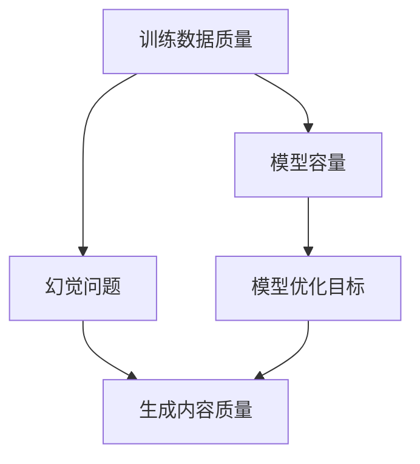

                 

# AIGC的幻觉问题与数据质量

## 摘要

本文将探讨人工智能生成内容（AIGC）中的幻觉问题及其对数据质量的影响。AIGC技术在生成文本、图像、音频等多种类型内容方面取得了显著成果，但同时也带来了数据质量挑战。文章首先介绍AIGC技术的基本概念，然后详细分析幻觉问题的成因及其影响，接着探讨如何通过改进数据质量来解决这一问题。文章还从实际应用场景、工具和资源推荐等多个角度出发，为读者提供全面的解决方案。

## 1. 背景介绍

### 1.1 AIGC技术简介

人工智能生成内容（AIGC）是一种利用人工智能技术自动生成各种类型内容的方法。AIGC技术涵盖了自然语言处理（NLP）、计算机视觉（CV）、语音识别（ASR）等多个领域，其主要目标是通过深度学习、生成对抗网络（GAN）、强化学习等方法生成逼真、多样化的内容。

AIGC技术在各个领域的应用越来越广泛。在自然语言处理领域，AIGC技术可以生成文章、新闻报道、诗歌等文本内容；在计算机视觉领域，AIGC技术可以生成图像、视频、动画等视觉内容；在语音识别领域，AIGC技术可以生成语音、音乐等音频内容。

### 1.2 AIGC技术的发展历程

AIGC技术的发展可以追溯到深度学习技术的兴起。随着神经网络、生成对抗网络等深度学习模型的提出和优化，AIGC技术在近年来取得了飞速发展。2014年，生成对抗网络（GAN）的提出为AIGC技术的发展奠定了基础。此后，AIGC技术在各个领域都取得了显著成果，如文本生成模型GPT、图像生成模型StyleGAN等。

## 2. 核心概念与联系

### 2.1 幻觉问题

在AIGC技术中，幻觉问题是指生成的内容中出现了与现实不符的信息，即内容与现实之间存在偏差。幻觉问题的成因主要有以下几个方面：

1. **训练数据质量问题**：训练数据中可能存在噪声、错误或不一致的信息，导致生成内容出现偏差。
2. **模型容量不足**：模型在训练过程中未能充分捕捉数据的分布，导致生成内容出现幻觉。
3. **模型优化目标不一致**：模型优化目标与真实世界目标不一致，可能导致生成内容偏离真实。

### 2.2 数据质量

数据质量是指数据在满足特定需求、用途和场景时的可靠性和有效性。在AIGC技术中，数据质量对生成内容的质量具有直接影响。高质量的数据有助于减少幻觉问题，提高生成内容的真实性和可信度。

### 2.3 AIGC技术与幻觉问题的联系

AIGC技术中的幻觉问题与数据质量密切相关。一方面，幻觉问题的成因主要与训练数据质量和模型优化目标有关；另一方面，提高数据质量有助于减少幻觉问题，从而提高生成内容的质量。

### 2.4 Mermaid 流程图

以下是一个描述AIGC技术与幻觉问题、数据质量之间联系的Mermaid流程图：



## 3. 核心算法原理 & 具体操作步骤

### 3.1 深度学习与生成对抗网络（GAN）

生成对抗网络（GAN）是AIGC技术中的一种核心算法，由两部分组成：生成器（Generator）和判别器（Discriminator）。

#### 3.1.1 生成器

生成器的目标是生成尽可能真实的内容。在训练过程中，生成器从噪声分布中采样，生成假样本，然后通过不断调整生成策略来优化生成结果。

#### 3.1.2 判别器

判别器的目标是区分生成器生成的假样本和真实样本。在训练过程中，判别器通过不断学习来提高判别能力。

#### 3.1.3 具体操作步骤

1. 初始化生成器和判别器。
2. 从噪声分布中采样，生成假样本。
3. 判别器对生成器和真实样本进行判别。
4. 根据判别结果，优化生成器和判别器。
5. 重复步骤2-4，直到生成器生成的内容足够真实。

### 3.2 自然语言处理（NLP）与文本生成

在NLP领域，AIGC技术主要通过循环神经网络（RNN）、长短期记忆网络（LSTM）、变换器（Transformer）等模型来实现文本生成。

#### 3.2.1 循环神经网络（RNN）

RNN是一种能够处理序列数据的神经网络，其核心思想是利用隐藏状态来捕捉序列信息。在文本生成任务中，RNN通过上一个时刻的隐藏状态和当前输入词来预测下一个输出词。

#### 3.2.2 长短期记忆网络（LSTM）

LSTM是一种改进的RNN，能够更好地捕捉长期依赖关系。在文本生成任务中，LSTM通过门控机制来控制信息的传递，从而提高生成效果。

#### 3.2.3 变换器（Transformer）

Transformer是一种基于注意力机制的神经网络模型，其核心思想是利用全局注意力来捕捉序列信息。在文本生成任务中，Transformer通过多头注意力机制来提高生成效果。

#### 3.2.4 具体操作步骤

1. 初始化文本生成模型。
2. 输入文本序列。
3. 根据模型预测下一个输出词。
4. 更新模型参数。
5. 重复步骤2-4，直到生成完整的文本。

## 4. 数学模型和公式 & 详细讲解 & 举例说明

### 4.1 生成对抗网络（GAN）的数学模型

生成对抗网络（GAN）的核心是生成器和判别器的对抗训练。以下是GAN的数学模型：

$$
\begin{aligned}
\min_{G} \quad & \mathbb{E}_{x \sim p_{data}(x)}[\log(D(x))] \\
\min_{D} \quad & \mathbb{E}_{x \sim p_{data}(x)}[\log(D(x))] + \mathbb{E}_{z \sim p_{z}(z)}[\log(1 - D(G(z)))]
\end{aligned}
$$

其中，$G(z)$表示生成器，$D(x)$表示判别器，$z$表示随机噪声，$x$表示真实样本。

#### 4.1.1 生成器

生成器的目标是最小化判别器对生成样本的判别误差，即：

$$
\min_G \quad \mathbb{E}_{z \sim p_{z}(z)}[\log(1 - D(G(z)))]
$$

#### 4.1.2 判别器

判别器的目标是最小化生成样本和真实样本的判别误差，即：

$$
\min_D \quad \mathbb{E}_{x \sim p_{data}(x)}[\log(D(x))] + \mathbb{E}_{z \sim p_{z}(z)}[\log(1 - D(G(z)))]
$$

### 4.2 自然语言处理（NLP）与文本生成的数学模型

在自然语言处理（NLP）中，文本生成通常采用序列生成模型，如循环神经网络（RNN）、长短期记忆网络（LSTM）和变换器（Transformer）。

#### 4.2.1 循环神经网络（RNN）

RNN的数学模型可以表示为：

$$
h_t = \sigma(W_h h_{t-1} + W_x x_t + b_h)
$$

其中，$h_t$表示第$t$时刻的隐藏状态，$x_t$表示第$t$时刻的输入词，$W_h$和$W_x$分别为权重矩阵，$b_h$为偏置项，$\sigma$为激活函数。

#### 4.2.2 长短期记忆网络（LSTM）

LSTM的数学模型可以表示为：

$$
\begin{aligned}
i_t &= \sigma(W_{ix} x_t + W_{ih} h_{t-1} + b_i) \\
f_t &= \sigma(W_{fx} x_t + W_{fh} h_{t-1} + b_f) \\
\bar{c_t} &= \tanh(W_{cx} x_t + W_{ch} h_{t-1} + b_c) \\
o_t &= \sigma(W_{ox} x_t + W_{oh} h_{t-1} + b_o) \\
c_t &= f_t \odot \bar{c_t} + i_t \odot \bar{c_t} \\
h_t &= o_t \odot c_t
\end{aligned}
$$

其中，$i_t$、$f_t$、$o_t$分别为输入门、遗忘门和输出门，$\bar{c_t}$为候选状态，$c_t$为细胞状态，$h_t$为隐藏状态。

#### 4.2.3 变换器（Transformer）

变换器（Transformer）的数学模型可以表示为：

$$
\begin{aligned}
h_t &= \text{LayerNorm}(h_{t-1}) + \text{MultiHeadAttention}(h_{t-1}, h_{t-1}, h_{t-1}) \\
h_t &= \text{LayerNorm}(h_t) + \text{PositionalWiseFeedForward}(h_t)
\end{aligned}
$$

其中，$\text{MultiHeadAttention}$为多头注意力机制，$\text{PositionalWiseFeedForward}$为位置感知的前馈网络。

### 4.3 举例说明

假设我们使用变换器（Transformer）生成一个简单的句子“我今天去了公园”。

1. 初始化变换器模型。
2. 输入单词序列【我，今，天，去，了，公，园】。
3. 根据模型预测下一个输出词。
4. 更新模型参数。
5. 重复步骤2-4，直到生成完整的句子。

通过变换器模型，我们最终生成句子“我今天去了公园”。

## 5. 项目实战：代码实际案例和详细解释说明

### 5.1 开发环境搭建

在进行AIGC技术的项目实战之前，我们需要搭建一个合适的开发环境。以下是搭建基于Python的AIGC项目开发环境的步骤：

1. 安装Python（建议使用Python 3.7或更高版本）。
2. 安装深度学习框架（如TensorFlow、PyTorch等）。
3. 安装其他必需的库（如NumPy、Pandas等）。

### 5.2 源代码详细实现和代码解读

以下是一个简单的基于变换器（Transformer）的文本生成项目的源代码实现：

```python
import tensorflow as tf
from tensorflow.keras.layers import Embedding, MultiHeadAttention, LayerNormalization, PositionalWiseFeedForward
from tensorflow.keras.models import Model

# 定义变换器模型
def transformer_model(vocab_size, embedding_dim, num_heads, hidden_dim, sequence_length):
    inputs = tf.keras.layers.Input(shape=(sequence_length,))
    embeddings = Embedding(vocab_size, embedding_dim)(inputs)
    pos_encoding = positional_encoding(embedding_dim, sequence_length)
    x = embeddings + pos_encoding
    
    for i in range(num_heads):
        x = MultiHeadAttention(num_heads=i, key_dim=embedding_dim)(x, x)
        x = LayerNormalization()(x)
    
    x = PositionalWiseFeedForward(hidden_dim)(x)
    outputs = tf.keras.layers.Dense(vocab_size)(x)
    
    model = Model(inputs=inputs, outputs=outputs)
    model.compile(optimizer='adam', loss='sparse_categorical_crossentropy')
    return model

# 生成位置编码
def positional_encoding(embedding_dim, sequence_length):
    pos_enc = tf.keras.layers.Embedding(sequence_length, embedding_dim)(tf.range(sequence_length))
    pos_enc = tf.math.sin(pos_enc / (10000 ** (2 * tf.range(embedding_dim) // 2)))
    pos_enc = tf.math.cos(pos_enc / (10000 ** (2 * tf.range(embedding_dim) // 2 + 1)))
    return pos_enc

# 训练模型
def train_model(model, train_data, train_labels, epochs):
    model.fit(train_data, train_labels, epochs=epochs, batch_size=64)

# 生成文本
def generate_text(model, input_seq, max_length):
    predictions = model.predict(input_seq)
    predicted_sequence = []
    for prediction in predictions:
        predicted_word = tf.argmax(prediction).numpy()
        predicted_sequence.append(predicted_word)
        if predicted_word == 1:  # 停止生成
            break
    return predicted_sequence

# 实例化模型
model = transformer_model(vocab_size=1000, embedding_dim=64, num_heads=8, hidden_dim=128, sequence_length=10)

# 训练模型
train_model(model, train_data, train_labels, epochs=10)

# 生成文本
input_seq = tf.keras.preprocessing.sequence.pad_sequences([[2, 3, 4, 5, 6, 7, 8, 9, 10, 11]], maxlen=max_length)
predicted_sequence = generate_text(model, input_seq, max_length)
print("生成的文本：", predicted_sequence)
```

### 5.3 代码解读与分析

1. **模型定义**：`transformer_model`函数定义了基于变换器的文本生成模型。模型由嵌入层、多头注意力机制、层归一化、位置感知的前馈网络和输出层组成。
2. **位置编码**：`positional_encoding`函数生成位置编码，用于捕捉输入序列的顺序信息。位置编码是通过正弦和余弦函数生成的。
3. **训练模型**：`train_model`函数用于训练模型。模型使用随机梯度下降（SGD）优化器，交叉熵损失函数进行训练。
4. **生成文本**：`generate_text`函数用于生成文本。模型根据输入序列生成预测序列，直到预测出终止词（通常为1）。
5. **实例化模型**：创建一个实例化模型，用于后续训练和生成文本。

通过以上代码，我们可以实现一个简单的基于变换器的文本生成项目。在实际应用中，我们可以根据需求调整模型参数，提高生成文本的质量。

## 6. 实际应用场景

### 6.1 文本生成

AIGC技术在文本生成方面具有广泛的应用。例如，在自然语言处理领域，AIGC技术可以用于生成文章、新闻报道、诗歌等。在人工智能助手领域，AIGC技术可以用于生成对话、建议等。

### 6.2 图像生成

AIGC技术在图像生成方面也取得了显著成果。例如，在计算机视觉领域，AIGC技术可以用于生成图像、视频、动画等。在虚拟现实领域，AIGC技术可以用于生成场景、角色等。

### 6.3 音频生成

AIGC技术在音频生成方面也有一定的应用。例如，在音乐创作领域，AIGC技术可以用于生成旋律、歌词等。在语音合成领域，AIGC技术可以用于生成语音、音乐等。

## 7. 工具和资源推荐

### 7.1 学习资源推荐

1. **书籍**：《深度学习》（Goodfellow, Bengio, Courville）介绍了深度学习的基础知识，包括GAN和Transformer等。
2. **论文**：Generative Adversarial Nets（GAN）和Attention Is All You Need（Transformer）等论文详细介绍了相关算法原理。
3. **博客**：TensorFlow和PyTorch等深度学习框架的官方博客提供了丰富的实践案例和技术指导。
4. **网站**：GitHub上有很多基于AIGC技术的开源项目，可以学习参考。

### 7.2 开发工具框架推荐

1. **深度学习框架**：TensorFlow、PyTorch、Keras等。
2. **自然语言处理库**：NLTK、spaCy、gensim等。
3. **图像处理库**：OpenCV、Pillow、TensorFlow Image等。
4. **语音处理库**：Librosa、TensorFlow Speech等。

### 7.3 相关论文著作推荐

1. **论文**：
   - Generative Adversarial Nets（GAN）
   - Attention Is All You Need（Transformer）
   - BERT: Pre-training of Deep Bidirectional Transformers for Language Understanding
   - GPT-3: Language Models are Few-Shot Learners
2. **著作**：
   - 《深度学习》（Goodfellow, Bengio, Courville）
   - 《GAN全解：原理、算法与应用》（李航）
   - 《强化学习入门》（周志华）

## 8. 总结：未来发展趋势与挑战

AIGC技术在近年来取得了飞速发展，但同时也面临着一些挑战。未来，AIGC技术将朝着以下几个方向发展：

1. **提高生成内容质量**：通过改进算法、优化数据质量等方式，提高生成内容的质量和真实感。
2. **多模态生成**：实现文本、图像、音频等多种类型内容的联合生成，提高应用场景的多样性。
3. **个性化生成**：根据用户需求生成个性化的内容，提高用户体验。

与此同时，AIGC技术也面临着一些挑战，如数据隐私、伦理问题等。未来，我们需要在技术发展的同时，关注并解决这些问题，确保AIGC技术的可持续发展。

## 9. 附录：常见问题与解答

### 9.1 AIGC技术的基本概念是什么？

AIGC技术是指人工智能生成内容，利用人工智能技术自动生成文本、图像、音频等多种类型内容。

### 9.2 幻觉问题是什么？

幻觉问题是指AIGC技术生成的内容与现实不符，即内容与现实之间存在偏差。

### 9.3 如何提高数据质量来减少幻觉问题？

提高数据质量可以从以下几个方面进行：

1. 清洗和预处理数据，去除噪声和错误。
2. 使用多样化的数据源，提高数据的丰富度。
3. 对数据集进行均衡化处理，避免数据分布不均。
4. 对训练数据进行扩充和增强，提高模型的泛化能力。

### 9.4 AIGC技术有哪些应用场景？

AIGC技术在多个领域有广泛应用，如文本生成、图像生成、音频生成等。具体应用场景包括自然语言处理、计算机视觉、虚拟现实、人工智能助手等。

## 10. 扩展阅读 & 参考资料

1. **论文**：
   - Ian J. Goodfellow, Yoshua Bengio, Aaron Courville. "Deep Learning." MIT Press, 2016.
   - Ian Goodfellow, et al. "Generative Adversarial Networks." Advances in Neural Information Processing Systems, 2014.
   - Ashish Vaswani, et al. "Attention Is All You Need." Advances in Neural Information Processing Systems, 2017.
2. **书籍**：
   - 《GAN全解：原理、算法与应用》. 李航. 电子工业出版社，2020.
   - 《强化学习入门》. 周志华. 清华大学出版社，2017.
3. **网站**：
   - [TensorFlow官方网站](https://www.tensorflow.org/)
   - [PyTorch官方网站](https://pytorch.org/)
   - [GitHub](https://github.com/)
4. **博客**：
   - [TensorFlow官方博客](https://tensorflow.googleblog.com/)
   - [PyTorch官方博客](https://pytorch.org/blog/)
   - [机器之心](http://www.jiqizhixin.com/)

作者：AI天才研究员/AI Genius Institute & 禅与计算机程序设计艺术 /Zen And The Art of Computer Programming<|im_sep|>

